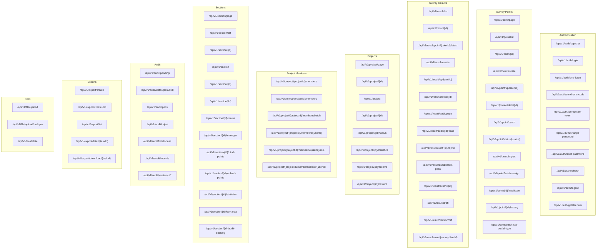
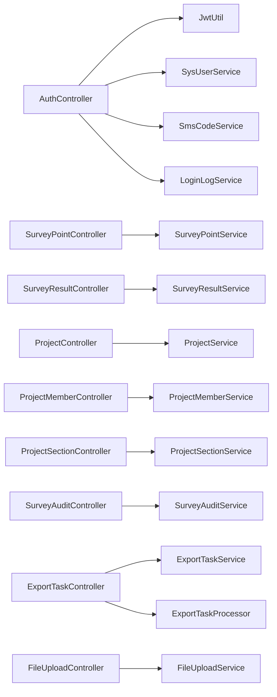

# API Reference

<cite>
**Referenced Files in This Document**
- [AuthController.java](file://admin-backend/src/main/java/com/qhiot/survey/controller/AuthController.java)
- [LoginRequest.java](file://admin-backend/src/main/java/com/qhiot/survey/dto/LoginRequest.java)
- [LoginResponse.java](file://admin-backend/src/main/java/com/qhiot/survey/dto/LoginResponse.java)
- [SurveyPointController.java](file://admin-backend/src/main/java/com/qhiot/survey/controller/SurveyPointController.java)
- [SurveyPointDTO.java](file://admin-backend/src/main/java/com/qhiot/survey/dto/SurveyPointDTO.java)
- [SurveyResultController.java](file://admin-backend/src/main/java/com/qhiot/survey/controller/SurveyResultController.java)
- [ProjectController.java](file://admin-backend/src/main/java/com/qhiot/survey/controller/ProjectController.java)
- [ProjectCreateRequest.java](file://admin-backend/src/main/java/com/qhiot/survey/dto/ProjectCreateRequest.java)
- [ProjectQueryRequest.java](file://admin-backend/src/main/java/com/qhiot/survey/dto/ProjectQueryRequest.java)
- [ProjectMemberController.java](file://admin-backend/src/main/java/com/qhiot/survey/controller/ProjectMemberController.java)
- [ProjectSectionController.java](file://admin-backend/src/main/java/com/qhiot/survey/controller/ProjectSectionController.java)
- [SurveyAuditController.java](file://admin-backend/src/main/java/com/qhiot/survey/controller/SurveyAuditController.java)
- [ExportTaskController.java](file://admin-backend/src/main/java/com/qhiot/survey/controller/ExportTaskController.java)
- [FileUploadController.java](file://admin-backend/src/main/java/com/qhiot/survey/controller/FileUploadController.java)
- [RateLimitInterceptor.java](file://admin-backend/src/main/java/com/qhiot/survey/common/RateLimitInterceptor.java)
- [application.yml](file://admin-backend/src/main/resources/application.yml)
</cite>

## Table of Contents
1. [Introduction](#introduction)
2. [Project Structure](#project-structure)
3. [Core Components](#core-components)
4. [Architecture Overview](#architecture-overview)
5. [Detailed Component Analysis](#detailed-component-analysis)
6. [Dependency Analysis](#dependency-analysis)
7. [Performance Considerations](#performance-considerations)
8. [Troubleshooting Guide](#troubleshooting-guide)
9. [Conclusion](#conclusion)
10. [Appendices](#appendices)

## Introduction
This document provides a comprehensive API reference for the Survey-App system. It covers authentication endpoints (login, logout, token refresh), survey point management (CRUD, bulk actions, filters), data collection endpoints (form submissions, image uploads, result processing), project management (members, sections/timeline, progress tracking), audit workflow endpoints (review and approvals), and export APIs (report generation and downloads). It also documents request/response schemas, authentication requirements, rate limiting, and API versioning strategy.

## Project Structure
The backend exposes REST APIs under the /api/v1/* namespace grouped by functional domains:
- Authentication: /api/v1/auth/*
- Survey Points: /api/v1/point/*
- Survey Results: /api/v1/result/*
- Projects: /api/v1/project/*
- Project Members: /api/v1/project/{projectId}/members/*
- Sections: /api/v1/section/*
- Audit: /api/v1/audit/*
- Exports: /api/v1/export/*
- Files: /api/v1/file/*

**Diagram sources**
- [AuthController.java:48-552](file://admin-backend/src/main/java/com/qhiot/survey/controller/AuthController.java#L48-L552)
- [SurveyPointController.java:24-142](file://admin-backend/src/main/java/com/qhiot/survey/controller/SurveyPointController.java#L24-L142)
- [SurveyResultController.java:26-181](file://admin-backend/src/main/java/com/qhiot/survey/controller/SurveyResultController.java#L26-L181)
- [ProjectController.java:26-145](file://admin-backend/src/main/java/com/qhiot/survey/controller/ProjectController.java#L26-L145)
- [ProjectMemberController.java:22-92](file://admin-backend/src/main/java/com/qhiot/survey/controller/ProjectMemberController.java#L22-L92)
- [ProjectSectionController.java:22-127](file://admin-backend/src/main/java/com/qhiot/survey/controller/ProjectSectionController.java#L22-L127)
- [SurveyAuditController.java:25-104](file://admin-backend/src/main/java/com/qhiot/survey/controller/SurveyAuditController.java#L25-L104)
- [ExportTaskController.java:36-142](file://admin-backend/src/main/java/com/qhiot/survey/controller/ExportTaskController.java#L36-L142)
- [FileUploadController.java:19-80](file://admin-backend/src/main/java/com/qhiot/survey/controller/FileUploadController.java#L19-L80)

**Section sources**
- [AuthController.java:48-552](file://admin-backend/src/main/java/com/qhiot/survey/controller/AuthController.java#L48-L552)
- [SurveyPointController.java:24-142](file://admin-backend/src/main/java/com/qhiot/survey/controller/SurveyPointController.java#L24-L142)
- [SurveyResultController.java:26-181](file://admin-backend/src/main/java/com/qhiot/survey/controller/SurveyResultController.java#L26-L181)
- [ProjectController.java:26-145](file://admin-backend/src/main/java/com/qhiot/survey/controller/ProjectController.java#L26-L145)
- [ProjectMemberController.java:22-92](file://admin-backend/src/main/java/com/qhiot/survey/controller/ProjectMemberController.java#L22-L92)
- [ProjectSectionController.java:22-127](file://admin-backend/src/main/java/com/qhiot/survey/controller/ProjectSectionController.java#L22-L127)
- [SurveyAuditController.java:25-104](file://admin-backend/src/main/java/com/qhiot/survey/controller/SurveyAuditController.java#L25-L104)
- [ExportTaskController.java:36-142](file://admin-backend/src/main/java/com/qhiot/survey/controller/ExportTaskController.java#L36-L142)
- [FileUploadController.java:19-80](file://admin-backend/src/main/java/com/qhiot/survey/controller/FileUploadController.java#L19-L80)

## Core Components
- API Versioning: All endpoints are prefixed with /api/v1, indicating a versioned API strategy. Backward compatibility is maintained by introducing new versions under /api/v2 while keeping /api/v1 unchanged.
- Authentication: JWT-based access tokens and refresh tokens. Endpoints require Authorization: Bearer <access_token> except public endpoints (login, captcha, SMS code).
- Rate Limiting: A global RateLimitInterceptor applies per-IP limits (default ~10 req/sec) excluding auth/public endpoints.
- File Upload: Multipart uploads to OSS with configurable max sizes.
- Security Roles: Endpoints enforce roles (COLLECTOR, AUDITOR, ADMIN) via @PreAuthorize annotations.

**Section sources**
- [application.yml:117-127](file://admin-backend/src/main/resources/application.yml#L117-L127)
- [RateLimitInterceptor.java:19-73](file://admin-backend/src/main/java/com/qhiot/survey/common/RateLimitInterceptor.java#L19-L73)

## Architecture Overview
The backend follows a layered architecture with controllers exposing REST endpoints, services implementing business logic, and repositories accessing the database. Authentication is handled centrally via JWT and Spring Security. File operations integrate with Alibaba Cloud OSS.

```mermaid
graph TB
Client["Client Apps<br/>Web/Mobile"] --> AuthCtrl["AuthController"]
Client --> PointCtrl["SurveyPointController"]
Client --> ResultCtrl["SurveyResultController"]
Client --> ProjCtrl["ProjectController"]
Client --> MemberCtrl["ProjectMemberController"]
Client --> SectCtrl["ProjectSectionController"]
Client --> AuditCtrl["SurveyAuditController"]
Client --> ExportCtrl["ExportTaskController"]
Client --> FileCtrl["FileUploadController"]
AuthCtrl --> JWT["JWT Utilities"]
AuthCtrl --> UserService["SysUserService"]
AuthCtrl --> SmsSvc["SmsCodeService"]
AuthCtrl --> LoginLogSvc["LoginLogService"]
PointCtrl --> PointSvc["SurveyPointService"]
ResultCtrl --> ResultSvc["SurveyResultService"]
ProjCtrl --> ProjSvc["ProjectService"]
MemberCtrl --> MemberSvc["ProjectMemberService"]
SectCtrl --> SectSvc["ProjectSectionService"]
AuditCtrl --> AuditSvc["SurveyAuditService"]
ExportCtrl --> ExportSvc["ExportTaskService"]
ExportCtrl --> ExportProc["ExportTaskProcessor"]
FileCtrl --> UploadSvc["FileUploadService"]
```

**Diagram sources**
- [AuthController.java:52-59](file://admin-backend/src/main/java/com/qhiot/survey/controller/AuthController.java#L52-L59)
- [SurveyPointController.java:27-28](file://admin-backend/src/main/java/com/qhiot/survey/controller/SurveyPointController.java#L27-L28)
- [SurveyResultController.java:30-31](file://admin-backend/src/main/java/com/qhiot/survey/controller/SurveyResultController.java#L30-L31)
- [ProjectController.java:30-31](file://admin-backend/src/main/java/com/qhiot/survey/controller/ProjectController.java#L30-L31)
- [ProjectMemberController.java:26-27](file://admin-backend/src/main/java/com/qhiot/survey/controller/ProjectMemberController.java#L26-L27)
- [ProjectSectionController.java:26-27](file://admin-backend/src/main/java/com/qhiot/survey/controller/ProjectSectionController.java#L26-L27)
- [SurveyAuditController.java:28-32](file://admin-backend/src/main/java/com/qhiot/survey/controller/SurveyAuditController.java#L28-L32)
- [ExportTaskController.java:39-46](file://admin-backend/src/main/java/com/qhiot/survey/controller/ExportTaskController.java#L39-L46)
- [FileUploadController.java:22-23](file://admin-backend/src/main/java/com/qhiot/survey/controller/FileUploadController.java#L22-L23)

## Detailed Component Analysis

### Authentication Endpoints
- Base Path: /api/v1/auth
- Authentication Required: None for login, captcha, SMS code; most endpoints require Authorization: Bearer <access_token>

Endpoints:
- GET /captcha
  - Description: Generates a 4-digit image captcha and returns Base64 PNG and a key. Key expires in minutes.
  - Response: { key, image[, code(dev/test only)] }
- POST /login
  - Description: Username/password login with captcha verification.
  - Request: LoginRequest { username, password, captcha, captchaKey }
  - Response: LoginResponse { accessToken, refreshToken, userId, username, realName, roleCodes[], permissions[], isFirstLogin, loginWarning }
- POST /sms-login
  - Description: SMS code login (no password).
  - Request: SmsLoginRequest { phone, code }
  - Response: LoginResponse
- POST /send-sms-code
  - Description: Send SMS code for login/reset.
  - Request: SmsCodeRequest { phone, scene: "login"|"reset" }
  - Response: boolean
- GET /idempotent-token
  - Description: Returns a short-lived idempotent token for preventing duplicate submissions.
  - Response: string token
- POST /change-password
  - Description: Change password for logged-in user.
  - Request: ChangePasswordRequest { oldPassword, newPassword }
  - Response: void
- POST /reset-password
  - Description: Reset password via SMS code (non-authenticated).
  - Request: SmsResetPasswordRequest { phone, code, newPassword }
  - Response: void
- POST /refresh
  - Description: Exchange refreshToken for new access/refresh tokens.
  - Query: refreshToken
  - Response: LoginResponse
- POST /logout
  - Description: Clear session context.
  - Response: void
- GET /getUserInfo
  - Description: Get current user info with roles and permissions.
  - Response: UserInfoResponse { userId, username, realName, roleCodes[], permissions[], buttons[] }

Authentication Requirements:
- Most endpoints require Authorization: Bearer <accessToken>.
- Refresh requires a valid refreshToken.

Rate Limiting:
- Default per-IP limit ~10 req/sec; login/public endpoints exempt.

Example Requests/Responses:
- Login Request (JSON):
  - { "username": "admin", "password": "Admin123!", "captcha": "1234", "captchaKey": "a1b2c3d4e5f6" }
- Login Response (JSON):
  - { "accessToken": "...", "refreshToken": "...", "userId": 1, "username": "admin", "realName": "Admin", "roleCodes": ["admin"], "permissions": ["..."], "isFirstLogin": false, "loginWarning": null }

**Section sources**
- [AuthController.java:74-487](file://admin-backend/src/main/java/com/qhiot/survey/controller/AuthController.java#L74-L487)
- [LoginRequest.java:11-24](file://admin-backend/src/main/java/com/qhiot/survey/dto/LoginRequest.java#L11-L24)
- [LoginResponse.java:17-55](file://admin-backend/src/main/java/com/qhiot/survey/dto/LoginResponse.java#L17-L55)
- [RateLimitInterceptor.java:36-54](file://admin-backend/src/main/java/com/qhiot/survey/common/RateLimitInterceptor.java#L36-L54)

### Survey Point Management Endpoints
- Base Path: /api/v1/point

Endpoints:
- GET /page
  - Query: projectId, sectionId, keyword, status, pageNum, pageSize
  - Response: Page<SurveyPointDTO>
- GET /list
  - Query: projectId (optional)
  - Response: List<SurveyPoint>
- GET /{id}
  - Path: id
  - Response: SurveyPoint
- POST /create
  - Body: SurveyPoint
  - Response: SurveyPoint
- PUT /update/{id}
  - Path: id; Body: SurveyPoint
  - Response: SurveyPoint
- DELETE /delete/{id}
  - Path: id
  - Response: void
- POST /batch
  - Body: List<SurveyPoint>
  - Response: boolean
- GET /status/{status}
  - Path: status
  - Response: List<SurveyPoint>
- POST /import
  - Form: file (Excel), projectId
  - Response: Map<String,Object> (import summary)
- POST /batch-assign
  - Query: projectId, assigneeId; Body: List<Long> pointIds
  - Response: void
- POST /{id}/invalidate
  - Path: id; Query: reason
  - Response: void
- GET /{id}/history
  - Path: id
  - Response: List<Map<String,Object>>
- POST /batch-set-outfall-type
  - Body: List<Long> pointIds, Query: outfallType
  - Response: void

Data Model: SurveyPointDTO extends SurveyPoint and adds projectName, projectCode, sectionName, collectorName, assigneeName.

**Section sources**
- [SurveyPointController.java:30-142](file://admin-backend/src/main/java/com/qhiot/survey/controller/SurveyPointController.java#L30-L142)
- [SurveyPointDTO.java:17-48](file://admin-backend/src/main/java/com/qhiot/survey/dto/SurveyPointDTO.java#L17-L48)

### Data Collection and Result Processing Endpoints
- Base Path: /api/v1/result

Endpoints:
- GET /list
  - Query: pointId (optional)
  - Response: List<SurveyResult>
- GET /{id}
  - Path: id
  - Response: SurveyResult
- GET /point/{pointId}/latest
  - Path: pointId
  - Response: SurveyResult
- POST /create
  - Role: COLLECTOR
  - Body: SurveyResult
  - Response: SurveyResult
- PUT /update/{id}
  - Role: COLLECTOR; Query: expectedVersion (optimistic locking)
  - Body: SurveyResult
  - Response: SurveyResult
- DELETE /delete/{id}
  - Role: ADMIN
  - Path: id
  - Response: boolean
- GET /audit/page
  - Role: AUDITOR; Query: projectId, sectionId, status, pageNum, pageSize
  - Response: PageResult<SurveyResult>
- POST /audit/{id}/pass
  - Role: AUDITOR; Query: auditRemark (optional)
  - Path: id
  - Response: boolean
- POST /audit/{id}/reject
  - Role: AUDITOR; Query: auditRemark (required)
  - Path: id
  - Response: boolean
- POST /audit/batch-pass
  - Role: AUDITOR; Body: List<Long> ids, Query: auditRemark (optional)
  - Response: boolean
- POST /submit/{id}
  - Role: COLLECTOR; Query: versionNo (optimistic locking)
  - Path: id
  - Response: boolean
- POST /draft
  - Role: COLLECTOR
  - Body: SurveyResult
  - Response: SurveyResult
- GET /version/diff
  - Role: ADMIN|AUDITOR|PROJECT_LEADER; Query: currentId, compareId
  - Response: Map<String,Object>
- GET /user/{surveyUserId}
  - Path: surveyUserId
  - Response: List<SurveyResult>

Optimistic Locking:
- update and submit endpoints accept expectedVersion/versionNo to detect concurrent conflicts.

**Section sources**
- [SurveyResultController.java:33-181](file://admin-backend/src/main/java/com/qhiot/survey/controller/SurveyResultController.java#L33-L181)

### Project Management Endpoints
- Base Path: /api/v1/project

Endpoints:
- GET /page
  - Query: ProjectQueryRequest (name/code/manager/region/status, pageNum, pageSize)
  - Response: PageResult<Project>
- GET /{id}
  - Path: id
  - Response: Project
- POST /
  - Role: ADMIN
  - Body: ProjectCreateRequest
  - Response: void
- PUT /{id}
  - Role: ADMIN
  - Path: id; Body: ProjectCreateRequest
  - Response: Project
- DELETE /{id}
  - Role: ADMIN
  - Path: id
  - Response: void
- PUT /{id}/status
  - Role: ADMIN; Query: targetStatus (0..4)
  - Path: id
  - Response: void
- GET /{id}/statistics
  - Path: id
  - Response: Map<String,Object>
- PUT /{id}/archive
  - Role: ADMIN
  - Path: id
  - Response: void
- PUT /{id}/restore
  - Role: ADMIN
  - Path: id
  - Response: void

**Section sources**
- [ProjectController.java:32-145](file://admin-backend/src/main/java/com/qhiot/survey/controller/ProjectController.java#L32-L145)
- [ProjectCreateRequest.java:13-38](file://admin-backend/src/main/java/com/qhiot/survey/dto/ProjectCreateRequest.java#L13-L38)
- [ProjectQueryRequest.java:11-33](file://admin-backend/src/main/java/com/qhiot/survey/dto/ProjectQueryRequest.java#L11-L33)

### Project Member Operations
- Base Path: /api/v1/project/{projectId}/members

Endpoints:
- GET /
  - Path: projectId
  - Response: List<ProjectMember>
- POST /
  - Role: ADMIN; Query: userId, role
  - Path: projectId
  - Response: boolean
- POST /batch
  - Role: ADMIN; Body: { userIds[], role }
  - Path: projectId
  - Response: integer count
- DELETE /{userId}
  - Role: ADMIN
  - Path: projectId, userId
  - Response: boolean
- PUT /{userId}/role
  - Role: ADMIN; Query: role
  - Path: projectId, userId
  - Response: boolean
- GET /check/{userId}
  - Path: projectId, userId
  - Response: { isMember, role }

**Section sources**
- [ProjectMemberController.java:28-92](file://admin-backend/src/main/java/com/qhiot/survey/controller/ProjectMemberController.java#L28-L92)

### Section/Timeline Management Endpoints
- Base Path: /api/v1/section

Endpoints:
- GET /page
  - Query: projectId, keyword, pageNum, pageSize
  - Response: Page<ProjectSection>
- GET /list
  - Query: projectId
  - Response: List<ProjectSection>
- GET /{id}
  - Path: id
  - Response: ProjectSection
- POST /
  - Body: ProjectSection
  - Response: ProjectSection
- PUT /{id}
  - Path: id; Body: ProjectSection
  - Response: ProjectSection
- DELETE /{id}
  - Path: id
  - Response: void
- PUT /{id}/status
  - Path: id; Query: status (0|1)
  - Response: void
- PUT /{id}/manager
  - Path: id; Query: managerId
  - Response: void
- POST /{id}/bind-points
  - Path: id; Body: List<Long> pointIds
  - Response: void
- POST /{id}/unbind-points
  - Path: id; Body: List<Long> pointIds
  - Response: void
- GET /{id}/statistics
  - Path: id
  - Response: Object
- PUT /{id}/key-area
  - Path: id; Query: isKeyArea (0|1)
  - Response: void
- GET /{id}/audit-backlog
  - Path: id
  - Response: Map<String,Object>

**Section sources**
- [ProjectSectionController.java:28-127](file://admin-backend/src/main/java/com/qhiot/survey/controller/ProjectSectionController.java#L28-L127)

### Audit Workflow Endpoints
- Base Path: /api/v1/audit

Endpoints:
- GET /pending
  - Query: keyword, pageNum, pageSize
  - Response: Page<SurveyResult>
- GET /detail/{resultId}
  - Path: resultId
  - Response: SurveyResult
- POST /pass
  - Query: resultId, comment
  - Response: void
- POST /reject
  - Query: resultId, comment, rejectTemplateId (optional)
  - Response: void
- POST /batch-pass
  - Body: List<Long> resultIds, Query: comment (optional)
  - Response: void
- GET /records
  - Query: pointId
  - Response: List<SurveyAuditRecord>
- GET /version-diff
  - Query: pointId, currentVersionId, compareVersionId
  - Response: Object

**Section sources**
- [SurveyAuditController.java:34-104](file://admin-backend/src/main/java/com/qhiot/survey/controller/SurveyAuditController.java#L34-L104)

### Export APIs
- Base Path: /api/v1/export

Endpoints:
- POST /create
  - Query: taskName, taskType ("excel"|"pdf"), projectId (optional)
  - Response: taskId (long)
- POST /create-pdf
  - Query: pointId, resultId (optional)
  - Response: taskId (long)
- GET /list
  - Response: List<ExportTask>
- GET /detail/{taskId}
  - Path: taskId
  - Response: ExportTask
- GET /download/{taskId}
  - Path: taskId
  - Response: 200 with file stream or 404/400/410 based on status/expiry

Download Rules:
- Only tasks with status=2 (completed) and not expired are downloadable.
- Expired tasks return 410.

**Section sources**
- [ExportTaskController.java:48-141](file://admin-backend/src/main/java/com/qhiot/survey/controller/ExportTaskController.java#L48-L141)

### File Upload Endpoints
- Base Path: /api/v1/file

Endpoints:
- POST /upload
  - Form: file
  - Response: { url, filename }
- POST /upload/multiple
  - Form: files[]
  - Response: { total, success, files: Map<filename,url|error> }
- DELETE /delete
  - Query: fileUrl
  - Response: boolean

Configuration:
- Max file size: 10MB; max request size: 50MB.

**Section sources**
- [FileUploadController.java:25-80](file://admin-backend/src/main/java/com/qhiot/survey/controller/FileUploadController.java#L25-L80)
- [application.yml:18-24](file://admin-backend/src/main/resources/application.yml#L18-L24)

## Dependency Analysis
- Controllers depend on services for business logic.
- Services depend on repositories and external integrations (OSS, SMS, Redis).
- JWT utilities and Spring Security handle authentication and authorization.
- Rate limiting is enforced globally via an interceptor.

**Diagram sources**
- [AuthController.java:52-59](file://admin-backend/src/main/java/com/qhiot/survey/controller/AuthController.java#L52-L59)
- [SurveyPointController.java:27-28](file://admin-backend/src/main/java/com/qhiot/survey/controller/SurveyPointController.java#L27-L28)
- [SurveyResultController.java:30-31](file://admin-backend/src/main/java/com/qhiot/survey/controller/SurveyResultController.java#L30-L31)
- [ProjectController.java:30-31](file://admin-backend/src/main/java/com/qhiot/survey/controller/ProjectController.java#L30-L31)
- [ProjectMemberController.java:26-27](file://admin-backend/src/main/java/com/qhiot/survey/controller/ProjectMemberController.java#L26-L27)
- [ProjectSectionController.java:26-27](file://admin-backend/src/main/java/com/qhiot/survey/controller/ProjectSectionController.java#L26-L27)
- [SurveyAuditController.java:28-32](file://admin-backend/src/main/java/com/qhiot/survey/controller/SurveyAuditController.java#L28-L32)
- [ExportTaskController.java:39-46](file://admin-backend/src/main/java/com/qhiot/survey/controller/ExportTaskController.java#L39-L46)
- [FileUploadController.java:22-23](file://admin-backend/src/main/java/com/qhiot/survey/controller/FileUploadController.java#L22-L23)

**Section sources**
- [AuthController.java:52-59](file://admin-backend/src/main/java/com/qhiot/survey/controller/AuthController.java#L52-L59)
- [SurveyPointController.java:27-28](file://admin-backend/src/main/java/com/qhiot/survey/controller/SurveyPointController.java#L27-L28)
- [SurveyResultController.java:30-31](file://admin-backend/src/main/java/com/qhiot/survey/controller/SurveyResultController.java#L30-L31)
- [ProjectController.java:30-31](file://admin-backend/src/main/java/com/qhiot/survey/controller/ProjectController.java#L30-L31)
- [ProjectMemberController.java:26-27](file://admin-backend/src/main/java/com/qhiot/survey/controller/ProjectMemberController.java#L26-L27)
- [ProjectSectionController.java:26-27](file://admin-backend/src/main/java/com/qhiot/survey/controller/ProjectSectionController.java#L26-L27)
- [SurveyAuditController.java:28-32](file://admin-backend/src/main/java/com/qhiot/survey/controller/SurveyAuditController.java#L28-L32)
- [ExportTaskController.java:39-46](file://admin-backend/src/main/java/com/qhiot/survey/controller/ExportTaskController.java#L39-L46)
- [FileUploadController.java:22-23](file://admin-backend/src/main/java/com/qhiot/survey/controller/FileUploadController.java#L22-L23)

## Performance Considerations
- Rate Limiting: Default ~10 req/sec per IP; adjust via RateLimiter configuration.
- File Upload Limits: Respect max file/request sizes to avoid memory pressure.
- Pagination: Use page-based endpoints for large datasets (e.g., /page, /audit/page).
- Optimistic Locking: Use versionNo/version to reduce conflicts and retries.
- Caching: Leverage Redis for short-lived tokens and captcha codes.

[No sources needed since this section provides general guidance]

## Troubleshooting Guide
Common Issues and Remedies:
- 401 Unauthorized: Missing or invalid Authorization header; ensure Bearer <accessToken> is present.
- 403 Forbidden: Insufficient roles (e.g., ADMIN, AUDITOR, COLLECTOR).
- 409 Conflict: Optimistic locking failure; retry with latest versionNo.
- 410 Gone: Export download attempted after expiry; recreate task.
- 429 Too Many Requests: Rate limit exceeded; wait or adjust client-side throttling.
- 413 Payload Too Large: File exceeds configured limits; split or compress.

**Section sources**
- [RateLimitInterceptor.java:45-51](file://admin-backend/src/main/java/com/qhiot/survey/common/RateLimitInterceptor.java#L45-L51)
- [ExportTaskController.java:94-97](file://admin-backend/src/main/java/com/qhiot/survey/controller/ExportTaskController.java#L94-L97)

## Conclusion
The Survey-App API provides a comprehensive, versioned interface for authentication, survey point management, data collection, project administration, auditing, exports, and file handling. It emphasizes security (JWT, role-based access), reliability (rate limiting, optimistic locking), and scalability (pagination, async exports). Clients should adhere to the documented schemas, authentication requirements, and rate limits for robust operation.

[No sources needed since this section summarizes without analyzing specific files]

## Appendices

### API Versioning and Backward Compatibility
- Versioning Strategy: All endpoints under /api/v1. Introduce /api/v2 for breaking changes; keep /api/v1 stable.
- Backward Compatibility: Maintain existing endpoints and schemas; deprecate with notice before removal.

**Section sources**
- [application.yml:117-127](file://admin-backend/src/main/resources/application.yml#L117-L127)

### Request/Response Examples Index
- Authentication
  - POST /api/v1/auth/login
    - Request: LoginRequest
    - Response: LoginResponse
- Survey Points
  - GET /api/v1/point/page
    - Response: Page<SurveyPointDTO>
- Survey Results
  - POST /api/v1/result/create
    - Role: COLLECTOR
    - Response: SurveyResult
  - POST /api/v1/result/audit/{id}/pass
    - Role: AUDITOR
    - Response: boolean
- Projects
  - POST /api/v1/project
    - Role: ADMIN
    - Request: ProjectCreateRequest
    - Response: void
- Exports
  - POST /api/v1/export/create
    - Response: taskId (long)
  - GET /api/v1/export/download/{taskId}
    - Response: 200 with file or 410 if expired

**Section sources**
- [AuthController.java:138-238](file://admin-backend/src/main/java/com/qhiot/survey/controller/AuthController.java#L138-L238)
- [SurveyPointController.java:30-40](file://admin-backend/src/main/java/com/qhiot/survey/controller/SurveyPointController.java#L30-L40)
- [SurveyResultController.java:59-65](file://admin-backend/src/main/java/com/qhiot/survey/controller/SurveyResultController.java#L59-L65)
- [ProjectController.java:52-68](file://admin-backend/src/main/java/com/qhiot/survey/controller/ProjectController.java#L52-L68)
- [ExportTaskController.java:48-57](file://admin-backend/src/main/java/com/qhiot/survey/controller/ExportTaskController.java#L48-L57)