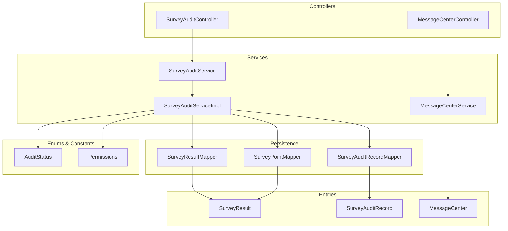
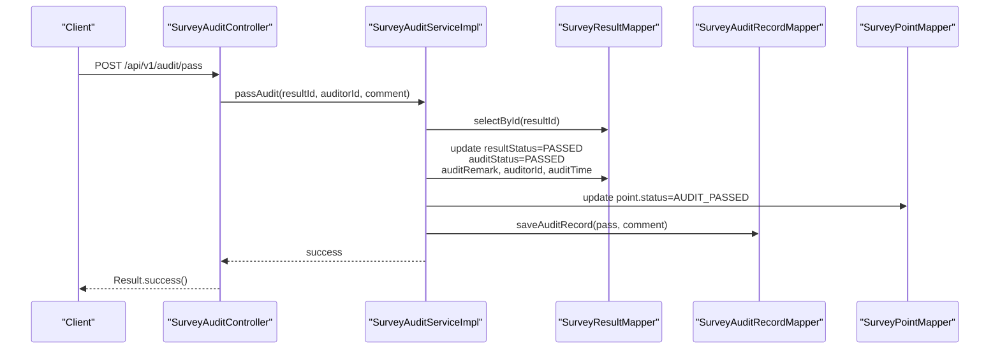
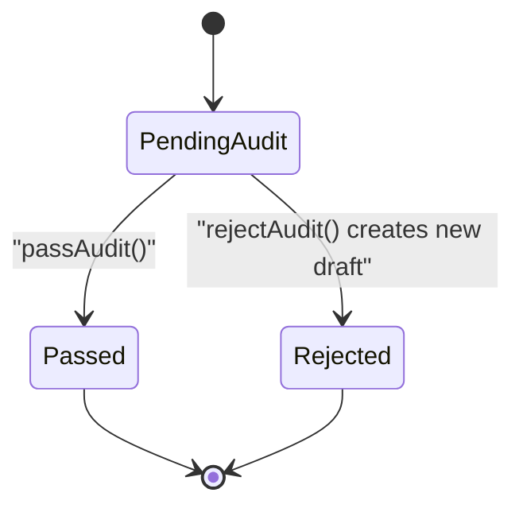
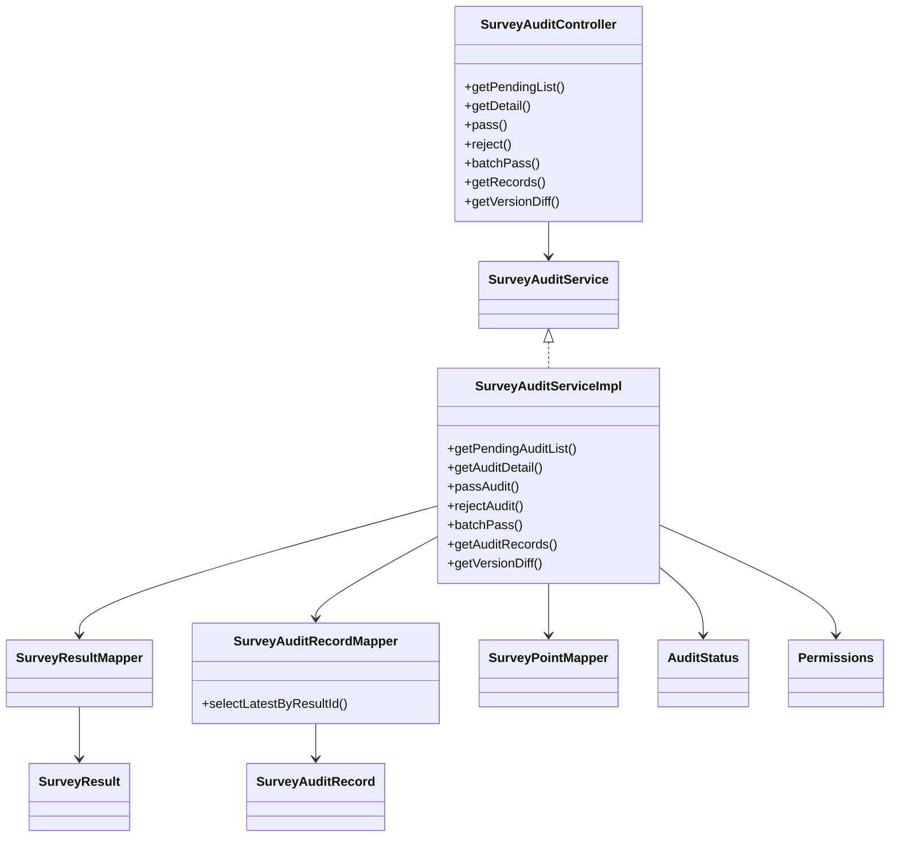
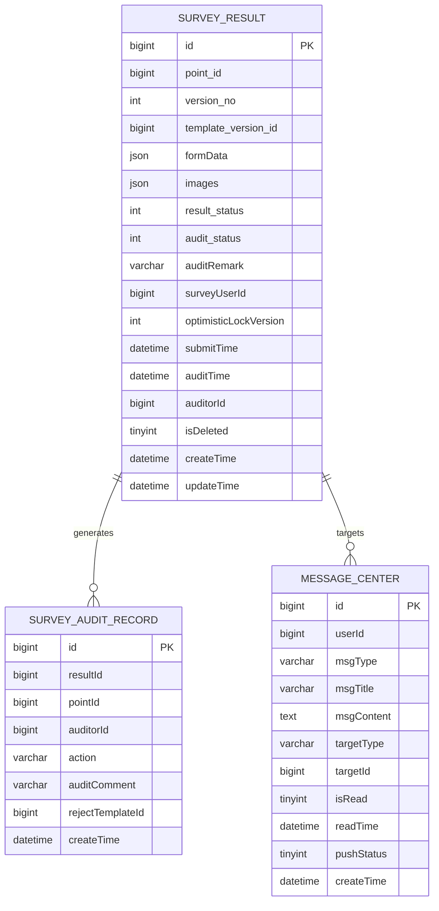

# Audit & Workflow API

<cite>
**Referenced Files in This Document**
- [SurveyAuditController.java](file://admin-backend/src/main/java/com/qhiot/survey/controller/SurveyAuditController.java)
- [SurveyAuditService.java](file://admin-backend/src/main/java/com/qhiot/survey/service/SurveyAuditService.java)
- [SurveyAuditServiceImpl.java](file://admin-backend/src/main/java/com/qhiot/survey/service/impl/SurveyAuditServiceImpl.java)
- [SurveyAuditRecord.java](file://admin-backend/src/main/java/com/qhiot/survey/entity/SurveyAuditRecord.java)
- [SurveyAuditRecordMapper.java](file://admin-backend/src/main/java/com/qhiot/survey/mapper/SurveyAuditRecordMapper.java)
- [SurveyResult.java](file://admin-backend/src/main/java/com/qhiot/survey/entity/SurveyResult.java)
- [AuditStatus.java](file://admin-backend/src/main/java/com/qhiot/survey/common/enums/AuditStatus.java)
- [Permissions.java](file://admin-backend/src/main/java/com/qhiot/survey/common/constant/Permissions.java)
- [MessageCenterController.java](file://admin-backend/src/main/java/com/qhiot/survey/controller/MessageCenterController.java)
- [MessageCenterService.java](file://admin-backend/src/main/java/com/qhiot/survey/service/MessageCenterService.java)
- [MessageCenter.java](file://admin-backend/src/main/java/com/qhiot/survey/entity/MessageCenter.java)
- [01-init.sql](file://admin-backend/init-data/01-init.sql)
- [05-database-indexes.sql](file://admin-backend/init-data/05-database-indexes.sql)
- [PdfGeneratorUtil.java](file://admin-backend/src/main/java/com/qhiot/survey/common/util/PdfGeneratorUtil.java)
</cite>

## Table of Contents
1. [Introduction](#introduction)
2. [Project Structure](#project-structure)
3. [Core Components](#core-components)
4. [Architecture Overview](#architecture-overview)
5. [Detailed Component Analysis](#detailed-component-analysis)
6. [Dependency Analysis](#dependency-analysis)
7. [Performance Considerations](#performance-considerations)
8. [Troubleshooting Guide](#troubleshooting-guide)
9. [Conclusion](#conclusion)
10. [Appendices](#appendices)

## Introduction
This document provides comprehensive API documentation for the audit and approval workflow endpoints. It covers the complete audit trail system including review requests, approval processes, and rejection workflows. It also documents status tracking for audit records, workflow state management, notification systems for audit actions and status changes, role-based access controls for audit participants, audit report generation, compliance tracking, and integration with survey result processing and project management systems.

## Project Structure
The audit workflow spans the controller, service, persistence, and messaging layers. Controllers expose REST endpoints; services orchestrate business logic and transactions; mappers handle persistence; entities model domain data; enums define statuses; permissions enforce access control; and the message center supports notifications.

**Diagram sources**
- [SurveyAuditController.java:23-104](file://admin-backend/src/main/java/com/qhiot/survey/controller/SurveyAuditController.java#L23-L104)
- [SurveyAuditService.java:12-48](file://admin-backend/src/main/java/com/qhiot/survey/service/SurveyAuditService.java#L12-L48)
- [SurveyAuditServiceImpl.java:31-190](file://admin-backend/src/main/java/com/qhiot/survey/service/impl/SurveyAuditServiceImpl.java#L31-L190)
- [SurveyAuditRecordMapper.java:10-22](file://admin-backend/src/main/java/com/qhiot/survey/mapper/SurveyAuditRecordMapper.java#L10-L22)
- [SurveyResult.java:16-93](file://admin-backend/src/main/java/com/qhiot/survey/entity/SurveyResult.java#L16-L93)
- [SurveyAuditRecord.java:15-37](file://admin-backend/src/main/java/com/qhiot/survey/entity/SurveyAuditRecord.java#L15-L37)
- [MessageCenter.java:15-49](file://admin-backend/src/main/java/com/qhiot/survey/entity/MessageCenter.java#L15-L49)
- [AuditStatus.java:9-30](file://admin-backend/src/main/java/com/qhiot/survey/common/enums/AuditStatus.java#L9-L30)
- [Permissions.java:9-81](file://admin-backend/src/main/java/com/qhiot/survey/common/constant/Permissions.java#L9-L81)

**Section sources**
- [SurveyAuditController.java:23-104](file://admin-backend/src/main/java/com/qhiot/survey/controller/SurveyAuditController.java#L23-L104)
- [SurveyAuditService.java:12-48](file://admin-backend/src/main/java/com/qhiot/survey/service/SurveyAuditService.java#L12-L48)
- [SurveyAuditServiceImpl.java:31-190](file://admin-backend/src/main/java/com/qhiot/survey/service/impl/SurveyAuditServiceImpl.java#L31-L190)
- [SurveyAuditRecordMapper.java:10-22](file://admin-backend/src/main/java/com/qhiot/survey/mapper/SurveyAuditRecordMapper.java#L10-L22)
- [SurveyResult.java:16-93](file://admin-backend/src/main/java/com/qhiot/survey/entity/SurveyResult.java#L16-L93)
- [SurveyAuditRecord.java:15-37](file://admin-backend/src/main/java/com/qhiot/survey/entity/SurveyAuditRecord.java#L15-L37)
- [MessageCenter.java:15-49](file://admin-backend/src/main/java/com/qhiot/survey/entity/MessageCenter.java#L15-L49)
- [AuditStatus.java:9-30](file://admin-backend/src/main/java/com/qhiot/survey/common/enums/AuditStatus.java#L9-L30)
- [Permissions.java:9-81](file://admin-backend/src/main/java/com/qhiot/survey/common/constant/Permissions.java#L9-L81)

## Core Components
- Audit Controller: Exposes endpoints for pending audits, detail retrieval, approvals, rejections, batch approvals, audit records, and version differences.
- Audit Service: Defines the contract for audit operations and delegates to the implementation.
- Audit Service Implementation: Implements audit logic, updates statuses, creates audit records, and manages version drafts on rejection.
- Audit Record Entity and Mapper: Persist audit actions and provide latest record lookup.
- Result Entity: Stores survey results with status, audit status, comments, timestamps, and references.
- Enums and Permissions: Define audit states and access control codes.
- Message Center: Manages notifications and messages for audit reminders and other system events.

**Section sources**
- [SurveyAuditController.java:34-91](file://admin-backend/src/main/java/com/qhiot/survey/controller/SurveyAuditController.java#L34-L91)
- [SurveyAuditService.java:14-47](file://admin-backend/src/main/java/com/qhiot/survey/service/SurveyAuditService.java#L14-L47)
- [SurveyAuditServiceImpl.java:42-178](file://admin-backend/src/main/java/com/qhiot/survey/service/impl/SurveyAuditServiceImpl.java#L42-L178)
- [SurveyAuditRecord.java:18-36](file://admin-backend/src/main/java/com/qhiot/survey/entity/SurveyAuditRecord.java#L18-L36)
- [SurveyAuditRecordMapper.java:17-20](file://admin-backend/src/main/java/com/qhiot/survey/mapper/SurveyAuditRecordMapper.java#L17-L20)
- [SurveyResult.java:46-82](file://admin-backend/src/main/java/com/qhiot/survey/entity/SurveyResult.java#L46-L82)
- [AuditStatus.java:10-12](file://admin-backend/src/main/java/com/qhiot/survey/common/enums/AuditStatus.java#L10-L12)
- [Permissions.java:44-51](file://admin-backend/src/main/java/com/qhiot/survey/common/constant/Permissions.java#L44-L51)

## Architecture Overview
The audit workflow follows a layered architecture:
- Presentation: REST endpoints exposed via controllers.
- Application: Services encapsulate business rules and coordinate transactions.
- Persistence: MyBatis mappers interact with the database.
- Domain: Entities represent audit records, results, and messages.
- Security: Permissions govern who can perform audit actions.

**Diagram sources**
- [SurveyAuditController.java:50-57](file://admin-backend/src/main/java/com/qhiot/survey/controller/SurveyAuditController.java#L50-L57)
- [SurveyAuditServiceImpl.java:64-93](file://admin-backend/src/main/java/com/qhiot/survey/service/impl/SurveyAuditServiceImpl.java#L64-L93)
- [SurveyAuditRecordMapper.java:10-22](file://admin-backend/src/main/java/com/qhiot/survey/mapper/SurveyAuditRecordMapper.java#L10-L22)
- [SurveyResult.java:46-82](file://admin-backend/src/main/java/com/qhiot/survey/entity/SurveyResult.java#L46-L82)
- [SurveyAuditRecord.java:28-34](file://admin-backend/src/main/java/com/qhiot/survey/entity/SurveyAuditRecord.java#L28-L34)

## Detailed Component Analysis

### Audit Endpoints
- GET /api/v1/audit/pending
  - Description: Retrieve paginated pending audit list for the current auditor.
  - Auth: Requires login; auditor ID derived from current user.
  - Query params: keyword (optional), pageNum (default 1), pageSize (default 10).
  - Response: Page of SurveyResult items filtered by pending audit status and ordered by submit time.

- GET /api/v1/audit/detail/{resultId}
  - Description: Get audit detail for a given result ID.
  - Path param: resultId (Long).
  - Response: SurveyResult.

- POST /api/v1/audit/pass
  - Description: Approve a pending audit result.
  - Form params: resultId (Long), comment (String).
  - Response: Success.

- POST /api/v1/audit/reject
  - Description: Reject a pending audit result; creates a new draft version.
  - Form params: resultId (Long), comment (String), rejectTemplateId (Long, optional).
  - Response: Success.

- POST /api/v1/audit/batch-pass
  - Description: Batch approve multiple results.
  - Body: Array of result IDs (Long), optional comment (String).
  - Response: Success.

- GET /api/v1/audit/records
  - Description: Fetch all audit records for a point ID.
  - Query params: pointId (Long).
  - Response: List of SurveyAuditRecord.

- GET /api/v1/audit/version-diff
  - Description: Compare two versions of a point’s survey results.
  - Query params: pointId (Long), currentVersionId (Long), compareVersionId (Long).
  - Response: Object containing currentVersion, compareVersion, currentData, compareData.

**Section sources**
- [SurveyAuditController.java:34-91](file://admin-backend/src/main/java/com/qhiot/survey/controller/SurveyAuditController.java#L34-L91)

### Audit Workflow Transitions

- PendingAudit: Initial state for submitted results awaiting review.
- Passed: Approved result; updates result and point statuses.
- Rejected: Rejected result; original marked rejected, new draft created with incremented version.

**Diagram sources**
- [SurveyAuditServiceImpl.java:64-141](file://admin-backend/src/main/java/com/qhiot/survey/service/impl/SurveyAuditServiceImpl.java#L64-L141)
- [SurveyResult.java:46-52](file://admin-backend/src/main/java/com/qhiot/survey/entity/SurveyResult.java#L46-L52)

**Section sources**
- [SurveyAuditServiceImpl.java:64-141](file://admin-backend/src/main/java/com/qhiot/survey/service/impl/SurveyAuditServiceImpl.java#L64-L141)
- [SurveyResult.java:46-82](file://admin-backend/src/main/java/com/qhiot/survey/entity/SurveyResult.java#L46-L82)

### Audit Records and Status Tracking
- AuditStatus Enum: PENDING (0), PASSED (1), REJECTED (2).
- SurveyResult fields:
  - resultStatus: 0 draft, 1 submitted, 2 pending audit, 3 passed, 4 rejected, 5 archived.
  - auditStatus: redundant field for quick filtering (0 pending, 1 passed, 2 rejected).
- SurveyAuditRecord captures:
  - resultId, pointId, auditorId, action ("pass" or "reject"), auditComment, rejectTemplateId, createTime.

**Section sources**
- [AuditStatus.java:10-12](file://admin-backend/src/main/java/com/qhiot/survey/common/enums/AuditStatus.java#L10-L12)
- [SurveyResult.java:46-82](file://admin-backend/src/main/java/com/qhiot/survey/entity/SurveyResult.java#L46-L82)
- [SurveyAuditRecord.java:28-34](file://admin-backend/src/main/java/com/qhiot/survey/entity/SurveyAuditRecord.java#L28-L34)

### Notification System for Audit Actions
- MessageCenter Types: audit_reminder, project_delay, template_publish, export_complete, collab_expire, risk_alert.
- MessageCenterController endpoints:
  - GET /api/v1/message/page: Paginated message list for current user.
  - GET /api/v1/message/unread-count: Unread count for current user.
  - PUT /api/v1/message/{messageId}/read: Mark single message as read.
  - PUT /api/v1/message/read-all: Mark all unread messages as read.
  - GET /api/v1/message/{id}: Get message by ID.
  - POST /api/v1/message/push/roles: Push message to users with specific roles (ADMIN required).
  - POST /api/v1/message/push/users: Push message to specific user IDs (ADMIN required).

- MessageCenter entity fields:
  - userId, msgType, msgTitle, msgContent, targetType, targetId, isRead, readTime, pushStatus, createTime.

- Audit-related triggers:
  - On approval/rejection, audit records are persisted; administrators can push audit_reminder notifications to relevant users.

**Section sources**
- [MessageCenterController.java:34-99](file://admin-backend/src/main/java/com/qhiot/survey/controller/MessageCenterController.java#L34-L99)
- [MessageCenterService.java:14-57](file://admin-backend/src/main/java/com/qhiot/survey/service/MessageCenterService.java#L14-L57)
- [MessageCenter.java:24-46](file://admin-backend/src/main/java/com/qhiot/survey/entity/MessageCenter.java#L24-L46)
- [01-init.sql:356-371](file://admin-backend/init-data/01-init.sql#L356-L371)

### Role-Based Access Controls
- Permissions:
  - AUDIT_VIEW, AUDIT_PASS, AUDIT_REJECT for audit operations.
  - ADMIN required for pushing messages to roles/users.
- Usage:
  - Controllers use @PreAuthorize("hasAuthority('...')") for endpoint protection.
  - Frontend directives use v-permission="'...'" for UI-level gating.

**Section sources**
- [Permissions.java:44-51](file://admin-backend/src/main/java/com/qhiot/survey/common/constant/Permissions.java#L44-L51)
- [MessageCenterController.java:77-91](file://admin-backend/src/main/java/com/qhiot/survey/controller/MessageCenterController.java#L77-L91)

### Audit Report Generation and Compliance Tracking
- PDF Generation:
  - PdfGeneratorUtil can render audit information tables with fields such as audit status, auditor name, audit time, and audit comment.
- Compliance:
  - Audit trail stored in survey_audit_record enables compliance tracking.
  - Indexes on survey_result and survey_audit_record optimize reporting and filtering.

**Section sources**
- [PdfGeneratorUtil.java:190-207](file://admin-backend/src/main/java/com/qhiot/survey/common/util/PdfGeneratorUtil.java#L190-L207)
- [05-database-indexes.sql:87-99](file://admin-backend/init-data/05-database-indexes.sql#L87-L99)

### Integration with Survey Result Processing and Project Management
- SurveyResultMapper and SurveyPointMapper integrate audit decisions with survey lifecycle and point status.
- Versioning:
  - On rejection, a new draft version is created with incremented versionNo, preserving original data while allowing resubmission.

**Section sources**
- [SurveyAuditServiceImpl.java:109-120](file://admin-backend/src/main/java/com/qhiot/survey/service/impl/SurveyAuditServiceImpl.java#L109-L120)
- [SurveyResult.java:27-32](file://admin-backend/src/main/java/com/qhiot/survey/entity/SurveyResult.java#L27-L32)

## Dependency Analysis

**Diagram sources**
- [SurveyAuditController.java:23-104](file://admin-backend/src/main/java/com/qhiot/survey/controller/SurveyAuditController.java#L23-L104)
- [SurveyAuditService.java:12-48](file://admin-backend/src/main/java/com/qhiot/survey/service/SurveyAuditService.java#L12-L48)
- [SurveyAuditServiceImpl.java:31-190](file://admin-backend/src/main/java/com/qhiot/survey/service/impl/SurveyAuditServiceImpl.java#L31-L190)
- [SurveyAuditRecordMapper.java:10-22](file://admin-backend/src/main/java/com/qhiot/survey/mapper/SurveyAuditRecordMapper.java#L10-L22)
- [SurveyResult.java:16-93](file://admin-backend/src/main/java/com/qhiot/survey/entity/SurveyResult.java#L16-L93)
- [SurveyAuditRecord.java:15-37](file://admin-backend/src/main/java/com/qhiot/survey/entity/SurveyAuditRecord.java#L15-L37)
- [AuditStatus.java:9-30](file://admin-backend/src/main/java/com/qhiot/survey/common/enums/AuditStatus.java#L9-L30)
- [Permissions.java:9-81](file://admin-backend/src/main/java/com/qhiot/survey/common/constant/Permissions.java#L9-L81)

**Section sources**
- [SurveyAuditServiceImpl.java:31-190](file://admin-backend/src/main/java/com/qhiot/survey/service/impl/SurveyAuditServiceImpl.java#L31-L190)
- [SurveyAuditRecordMapper.java:10-22](file://admin-backend/src/main/java/com/qhiot/survey/mapper/SurveyAuditRecordMapper.java#L10-L22)

## Performance Considerations
- Database Indexes:
  - survey_result: idx_sr_result_status, idx_sr_audit_status, idx_sr_point_version, idx_sr_survey_user, idx_sr_create_time.
  - survey_audit_record: idx_sar_result, idx_sar_point, idx_sar_auditor, idx_sar_create_time.
- Recommendations:
  - Use pagination and filters for pending lists.
  - Prefer querying by indexed columns (result_status, audit_status, point_id).
  - Batch operations (e.g., batchPass) should be used judiciously to avoid long-running transactions.

**Section sources**
- [05-database-indexes.sql:87-99](file://admin-backend/init-data/05-database-indexes.sql#L87-L99)

## Troubleshooting Guide
- Common Issues:
  - Unauthorized access: Ensure the user has AUDIT_* permissions.
  - Invalid result ID: Verify the result exists and is in PENDING_AUDIT status.
  - Missing comment on rejection: Rejection requires a non-empty comment.
  - Batch operation failures: Individual result failures are logged; review service logs for details.
- Logging:
  - Audit actions are logged with operation logs; errors are captured and logged during batch processing.

**Section sources**
- [SurveyAuditServiceImpl.java:67-72](file://admin-backend/src/main/java/com/qhiot/survey/service/impl/SurveyAuditServiceImpl.java#L67-L72)
- [SurveyAuditServiceImpl.java:105-107](file://admin-backend/src/main/java/com/qhiot/survey/service/impl/SurveyAuditServiceImpl.java#L105-L107)
- [SurveyAuditController.java:52-67](file://admin-backend/src/main/java/com/qhiot/survey/controller/SurveyAuditController.java#L52-L67)

## Conclusion
The audit and workflow API provides a robust foundation for managing survey result reviews, approvals, and rejections. It integrates tightly with messaging for notifications, enforces role-based access control, maintains a complete audit trail, and supports compliance reporting. Proper indexing and batch operations ensure scalability and reliability.

## Appendices

### API Definitions

- GET /api/v1/audit/pending
  - Query params: keyword (string), pageNum (integer, default 1), pageSize (integer, default 10)
  - Response: Page of SurveyResult

- GET /api/v1/audit/detail/{resultId}
  - Path params: resultId (long)
  - Response: SurveyResult

- POST /api/v1/audit/pass
  - Form params: resultId (long), comment (string)
  - Response: Success

- POST /api/v1/audit/reject
  - Form params: resultId (long), comment (string), rejectTemplateId (long, optional)
  - Response: Success

- POST /api/v1/audit/batch-pass
  - Body: resultIds (array of long), comment (string, optional)
  - Response: Success

- GET /api/v1/audit/records
  - Query params: pointId (long)
  - Response: List of SurveyAuditRecord

- GET /api/v1/audit/version-diff
  - Query params: pointId (long), currentVersionId (long), compareVersionId (long)
  - Response: Object with currentVersion, compareVersion, currentData, compareData

- GET /api/v1/message/page
  - Query params: type (integer, optional), pageNum (integer, default 1), pageSize (integer, default 10)
  - Response: Page of MessageCenter

- GET /api/v1/message/unread-count
  - Response: Unread count (long)

- PUT /api/v1/message/{messageId}/read
  - Path params: messageId (long)
  - Response: Success

- PUT /api/v1/message/read-all
  - Response: Success

- GET /api/v1/message/{id}
  - Path params: id (long)
  - Response: MessageCenter

- POST /api/v1/message/push/roles
  - Form params: title (string), content (string), type (string), roles (string, optional)
  - Response: Count of pushed messages (integer)

- POST /api/v1/message/push/users
  - Body: title (string), content (string), type (string), userIds (array of long)
  - Response: Count of pushed messages (integer)

**Section sources**
- [SurveyAuditController.java:34-91](file://admin-backend/src/main/java/com/qhiot/survey/controller/SurveyAuditController.java#L34-L91)
- [MessageCenterController.java:34-99](file://admin-backend/src/main/java/com/qhiot/survey/controller/MessageCenterController.java#L34-L99)

### Data Models

**Diagram sources**
- [SurveyResult.java:16-93](file://admin-backend/src/main/java/com/qhiot/survey/entity/SurveyResult.java#L16-L93)
- [SurveyAuditRecord.java:15-37](file://admin-backend/src/main/java/com/qhiot/survey/entity/SurveyAuditRecord.java#L15-L37)
- [MessageCenter.java:15-49](file://admin-backend/src/main/java/com/qhiot/survey/entity/MessageCenter.java#L15-L49)