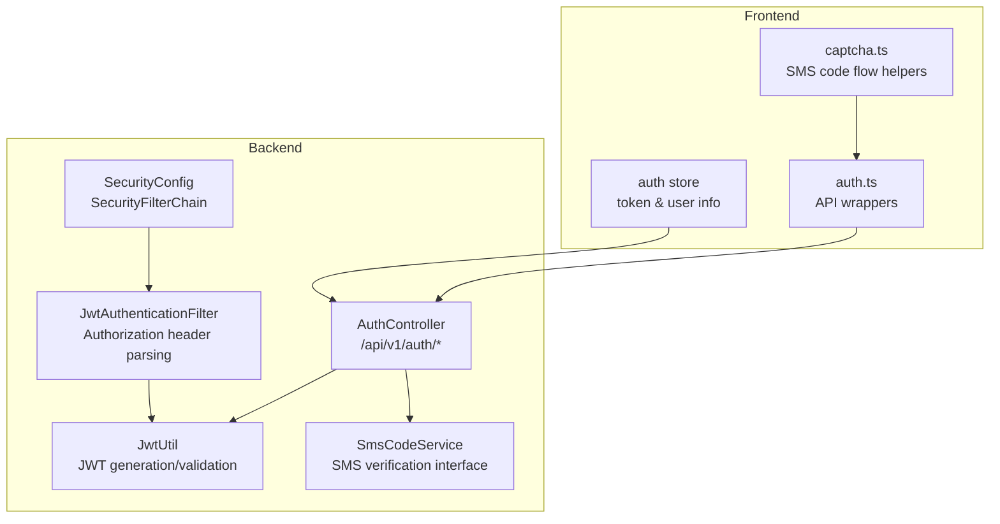
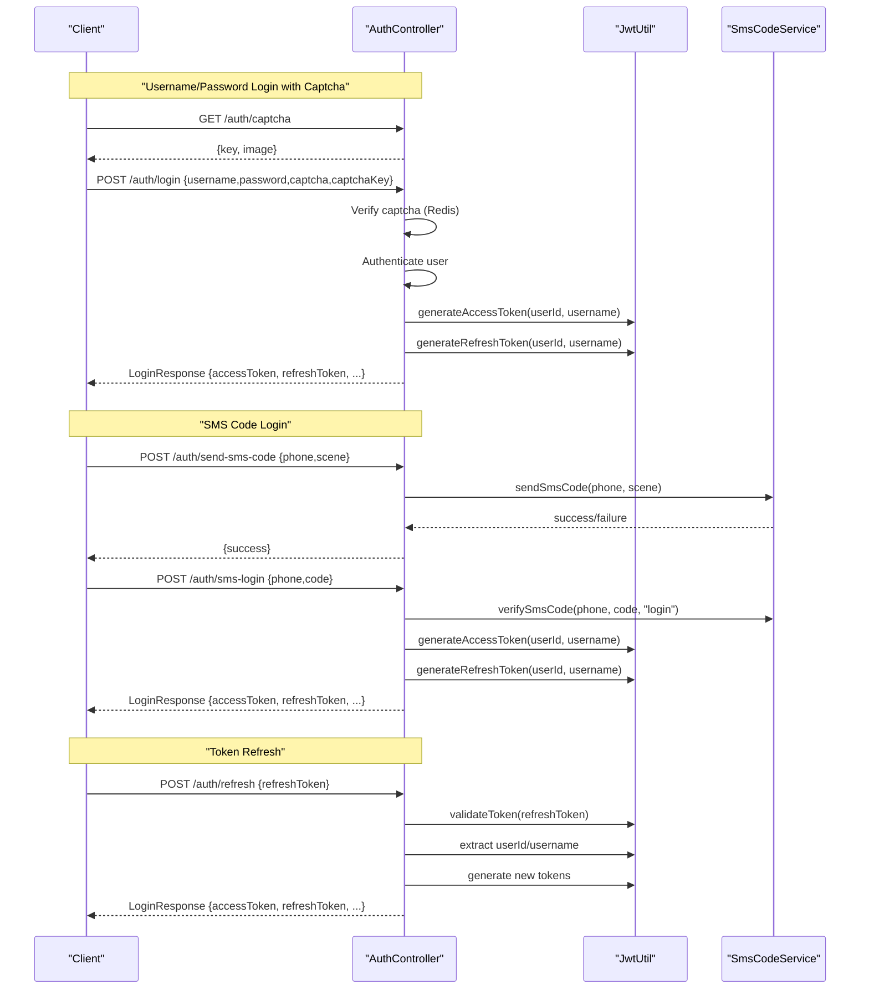
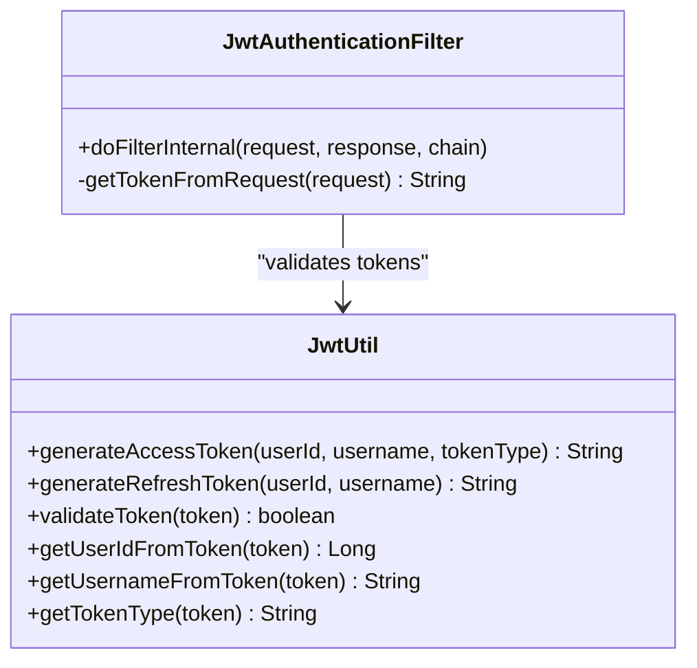
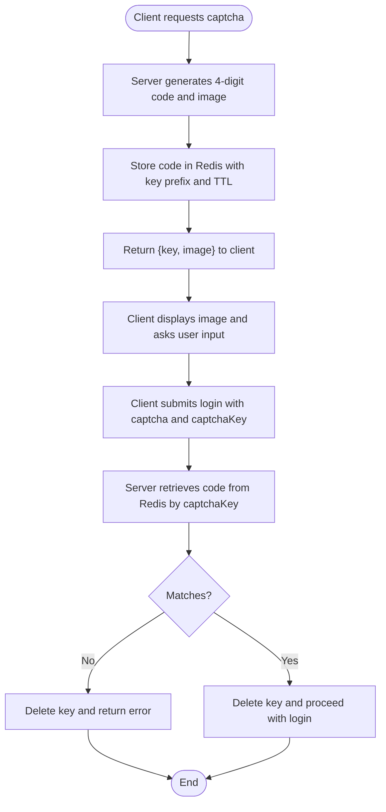
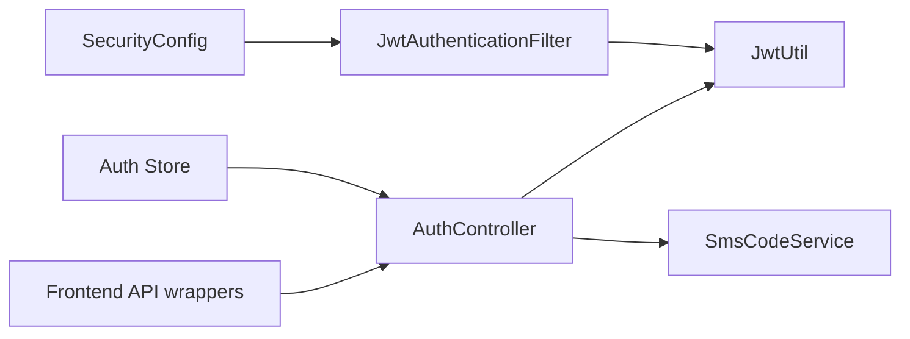

# Authentication API

<cite>
**Referenced Files in This Document**
- [AuthController.java](file://admin-backend/src/main/java/com/qhiot/survey/controller/AuthController.java)
- [JwtUtil.java](file://admin-backend/src/main/java/com/qhiot/survey/common/util/JwtUtil.java)
- [JwtAuthenticationFilter.java](file://admin-backend/src/main/java/com/qhiot/survey/security/JwtAuthenticationFilter.java)
- [SecurityConfig.java](file://admin-backend/src/main/java/com/qhiot/survey/security/SecurityConfig.java)
- [SmsCodeService.java](file://admin-backend/src/main/java/com/qhiot/survey/service/SmsCodeService.java)
- [LoginRequest.java](file://admin-backend/src/main/java/com/qhiot/survey/dto/LoginRequest.java)
- [LoginResponse.java](file://admin-backend/src/main/java/com/qhiot/survey/dto/LoginResponse.java)
- [SmsLoginRequest.java](file://admin-backend/src/main/java/com/qhiot/survey/dto/SmsLoginRequest.java)
- [SmsCodeRequest.java](file://admin-backend/src/main/java/com/qhiot/survey/dto/SmsCodeRequest.java)
- [SmsResetPasswordRequest.java](file://admin-backend/src/main/java/com/qhiot/survey/dto/SmsResetPasswordRequest.java)
- [ChangePasswordRequest.java](file://admin-backend/src/main/java/com/qhiot/survey/dto/ChangePasswordRequest.java)
- [auth.ts](file://admin-web-soybean/src/hooks/business/auth.ts)
- [captcha.ts](file://admin-web-soybean/src/hooks/business/captcha.ts)
- [auth.ts](file://admin-web-soybean/src/service/api/auth.ts)
- [index.ts](file://admin-web-soybean/src/store/modules/auth/index.ts)
</cite>

## Table of Contents
1. [Introduction](#introduction)
2. [Project Structure](#project-structure)
3. [Core Components](#core-components)
4. [Architecture Overview](#architecture-overview)
5. [Detailed Component Analysis](#detailed-component-analysis)
6. [Dependency Analysis](#dependency-analysis)
7. [Performance Considerations](#performance-considerations)
8. [Troubleshooting Guide](#troubleshooting-guide)
9. [Conclusion](#conclusion)
10. [Appendices](#appendices)

## Introduction
This document provides comprehensive API documentation for the authentication system. It covers:
- Login via username/password with image-based captcha verification
- SMS code login
- Logout
- Token management (access token generation, refresh token handling, token validation)
- Password change and reset via SMS verification
- Request/response schemas, error codes, and security considerations
- Practical authentication workflows and client integration guidelines

## Project Structure
The authentication system spans backend controllers, DTOs, JWT utilities, security filters, and frontend integration.

**Diagram sources**
- [AuthController.java:48](file://admin-backend/src/main/java/com/qhiot/survey/controller/AuthController.java#L48)
- [JwtUtil.java:20](file://admin-backend/src/main/java/com/qhiot/survey/common/util/JwtUtil.java#L20)
- [JwtAuthenticationFilter.java:37](file://admin-backend/src/main/java/com/qhiot/survey/security/JwtAuthenticationFilter.java#L37)
- [SecurityConfig.java:32](file://admin-backend/src/main/java/com/qhiot/survey/security/SecurityConfig.java#L32)
- [SmsCodeService.java:6](file://admin-backend/src/main/java/com/qhiot/survey/service/SmsCodeService.java#L6)
- [auth.ts:1](file://admin-web-soybean/src/service/api/auth.ts#L1)
- [index.ts:22](file://admin-web-soybean/src/store/modules/auth/index.ts#L22)
- [captcha.ts:6](file://admin-web-soybean/src/hooks/business/captcha.ts#L6)

**Section sources**
- [AuthController.java:48](file://admin-backend/src/main/java/com/qhiot/survey/controller/AuthController.java#L48)
- [SecurityConfig.java:39](file://admin-backend/src/main/java/com/qhiot/survey/security/SecurityConfig.java#L39)

## Core Components
- AuthController: Exposes authentication endpoints, handles captcha, login, SMS login, password change/reset, token refresh, and logout.
- JwtUtil: Generates and validates JWT tokens, extracts claims, and determines token types.
- JwtAuthenticationFilter: Extracts Authorization header, validates JWT, and authenticates users for protected endpoints.
- SecurityConfig: Configures stateless security, CORS, and permits unauthenticated access to authentication endpoints.
- DTOs: Strongly typed request/response models for all authentication operations.
- Frontend auth integration: API wrappers, token storage, and user info retrieval.

**Section sources**
- [AuthController.java:50](file://admin-backend/src/main/java/com/qhiot/survey/controller/AuthController.java#L50)
- [JwtUtil.java:20](file://admin-backend/src/main/java/com/qhiot/survey/common/util/JwtUtil.java#L20)
- [JwtAuthenticationFilter.java:37](file://admin-backend/src/main/java/com/qhiot/survey/security/JwtAuthenticationFilter.java#L37)
- [SecurityConfig.java:39](file://admin-backend/src/main/java/com/qhiot/survey/security/SecurityConfig.java#L39)

## Architecture Overview
High-level authentication flow:
- Clients call AuthController endpoints.
- AuthController performs validations (captcha, SMS code, credentials).
- On success, AuthController generates access and refresh tokens via JwtUtil.
- Protected endpoints rely on JwtAuthenticationFilter to validate Authorization headers.

**Diagram sources**
- [AuthController.java:74](file://admin-backend/src/main/java/com/qhiot/survey/controller/AuthController.java#L74)
- [AuthController.java:138](file://admin-backend/src/main/java/com/qhiot/survey/controller/AuthController.java#L138)
- [AuthController.java:240](file://admin-backend/src/main/java/com/qhiot/survey/controller/AuthController.java#L240)
- [AuthController.java:302](file://admin-backend/src/main/java/com/qhiot/survey/controller/AuthController.java#L302)
- [AuthController.java:398](file://admin-backend/src/main/java/com/qhiot/survey/controller/AuthController.java#L398)
- [JwtUtil.java:34](file://admin-backend/src/main/java/com/qhiot/survey/common/util/JwtUtil.java#L34)
- [JwtUtil.java:45](file://admin-backend/src/main/java/com/qhiot/survey/common/util/JwtUtil.java#L45)
- [JwtUtil.java:154](file://admin-backend/src/main/java/com/qhiot/survey/common/util/JwtUtil.java#L154)
- [SmsCodeService.java:14](file://admin-backend/src/main/java/com/qhiot/survey/service/SmsCodeService.java#L14)

## Detailed Component Analysis

### Endpoints

#### GET /api/v1/auth/captcha
- Purpose: Generate image-based captcha and return a verification key.
- Response: { key, image, code(dev/test only), _warning(dev/test only) }
- Notes: Generated image is Base64 PNG. Key expires in minutes. In dev/test environments, the actual code is returned for debugging.

**Section sources**
- [AuthController.java:74](file://admin-backend/src/main/java/com/qhiot/survey/controller/AuthController.java#L74)
- [AuthController.java:126](file://admin-backend/src/main/java/com/qhiot/survey/controller/AuthController.java#L126)

#### POST /api/v1/auth/login
- Purpose: Username/password login with captcha verification.
- Request body: LoginRequest { username, password, captcha, captchaKey }
- Response: LoginResponse { accessToken, refreshToken, userId, username, realName, roleCodes, permissions, isFirstLogin, loginWarning }
- Validation:
  - Captcha key and code must match Redis cache (5-minute TTL).
  - User must exist, be enabled, and not locked.
  - Credentials verified by AuthenticationManager.
- On success: Access and refresh tokens generated.

**Section sources**
- [AuthController.java:138](file://admin-backend/src/main/java/com/qhiot/survey/controller/AuthController.java#L138)
- [LoginRequest.java:11](file://admin-backend/src/main/java/com/qhiot/survey/dto/LoginRequest.java#L11)
- [LoginResponse.java:17](file://admin-backend/src/main/java/com/qhiot/survey/dto/LoginResponse.java#L17)

#### POST /api/v1/auth/sms-login
- Purpose: SMS code login (no password).
- Request body: SmsLoginRequest { phone, code }
- Response: LoginResponse { accessToken, refreshToken, ... }
- Validation:
  - SMS code verified by SmsCodeService for scene "login".
  - User must exist, be enabled, and not locked.
- On success: Access and refresh tokens generated.

**Section sources**
- [AuthController.java:240](file://admin-backend/src/main/java/com/qhiot/survey/controller/AuthController.java#L240)
- [SmsLoginRequest.java:14](file://admin-backend/src/main/java/com/qhiot/survey/dto/SmsLoginRequest.java#L14)

#### POST /api/v1/auth/send-sms-code
- Purpose: Send SMS verification code for login or reset.
- Request body: SmsCodeRequest { phone, scene }
- Response: Generic result wrapper with boolean success indicator.
- Validation:
  - For scene "reset", phone must belong to an existing user.

**Section sources**
- [AuthController.java:302](file://admin-backend/src/main/java/com/qhiot/survey/controller/AuthController.java#L302)
- [SmsCodeRequest.java:14](file://admin-backend/src/main/java/com/qhiot/survey/dto/SmsCodeRequest.java#L14)
- [SmsCodeService.java:14](file://admin-backend/src/main/java/com/qhiot/survey/service/SmsCodeService.java#L14)

#### POST /api/v1/auth/change-password
- Purpose: Change password for logged-in users.
- Request body: ChangePasswordRequest { oldPassword, newPassword }
- Validation:
  - Current password verified against the authenticated user.
  - New password length and format validated.
- On success: Password updated and isFirstLogin cleared.

**Section sources**
- [AuthController.java:335](file://admin-backend/src/main/java/com/qhiot/survey/controller/AuthController.java#L335)
- [ChangePasswordRequest.java:14](file://admin-backend/src/main/java/com/qhiot/survey/dto/ChangePasswordRequest.java#L14)

#### POST /api/v1/auth/reset-password
- Purpose: Reset password using SMS code (no login required).
- Request body: SmsResetPasswordRequest { phone, code, newPassword }
- Validation:
  - SMS code verified by SmsCodeService for scene "reset".
  - Phone must belong to an existing user.
  - New password length and format validated.
- On success: Password updated and isFirstLogin cleared.

**Section sources**
- [AuthController.java:371](file://admin-backend/src/main/java/com/qhiot/survey/controller/AuthController.java#L371)
- [SmsResetPasswordRequest.java:14](file://admin-backend/src/main/java/com/qhiot/survey/dto/SmsResetPasswordRequest.java#L14)

#### POST /api/v1/auth/refresh
- Purpose: Refresh access token using a valid refresh token.
- Request: refreshToken (query parameter)
- Response: LoginResponse { accessToken, refreshToken, ... }
- Validation:
  - Refresh token must be valid and of type "refresh".
  - User must exist and be enabled.
- On success: New access and refresh tokens generated.

**Section sources**
- [AuthController.java:398](file://admin-backend/src/main/java/com/qhiot/survey/controller/AuthController.java#L398)
- [JwtUtil.java:154](file://admin-backend/src/main/java/com/qhiot/survey/common/util/JwtUtil.java#L154)

#### POST /api/v1/auth/logout
- Purpose: Clear server-side authentication context.
- Response: Generic success result.

**Section sources**
- [AuthController.java:480](file://admin-backend/src/main/java/com/qhiot/survey/controller/AuthController.java#L480)

#### GET /api/v1/auth/getUserInfo
- Purpose: Retrieve current user’s roles and permissions.
- Response: UserInfoResponse with roles and permissions aggregated from user roles.

**Section sources**
- [AuthController.java:489](file://admin-backend/src/main/java/com/qhiot/survey/controller/AuthController.java#L489)

### DTOs and Schemas

- LoginRequest
  - Fields: username, password, captcha, captchaKey
  - Required: username, password, captcha, captchaKey

- LoginResponse
  - Fields: accessToken, refreshToken, userId, username, realName, roleCodes[], permissions[], isFirstLogin, loginWarning

- SmsLoginRequest
  - Fields: phone, code
  - Required: phone, code
  - Validation: phone format, code not blank

- SmsCodeRequest
  - Fields: phone, scene
  - Required: phone, scene
  - Validation: phone format, scene not blank

- SmsResetPasswordRequest
  - Fields: phone, code, newPassword
  - Required: phone, code, newPassword
  - Validation: phone format, code not blank, newPassword length/format

- ChangePasswordRequest
  - Fields: oldPassword, newPassword
  - Required: oldPassword, newPassword
  - Validation: newPassword length/format

**Section sources**
- [LoginRequest.java:11](file://admin-backend/src/main/java/com/qhiot/survey/dto/LoginRequest.java#L11)
- [LoginResponse.java:17](file://admin-backend/src/main/java/com/qhiot/survey/dto/LoginResponse.java#L17)
- [SmsLoginRequest.java:14](file://admin-backend/src/main/java/com/qhiot/survey/dto/SmsLoginRequest.java#L14)
- [SmsCodeRequest.java:14](file://admin-backend/src/main/java/com/qhiot/survey/dto/SmsCodeRequest.java#L14)
- [SmsResetPasswordRequest.java:14](file://admin-backend/src/main/java/com/qhiot/survey/dto/SmsResetPasswordRequest.java#L14)
- [ChangePasswordRequest.java:14](file://admin-backend/src/main/java/com/qhiot/survey/dto/ChangePasswordRequest.java#L14)

### Token Management

- Access Token
  - Generated on successful login or refresh.
  - Claims include userId, username, tokenType="access".
  - Expiration configured via jwt.expiration.

- Refresh Token
  - Generated alongside access token.
  - Claims include userId, username, tokenType="refresh".
  - Expiration configured via jwt.refresh-expiration.
  - Used to obtain new tokens without re-authentication.

- Token Validation
  - JwtUtil.validateToken checks signature and parses claims.
  - JwtUtil.getTokenType ensures refresh token type.
  - JwtAuthenticationFilter reads Authorization header, validates token, and sets SecurityContext.

**Diagram sources**
- [JwtUtil.java:34](file://admin-backend/src/main/java/com/qhiot/survey/common/util/JwtUtil.java#L34)
- [JwtUtil.java:45](file://admin-backend/src/main/java/com/qhiot/survey/common/util/JwtUtil.java#L45)
- [JwtUtil.java:154](file://admin-backend/src/main/java/com/qhiot/survey/common/util/JwtUtil.java#L154)
- [JwtAuthenticationFilter.java:44](file://admin-backend/src/main/java/com/qhiot/survey/security/JwtAuthenticationFilter.java#L44)
- [JwtAuthenticationFilter.java:127](file://admin-backend/src/main/java/com/qhiot/survey/security/JwtAuthenticationFilter.java#L127)

**Section sources**
- [JwtUtil.java:22](file://admin-backend/src/main/java/com/qhiot/survey/common/util/JwtUtil.java#L22)
- [JwtUtil.java:154](file://admin-backend/src/main/java/com/qhiot/survey/common/util/JwtUtil.java#L154)
- [JwtAuthenticationFilter.java:44](file://admin-backend/src/main/java/com/qhiot/survey/security/JwtAuthenticationFilter.java#L44)

### Captcha Generation and Verification

**Diagram sources**
- [AuthController.java:74](file://admin-backend/src/main/java/com/qhiot/survey/controller/AuthController.java#L74)
- [AuthController.java:142](file://admin-backend/src/main/java/com/qhiot/survey/controller/AuthController.java#L142)

**Section sources**
- [AuthController.java:74](file://admin-backend/src/main/java/com/qhiot/survey/controller/AuthController.java#L74)
- [AuthController.java:142](file://admin-backend/src/main/java/com/qhiot/survey/controller/AuthController.java#L142)

### SMS-Based Workflows

- SMS Login
  - Client sends phone and scene "login" to /auth/send-sms-code.
  - Client receives code, then calls /auth/sms-login with phone and code.
  - Server verifies code and issues tokens.

- Reset Password
  - Client sends phone and scene "reset" to /auth/send-sms-code.
  - Client receives code, then calls /auth/reset-password with phone, code, and new password.

**Section sources**
- [AuthController.java:240](file://admin-backend/src/main/java/com/qhiot/survey/controller/AuthController.java#L240)
- [AuthController.java:302](file://admin-backend/src/main/java/com/qhiot/survey/controller/AuthController.java#L302)
- [AuthController.java:371](file://admin-backend/src/main/java/com/qhiot/survey/controller/AuthController.java#L371)

### Frontend Integration

- API wrappers
  - fetchLogin, fetchGetUserInfo, fetchGetCaptcha, fetchRefreshToken
- Auth store
  - Stores tokens, user info, and manages login state.
  - Normalizes roles to lowercase for compatibility.
- Captcha helpers
  - Provide countdown and validation for SMS code actions.

**Section sources**
- [auth.ts:1](file://admin-web-soybean/src/service/api/auth.ts#L1)
- [index.ts:22](file://admin-web-soybean/src/store/modules/auth/index.ts#L22)
- [captcha.ts:6](file://admin-web-soybean/src/hooks/business/captcha.ts#L6)

## Dependency Analysis

**Diagram sources**
- [AuthController.java:52](file://admin-backend/src/main/java/com/qhiot/survey/controller/AuthController.java#L52)
- [JwtUtil.java:20](file://admin-backend/src/main/java/com/qhiot/survey/common/util/JwtUtil.java#L20)
- [JwtAuthenticationFilter.java:37](file://admin-backend/src/main/java/com/qhiot/survey/security/JwtAuthenticationFilter.java#L37)
- [SecurityConfig.java:32](file://admin-backend/src/main/java/com/qhiot/survey/security/SecurityConfig.java#L32)
- [auth.ts:1](file://admin-web-soybean/src/service/api/auth.ts#L1)
- [index.ts:22](file://admin-web-soybean/src/store/modules/auth/index.ts#L22)

**Section sources**
- [AuthController.java:52](file://admin-backend/src/main/java/com/qhiot/survey/controller/AuthController.java#L52)
- [JwtAuthenticationFilter.java:37](file://admin-backend/src/main/java/com/qhiot/survey/security/JwtAuthenticationFilter.java#L37)
- [SecurityConfig.java:32](file://admin-backend/src/main/java/com/qhiot/survey/security/SecurityConfig.java#L32)

## Performance Considerations
- Stateless design: No server-side sessions; token validation is CPU-bound but fast.
- Redis usage: Captcha and SMS code storage; ensure low-latency Redis deployment.
- Token TTLs: Configure jwt.expiration and jwt.refresh-expiration appropriately for your security and UX needs.
- CORS: Allowlist origins carefully to avoid wildcard with credentials.

[No sources needed since this section provides general guidance]

## Troubleshooting Guide
Common errors and resolutions:
- Captcha errors
  - Missing or expired captcha key: Re-generate captcha and retry.
  - Incorrect captcha: Retry with correct code.
- Login failures
  - Bad credentials: Verify username/password; check account lockout and status.
  - Account disabled/locked: Contact administrator.
- SMS code issues
  - Invalid phone format: Ensure E.164 format (leading 1 for US).
  - Code mismatch/expired: Resend code and retry.
- Token issues
  - Invalid or expired refresh token: Require user to log in again.
  - Wrong token type: Ensure refresh endpoint receives a refresh token.
- Frontend
  - Unauthorized responses: Check Authorization header presence and correctness.
  - Role/permission mismatches: Confirm backend aggregation of permissions from roles.

**Section sources**
- [AuthController.java:142](file://admin-backend/src/main/java/com/qhiot/survey/controller/AuthController.java#L142)
- [AuthController.java:244](file://admin-backend/src/main/java/com/qhiot/survey/controller/AuthController.java#L244)
- [AuthController.java:402](file://admin-backend/src/main/java/com/qhiot/survey/controller/AuthController.java#L402)
- [JwtAuthenticationFilter.java:72](file://admin-backend/src/main/java/com/qhiot/survey/security/JwtAuthenticationFilter.java#L72)

## Conclusion
The authentication system provides secure, stateless login flows with robust validation, captcha protection, SMS-based verification, and comprehensive token management. Clients should follow the documented workflows, handle token lifecycle properly, and integrate with the provided frontend utilities for a seamless user experience.

[No sources needed since this section summarizes without analyzing specific files]

## Appendices

### API Reference Summary

- GET /api/v1/auth/captcha
  - Response: { key, image }
  - Notes: In dev/test, code and warning fields included.

- POST /api/v1/auth/login
  - Body: LoginRequest
  - Response: LoginResponse

- POST /api/v1/auth/sms-login
  - Body: SmsLoginRequest
  - Response: LoginResponse

- POST /api/v1/auth/send-sms-code
  - Body: SmsCodeRequest
  - Response: Generic result

- POST /api/v1/auth/change-password
  - Body: ChangePasswordRequest
  - Response: Generic result

- POST /api/v1/auth/reset-password
  - Body: SmsResetPasswordRequest
  - Response: Generic result

- POST /api/v1/auth/refresh
  - Query: refreshToken
  - Response: LoginResponse

- POST /api/v1/auth/logout
  - Response: Generic result

- GET /api/v1/auth/getUserInfo
  - Response: UserInfoResponse

**Section sources**
- [AuthController.java:74](file://admin-backend/src/main/java/com/qhiot/survey/controller/AuthController.java#L74)
- [AuthController.java:138](file://admin-backend/src/main/java/com/qhiot/survey/controller/AuthController.java#L138)
- [AuthController.java:240](file://admin-backend/src/main/java/com/qhiot/survey/controller/AuthController.java#L240)
- [AuthController.java:302](file://admin-backend/src/main/java/com/qhiot/survey/controller/AuthController.java#L302)
- [AuthController.java:335](file://admin-backend/src/main/java/com/qhiot/survey/controller/AuthController.java#L335)
- [AuthController.java:371](file://admin-backend/src/main/java/com/qhiot/survey/controller/AuthController.java#L371)
- [AuthController.java:398](file://admin-backend/src/main/java/com/qhiot/survey/controller/AuthController.java#L398)
- [AuthController.java:480](file://admin-backend/src/main/java/com/qhiot/survey/controller/AuthController.java#L480)
- [AuthController.java:489](file://admin-backend/src/main/java/com/qhiot/survey/controller/AuthController.java#L489)

### Security Considerations
- Always transmit tokens over HTTPS.
- Store tokens securely (e.g., HttpOnly cookies or secure storage).
- Enforce strong password policies and rate-limit login attempts.
- Validate and sanitize all inputs; enforce phone number format.
- Limit allowed origins in CORS configuration.

[No sources needed since this section provides general guidance]