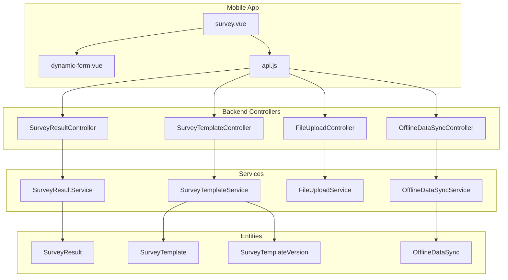
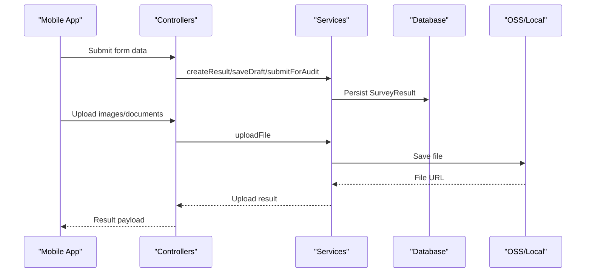
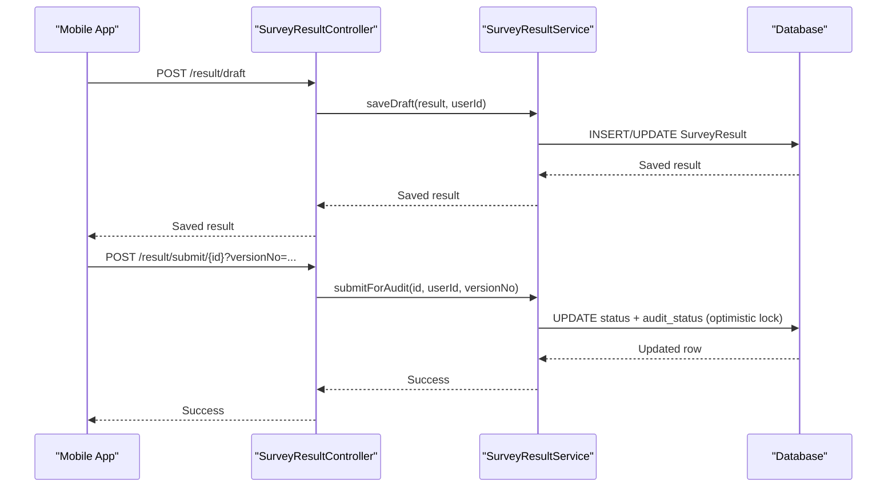
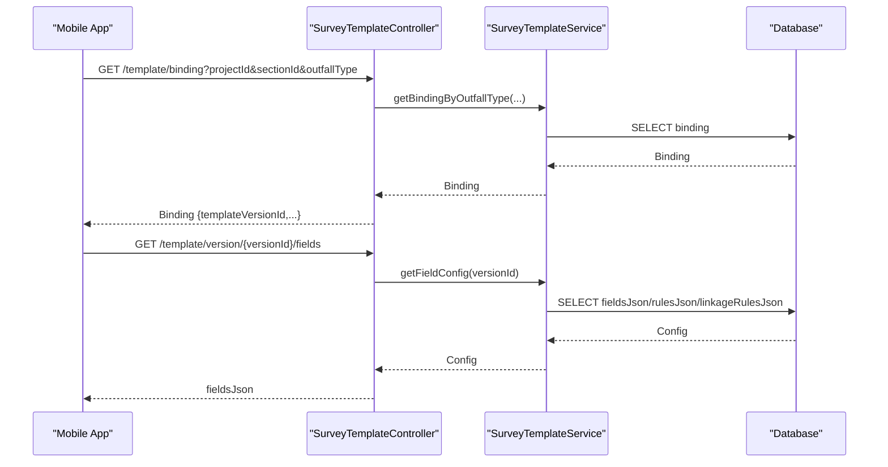
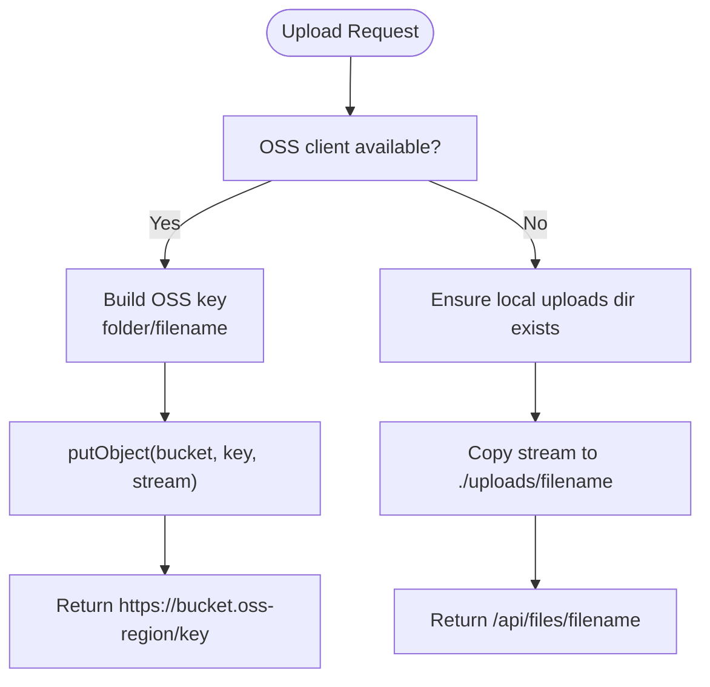
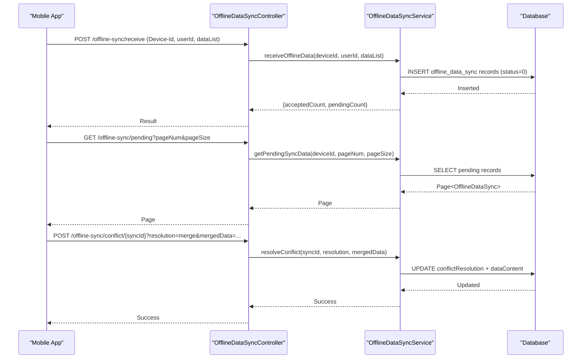
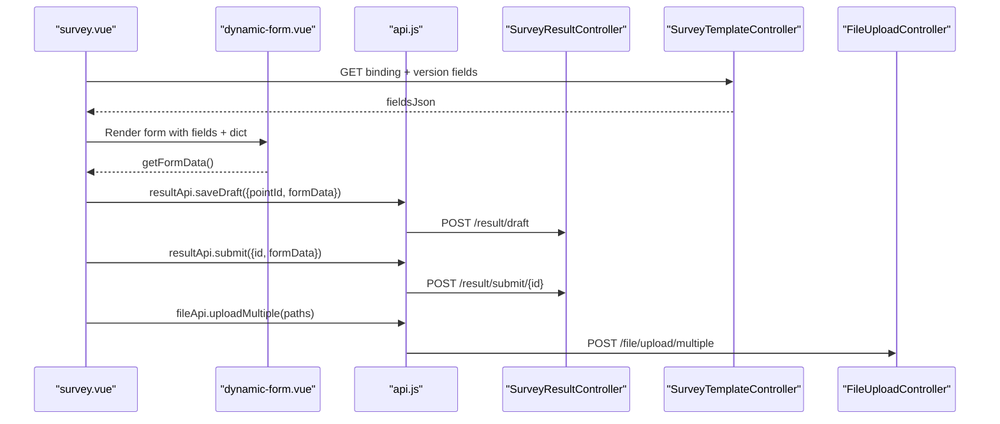
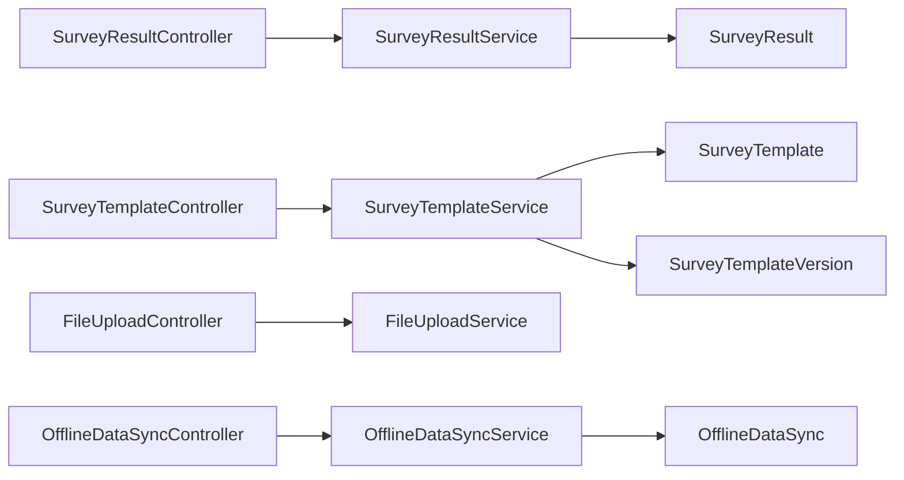
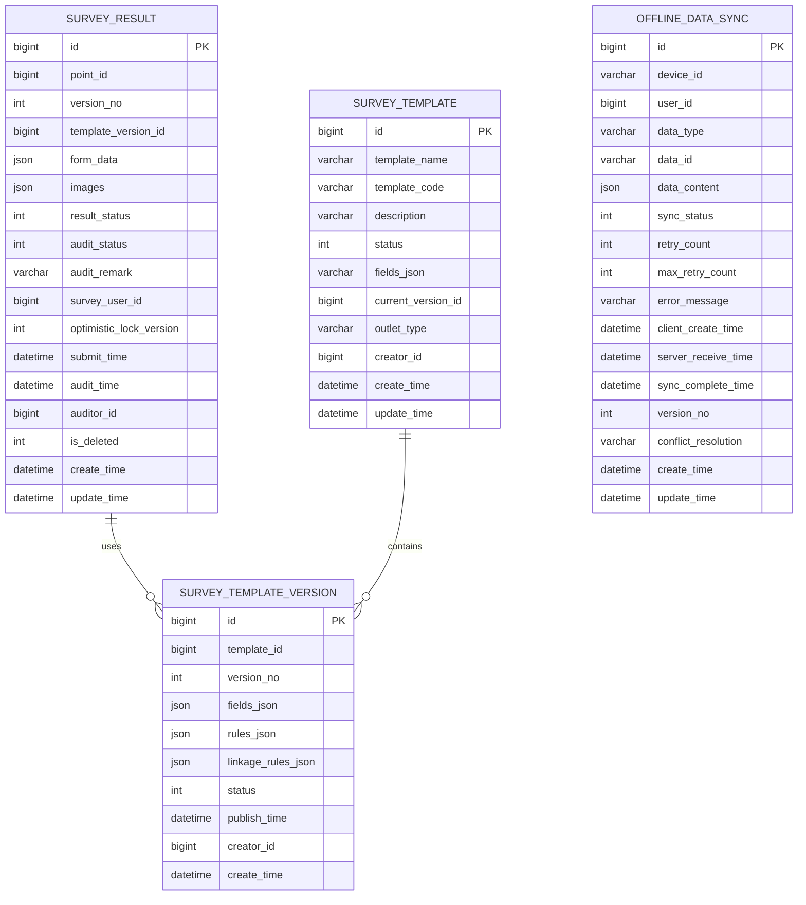

# Data Collection API

<cite>
**Referenced Files in This Document**
- [SurveyResultController.java](file://admin-backend/src/main/java/com/qhiot/survey/controller/SurveyResultController.java)
- [SurveyTemplateController.java](file://admin-backend/src/main/java/com/qhiot/survey/controller/SurveyTemplateController.java)
- [FileUploadController.java](file://admin-backend/src/main/java/com/qhiot/survey/controller/FileUploadController.java)
- [OfflineDataSyncController.java](file://admin-backend/src/main/java/com/qhiot/survey/controller/OfflineDataSyncController.java)
- [SurveyResultService.java](file://admin-backend/src/main/java/com/qhiot/survey/service/SurveyResultService.java)
- [SurveyTemplateService.java](file://admin-backend/src/main/java/com/qhiot/survey/service/SurveyTemplateService.java)
- [FileUploadService.java](file://admin-backend/src/main/java/com/qhiot/survey/service/FileUploadService.java)
- [OfflineDataSyncService.java](file://admin-backend/src/main/java/com/qhiot/survey/service/OfflineDataSyncService.java)
- [SurveyResult.java](file://admin-backend/src/main/java/com/qhiot/survey/entity/SurveyResult.java)
- [SurveyTemplate.java](file://admin-backend/src/main/java/com/qhiot/survey/entity/SurveyTemplate.java)
- [SurveyTemplateVersion.java](file://admin-backend/src/main/java/com/qhiot/survey/entity/SurveyTemplateVersion.java)
- [OfflineDataSync.java](file://admin-backend/src/main/java/com/qhiot/survey/entity/OfflineDataSync.java)
- [survey.vue](file://mobile-app/src/pages/survey/survey.vue)
- [dynamic-form.vue](file://mobile-app/src/components/dynamic-form/dynamic-form.vue)
- [api.js](file://mobile-app/src/utils/api.js)
</cite>

## Table of Contents
1. [Introduction](#introduction)
2. [Project Structure](#project-structure)
3. [Core Components](#core-components)
4. [Architecture Overview](#architecture-overview)
5. [Detailed Component Analysis](#detailed-component-analysis)
6. [Dependency Analysis](#dependency-analysis)
7. [Performance Considerations](#performance-considerations)
8. [Troubleshooting Guide](#troubleshooting-guide)
9. [Conclusion](#conclusion)
10. [Appendices](#appendices)

## Introduction
This document provides comprehensive API documentation for data collection and form submission endpoints in the Survey App. It covers:
- Survey result creation, updates, auditing, and versioning
- Dynamic form template system and how survey results map to template structures
- Image and file uploads, including watermarks and fallback storage
- Offline data synchronization, conflict resolution, and retry mechanisms
- Validation rules, data transformation, and audit trail generation
- End-to-end survey workflows from initiation to completion

## Project Structure
The backend exposes REST APIs under /api/v1 grouped by domain:
- /result: survey result CRUD, submission, auditing, and diffs
- /template: template lifecycle, versions, bindings, and previews
- /file: single and batch file uploads, deletions
- /offline-sync: offline data ingestion, pending records, sync status, conflict resolution, retries, cleanup

**Diagram sources**
- [SurveyResultController.java:24-181](file://admin-backend/src/main/java/com/qhiot/survey/controller/SurveyResultController.java#L24-L181)
- [SurveyTemplateController.java:27-194](file://admin-backend/src/main/java/com/qhiot/survey/controller/SurveyTemplateController.java#L27-L194)
- [FileUploadController.java:17-80](file://admin-backend/src/main/java/com/qhiot/survey/controller/FileUploadController.java#L17-L80)
- [OfflineDataSyncController.java:18-95](file://admin-backend/src/main/java/com/qhiot/survey/controller/OfflineDataSyncController.java#L18-L95)
- [SurveyResultService.java:11-81](file://admin-backend/src/main/java/com/qhiot/survey/service/SurveyResultService.java#L11-L81)
- [SurveyTemplateService.java:12-59](file://admin-backend/src/main/java/com/qhiot/survey/service/SurveyTemplateService.java#L12-L59)
- [FileUploadService.java:20-122](file://admin-backend/src/main/java/com/qhiot/survey/service/FileUploadService.java#L20-L122)
- [OfflineDataSyncService.java:12-84](file://admin-backend/src/main/java/com/qhiot/survey/service/OfflineDataSyncService.java#L12-L84)
- [SurveyResult.java:14-93](file://admin-backend/src/main/java/com/qhiot/survey/entity/SurveyResult.java#L14-L93)
- [SurveyTemplate.java:13-61](file://admin-backend/src/main/java/com/qhiot/survey/entity/SurveyTemplate.java#L13-L61)
- [SurveyTemplateVersion.java:13-38](file://admin-backend/src/main/java/com/qhiot/survey/entity/SurveyTemplateVersion.java#L13-L38)
- [OfflineDataSync.java:15-97](file://admin-backend/src/main/java/com/qhiot/survey/entity/OfflineDataSync.java#L15-L97)

**Section sources**
- [SurveyResultController.java:24-181](file://admin-backend/src/main/java/com/qhiot/survey/controller/SurveyResultController.java#L24-L181)
- [SurveyTemplateController.java:27-194](file://admin-backend/src/main/java/com/qhiot/survey/controller/SurveyTemplateController.java#L27-L194)
- [FileUploadController.java:17-80](file://admin-backend/src/main/java/com/qhiot/survey/controller/FileUploadController.java#L17-L80)
- [OfflineDataSyncController.java:18-95](file://admin-backend/src/main/java/com/qhiot/survey/controller/OfflineDataSyncController.java#L18-L95)

## Core Components
- SurveyResultController: CRUD, submission, auditing, drafts, and version diff
- SurveyTemplateController: template lifecycle, publishing versions, field configs, bindings
- FileUploadController: single/multiple file upload, deletion
- OfflineDataSyncController: batch receive, pending queries, sync, conflict resolution, retry, cleanup

Key responsibilities:
- Validate roles via @PreAuthorize
- Enforce optimistic locking on updates and submissions
- Support audit trails and version diffs
- Provide offline-first ingestion with conflict handling

**Section sources**
- [SurveyResultController.java:24-181](file://admin-backend/src/main/java/com/qhiot/survey/controller/SurveyResultController.java#L24-L181)
- [SurveyTemplateController.java:27-194](file://admin-backend/src/main/java/com/qhiot/survey/controller/SurveyTemplateController.java#L27-L194)
- [FileUploadController.java:17-80](file://admin-backend/src/main/java/com/qhiot/survey/controller/FileUploadController.java#L17-L80)
- [OfflineDataSyncController.java:18-95](file://admin-backend/src/main/java/com/qhiot/survey/controller/OfflineDataSyncController.java#L18-L95)

## Architecture Overview
The system follows a layered architecture:
- Presentation: Spring MVC controllers expose REST endpoints
- Application: Services encapsulate business logic
- Persistence: Entities mapped to database tables via MyBatis-Plus
- Storage: FileUploadService supports OSS and local fallback
- Offline: OfflineDataSync tracks device ingestion and sync state

**Diagram sources**
- [SurveyResultController.java:59-153](file://admin-backend/src/main/java/com/qhiot/survey/controller/SurveyResultController.java#L59-L153)
- [FileUploadController.java:25-43](file://admin-backend/src/main/java/com/qhiot/survey/controller/FileUploadController.java#L25-L43)
- [FileUploadService.java:36-96](file://admin-backend/src/main/java/com/qhiot/survey/service/FileUploadService.java#L36-L96)
- [SurveyResult.java:19-42](file://admin-backend/src/main/java/com/qhiot/survey/entity/SurveyResult.java#L19-L42)

## Detailed Component Analysis

### Survey Result Management
Endpoints:
- GET /result/list, /result/{id}, /result/point/{pointId}/latest
- POST /result/create, PUT /result/update/{id}, DELETE /result/delete/{id}
- GET /result/audit/page, POST /result/audit/{id}/pass, POST /result/audit/{id}/reject, POST /result/audit/batch-pass
- POST /result/submit/{id} (with optional expectedVersion)
- POST /result/draft
- GET /result/version/diff?currentId&compareId
- GET /result/user/{surveyUserId}

Processing logic:
- Role gating via @PreAuthorize for COLLECTOR, AUDITOR, ADMIN
- Optimistic locking enforced on update and submit endpoints
- Submission transitions result into audit queue
- Drafts saved per point and user
- Version diffs support comparison across versions

**Diagram sources**
- [SurveyResultController.java:134-153](file://admin-backend/src/main/java/com/qhiot/survey/controller/SurveyResultController.java#L134-L153)
- [SurveyResultService.java:64-70](file://admin-backend/src/main/java/com/qhiot/survey/service/SurveyResultService.java#L64-L70)
- [SurveyResult.java:45-52](file://admin-backend/src/main/java/com/qhiot/survey/entity/SurveyResult.java#L45-L52)

**Section sources**
- [SurveyResultController.java:33-181](file://admin-backend/src/main/java/com/qhiot/survey/controller/SurveyResultController.java#L33-L181)
- [SurveyResultService.java:11-81](file://admin-backend/src/main/java/com/qhiot/survey/service/SurveyResultService.java#L11-L81)
- [SurveyResult.java:19-93](file://admin-backend/src/main/java/com/qhiot/survey/entity/SurveyResult.java#L19-L93)

### Dynamic Form Template System
Endpoints:
- GET /template/page, /template/list, /template/detail/{id}
- POST /template/create, PUT /template/update/{id}, DELETE /template/delete/{id}
- PUT /template/draft/{id}, POST /{id}/publish
- GET /{id}/preview, GET /{id}/versions, GET /version/{versionId}, GET /version/{versionId}/fields
- POST /template/bind-outfall, GET /template/binding, GET /template/bindings, DELETE /template/binding/{bindingId}

Template mapping:
- Templates are bound to project/section/outfallType via SurveyPointTemplateBinding
- Mobile loads binding, fetches fields JSON, renders dynamic form
- Fields include validation rules, linkage rules, and option sources

**Diagram sources**
- [SurveyTemplateController.java:157-178](file://admin-backend/src/main/java/com/qhiot/survey/controller/SurveyTemplateController.java#L157-L178)
- [SurveyTemplateController.java:151-155](file://admin-backend/src/main/java/com/qhiot/survey/controller/SurveyTemplateController.java#L151-L155)
- [SurveyTemplateService.java:43-51](file://admin-backend/src/main/java/com/qhiot/survey/service/SurveyTemplateService.java#L43-L51)
- [SurveyTemplate.java:18-51](file://admin-backend/src/main/java/com/qhiot/survey/entity/SurveyTemplate.java#L18-L51)
- [SurveyTemplateVersion.java:18-30](file://admin-backend/src/main/java/com/qhiot/survey/entity/SurveyTemplateVersion.java#L18-L30)

**Section sources**
- [SurveyTemplateController.java:38-194](file://admin-backend/src/main/java/com/qhiot/survey/controller/SurveyTemplateController.java#L38-L194)
- [SurveyTemplateService.java:12-59](file://admin-backend/src/main/java/com/qhiot/survey/service/SurveyTemplateService.java#L12-L59)
- [SurveyTemplate.java:18-61](file://admin-backend/src/main/java/com/qhiot/survey/entity/SurveyTemplate.java#L18-L61)
- [SurveyTemplateVersion.java:18-38](file://admin-backend/src/main/java/com/qhiot/survey/entity/SurveyTemplateVersion.java#L18-L38)

### File Upload Endpoints
Endpoints:
- POST /file/upload (single)
- POST /file/upload/multiple (batch)
- DELETE /file/delete?fileUrl

Behavior:
- Watermarking for images with collector name and coordinates
- Fallback to local storage if OSS unavailable
- Returns filename and URL for successful uploads

**Diagram sources**
- [FileUploadController.java:25-43](file://admin-backend/src/main/java/com/qhiot/survey/controller/FileUploadController.java#L25-L43)
- [FileUploadService.java:36-96](file://admin-backend/src/main/java/com/qhiot/survey/service/FileUploadService.java#L36-L96)

**Section sources**
- [FileUploadController.java:25-80](file://admin-backend/src/main/java/com/qhiot/survey/controller/FileUploadController.java#L25-L80)
- [FileUploadService.java:20-122](file://admin-backend/src/main/java/com/qhiot/survey/service/FileUploadService.java#L20-L122)

### Offline Data Synchronization
Endpoints:
- POST /offline-sync/receive (requires Device-Id header)
- GET /offline-sync/pending?pageNum&pageSize
- POST /offline-sync/sync/{syncId}, POST /offline-sync/sync/batch
- GET /offline-sync/status
- POST /offline-sync/conflict/{syncId}?resolution&mergedData
- POST /offline-sync/retry/{syncId}
- POST /offline-sync/cleanup?days=30

Conflict resolution strategies:
- server: adopt server-side data
- client: adopt client-side data
- merge: apply mergedData payload

**Diagram sources**
- [OfflineDataSyncController.java:26-78](file://admin-backend/src/main/java/com/qhiot/survey/controller/OfflineDataSyncController.java#L26-L78)
- [OfflineDataSyncService.java:14-66](file://admin-backend/src/main/java/com/qhiot/survey/service/OfflineDataSyncService.java#L14-L66)
- [OfflineDataSync.java:23-91](file://admin-backend/src/main/java/com/qhiot/survey/entity/OfflineDataSync.java#L23-L91)

**Section sources**
- [OfflineDataSyncController.java:26-95](file://admin-backend/src/main/java/com/qhiot/survey/controller/OfflineDataSyncController.java#L26-L95)
- [OfflineDataSyncService.java:12-84](file://admin-backend/src/main/java/com/qhiot/survey/service/OfflineDataSyncService.java#L12-L84)
- [OfflineDataSync.java:15-97](file://admin-backend/src/main/java/com/qhiot/survey/entity/OfflineDataSync.java#L15-L97)

### Mobile App Integration
- survey.vue orchestrates template loading, dictionary data, draft persistence, and submission
- dynamic-form.vue renders fields, validates, auto-fills locations, and handles linkage rules
- api.js centralizes HTTP requests, interceptors, and unified response handling

**Diagram sources**
- [survey.vue:69-141](file://mobile-app/src/pages/survey/survey.vue#L69-L141)
- [dynamic-form.vue:16-306](file://mobile-app/src/components/dynamic-form/dynamic-form.vue#L16-L306)
- [api.js:264-360](file://mobile-app/src/utils/api.js#L264-L360)

**Section sources**
- [survey.vue:32-159](file://mobile-app/src/pages/survey/survey.vue#L32-L159)
- [dynamic-form.vue:146-336](file://mobile-app/src/components/dynamic-form/dynamic-form.vue#L146-L336)
- [api.js:1-370](file://mobile-app/src/utils/api.js#L1-L370)

## Dependency Analysis
- Controllers depend on Services for business logic
- Services operate on Entities persisted via MyBatis-Plus
- FileUploadService depends on OSS client and local filesystem
- OfflineDataSyncService manages ingestion and conflict resolution state

**Diagram sources**
- [SurveyResultController.java:24-181](file://admin-backend/src/main/java/com/qhiot/survey/controller/SurveyResultController.java#L24-L181)
- [SurveyTemplateController.java:27-194](file://admin-backend/src/main/java/com/qhiot/survey/controller/SurveyTemplateController.java#L27-L194)
- [FileUploadController.java:17-80](file://admin-backend/src/main/java/com/qhiot/survey/controller/FileUploadController.java#L17-L80)
- [OfflineDataSyncController.java:18-95](file://admin-backend/src/main/java/com/qhiot/survey/controller/OfflineDataSyncController.java#L18-L95)
- [SurveyResultService.java:11-81](file://admin-backend/src/main/java/com/qhiot/survey/service/SurveyResultService.java#L11-L81)
- [SurveyTemplateService.java:12-59](file://admin-backend/src/main/java/com/qhiot/survey/service/SurveyTemplateService.java#L12-L59)
- [FileUploadService.java:20-122](file://admin-backend/src/main/java/com/qhiot/survey/service/FileUploadService.java#L20-L122)
- [OfflineDataSyncService.java:12-84](file://admin-backend/src/main/java/com/qhiot/survey/service/OfflineDataSyncService.java#L12-L84)
- [SurveyResult.java:14-93](file://admin-backend/src/main/java/com/qhiot/survey/entity/SurveyResult.java#L14-L93)
- [SurveyTemplate.java:13-61](file://admin-backend/src/main/java/com/qhiot/survey/entity/SurveyTemplate.java#L13-L61)
- [SurveyTemplateVersion.java:13-38](file://admin-backend/src/main/java/com/qhiot/survey/entity/SurveyTemplateVersion.java#L13-L38)
- [OfflineDataSync.java:15-97](file://admin-backend/src/main/java/com/qhiot/survey/entity/OfflineDataSync.java#L15-L97)

**Section sources**
- [SurveyResultController.java:24-181](file://admin-backend/src/main/java/com/qhiot/survey/controller/SurveyResultController.java#L24-L181)
- [SurveyTemplateController.java:27-194](file://admin-backend/src/main/java/com/qhiot/survey/controller/SurveyTemplateController.java#L27-L194)
- [FileUploadController.java:17-80](file://admin-backend/src/main/java/com/qhiot/survey/controller/FileUploadController.java#L17-L80)
- [OfflineDataSyncController.java:18-95](file://admin-backend/src/main/java/com/qhiot/survey/controller/OfflineDataSyncController.java#L18-L95)

## Performance Considerations
- Template caching: Published template version retrieval is frequently called; cache eviction is supported to avoid stale configurations.
- Batch operations: Use batch endpoints for multiple files and offline sync to reduce overhead.
- Watermarking cost: Image watermarking adds CPU overhead; consider async processing for large batches.
- Pagination: Audit and offline sync endpoints support pagination to limit payload sizes.
- Indexes: Ensure database indexes on frequently queried fields (e.g., pointId, templateVersionId, deviceId).

## Troubleshooting Guide
Common issues and resolutions:
- Authentication failures (401): Ensure Authorization header is present and valid; the interceptor removes expired tokens and redirects to login.
- Authorization failures (403): Verify user roles (COLLECTOR, AUDITOR, ADMIN) for protected endpoints.
- Optimistic lock conflicts (409): When submitting or updating, pass the latest expectedVersion to avoid conflicts.
- Upload failures: Confirm OSS availability; the service falls back to local storage and returns a local URL.
- Offline sync stuck: Check pending records, retry failed entries, and resolve conflicts using server/client/merge strategies.

**Section sources**
- [api.js:40-71](file://mobile-app/src/utils/api.js#L40-L71)
- [SurveyResultController.java:134-144](file://admin-backend/src/main/java/com/qhiot/survey/controller/SurveyResultController.java#L134-L144)
- [FileUploadService.java:78-96](file://admin-backend/src/main/java/com/qhiot/survey/service/FileUploadService.java#L78-L96)
- [OfflineDataSyncController.java:68-85](file://admin-backend/src/main/java/com/qhiot/survey/controller/OfflineDataSyncController.java#L68-L85)

## Conclusion
The Data Collection API provides a robust foundation for survey data capture, templating, file handling, and offline-first workflows. By leveraging dynamic forms, strict validation, audit trails, and conflict resolution, the system supports reliable data collection across diverse environments.

## Appendices

### API Definitions

- Survey Results
  - POST /api/v1/result/draft
    - Body: SurveyResult
    - Description: Save a draft for a point
  - POST /api/v1/result/submit/{id}?versionNo={n}
    - Body: none
    - Description: Submit result for audit with optimistic lock
  - POST /api/v1/result/create
    - Body: SurveyResult
    - Description: Create a new result
  - PUT /api/v1/result/update/{id}?expectedVersion={n}
    - Body: SurveyResult
    - Description: Update result with optimistic lock
  - GET /api/v1/result/version/diff?currentId&compareId
    - Description: Compare two versions
  - GET /api/v1/result/audit/page?projectId&sectionId&status&pageNum&pageSize
    - Description: Paginated audit list

- Templates
  - GET /api/v1/template/binding?projectId&sectionId&outfallType
    - Description: Get binding for outfall type
  - GET /api/v1/template/version/{versionId}/fields
    - Description: Get field configuration JSON
  - POST /api/v1/template/{id}/publish
    - Body: { fields, rules, linkageRules }
    - Description: Publish template and create new version

- Files
  - POST /api/v1/file/upload
    - Form-Data: file
    - Description: Upload single file
  - POST /api/v1/file/upload/multiple
    - Form-Data: files[]
    - Description: Upload multiple files
  - DELETE /api/v1/file/delete?fileUrl
    - Description: Delete file by URL

- Offline Sync
  - POST /api/v1/offline-sync/receive
    - Headers: Device-Id
    - Body: [{...}]
    - Description: Receive batch offline data
  - GET /api/v1/offline-sync/pending?pageNum&pageSize
    - Description: Pending records
  - POST /api/v1/offline-sync/conflict/{syncId}?resolution&mergedData
    - Description: Resolve conflict (server/client/merge)
  - POST /api/v1/offline-sync/retry/{syncId}
    - Description: Retry failed sync
  - POST /api/v1/offline-sync/cleanup?days
    - Description: Cleanup expired records

**Section sources**
- [SurveyResultController.java:59-161](file://admin-backend/src/main/java/com/qhiot/survey/controller/SurveyResultController.java#L59-L161)
- [SurveyTemplateController.java:157-178](file://admin-backend/src/main/java/com/qhiot/survey/controller/SurveyTemplateController.java#L157-L178)
- [SurveyTemplateController.java:151-155](file://admin-backend/src/main/java/com/qhiot/survey/controller/SurveyTemplateController.java#L151-L155)
- [FileUploadController.java:25-79](file://admin-backend/src/main/java/com/qhiot/survey/controller/FileUploadController.java#L25-L79)
- [OfflineDataSyncController.java:26-93](file://admin-backend/src/main/java/com/qhiot/survey/controller/OfflineDataSyncController.java#L26-L93)

### Data Models

**Diagram sources**
- [SurveyResult.java:19-93](file://admin-backend/src/main/java/com/qhiot/survey/entity/SurveyResult.java#L19-L93)
- [SurveyTemplate.java:18-61](file://admin-backend/src/main/java/com/qhiot/survey/entity/SurveyTemplate.java#L18-L61)
- [SurveyTemplateVersion.java:18-38](file://admin-backend/src/main/java/com/qhiot/survey/entity/SurveyTemplateVersion.java#L18-L38)
- [OfflineDataSync.java:23-96](file://admin-backend/src/main/java/com/qhiot/survey/entity/OfflineDataSync.java#L23-L96)