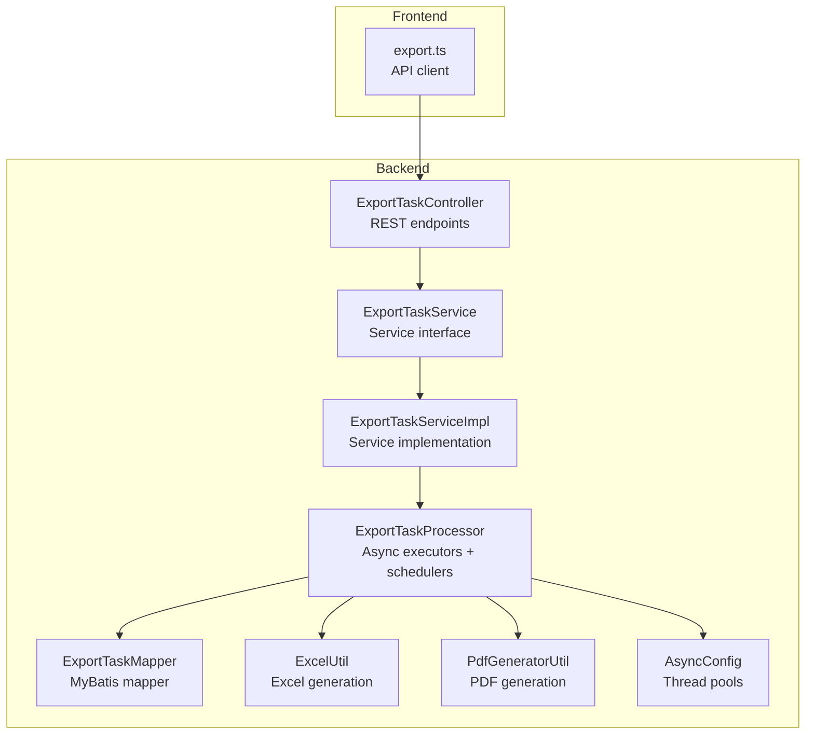
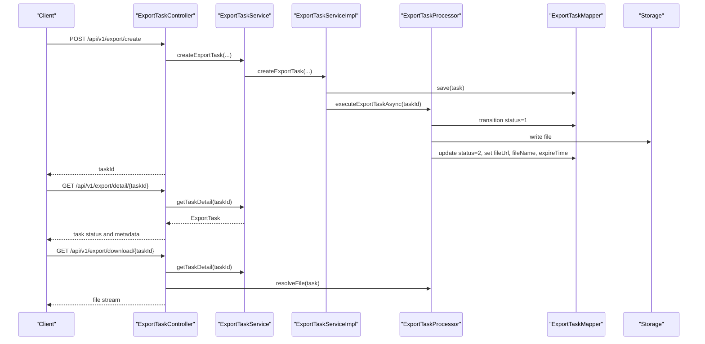
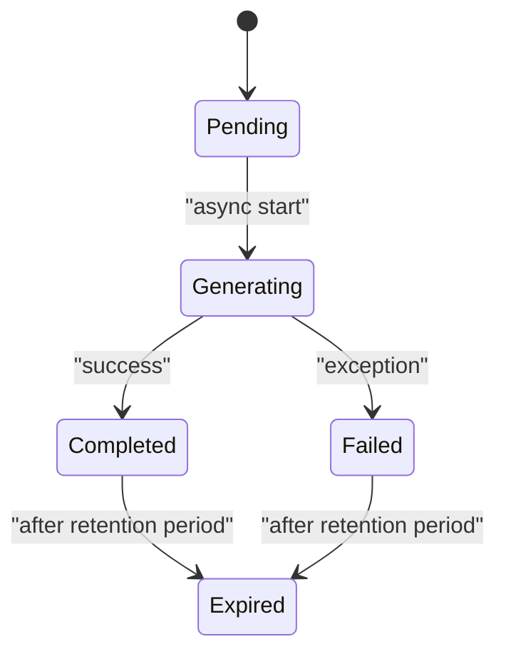
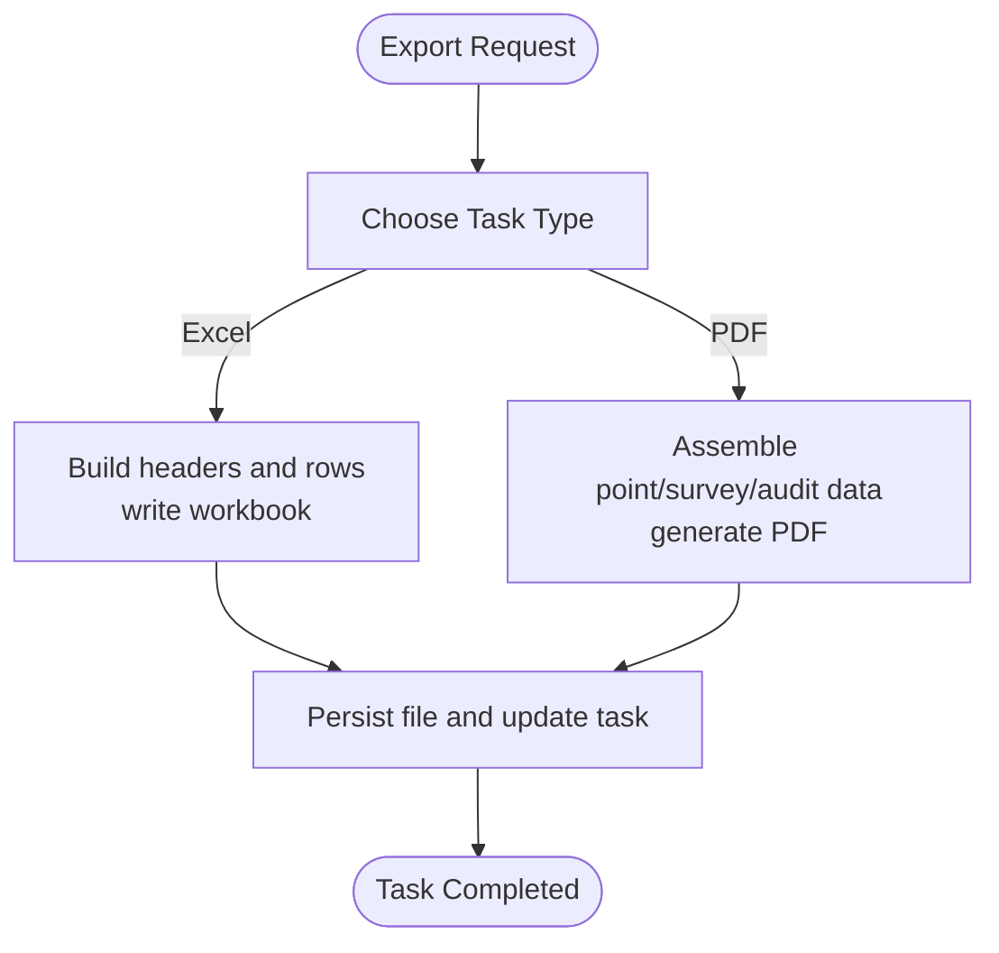
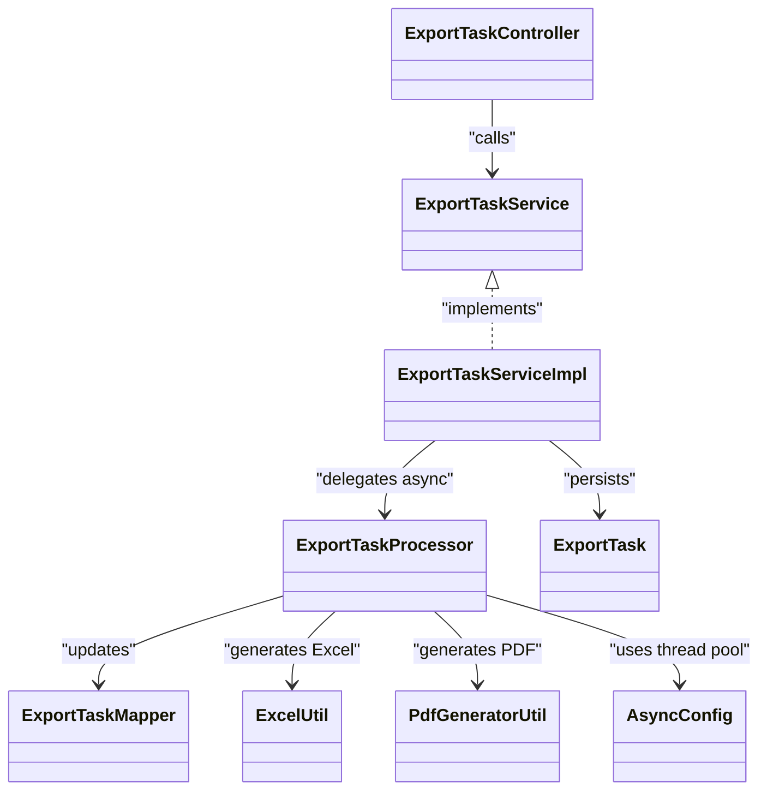

# Export & Reporting API

<cite>
**Referenced Files in This Document**
- [ExportTaskController.java](file://admin-backend/src/main/java/com/qhiot/survey/controller/ExportTaskController.java)
- [ExportTaskService.java](file://admin-backend/src/main/java/com/qhiot/survey/service/ExportTaskService.java)
- [ExportTaskServiceImpl.java](file://admin-backend/src/main/java/com/qhiot/survey/service/impl/ExportTaskServiceImpl.java)
- [ExportTaskProcessor.java](file://admin-backend/src/main/java/com/qhiot/survey/service/ExportTaskProcessor.java)
- [ExportTask.java](file://admin-backend/src/main/java/com/qhiot/survey/entity/ExportTask.java)
- [ExportTaskMapper.java](file://admin-backend/src/main/java/com/qhiot/survey/mapper/ExportTaskMapper.java)
- [AsyncConfig.java](file://admin-backend/src/main/java/com/qhiot/survey/config/AsyncConfig.java)
- [ExcelUtil.java](file://admin-backend/src/main/java/com/qhiot/survey/common/util/ExcelUtil.java)
- [PdfGeneratorUtil.java](file://admin-backend/src/main/java/com/qhiot/survey/common/util/PdfGeneratorUtil.java)
- [export.ts](file://admin-web-soybean/src/service/api/export.ts)
- [application.yml](file://admin-backend/src/main/resources/application.yml)
- [04-export-task-columns.sql](file://admin-backend/init-data/04-export-task-columns.sql)
</cite>

## Table of Contents
1. [Introduction](#introduction)
2. [Project Structure](#project-structure)
3. [Core Components](#core-components)
4. [Architecture Overview](#architecture-overview)
5. [Detailed Component Analysis](#detailed-component-analysis)
6. [Dependency Analysis](#dependency-analysis)
7. [Performance Considerations](#performance-considerations)
8. [Troubleshooting Guide](#troubleshooting-guide)
9. [Conclusion](#conclusion)
10. [Appendices](#appendices)

## Introduction
This document provides comprehensive API documentation for export and reporting endpoints. It covers asynchronous export task management, supported export formats (CSV/Excel and PDF), report customization and data filtering, batch export operations, scheduled export generation, file download endpoints, and lifecycle management of export tasks. It also documents integration points with data collection and project management systems for comprehensive reporting.

## Project Structure
The export and reporting functionality spans backend controllers, services, processors, mappers, utilities, and frontend API bindings. The backend exposes REST endpoints under a dedicated export namespace, while the frontend integrates via typed API functions.

**Diagram sources**
- [ExportTaskController.java:34-142](file://admin-backend/src/main/java/com/qhiot/survey/controller/ExportTaskController.java#L34-L142)
- [ExportTaskService.java:12-55](file://admin-backend/src/main/java/com/qhiot/survey/service/ExportTaskService.java#L12-L55)
- [ExportTaskServiceImpl.java:25-89](file://admin-backend/src/main/java/com/qhiot/survey/service/impl/ExportTaskServiceImpl.java#L25-L89)
- [ExportTaskProcessor.java:44-443](file://admin-backend/src/main/java/com/qhiot/survey/service/ExportTaskProcessor.java#L44-L443)
- [ExportTaskMapper.java:8-9](file://admin-backend/src/main/java/com/qhiot/survey/mapper/ExportTaskMapper.java#L8-L9)
- [ExcelUtil.java:17-123](file://admin-backend/src/main/java/com/qhiot/survey/common/util/ExcelUtil.java#L17-L123)
- [PdfGeneratorUtil.java:27-259](file://admin-backend/src/main/java/com/qhiot/survey/common/util/PdfGeneratorUtil.java#L27-L259)
- [AsyncConfig.java:19-95](file://admin-backend/src/main/java/com/qhiot/survey/config/AsyncConfig.java#L19-L95)
- [export.ts:1-79](file://admin-web-soybean/src/service/api/export.ts#L1-L79)

**Section sources**
- [ExportTaskController.java:34-142](file://admin-backend/src/main/java/com/qhiot/survey/controller/ExportTaskController.java#L34-L142)
- [export.ts:1-79](file://admin-web-soybean/src/service/api/export.ts#L1-L79)

## Core Components
- ExportTaskController: Exposes REST endpoints for creating export tasks, retrieving task lists and details, and downloading generated files.
- ExportTaskService and ExportTaskServiceImpl: Define and implement export task creation and retrieval logic, delegating asynchronous execution to the processor.
- ExportTaskProcessor: Implements asynchronous export execution, file persistence, status transitions, scheduled cleanup, and PDF/Excel generation.
- ExportTask: Entity representing export tasks persisted in the database.
- ExportTaskMapper: MyBatis mapper for ExportTask.
- ExcelUtil and PdfGeneratorUtil: Utilities for generating Excel and PDF reports.
- AsyncConfig: Configures dedicated thread pools for export tasks.
- Frontend export.ts: Typed API client for export operations.

**Section sources**
- [ExportTaskController.java:34-142](file://admin-backend/src/main/java/com/qhiot/survey/controller/ExportTaskController.java#L34-L142)
- [ExportTaskService.java:12-55](file://admin-backend/src/main/java/com/qhiot/survey/service/ExportTaskService.java#L12-L55)
- [ExportTaskServiceImpl.java:25-89](file://admin-backend/src/main/java/com/qhiot/survey/service/impl/ExportTaskServiceImpl.java#L25-L89)
- [ExportTaskProcessor.java:44-443](file://admin-backend/src/main/java/com/qhiot/survey/service/ExportTaskProcessor.java#L44-L443)
- [ExportTask.java:14-63](file://admin-backend/src/main/java/com/qhiot/survey/entity/ExportTask.java#L14-L63)
- [ExportTaskMapper.java:8-9](file://admin-backend/src/main/java/com/qhiot/survey/mapper/ExportTaskMapper.java#L8-L9)
- [ExcelUtil.java:17-123](file://admin-backend/src/main/java/com/qhiot/survey/common/util/ExcelUtil.java#L17-L123)
- [PdfGeneratorUtil.java:27-259](file://admin-backend/src/main/java/com/qhiot/survey/common/util/PdfGeneratorUtil.java#L27-L259)
- [AsyncConfig.java:55-71](file://admin-backend/src/main/java/com/qhiot/survey/config/AsyncConfig.java#L55-L71)
- [export.ts:1-79](file://admin-web-soybean/src/service/api/export.ts#L1-L79)

## Architecture Overview
The export system follows an asynchronous task model:
- Clients submit export requests via REST endpoints.
- Backend persists a task record and triggers asynchronous processing.
- Processor generates files, updates task metadata, and marks completion/expiry.
- Clients poll task status and download files when ready.

**Diagram sources**
- [ExportTaskController.java:48-117](file://admin-backend/src/main/java/com/qhiot/survey/controller/ExportTaskController.java#L48-L117)
- [ExportTaskServiceImpl.java:30-66](file://admin-backend/src/main/java/com/qhiot/survey/service/impl/ExportTaskServiceImpl.java#L30-L66)
- [ExportTaskProcessor.java:71-124](file://admin-backend/src/main/java/com/qhiot/survey/service/ExportTaskProcessor.java#L71-L124)
- [ExportTaskMapper.java:8-9](file://admin-backend/src/main/java/com/qhiot/survey/mapper/ExportTaskMapper.java#L8-L9)

## Detailed Component Analysis

### Export Task Lifecycle
- Creation: Clients specify task name, type, optional project ID, and creator. The system creates a pending task and schedules asynchronous processing.
- Status transitions: Pending → Generating → Completed/Failed/Expired.
- Cleanup: Expired files are removed and task statuses updated.

**Diagram sources**
- [ExportTaskProcessor.java:81-124](file://admin-backend/src/main/java/com/qhiot/survey/service/ExportTaskProcessor.java#L81-L124)
- [ExportTaskProcessor.java:187-212](file://admin-backend/src/main/java/com/qhiot/survey/service/ExportTaskProcessor.java#L187-L212)
- [ExportTask.java:40-43](file://admin-backend/src/main/java/com/qhiot/survey/entity/ExportTask.java#L40-L43)

**Section sources**
- [ExportTaskController.java:48-80](file://admin-backend/src/main/java/com/qhiot/survey/controller/ExportTaskController.java#L48-L80)
- [ExportTaskServiceImpl.java:30-66](file://admin-backend/src/main/java/com/qhiot/survey/service/impl/ExportTaskServiceImpl.java#L30-L66)
- [ExportTaskProcessor.java:81-124](file://admin-backend/src/main/java/com/qhiot/survey/service/ExportTaskProcessor.java#L81-L124)
- [ExportTaskProcessor.java:187-212](file://admin-backend/src/main/java/com/qhiot/survey/service/ExportTaskProcessor.java#L187-L212)

### Supported Export Formats and Generation
- Excel: Generated from structured data sets (point list, audit results). Headers and rows are built programmatically and written to a workbook.
- PDF: Single-point survey report generated from point, survey, and audit data maps.

**Diagram sources**
- [ExportTaskProcessor.java:288-351](file://admin-backend/src/main/java/com/qhiot/survey/service/ExportTaskProcessor.java#L288-L351)
- [ExportTaskProcessor.java:262-283](file://admin-backend/src/main/java/com/qhiot/survey/service/ExportTaskProcessor.java#L262-L283)
- [ExcelUtil.java:59-91](file://admin-backend/src/main/java/com/qhiot/survey/common/util/ExcelUtil.java#L59-L91)
- [PdfGeneratorUtil.java:39-127](file://admin-backend/src/main/java/com/qhiot/survey/common/util/PdfGeneratorUtil.java#L39-L127)

**Section sources**
- [ExportTaskProcessor.java:288-351](file://admin-backend/src/main/java/com/qhiot/survey/service/ExportTaskProcessor.java#L288-L351)
- [ExportTaskProcessor.java:262-283](file://admin-backend/src/main/java/com/qhiot/survey/service/ExportTaskProcessor.java#L262-L283)
- [ExcelUtil.java:59-91](file://admin-backend/src/main/java/com/qhiot/survey/common/util/ExcelUtil.java#L59-L91)
- [PdfGeneratorUtil.java:39-127](file://admin-backend/src/main/java/com/qhiot/survey/common/util/PdfGeneratorUtil.java#L39-L127)

### Report Customization and Data Filtering
- Point list export: Optionally filtered by project ID; ordered by creation time.
- Audit results export: Filters results by submission/audit statuses; optionally filtered by project ID via point lookup.
- PDF export: Single-point report with latest result and latest audit record.

**Section sources**
- [ExportTaskProcessor.java:288-351](file://admin-backend/src/main/java/com/qhiot/survey/service/ExportTaskProcessor.java#L288-L351)
- [ExportTaskProcessor.java:262-283](file://admin-backend/src/main/java/com/qhiot/survey/service/ExportTaskProcessor.java#L262-L283)

### Batch Export Operations and Scheduled Generation
- Batch exports are initiated via task creation with appropriate task types and project filters.
- Scheduled cleanup removes expired files and updates task statuses.

**Section sources**
- [ExportTaskProcessor.java:187-212](file://admin-backend/src/main/java/com/qhiot/survey/service/ExportTaskProcessor.java#L187-L212)

### File Download Endpoints and Access Control
- Download endpoint validates task existence, completion status, and expiry; serves file with appropriate content type and disposition.

**Section sources**
- [ExportTaskController.java:82-117](file://admin-backend/src/main/java/com/qhiot/survey/controller/ExportTaskController.java#L82-L117)

### API Definitions

#### Export Task Management
- POST /api/v1/export/create
  - Description: Create an asynchronous export task. Supported task types include point list and audit result exports.
  - Auth: Required
  - Query parameters:
    - taskName: string (required)
    - taskType: string (required; e.g., point_list, audit_result)
    - projectId: integer (optional)
  - Response: Result<Long> with taskId

- POST /api/v1/export/create-pdf
  - Description: Create a single-point PDF export task.
  - Auth: Required
  - Query parameters:
    - pointId: integer (required)
    - resultId: integer (optional)
  - Response: Result<Long> with taskId

- GET /api/v1/export/list
  - Description: Retrieve the current user’s export tasks.
  - Auth: Required
  - Response: Result<List<ExportTask>>

- GET /api/v1/export/detail/{taskId}
  - Description: Get task details for progress polling.
  - Auth: Required
  - Path parameters:
    - taskId: integer (required)
  - Response: Result<ExportTask>

- GET /api/v1/export/download/{taskId}
  - Description: Download the generated file if available and not expired.
  - Auth: Required
  - Path parameters:
    - taskId: integer (required)
  - Response: 200 OK with file stream and Content-Disposition; 400 Bad Request if not completed; 410 Gone if expired; 404 Not Found if missing

**Section sources**
- [ExportTaskController.java:48-117](file://admin-backend/src/main/java/com/qhiot/survey/controller/ExportTaskController.java#L48-L117)

#### Frontend API Bindings
- fetchGetExportList(params): GET /export/page
- fetchCreateExport(data): POST /export
- fetchGetExportDetail(taskId): GET /export/:id
- fetchDownloadExport(taskId): GET /export/:id/download
- fetchDeleteExport(taskId): DELETE /export/:id
- fetchExportPointList(params): POST /export/points
- fetchExportAuditResults(params): POST /export/audits
- fetchGeneratePDF(pointId): POST /export/pdf/:id

**Section sources**
- [export.ts:1-79](file://admin-web-soybean/src/service/api/export.ts#L1-L79)

### Data Models

#### ExportTask
- Fields:
  - id: integer
  - taskName: string
  - taskType: string (point_list, audit_result, pdf_single, pdf_batch)
  - projectId: integer (optional)
  - pointId: integer (optional)
  - resultId: integer (optional)
  - status: integer (0=pending, 1=generating, 2=completed, 3=failed, 4=expired)
  - fileUrl: string
  - fileName: string
  - fileSize: integer
  - expireTime: datetime
  - errorMsg: string
  - creatorId: integer
  - createTime: datetime
  - updateTime: datetime

**Section sources**
- [ExportTask.java:14-63](file://admin-backend/src/main/java/com/qhiot/survey/entity/ExportTask.java#L14-L63)

### Configuration and Storage
- Export storage path: export.storage.path (default: user.dir + /exports)
- Retention days: export.retention-days (default: 7)
- Thread pool for export tasks: exportTaskExecutor (corePoolSize=2, maxPoolSize=4, queueCapacity=50)

**Section sources**
- [application.yml:1-149](file://admin-backend/src/main/resources/application.yml#L1-L149)
- [AsyncConfig.java:55-71](file://admin-backend/src/main/java/com/qhiot/survey/config/AsyncConfig.java#L55-L71)
- [ExportTaskProcessor.java:59-66](file://admin-backend/src/main/java/com/qhiot/survey/service/ExportTaskProcessor.java#L59-L66)

### Database Schema Enhancements
- Added columns for PDF export support: point_id, result_id, file_name.

**Section sources**
- [04-export-task-columns.sql:1-7](file://admin-backend/init-data/04-export-task-columns.sql#L1-L7)

## Dependency Analysis

**Diagram sources**
- [ExportTaskController.java:34-142](file://admin-backend/src/main/java/com/qhiot/survey/controller/ExportTaskController.java#L34-L142)
- [ExportTaskService.java:12-55](file://admin-backend/src/main/java/com/qhiot/survey/service/ExportTaskService.java#L12-L55)
- [ExportTaskServiceImpl.java:25-89](file://admin-backend/src/main/java/com/qhiot/survey/service/impl/ExportTaskServiceImpl.java#L25-L89)
- [ExportTaskProcessor.java:44-443](file://admin-backend/src/main/java/com/qhiot/survey/service/ExportTaskProcessor.java#L44-L443)
- [ExportTaskMapper.java:8-9](file://admin-backend/src/main/java/com/qhiot/survey/mapper/ExportTaskMapper.java#L8-L9)
- [ExcelUtil.java:17-123](file://admin-backend/src/main/java/com/qhiot/survey/common/util/ExcelUtil.java#L17-L123)
- [PdfGeneratorUtil.java:27-259](file://admin-backend/src/main/java/com/qhiot/survey/common/util/PdfGeneratorUtil.java#L27-L259)
- [AsyncConfig.java:55-71](file://admin-backend/src/main/java/com/qhiot/survey/config/AsyncConfig.java#L55-L71)

**Section sources**
- [ExportTaskController.java:34-142](file://admin-backend/src/main/java/com/qhiot/survey/controller/ExportTaskController.java#L34-L142)
- [ExportTaskServiceImpl.java:25-89](file://admin-backend/src/main/java/com/qhiot/survey/service/impl/ExportTaskServiceImpl.java#L25-L89)
- [ExportTaskProcessor.java:44-443](file://admin-backend/src/main/java/com/qhiot/survey/service/ExportTaskProcessor.java#L44-L443)

## Performance Considerations
- Asynchronous execution: Dedicated thread pool ensures export tasks do not block request threads.
- File persistence: Writes generated files to configurable storage path; consider disk I/O and retention policies.
- Data volume: Filtering by project ID reduces dataset size for exports; pagination recommended for large result sets.
- Cleanup scheduling: Daily cleanup prevents storage bloat and keeps task metadata consistent.

[No sources needed since this section provides general guidance]

## Troubleshooting Guide
- Task remains pending:
  - Verify task exists and status transitions to generating.
  - Check thread pool availability and logs for exceptions.
- Download returns 400 or 410:
  - Confirm task status is completed and not expired.
  - Ensure file exists on disk and resolveFile returns a valid path.
- Download returns 404:
  - Task not found or file deleted; re-run export.
- Exceptions during generation:
  - Inspect processor logs for stack traces; error messages are truncated and stored in task error field.

**Section sources**
- [ExportTaskController.java:82-117](file://admin-backend/src/main/java/com/qhiot/survey/controller/ExportTaskController.java#L82-L117)
- [ExportTaskProcessor.java:187-212](file://admin-backend/src/main/java/com/qhiot/survey/service/ExportTaskProcessor.java#L187-L212)
- [ExportTaskProcessor.java:216-241](file://admin-backend/src/main/java/com/qhiot/survey/service/ExportTaskProcessor.java#L216-L241)

## Conclusion
The export and reporting API provides a robust asynchronous framework for generating Excel and PDF reports from survey data. It supports project-based filtering, scheduled cleanup, and secure file downloads with proper status tracking. Integrating with frontend clients enables efficient batch and on-demand reporting across data collection and project management workflows.

[No sources needed since this section summarizes without analyzing specific files]

## Appendices

### Endpoint Reference Summary
- POST /api/v1/export/create: Create export task
- POST /api/v1/export/create-pdf: Create single-point PDF task
- GET /api/v1/export/list: List user tasks
- GET /api/v1/export/detail/{taskId}: Get task detail
- GET /api/v1/export/download/{taskId}: Download file

**Section sources**
- [ExportTaskController.java:48-117](file://admin-backend/src/main/java/com/qhiot/survey/controller/ExportTaskController.java#L48-L117)