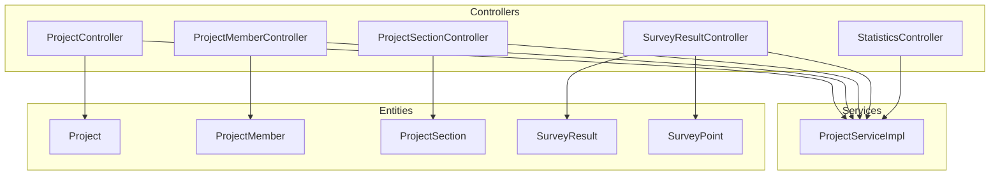
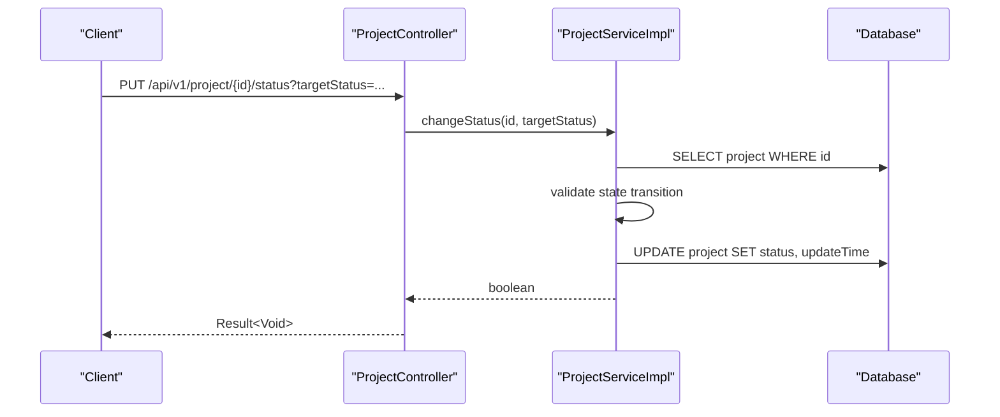
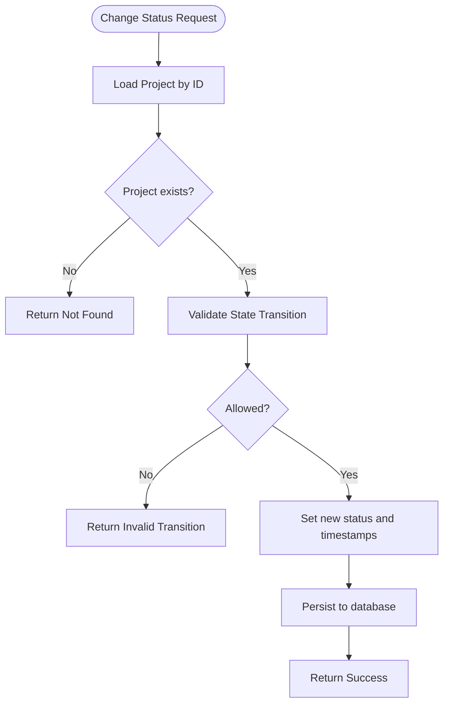
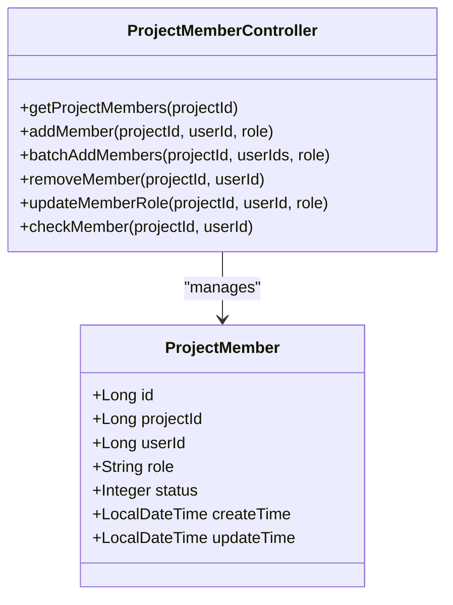
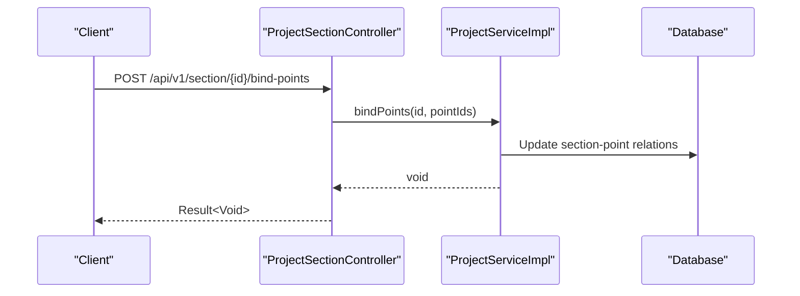
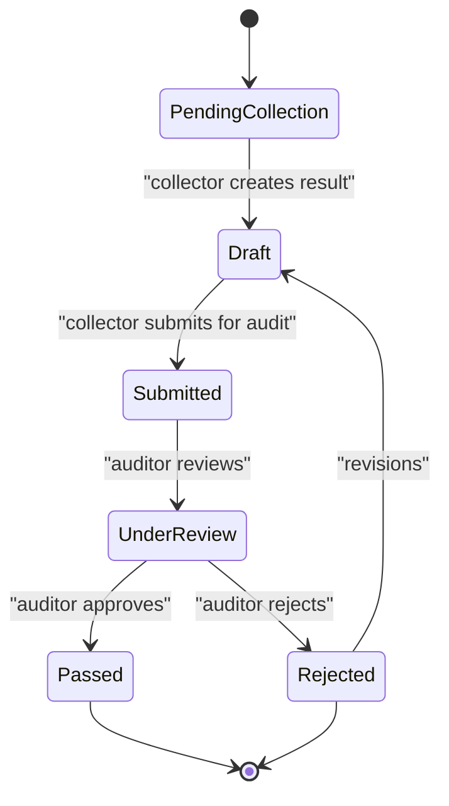
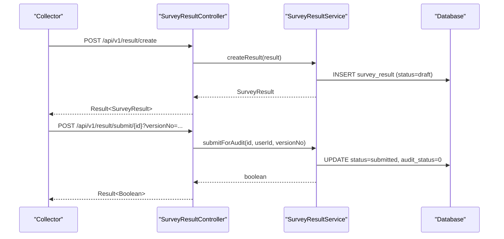
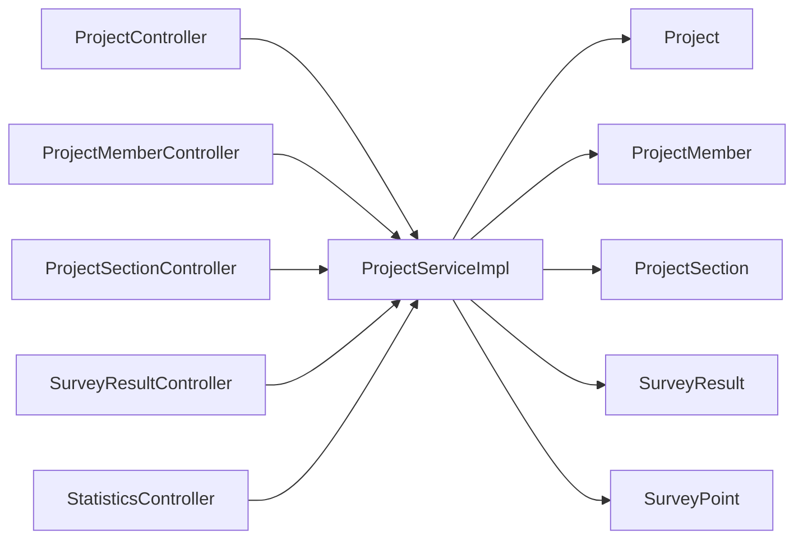

# Project Management API

<cite>
**Referenced Files in This Document**
- [ProjectController.java](file://admin-backend/src/main/java/com/qhiot/survey/controller/ProjectController.java)
- [ProjectMemberController.java](file://admin-backend/src/main/java/com/qhiot/survey/controller/ProjectMemberController.java)
- [ProjectSectionController.java](file://admin-backend/src/main/java/com/qhiot/survey/controller/ProjectSectionController.java)
- [SurveyResultController.java](file://admin-backend/src/main/java/com/qhiot/survey/controller/SurveyResultController.java)
- [StatisticsController.java](file://admin-backend/src/main/java/com/qhiot/survey/controller/StatisticsController.java)
- [ProjectServiceImpl.java](file://admin-backend/src/main/java/com/qhiot/survey/service/impl/ProjectServiceImpl.java)
- [ProjectCreateRequest.java](file://admin-backend/src/main/java/com/qhiot/survey/dto/ProjectCreateRequest.java)
- [ProjectQueryRequest.java](file://admin-backend/src/main/java/com/qhiot/survey/dto/ProjectQueryRequest.java)
- [Project.java](file://admin-backend/src/main/java/com/qhiot/survey/entity/Project.java)
- [ProjectMember.java](file://admin-backend/src/main/java/com/qhiot/survey/entity/ProjectMember.java)
- [ProjectSection.java](file://admin-backend/src/main/java/com/qhiot/survey/entity/ProjectSection.java)
- [SurveyResult.java](file://admin-backend/src/main/java/com/qhiot/survey/entity/SurveyResult.java)
- [SurveyPoint.java](file://admin-backend/src/main/java/com/qhiot/survey/entity/SurveyPoint.java)
- [role.ts](file://admin-web-soybean/src/constants/role.ts)
- [auth.ts](file://admin-web-soybean/src/hooks/common/auth.ts)
</cite>

## Table of Contents
1. [Introduction](#introduction)
2. [Project Structure](#project-structure)
3. [Core Components](#core-components)
4. [Architecture Overview](#architecture-overview)
5. [Detailed Component Analysis](#detailed-component-analysis)
6. [Dependency Analysis](#dependency-analysis)
7. [Performance Considerations](#performance-considerations)
8. [Troubleshooting Guide](#troubleshooting-guide)
9. [Conclusion](#conclusion)
10. [Appendices](#appendices)

## Introduction
This document provides comprehensive API documentation for project lifecycle management within the Survey Application. It covers project creation, modification, status transitions, closure and restoration, member management with role assignments and permissions, hierarchical organization via project sections, task assignment and progress tracking, and reporting/analytics endpoints. It also documents the integration with survey point management and result tracking, including workflow transitions and permission enforcement.

## Project Structure
The backend exposes RESTful APIs grouped by functional domains:
- Project lifecycle management: CRUD, status transitions, archiving, restoration
- Member management: add/remove/update roles, bulk operations, membership checks
- Section management: hierarchical organization under projects, point binding/unbinding
- Survey result management: collection, submission, auditing, version comparison
- Statistics: system overview, user stats, project stats

**Diagram sources**
- [ProjectController.java:23-144](file://admin-backend/src/main/java/com/qhiot/survey/controller/ProjectController.java#L23-L144)
- [ProjectMemberController.java:20-91](file://admin-backend/src/main/java/com/qhiot/survey/controller/ProjectMemberController.java#L20-L91)
- [ProjectSectionController.java:17-126](file://admin-backend/src/main/java/com/qhiot/survey/controller/ProjectSectionController.java#L17-L126)
- [SurveyResultController.java:21-180](file://admin-backend/src/main/java/com/qhiot/survey/controller/SurveyResultController.java#L21-L180)
- [StatisticsController.java:14-44](file://admin-backend/src/main/java/com/qhiot/survey/controller/StatisticsController.java#L14-L44)
- [ProjectServiceImpl.java:24-263](file://admin-backend/src/main/java/com/qhiot/survey/service/impl/ProjectServiceImpl.java#L24-L263)
- [Project.java:13-84](file://admin-backend/src/main/java/com/qhiot/survey/entity/Project.java#L13-L84)
- [ProjectMember.java:10-44](file://admin-backend/src/main/java/com/qhiot/survey/entity/ProjectMember.java#L10-L44)
- [ProjectSection.java:10-39](file://admin-backend/src/main/java/com/qhiot/survey/entity/ProjectSection.java#L10-L39)
- [SurveyResult.java:11-93](file://admin-backend/src/main/java/com/qhiot/survey/entity/SurveyResult.java#L11-L93)
- [SurveyPoint.java:14-84](file://admin-backend/src/main/java/com/qhiot/survey/entity/SurveyPoint.java#L14-L84)

**Section sources**
- [ProjectController.java:23-144](file://admin-backend/src/main/java/com/qhiot/survey/controller/ProjectController.java#L23-L144)
- [ProjectMemberController.java:20-91](file://admin-backend/src/main/java/com/qhiot/survey/controller/ProjectMemberController.java#L20-L91)
- [ProjectSectionController.java:17-126](file://admin-backend/src/main/java/com/qhiot/survey/controller/ProjectSectionController.java#L17-L126)
- [SurveyResultController.java:21-180](file://admin-backend/src/main/java/com/qhiot/survey/controller/SurveyResultController.java#L21-L180)
- [StatisticsController.java:14-44](file://admin-backend/src/main/java/com/qhiot/survey/controller/StatisticsController.java#L14-L44)

## Core Components
- ProjectController: Manages project lifecycle, status transitions, archiving, restoration, and statistics retrieval.
- ProjectMemberController: Handles member addition/removal, role updates, bulk operations, and membership verification.
- ProjectSectionController: Manages sections within projects, point binding/unbinding, status toggling, manager assignment, and statistics.
- SurveyResultController: Manages survey result creation, updates, submissions, audits, and version comparisons.
- StatisticsController: Provides system overview, user statistics, and project statistics.

**Section sources**
- [ProjectController.java:23-144](file://admin-backend/src/main/java/com/qhiot/survey/controller/ProjectController.java#L23-L144)
- [ProjectMemberController.java:20-91](file://admin-backend/src/main/java/com/qhiot/survey/controller/ProjectMemberController.java#L20-L91)
- [ProjectSectionController.java:17-126](file://admin-backend/src/main/java/com/qhiot/survey/controller/ProjectSectionController.java#L17-L126)
- [SurveyResultController.java:21-180](file://admin-backend/src/main/java/com/qhiot/survey/controller/SurveyResultController.java#L21-L180)
- [StatisticsController.java:14-44](file://admin-backend/src/main/java/com/qhiot/survey/controller/StatisticsController.java#L14-L44)

## Architecture Overview
The API follows a layered architecture with controllers exposing endpoints, services implementing business logic, and entities mapping to database tables. Controllers enforce role-based access control (RBAC) for sensitive operations. Services encapsulate transactional operations and state machine validations.

**Diagram sources**
- [ProjectController.java:108-118](file://admin-backend/src/main/java/com/qhiot/survey/controller/ProjectController.java#L108-L118)
- [ProjectServiceImpl.java:159-197](file://admin-backend/src/main/java/com/qhiot/survey/service/impl/ProjectServiceImpl.java#L159-L197)

**Section sources**
- [ProjectController.java:108-118](file://admin-backend/src/main/java/com/qhiot/survey/controller/ProjectController.java#L108-L118)
- [ProjectServiceImpl.java:159-197](file://admin-backend/src/main/java/com/qhiot/survey/service/impl/ProjectServiceImpl.java#L159-L197)

## Detailed Component Analysis

### Project Lifecycle Management
Endpoints support:
- Listing projects with pagination and filters
- Retrieving project details
- Creating projects (ADMIN required)
- Updating projects (ADMIN required; archived projects cannot be modified)
- Deleting projects (ADMIN required; in-progress projects require suspension/completion)
- Changing project status with strict state machine validation
- Archiving completed projects (ADMIN required)
- Restoring archived projects (ADMIN required)
- Retrieving project statistics (completions, counts)

**Diagram sources**
- [ProjectController.java:108-118](file://admin-backend/src/main/java/com/qhiot/survey/controller/ProjectController.java#L108-L118)
- [ProjectServiceImpl.java:159-197](file://admin-backend/src/main/java/com/qhiot/survey/service/impl/ProjectServiceImpl.java#L159-L197)

**Section sources**
- [ProjectController.java:32-143](file://admin-backend/src/main/java/com/qhiot/survey/controller/ProjectController.java#L32-L143)
- [ProjectServiceImpl.java:37-262](file://admin-backend/src/main/java/com/qhiot/survey/service/impl/ProjectServiceImpl.java#L37-L262)
- [ProjectCreateRequest.java:8-38](file://admin-backend/src/main/java/com/qhiot/survey/dto/ProjectCreateRequest.java#L8-L38)
- [ProjectQueryRequest.java:6-33](file://admin-backend/src/main/java/com/qhiot/survey/dto/ProjectQueryRequest.java#L6-L33)
- [Project.java:13-84](file://admin-backend/src/main/java/com/qhiot/survey/entity/Project.java#L13-L84)

### Member Management and Permissions
Endpoints support:
- Listing project members
- Adding a single member with role assignment
- Batch adding members with a uniform role
- Removing a member
- Updating a member's role
- Checking if a user is a member and retrieving their role

Roles supported:
- admin (project manager)
- collector (surveyor)
- auditor (reviewer)
- viewer (collaborator)

**Diagram sources**
- [ProjectMemberController.java:17-91](file://admin-backend/src/main/java/com/qhiot/survey/controller/ProjectMemberController.java#L17-L91)
- [ProjectMember.java:10-44](file://admin-backend/src/main/java/com/qhiot/survey/entity/ProjectMember.java#L10-L44)

**Section sources**
- [ProjectMemberController.java:28-91](file://admin-backend/src/main/java/com/qhiot/survey/controller/ProjectMemberController.java#L28-L91)
- [ProjectMember.java:32-38](file://admin-backend/src/main/java/com/qhiot/survey/entity/ProjectMember.java#L32-L38)
- [role.ts:1-15](file://admin-web-soybean/src/constants/role.ts#L1-L15)
- [auth.ts:40-60](file://admin-web-soybean/src/hooks/common/auth.ts#L40-L60)

### Project Section Management and Hierarchical Organization
Endpoints support:
- Paginated listing of sections by project and keyword
- Listing sections by project ID
- Retrieving section details
- Creating/updating/deleting sections
- Toggling section status
- Assigning a manager to a section
- Binding/unbinding survey points to sections
- Retrieving section statistics
- Marking/unmarking key areas
- Retrieving audit backlog for a section

**Diagram sources**
- [ProjectSectionController.java:90-104](file://admin-backend/src/main/java/com/qhiot/survey/controller/ProjectSectionController.java#L90-L104)

**Section sources**
- [ProjectSectionController.java:28-125](file://admin-backend/src/main/java/com/qhiot/survey/controller/ProjectSectionController.java#L28-L125)
- [ProjectSection.java:10-39](file://admin-backend/src/main/java/com/qhiot/survey/entity/ProjectSection.java#L10-L39)

### Task Assignment and Progress Tracking
Progress tracking is integrated with survey points and results:
- SurveyPoint tracks status across collection lifecycle
- SurveyResult tracks collection lifecycle, submission, audit, and archival
- Project statistics derive completion rates from point counts and completed counts

**Diagram sources**
- [SurveyPoint.java:66-68](file://admin-backend/src/main/java/com/qhiot/survey/entity/SurveyPoint.java#L66-L68)
- [SurveyResult.java:45-52](file://admin-backend/src/main/java/com/qhiot/survey/entity/SurveyResult.java#L45-L52)

**Section sources**
- [SurveyResultController.java:59-144](file://admin-backend/src/main/java/com/qhiot/survey/controller/SurveyResultController.java#L59-L144)
- [SurveyResult.java:11-93](file://admin-backend/src/main/java/com/qhiot/survey/entity/SurveyResult.java#L11-L93)
- [SurveyPoint.java:14-84](file://admin-backend/src/main/java/com/qhiot/survey/entity/SurveyPoint.java#L14-L84)

### Reporting and Analytics
Endpoints provide:
- System overview statistics
- User statistics
- Project statistics including completion metrics

**Section sources**
- [StatisticsController.java:25-44](file://admin-backend/src/main/java/com/qhiot/survey/controller/StatisticsController.java#L25-L44)

### Survey Result Management and Workflow Transitions
Endpoints include:
- Listing results (all or filtered by point)
- Retrieving latest result per point
- Creating/updating results with optimistic locking
- Submitting results for audit with version conflict detection
- Auditing results (approve/reject) with remarks
- Batch approvals
- Version difference comparison (requires elevated roles)
- User-specific result queries

**Diagram sources**
- [SurveyResultController.java:59-144](file://admin-backend/src/main/java/com/qhiot/survey/controller/SurveyResultController.java#L59-L144)

**Section sources**
- [SurveyResultController.java:33-180](file://admin-backend/src/main/java/com/qhiot/survey/controller/SurveyResultController.java#L33-L180)
- [SurveyResult.java:11-93](file://admin-backend/src/main/java/com/qhiot/survey/entity/SurveyResult.java#L11-L93)

## Dependency Analysis
- Controllers depend on services for business logic and enforce RBAC via Spring Security annotations.
- Services encapsulate transactional operations and state machine validations.
- Entities map to database tables and define relationships (e.g., ProjectSection to Project, SurveyResult to SurveyPoint).

**Diagram sources**
- [ProjectController.java:23-144](file://admin-backend/src/main/java/com/qhiot/survey/controller/ProjectController.java#L23-L144)
- [ProjectMemberController.java:20-91](file://admin-backend/src/main/java/com/qhiot/survey/controller/ProjectMemberController.java#L20-L91)
- [ProjectSectionController.java:17-126](file://admin-backend/src/main/java/com/qhiot/survey/controller/ProjectSectionController.java#L17-L126)
- [SurveyResultController.java:21-180](file://admin-backend/src/main/java/com/qhiot/survey/controller/SurveyResultController.java#L21-L180)
- [StatisticsController.java:14-44](file://admin-backend/src/main/java/com/qhiot/survey/controller/StatisticsController.java#L14-L44)
- [ProjectServiceImpl.java:24-263](file://admin-backend/src/main/java/com/qhiot/survey/service/impl/ProjectServiceImpl.java#L24-L263)

**Section sources**
- [ProjectController.java:23-144](file://admin-backend/src/main/java/com/qhiot/survey/controller/ProjectController.java#L23-L144)
- [ProjectMemberController.java:20-91](file://admin-backend/src/main/java/com/qhiot/survey/controller/ProjectMemberController.java#L20-L91)
- [ProjectSectionController.java:17-126](file://admin-backend/src/main/java/com/qhiot/survey/controller/ProjectSectionController.java#L17-L126)
- [SurveyResultController.java:21-180](file://admin-backend/src/main/java/com/qhiot/survey/controller/SurveyResultController.java#L21-L180)
- [StatisticsController.java:14-44](file://admin-backend/src/main/java/com/qhiot/survey/controller/StatisticsController.java#L14-L44)
- [ProjectServiceImpl.java:24-263](file://admin-backend/src/main/java/com/qhiot/survey/service/impl/ProjectServiceImpl.java#L24-L263)

## Performance Considerations
- Pagination is enforced for listing endpoints to avoid large result sets.
- State machine validations prevent invalid transitions and reduce downstream errors.
- Optimistic locking in survey results prevents concurrent write conflicts.
- Statistics endpoints aggregate counts; ensure appropriate indexing on frequently queried fields.

## Troubleshooting Guide
Common issues and resolutions:
- Project not found: Ensure the project ID exists before attempting updates, status changes, or statistics retrieval.
- Invalid state transition: Verify the current project status matches allowed transitions before calling status change endpoints.
- Archive/restore restrictions: Only completed projects can be archived; only archived projects can be restored.
- Member operations: Users must be added before role updates; removal requires existing membership.
- Audit operations: Approve/reject endpoints require proper audit remarks where mandated.
- Version conflicts: When submitting results for audit, provide the expected version number to avoid conflicts.

**Section sources**
- [ProjectServiceImpl.java:104-144](file://admin-backend/src/main/java/com/qhiot/survey/service/impl/ProjectServiceImpl.java#L104-L144)
- [ProjectController.java:108-143](file://admin-backend/src/main/java/com/qhiot/survey/controller/ProjectController.java#L108-L143)
- [SurveyResultController.java:77-144](file://admin-backend/src/main/java/com/qhiot/survey/controller/SurveyResultController.java#L77-L144)

## Conclusion
The Project Management API provides a robust, role-secured framework for managing projects, members, sections, survey results, and analytics. Strict state machines, RBAC, and optimistic concurrency controls ensure data integrity and predictable workflows across the survey lifecycle.

## Appendices

### API Definitions and Schemas

- Project Endpoints
  - GET /api/v1/project/page
    - Query: projectName, projectCode, manager, region, status, pageNum, pageSize
    - Response: PageResult<Project>
  - GET /api/v1/project/{id}
    - Path: id
    - Response: Project
  - POST /api/v1/project
    - Body: ProjectCreateRequest
    - Response: Result<Void>
  - PUT /api/v1/project/{id}
    - Path: id
    - Body: ProjectCreateRequest
    - Response: Project
  - DELETE /api/v1/project/{id}
    - Path: id
    - Response: Result<Void>
  - PUT /api/v1/project/{id}/status?targetStatus={status}
    - Path: id, status
    - Response: Result<Void>
  - GET /api/v1/project/{id}/statistics
    - Path: id
    - Response: Map<String,Object> with project metrics
  - PUT /api/v1/project/{id}/archive
    - Path: id
    - Response: Result<Void>
  - PUT /api/v1/project/{id}/restore
    - Path: id
    - Response: Result<Void>

- Member Endpoints
  - GET /api/v1/project/{projectId}/members
    - Path: projectId
    - Response: List<ProjectMember>
  - POST /api/v1/project/{projectId}/members
    - Path: projectId
    - Query: userId, role
    - Response: Result<Boolean>
  - POST /api/v1/project/{projectId}/members/batch
    - Path: projectId
    - Body: { userIds: [Long], role: String }
    - Response: Result<Integer>
  - DELETE /api/v1/project/{projectId}/members/{userId}
    - Path: projectId, userId
    - Response: Result<Boolean>
  - PUT /api/v1/project/{projectId}/members/{userId}/role?role={role}
    - Path: projectId, userId, role
    - Response: Result<Boolean>
  - GET /api/v1/project/{projectId}/members/check/{userId}
    - Path: projectId, userId
    - Response: { isMember: Boolean, role: String }

- Section Endpoints
  - GET /api/v1/section/page?projectId={id}&keyword={text}&pageNum={n}&pageSize={n}
    - Response: Page<ProjectSection>
  - GET /api/v1/section/list?projectId={id}
    - Response: List<ProjectSection>
  - GET /api/v1/section/{id}
    - Path: id
    - Response: ProjectSection
  - POST /api/v1/section
    - Body: ProjectSection
    - Response: ProjectSection
  - PUT /api/v1/section/{id}
    - Path: id
    - Body: ProjectSection
    - Response: ProjectSection
  - DELETE /api/v1/section/{id}
    - Path: id
    - Response: Result<Void>
  - PUT /api/v1/section/{id}/status?status={0|1}
    - Path: id, status
    - Response: Result<Void>
  - PUT /api/v1/section/{id}/manager?managerId={id}
    - Path: id, managerId
    - Response: Result<Void>
  - POST /api/v1/section/{id}/bind-points
    - Path: id
    - Body: [Long] pointIds
    - Response: Result<Void>
  - POST /api/v1/section/{id}/unbind-points
    - Path: id
    - Body: [Long] pointIds
    - Response: Result<Void>
  - GET /api/v1/section/{id}/statistics
    - Path: id
    - Response: Object
  - PUT /api/v1/section/{id}/key-area?isKeyArea={0|1}
    - Path: id, isKeyArea
    - Response: Result<Void>
  - GET /api/v1/section/{id}/audit-backlog
    - Path: id
    - Response: Map<String,Object>

- Survey Result Endpoints
  - GET /api/v1/result/list?pointId={id}
    - Query: pointId
    - Response: List<SurveyResult>
  - GET /api/v1/result/{id}
    - Path: id
    - Response: SurveyResult
  - GET /api/v1/result/point/{pointId}/latest
    - Path: pointId
    - Response: SurveyResult
  - POST /api/v1/result/create
    - Body: SurveyResult
    - Response: SurveyResult
  - PUT /api/v1/result/update/{id}?expectedVersion={n}
    - Path: id, expectedVersion
    - Body: SurveyResult
    - Response: SurveyResult
  - DELETE /api/v1/result/delete/{id}
    - Path: id
    - Response: Result<Boolean>
  - GET /api/v1/result/audit/page?projectId={id}&sectionId={id}&status={n}&pageNum={n}&pageSize={n}
    - Response: PageResult<SurveyResult>
  - POST /api/v1/result/audit/{id}/pass?auditRemark={text}
    - Path: id, auditRemark
    - Response: Result<Boolean>
  - POST /api/v1/result/audit/{id}/reject?auditRemark={text}
    - Path: id, auditRemark
    - Response: Result<Boolean>
  - POST /api/v1/result/audit/batch-pass
    - Body: [Long] ids, auditRemark
    - Response: Result<Boolean>
  - POST /api/v1/result/submit/{id}?versionNo={n}
    - Path: id, versionNo
    - Response: Result<Boolean>
  - POST /api/v1/result/draft
    - Body: SurveyResult
    - Response: SurveyResult
  - GET /api/v1/result/version/diff?currentId={id}&compareId={id}
    - Response: Map<String,Object>
  - GET /api/v1/result/user/{surveyUserId}
    - Path: surveyUserId
    - Response: List<SurveyResult>

- Statistics Endpoints
  - GET /api/v1/statistics/overview
    - Response: Map<String,Object>
  - GET /api/v1/statistics/users
    - Response: Map<String,Object>
  - GET /api/v1/statistics/projects
    - Response: Map<String,Object>

- Request/Response Schemas

  - ProjectCreateRequest
    - Fields: projectName (required), projectCode, manager, region, clientName, description, startDate, endDate
  - ProjectQueryRequest
    - Fields: projectName, projectCode, manager, region, status, pageNum (default 1), pageSize (default 10)
  - Project (response)
    - Fields: id, projectName, projectCode, manager, region, startDate, endDate, status, clientName, description, templateCount, pointCount, completedCount, pendingAuditCount, createTime, updateTime
  - ProjectMember
    - Fields: id, projectId, userId, role, status, createTime, updateTime
  - ProjectSection
    - Fields: id, projectId, sectionName, sectionCode, managerId, description, status, isKeyArea, createTime, updateTime
  - SurveyResult
    - Fields: id, pointId, versionNo, templateVersionId, formData, images, resultStatus, auditStatus, auditRemark, surveyUserId, optimisticLockVersion, submitTime, auditTime, auditorId, isDeleted, createTime, updateTime
  - SurveyPoint
    - Fields: id, pointCode, pointName, projectId, sectionId, outfallType, longitude, latitude, region, assigneeId, collectorId, status, abnormalTag, isDeleted, createTime, updateTime

- Role Assignments and Permissions
  - Roles: admin, collector, auditor, viewer
  - Permissions enforced via PreAuthorize annotations on endpoints
  - Frontend role constants align with backend role codes

**Section sources**
- [ProjectController.java:32-143](file://admin-backend/src/main/java/com/qhiot/survey/controller/ProjectController.java#L32-L143)
- [ProjectMemberController.java:28-91](file://admin-backend/src/main/java/com/qhiot/survey/controller/ProjectMemberController.java#L28-L91)
- [ProjectSectionController.java:28-125](file://admin-backend/src/main/java/com/qhiot/survey/controller/ProjectSectionController.java#L28-L125)
- [SurveyResultController.java:33-180](file://admin-backend/src/main/java/com/qhiot/survey/controller/SurveyResultController.java#L33-L180)
- [StatisticsController.java:25-44](file://admin-backend/src/main/java/com/qhiot/survey/controller/StatisticsController.java#L25-L44)
- [ProjectCreateRequest.java:8-38](file://admin-backend/src/main/java/com/qhiot/survey/dto/ProjectCreateRequest.java#L8-L38)
- [ProjectQueryRequest.java:6-33](file://admin-backend/src/main/java/com/qhiot/survey/dto/ProjectQueryRequest.java#L6-L33)
- [Project.java:13-84](file://admin-backend/src/main/java/com/qhiot/survey/entity/Project.java#L13-L84)
- [ProjectMember.java:10-44](file://admin-backend/src/main/java/com/qhiot/survey/entity/ProjectMember.java#L10-L44)
- [ProjectSection.java:10-39](file://admin-backend/src/main/java/com/qhiot/survey/entity/ProjectSection.java#L10-L39)
- [SurveyResult.java:11-93](file://admin-backend/src/main/java/com/qhiot/survey/entity/SurveyResult.java#L11-L93)
- [SurveyPoint.java:14-84](file://admin-backend/src/main/java/com/qhiot/survey/entity/SurveyPoint.java#L14-L84)
- [role.ts:1-15](file://admin-web-soybean/src/constants/role.ts#L1-L15)
- [auth.ts:40-60](file://admin-web-soybean/src/hooks/common/auth.ts#L40-L60)