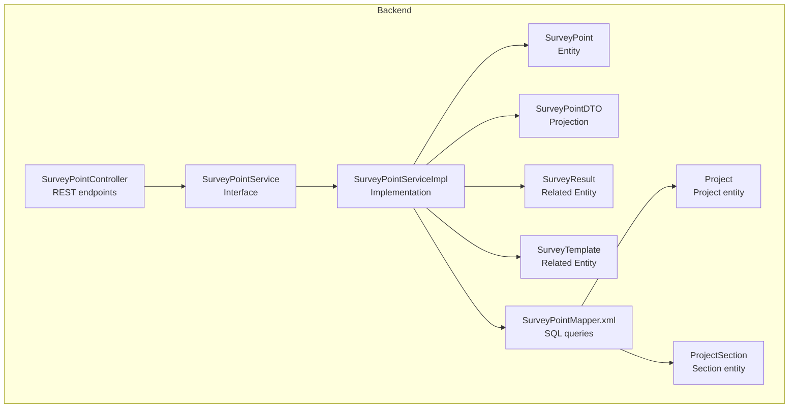
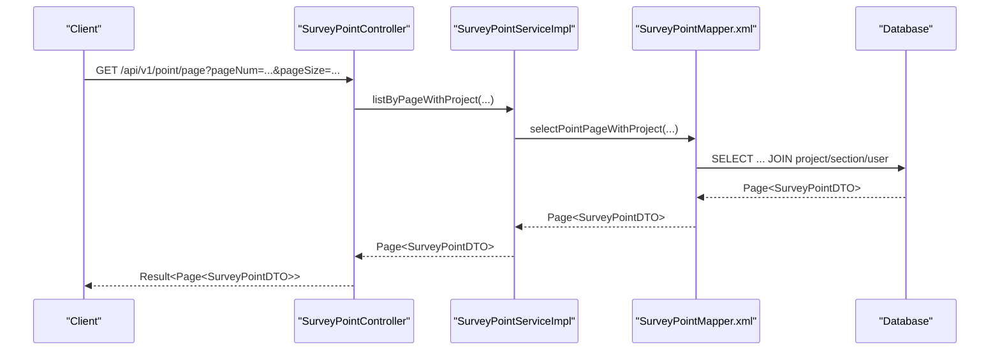
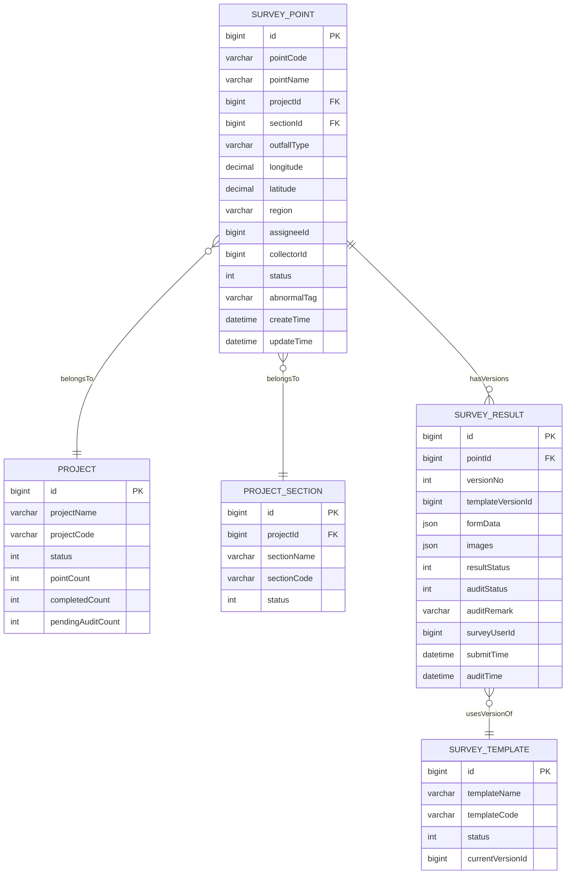
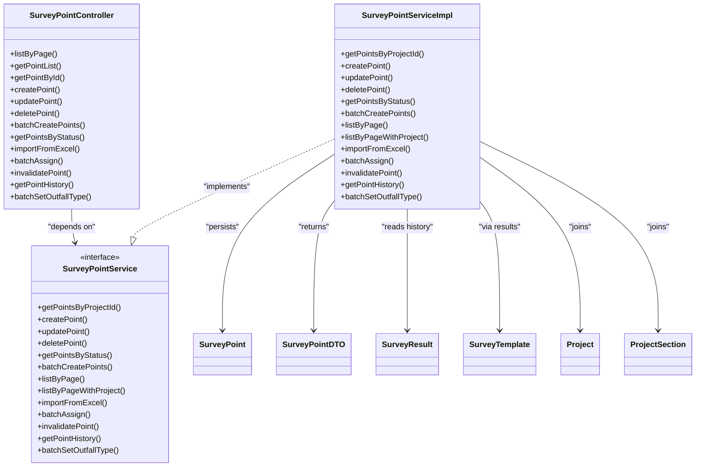

# Survey Point API

<cite>
**Referenced Files in This Document**
- [SurveyPointController.java](file://admin-backend/src/main/java/com/qhiot/survey/controller/SurveyPointController.java)
- [SurveyPointService.java](file://admin-backend/src/main/java/com/qhiot/survey/service/SurveyPointService.java)
- [SurveyPointServiceImpl.java](file://admin-backend/src/main/java/com/qhiot/survey/service/impl/SurveyPointServiceImpl.java)
- [SurveyPoint.java](file://admin-backend/src/main/java/com/qhiot/survey/entity/SurveyPoint.java)
- [SurveyPointDTO.java](file://admin-backend/src/main/java/com/qhiot/survey/dto/SurveyPointDTO.java)
- [SurveyResult.java](file://admin-backend/src/main/java/com/qhiot/survey/entity/SurveyResult.java)
- [SurveyTemplate.java](file://admin-backend/src/main/java/com/qhiot/survey/entity/SurveyTemplate.java)
- [SurveyPointMapper.xml](file://admin-backend/src/main/resources/mapper/SurveyPointMapper.xml)
- [SurveyPointStatus.java](file://admin-backend/src/main/java/com/qhiot/survey/common/enums/SurveyPointStatus.java)
- [Result.java](file://admin-backend/src/main/java/com/qhiot/survey/common/result/Result.java)
- [GlobalExceptionHandler.java](file://admin-backend/src/main/java/com/qhiot/survey/common/GlobalExceptionHandler.java)
- [Project.java](file://admin-backend/src/main/java/com/qhiot/survey/entity/Project.java)
- [ProjectSection.java](file://admin-backend/src/main/java/com/qhiot/survey/entity/ProjectSection.java)
- [point.js](file://admin-web-soybean/src/legacy/api/point.js)
</cite>

## Table of Contents
1. [Introduction](#introduction)
2. [Project Structure](#project-structure)
3. [Core Components](#core-components)
4. [Architecture Overview](#architecture-overview)
5. [Detailed Component Analysis](#detailed-component-analysis)
6. [Dependency Analysis](#dependency-analysis)
7. [Performance Considerations](#performance-considerations)
8. [Troubleshooting Guide](#troubleshooting-guide)
9. [Conclusion](#conclusion)
10. [Appendices](#appendices)

## Introduction
This document provides comprehensive API documentation for survey point management endpoints. It covers CRUD operations for survey points, including creation, retrieval, updates, and deletion. It also documents the survey point data model with GPS coordinates, status tracking, and project associations, along with filtering and pagination options for listing survey points. Bulk operations for batch processing and status updates are included, alongside coordinate handling and location-based filtering. Request/response schemas, validation rules, error handling, and the relationships between survey points and related entities such as templates and results are explained.

## Project Structure
The survey point management feature is implemented in the Spring Boot backend module under the admin-backend package. The primary components involved are:
- Controller layer exposing REST endpoints
- Service layer implementing business logic
- Entity and DTO models representing data structures
- MyBatis mapper XML for SQL queries and joins
- Enums for status values
- Unified response wrapper and global exception handling

**Diagram sources**
- [SurveyPointController.java:25-142](file://admin-backend/src/main/java/com/qhiot/survey/controller/SurveyPointController.java#L25-L142)
- [SurveyPointService.java:12-79](file://admin-backend/src/main/java/com/qhiot/survey/service/SurveyPointService.java#L12-L79)
- [SurveyPointServiceImpl.java:31-261](file://admin-backend/src/main/java/com/qhiot/survey/service/impl/SurveyPointServiceImpl.java#L31-L261)
- [SurveyPoint.java:19-84](file://admin-backend/src/main/java/com/qhiot/survey/entity/SurveyPoint.java#L19-L84)
- [SurveyPointDTO.java:17-49](file://admin-backend/src/main/java/com/qhiot/survey/dto/SurveyPointDTO.java#L17-L49)
- [SurveyResult.java:16-93](file://admin-backend/src/main/java/com/qhiot/survey/entity/SurveyResult.java#L16-L93)
- [SurveyTemplate.java:15-61](file://admin-backend/src/main/java/com/qhiot/survey/entity/SurveyTemplate.java#L15-L61)
- [SurveyPointMapper.xml:6-48](file://admin-backend/src/main/resources/mapper/SurveyPointMapper.xml#L6-L48)
- [Project.java:18-84](file://admin-backend/src/main/java/com/qhiot/survey/entity/Project.java#L18-L84)
- [ProjectSection.java:15-39](file://admin-backend/src/main/java/com/qhiot/survey/entity/ProjectSection.java#L15-L39)

**Section sources**
- [SurveyPointController.java:25-142](file://admin-backend/src/main/java/com/qhiot/survey/controller/SurveyPointController.java#L25-L142)
- [SurveyPointService.java:12-79](file://admin-backend/src/main/java/com/qhiot/survey/service/SurveyPointService.java#L12-L79)
- [SurveyPointServiceImpl.java:31-261](file://admin-backend/src/main/java/com/qhiot/survey/service/impl/SurveyPointServiceImpl.java#L31-L261)
- [SurveyPoint.java:19-84](file://admin-backend/src/main/java/com/qhiot/survey/entity/SurveyPoint.java#L19-L84)
- [SurveyPointDTO.java:17-49](file://admin-backend/src/main/java/com/qhiot/survey/dto/SurveyPointDTO.java#L17-L49)
- [SurveyResult.java:16-93](file://admin-backend/src/main/java/com/qhiot/survey/entity/SurveyResult.java#L16-L93)
- [SurveyTemplate.java:15-61](file://admin-backend/src/main/java/com/qhiot/survey/entity/SurveyTemplate.java#L15-L61)
- [SurveyPointMapper.xml:6-48](file://admin-backend/src/main/resources/mapper/SurveyPointMapper.xml#L6-L48)
- [Project.java:18-84](file://admin-backend/src/main/java/com/qhiot/survey/entity/Project.java#L18-L84)
- [ProjectSection.java:15-39](file://admin-backend/src/main/java/com/qhiot/survey/entity/ProjectSection.java#L15-L39)

## Core Components
- SurveyPointController: Exposes REST endpoints for CRUD operations, pagination, filtering, bulk actions, and Excel import.
- SurveyPointService and SurveyPointServiceImpl: Define and implement business logic for survey point operations, including validation, status transitions, and bulk processing.
- SurveyPoint entity: Represents the persisted survey point with GPS coordinates, status, and associations.
- SurveyPointDTO: Extends the entity to include project and user-related fields for list views.
- SurveyResult and SurveyTemplate: Related entities indicating the connection between points and results/templates.
- SurveyPointMapper.xml: SQL queries for paginated listing with joins to projects, sections, and users.
- Enums: SurveyPointStatus defines lifecycle states.
- Unified response and exception handling: Standardized Result wrapper and GlobalExceptionHandler.

**Section sources**
- [SurveyPointController.java:25-142](file://admin-backend/src/main/java/com/qhiot/survey/controller/SurveyPointController.java#L25-L142)
- [SurveyPointService.java:12-79](file://admin-backend/src/main/java/com/qhiot/survey/service/SurveyPointService.java#L12-L79)
- [SurveyPointServiceImpl.java:31-261](file://admin-backend/src/main/java/com/qhiot/survey/service/impl/SurveyPointServiceImpl.java#L31-L261)
- [SurveyPoint.java:19-84](file://admin-backend/src/main/java/com/qhiot/survey/entity/SurveyPoint.java#L19-L84)
- [SurveyPointDTO.java:17-49](file://admin-backend/src/main/java/com/qhiot/survey/dto/SurveyPointDTO.java#L17-L49)
- [SurveyResult.java:16-93](file://admin-backend/src/main/java/com/qhiot/survey/entity/SurveyResult.java#L16-L93)
- [SurveyTemplate.java:15-61](file://admin-backend/src/main/java/com/qhiot/survey/entity/SurveyTemplate.java#L15-L61)
- [SurveyPointMapper.xml:6-48](file://admin-backend/src/main/resources/mapper/SurveyPointMapper.xml#L6-L48)
- [SurveyPointStatus.java:9-34](file://admin-backend/src/main/java/com/qhiot/survey/common/enums/SurveyPointStatus.java#L9-L34)
- [Result.java:11-41](file://admin-backend/src/main/java/com/qhiot/survey/common/result/Result.java#L11-L41)
- [GlobalExceptionHandler.java:23-103](file://admin-backend/src/main/java/com/qhiot/survey/common/GlobalExceptionHandler.java#L23-L103)

## Architecture Overview
The API follows a layered architecture:
- Presentation: Controller exposes endpoints under /api/v1/point.
- Application: Service orchestrates business rules and delegates persistence.
- Persistence: MyBatis mapper executes SQL with joins for enriched listings.
- Data models: Entities and DTOs define schemas and projections.

**Diagram sources**
- [SurveyPointController.java:30-40](file://admin-backend/src/main/java/com/qhiot/survey/controller/SurveyPointController.java#L30-L40)
- [SurveyPointServiceImpl.java:121-125](file://admin-backend/src/main/java/com/qhiot/survey/service/impl/SurveyPointServiceImpl.java#L121-L125)
- [SurveyPointMapper.xml:6-48](file://admin-backend/src/main/resources/mapper/SurveyPointMapper.xml#L6-L48)

**Section sources**
- [SurveyPointController.java:25-142](file://admin-backend/src/main/java/com/qhiot/survey/controller/SurveyPointController.java#L25-L142)
- [SurveyPointServiceImpl.java:121-125](file://admin-backend/src/main/java/com/qhiot/survey/service/impl/SurveyPointServiceImpl.java#L121-L125)
- [SurveyPointMapper.xml:6-48](file://admin-backend/src/main/resources/mapper/SurveyPointMapper.xml#L6-L48)

## Detailed Component Analysis

### Endpoint Catalog and Schemas

#### Base Path
- Base Path: /api/v1/point

#### Authentication and Authorization
- The controller methods are annotated with operation logging but do not explicitly declare @PreAuthorize or @Secured annotations in the provided code. Authorization policies are enforced by the framework configuration outside the scope of these files.

#### Unified Response Wrapper
- All endpoints return a standardized Result wrapper with fields: code, message, data.
- Success responses carry data; error responses carry error code and message.

**Section sources**
- [Result.java:11-41](file://admin-backend/src/main/java/com/qhiot/survey/common/result/Result.java#L11-L41)
- [SurveyPointController.java:25-142](file://admin-backend/src/main/java/com/qhiot/survey/controller/SurveyPointController.java#L25-L142)

#### Pagination and Filtering
- Pagination: pageNum and pageSize parameters with defaults.
- Filtering: projectId, sectionId, keyword, status supported for paginated lists.

**Section sources**
- [SurveyPointController.java:30-40](file://admin-backend/src/main/java/com/qhiot/survey/controller/SurveyPointController.java#L30-L40)
- [SurveyPointMapper.xml:34-46](file://admin-backend/src/main/resources/mapper/SurveyPointMapper.xml#L34-L46)

#### CRUD Endpoints

##### GET /api/v1/point/page
- Description: Paginated list of survey points with project and section details.
- Query Parameters:
  - projectId: Long (optional)
  - sectionId: Long (optional)
  - keyword: String (optional)
  - status: Integer (optional)
  - pageNum: Integer (default 1)
  - pageSize: Integer (default 10)
- Response: Result<Page<SurveyPointDTO>>

**Section sources**
- [SurveyPointController.java:30-40](file://admin-backend/src/main/java/com/qhiot/survey/controller/SurveyPointController.java#L30-L40)
- [SurveyPointServiceImpl.java:121-125](file://admin-backend/src/main/java/com/qhiot/survey/service/impl/SurveyPointServiceImpl.java#L121-L125)
- [SurveyPointMapper.xml:6-48](file://admin-backend/src/main/resources/mapper/SurveyPointMapper.xml#L6-L48)

##### GET /api/v1/point/list
- Description: List of survey points optionally filtered by projectId.
- Query Parameter:
  - projectId: Long (optional)
- Response: Result<List<SurveyPoint>>

**Section sources**
- [SurveyPointController.java:42-52](file://admin-backend/src/main/java/com/qhiot/survey/controller/SurveyPointController.java#L42-L52)
- [SurveyPointServiceImpl.java:36-42](file://admin-backend/src/main/java/com/qhiot/survey/service/impl/SurveyPointServiceImpl.java#L36-L42)

##### GET /api/v1/point/{id}
- Description: Retrieve a single survey point by ID.
- Path Parameter:
  - id: Long (required)
- Response: Result<SurveyPoint>

**Section sources**
- [SurveyPointController.java:54-59](file://admin-backend/src/main/java/com/qhiot/survey/controller/SurveyPointController.java#L54-L59)
- [SurveyPointServiceImpl.java:62-70](file://admin-backend/src/main/java/com/qhiot/survey/service/impl/SurveyPointServiceImpl.java#L62-L70)

##### POST /api/v1/point/create
- Description: Create a single survey point.
- Request Body: SurveyPoint
- Response: Result<SurveyPoint>
- Validation:
  - Unique pointCode per project (enforced via service logic)
  - Default status set to PENDING

**Section sources**
- [SurveyPointController.java:61-66](file://admin-backend/src/main/java/com/qhiot/survey/controller/SurveyPointController.java#L61-L66)
- [SurveyPointServiceImpl.java:44-58](file://admin-backend/src/main/java/com/qhiot/survey/service/impl/SurveyPointServiceImpl.java#L44-L58)
- [SurveyPointStatus.java:9-16](file://admin-backend/src/main/java/com/qhiot/survey/common/enums/SurveyPointStatus.java#L9-L16)

##### PUT /api/v1/point/update/{id}
- Description: Update an existing survey point.
- Path Parameter:
  - id: Long (required)
- Request Body: SurveyPoint
- Response: Result<SurveyPoint>

**Section sources**
- [SurveyPointController.java:68-73](file://admin-backend/src/main/java/com/qhiot/survey/controller/SurveyPointController.java#L68-L73)
- [SurveyPointServiceImpl.java:60-70](file://admin-backend/src/main/java/com/qhiot/survey/service/impl/SurveyPointServiceImpl.java#L60-L70)

##### DELETE /api/v1/point/delete/{id}
- Description: Delete a survey point (soft delete).
- Path Parameter:
  - id: Long (required)
- Response: Result<Void>

**Section sources**
- [SurveyPointController.java:75-81](file://admin-backend/src/main/java/com/qhiot/survey/controller/SurveyPointController.java#L75-L81)
- [SurveyPointServiceImpl.java:72-82](file://admin-backend/src/main/java/com/qhiot/survey/service/impl/SurveyPointServiceImpl.java#L72-L82)

#### Bulk Operations

##### POST /api/v1/point/batch
- Description: Batch create multiple survey points.
- Request Body: List<SurveyPoint>
- Response: Result<Boolean>

**Section sources**
- [SurveyPointController.java:83-89](file://admin-backend/src/main/java/com/qhiot/survey/controller/SurveyPointController.java#L83-L89)
- [SurveyPointServiceImpl.java:91-95](file://admin-backend/src/main/java/com/qhiot/survey/service/impl/SurveyPointServiceImpl.java#L91-L95)

##### POST /api/v1/point/batch-assign
- Description: Assign multiple points to a collector within a project.
- Query Parameters:
  - projectId: Long (required)
  - assigneeId: Long (required)
- Request Body: List<Long> (pointIds)
- Response: Result<Void>

**Section sources**
- [SurveyPointController.java:107-116](file://admin-backend/src/main/java/com/qhiot/survey/controller/SurveyPointController.java#L107-L116)
- [SurveyPointServiceImpl.java:187-197](file://admin-backend/src/main/java/com/qhiot/survey/service/impl/SurveyPointServiceImpl.java#L187-L197)

##### POST /api/v1/point/batch-set-outfall-type
- Description: Set outfall type for multiple points.
- Query Parameters:
  - outfallType: String (required)
- Request Body: List<Long> (pointIds)
- Response: Result<Void>

**Section sources**
- [SurveyPointController.java:133-141](file://admin-backend/src/main/java/com/qhiot/survey/controller/SurveyPointController.java#L133-L141)
- [SurveyPointServiceImpl.java:236-246](file://admin-backend/src/main/java/com/qhiot/survey/service/impl/SurveyPointServiceImpl.java#L236-L246)

#### Status and Specialized Endpoints

##### GET /api/v1/point/status/{status}
- Description: List points filtered by status.
- Path Parameter:
  - status: Integer (required)
- Response: Result<List<SurveyPoint>>

**Section sources**
- [SurveyPointController.java:91-96](file://admin-backend/src/main/java/com/qhiot/survey/controller/SurveyPointController.java#L91-L96)
- [SurveyPointServiceImpl.java:84-89](file://admin-backend/src/main/java/com/qhiot/survey/service/impl/SurveyPointServiceImpl.java#L84-L89)

##### POST /api/v1/point/import
- Description: Import points from an Excel file into a project.
- Query Parameters:
  - file: MultipartFile (required)
  - projectId: Long (required)
- Response: Result<Map<String,Object>>
  - Fields: successCount, failCount, errors

**Section sources**
- [SurveyPointController.java:98-105](file://admin-backend/src/main/java/com/qhiot/survey/controller/SurveyPointController.java#L98-L105)
- [SurveyPointServiceImpl.java:127-185](file://admin-backend/src/main/java/com/qhiot/survey/service/impl/SurveyPointServiceImpl.java#L127-L185)

##### POST /api/v1/point/{id}/invalidate
- Description: Mark a point as invalidated with a reason.
- Path Parameter:
  - id: Long (required)
- Query Parameters:
  - reason: String (required)
- Response: Result<Void>

**Section sources**
- [SurveyPointController.java:118-125](file://admin-backend/src/main/java/com/qhiot/survey/controller/SurveyPointController.java#L118-L125)
- [SurveyPointServiceImpl.java:199-209](file://admin-backend/src/main/java/com/qhiot/survey/service/impl/SurveyPointServiceImpl.java#L199-L209)

##### GET /api/v1/point/{id}/history
- Description: Retrieve historical versions of a point’s associated results.
- Path Parameter:
  - id: Long (required)
- Response: Result<List<Map<String,Object>>>
  - Fields per record: versionNo, status, auditStatus, auditRemark, submitTime, auditTime

**Section sources**
- [SurveyPointController.java:127-131](file://admin-backend/src/main/java/com/qhiot/survey/controller/SurveyPointController.java#L127-L131)
- [SurveyPointServiceImpl.java:211-234](file://admin-backend/src/main/java/com/qhiot/survey/service/impl/SurveyPointServiceImpl.java#L211-L234)

### Data Model and Relationships

#### SurveyPoint Entity
- Core attributes include identifiers, project and section associations, outfall type, GPS coordinates, status, abnormal tag, and timestamps.
- Coordinates are stored as BigDecimal for precision.

**Section sources**
- [SurveyPoint.java:19-84](file://admin-backend/src/main/java/com/qhiot/survey/entity/SurveyPoint.java#L19-L84)

#### SurveyPointDTO Projection
- Extends SurveyPoint to include projectName, projectCode, sectionName, collectorName, and assigneeName for enriched list views.

**Section sources**
- [SurveyPointDTO.java:17-49](file://admin-backend/src/main/java/com/qhiot/survey/dto/SurveyPointDTO.java#L17-L49)

#### Related Entities
- Project: Associates points to a project with metadata and counts.
- ProjectSection: Associates points to a section within a project.
- SurveyResult: Connects points to survey results with versioning and audit fields.
- SurveyTemplate: Defines templates used for surveys; points relate to results which reference template versions.

**Diagram sources**
- [SurveyPoint.java:19-84](file://admin-backend/src/main/java/com/qhiot/survey/entity/SurveyPoint.java#L19-L84)
- [Project.java:18-84](file://admin-backend/src/main/java/com/qhiot/survey/entity/Project.java#L18-L84)
- [ProjectSection.java:15-39](file://admin-backend/src/main/java/com/qhiot/survey/entity/ProjectSection.java#L15-L39)
- [SurveyResult.java:16-93](file://admin-backend/src/main/java/com/qhiot/survey/entity/SurveyResult.java#L16-L93)
- [SurveyTemplate.java:15-61](file://admin-backend/src/main/java/com/qhiot/survey/entity/SurveyTemplate.java#L15-L61)

### Filtering and Pagination Details
- Filtering supports:
  - projectId: Exact match on project association
  - sectionId: Exact match on section association
  - keyword: Full-text search on pointName or pointCode
  - status: Exact match on point status
- Pagination uses MyBatis-Plus Page with pageNum and pageSize parameters.
- Sorting: Results are ordered by create_time descending.

**Section sources**
- [SurveyPointController.java:30-40](file://admin-backend/src/main/java/com/qhiot/survey/controller/SurveyPointController.java#L30-L40)
- [SurveyPointMapper.xml:34-47](file://admin-backend/src/main/resources/mapper/SurveyPointMapper.xml#L34-L47)
- [SurveyPointServiceImpl.java:97-119](file://admin-backend/src/main/java/com/qhiot/survey/service/impl/SurveyPointServiceImpl.java#L97-L119)

### Coordinate Handling and Spatial Queries
- GPS coordinates are represented as BigDecimal and stored per point.
- The backend does not implement explicit spatial indexing or distance calculations in the provided code. Location-based filtering is performed via keyword matching on region and point name/code.
- Mobile utilities demonstrate distance calculation and location formatting, indicating client-side spatial logic exists in the mobile app.

**Section sources**
- [SurveyPoint.java:46-48](file://admin-backend/src/main/java/com/qhiot/survey/entity/SurveyPoint.java#L46-L48)
- [SurveyPointMapper.xml:40-42](file://admin-backend/src/main/resources/mapper/SurveyPointMapper.xml#L40-L42)
- [mobile-app/src/utils/location.js:223-356](file://mobile-app/src/utils/location.js#L223-L356)

### Request/Response Schemas

#### SurveyPoint (Request/Response)
- Fields:
  - id: Long
  - pointCode: String
  - pointName: String
  - projectId: Long
  - sectionId: Long
  - outfallType: String
  - longitude: BigDecimal
  - latitude: BigDecimal
  - region: String
  - assigneeId: Long
  - collectorId: Long
  - status: Integer
  - abnormalTag: String
  - createTime: LocalDateTime
  - updateTime: LocalDateTime

**Section sources**
- [SurveyPoint.java:19-84](file://admin-backend/src/main/java/com/qhiot/survey/entity/SurveyPoint.java#L19-L84)

#### SurveyPointDTO (Response for paginated list)
- Includes all SurveyPoint fields plus:
  - projectName: String
  - projectCode: String
  - sectionName: String
  - collectorName: String
  - assigneeName: String

**Section sources**
- [SurveyPointDTO.java:17-49](file://admin-backend/src/main/java/com/qhiot/survey/dto/SurveyPointDTO.java#L17-L49)

#### Import Result (POST /point/import)
- Fields:
  - successCount: Integer
  - failCount: Integer
  - errors: List<String>

**Section sources**
- [SurveyPointServiceImpl.java:129-185](file://admin-backend/src/main/java/com/qhiot/survey/service/impl/SurveyPointServiceImpl.java#L129-L185)

#### History Records (GET /point/{id}/history)
- Fields per record:
  - versionNo: Integer
  - status: Integer
  - auditStatus: Integer
  - auditRemark: String
  - submitTime: LocalDateTime
  - auditTime: LocalDateTime

**Section sources**
- [SurveyPointServiceImpl.java:211-234](file://admin-backend/src/main/java/com/qhiot/survey/service/impl/SurveyPointServiceImpl.java#L211-L234)

### Validation Rules
- Unique pointCode per project during creation.
- Default status set to PENDING on creation.
- Soft delete semantics via isDeleted flag.
- Business exceptions thrown for invalid operations (e.g., updating non-existent point).

**Section sources**
- [SurveyPointServiceImpl.java:44-58](file://admin-backend/src/main/java/com/qhiot/survey/service/impl/SurveyPointServiceImpl.java#L44-L58)
- [SurveyPointServiceImpl.java:72-82](file://admin-backend/src/main/java/com/qhiot/survey/service/impl/SurveyPointServiceImpl.java#L72-L82)
- [SurveyPointServiceImpl.java:199-209](file://admin-backend/src/main/java/com/qhiot/survey/service/impl/SurveyPointServiceImpl.java#L199-L209)

### Error Handling
- GlobalExceptionHandler converts business exceptions to unified Result with appropriate codes.
- Common HTTP error scenarios:
  - 400 Bad Request: Validation/bind errors and missing parameters
  - 403 Forbidden: AccessDeniedException
  - 404 Not Found: NoResourceFoundException
  - 405 Method Not Allowed: HttpRequestMethodNotSupportedException
  - 500 Internal Server Error: General exceptions

**Section sources**
- [GlobalExceptionHandler.java:23-103](file://admin-backend/src/main/java/com/qhiot/survey/common/GlobalExceptionHandler.java#L23-L103)
- [Result.java:11-41](file://admin-backend/src/main/java/com/qhiot/survey/common/result/Result.java#L11-L41)

### Relationship Between Survey Points and Templates/Results
- Survey points are linked to survey results via pointId.
- Results reference template versions, enabling template-driven data capture.
- The history endpoint aggregates result versions for auditing and review.

**Section sources**
- [SurveyResult.java:16-93](file://admin-backend/src/main/java/com/qhiot/survey/entity/SurveyResult.java#L16-L93)
- [SurveyTemplate.java:15-61](file://admin-backend/src/main/java/com/qhiot/survey/entity/SurveyTemplate.java#L15-L61)
- [SurveyPointServiceImpl.java:211-234](file://admin-backend/src/main/java/com/qhiot/survey/service/impl/SurveyPointServiceImpl.java#L211-L234)

## Dependency Analysis

**Diagram sources**
- [SurveyPointController.java:25-142](file://admin-backend/src/main/java/com/qhiot/survey/controller/SurveyPointController.java#L25-L142)
- [SurveyPointService.java:12-79](file://admin-backend/src/main/java/com/qhiot/survey/service/SurveyPointService.java#L12-L79)
- [SurveyPointServiceImpl.java:31-261](file://admin-backend/src/main/java/com/qhiot/survey/service/impl/SurveyPointServiceImpl.java#L31-L261)
- [SurveyPoint.java:19-84](file://admin-backend/src/main/java/com/qhiot/survey/entity/SurveyPoint.java#L19-L84)
- [SurveyPointDTO.java:17-49](file://admin-backend/src/main/java/com/qhiot/survey/dto/SurveyPointDTO.java#L17-L49)
- [SurveyResult.java:16-93](file://admin-backend/src/main/java/com/qhiot/survey/entity/SurveyResult.java#L16-L93)
- [SurveyTemplate.java:15-61](file://admin-backend/src/main/java/com/qhiot/survey/entity/SurveyTemplate.java#L15-L61)
- [Project.java:18-84](file://admin-backend/src/main/java/com/qhiot/survey/entity/Project.java#L18-L84)
- [ProjectSection.java:15-39](file://admin-backend/src/main/java/com/qhiot/survey/entity/ProjectSection.java#L15-L39)

**Section sources**
- [SurveyPointController.java:25-142](file://admin-backend/src/main/java/com/qhiot/survey/controller/SurveyPointController.java#L25-L142)
- [SurveyPointService.java:12-79](file://admin-backend/src/main/java/com/qhiot/survey/service/SurveyPointService.java#L12-L79)
- [SurveyPointServiceImpl.java:31-261](file://admin-backend/src/main/java/com/qhiot/survey/service/impl/SurveyPointServiceImpl.java#L31-L261)

## Performance Considerations
- Pagination: Implemented with MyBatis-Plus Page to avoid loading large datasets.
- Filtering: Uses selective WHERE clauses on indexed or commonly filtered columns.
- Enriched listing: JOINs with project, section, and user tables; ensure appropriate indexes exist for join/filter columns.
- Excel import: Batch saves reduce round-trips; consider chunking large imports.
- Soft deletes: Filtering by isDeleted avoids scanning deleted records.

[No sources needed since this section provides general guidance]

## Troubleshooting Guide
- Creation fails with “pointCode already exists”: Ensure uniqueness of pointCode within the project scope.
- Update fails with “point does not exist”: Verify the point ID and soft-delete state.
- Import errors: Inspect the returned errors array for row-specific failures.
- Permission denied: Check authorization configuration for the calling user.
- Unexpected 500 errors: Review server logs for stack traces; the global handler masks internal details for security.

**Section sources**
- [SurveyPointServiceImpl.java:44-58](file://admin-backend/src/main/java/com/qhiot/survey/service/impl/SurveyPointServiceImpl.java#L44-L58)
- [SurveyPointServiceImpl.java:60-70](file://admin-backend/src/main/java/com/qhiot/survey/service/impl/SurveyPointServiceImpl.java#L60-L70)
- [SurveyPointServiceImpl.java:127-185](file://admin-backend/src/main/java/com/qhiot/survey/service/impl/SurveyPointServiceImpl.java#L127-L185)
- [GlobalExceptionHandler.java:23-103](file://admin-backend/src/main/java/com/qhiot/survey/common/GlobalExceptionHandler.java#L23-L103)

## Conclusion
The survey point management API provides robust CRUD capabilities, pagination, filtering, and bulk operations. It integrates with project and section entities and connects points to results and templates. The design emphasizes a clean separation of concerns, standardized responses, and centralized error handling. For production deployments, ensure proper indexing and consider spatial extensions for advanced location-based features.

[No sources needed since this section summarizes without analyzing specific files]

## Appendices

### Frontend API Proxies
- Legacy proxy for point API endpoints is defined in the admin-web-soybean module.

**Section sources**
- [point.js:1-48](file://admin-web-soybean/src/legacy/api/point.js#L1-L48)