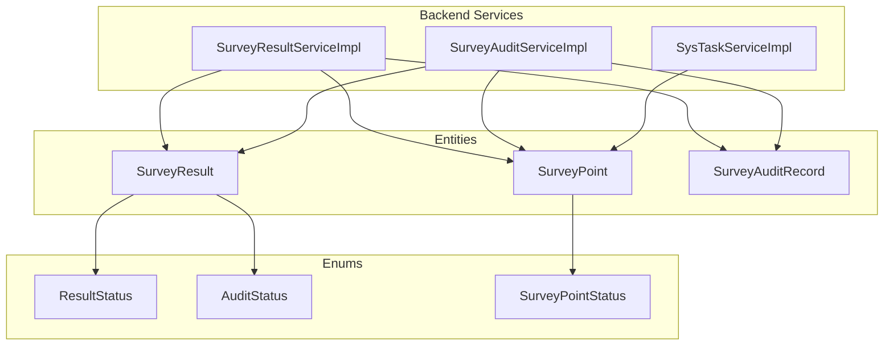
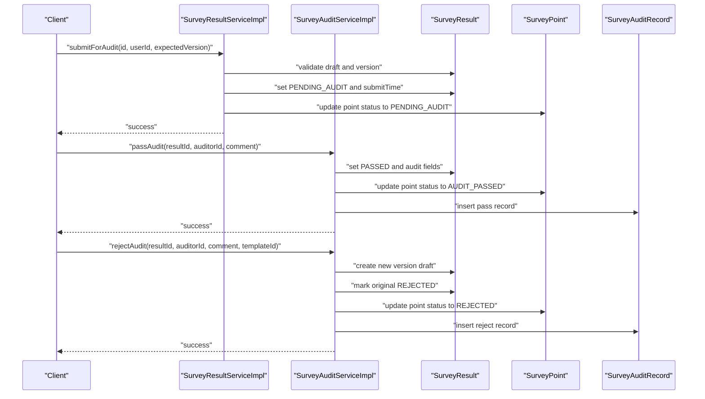
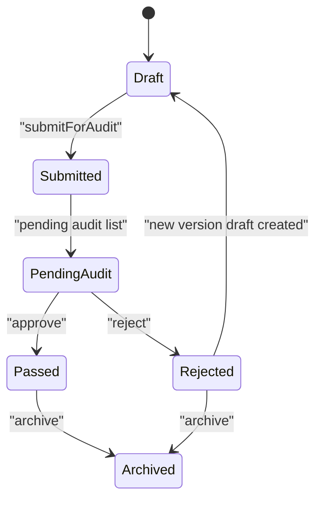
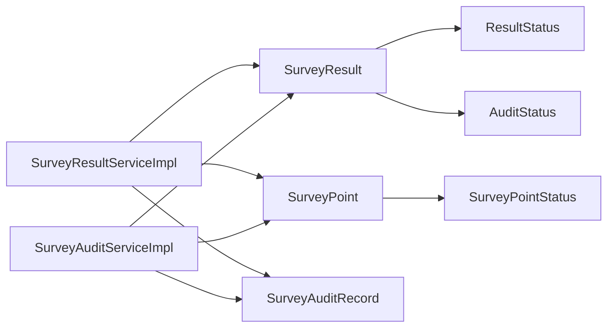

# Approval Workflow Routing

<cite>
**Referenced Files in This Document**
- [SurveyResultServiceImpl.java](file://admin-backend/src/main/java/com/qhiot/survey/service/impl/SurveyResultServiceImpl.java)
- [SurveyAuditServiceImpl.java](file://admin-backend/src/main/java/com/qhiot/survey/service/impl/SurveyAuditServiceImpl.java)
- [SurveyResult.java](file://admin-backend/src/main/java/com/qhiot/survey/entity/SurveyResult.java)
- [SurveyPoint.java](file://admin-backend/src/main/java/com/qhiot/survey/entity/SurveyPoint.java)
- [SurveyAuditRecord.java](file://admin-backend/src/main/java/com/qhiot/survey/entity/SurveyAuditRecord.java)
- [ResultStatus.java](file://admin-backend/src/main/java/com/qhiot/survey/common/enums/ResultStatus.java)
- [AuditStatus.java](file://admin-backend/src/main/java/com/qhiot/survey/common/enums/AuditStatus.java)
- [SurveyPointStatus.java](file://admin-backend/src/main/java/com/qhiot/survey/common/enums/SurveyPointStatus.java)
- [05-database-indexes.sql](file://admin-backend/init-data/05-database-indexes.sql)
- [SysTaskServiceImpl.java](file://admin-backend/src/main/java/com/qhiot/survey/service/impl/SysTaskServiceImpl.java)
- [review-detail.html](file://admin-web-soybean/public/samples/review-detail.html)
- [dashboard-v2.html](file://admin-web-soybean/public/samples/dashboard-v2.html)
- [dashboard-analytics.html](file://admin-web-soybean/public/samples/dashboard-analytics.html)
- [SurveyResultServiceTest.java](file://admin-backend/src/test/java/com/qhiot/survey/service/SurveyResultServiceTest.java)
</cite>

## Table of Contents
1. [Introduction](#introduction)
2. [Project Structure](#project-structure)
3. [Core Components](#core-components)
4. [Architecture Overview](#architecture-overview)
5. [Detailed Component Analysis](#detailed-component-analysis)
6. [Dependency Analysis](#dependency-analysis)
7. [Performance Considerations](#performance-considerations)
8. [Troubleshooting Guide](#troubleshooting-guide)
9. [Conclusion](#conclusion)
10. [Appendices](#appendices)

## Introduction
This document describes the approval workflow routing system for survey results. It explains how results move through states (draft, submitted, pending audit, passed, rejected, archived), how reviewers are assigned and managed, and how routing integrates with user roles and capacity. It also documents escalation paths for overdue reviews, monitoring and metrics, and optimization strategies derived from the codebase.

## Project Structure
The approval workflow spans backend services and entities, plus frontend UI samples that illustrate review detail and dashboards. The backend services orchestrate state transitions and auditing, while entities model the lifecycle of survey results and points. Indexes support efficient querying of audit and result lists.

**Diagram sources**
- [SurveyResultServiceImpl.java:1-364](file://admin-backend/src/main/java/com/qhiot/survey/service/impl/SurveyResultServiceImpl.java#L1-L364)
- [SurveyAuditServiceImpl.java:1-190](file://admin-backend/src/main/java/com/qhiot/survey/service/impl/SurveyAuditServiceImpl.java#L1-L190)
- [SysTaskServiceImpl.java:1-149](file://admin-backend/src/main/java/com/qhiot/survey/service/impl/SysTaskServiceImpl.java#L1-L149)
- [SurveyResult.java:1-93](file://admin-backend/src/main/java/com/qhiot/survey/entity/SurveyResult.java#L1-L93)
- [SurveyPoint.java:1-84](file://admin-backend/src/main/java/com/qhiot/survey/entity/SurveyPoint.java#L1-L84)
- [SurveyAuditRecord.java:1-37](file://admin-backend/src/main/java/com/qhiot/survey/entity/SurveyAuditRecord.java#L1-L37)
- [ResultStatus.java:1-33](file://admin-backend/src/main/java/com/qhiot/survey/common/enums/ResultStatus.java#L1-L33)
- [AuditStatus.java:1-30](file://admin-backend/src/main/java/com/qhiot/survey/common/enums/AuditStatus.java#L1-L30)
- [SurveyPointStatus.java:1-34](file://admin-backend/src/main/java/com/qhiot/survey/common/enums/SurveyPointStatus.java#L1-L34)

**Section sources**
- [SurveyResultServiceImpl.java:1-364](file://admin-backend/src/main/java/com/qhiot/survey/service/impl/SurveyResultServiceImpl.java#L1-L364)
- [SurveyAuditServiceImpl.java:1-190](file://admin-backend/src/main/java/com/qhiot/survey/service/impl/SurveyAuditServiceImpl.java#L1-L190)
- [SurveyResult.java:1-93](file://admin-backend/src/main/java/com/qhiot/survey/entity/SurveyResult.java#L1-L93)
- [SurveyPoint.java:1-84](file://admin-backend/src/main/java/com/qhiot/survey/entity/SurveyPoint.java#L1-L84)
- [SurveyAuditRecord.java:1-37](file://admin-backend/src/main/java/com/qhiot/survey/entity/SurveyAuditRecord.java#L1-L37)
- [ResultStatus.java:1-33](file://admin-backend/src/main/java/com/qhiot/survey/common/enums/ResultStatus.java#L1-L33)
- [AuditStatus.java:1-30](file://admin-backend/src/main/java/com/qhiot/survey/common/enums/AuditStatus.java#L1-L30)
- [SurveyPointStatus.java:1-34](file://admin-backend/src/main/java/com/qhiot/survey/common/enums/SurveyPointStatus.java#L1-L34)

## Core Components
- SurveyResultService: Manages creation, updates, submission, and audit actions for survey results. Handles versioning, optimistic locking, and state transitions.
- SurveyAuditService: Provides pending audit listings, audit detail retrieval, single and batch approvals, rejection with versioning, and audit records retrieval.
- Entities: SurveyResult, SurveyPoint, and SurveyAuditRecord capture lifecycle, status, and audit trail.
- Enums: ResultStatus, AuditStatus, and SurveyPointStatus define allowed states and transitions.

Key responsibilities:
- State enforcement: Only specific statuses allow transitions (e.g., draft to pending audit, pending audit to passed/rejected).
- Versioning: Rejection creates a new draft version; submit-for-audit validates version consistency.
- Auditing: All decisions are recorded in SurveyAuditRecord with action, comments, and timestamps.
- Point synchronization: Point status mirrors result audit outcomes.

**Section sources**
- [SurveyResultServiceImpl.java:158-237](file://admin-backend/src/main/java/com/qhiot/survey/service/impl/SurveyResultServiceImpl.java#L158-L237)
- [SurveyAuditServiceImpl.java:42-162](file://admin-backend/src/main/java/com/qhiot/survey/service/impl/SurveyAuditServiceImpl.java#L42-L162)
- [SurveyResult.java:44-82](file://admin-backend/src/main/java/com/qhiot/survey/entity/SurveyResult.java#L44-L82)
- [SurveyPoint.java:65-83](file://admin-backend/src/main/java/com/qhiot/survey/entity/SurveyPoint.java#L65-L83)
- [SurveyAuditRecord.java:18-36](file://admin-backend/src/main/java/com/qhiot/survey/entity/SurveyAuditRecord.java#L18-L36)
- [ResultStatus.java:9-15](file://admin-backend/src/main/java/com/qhiot/survey/common/enums/ResultStatus.java#L9-L15)
- [AuditStatus.java:9-12](file://admin-backend/src/main/java/com/qhiot/survey/common/enums/AuditStatus.java#L9-L12)
- [SurveyPointStatus.java:9-16](file://admin-backend/src/main/java/com/qhiot/survey/common/enums/SurveyPointStatus.java#L9-L16)

## Architecture Overview
The workflow is orchestrated by services that enforce state machines and maintain audit trails. Results and points are linked via pointId, ensuring consistent state propagation. Pending audit lists are filtered by result status and optionally by keyword.

**Diagram sources**
- [SurveyResultServiceImpl.java:270-311](file://admin-backend/src/main/java/com/qhiot/survey/service/impl/SurveyResultServiceImpl.java#L270-L311)
- [SurveyAuditServiceImpl.java:63-141](file://admin-backend/src/main/java/com/qhiot/survey/service/impl/SurveyAuditServiceImpl.java#L63-L141)
- [SurveyResult.java:44-82](file://admin-backend/src/main/java/com/qhiot/survey/entity/SurveyResult.java#L44-L82)
- [SurveyPoint.java:65-83](file://admin-backend/src/main/java/com/qhiot/survey/entity/SurveyPoint.java#L65-L83)
- [SurveyAuditRecord.java:18-36](file://admin-backend/src/main/java/com/qhiot/survey/entity/SurveyAuditRecord.java#L18-L36)

## Detailed Component Analysis

### State Machine and Transitions
The system enforces strict state transitions for both results and points:
- Result statuses: draft → submitted → pending audit → passed/rejected → archived.
- Point statuses: pending → draft → pending audit → audit passed → rejected → archived → invalidated.

**Diagram sources**
- [ResultStatus.java:9-15](file://admin-backend/src/main/java/com/qhiot/survey/common/enums/ResultStatus.java#L9-L15)
- [SurveyPointStatus.java:9-16](file://admin-backend/src/main/java/com/qhiot/survey/common/enums/SurveyPointStatus.java#L9-L16)
- [SurveyResultServiceImpl.java:158-237](file://admin-backend/src/main/java/com/qhiot/survey/service/impl/SurveyResultServiceImpl.java#L158-L237)
- [SurveyAuditServiceImpl.java:63-141](file://admin-backend/src/main/java/com/qhiot/survey/service/impl/SurveyAuditServiceImpl.java#L63-L141)

**Section sources**
- [ResultStatus.java:1-33](file://admin-backend/src/main/java/com/qhiot/survey/common/enums/ResultStatus.java#L1-L33)
- [SurveyPointStatus.java:1-34](file://admin-backend/src/main/java/com/qhiot/survey/common/enums/SurveyPointStatus.java#L1-L34)
- [SurveyResultServiceImpl.java:158-237](file://admin-backend/src/main/java/com/qhiot/survey/service/impl/SurveyResultServiceImpl.java#L158-L237)
- [SurveyAuditServiceImpl.java:63-141](file://admin-backend/src/main/java/com/qhiot/survey/service/impl/SurveyAuditServiceImpl.java#L63-L141)

### Routing Rules and Reviewer Assignment
Current implementation does not include explicit configurable routing rules for reviewers based on project type, region, or result complexity. Pending audit items are retrieved by status and optional keyword filtering, but assignment logic is not present in the reviewed files.

- Pending audit list retrieval filters by result status and supports keyword search on point identifiers.
- No explicit reviewer capacity checks or load balancing are implemented in the reviewed services.

**Section sources**
- [SurveyAuditServiceImpl.java:42-52](file://admin-backend/src/main/java/com/qhiot/survey/service/impl/SurveyAuditServiceImpl.java#L42-L52)

### Escalation Mechanisms
Escalation for overdue reviews is not implemented in the reviewed backend services. The codebase includes a task notification mechanism for assigning tasks to users, but escalation policies (e.g., time-based transfer to supervisors) are not present in the examined files.

**Section sources**
- [SysTaskServiceImpl.java:128-148](file://admin-backend/src/main/java/com/qhiot/survey/service/impl/SysTaskServiceImpl.java#L128-L148)

### Workflow Monitoring and Metrics
The frontend samples demonstrate dashboard widgets for metrics such as average audit time and completeness rate, indicating monitoring capabilities exist at the UI layer. Backend services record audit actions and maintain audit records for traceability.

- Frontend dashboard widgets show average audit time and completeness metrics.
- Audit records capture action, comment, and timestamps for each decision.

**Section sources**
- [dashboard-v2.html:1100-1134](file://admin-web-soybean/public/samples/dashboard-v2.html#L1100-L1134)
- [dashboard-analytics.html:669-704](file://admin-web-soybean/public/samples/dashboard-analytics.html#L669-L704)
- [SurveyAuditRecord.java:18-36](file://admin-backend/src/main/java/com/qhiot/survey/entity/SurveyAuditRecord.java#L18-L36)

### Examples and Scenarios
- Submit for audit: Only draft results can be submitted; version conflict detection prevents outdated submissions.
- Approve: Updates result and point statuses to passed and writes an audit record.
- Reject: Marks original as rejected, creates a new draft version, updates point status, and records rejection.

Validation tests confirm:
- Non-pending audits are rejected with appropriate errors.
- Rejection creates a new draft version and audit record.

**Section sources**
- [SurveyResultServiceImpl.java:270-311](file://admin-backend/src/main/java/com/qhiot/survey/service/impl/SurveyResultServiceImpl.java#L270-L311)
- [SurveyAuditServiceImpl.java:63-141](file://admin-backend/src/main/java/com/qhiot/survey/service/impl/SurveyAuditServiceImpl.java#L63-L141)
- [SurveyResultServiceTest.java:158-277](file://admin-backend/src/test/java/com/qhiot/survey/service/SurveyResultServiceTest.java#L158-L277)

## Dependency Analysis
The services depend on entities and enums to enforce state and persist audit records. Database indexes support efficient pagination and filtering of results and audit records.

**Diagram sources**
- [SurveyResultServiceImpl.java:1-364](file://admin-backend/src/main/java/com/qhiot/survey/service/impl/SurveyResultServiceImpl.java#L1-L364)
- [SurveyAuditServiceImpl.java:1-190](file://admin-backend/src/main/java/com/qhiot/survey/service/impl/SurveyAuditServiceImpl.java#L1-L190)
- [SurveyResult.java:1-93](file://admin-backend/src/main/java/com/qhiot/survey/entity/SurveyResult.java#L1-L93)
- [SurveyPoint.java:1-84](file://admin-backend/src/main/java/com/qhiot/survey/entity/SurveyPoint.java#L1-L84)
- [SurveyAuditRecord.java:1-37](file://admin-backend/src/main/java/com/qhiot/survey/entity/SurveyAuditRecord.java#L1-L37)
- [ResultStatus.java:1-33](file://admin-backend/src/main/java/com/qhiot/survey/common/enums/ResultStatus.java#L1-L33)
- [AuditStatus.java:1-30](file://admin-backend/src/main/java/com/qhiot/survey/common/enums/AuditStatus.java#L1-L30)
- [SurveyPointStatus.java:1-34](file://admin-backend/src/main/java/com/qhiot/survey/common/enums/SurveyPointStatus.java#L1-L34)

**Section sources**
- [05-database-indexes.sql:82-99](file://admin-backend/init-data/05-database-indexes.sql#L82-L99)

## Performance Considerations
- Indexing: Composite indexes on (point_id, version_no) and separate indexes on result_status and audit_status improve pagination and filtering performance for audit lists.
- Query patterns: Pending audit retrieval orders by submit time, supporting fair processing order.
- Audit logging: Persisting audit records enables post-hoc analysis without recomputation.

Recommendations derived from code:
- Maintain and monitor index usage for audit and result queries.
- Consider adding time-based indexes for overdue review detection if escalation is introduced.
- Batch operations (batchPass) process items sequentially; consider asynchronous processing for large batches.

**Section sources**
- [05-database-indexes.sql:82-99](file://admin-backend/init-data/05-database-indexes.sql#L82-L99)
- [SurveyAuditServiceImpl.java:144-153](file://admin-backend/src/main/java/com/qhiot/survey/service/impl/SurveyAuditServiceImpl.java#L144-L153)

## Troubleshooting Guide
Common issues and resolutions:
- Version conflicts during submitForAudit: Ensure the expected version matches the current version and is not older than the latest version for the point.
- Non-pending audit attempts: Only results in pending audit status can be approved or rejected; otherwise, exceptions are thrown.
- Rejection creates a new draft: Verify the new draft version exists and the original is marked as rejected.

Validation tests demonstrate:
- Proper error messages for invalid state transitions.
- Correct creation of audit records for both pass and reject actions.

**Section sources**
- [SurveyResultServiceImpl.java:270-311](file://admin-backend/src/main/java/com/qhiot/survey/service/impl/SurveyResultServiceImpl.java#L270-L311)
- [SurveyAuditServiceImpl.java:63-141](file://admin-backend/src/main/java/com/qhiot/survey/service/impl/SurveyAuditServiceImpl.java#L63-L141)
- [SurveyResultServiceTest.java:158-277](file://admin-backend/src/test/java/com/qhiot/survey/service/SurveyResultServiceTest.java#L158-L277)

## Conclusion
The approval workflow enforces a clear state machine for survey results and points, with robust auditing and versioning. While routing rules, load balancing, and escalation are not currently implemented in the reviewed backend services, the foundation for monitoring and metrics exists in the UI samples. Future enhancements could introduce configurable routing, capacity-aware assignment, and escalation policies, supported by the existing audit and indexing infrastructure.

## Appendices

### API and UI References
- Review detail UI demonstrates approve/reject controls and metadata presentation.
- Dashboard UI displays metrics such as average audit time and completeness rate.

**Section sources**
- [review-detail.html:711-763](file://admin-web-soybean/public/samples/review-detail.html#L711-L763)
- [dashboard-v2.html:1100-1134](file://admin-web-soybean/public/samples/dashboard-v2.html#L1100-L1134)
- [dashboard-analytics.html:669-704](file://admin-web-soybean/public/samples/dashboard-analytics.html#L669-L704)