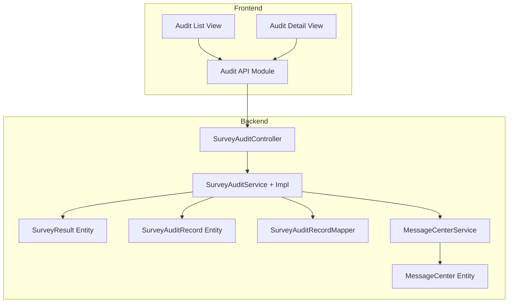
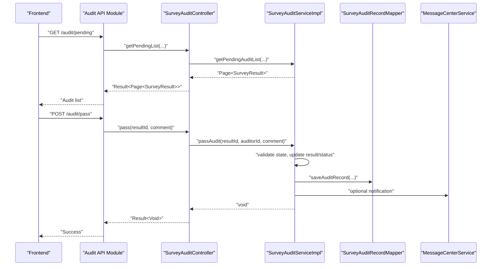
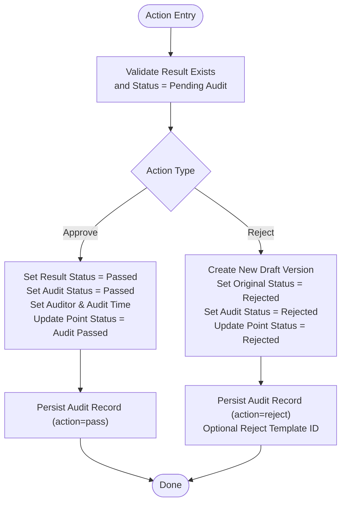
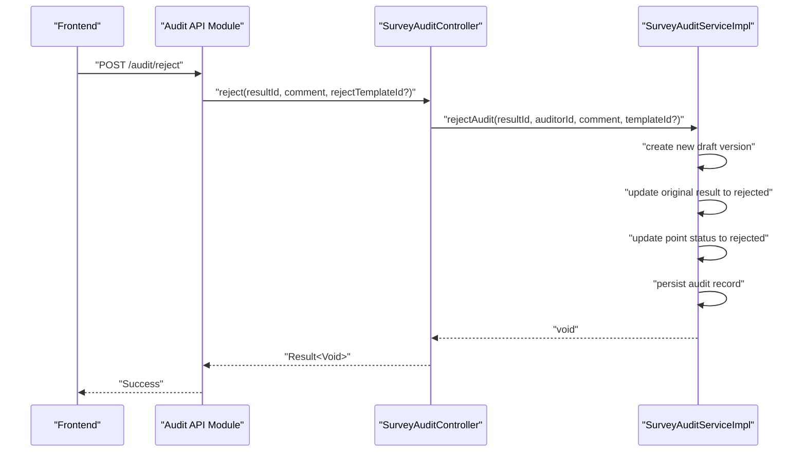
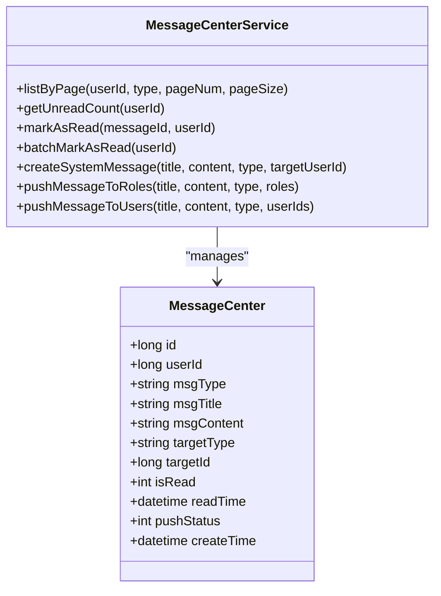
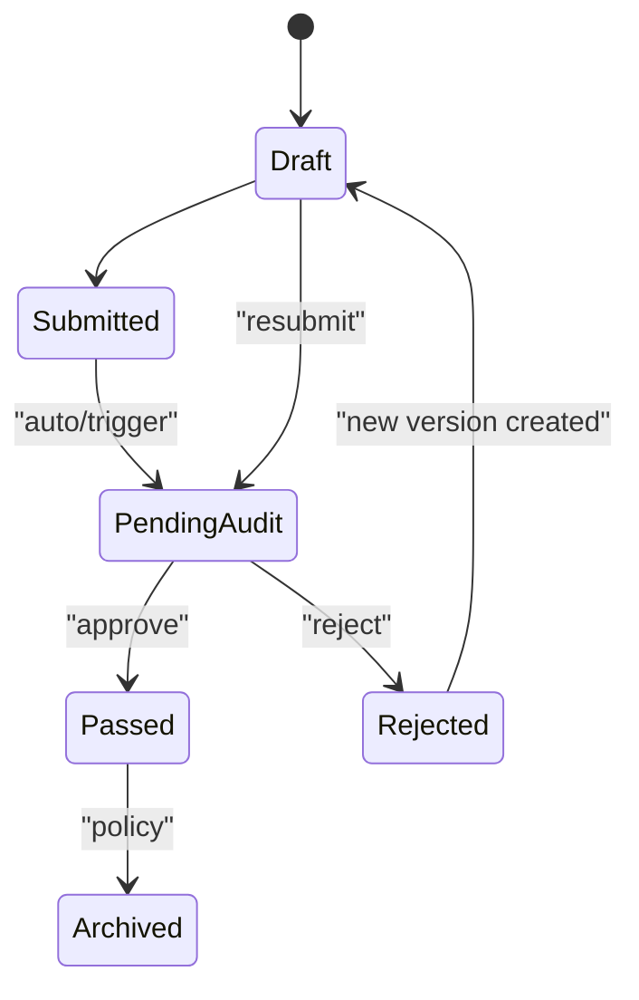
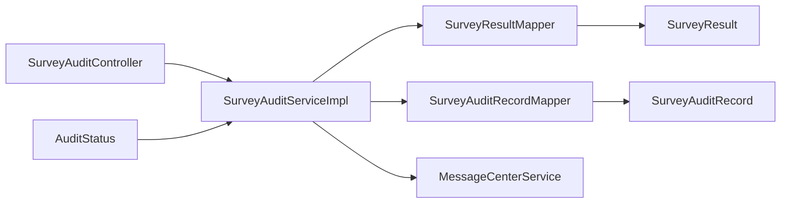

# Audit & Approval Workflows

<cite>
**Referenced Files in This Document**
- [SurveyAuditController.java](file://admin-backend/src/main/java/com/qhiot/survey/controller/SurveyAuditController.java)
- [SurveyAuditService.java](file://admin-backend/src/main/java/com/qhiot/survey/service/SurveyAuditService.java)
- [SurveyAuditServiceImpl.java](file://admin-backend/src/main/java/com/qhiot/survey/service/impl/SurveyAuditServiceImpl.java)
- [SurveyAuditRecord.java](file://admin-backend/src/main/java/com/qhiot/survey/entity/SurveyAuditRecord.java)
- [SurveyAuditRecordMapper.java](file://admin-backend/src/main/java/com/qhiot/survey/mapper/SurveyAuditRecordMapper.java)
- [SurveyResult.java](file://admin-backend/src/main/java/com/qhiot/survey/entity/SurveyResult.java)
- [AuditStatus.java](file://admin-backend/src/main/java/com/qhiot/survey/common/enums/AuditStatus.java)
- [MessageCenterService.java](file://admin-backend/src/main/java/com/qhiot/survey/service/MessageCenterService.java)
- [MessageCenter.java](file://admin-backend/src/main/java/com/qhiot/survey/entity/MessageCenter.java)
- [audit.ts](file://admin-web-soybean/src/service/api/audit.ts)
- [index.vue](file://admin-web-soybean/src/views/audit/list/index.vue)
- [detail/[id].vue](file://admin-web-soybean/src/views/audit/detail/[id].vue)
</cite>

## Table of Contents
1. [Introduction](#introduction)
2. [Project Structure](#project-structure)
3. [Core Components](#core-components)
4. [Architecture Overview](#architecture-overview)
5. [Detailed Component Analysis](#detailed-component-analysis)
6. [Dependency Analysis](#dependency-analysis)
7. [Performance Considerations](#performance-considerations)
8. [Troubleshooting Guide](#troubleshooting-guide)
9. [Conclusion](#conclusion)
10. [Appendices](#appendices)

## Introduction
This document explains the audit and approval workflow system for survey results. It covers how audit records are managed, how reviewers are assigned and act upon submissions, how statuses transition across results and survey points, and how notifications are integrated. It also documents versioning and differences between survey result versions, and outlines how audit trails support compliance reporting and historical analysis.

## Project Structure
The audit workflow spans backend services and controllers, domain entities, and frontend UI components:
- Backend: Controllers expose REST endpoints; Services implement business logic; Entities and Mappers define data models and persistence.
- Frontend: Vue views render audit lists and details; API modules encapsulate HTTP requests to the backend.

**Diagram sources**
- [SurveyAuditController.java:25-104](file://admin-backend/src/main/java/com/qhiot/survey/controller/SurveyAuditController.java#L25-L104)
- [SurveyAuditService.java:12-48](file://admin-backend/src/main/java/com/qhiot/survey/service/SurveyAuditService.java#L12-L48)
- [SurveyAuditServiceImpl.java:31-190](file://admin-backend/src/main/java/com/qhiot/survey/service/impl/SurveyAuditServiceImpl.java#L31-L190)
- [SurveyResult.java:14-93](file://admin-backend/src/main/java/com/qhiot/survey/entity/SurveyResult.java#L14-L93)
- [SurveyAuditRecord.java:13-37](file://admin-backend/src/main/java/com/qhiot/survey/entity/SurveyAuditRecord.java#L13-L37)
- [SurveyAuditRecordMapper.java:9-22](file://admin-backend/src/main/java/com/qhiot/survey/mapper/SurveyAuditRecordMapper.java#L9-L22)
- [MessageCenterService.java:12-59](file://admin-backend/src/main/java/com/qhiot/survey/service/MessageCenterService.java#L12-L59)
- [MessageCenter.java:13-49](file://admin-backend/src/main/java/com/qhiot/survey/entity/MessageCenter.java#L13-L49)
- [audit.ts:1-75](file://admin-web-soybean/src/service/api/audit.ts#L1-L75)
- [index.vue:1-318](file://admin-web-soybean/src/views/audit/list/index.vue#L1-L318)
- [detail/[id].vue](file://admin-web-soybean/src/views/audit/detail/[id].vue#L1-L307)

**Section sources**
- [SurveyAuditController.java:25-104](file://admin-backend/src/main/java/com/qhiot/survey/controller/SurveyAuditController.java#L25-L104)
- [SurveyAuditService.java:12-48](file://admin-backend/src/main/java/com/qhiot/survey/service/SurveyAuditService.java#L12-L48)
- [SurveyAuditServiceImpl.java:31-190](file://admin-backend/src/main/java/com/qhiot/survey/service/impl/SurveyAuditServiceImpl.java#L31-L190)
- [SurveyResult.java:14-93](file://admin-backend/src/main/java/com/qhiot/survey/entity/SurveyResult.java#L14-L93)
- [SurveyAuditRecord.java:13-37](file://admin-backend/src/main/java/com/qhiot/survey/entity/SurveyAuditRecord.java#L13-L37)
- [SurveyAuditRecordMapper.java:9-22](file://admin-backend/src/main/java/com/qhiot/survey/mapper/SurveyAuditRecordMapper.java#L9-L22)
- [MessageCenterService.java:12-59](file://admin-backend/src/main/java/com/qhiot/survey/service/MessageCenterService.java#L12-L59)
- [MessageCenter.java:13-49](file://admin-backend/src/main/java/com/qhiot/survey/entity/MessageCenter.java#L13-L49)
- [audit.ts:1-75](file://admin-web-soybean/src/service/api/audit.ts#L1-L75)
- [index.vue:1-318](file://admin-web-soybean/src/views/audit/list/index.vue#L1-L318)
- [detail/[id].vue](file://admin-web-soybean/src/views/audit/detail/[id].vue#L1-L307)

## Core Components
- Audit controller exposes endpoints for pending audit listings, detail retrieval, approvals, rejections, batch approvals, audit records lookup, and version differences.
- Audit service defines the contract for pending lists, details, single and batch approvals, rejection with optional templates, audit records retrieval, and version diff computation.
- Audit service implementation enforces state transitions, creates new result drafts on rejection, updates point status, persists audit records, and logs outcomes.
- Entities represent survey results and audit records; enums define audit and result status codes.
- Message center service and entity model support audit-related notifications and reminders.

**Section sources**
- [SurveyAuditController.java:25-104](file://admin-backend/src/main/java/com/qhiot/survey/controller/SurveyAuditController.java#L25-L104)
- [SurveyAuditService.java:12-48](file://admin-backend/src/main/java/com/qhiot/survey/service/SurveyAuditService.java#L12-L48)
- [SurveyAuditServiceImpl.java:31-190](file://admin-backend/src/main/java/com/qhiot/survey/service/impl/SurveyAuditServiceImpl.java#L31-L190)
- [SurveyResult.java:14-93](file://admin-backend/src/main/java/com/qhiot/survey/entity/SurveyResult.java#L14-L93)
- [SurveyAuditRecord.java:13-37](file://admin-backend/src/main/java/com/qhiot/survey/entity/SurveyAuditRecord.java#L13-L37)
- [AuditStatus.java:8-30](file://admin-backend/src/main/java/com/qhiot/survey/common/enums/AuditStatus.java#L8-L30)
- [MessageCenterService.java:12-59](file://admin-backend/src/main/java/com/qhiot/survey/service/MessageCenterService.java#L12-L59)
- [MessageCenter.java:13-49](file://admin-backend/src/main/java/com/qhiot/survey/entity/MessageCenter.java#L13-L49)

## Architecture Overview
The audit workflow follows a request-response pattern:
- Frontend invokes API endpoints via the audit API module.
- Controller delegates to the audit service.
- Service validates state, updates result and point statuses, persists audit records, and optionally pushes notifications.

**Diagram sources**
- [SurveyAuditController.java:34-77](file://admin-backend/src/main/java/com/qhiot/survey/controller/SurveyAuditController.java#L34-L77)
- [SurveyAuditServiceImpl.java:64-93](file://admin-backend/src/main/java/com/qhiot/survey/service/impl/SurveyAuditServiceImpl.java#L64-L93)
- [SurveyAuditRecordMapper.java:9-22](file://admin-backend/src/main/java/com/qhiot/survey/mapper/SurveyAuditRecordMapper.java#L9-L22)
- [MessageCenterService.java:12-59](file://admin-backend/src/main/java/com/qhiot/survey/service/MessageCenterService.java#L12-L59)
- [audit.ts:1-75](file://admin-web-soybean/src/service/api/audit.ts#L1-L75)
- [index.vue:204-232](file://admin-web-soybean/src/views/audit/list/index.vue#L204-L232)

## Detailed Component Analysis

### Audit Record Management
- Submission tracking: Each result maintains submission time, status, and audit status. On approval, result status moves to passed; on rejection, original result is marked rejected and a new draft version is created with incremented version number.
- Reviewer assignment: Pending lists are filtered by the currently authenticated auditor’s ID; the controller extracts the auditor ID from the security context.
- Status transitions: Audit service enforces that only results in pending audit status can be approved or rejected; on approval, point status is set to audit passed; on rejection, point status is set to rejected.
- Audit trail: A dedicated audit record is persisted for each action, capturing result ID, point ID, auditor ID, action type, comment, and optional reject template ID.

**Diagram sources**
- [SurveyAuditServiceImpl.java:64-141](file://admin-backend/src/main/java/com/qhiot/survey/service/impl/SurveyAuditServiceImpl.java#L64-L141)
- [SurveyAuditRecord.java:13-37](file://admin-backend/src/main/java/com/qhiot/survey/entity/SurveyAuditRecord.java#L13-L37)

**Section sources**
- [SurveyAuditController.java:34-77](file://admin-backend/src/main/java/com/qhiot/survey/controller/SurveyAuditController.java#L34-L77)
- [SurveyAuditServiceImpl.java:42-141](file://admin-backend/src/main/java/com/qhiot/survey/service/impl/SurveyAuditServiceImpl.java#L42-L141)
- [SurveyResult.java:44-82](file://admin-backend/src/main/java/com/qhiot/survey/entity/SurveyResult.java#L44-L82)
- [AuditStatus.java:8-30](file://admin-backend/src/main/java/com/qhiot/survey/common/enums/AuditStatus.java#L8-L30)
- [SurveyAuditRecord.java:13-37](file://admin-backend/src/main/java/com/qhiot/survey/entity/SurveyAuditRecord.java#L13-L37)

### Approval Workflow and Routing
- Routing rules: Pending audit lists are filtered server-side by result status equal to pending audit; filtering by keyword is supported. Reviewer assignment is implicit via the authenticated user’s ID used to query pending items.
- Decision workflows: Single approval sets result and audit statuses to passed, updates point status, and logs the action. Single rejection creates a new draft version, marks the original as rejected, updates point status, and logs the action with optional template association.
- Batch approvals: The service iterates over provided result IDs and applies the approval workflow per item, logging failures per item.

**Diagram sources**
- [SurveyAuditController.java:59-68](file://admin-backend/src/main/java/com/qhiot/survey/controller/SurveyAuditController.java#L59-L68)
- [SurveyAuditServiceImpl.java:95-141](file://admin-backend/src/main/java/com/qhiot/survey/service/impl/SurveyAuditServiceImpl.java#L95-L141)

**Section sources**
- [SurveyAuditController.java:34-77](file://admin-backend/src/main/java/com/qhiot/survey/controller/SurveyAuditController.java#L34-L77)
- [SurveyAuditServiceImpl.java:143-153](file://admin-backend/src/main/java/com/qhiot/survey/service/impl/SurveyAuditServiceImpl.java#L143-L153)

### Notification System for Audit Events
- Message center: The system supports storing messages with type, title, content, target type/id, read status, and push status. It allows pushing messages to users or roles and marking as read.
- Audit reminders: The message center schema includes a message type category for audit reminders, enabling targeted notifications for audit events.
- Integration points: While the audit service persists audit records, explicit notification invocation is not shown in the reviewed backend code; however, the presence of the message center service and entity indicates a capability to integrate notifications for audit events.

**Diagram sources**
- [MessageCenterService.java:12-59](file://admin-backend/src/main/java/com/qhiot/survey/service/MessageCenterService.java#L12-L59)
- [MessageCenter.java:13-49](file://admin-backend/src/main/java/com/qhiot/survey/entity/MessageCenter.java#L13-L49)

**Section sources**
- [MessageCenterService.java:12-59](file://admin-backend/src/main/java/com/qhiot/survey/service/MessageCenterService.java#L12-L59)
- [MessageCenter.java:13-49](file://admin-backend/src/main/java/com/qhiot/survey/entity/MessageCenter.java#L13-L49)

### Integration with Survey Results and Status Tracking
- Result lifecycle: Results move through statuses including draft, submitted, pending audit, passed, rejected, and archived. Audit status mirrors pending/through/rejected for quick filtering.
- Point status alignment: Audit decisions propagate to the associated survey point, updating its status accordingly.
- Versioning and diffs: The service returns raw form data for two versions for comparison; a dedicated endpoint retrieves audit records per point to reconstruct the audit trail.

**Diagram sources**
- [SurveyResult.java:44-82](file://admin-backend/src/main/java/com/qhiot/survey/entity/SurveyResult.java#L44-L82)
- [SurveyAuditServiceImpl.java:74-87](file://admin-backend/src/main/java/com/qhiot/survey/service/impl/SurveyAuditServiceImpl.java#L74-L87)
- [SurveyAuditServiceImpl.java:130-135](file://admin-backend/src/main/java/com/qhiot/survey/service/impl/SurveyAuditServiceImpl.java#L130-L135)

**Section sources**
- [SurveyResult.java:44-82](file://admin-backend/src/main/java/com/qhiot/survey/entity/SurveyResult.java#L44-L82)
- [SurveyAuditServiceImpl.java:74-87](file://admin-backend/src/main/java/com/qhiot/survey/service/impl/SurveyAuditServiceImpl.java#L74-L87)
- [SurveyAuditServiceImpl.java:130-135](file://admin-backend/src/main/java/com/qhiot/survey/service/impl/SurveyAuditServiceImpl.java#L130-L135)

### Examples

#### Example: Audit Initiation
- A surveyor submits a result; the backend sets result status to submitted and audit status to pending. The result appears in the reviewer’s pending list.

**Section sources**
- [SurveyResult.java:44-82](file://admin-backend/src/main/java/com/qhiot/survey/entity/SurveyResult.java#L44-L82)
- [SurveyAuditController.java:34-42](file://admin-backend/src/main/java/com/qhiot/survey/controller/SurveyAuditController.java#L34-L42)

#### Example: Reviewer Actions
- Approve: The reviewer selects approve, enters a comment, and submits. The backend transitions the result to passed, updates point status, and logs the action.

**Section sources**
- [SurveyAuditController.java:50-57](file://admin-backend/src/main/java/com/qhiot/survey/controller/SurveyAuditController.java#L50-L57)
- [SurveyAuditServiceImpl.java:64-93](file://admin-backend/src/main/java/com/qhiot/survey/service/impl/SurveyAuditServiceImpl.java#L64-L93)

- Reject: The reviewer selects reject, fills a reason, optionally chooses a template, and submits. The backend creates a new draft version, marks the original as rejected, updates point status, and logs the action.

**Section sources**
- [SurveyAuditController.java:59-68](file://admin-backend/src/main/java/com/qhiot/survey/controller/SurveyAuditController.java#L59-L68)
- [SurveyAuditServiceImpl.java:95-141](file://admin-backend/src/main/java/com/qhiot/survey/service/impl/SurveyAuditServiceImpl.java#L95-L141)

#### Example: Decision Workflows
- Batch approval: The reviewer selects multiple items and approves them in bulk; the service processes each item individually and logs any failures.

**Section sources**
- [SurveyAuditController.java:70-77](file://admin-backend/src/main/java/com/qhiot/survey/controller/SurveyAuditController.java#L70-L77)
- [SurveyAuditServiceImpl.java:143-153](file://admin-backend/src/main/java/com/qhiot/survey/service/impl/SurveyAuditServiceImpl.java#L143-L153)

#### Example: Audit Trail Maintenance
- Retrieve audit records for a point to reconstruct the timeline of actions taken.

**Section sources**
- [SurveyAuditController.java:79-83](file://admin-backend/src/main/java/com/qhiot/survey/controller/SurveyAuditController.java#L79-L83)
- [SurveyAuditServiceImpl.java:155-162](file://admin-backend/src/main/java/com/qhiot/survey/service/impl/SurveyAuditServiceImpl.java#L155-L162)

#### Example: Compliance Reporting and History Analysis
- Use the version difference endpoint to compare two versions’ form data and maintain a compliance audit trail.
- Aggregate statistics on the frontend to monitor audit throughput and trends.

**Section sources**
- [SurveyAuditController.java:85-91](file://admin-backend/src/main/java/com/qhiot/survey/controller/SurveyAuditController.java#L85-L91)
- [SurveyAuditServiceImpl.java:164-178](file://admin-backend/src/main/java/com/qhiot/survey/service/impl/SurveyAuditServiceImpl.java#L164-L178)
- [index.vue:188-232](file://admin-web-soybean/src/views/audit/list/index.vue#L188-L232)

## Dependency Analysis
- Controller depends on the audit service for all business operations.
- Service depends on result and audit record mappers for persistence and on the message center service for notifications.
- Entities define the data model for results and audit records; enums standardize status codes.

**Diagram sources**
- [SurveyAuditController.java:25-104](file://admin-backend/src/main/java/com/qhiot/survey/controller/SurveyAuditController.java#L25-L104)
- [SurveyAuditServiceImpl.java:31-190](file://admin-backend/src/main/java/com/qhiot/survey/service/impl/SurveyAuditServiceImpl.java#L31-L190)
- [SurveyResult.java:14-93](file://admin-backend/src/main/java/com/qhiot/survey/entity/SurveyResult.java#L14-L93)
- [SurveyAuditRecord.java:13-37](file://admin-backend/src/main/java/com/qhiot/survey/entity/SurveyAuditRecord.java#L13-L37)
- [AuditStatus.java:8-30](file://admin-backend/src/main/java/com/qhiot/survey/common/enums/AuditStatus.java#L8-L30)

**Section sources**
- [SurveyAuditController.java:25-104](file://admin-backend/src/main/java/com/qhiot/survey/controller/SurveyAuditController.java#L25-L104)
- [SurveyAuditServiceImpl.java:31-190](file://admin-backend/src/main/java/com/qhiot/survey/service/impl/SurveyAuditServiceImpl.java#L31-L190)

## Performance Considerations
- Pagination: The pending list endpoint supports pagination parameters to avoid heavy loads.
- Indexing: The audit record mapper queries the latest record by result ID with an order and limit; ensure appropriate indexing exists on result ID and create time.
- Batch operations: Batch approval loops through IDs; consider transaction boundaries and error isolation per item to prevent partial failures.

[No sources needed since this section provides general guidance]

## Troubleshooting Guide
- Unauthorized or missing user: The controller resolves the current auditor ID from the security context; if unavailable, an exception is thrown.
- Invalid state transitions: Approve/reject checks require the result to be in pending audit status; otherwise, exceptions are raised.
- Missing result or version: Queries for audit detail or version diff validate existence and raise errors if not found.
- Logging: Audit actions are logged after successful state updates.

**Section sources**
- [SurveyAuditController.java:93-103](file://admin-backend/src/main/java/com/qhiot/survey/controller/SurveyAuditController.java#L93-L103)
- [SurveyAuditServiceImpl.java:64-72](file://admin-backend/src/main/java/com/qhiot/survey/service/impl/SurveyAuditServiceImpl.java#L64-L72)
- [SurveyAuditServiceImpl.java:95-107](file://admin-backend/src/main/java/com/qhiot/survey/service/impl/SurveyAuditServiceImpl.java#L95-L107)
- [SurveyAuditServiceImpl.java:164-169](file://admin-backend/src/main/java/com/qhiot/survey/service/impl/SurveyAuditServiceImpl.java#L164-L169)

## Conclusion
The audit and approval workflow integrates result lifecycle management, reviewer assignment, strict state transitions, and audit trail persistence. While the backend provides robust state enforcement and audit records, notification integration remains a capability surface via the message center service. The frontend offers comprehensive UI for reviewing, approving, rejecting, and analyzing audit data, including statistics and version comparisons.

[No sources needed since this section summarizes without analyzing specific files]

## Appendices

### API Surface for Audit Operations
- GET /api/v1/audit/pending: Pending audit list for the current auditor
- GET /api/v1/audit/detail/{resultId}: Audit detail for a result
- POST /api/v1/audit/pass: Approve a result
- POST /api/v1/audit/reject: Reject a result with comment and optional template
- POST /api/v1/audit/batch-pass: Batch approve results
- GET /api/v1/audit/records?pointId={pointId}: Audit records for a point
- GET /api/v1/audit/version-diff?pointId={pointId}&currentVersionId={current}&compareVersionId={compare}: Compare two versions

**Section sources**
- [SurveyAuditController.java:34-91](file://admin-backend/src/main/java/com/qhiot/survey/controller/SurveyAuditController.java#L34-L91)
- [audit.ts:1-75](file://admin-web-soybean/src/service/api/audit.ts#L1-L75)