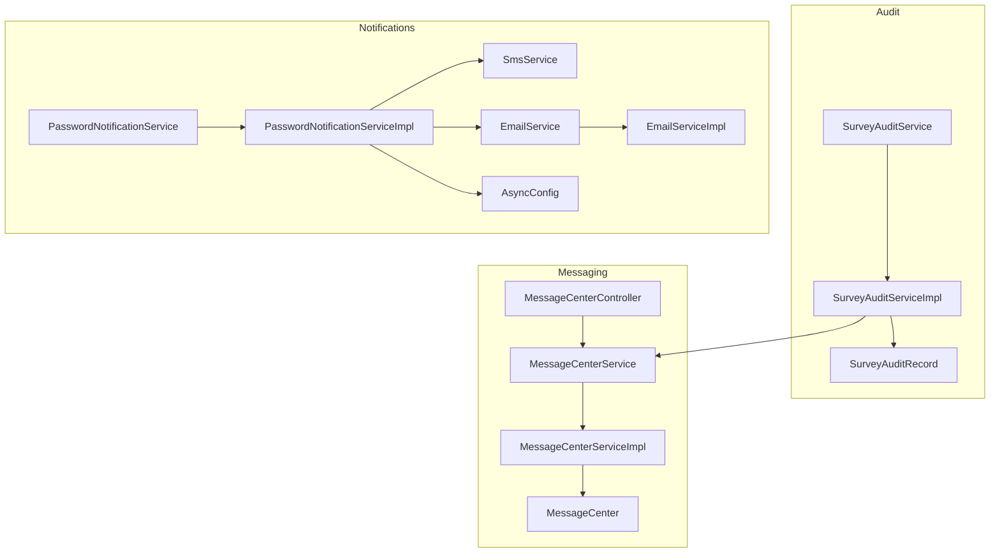
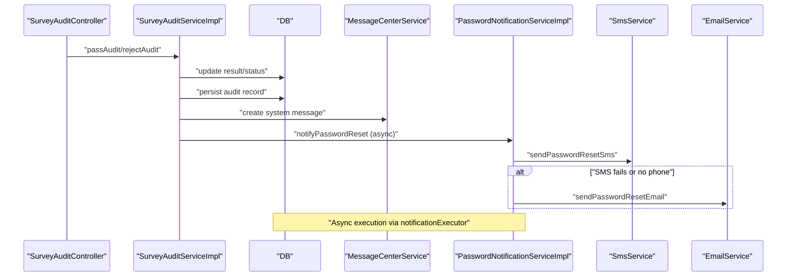
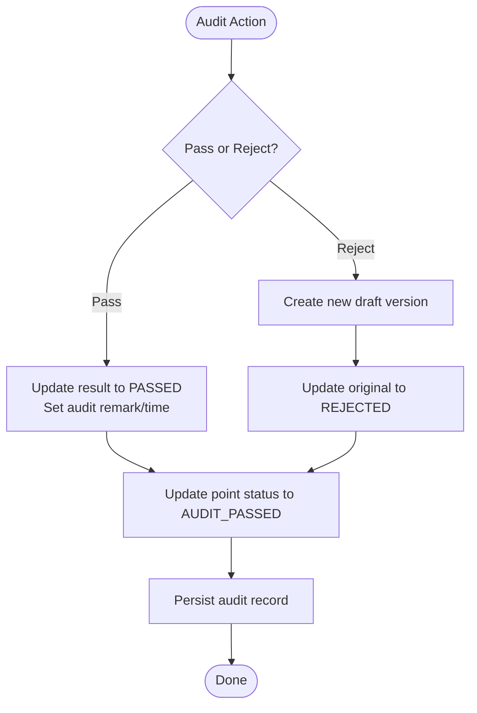
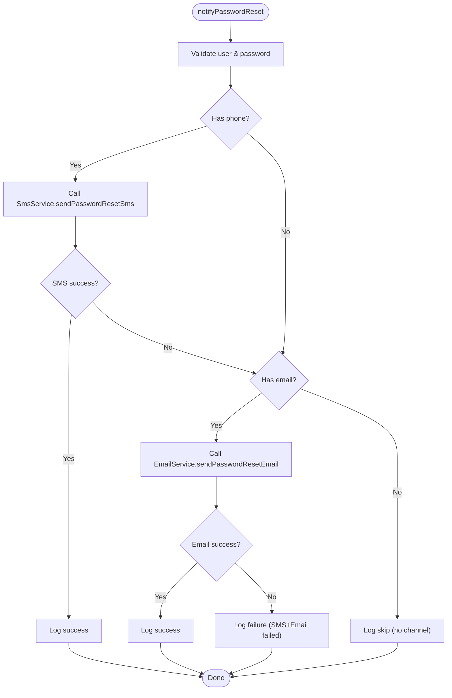
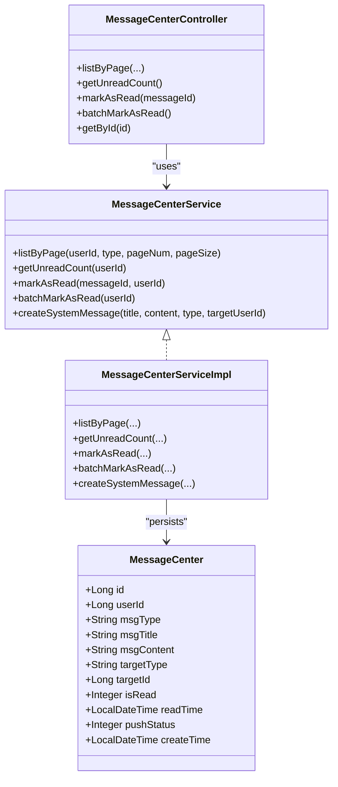
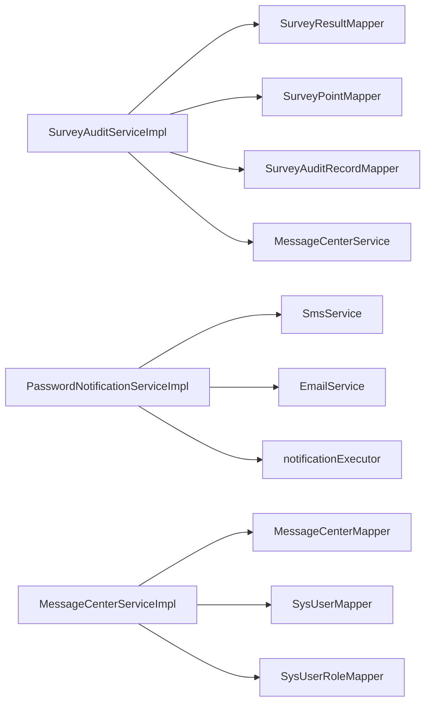

# Audit Notifications

<cite>
**Referenced Files in This Document**
- [SurveyAuditService.java](file://admin-backend/src/main/java/com/qhiot/survey/service/SurveyAuditService.java)
- [SurveyAuditServiceImpl.java](file://admin-backend/src/main/java/com/qhiot/survey/service/impl/SurveyAuditServiceImpl.java)
- [SurveyAuditController.java](file://admin-backend/src/main/java/com/qhiot/survey/controller/SurveyAuditController.java)
- [SurveyAuditRecord.java](file://admin-backend/src/main/java/com/qhiot/survey/entity/SurveyAuditRecord.java)
- [MessageCenter.java](file://admin-backend/src/main/java/com/qhiot/survey/entity/MessageCenter.java)
- [MessageCenterService.java](file://admin-backend/src/main/java/com/qhiot/survey/service/MessageCenterService.java)
- [MessageCenterServiceImpl.java](file://admin-backend/src/main/java/com/qhiot/survey/service/impl/MessageCenterServiceImpl.java)
- [MessageCenterController.java](file://admin-backend/src/main/java/com/qhiot/survey/controller/MessageCenterController.java)
- [PasswordNotificationService.java](file://admin-backend/src/main/java/com/qhiot/survey/service/PasswordNotificationService.java)
- [PasswordNotificationServiceImpl.java](file://admin-backend/src/main/java/com/qhiot/survey/service/impl/PasswordNotificationServiceImpl.java)
- [EmailService.java](file://admin-backend/src/main/java/com/qhiot/survey/service/EmailService.java)
- [EmailServiceImpl.java](file://admin-backend/src/main/java/com/qhiot/survey/service/impl/EmailServiceImpl.java)
- [SmsService.java](file://admin-backend/src/main/java/com/qhiot/survey/service/SmsService.java)
- [AsyncConfig.java](file://admin-backend/src/main/java/com/qhiot/survey/config/AsyncConfig.java)
- [01-init.sql](file://admin-backend/init-data/01-init.sql)
- [05-database-indexes.sql](file://admin-backend/init-data/05-database-indexes.sql)
- [PasswordNotificationServiceTest.java](file://admin-backend/src/test/java/com/qhiot/survey/service/PasswordNotificationServiceTest.java)
</cite>

## Table of Contents
1. [Introduction](#introduction)
2. [Project Structure](#project-structure)
3. [Core Components](#core-components)
4. [Architecture Overview](#architecture-overview)
5. [Detailed Component Analysis](#detailed-component-analysis)
6. [Dependency Analysis](#dependency-analysis)
7. [Performance Considerations](#performance-considerations)
8. [Troubleshooting Guide](#troubleshooting-guide)
9. [Conclusion](#conclusion)
10. [Appendices](#appendices)

## Introduction
This document describes the audit notification system in the Survey-App. It explains how audit events trigger notifications (new assignments, status changes, rejections, and completions), how multi-channel delivery works via email and SMS, and how in-app messaging integrates with the message center. It also documents templates, customization options, scheduling, retries, failure handling, and analytics considerations.

## Project Structure
The audit notification system spans backend services, controllers, persistence, and async configuration:
- Audit lifecycle and records: SurveyAuditService, SurveyAuditServiceImpl, SurveyAuditRecord
- Messaging and history: MessageCenter, MessageCenterService, MessageCenterController
- Notification channels: EmailService/EmailServiceImpl, SmsService, PasswordNotificationService/PasswordNotificationServiceImpl
- Asynchronous execution: AsyncConfig with dedicated notificationExecutor thread pool
- Persistence: message_center table schema and indexes

**Diagram sources**
- [SurveyAuditService.java:1-48](file://admin-backend/src/main/java/com/qhiot/survey/service/SurveyAuditService.java#L1-L48)
- [SurveyAuditServiceImpl.java:1-190](file://admin-backend/src/main/java/com/qhiot/survey/service/impl/SurveyAuditServiceImpl.java#L1-L190)
- [SurveyAuditRecord.java:1-37](file://admin-backend/src/main/java/com/qhiot/survey/entity/SurveyAuditRecord.java#L1-L37)
- [MessageCenter.java:1-49](file://admin-backend/src/main/java/com/qhiot/survey/entity/MessageCenter.java#L1-L49)
- [MessageCenterService.java:1-58](file://admin-backend/src/main/java/com/qhiot/survey/service/MessageCenterService.java#L1-L58)
- [MessageCenterServiceImpl.java:1-86](file://admin-backend/src/main/java/com/qhiot/survey/service/impl/MessageCenterServiceImpl.java#L1-L86)
- [MessageCenterController.java:28-73](file://admin-backend/src/main/java/com/qhiot/survey/controller/MessageCenterController.java#L28-L73)
- [PasswordNotificationService.java:1-21](file://admin-backend/src/main/java/com/qhiot/survey/service/PasswordNotificationService.java#L1-L21)
- [PasswordNotificationServiceImpl.java:1-88](file://admin-backend/src/main/java/com/qhiot/survey/service/impl/PasswordNotificationServiceImpl.java#L1-L88)
- [EmailService.java:1-19](file://admin-backend/src/main/java/com/qhiot/survey/service/EmailService.java#L1-L19)
- [EmailServiceImpl.java:1-115](file://admin-backend/src/main/java/com/qhiot/survey/service/impl/EmailServiceImpl.java#L1-L115)
- [SmsService.java:1-22](file://admin-backend/src/main/java/com/qhiot/survey/service/SmsService.java#L1-L22)
- [AsyncConfig.java:73-95](file://admin-backend/src/main/java/com/qhiot/survey/config/AsyncConfig.java#L73-L95)

**Section sources**
- [SurveyAuditService.java:1-48](file://admin-backend/src/main/java/com/qhiot/survey/service/SurveyAuditService.java#L1-L48)
- [MessageCenter.java:1-49](file://admin-backend/src/main/java/com/qhiot/survey/entity/MessageCenter.java#L1-L49)
- [PasswordNotificationServiceImpl.java:1-88](file://admin-backend/src/main/java/com/qhiot/survey/service/impl/PasswordNotificationServiceImpl.java#L1-L88)
- [AsyncConfig.java:73-95](file://admin-backend/src/main/java/com/qhiot/survey/config/AsyncConfig.java#L73-L95)

## Core Components
- Audit lifecycle and records:
  - SurveyAuditService defines operations for pending lists, audit detail, pass/reject actions, and audit records retrieval.
  - SurveyAuditServiceImpl implements transactional pass/reject logic, updates result and point statuses, and persists audit records.
- Message center:
  - MessageCenter stores notification history with fields for type, title, content, target association, read status, and push status.
  - MessageCenterService provides pagination, unread counts, read marking, and system message creation.
- Notification channels:
  - SmsService and EmailService define channel APIs.
  - PasswordNotificationServiceImpl orchestrates dual-channel delivery with fallback and logging.
  - EmailServiceImpl implements HTML email generation and mock mode when SMTP is unavailable.
- Async execution:
  - AsyncConfig defines a dedicated notificationExecutor thread pool to isolate notification tasks.

**Section sources**
- [SurveyAuditService.java:12-48](file://admin-backend/src/main/java/com/qhiot/survey/service/SurveyAuditService.java#L12-L48)
- [SurveyAuditServiceImpl.java:63-141](file://admin-backend/src/main/java/com/qhiot/survey/service/impl/SurveyAuditServiceImpl.java#L63-L141)
- [SurveyAuditRecord.java:18-37](file://admin-backend/src/main/java/com/qhiot/survey/entity/SurveyAuditRecord.java#L18-L37)
- [MessageCenter.java:18-49](file://admin-backend/src/main/java/com/qhiot/survey/entity/MessageCenter.java#L18-L49)
- [MessageCenterService.java:12-58](file://admin-backend/src/main/java/com/qhiot/survey/service/MessageCenterService.java#L12-L58)
- [MessageCenterServiceImpl.java:34-86](file://admin-backend/src/main/java/com/qhiot/survey/service/impl/MessageCenterServiceImpl.java#L34-L86)
- [PasswordNotificationService.java:11-20](file://admin-backend/src/main/java/com/qhiot/survey/service/PasswordNotificationService.java#L11-L20)
- [PasswordNotificationServiceImpl.java:33-86](file://admin-backend/src/main/java/com/qhiot/survey/service/impl/PasswordNotificationServiceImpl.java#L33-L86)
- [EmailService.java:7-18](file://admin-backend/src/main/java/com/qhiot/survey/service/EmailService.java#L7-L18)
- [EmailServiceImpl.java:37-69](file://admin-backend/src/main/java/com/qhiot/survey/service/impl/EmailServiceImpl.java#L37-L69)
- [AsyncConfig.java:77-94](file://admin-backend/src/main/java/com/qhiot/survey/config/AsyncConfig.java#L77-L94)

## Architecture Overview
The audit notification system integrates audit actions with asynchronous multi-channel delivery and persistent message history.

**Diagram sources**
- [SurveyAuditController.java:28-48](file://admin-backend/src/main/java/com/qhiot/survey/controller/SurveyAuditController.java#L28-L48)
- [SurveyAuditServiceImpl.java:63-141](file://admin-backend/src/main/java/com/qhiot/survey/service/impl/SurveyAuditServiceImpl.java#L63-L141)
- [MessageCenterService.java:76-86](file://admin-backend/src/main/java/com/qhiot/survey/service/MessageCenterService.java#L76-L86)
- [PasswordNotificationServiceImpl.java:33-86](file://admin-backend/src/main/java/com/qhiot/survey/service/impl/PasswordNotificationServiceImpl.java#L33-L86)
- [SmsService.java:10-21](file://admin-backend/src/main/java/com/qhiot/survey/service/SmsService.java#L10-L21)
- [EmailService.java:7-18](file://admin-backend/src/main/java/com/qhiot/survey/service/EmailService.java#L7-L18)

## Detailed Component Analysis

### Audit Lifecycle and Triggers
- Pending audit list and detail retrieval are exposed via SurveyAuditController.
- Audit actions (pass/reject) update result and point statuses and persist audit records.
- On successful pass, point status transitions to audit passed; on rejection, a new draft is created and point status reflects rejection.

**Diagram sources**
- [SurveyAuditServiceImpl.java:63-141](file://admin-backend/src/main/java/com/qhiot/survey/service/impl/SurveyAuditServiceImpl.java#L63-L141)
- [SurveyAuditRecord.java:18-37](file://admin-backend/src/main/java/com/qhiot/survey/entity/SurveyAuditRecord.java#L18-L37)

**Section sources**
- [SurveyAuditController.java:34-48](file://admin-backend/src/main/java/com/qhiot/survey/controller/SurveyAuditController.java#L34-L48)
- [SurveyAuditServiceImpl.java:43-141](file://admin-backend/src/main/java/com/qhiot/survey/service/impl/SurveyAuditServiceImpl.java#L43-L141)

### Multi-Channel Notification Delivery
- Primary channel: SMS via SmsService.
- Fallback channel: Email via EmailService.
- Orchestration: PasswordNotificationServiceImpl attempts SMS first; if unsuccessful or no phone present, falls back to email. Exceptions are caught and logged; failures do not propagate to the caller.
- Async execution: All notifications run asynchronously on notificationExecutor.

**Diagram sources**
- [PasswordNotificationServiceImpl.java:33-86](file://admin-backend/src/main/java/com/qhiot/survey/service/impl/PasswordNotificationServiceImpl.java#L33-L86)
- [EmailServiceImpl.java:37-69](file://admin-backend/src/main/java/com/qhiot/survey/service/impl/EmailServiceImpl.java#L37-L69)
- [SmsService.java:10-21](file://admin-backend/src/main/java/com/qhiot/survey/service/SmsService.java#L10-L21)
- [EmailService.java:7-18](file://admin-backend/src/main/java/com/qhiot/survey/service/EmailService.java#L7-L18)

**Section sources**
- [PasswordNotificationService.java:11-20](file://admin-backend/src/main/java/com/qhiot/survey/service/PasswordNotificationService.java#L11-L20)
- [PasswordNotificationServiceImpl.java:33-86](file://admin-backend/src/main/java/com/qhiot/survey/service/impl/PasswordNotificationServiceImpl.java#L33-L86)
- [EmailServiceImpl.java:37-69](file://admin-backend/src/main/java/com/qhiot/survey/service/impl/EmailServiceImpl.java#L37-L69)
- [AsyncConfig.java:77-94](file://admin-backend/src/main/java/com/qhiot/survey/config/AsyncConfig.java#L77-L94)

### Message Center Integration
- MessageCenter persists notification history with fields for type, title, content, target association, read status, and push status.
- MessageCenterService supports:
  - Paginated listing filtered by type
  - Unread count calculation
  - Mark-as-read and batch mark-as-read
  - Creation of system messages
- MessageCenterController exposes endpoints for listing, unread count, marking read, batch marking, and fetching details.

**Diagram sources**
- [MessageCenter.java:18-49](file://admin-backend/src/main/java/com/qhiot/survey/entity/MessageCenter.java#L18-L49)
- [MessageCenterService.java:12-58](file://admin-backend/src/main/java/com/qhiot/survey/service/MessageCenterService.java#L12-L58)
- [MessageCenterServiceImpl.java:29-86](file://admin-backend/src/main/java/com/qhiot/survey/service/impl/MessageCenterServiceImpl.java#L29-L86)
- [MessageCenterController.java:28-73](file://admin-backend/src/main/java/com/qhiot/survey/controller/MessageCenterController.java#L28-L73)

**Section sources**
- [MessageCenter.java:18-49](file://admin-backend/src/main/java/com/qhiot/survey/entity/MessageCenter.java#L18-L49)
- [MessageCenterService.java:12-58](file://admin-backend/src/main/java/com/qhiot/survey/service/MessageCenterService.java#L12-L58)
- [MessageCenterServiceImpl.java:34-86](file://admin-backend/src/main/java/com/qhiot/survey/service/impl/MessageCenterServiceImpl.java#L34-L86)
- [MessageCenterController.java:34-73](file://admin-backend/src/main/java/com/qhiot/survey/controller/MessageCenterController.java#L34-L73)

### Templates and Customization
- Email template:
  - HTML email generated with subject and body containing username and new password.
  - Safe HTML escaping and masked recipient address for privacy.
- Customization options:
  - From address and sender name configurable via application properties.
  - Template content is constructed programmatically; extension points exist to externalize templates.

**Section sources**
- [EmailServiceImpl.java:74-87](file://admin-backend/src/main/java/com/qhiot/survey/service/impl/EmailServiceImpl.java#L74-L87)
- [EmailServiceImpl.java:27-31](file://admin-backend/src/main/java/com/qhiot/survey/service/impl/EmailServiceImpl.java#L27-L31)

### Notification Scheduling, Retry, and Failure Handling
- Scheduling:
  - Notifications are executed asynchronously using notificationExecutor thread pool.
- Retry and fallback:
  - SMS attempted first; on failure or missing phone, email is used.
  - Exceptions are caught and logged; no propagation to the main business flow.
- Failure handling:
  - When both channels fail, errors are logged; callers are unaffected.

**Section sources**
- [AsyncConfig.java:77-94](file://admin-backend/src/main/java/com/qhiot/survey/config/AsyncConfig.java#L77-L94)
- [PasswordNotificationServiceImpl.java:51-86](file://admin-backend/src/main/java/com/qhiot/survey/service/impl/PasswordNotificationServiceImpl.java#L51-L86)
- [PasswordNotificationServiceTest.java:92-117](file://admin-backend/src/test/java/com/qhiot/survey/service/PasswordNotificationServiceTest.java#L92-L117)

### Delivery Tracking and History
- MessageCenter tracks push status (not pushed, pushed, push failed) and read status (unreadOnly, read time).
- Controllers enable users to list messages, fetch unread counts, mark as read, and batch mark as read.

**Section sources**
- [MessageCenter.java:36-46](file://admin-backend/src/main/java/com/qhiot/survey/entity/MessageCenter.java#L36-L46)
- [MessageCenterController.java:34-73](file://admin-backend/src/main/java/com/qhiot/survey/controller/MessageCenterController.java#L34-L73)

### User Contact Information and Preferences
- Notification selection depends on presence of phone and/or email on the user record.
- No explicit per-user notification preference flags are visible in the referenced code; channel selection is based on available contact info.

**Section sources**
- [PasswordNotificationServiceImpl.java:41-49](file://admin-backend/src/main/java/com/qhiot/survey/service/impl/PasswordNotificationServiceImpl.java#L41-L49)

### Examples
- Notification configuration:
  - Configure SMTP for real email delivery or rely on mock mode when not present.
  - Adjust sender identity via application properties for from address and sender name.
- Template customization:
  - Modify the HTML template building method to adapt branding or content.
- Delivery tracking:
  - Use message center endpoints to inspect push status and read state.

**Section sources**
- [EmailServiceImpl.java:44-69](file://admin-backend/src/main/java/com/qhiot/survey/service/impl/EmailServiceImpl.java#L44-L69)
- [MessageCenterController.java:34-73](file://admin-backend/src/main/java/com/qhiot/survey/controller/MessageCenterController.java#L34-L73)

## Dependency Analysis
- Audit service depends on result, point, and audit record mappers; persists audit records after state changes.
- Message center service depends on MessageCenterMapper and user role mappers for administrative operations.
- Notification service depends on SmsService and EmailService; runs on notificationExecutor.
- AsyncConfig isolates notificationExecutor from other executors to prevent contention.

**Diagram sources**
- [SurveyAuditServiceImpl.java:34-40](file://admin-backend/src/main/java/com/qhiot/survey/service/impl/SurveyAuditServiceImpl.java#L34-L40)
- [MessageCenterServiceImpl.java:31-33](file://admin-backend/src/main/java/com/qhiot/survey/service/impl/MessageCenterServiceImpl.java#L31-L33)
- [PasswordNotificationServiceImpl.java:30-31](file://admin-backend/src/main/java/com/qhiot/survey/service/impl/PasswordNotificationServiceImpl.java#L30-L31)
- [AsyncConfig.java:77-94](file://admin-backend/src/main/java/com/qhiot/survey/config/AsyncConfig.java#L77-L94)

**Section sources**
- [SurveyAuditServiceImpl.java:34-40](file://admin-backend/src/main/java/com/qhiot/survey/service/impl/SurveyAuditServiceImpl.java#L34-L40)
- [MessageCenterServiceImpl.java:31-33](file://admin-backend/src/main/java/com/qhiot/survey/service/impl/MessageCenterServiceImpl.java#L31-L33)
- [PasswordNotificationServiceImpl.java:30-31](file://admin-backend/src/main/java/com/qhiot/survey/service/impl/PasswordNotificationServiceImpl.java#L30-L31)
- [AsyncConfig.java:77-94](file://admin-backend/src/main/java/com/qhiot/survey/config/AsyncConfig.java#L77-L94)

## Performance Considerations
- Asynchronous execution prevents blocking of audit operations.
- Dedicated thread pool sizing balances throughput and resource usage.
- Indexes on audit and result tables support efficient listing and filtering.

**Section sources**
- [AsyncConfig.java:77-94](file://admin-backend/src/main/java/com/qhiot/survey/config/AsyncConfig.java#L77-L94)
- [05-database-indexes.sql:82-99](file://admin-backend/init-data/05-database-indexes.sql#L82-L99)

## Troubleshooting Guide
- No phone and no email:
  - Notification skipped; verify user contact info.
- SMS gateway failure or exception:
  - Falls back to email; verify email delivery and SMTP configuration.
- Both channels fail:
  - Errors logged; investigate underlying providers or credentials.
- Message center anomalies:
  - Check unread counts and read timestamps via message center endpoints.

**Section sources**
- [PasswordNotificationServiceImpl.java:45-86](file://admin-backend/src/main/java/com/qhiot/survey/service/impl/PasswordNotificationServiceImpl.java#L45-L86)
- [EmailServiceImpl.java:64-68](file://admin-backend/src/main/java/com/qhiot/survey/service/impl/EmailServiceImpl.java#L64-L68)
- [MessageCenterController.java:44-67](file://admin-backend/src/main/java/com/qhiot/survey/controller/MessageCenterController.java#L44-L67)

## Conclusion
The audit notification system combines robust audit lifecycle management with asynchronous, multi-channel delivery and persistent message history. SMS is prioritized with email as a reliable fallback, while message center provides comprehensive tracking and user controls. The design emphasizes resilience, isolation of concerns, and extensibility for future enhancements.

## Appendices

### Database Schema and Indexes
- message_center table supports notification history with indexing for user, type, and read status.
- Audit and result tables include indexes to optimize listing and filtering.

**Section sources**
- [01-init.sql:356-371](file://admin-backend/init-data/01-init.sql#L356-L371)
- [05-database-indexes.sql:82-99](file://admin-backend/init-data/05-database-indexes.sql#L82-L99)