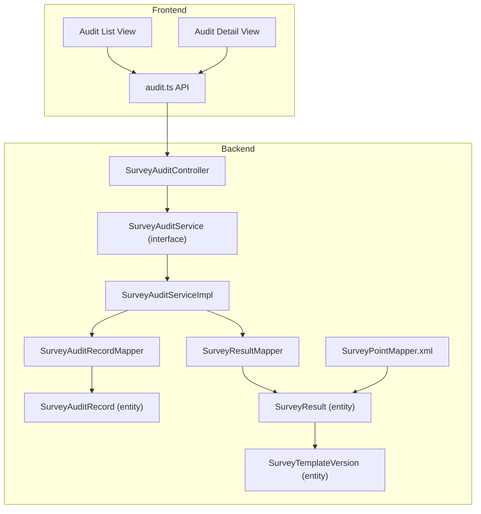
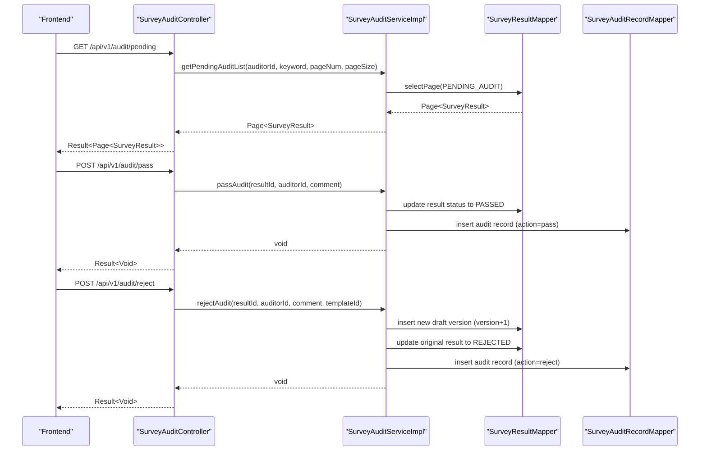
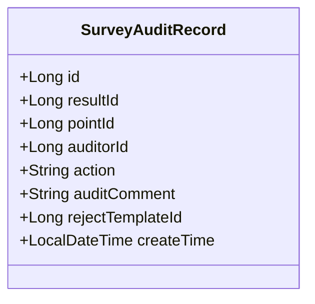
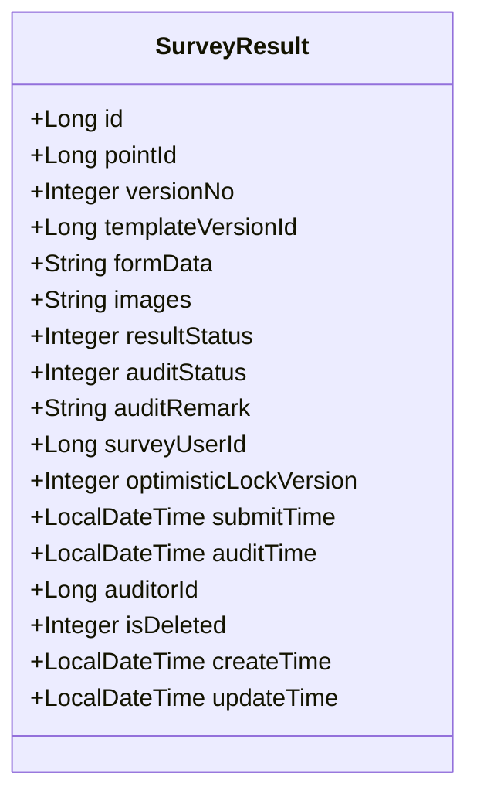
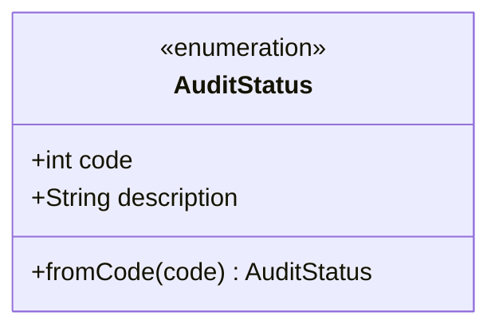
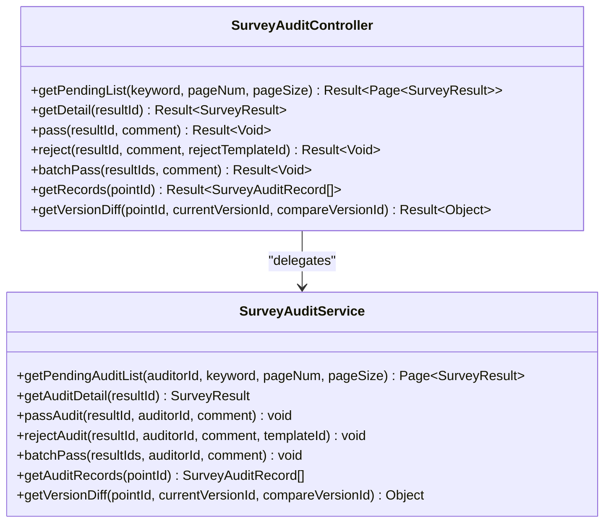
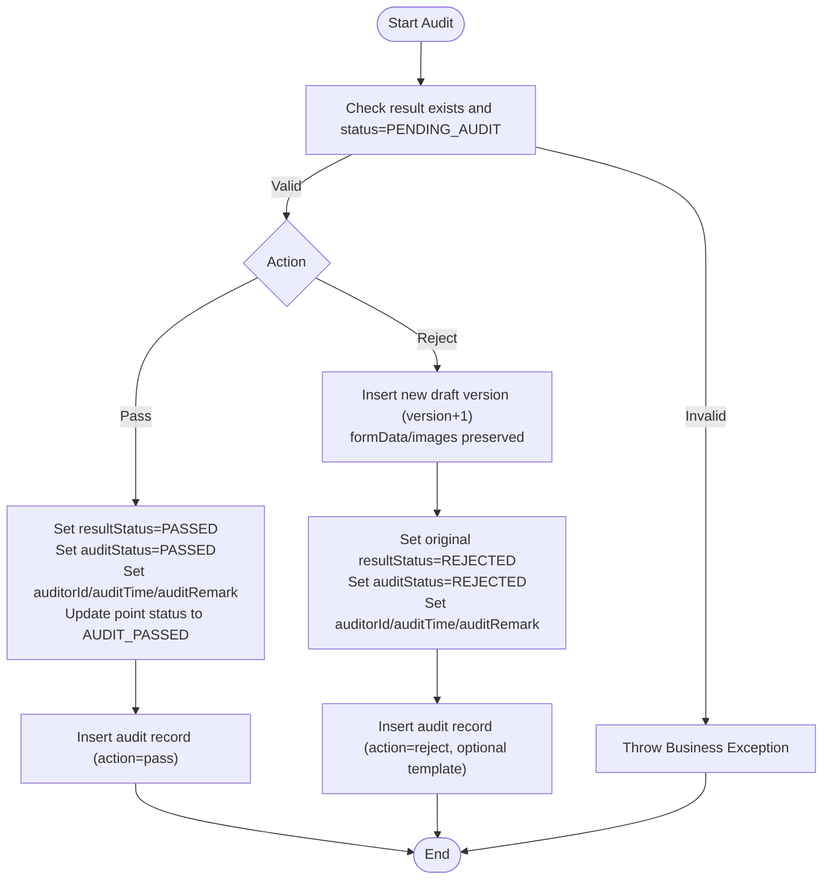
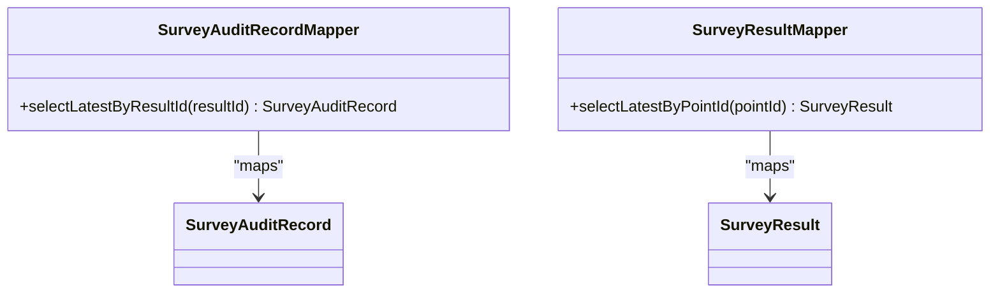
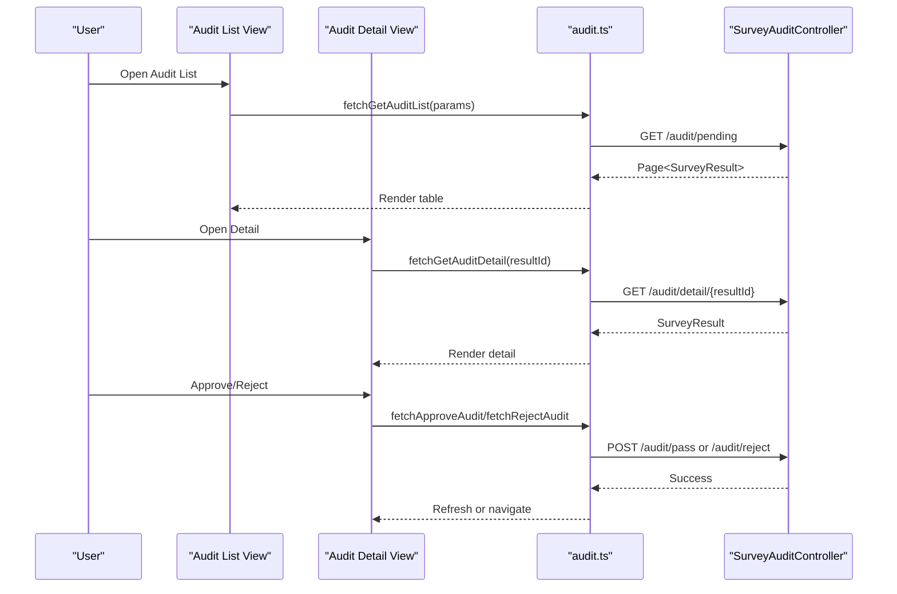
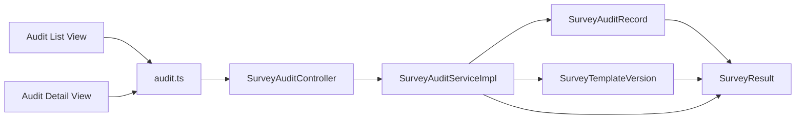

# Audit Record Management

<cite>
**Referenced Files in This Document**
- [SurveyAuditRecord.java](file://admin-backend/src/main/java/com/qhiot/survey/entity/SurveyAuditRecord.java)
- [SurveyResult.java](file://admin-backend/src/main/java/com/qhiot/survey/entity/SurveyResult.java)
- [SurveyTemplateVersion.java](file://admin-backend/src/main/java/com/qhiot/survey/entity/SurveyTemplateVersion.java)
- [SurveyAuditRecordMapper.java](file://admin-backend/src/main/java/com/qhiot/survey/mapper/SurveyAuditRecordMapper.java)
- [SurveyResultMapper.java](file://admin-backend/src/main/java/com/qhiot/survey/mapper/SurveyResultMapper.java)
- [SurveyAuditService.java](file://admin-backend/src/main/java/com/qhiot/survey/service/SurveyAuditService.java)
- [SurveyAuditServiceImpl.java](file://admin-backend/src/main/java/com/qhiot/survey/service/impl/SurveyAuditServiceImpl.java)
- [SurveyAuditController.java](file://admin-backend/src/main/java/com/qhiot/survey/controller/SurveyAuditController.java)
- [AuditStatus.java](file://admin-backend/src/main/java/com/qhiot/survey/common/enums/AuditStatus.java)
- [SurveyPointMapper.xml](file://admin-backend/src/main/resources/mapper/SurveyPointMapper.xml)
- [audit.ts](file://admin-web-soybean/src/service/api/audit.ts)
- [audit list view](file://admin-web-soybean/src/views/audit/list/index.vue)
- [audit detail view](file://admin-web-soybean/src/views/audit/detail/[id].vue)
</cite>

## Table of Contents
1. [Introduction](#introduction)
2. [Project Structure](#project-structure)
3. [Core Components](#core-components)
4. [Architecture Overview](#architecture-overview)
5. [Detailed Component Analysis](#detailed-component-analysis)
6. [Dependency Analysis](#dependency-analysis)
7. [Performance Considerations](#performance-considerations)
8. [Troubleshooting Guide](#troubleshooting-guide)
9. [Conclusion](#conclusion)
10. [Appendices](#appendices)

## Introduction
This document describes the audit record management system for survey results. It explains the SurveyAuditRecord entity and its lifecycle, how audit decisions are persisted and tracked, and how audit trails relate to survey results and version control. It also documents the backend APIs and frontend views that support audit workflows, and outlines query patterns for retrieving audit histories and generating reports.

## Project Structure
The audit system spans backend Java services and controllers, MyBatis-Plus mappers and entities, and frontend Vue views and API bindings.

**Diagram sources**
- [SurveyAuditController.java:23-104](file://admin-backend/src/main/java/com/qhiot/survey/controller/SurveyAuditController.java#L23-L104)
- [SurveyAuditService.java:12-48](file://admin-backend/src/main/java/com/qhiot/survey/service/SurveyAuditService.java#L12-L48)
- [SurveyAuditServiceImpl.java:31-190](file://admin-backend/src/main/java/com/qhiot/survey/service/impl/SurveyAuditServiceImpl.java#L31-L190)
- [SurveyAuditRecordMapper.java:10-21](file://admin-backend/src/main/java/com/qhiot/survey/mapper/SurveyAuditRecordMapper.java#L10-L21)
- [SurveyResultMapper.java:10-21](file://admin-backend/src/main/java/com/qhiot/survey/mapper/SurveyResultMapper.java#L10-L21)
- [SurveyAuditRecord.java:15-37](file://admin-backend/src/main/java/com/qhiot/survey/entity/SurveyAuditRecord.java#L15-L37)
- [SurveyResult.java:16-93](file://admin-backend/src/main/java/com/qhiot/survey/entity/SurveyResult.java#L16-L93)
- [SurveyTemplateVersion.java:15-38](file://admin-backend/src/main/java/com/qhiot/survey/entity/SurveyTemplateVersion.java#L15-L38)
- [SurveyPointMapper.xml:3-51](file://admin-backend/src/main/resources/mapper/SurveyPointMapper.xml#L3-L51)
- [audit.ts:1-75](file://admin-web-soybean/src/service/api/audit.ts#L1-L75)
- [audit list view:1-318](file://admin-web-soybean/src/views/audit/list/index.vue#L1-L318)
- [audit detail view:1-307](file://admin-web-soybean/src/views/audit/detail/[id].vue#L1-L307)

**Section sources**
- [SurveyAuditController.java:23-104](file://admin-backend/src/main/java/com/qhiot/survey/controller/SurveyAuditController.java#L23-L104)
- [SurveyAuditServiceImpl.java:31-190](file://admin-backend/src/main/java/com/qhiot/survey/service/impl/SurveyAuditServiceImpl.java#L31-L190)
- [SurveyAuditRecord.java:15-37](file://admin-backend/src/main/java/com/qhiot/survey/entity/SurveyAuditRecord.java#L15-L37)
- [SurveyResult.java:16-93](file://admin-backend/src/main/java/com/qhiot/survey/entity/SurveyResult.java#L16-L93)
- [SurveyAuditRecordMapper.java:10-21](file://admin-backend/src/main/java/com/qhiot/survey/mapper/SurveyAuditRecordMapper.java#L10-L21)
- [SurveyResultMapper.java:10-21](file://admin-backend/src/main/java/com/qhiot/survey/mapper/SurveyResultMapper.java#L10-L21)
- [SurveyTemplateVersion.java:15-38](file://admin-backend/src/main/java/com/qhiot/survey/entity/SurveyTemplateVersion.java#L15-L38)
- [SurveyPointMapper.xml:3-51](file://admin-backend/src/main/resources/mapper/SurveyPointMapper.xml#L3-L51)
- [audit.ts:1-75](file://admin-web-soybean/src/service/api/audit.ts#L1-L75)
- [audit list view:1-318](file://admin-web-soybean/src/views/audit/list/index.vue#L1-L318)
- [audit detail view:1-307](file://admin-web-soybean/src/views/audit/detail/[id].vue#L1-L307)

## Core Components
- SurveyAuditRecord: Captures a single audit decision with reviewer identity, action, comment, and timestamps.
- SurveyResult: Stores survey submissions with status, audit metadata, and versioning.
- SurveyAuditService and SurveyAuditServiceImpl: Orchestrates audit workflows, state transitions, and audit trail creation.
- SurveyAuditController: Exposes REST endpoints for audit operations and queries.
- MyBatis-Plus mappers: Persist and query audit records and latest results.
- Frontend audit views and API bindings: Provide audit list/detail UI and call backend endpoints.

**Section sources**
- [SurveyAuditRecord.java:15-37](file://admin-backend/src/main/java/com/qhiot/survey/entity/SurveyAuditRecord.java#L15-L37)
- [SurveyResult.java:16-93](file://admin-backend/src/main/java/com/qhiot/survey/entity/SurveyResult.java#L16-L93)
- [SurveyAuditService.java:12-48](file://admin-backend/src/main/java/com/qhiot/survey/service/SurveyAuditService.java#L12-L48)
- [SurveyAuditServiceImpl.java:31-190](file://admin-backend/src/main/java/com/qhiot/survey/service/impl/SurveyAuditServiceImpl.java#L31-L190)
- [SurveyAuditController.java:23-104](file://admin-backend/src/main/java/com/qhiot/survey/controller/SurveyAuditController.java#L23-L104)
- [SurveyAuditRecordMapper.java:10-21](file://admin-backend/src/main/java/com/qhiot/survey/mapper/SurveyAuditRecordMapper.java#L10-L21)
- [SurveyResultMapper.java:10-21](file://admin-backend/src/main/java/com/qhiot/survey/mapper/SurveyResultMapper.java#L10-L21)
- [audit.ts:1-75](file://admin-web-soybean/src/service/api/audit.ts#L1-L75)

## Architecture Overview
The audit system follows a layered architecture:
- Presentation: Frontend Vue views render audit lists and details and call audit APIs.
- API: Controller exposes endpoints for pending audits, approvals, rejections, and audit records.
- Service: Implements business logic for state transitions, versioning on rejection, and audit logging.
- Persistence: MyBatis-Plus mappers map entities to database tables and provide optimized queries.

**Diagram sources**
- [SurveyAuditController.java:34-83](file://admin-backend/src/main/java/com/qhiot/survey/controller/SurveyAuditController.java#L34-L83)
- [SurveyAuditServiceImpl.java:42-141](file://admin-backend/src/main/java/com/qhiot/survey/service/impl/SurveyAuditServiceImpl.java#L42-L141)
- [SurveyResultMapper.java:10-21](file://admin-backend/src/main/java/com/qhiot/survey/mapper/SurveyResultMapper.java#L10-L21)
- [SurveyAuditRecordMapper.java:10-21](file://admin-backend/src/main/java/com/qhiot/survey/mapper/SurveyAuditRecordMapper.java#L10-L21)

## Detailed Component Analysis

### SurveyAuditRecord Entity
- Purpose: Persist a single audit decision for a survey result.
- Key attributes:
  - resultId: Links to the affected survey result.
  - pointId: Links to the survey point for grouping audit history.
  - auditorId: Identity of the reviewer.
  - action: Decision type (e.g., pass, reject).
  - auditComment: Reviewer’s comment.
  - rejectTemplateId: Optional reference to a rejection template.
  - createTime: Timestamp of audit decision.

**Diagram sources**
- [SurveyAuditRecord.java:15-37](file://admin-backend/src/main/java/com/qhiot/survey/entity/SurveyAuditRecord.java#L15-L37)

**Section sources**
- [SurveyAuditRecord.java:15-37](file://admin-backend/src/main/java/com/qhiot/survey/entity/SurveyAuditRecord.java#L15-L37)

### SurveyResult Entity and Version Control
- Purpose: Store survey submissions with status, audit metadata, and versioning.
- Key attributes:
  - versionNo: Incremental version per point.
  - templateVersionId: Links to the template used.
  - formData/images: Submission payload and attachments.
  - resultStatus: Lifecycle status (draft, submitted, pending audit, passed, rejected, archived).
  - auditStatus: Denormalized audit state for filtering.
  - auditRemark/auditTime/auditorId: Audit trail fields.
  - submitTime: Submission timestamp.
  - isDeleted: Soft delete flag.
  - Optimistic lock version for concurrency control.

**Diagram sources**
- [SurveyResult.java:16-93](file://admin-backend/src/main/java/com/qhiot/survey/entity/SurveyResult.java#L16-L93)

**Section sources**
- [SurveyResult.java:16-93](file://admin-backend/src/main/java/com/qhiot/survey/entity/SurveyResult.java#L16-L93)

### Audit Status Enum
- Purpose: Standardize audit states for filtering and reporting.
- Values: PENDING, PASSED, REJECTED.

**Diagram sources**
- [AuditStatus.java:9-30](file://admin-backend/src/main/java/com/qhiot/survey/common/enums/AuditStatus.java#L9-L30)

**Section sources**
- [AuditStatus.java:9-30](file://admin-backend/src/main/java/com/qhiot/survey/common/enums/AuditStatus.java#L9-L30)

### Audit Service and Controller
- SurveyAuditService defines:
  - Pending audit list retrieval with pagination and keyword filtering.
  - Audit detail retrieval.
  - Single and batch approval/rejection.
  - Retrieval of audit records for a point.
  - Version difference comparison.
- SurveyAuditController exposes:
  - GET /api/v1/audit/pending
  - GET /api/v1/audit/detail/{resultId}
  - POST /api/v1/audit/pass
  - POST /api/v1/audit/reject
  - POST /api/v1/audit/batch-pass
  - GET /api/v1/audit/records
  - GET /api/v1/audit/version-diff

**Diagram sources**
- [SurveyAuditService.java:12-48](file://admin-backend/src/main/java/com/qhiot/survey/service/SurveyAuditService.java#L12-L48)
- [SurveyAuditController.java:23-104](file://admin-backend/src/main/java/com/qhiot/survey/controller/SurveyAuditController.java#L23-L104)

**Section sources**
- [SurveyAuditService.java:12-48](file://admin-backend/src/main/java/com/qhiot/survey/service/SurveyAuditService.java#L12-L48)
- [SurveyAuditController.java:23-104](file://admin-backend/src/main/java/com/qhiot/survey/controller/SurveyAuditController.java#L23-L104)

### Audit Workflow Implementation
- Pass:
  - Validates result exists and is pending audit.
  - Updates result status to passed, sets audit metadata, and updates point status.
  - Creates an audit record with action=pass.
- Reject:
  - Validates result exists and is pending audit; requires a comment.
  - Inserts a new draft version with incremented versionNo.
  - Marks original result as rejected and updates point status.
  - Creates an audit record with action=reject and optional template reference.
- Batch pass:
  - Iterates over result IDs and applies passAudit per item.

**Diagram sources**
- [SurveyAuditServiceImpl.java:63-141](file://admin-backend/src/main/java/com/qhiot/survey/service/impl/SurveyAuditServiceImpl.java#L63-L141)

**Section sources**
- [SurveyAuditServiceImpl.java:63-141](file://admin-backend/src/main/java/com/qhiot/survey/service/impl/SurveyAuditServiceImpl.java#L63-L141)

### Persistence Layer and Query Optimization
- SurveyAuditRecordMapper:
  - Extends MyBatis-Plus BaseMapper.
  - Provides selectLatestByResultId to fetch the most recent audit record for a result.
- SurveyResultMapper:
  - Extends MyBatis-Plus BaseMapper.
  - Provides selectLatestByPointId to fetch the newest approved result for a point.
- MyBatis-Plus configuration enables automatic SQL generation for common CRUD operations and supports pagination.

**Diagram sources**
- [SurveyAuditRecordMapper.java:10-21](file://admin-backend/src/main/java/com/qhiot/survey/mapper/SurveyAuditRecordMapper.java#L10-L21)
- [SurveyResultMapper.java:10-21](file://admin-backend/src/main/java/com/qhiot/survey/mapper/SurveyResultMapper.java#L10-L21)

**Section sources**
- [SurveyAuditRecordMapper.java:10-21](file://admin-backend/src/main/java/com/qhiot/survey/mapper/SurveyAuditRecordMapper.java#L10-L21)
- [SurveyResultMapper.java:10-21](file://admin-backend/src/main/java/com/qhiot/survey/mapper/SurveyResultMapper.java#L10-L21)

### Frontend Audit Views and API Bindings
- Audit List View:
  - Displays pending/approved/rejected counts and a paginated table.
  - Filters by status and keyword; navigates to detail view.
- Audit Detail View:
  - Shows submission metadata, form data, photos, and audit timeline.
  - Provides approve/reject actions with comment and optional template.
- API bindings:
  - fetchGetAuditList, fetchGetAuditDetail, fetchApproveAudit, fetchRejectAudit, fetchBatchApproveAudits, fetchGetVersionHistory, fetchGetVersionDiff.

**Diagram sources**
- [audit list view:204-232](file://admin-web-soybean/src/views/audit/list/index.vue#L204-L232)
- [audit detail view:276-279](file://admin-web-soybean/src/views/audit/detail/[id].vue#L276-L279)
- [audit.ts:4-74](file://admin-web-soybean/src/service/api/audit.ts#L4-L74)
- [SurveyAuditController.java:34-91](file://admin-backend/src/main/java/com/qhiot/survey/controller/SurveyAuditController.java#L34-L91)

**Section sources**
- [audit list view:1-318](file://admin-web-soybean/src/views/audit/list/index.vue#L1-L318)
- [audit detail view:1-307](file://admin-web-soybean/src/views/audit/detail/[id].vue#L1-L307)
- [audit.ts:1-75](file://admin-web-soybean/src/service/api/audit.ts#L1-L75)
- [SurveyAuditController.java:23-104](file://admin-backend/src/main/java/com/qhiot/survey/controller/SurveyAuditController.java#L23-L104)

## Dependency Analysis
- Entities:
  - SurveyResult depends on SurveyTemplateVersion via templateVersionId.
  - SurveyAuditRecord links to SurveyResult and SurveyPoint (via pointId).
- Service layer:
  - SurveyAuditServiceImpl depends on SurveyResultMapper, SurveyAuditRecordMapper, and SurveyPointMapper.
- Controller layer:
  - SurveyAuditController depends on SurveyAuditService and SysUserService for auditor identity.
- Frontend:
  - audit.ts consumes backend endpoints exposed by SurveyAuditController.
  - Views depend on audit.ts for data fetching and navigation.

**Diagram sources**
- [SurveyAuditRecord.java:15-37](file://admin-backend/src/main/java/com/qhiot/survey/entity/SurveyAuditRecord.java#L15-L37)
- [SurveyResult.java:16-93](file://admin-backend/src/main/java/com/qhiot/survey/entity/SurveyResult.java#L16-L93)
- [SurveyTemplateVersion.java:15-38](file://admin-backend/src/main/java/com/qhiot/survey/entity/SurveyTemplateVersion.java#L15-L38)
- [SurveyAuditServiceImpl.java:31-190](file://admin-backend/src/main/java/com/qhiot/survey/service/impl/SurveyAuditServiceImpl.java#L31-L190)
- [SurveyAuditController.java:23-104](file://admin-backend/src/main/java/com/qhiot/survey/controller/SurveyAuditController.java#L23-L104)
- [audit.ts:1-75](file://admin-web-soybean/src/service/api/audit.ts#L1-L75)
- [audit list view:1-318](file://admin-web-soybean/src/views/audit/list/index.vue#L1-L318)
- [audit detail view:1-307](file://admin-web-soybean/src/views/audit/detail/[id].vue#L1-L307)

**Section sources**
- [SurveyAuditServiceImpl.java:31-190](file://admin-backend/src/main/java/com/qhiot/survey/service/impl/SurveyAuditServiceImpl.java#L31-L190)
- [SurveyAuditController.java:23-104](file://admin-backend/src/main/java/com/qhiot/survey/controller/SurveyAuditController.java#L23-L104)
- [audit.ts:1-75](file://admin-web-soybean/src/service/api/audit.ts#L1-L75)

## Performance Considerations
- Pagination: Use pageNum/pageSize parameters to limit result sets for pending audits.
- Indexing: Ensure database indexes exist on frequently queried columns such as resultStatus, auditStatus, pointId, and createTime.
- Query optimization:
  - selectLatestByResultId and selectLatestByPointId use ORDER BY + LIMIT to efficiently fetch the newest records.
  - Prefer denormalized auditStatus on SurveyResult for fast filtering.
- Concurrency: Use optimistic locking (optimisticLockVersion) to prevent lost updates during concurrent edits.
- Soft deletes: Use isDeleted to avoid scanning deleted rows.

[No sources needed since this section provides general guidance]

## Troubleshooting Guide
- Common exceptions:
  - Business exceptions thrown when attempting to audit non-existent results or results not in PENDING_AUDIT state.
  - Validation errors when rejecting without a comment.
- Logging:
  - Service logs successful pass/reject actions with identifiers for traceability.
- Frontend:
  - Use audit.ts to inspect network requests and responses.
  - Verify endpoint paths and parameter names align with backend controller mappings.

**Section sources**
- [SurveyAuditServiceImpl.java:55-141](file://admin-backend/src/main/java/com/qhiot/survey/service/impl/SurveyAuditServiceImpl.java#L55-L141)
- [SurveyAuditController.java:34-91](file://admin-backend/src/main/java/com/qhiot/survey/controller/SurveyAuditController.java#L34-L91)
- [audit.ts:1-75](file://admin-web-soybean/src/service/api/audit.ts#L1-L75)

## Conclusion
The audit record management system integrates entities, services, controllers, and frontend views to manage survey result reviews. It persists audit decisions, maintains versioned submissions, and provides efficient querying for audit histories. The design leverages MyBatis-Plus for straightforward persistence and pagination, while frontend components offer intuitive audit workflows.

[No sources needed since this section summarizes without analyzing specific files]

## Appendices

### Audit Record Lifecycle
- Creation: An audit record is inserted after each pass or reject decision.
- Status tracking: SurveyResult’s resultStatus and auditStatus reflect current state.
- Historical tracking: Audit records capture reviewer actions and timestamps.

**Section sources**
- [SurveyAuditServiceImpl.java:180-189](file://admin-backend/src/main/java/com/qhiot/survey/service/impl/SurveyAuditServiceImpl.java#L180-L189)
- [SurveyResult.java:46-52](file://admin-backend/src/main/java/com/qhiot/survey/entity/SurveyResult.java#L46-L52)

### Relationship Between Audit Records and Survey Results
- One-to-many: A SurveyResult can have zero or many SurveyAuditRecord entries.
- Version control integration: Rejection creates a new SurveyResult draft with incremented versionNo.

**Section sources**
- [SurveyAuditServiceImpl.java:109-120](file://admin-backend/src/main/java/com/qhiot/survey/service/impl/SurveyAuditServiceImpl.java#L109-L120)
- [SurveyResult.java:27-32](file://admin-backend/src/main/java/com/qhiot/survey/entity/SurveyResult.java#L27-L32)

### Query Patterns for Audit Histories and Reports
- Retrieve latest audit record for a result:
  - Use selectLatestByResultId on SurveyAuditRecordMapper.
- Retrieve audit records for a point:
  - Use getAuditRecords on SurveyAuditService (filters by pointId and orders by createTime desc).
- Retrieve the newest approved result for a point:
  - Use selectLatestByPointId on SurveyResultMapper.
- Filtering by reviewer or status:
  - Combine resultStatus/auditStatus filters with pagination in getPendingAuditList.
- Generating audit reports:
  - Aggregate counts by status and export via frontend “Export Excel” action.

**Section sources**
- [SurveyAuditRecordMapper.java:17-20](file://admin-backend/src/main/java/com/qhiot/survey/mapper/SurveyAuditRecordMapper.java#L17-L20)
- [SurveyAuditServiceImpl.java:155-162](file://admin-backend/src/main/java/com/qhiot/survey/service/impl/SurveyAuditServiceImpl.java#L155-L162)
- [SurveyResultMapper.java:17-20](file://admin-backend/src/main/java/com/qhiot/survey/mapper/SurveyResultMapper.java#L17-L20)
- [SurveyAuditController.java:34-42](file://admin-backend/src/main/java/com/qhiot/survey/controller/SurveyAuditController.java#L34-L42)
- [audit list view:11-24](file://admin-web-soybean/src/views/audit/list/index.vue#L11-L24)