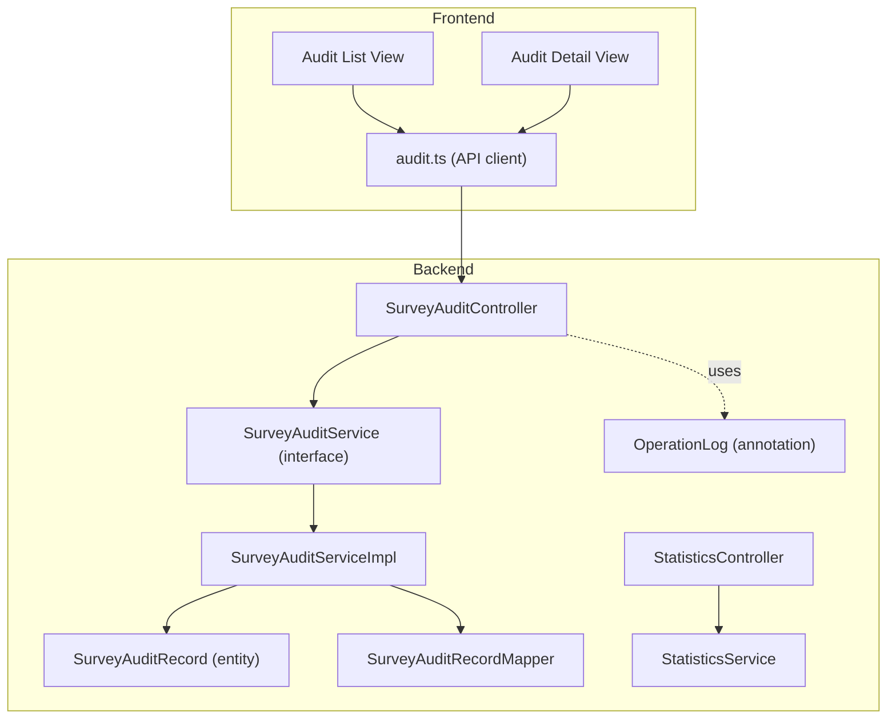
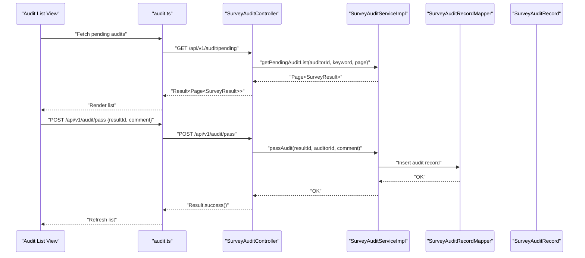
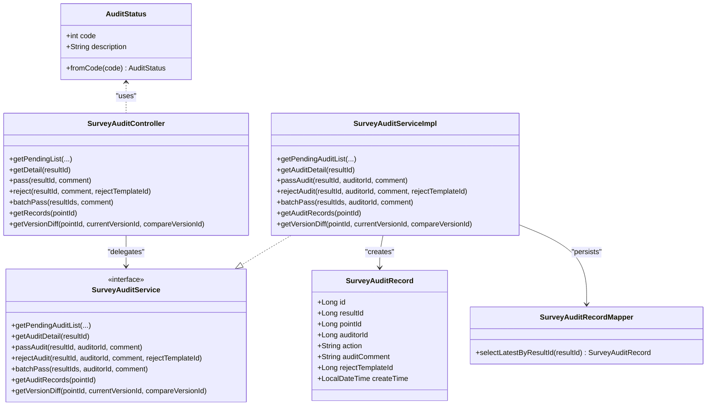
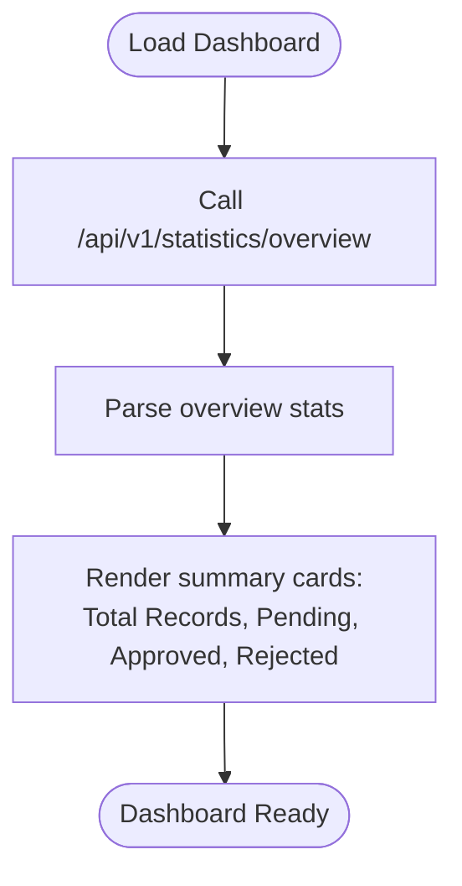
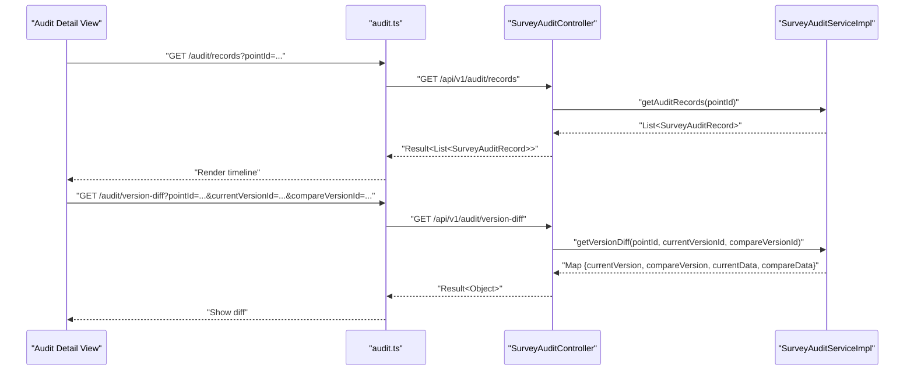
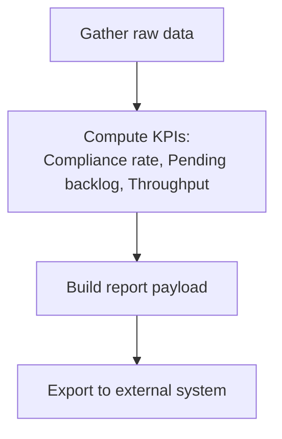
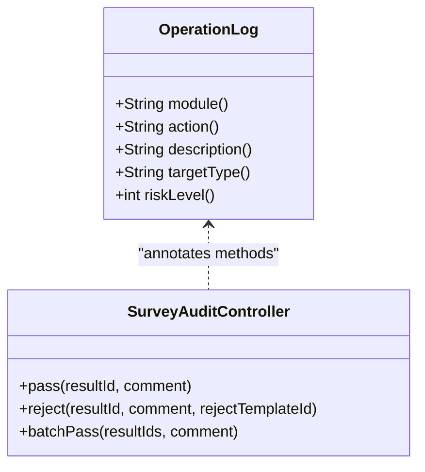
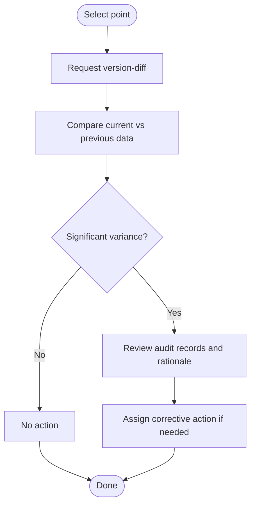
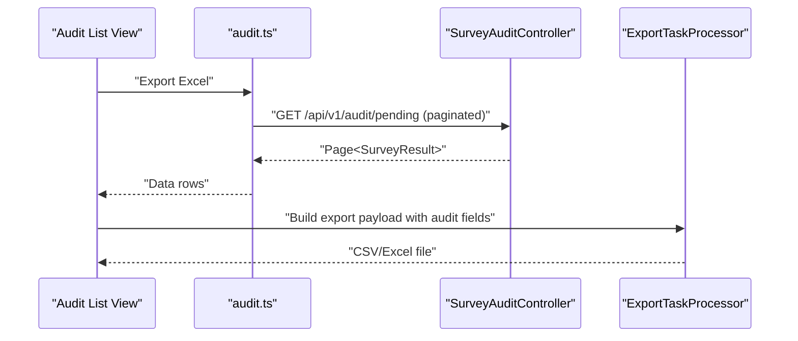
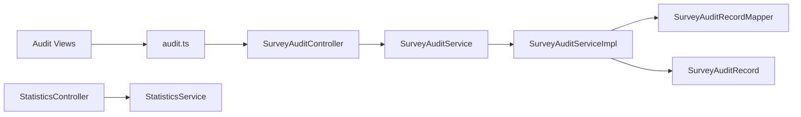

# Compliance Reporting

<cite>
**Referenced Files in This Document**
- [SurveyAuditController.java](file://admin-backend/src/main/java/com/qhiot/survey/controller/SurveyAuditController.java)
- [SurveyAuditService.java](file://admin-backend/src/main/java/com/qhiot/survey/service/SurveyAuditService.java)
- [SurveyAuditServiceImpl.java](file://admin-backend/src/main/java/com/qhiot/survey/service/impl/SurveyAuditServiceImpl.java)
- [SurveyAuditRecord.java](file://admin-backend/src/main/java/com/qhiot/survey/entity/SurveyAuditRecord.java)
- [SurveyAuditRecordMapper.java](file://admin-backend/src/main/java/com/qhiot/survey/mapper/SurveyAuditRecordMapper.java)
- [AuditStatus.java](file://admin-backend/src/main/java/com/qhiot/survey/common/enums/AuditStatus.java)
- [StatisticsController.java](file://admin-backend/src/main/java/com/qhiot/survey/controller/StatisticsController.java)
- [StatisticsService.java](file://admin-backend/src/main/java/com/qhiot/survey/service/StatisticsService.java)
- [audit.ts](file://admin-web-soybean/src/service/api/audit.ts)
- [index.vue (Audit List)](file://admin-web-soybean/src/views/audit/list/index.vue)
- [detail/[id].vue (Audit Detail)](file://admin-web-soybean/src/views/audit/detail/[id].vue)
- [ExportTaskProcessor.java](file://admin-backend/src/main/java/com/qhiot/survey/service/ExportTaskProcessor.java)
- [OperationLog.java](file://admin-backend/src/main/java/com/qhiot/survey/common/annotation/OperationLog.java)
</cite>

## Table of Contents
1. [Introduction](#introduction)
2. [Project Structure](#project-structure)
3. [Core Components](#core-components)
4. [Architecture Overview](#architecture-overview)
5. [Detailed Component Analysis](#detailed-component-analysis)
6. [Dependency Analysis](#dependency-analysis)
7. [Performance Considerations](#performance-considerations)
8. [Troubleshooting Guide](#troubleshooting-guide)
9. [Conclusion](#conclusion)
10. [Appendices](#appendices)

## Introduction
This document explains the compliance reporting and audit analytics capabilities implemented in the system. It focuses on:
- Compliance tracking mechanisms for audit adherence to internal policies and statuses
- Reporting dashboards for audit performance metrics, reviewer productivity, and compliance rates
- Audit history analysis for trends, bottlenecks, and quality assessment
- Examples of compliance report generation, KPI calculation, and benchmarking
- Integration with external compliance systems and audit trail requirements
- Variance analysis, outlier detection, and corrective action tracking
- Regulatory compliance documentation and audit readiness preparation

## Project Structure
The compliance reporting and audit analytics span backend controllers/services and frontend views:
- Backend: Audit APIs, audit service, audit records persistence, statistics aggregation, and operation logging
- Frontend: Audit list/detail views and API bindings for audit actions and history

**Diagram sources**
- [SurveyAuditController.java:23-104](file://admin-backend/src/main/java/com/qhiot/survey/controller/SurveyAuditController.java#L23-L104)
- [SurveyAuditService.java:12-48](file://admin-backend/src/main/java/com/qhiot/survey/service/SurveyAuditService.java#L12-L48)
- [SurveyAuditServiceImpl.java:31-190](file://admin-backend/src/main/java/com/qhiot/survey/service/impl/SurveyAuditServiceImpl.java#L31-L190)
- [SurveyAuditRecord.java:14-37](file://admin-backend/src/main/java/com/qhiot/survey/entity/SurveyAuditRecord.java#L14-L37)
- [SurveyAuditRecordMapper.java:10-21](file://admin-backend/src/main/java/com/qhiot/survey/mapper/SurveyAuditRecordMapper.java#L10-L21)
- [StatisticsController.java:18-45](file://admin-backend/src/main/java/com/qhiot/survey/controller/StatisticsController.java#L18-L45)
- [StatisticsService.java:11-121](file://admin-backend/src/main/java/com/qhiot/survey/service/StatisticsService.java#L11-L121)
- [OperationLog.java:12-39](file://admin-backend/src/main/java/com/qhiot/survey/common/annotation/OperationLog.java#L12-L39)
- [audit.ts:4-75](file://admin-web-soybean/src/service/api/audit.ts#L4-L75)
- [index.vue (Audit List):149-318](file://admin-web-soybean/src/views/audit/list/index.vue#L149-L318)
- [detail/[id].vue (Audit Detail)](file://admin-web-soybean/src/views/audit/detail/[id].vue#L254-L307)

**Section sources**
- [SurveyAuditController.java:23-104](file://admin-backend/src/main/java/com/qhiot/survey/controller/SurveyAuditController.java#L23-L104)
- [StatisticsController.java:18-45](file://admin-backend/src/main/java/com/qhiot/survey/controller/StatisticsController.java#L18-L45)
- [audit.ts:4-75](file://admin-web-soybean/src/service/api/audit.ts#L4-L75)
- [index.vue (Audit List):149-318](file://admin-web-soybean/src/views/audit/list/index.vue#L149-L318)
- [detail/[id].vue (Audit Detail)](file://admin-web-soybean/src/views/audit/detail/[id].vue#L254-L307)

## Core Components
- Audit API surface: Pending audit list retrieval, audit detail, approve/reject, batch approve, audit records, and version difference
- Audit service: Business logic for state transitions, audit records creation, and version comparison
- Audit record persistence: Stores reviewer actions, comments, and timestamps
- Statistics aggregation: System overview, user stats, project stats, and audit stats for dashboards
- Frontend audit views: List and detail screens with filtering, pagination, and audit actions
- Operation logging: Annotation-driven audit trail for sensitive operations

**Section sources**
- [SurveyAuditController.java:34-91](file://admin-backend/src/main/java/com/qhiot/survey/controller/SurveyAuditController.java#L34-L91)
- [SurveyAuditServiceImpl.java:42-190](file://admin-backend/src/main/java/com/qhiot/survey/service/impl/SurveyAuditServiceImpl.java#L42-L190)
- [SurveyAuditRecord.java:18-37](file://admin-backend/src/main/java/com/qhiot/survey/entity/SurveyAuditRecord.java#L18-L37)
- [StatisticsService.java:31-121](file://admin-backend/src/main/java/com/qhiot/survey/service/StatisticsService.java#L31-L121)
- [audit.ts:4-75](file://admin-web-soybean/src/service/api/audit.ts#L4-L75)
- [index.vue (Audit List):167-232](file://admin-web-soybean/src/views/audit/list/index.vue#L167-L232)
- [detail/[id].vue (Audit Detail)](file://admin-web-soybean/src/views/audit/detail/[id].vue#L270-L279)
- [OperationLog.java:12-39](file://admin-backend/src/main/java/com/qhiot/survey/common/annotation/OperationLog.java#L12-L39)

## Architecture Overview
The audit workflow integrates frontend UI, backend controllers, services, and persistence. The sequence below shows a typical approval process.

**Diagram sources**
- [index.vue (Audit List):204-232](file://admin-web-soybean/src/views/audit/list/index.vue#L204-L232)
- [audit.ts:4-34](file://admin-web-soybean/src/service/api/audit.ts#L4-L34)
- [SurveyAuditController.java:34-77](file://admin-backend/src/main/java/com/qhiot/survey/controller/SurveyAuditController.java#L34-L77)
- [SurveyAuditServiceImpl.java:64-93](file://admin-backend/src/main/java/com/qhiot/survey/service/impl/SurveyAuditServiceImpl.java#L64-L93)
- [SurveyAuditRecordMapper.java:10-21](file://admin-backend/src/main/java/com/qhiot/survey/mapper/SurveyAuditRecordMapper.java#L10-L21)

## Detailed Component Analysis

### Audit Tracking and Compliance Status
- Audit statuses are represented via an enumeration covering pending, passed, and rejected states
- Controllers expose endpoints for retrieving pending audits, details, approvals, rejections, batch approvals, audit records, and version differences
- Services enforce state transitions and persist audit records with action, comment, and timestamp

**Diagram sources**
- [AuditStatus.java:9-30](file://admin-backend/src/main/java/com/qhiot/survey/common/enums/AuditStatus.java#L9-L30)
- [SurveyAuditController.java:23-91](file://admin-backend/src/main/java/com/qhiot/survey/controller/SurveyAuditController.java#L23-L91)
- [SurveyAuditService.java:12-48](file://admin-backend/src/main/java/com/qhiot/survey/service/SurveyAuditService.java#L12-L48)
- [SurveyAuditServiceImpl.java:31-190](file://admin-backend/src/main/java/com/qhiot/survey/service/impl/SurveyAuditServiceImpl.java#L31-L190)
- [SurveyAuditRecord.java:14-37](file://admin-backend/src/main/java/com/qhiot/survey/entity/SurveyAuditRecord.java#L14-L37)
- [SurveyAuditRecordMapper.java:10-21](file://admin-backend/src/main/java/com/qhiot/survey/mapper/SurveyAuditRecordMapper.java#L10-L21)

**Section sources**
- [AuditStatus.java:9-30](file://admin-backend/src/main/java/com/qhiot/survey/common/enums/AuditStatus.java#L9-L30)
- [SurveyAuditController.java:34-91](file://admin-backend/src/main/java/com/qhiot/survey/controller/SurveyAuditController.java#L34-L91)
- [SurveyAuditServiceImpl.java:64-190](file://admin-backend/src/main/java/com/qhiot/survey/service/impl/SurveyAuditServiceImpl.java#L64-L190)
- [SurveyAuditRecord.java:18-37](file://admin-backend/src/main/java/com/qhiot/survey/entity/SurveyAuditRecord.java#L18-L37)
- [SurveyAuditRecordMapper.java:17-20](file://admin-backend/src/main/java/com/qhiot/survey/mapper/SurveyAuditRecordMapper.java#L17-L20)

### Reporting Dashboards and Metrics
- System overview statistics include totals for users, projects, points, completion rate, pending audits, approved results, and total results
- User statistics include total users, active users, new users this month, and active rate
- The frontend audit list view displays summary cards for total records, pending, approved, and rejected counts, enabling quick compliance checks

**Diagram sources**
- [StatisticsController.java:26-30](file://admin-backend/src/main/java/com/qhiot/survey/controller/StatisticsController.java#L26-L30)
- [StatisticsService.java:31-85](file://admin-backend/src/main/java/com/qhiot/survey/service/StatisticsService.java#L31-L85)
- [index.vue (Audit List):27-64](file://admin-web-soybean/src/views/audit/list/index.vue#L27-L64)

**Section sources**
- [StatisticsController.java:26-44](file://admin-backend/src/main/java/com/qhiot/survey/controller/StatisticsController.java#L26-L44)
- [StatisticsService.java:31-121](file://admin-backend/src/main/java/com/qhiot/survey/service/StatisticsService.java#L31-L121)
- [index.vue (Audit List):27-64](file://admin-web-soybean/src/views/audit/list/index.vue#L27-L64)

### Audit History Analysis and Version Differences
- Audit records capture reviewer actions, comments, and timestamps per result
- Version difference endpoint compares two versions of a survey result
- The audit detail view presents a timeline of actions and supports version comparison links

**Diagram sources**
- [detail/[id].vue (Audit Detail)](file://admin-web-soybean/src/views/audit/detail/[id].vue#L16-L25)
- [audit.ts:59-74](file://admin-web-soybean/src/service/api/audit.ts#L59-L74)
- [SurveyAuditController.java:79-91](file://admin-backend/src/main/java/com/qhiot/survey/controller/SurveyAuditController.java#L79-L91)
- [SurveyAuditServiceImpl.java:155-178](file://admin-backend/src/main/java/com/qhiot/survey/service/impl/SurveyAuditServiceImpl.java#L155-L178)

**Section sources**
- [SurveyAuditRecord.java:18-37](file://admin-backend/src/main/java/com/qhiot/survey/entity/SurveyAuditRecord.java#L18-L37)
- [SurveyAuditRecordMapper.java:17-20](file://admin-backend/src/main/java/com/qhiot/survey/mapper/SurveyAuditRecordMapper.java#L17-L20)
- [SurveyAuditController.java:79-91](file://admin-backend/src/main/java/com/qhiot/survey/controller/SurveyAuditController.java#L79-L91)
- [SurveyAuditServiceImpl.java:155-178](file://admin-backend/src/main/java/com/qhiot/survey/service/impl/SurveyAuditServiceImpl.java#L155-L178)
- [detail/[id].vue (Audit Detail)](file://admin-web-soybean/src/views/audit/detail/[id].vue#L167-L206)

### Compliance Report Generation and KPI Calculation
- Compliance KPIs can be derived from statistics:
  - Audit compliance rate: approved results / total results
  - Pending backlog: pending audit count
  - Reviewer throughput: approved results per reviewer per period
- Reports can be exported via the frontend’s export capability and built from backend statistics and audit records

**Diagram sources**
- [StatisticsService.java:78-82](file://admin-backend/src/main/java/com/qhiot/survey/service/StatisticsService.java#L78-L82)
- [index.vue (Audit List):11-18](file://admin-web-soybean/src/views/audit/list/index.vue#L11-L18)

**Section sources**
- [StatisticsService.java:78-82](file://admin-backend/src/main/java/com/qhiot/survey/service/StatisticsService.java#L78-L82)
- [index.vue (Audit List):11-18](file://admin-web-soybean/src/views/audit/list/index.vue#L11-L18)

### Audit Trail and Operational Logging
- Sensitive audit operations are annotated with an operation log annotation capturing module, action, description, target type, and risk level
- Controllers applying the annotation trigger audit trails for approval and rejection actions

**Diagram sources**
- [OperationLog.java:12-39](file://admin-backend/src/main/java/com/qhiot/survey/common/annotation/OperationLog.java#L12-L39)
- [SurveyAuditController.java:52-72](file://admin-backend/src/main/java/com/qhiot/survey/controller/SurveyAuditController.java#L52-L72)

**Section sources**
- [OperationLog.java:12-39](file://admin-backend/src/main/java/com/qhiot/survey/common/annotation/OperationLog.java#L12-L39)
- [SurveyAuditController.java:52-72](file://admin-backend/src/main/java/com/qhiot/survey/controller/SurveyAuditController.java#L52-L72)

### Variance Analysis, Outlier Detection, and Corrective Actions
- Version difference endpoint returns current and compared data snapshots for manual inspection
- Audit records timeline enables retrospective analysis of reviewer decisions and corrective actions
- Outlier detection can be performed by comparing reviewer performance metrics against benchmarks

**Diagram sources**
- [SurveyAuditController.java:85-91](file://admin-backend/src/main/java/com/qhiot/survey/controller/SurveyAuditController.java#L85-L91)
- [SurveyAuditServiceImpl.java:164-178](file://admin-backend/src/main/java/com/qhiot/survey/service/impl/SurveyAuditServiceImpl.java#L164-L178)
- [detail/[id].vue (Audit Detail)](file://admin-web-soybean/src/views/audit/detail/[id].vue#L167-L206)

**Section sources**
- [SurveyAuditController.java:85-91](file://admin-backend/src/main/java/com/qhiot/survey/controller/SurveyAuditController.java#L85-L91)
- [SurveyAuditServiceImpl.java:164-178](file://admin-backend/src/main/java/com/qhiot/survey/service/impl/SurveyAuditServiceImpl.java#L164-L178)
- [detail/[id].vue (Audit Detail)](file://admin-web-soybean/src/views/audit/detail/[id].vue#L167-L206)

### Audit Readiness and Regulatory Documentation
- Export tasks can incorporate audit data fields such as audit status, auditor ID, audit time, and audit comment for downstream compliance documentation
- The frontend export button supports exporting audit lists for external systems

**Diagram sources**
- [index.vue (Audit List):11-18](file://admin-web-soybean/src/views/audit/list/index.vue#L11-L18)
- [audit.ts:4-14](file://admin-web-soybean/src/service/api/audit.ts#L4-L14)
- [ExportTaskProcessor.java:395-404](file://admin-backend/src/main/java/com/qhiot/survey/service/ExportTaskProcessor.java#L395-L404)

**Section sources**
- [index.vue (Audit List):11-18](file://admin-web-soybean/src/views/audit/list/index.vue#L11-L18)
- [audit.ts:4-14](file://admin-web-soybean/src/service/api/audit.ts#L4-L14)
- [ExportTaskProcessor.java:395-404](file://admin-backend/src/main/java/com/qhiot/survey/service/ExportTaskProcessor.java#L395-L404)

## Dependency Analysis
- Controllers depend on services for business logic
- Services depend on mappers/entities for persistence
- Statistics controller depends on services for aggregated metrics
- Frontend views depend on API clients for data and actions

**Diagram sources**
- [SurveyAuditController.java:23-104](file://admin-backend/src/main/java/com/qhiot/survey/controller/SurveyAuditController.java#L23-L104)
- [SurveyAuditService.java:12-48](file://admin-backend/src/main/java/com/qhiot/survey/service/SurveyAuditService.java#L12-L48)
- [SurveyAuditServiceImpl.java:31-190](file://admin-backend/src/main/java/com/qhiot/survey/service/impl/SurveyAuditServiceImpl.java#L31-L190)
- [SurveyAuditRecordMapper.java:10-21](file://admin-backend/src/main/java/com/qhiot/survey/mapper/SurveyAuditRecordMapper.java#L10-L21)
- [SurveyAuditRecord.java:14-37](file://admin-backend/src/main/java/com/qhiot/survey/entity/SurveyAuditRecord.java#L14-L37)
- [StatisticsController.java:18-45](file://admin-backend/src/main/java/com/qhiot/survey/controller/StatisticsController.java#L18-L45)
- [StatisticsService.java:11-121](file://admin-backend/src/main/java/com/qhiot/survey/service/StatisticsService.java#L11-L121)
- [audit.ts:4-75](file://admin-web-soybean/src/service/api/audit.ts#L4-L75)
- [index.vue (Audit List):149-318](file://admin-web-soybean/src/views/audit/list/index.vue#L149-L318)
- [detail/[id].vue (Audit Detail)](file://admin-web-soybean/src/views/audit/detail/[id].vue#L254-L307)

**Section sources**
- [SurveyAuditController.java:23-104](file://admin-backend/src/main/java/com/qhiot/survey/controller/SurveyAuditController.java#L23-L104)
- [SurveyAuditServiceImpl.java:31-190](file://admin-backend/src/main/java/com/qhiot/survey/service/impl/SurveyAuditServiceImpl.java#L31-L190)
- [StatisticsController.java:18-45](file://admin-backend/src/main/java/com/qhiot/survey/controller/StatisticsController.java#L18-L45)
- [StatisticsService.java:11-121](file://admin-backend/src/main/java/com/qhiot/survey/service/StatisticsService.java#L11-L121)
- [audit.ts:4-75](file://admin-web-soybean/src/service/api/audit.ts#L4-L75)
- [index.vue (Audit List):149-318](file://admin-web-soybean/src/views/audit/list/index.vue#L149-L318)
- [detail/[id].vue (Audit Detail)](file://admin-web-soybean/src/views/audit/detail/[id].vue#L254-L307)

## Performance Considerations
- Pagination for audit lists reduces payload sizes and improves responsiveness
- Efficient SQL queries and ordering by submission time support timely reviews
- Batch operations enable reviewers to process multiple items efficiently
- Export payloads should aggregate only necessary fields to minimize memory and network overhead

[No sources needed since this section provides general guidance]

## Troubleshooting Guide
- Approve/Reject validation: Ensure the result is in pending audit status before approving or rejecting
- Rejection creates a new draft version; verify the new version is visible and editable
- Audit records insertion errors: confirm mapper and entity mappings align with the database schema
- Statistics discrepancies: verify counts from services match database aggregates

**Section sources**
- [SurveyAuditServiceImpl.java:64-141](file://admin-backend/src/main/java/com/qhiot/survey/service/impl/SurveyAuditServiceImpl.java#L64-L141)
- [SurveyAuditRecordMapper.java:17-20](file://admin-backend/src/main/java/com/qhiot/survey/mapper/SurveyAuditRecordMapper.java#L17-L20)
- [StatisticsService.java:57-58](file://admin-backend/src/main/java/com/qhiot/survey/service/StatisticsService.java#L57-L58)

## Conclusion
The system provides robust audit tracking, actionable dashboards, and comprehensive audit history analysis. By leveraging standardized statuses, operation logging, and version comparisons, it supports compliance monitoring, performance benchmarking, and audit readiness. Integrations with export capabilities and external systems enable scalable compliance reporting aligned with internal policies and regulatory requirements.

[No sources needed since this section summarizes without analyzing specific files]

## Appendices

### Appendix A: Audit Workflow Reference
- Pending audit list retrieval
- Audit detail retrieval
- Approve with comment
- Reject with comment and optional template
- Batch approve
- Retrieve audit records
- Retrieve version difference

**Section sources**
- [SurveyAuditController.java:34-91](file://admin-backend/src/main/java/com/qhiot/survey/controller/SurveyAuditController.java#L34-L91)
- [audit.ts:4-74](file://admin-web-soybean/src/service/api/audit.ts#L4-L74)