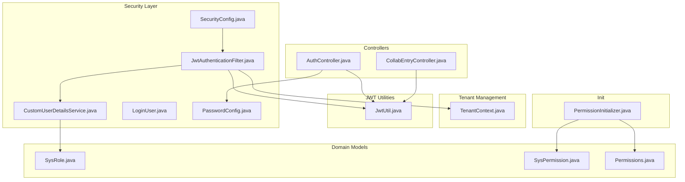
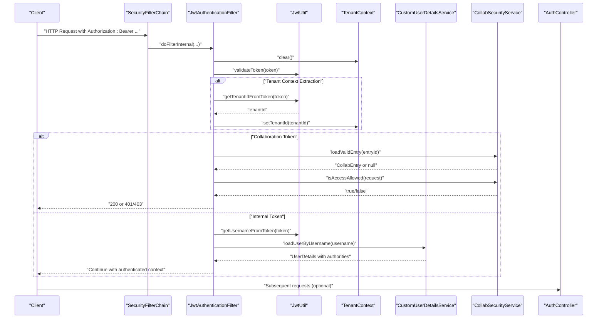
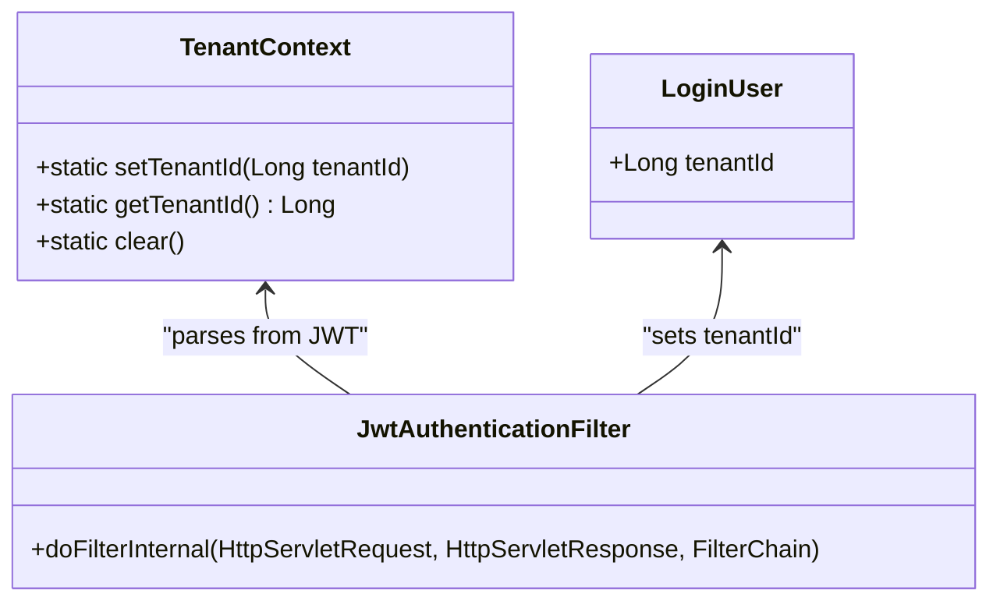
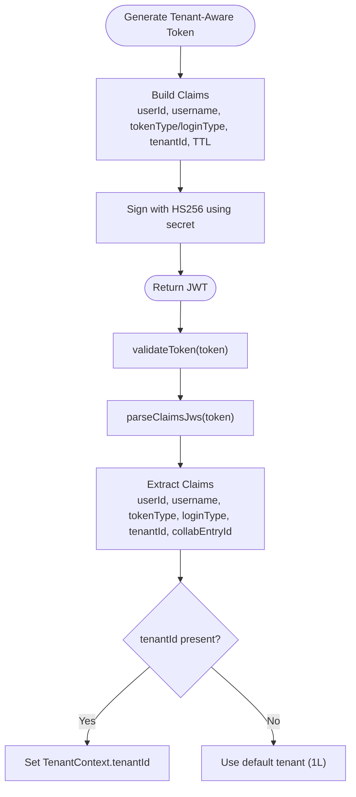
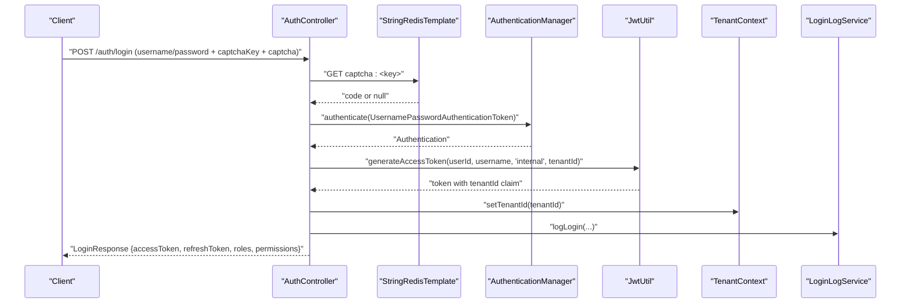
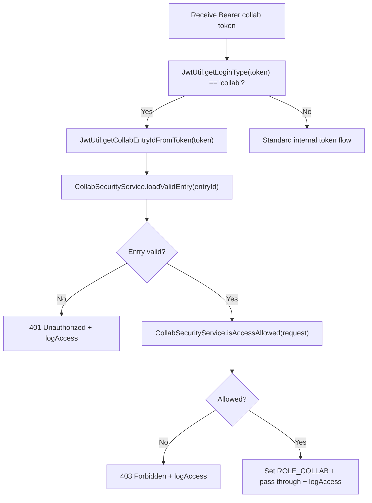
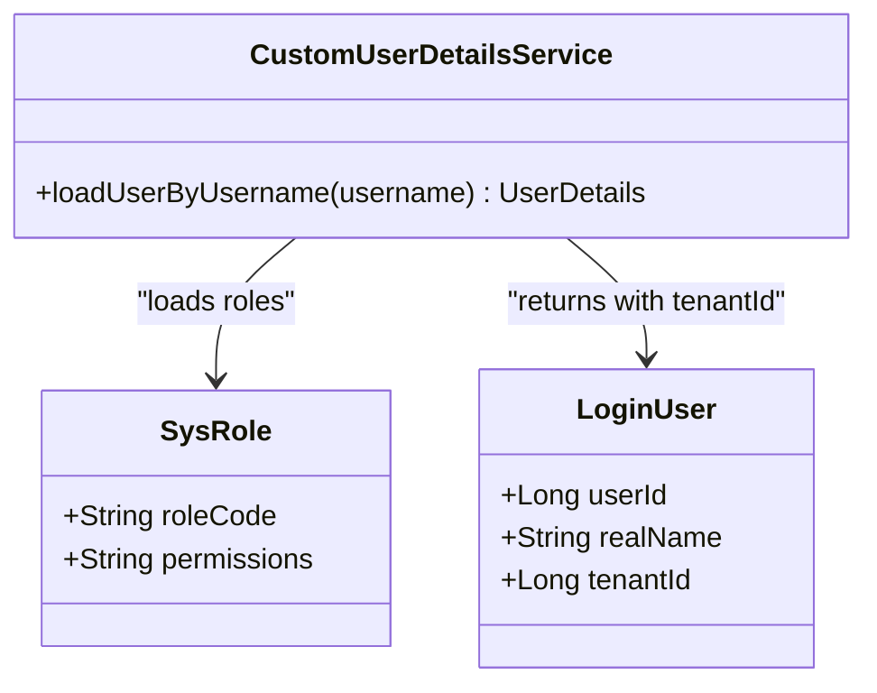
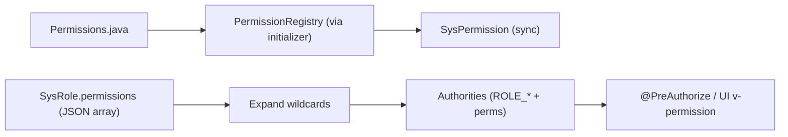
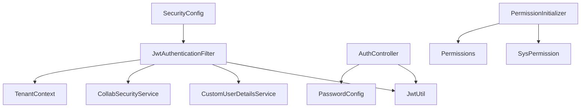

# Authentication & Authorization

<cite>
**Referenced Files in This Document**
- [SecurityConfig.java](file://admin-backend/src/main/java/com/qhiot/survey/security/SecurityConfig.java)
- [JwtAuthenticationFilter.java](file://admin-backend/src/main/java/com/qhiot/survey/security/JwtAuthenticationFilter.java)
- [CustomUserDetailsService.java](file://admin-backend/src/main/java/com/qhiot/survey/security/CustomUserDetailsService.java)
- [LoginUser.java](file://admin-backend/src/main/java/com/qhiot/survey/security/LoginUser.java)
- [JwtUtil.java](file://admin-backend/src/main/java/com/qhiot/survey/common/util/JwtUtil.java)
- [TenantContext.java](file://admin-backend/src/main/java/com/qhiot/survey/common/util/TenantContext.java)
- [AuthController.java](file://admin-backend/src/main/java/com/qhiot/survey/controller/AuthController.java)
- [CollabSecurityService.java](file://admin-backend/src/main/java/com/qhiot/survey/security/CollabSecurityService.java)
- [CollabEntryController.java](file://admin-backend/src/main/java/com/qhiot/survey/controller/CollabEntryController.java)
- [PasswordConfig.java](file://admin-backend/src/main/java/com/qhiot/survey/config/PasswordConfig.java)
- [SysRole.java](file://admin-backend/src/main/java/com/qhiot/survey/entity/SysRole.java)
- [SysPermission.java](file://admin-backend/src/main/java/com/qhiot/survey/entity/SysPermission.java)
- [Permissions.java](file://admin-backend/src/main/java/com/qhiot/survey/common/constant/Permissions.java)
- [PermissionInitializer.java](file://admin-backend/src/main/java/com/qhiot/survey/common/init/PermissionInitializer.java)
</cite>

## Update Summary
**Changes Made**
- Enhanced JWT implementation with tenant-aware authentication support
- Added tenant context propagation through TenantContext for multi-tenant isolation
- Updated JwtAuthenticationFilter to parse tenant IDs from JWT tokens
- Extended LoginUser with tenantId field for tenant-aware user representation
- Integrated tenant-aware login flows with access control enforcement

## Table of Contents
1. [Introduction](#introduction)
2. [Project Structure](#project-structure)
3. [Core Components](#core-components)
4. [Architecture Overview](#architecture-overview)
5. [Detailed Component Analysis](#detailed-component-analysis)
6. [Dependency Analysis](#dependency-analysis)
7. [Performance Considerations](#performance-considerations)
8. [Troubleshooting Guide](#troubleshooting-guide)
9. [Conclusion](#conclusion)
10. [Appendices](#appendices)

## Introduction
This document explains the authentication and authorization system of the Survey App backend, now enhanced with tenant-aware authentication capabilities. The system supports multi-tenant isolation through tenant context propagation, tenant-aware login flows, and tenant-specific access control. It covers JWT-based authentication with tenant context, token generation and validation, refresh mechanisms, user roles and permissions, and the collaboration token system for cross-platform access control.

## Project Structure
The authentication subsystem is primarily located under the admin-backend module with enhanced tenant-aware components:
- Security configuration and filters: security package
- JWT utilities with tenant support: common/util
- Tenant context management: common/util
- Controllers: controller package (AuthController, CollabEntryController)
- Entities and permissions: entity package
- Password encoding: config package
- Permission initialization: common/init

**Diagram sources**
- [SecurityConfig.java:1-99](file://admin-backend/src/main/java/com/qhiot/survey/security/SecurityConfig.java#L1-L99)
- [JwtAuthenticationFilter.java:1-135](file://admin-backend/src/main/java/com/qhiot/survey/security/JwtAuthenticationFilter.java#L1-L135)
- [CustomUserDetailsService.java:1-91](file://admin-backend/src/main/java/com/qhiot/survey/security/CustomUserDetailsService.java#L1-L91)
- [LoginUser.java:1-36](file://admin-backend/src/main/java/com/qhiot/survey/security/LoginUser.java#L1-L36)
- [JwtUtil.java:1-196](file://admin-backend/src/main/java/com/qhiot/survey/common/util/JwtUtil.java#L1-L196)
- [TenantContext.java:1-28](file://admin-backend/src/main/java/com/qhiot/survey/common/util/TenantContext.java#L1-L28)
- [AuthController.java:1-552](file://admin-backend/src/main/java/com/qhiot/survey/controller/AuthController.java#L1-L552)
- [CollabEntryController.java:1-89](file://admin-backend/src/main/java/com/qhiot/survey/controller/CollabEntryController.java#L1-L89)
- [SysRole.java:1-40](file://admin-backend/src/main/java/com/qhiot/survey/entity/SysRole.java#L1-L40)
- [SysPermission.java:1-56](file://admin-backend/src/main/java/com/qhiot/survey/entity/SysPermission.java#L1-L56)
- [Permissions.java:1-81](file://admin-backend/src/main/java/com/qhiot/survey/common/constant/Permissions.java#L1-L81)
- [PermissionInitializer.java:1-38](file://admin-backend/src/main/java/com/qhiot/survey/common/init/PermissionInitializer.java#L1-L38)

**Section sources**
- [SecurityConfig.java:1-99](file://admin-backend/src/main/java/com/qhiot/survey/security/SecurityConfig.java#L1-L99)
- [JwtAuthenticationFilter.java:1-135](file://admin-backend/src/main/java/com/qhiot/survey/security/JwtAuthenticationFilter.java#L1-L135)
- [JwtUtil.java:1-196](file://admin-backend/src/main/java/com/qhiot/survey/common/util/JwtUtil.java#L1-L196)
- [AuthController.java:1-552](file://admin-backend/src/main/java/com/qhiot/survey/controller/AuthController.java#L1-L552)
- [CollabSecurityService.java:1-126](file://admin-backend/src/main/java/com/qhiot/survey/security/CollabSecurityService.java#L1-L126)
- [CollabEntryController.java:1-89](file://admin-backend/src/main/java/com/qhiot/survey/controller/CollabEntryController.java#L1-L89)
- [CustomUserDetailsService.java:1-91](file://admin-backend/src/main/java/com/qhiot/survey/security/CustomUserDetailsService.java#L1-L91)
- [LoginUser.java:1-36](file://admin-backend/src/main/java/com/qhiot/survey/security/LoginUser.java#L1-L36)
- [PasswordConfig.java:1-18](file://admin-backend/src/main/java/com/qhiot/survey/config/PasswordConfig.java#L1-L18)
- [SysRole.java:1-40](file://admin-backend/src/main/java/com/qhiot/survey/entity/SysRole.java#L1-L40)
- [SysPermission.java:1-56](file://admin-backend/src/main/java/com/qhiot/survey/entity/SysPermission.java#L1-L56)
- [Permissions.java:1-81](file://admin-backend/src/main/java/com/qhiot/survey/common/constant/Permissions.java#L1-L81)
- [PermissionInitializer.java:1-38](file://admin-backend/src/main/java/com/qhiot/survey/common/init/PermissionInitializer.java#L1-L38)

## Core Components
- Security filter chain: Stateless JWT filter with tenant context propagation plus CORS and encoding configuration.
- Tenant context management: ThreadLocal-based tenant context for multi-tenant isolation.
- JWT utilities with tenant support: token generation, parsing, validation, and tenant ID extraction.
- Authentication controller: tenant-aware login, SMS login, refresh, logout, user info retrieval.
- Collaboration security service: validates collaboration entries, applies whitelist-based access control, and logs access.
- Custom user details service: loads user roles and permissions with tenant context awareness.
- Password encoding: BCrypt encoder configured via PasswordConfig.
- Role and permission model: SysRole with JSON-encoded permissions and SysPermission for metadata.

**Section sources**
- [SecurityConfig.java:39-61](file://admin-backend/src/main/java/com/qhiot/survey/security/SecurityConfig.java#L39-L61)
- [JwtUtil.java:34-51](file://admin-backend/src/main/java/com/qhiot/survey/common/util/JwtUtil.java#L34-L51)
- [AuthController.java:139-238](file://admin-backend/src/main/java/com/qhiot/survey/controller/AuthController.java#L139-L238)
- [CollabSecurityService.java:26-105](file://admin-backend/src/main/java/com/qhiot/survey/security/CollabSecurityService.java#L26-L105)
- [CustomUserDetailsService.java:31-89](file://admin-backend/src/main/java/com/qhiot/survey/security/CustomUserDetailsService.java#L31-L89)
- [PasswordConfig.java:14-17](file://admin-backend/src/main/java/com/qhiot/survey/config/PasswordConfig.java#L14-L17)
- [SysRole.java:25-28](file://admin-backend/src/main/java/com/qhiot/survey/entity/SysRole.java#L25-L28)
- [SysPermission.java:24-30](file://admin-backend/src/main/java/com/qhiot/survey/entity/SysPermission.java#L24-L30)

## Architecture Overview
The enhanced authentication and authorization architecture centers on a stateless JWT filter that authenticates requests, extracts tenant context from tokens, and delegates collaboration tokens to a specialized security service. Multi-tenant isolation is achieved through tenant context propagation to all downstream services.

**Diagram sources**
- [SecurityConfig.java:40-61](file://admin-backend/src/main/java/com/qhiot/survey/security/SecurityConfig.java#L40-L61)
- [JwtAuthenticationFilter.java:44-81](file://admin-backend/src/main/java/com/qhiot/survey/security/JwtAuthenticationFilter.java#L44-L81)
- [JwtUtil.java:154-161](file://admin-backend/src/main/java/com/qhiot/survey/common/util/JwtUtil.java#L154-L161)
- [TenantContext.java:13-26](file://admin-backend/src/main/java/com/qhiot/survey/common/util/TenantContext.java#L13-L26)
- [CustomUserDetailsService.java:31-89](file://admin-backend/src/main/java/com/qhiot/survey/security/CustomUserDetailsService.java#L31-L89)
- [CollabSecurityService.java:39-105](file://admin-backend/src/main/java/com/qhiot/survey/security/CollabSecurityService.java#L39-L105)
- [AuthController.java:139-238](file://admin-backend/src/main/java/com/qhiot/survey/controller/AuthController.java#L139-L238)

## Detailed Component Analysis

### Security Filter Chain and CORS
- CSRF disabled; form and basic auth disabled; session policy stateless.
- Public endpoints permitted: authentication, health, Swagger, actuator, and public API.
- JWT filter added before username/password filter.
- Character encoding filter ensures UTF-8.
- CORS allows credentials and exposes Authorization header; origin patterns handled safely.

**Section sources**
- [SecurityConfig.java:40-61](file://admin-backend/src/main/java/com/qhiot/survey/security/SecurityConfig.java#L40-L61)
- [SecurityConfig.java:68-97](file://admin-backend/src/main/java/com/qhiot/survey/security/SecurityConfig.java#L68-L97)

### Tenant Context Management
- ThreadLocal-based tenant context for request-scoped tenant isolation.
- Automatically cleared at filter completion to prevent memory leaks.
- Provides tenant ID for multi-tenant data filtering and access control.
- Supports system administrator mode when tenantId is null.

**Diagram sources**
- [TenantContext.java:9-27](file://admin-backend/src/main/java/com/qhiot/survey/common/util/TenantContext.java#L9-L27)
- [JwtAuthenticationFilter.java:49-56](file://admin-backend/src/main/java/com/qhiot/survey/security/JwtAuthenticationFilter.java#L49-L56)
- [LoginUser.java:21-23](file://admin-backend/src/main/java/com/qhiot/survey/security/LoginUser.java#L21-L23)

**Section sources**
- [TenantContext.java:9-27](file://admin-backend/src/main/java/com/qhiot/survey/common/util/TenantContext.java#L9-L27)
- [JwtAuthenticationFilter.java:49-56](file://admin-backend/src/main/java/com/qhiot/survey/security/JwtAuthenticationFilter.java#L49-L56)
- [LoginUser.java:21-23](file://admin-backend/src/main/java/com/qhiot/survey/security/LoginUser.java#L21-L23)

### JWT Utilities: Generation, Validation, and Claims
- Access tokens and refresh tokens generated with HS256 using a configurable secret and expiration.
- Collaboration tokens carry loginType=collab and collabEntryId, enabling cross-platform access control.
- Enhanced with tenant-aware token generation supporting tenantId claim.
- Claims extraction supports userId, username, tokenType, loginType, tenantId, and collabEntryId.
- Token validation checks signature and expiration.

**Diagram sources**
- [JwtUtil.java:34-51](file://admin-backend/src/main/java/com/qhiot/survey/common/util/JwtUtil.java#L34-L51)
- [JwtUtil.java:73-85](file://admin-backend/src/main/java/com/qhiot/survey/common/util/JwtUtil.java#L73-L85)
- [JwtUtil.java:154-161](file://admin-backend/src/main/java/com/qhiot/survey/common/util/JwtUtil.java#L154-L161)
- [JwtUtil.java:142-152](file://admin-backend/src/main/java/com/qhiot/survey/common/util/JwtUtil.java#L142-L152)

**Section sources**
- [JwtUtil.java:22-29](file://admin-backend/src/main/java/com/qhiot/survey/common/util/JwtUtil.java#L22-L29)
- [JwtUtil.java:34-51](file://admin-backend/src/main/java/com/qhiot/survey/common/util/JwtUtil.java#L34-L51)
- [JwtUtil.java:102-149](file://admin-backend/src/main/java/com/qhiot/survey/common/util/JwtUtil.java#L102-L149)
- [JwtUtil.java:154-161](file://admin-backend/src/main/java/com/qhiot/survey/common/util/JwtUtil.java#L154-L161)

### Authentication Controller: Login, Refresh, Logout, and User Info
- Captcha endpoint stores 4-digit code in Redis with short TTL for verification.
- Username/password login validates captcha, checks user status and lockout, authenticates via AuthenticationManager, generates access and refresh tokens with tenant context, and records login logs.
- SMS login verifies SMS code, resolves user by phone, generates tokens with tenant context, updates last login, and logs.
- Refresh endpoint validates refresh token type and expiration, reissues new tokens for the user with tenant context.
- Change password and reset password endpoints use PasswordEncoder and update user records.
- Logout clears SecurityContext.
- getUserInfo aggregates roles and permissions for the current user.

**Diagram sources**
- [AuthController.java:139-238](file://admin-backend/src/main/java/com/qhiot/survey/controller/AuthController.java#L139-L238)
- [JwtUtil.java:34-51](file://admin-backend/src/main/java/com/qhiot/survey/common/util/JwtUtil.java#L34-L51)
- [TenantContext.java:13-16](file://admin-backend/src/main/java/com/qhiot/survey/common/util/TenantContext.java#L13-L16)

**Section sources**
- [AuthController.java:139-238](file://admin-backend/src/main/java/com/qhiot/survey/controller/AuthController.java#L139-L238)
- [AuthController.java:399-427](file://admin-backend/src/main/java/com/qhiot/survey/controller/AuthController.java#L399-L427)
- [AuthController.java:481-550](file://admin-backend/src/main/java/com/qhiot/survey/controller/AuthController.java#L481-L550)

### Collaboration Token System
- Collaboration entries define a bounded scope and TTL.
- CollabSecurityService validates entries (status and expiry) and enforces a strict whitelist for allowed GET endpoints.
- JwtAuthenticationFilter recognizes loginType=collab and delegates to CollabSecurityService for authentication and access control.
- Access logs are recorded for each collaboration request.

**Diagram sources**
- [JwtAuthenticationFilter.java:49-122](file://admin-backend/src/main/java/com/qhiot/survey/security/JwtAuthenticationFilter.java#L49-L122)
- [JwtUtil.java:126-149](file://admin-backend/src/main/java/com/qhiot/survey/common/util/JwtUtil.java#L126-L149)
- [CollabSecurityService.java:39-105](file://admin-backend/src/main/java/com/qhiot/survey/security/CollabSecurityService.java#L39-L105)

**Section sources**
- [JwtAuthenticationFilter.java:27-32](file://admin-backend/src/main/java/com/qhiot/survey/security/JwtAuthenticationFilter.java#L27-L32)
- [JwtAuthenticationFilter.java:86-122](file://admin-backend/src/main/java/com/qhiot/survey/security/JwtAuthenticationFilter.java#L86-L122)
- [CollabSecurityService.java:28-31](file://admin-backend/src/main/java/com/qhiot/survey/security/CollabSecurityService.java#L28-L31)
- [CollabSecurityService.java:66-105](file://admin-backend/src/main/java/com/qhiot/survey/security/CollabSecurityService.java#L66-L105)
- [CollabEntryController.java:83-88](file://admin-backend/src/main/java/com/qhiot/survey/controller/CollabEntryController.java#L83-L88)

### Custom User Details Service and Authorities
- Loads user by username, checks status, and retrieves assigned roles.
- Builds role authorities (ROLE_<CODE>) and aggregates raw permission codes from roles.
- Expands wildcard permissions via PermissionRegistry and ensures at least ROLE_USER if empty.
- Returns a LoginUser with authorities and tenantId for downstream authentication.

**Diagram sources**
- [CustomUserDetailsService.java:31-89](file://admin-backend/src/main/java/com/qhiot/survey/security/CustomUserDetailsService.java#L31-L89)
- [LoginUser.java:14-35](file://admin-backend/src/main/java/com/qhiot/survey/security/LoginUser.java#L14-L35)
- [SysRole.java:21-28](file://admin-backend/src/main/java/com/qhiot/survey/entity/SysRole.java#L21-L28)

**Section sources**
- [CustomUserDetailsService.java:31-89](file://admin-backend/src/main/java/com/qhiot/survey/security/CustomUserDetailsService.java#L31-L89)
- [LoginUser.java:14-35](file://admin-backend/src/main/java/com/qhiot/survey/security/LoginUser.java#L14-L35)
- [SysRole.java:21-28](file://admin-backend/src/main/java/com/qhiot/survey/entity/SysRole.java#L21-L28)

### Password Encoding Strategy
- BCryptPasswordEncoder bean is registered for secure password hashing.
- Used during login credential checks and password updates/reset.

**Section sources**
- [PasswordConfig.java:14-17](file://admin-backend/src/main/java/com/qhiot/survey/config/PasswordConfig.java#L14-L17)
- [AuthController.java:350-363](file://admin-backend/src/main/java/com/qhiot/survey/controller/AuthController.java#L350-L363)
- [AuthController.java:386-390](file://admin-backend/src/main/java/com/qhiot/survey/controller/AuthController.java#L386-L390)

### Roles, Permissions, and Method-Level Security
- Permissions are declared as constants and synchronized to the database at startup.
- Roles carry JSON-encoded permission lists; authorities are expanded and merged with role prefixes.
- Method-level security is enabled; permissions are enforced via hasAuthority expressions and UI directives.

**Diagram sources**
- [Permissions.java:13-80](file://admin-backend/src/main/java/com/qhiot/survey/common/constant/Permissions.java#L13-L80)
- [PermissionInitializer.java:22-36](file://admin-backend/src/main/java/com/qhiot/survey/common/init/PermissionInitializer.java#L22-L36)
- [SysPermission.java:24-30](file://admin-backend/src/main/java/com/qhiot/survey/entity/SysPermission.java#L24-L30)
- [SysRole.java:25-28](file://admin-backend/src/main/java/com/qhiot/survey/entity/SysRole.java#L25-L28)
- [CustomUserDetailsService.java:64-80](file://admin-backend/src/main/java/com/qhiot/survey/security/CustomUserDetailsService.java#L64-L80)

**Section sources**
- [Permissions.java:13-80](file://admin-backend/src/main/java/com/qhiot/survey/common/constant/Permissions.java#L13-L80)
- [PermissionInitializer.java:22-36](file://admin-backend/src/main/java/com/qhiot/survey/common/init/PermissionInitializer.java#L22-L36)
- [SysPermission.java:24-30](file://admin-backend/src/main/java/com/qhiot/survey/entity/SysPermission.java#L24-L30)
- [SysRole.java:25-28](file://admin-backend/src/main/java/com/qhiot/survey/entity/SysRole.java#L25-L28)
- [CustomUserDetailsService.java:64-80](file://admin-backend/src/main/java/com/qhiot/survey/security/CustomUserDetailsService.java#L64-L80)

### Permission Matrix Examples
- Project management: project:view, project:edit, template:bind.
- Point management: point:view, point:edit.
- Survey management: survey:create, survey:edit, survey:submit, survey:assist.
- Audit management: audit:view, audit:pass, audit:reject.
- System operations: system:log.
- Export capabilities: export:project, export:audit.

These are enforced via hasAuthority checks and UI permission directives.

**Section sources**
- [Permissions.java:16-78](file://admin-backend/src/main/java/com/qhiot/survey/common/constant/Permissions.java#L16-L78)

## Dependency Analysis
The enhanced authentication stack exhibits low coupling and clear separation of concerns with tenant-aware extensions:
- SecurityConfig depends on JwtAuthenticationFilter.
- JwtAuthenticationFilter depends on JwtUtil, UserDetailsService, CollabSecurityService, and TenantContext.
- TenantContext provides centralized tenant context management for the entire request lifecycle.
- CustomUserDetailsService depends on SysUserService and SysRoleService to assemble authorities.
- AuthController orchestrates authentication flows and integrates with JWT utilities and services.
- CollabEntryController manages collaboration lifecycle and token issuance.

**Diagram sources**
- [SecurityConfig.java:34-36](file://admin-backend/src/main/java/com/qhiot/survey/security/SecurityConfig.java#L34-L36)
- [JwtAuthenticationFilter.java:39-41](file://admin-backend/src/main/java/com/qhiot/survey/security/JwtAuthenticationFilter.java#L39-L41)
- [JwtUtil.java:1-196](file://admin-backend/src/main/java/com/qhiot/survey/common/util/JwtUtil.java#L1-L196)
- [CustomUserDetailsService.java:28-29](file://admin-backend/src/main/java/com/qhiot/survey/security/CustomUserDetailsService.java#L28-L29)
- [CollabSecurityService.java:33-34](file://admin-backend/src/main/java/com/qhiot/survey/security/CollabSecurityService.java#L33-L34)
- [TenantContext.java:9-27](file://admin-backend/src/main/java/com/qhiot/survey/common/util/TenantContext.java#L9-L27)
- [AuthController.java:52-59](file://admin-backend/src/main/java/com/qhiot/survey/controller/AuthController.java#L52-L59)
- [PasswordConfig.java:14-17](file://admin-backend/src/main/java/com/qhiot/survey/config/PasswordConfig.java#L14-L17)
- [PermissionInitializer.java:20-36](file://admin-backend/src/main/java/com/qhiot/survey/common/init/PermissionInitializer.java#L20-L36)

**Section sources**
- [SecurityConfig.java:34-36](file://admin-backend/src/main/java/com/qhiot/survey/security/SecurityConfig.java#L34-L36)
- [JwtAuthenticationFilter.java:39-41](file://admin-backend/src/main/java/com/qhiot/survey/security/JwtAuthenticationFilter.java#L39-L41)
- [AuthController.java:52-59](file://admin-backend/src/main/java/com/qhiot/survey/controller/AuthController.java#L52-L59)

## Performance Considerations
- Stateless JWT eliminates server-side session storage overhead.
- Token validation relies on symmetric signing; keep secret secure and rotate periodically.
- Tenant context propagation adds minimal overhead through ThreadLocal storage.
- Collaboration access logging writes to database per request; consider batching or sampling in high-throughput scenarios.
- Role and permission expansion occurs per request; caching user authorities in Redis could reduce CPU load for frequent access.

## Troubleshooting Guide
Common issues and resolutions:
- Unauthorized responses during JWT filter execution: verify token presence, format, and expiration; check filter error handling path.
- Tenant context not applied: ensure tenantId claim is present in token; verify TenantContext.setTenantId is called; check for proper cleanup.
- Collaboration token denied: confirm entry validity, whitelist allowance, and collabEntryId correctness.
- Refresh token invalid: ensure tokenType equals "refresh" and not expired; verify user exists and is active.
- User disabled or locked: login attempts will fail; unlock or reactivate the user.
- CORS errors: verify allowed origins pattern and credentials exposure.

**Section sources**
- [JwtAuthenticationFilter.java:72-78](file://admin-backend/src/main/java/com/qhiot/survey/security/JwtAuthenticationFilter.java#L72-L78)
- [JwtAuthenticationFilter.java:92-98](file://admin-backend/src/main/java/com/qhiot/survey/security/JwtAuthenticationFilter.java#L92-L98)
- [JwtUtil.java:142-152](file://admin-backend/src/main/java/com/qhiot/survey/common/util/JwtUtil.java#L142-L152)
- [AuthController.java:402-408](file://admin-backend/src/main/java/com/qhiot/survey/controller/AuthController.java#L402-L408)
- [SecurityConfig.java:68-89](file://admin-backend/src/main/java/com/qhiot/survey/security/SecurityConfig.java#L68-L89)

## Conclusion
The system implements a robust, stateless JWT-based authentication and authorization framework with comprehensive tenant-aware capabilities. Internal users authenticate via username/password or SMS with tenant context propagation, receive access and refresh tokens with tenant isolation, and are authorized by role and permission matrices. The enhanced system now supports multi-tenant deployments through tenant context management, ensuring data isolation and tenant-specific access control. Collaboration tokens enable controlled third-party access with strict whitelisting and auditing. The design leverages Spring Security's method-level security and a custom user details service to deliver flexible and secure access control suitable for production environments.

## Appendices

### Example Authentication Flows

- Standard tenant-aware login flow:
  - Obtain captcha, submit username/password with captcha.
  - On success, receive access and refresh tokens containing tenantId claim.
  - Use access token for subsequent requests; tenant context automatically propagated.
  - Refresh tokens maintain tenant context across sessions.

- Collaboration token flow:
  - Create or manage a collaboration entry.
  - Issue a collab token bound to the entry.
  - Third-party client uses the token to access whitelisted endpoints.

- Tenant context propagation:
  - JWT filter extracts tenantId from token claims.
  - TenantContext.setTenantId(tenantId) called for request isolation.
  - All downstream services inherit tenant context for data filtering.

**Section sources**
- [AuthController.java:139-238](file://admin-backend/src/main/java/com/qhiot/survey/controller/AuthController.java#L139-L238)
- [AuthController.java:399-427](file://admin-backend/src/main/java/com/qhiot/survey/controller/AuthController.java#L399-L427)
- [CollabEntryController.java:83-88](file://admin-backend/src/main/java/com/qhiot/survey/controller/CollabEntryController.java#L83-L88)
- [JwtAuthenticationFilter.java:54-56](file://admin-backend/src/main/java/com/qhiot/survey/security/JwtAuthenticationFilter.java#L54-L56)
- [JwtUtil.java:142-152](file://admin-backend/src/main/java/com/qhiot/survey/common/util/JwtUtil.java#L142-L152)
- [Permissions.java:16-78](file://admin-backend/src/main/java/com/qhiot/survey/common/constant/Permissions.java#L16-L78)