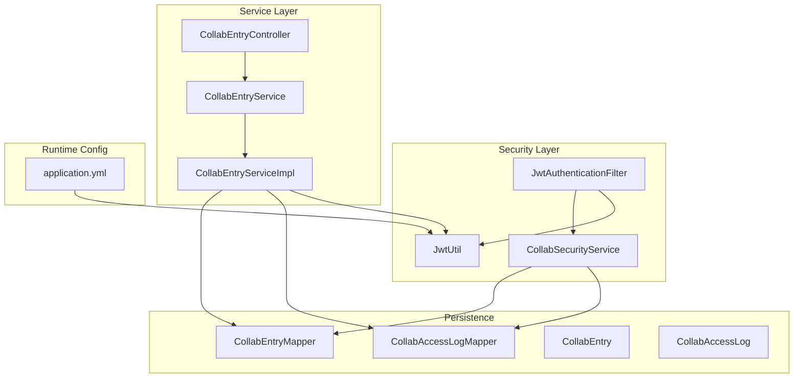
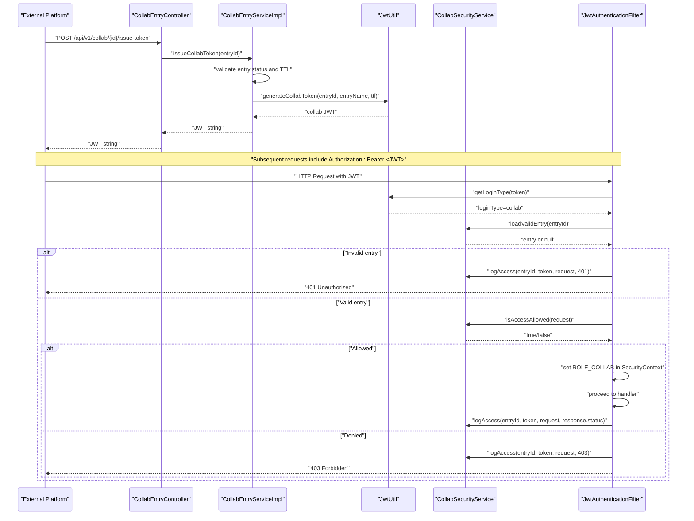
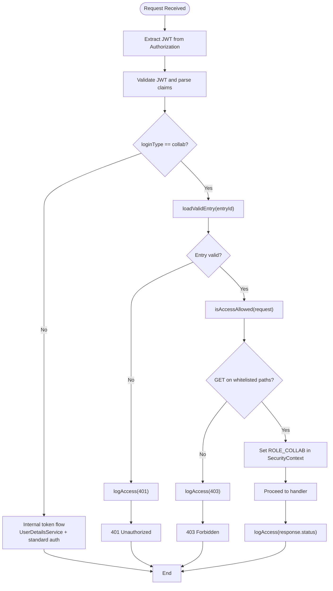
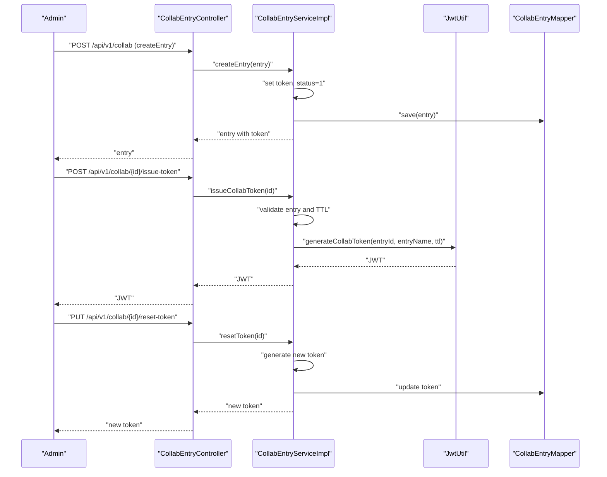
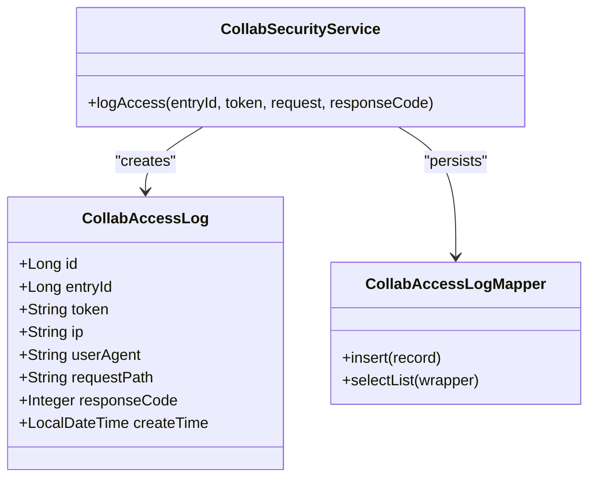
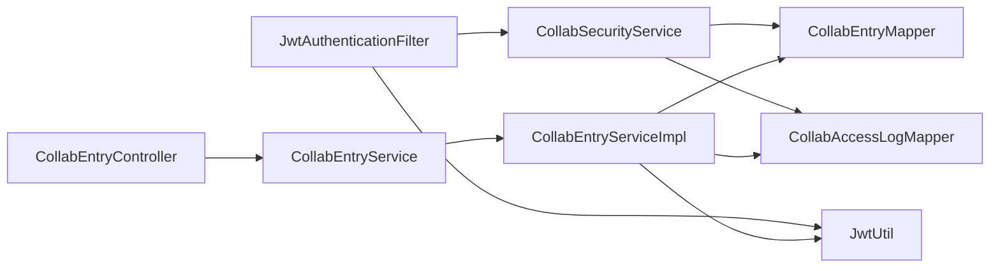

# Collaboration Tokens

<cite>
**Referenced Files in This Document**
- [JwtAuthenticationFilter.java](file://admin-backend/src/main/java/com/qhiot/survey/security/JwtAuthenticationFilter.java)
- [CollabSecurityService.java](file://admin-backend/src/main/java/com/qhiot/survey/security/CollabSecurityService.java)
- [JwtUtil.java](file://admin-backend/src/main/java/com/qhiot/survey/common/util/JwtUtil.java)
- [CollabEntryController.java](file://admin-backend/src/main/java/com/qhiot/survey/controller/CollabEntryController.java)
- [CollabEntryService.java](file://admin-backend/src/main/java/com/qhiot/survey/service/CollabEntryService.java)
- [CollabEntryServiceImpl.java](file://admin-backend/src/main/java/com/qhiot/survey/service/impl/CollabEntryServiceImpl.java)
- [CollabEntry.java](file://admin-backend/src/main/java/com/qhiot/survey/entity/CollabEntry.java)
- [CollabAccessLog.java](file://admin-backend/src/main/java/com/qhiot/survey/entity/CollabAccessLog.java)
- [CollabEntryMapper.java](file://admin-backend/src/main/java/com/qhiot/survey/mapper/CollabEntryMapper.java)
- [CollabAccessLogMapper.java](file://admin-backend/src/main/java/com/qhiot/survey/mapper/CollabAccessLogMapper.java)
- [01-init.sql](file://admin-backend/init-data/01-init.sql)
- [application.yml](file://admin-backend/src/main/resources/application.yml)
- [CollabTokenSecurityTest.java](file://admin-backend/src/test/java/com/qhiot/survey/security/CollabTokenSecurityTest.java)
</cite>

## Table of Contents
1. [Introduction](#introduction)
2. [Project Structure](#project-structure)
3. [Core Components](#core-components)
4. [Architecture Overview](#architecture-overview)
5. [Detailed Component Analysis](#detailed-component-analysis)
6. [Dependency Analysis](#dependency-analysis)
7. [Performance Considerations](#performance-considerations)
8. [Troubleshooting Guide](#troubleshooting-guide)
9. [Conclusion](#conclusion)
10. [Appendices](#appendices)

## Introduction
This document explains the collaboration token system that enables controlled, cross-platform access to survey-related resources. It covers the architecture, entry validation, whitelist-based access restrictions, token lifecycle (creation to expiration), entry management, and access logging. It also compares collaboration tokens with internal tokens, outlines security implications, and describes integration patterns with external platforms and collaborative workflows.

## Project Structure
The collaboration token system spans security filters, services, controllers, persistence, and tests. The backend module organizes these concerns by package:
- security: authentication filter and collaboration-specific security logic
- service and impl: business logic for collaboration entries and token issuance
- controller: REST endpoints for managing collaboration entries and issuing tokens
- entity and mapper: persistence models and MyBatis mappers
- common/util: JWT utilities
- init-data: database schema initialization
- resources: runtime configuration (JWT secrets and expiration)

**Diagram sources**
- [JwtAuthenticationFilter.java:34-81](file://admin-backend/src/main/java/com/qhiot/survey/security/JwtAuthenticationFilter.java#L34-L81)
- [CollabSecurityService.java:23-54](file://admin-backend/src/main/java/com/qhiot/survey/security/CollabSecurityService.java#L23-L54)
- [JwtUtil.java:20-85](file://admin-backend/src/main/java/com/qhiot/survey/common/util/JwtUtil.java#L20-L85)
- [CollabEntryController.java:19-89](file://admin-backend/src/main/java/com/qhiot/survey/controller/CollabEntryController.java#L19-L89)
- [CollabEntryService.java:9-53](file://admin-backend/src/main/java/com/qhiot/survey/service/CollabEntryService.java#L9-L53)
- [CollabEntryServiceImpl.java:25-142](file://admin-backend/src/main/java/com/qhiot/survey/service/impl/CollabEntryServiceImpl.java#L25-L142)
- [CollabEntryMapper.java:1-9](file://admin-backend/src/main/java/com/qhiot/survey/mapper/CollabEntryMapper.java#L1-L9)
- [CollabAccessLogMapper.java:1-12](file://admin-backend/src/main/java/com/qhiot/survey/mapper/CollabAccessLogMapper.java#L1-L12)
- [application.yml:9-13](file://admin-backend/src/main/resources/application.yml#L9-L13)

**Section sources**
- [JwtAuthenticationFilter.java:34-81](file://admin-backend/src/main/java/com/qhiot/survey/security/JwtAuthenticationFilter.java#L34-L81)
- [CollabEntryController.java:19-89](file://admin-backend/src/main/java/com/qhiot/survey/controller/CollabEntryController.java#L19-L89)
- [CollabEntryServiceImpl.java:25-142](file://admin-backend/src/main/java/com/qhiot/survey/service/impl/CollabEntryServiceImpl.java#L25-L142)
- [01-init.sql:213-410](file://admin-backend/init-data/01-init.sql#L213-L410)
- [application.yml:9-13](file://admin-backend/src/main/resources/application.yml#L9-L13)

## Core Components
- JwtAuthenticationFilter: Central filter that detects collaboration tokens (loginType=collab), validates the associated entry, applies whitelist-based access control, sets a dedicated ROLE_COLLAB, and writes access logs.
- CollabSecurityService: Validates collaboration entries (enabled and not expired), enforces whitelist access policy, and logs access attempts.
- CollabEntryController: Manages collaboration entries and issues tokens via dedicated endpoints.
- CollabEntryService/Impl: Implements CRUD for entries, token reset, token issuance with TTL calculation, and access log retrieval.
- JwtUtil: Generates collaboration tokens embedding collabEntryId and loginType=collab, and extracts claims for validation.
- Persistence: CollabEntry and CollabAccessLog entities backed by CollabEntryMapper and CollabAccessLogMapper.
- Tests: CollabTokenSecurityTest validates access policy and filter behavior under various scenarios.

**Section sources**
- [JwtAuthenticationFilter.java:34-122](file://admin-backend/src/main/java/com/qhiot/survey/security/JwtAuthenticationFilter.java#L34-L122)
- [CollabSecurityService.java:23-124](file://admin-backend/src/main/java/com/qhiot/survey/security/CollabSecurityService.java#L23-L124)
- [CollabEntryController.java:19-89](file://admin-backend/src/main/java/com/qhiot/survey/controller/CollabEntryController.java#L19-L89)
- [CollabEntryService.java:9-53](file://admin-backend/src/main/java/com/qhiot/survey/service/CollabEntryService.java#L9-L53)
- [CollabEntryServiceImpl.java:25-142](file://admin-backend/src/main/java/com/qhiot/survey/service/impl/CollabEntryServiceImpl.java#L25-L142)
- [JwtUtil.java:53-85](file://admin-backend/src/main/java/com/qhiot/survey/common/util/JwtUtil.java#L53-L85)
- [CollabEntry.java:10-59](file://admin-backend/src/main/java/com/qhiot/survey/entity/CollabEntry.java#L10-L59)
- [CollabAccessLog.java:11-43](file://admin-backend/src/main/java/com/qhiot/survey/entity/CollabAccessLog.java#L11-L43)
- [CollabTokenSecurityTest.java:30-241](file://admin-backend/src/test/java/com/qhiot/survey/security/CollabTokenSecurityTest.java#L30-L241)

## Architecture Overview
The collaboration token architecture separates internal and collaboration authentication flows while enforcing strict access control for third-party integrations.

**Diagram sources**
- [CollabEntryController.java:83-88](file://admin-backend/src/main/java/com/qhiot/survey/controller/CollabEntryController.java#L83-L88)
- [CollabEntryServiceImpl.java:121-141](file://admin-backend/src/main/java/com/qhiot/survey/service/impl/CollabEntryServiceImpl.java#L121-L141)
- [JwtUtil.java:53-85](file://admin-backend/src/main/java/com/qhiot/survey/common/util/JwtUtil.java#L53-L85)
- [JwtAuthenticationFilter.java:44-122](file://admin-backend/src/main/java/com/qhiot/survey/security/JwtAuthenticationFilter.java#L44-L122)
- [CollabSecurityService.java:36-105](file://admin-backend/src/main/java/com/qhiot/survey/security/CollabSecurityService.java#L36-L105)

## Detailed Component Analysis

### Collaboration Security Policy and Access Control
- Entry validation: Only enabled entries that are not expired are considered valid. Expired or revoked entries cause immediate 401.
- Whitelist access: Collaboration tokens may only access specific GET endpoints for read-only operations. All write operations and sensitive endpoints are denied.
- Role assignment: On successful validation and access, the filter assigns a dedicated ROLE_COLLAB to the principal.
- Logging: Every access attempt is logged, including IP, user-agent, request path, and response code.

**Diagram sources**
- [JwtAuthenticationFilter.java:44-122](file://admin-backend/src/main/java/com/qhiot/survey/security/JwtAuthenticationFilter.java#L44-L122)
- [CollabSecurityService.java:36-105](file://admin-backend/src/main/java/com/qhiot/survey/security/CollabSecurityService.java#L36-L105)
- [CollabSecurityService.java:107-124](file://admin-backend/src/main/java/com/qhiot/survey/security/CollabSecurityService.java#L107-L124)

**Section sources**
- [CollabSecurityService.java:36-105](file://admin-backend/src/main/java/com/qhiot/survey/security/CollabSecurityService.java#L36-L105)
- [JwtAuthenticationFilter.java:83-122](file://admin-backend/src/main/java/com/qhiot/survey/security/JwtAuthenticationFilter.java#L83-L122)
- [CollabTokenSecurityTest.java:80-126](file://admin-backend/src/test/java/com/qhiot/survey/security/CollabTokenSecurityTest.java#L80-L126)

### Token Lifecycle: Creation to Expiration
- Creation: Collaboration entries are created with a generated token and enabled status. They may optionally specify an expiration time.
- Issuance: The system generates a collaboration JWT embedding collabEntryId and loginType=collab. TTL is derived from entry’s expireTime or defaults to 7 days.
- Validation: The filter extracts collabEntryId from the token and validates the entry’s status and expiration.
- Revocation: Entries can be revoked (status=3), invalidating future access attempts even if issued tokens remain unexpired.
- Reset: Tokens can be reset immediately invalidating old tokens and generating new ones.

**Diagram sources**
- [CollabEntryController.java:42-88](file://admin-backend/src/main/java/com/qhiot/survey/controller/CollabEntryController.java#L42-L88)
- [CollabEntryServiceImpl.java:44-141](file://admin-backend/src/main/java/com/qhiot/survey/service/impl/CollabEntryServiceImpl.java#L44-L141)
- [JwtUtil.java:53-85](file://admin-backend/src/main/java/com/qhiot/survey/common/util/JwtUtil.java#L53-L85)
- [CollabEntryMapper.java:1-9](file://admin-backend/src/main/java/com/qhiot/survey/mapper/CollabEntryMapper.java#L1-L9)

**Section sources**
- [CollabEntryServiceImpl.java:44-141](file://admin-backend/src/main/java/com/qhiot/survey/service/impl/CollabEntryServiceImpl.java#L44-L141)
- [CollabEntryController.java:42-88](file://admin-backend/src/main/java/com/qhiot/survey/controller/CollabEntryController.java#L42-L88)
- [JwtUtil.java:53-85](file://admin-backend/src/main/java/com/qhiot/survey/common/util/JwtUtil.java#L53-L85)

### Access Logging and Auditing
- Every access attempt is recorded in collab_access_log with entryId, token, client IP, user-agent, request path, and response code.
- Logs are persisted even on failures (401/403), ensuring comprehensive audit trails.
- Access logs can be retrieved per entry for monitoring and compliance.

**Diagram sources**
- [CollabAccessLog.java:11-43](file://admin-backend/src/main/java/com/qhiot/survey/entity/CollabAccessLog.java#L11-L43)
- [CollabAccessLogMapper.java:1-12](file://admin-backend/src/main/java/com/qhiot/survey/mapper/CollabAccessLogMapper.java#L1-L12)
- [CollabSecurityService.java:107-124](file://admin-backend/src/main/java/com/qhiot/survey/security/CollabSecurityService.java#L107-L124)

**Section sources**
- [CollabSecurityService.java:107-124](file://admin-backend/src/main/java/com/qhiot/survey/security/CollabSecurityService.java#L107-L124)
- [CollabEntryServiceImpl.java:110-119](file://admin-backend/src/main/java/com/qhiot/survey/service/impl/CollabEntryServiceImpl.java#L110-L119)
- [01-init.sql:399-410](file://admin-backend/init-data/01-init.sql#L399-L410)

### Security Implications vs Internal Tokens
- Internal tokens (loginType=internal or missing) follow the standard authentication flow using UserDetailsService and full role/permission sets.
- Collaboration tokens:
  - Are scoped to a specific collaboration entry and validated against entry status and expiration.
  - Are bound to a whitelist of read-only GET endpoints.
  - Carry a dedicated ROLE_COLLAB and no access to administrative or destructive operations.
  - Trigger separate audit logs distinct from internal operation logs.
- Endpoint restrictions: Collaboration tokens are denied access to audit approvals, exports, user/role/system management, dictionaries, and health actuator endpoints.

**Section sources**
- [JwtAuthenticationFilter.java:24-33](file://admin-backend/src/main/java/com/qhiot/survey/security/JwtAuthenticationFilter.java#L24-L33)
- [CollabSecurityService.java:56-105](file://admin-backend/src/main/java/com/qhiot/survey/security/CollabSecurityService.java#L56-L105)
- [CollabTokenSecurityTest.java:91-126](file://admin-backend/src/test/java/com/qhiot/survey/security/CollabTokenSecurityTest.java#L91-L126)

### Examples and Workflows

- Example: Generate a collaboration token
  - Admin calls POST /api/v1/collab/{id}/issue-token to obtain a JWT with loginType=collab and embedded collabEntryId.
  - The token’s TTL is derived from the entry’s expireTime or defaults to 7 days.

- Example: Validate a collaboration token on a whitelisted endpoint
  - External platform sends Authorization: Bearer <JWT> to GET /api/v1/point/list.
  - Filter validates token, checks entry validity, enforces whitelist policy, sets ROLE_COLLAB, and proceeds.

- Example: Attempt access to a restricted endpoint
  - External platform tries POST /api/v1/audit/pass with a collaboration token.
  - Filter denies access (403), logs the attempt, and does not invoke UserDetailsService.

- Example: Entry revocation
  - Admin revokes an entry (status=3).
  - Any subsequent access attempts with tokens tied to that entry return 401 and are logged.

- Example: Token reset
  - Admin resets the token for an entry.
  - Old token becomes invalid immediately; new token is returned for future use.

**Section sources**
- [CollabEntryController.java:56-88](file://admin-backend/src/main/java/com/qhiot/survey/controller/CollabEntryController.java#L56-L88)
- [CollabEntryServiceImpl.java:66-89](file://admin-backend/src/main/java/com/qhiot/survey/service/impl/CollabEntryServiceImpl.java#L66-L89)
- [JwtAuthenticationFilter.java:83-122](file://admin-backend/src/main/java/com/qhiot/survey/security/JwtAuthenticationFilter.java#L83-L122)
- [CollabTokenSecurityTest.java:132-214](file://admin-backend/src/test/java/com/qhiot/survey/security/CollabTokenSecurityTest.java#L132-L214)

### Integration Patterns and Collaborative Workflow Management
- External platforms receive a single-use or short-lived collaboration JWT from the admin backend.
- Platforms embed the JWT in Authorization headers for read-only queries against whitelisted endpoints.
- Administrators manage collaboration entries, set expirations, revoke access, and reset tokens as needed.
- Access logs enable security monitoring and incident response by correlating entryId, IP, and request paths.

**Section sources**
- [CollabEntryController.java:19-89](file://admin-backend/src/main/java/com/qhiot/survey/controller/CollabEntryController.java#L19-L89)
- [CollabEntryServiceImpl.java:110-119](file://admin-backend/src/main/java/com/qhiot/survey/service/impl/CollabEntryServiceImpl.java#L110-L119)
- [01-init.sql:213-410](file://admin-backend/init-data/01-init.sql#L213-L410)

## Dependency Analysis
The collaboration token system exhibits low coupling and clear separation of concerns:
- JwtAuthenticationFilter depends on JwtUtil for token parsing and CollabSecurityService for validation and access control.
- CollabSecurityService depends on CollabEntryMapper and CollabAccessLogMapper for persistence.
- CollabEntryServiceImpl orchestrates business logic, token generation, and access log retrieval.
- Controllers expose management APIs for collaboration entries and token issuance.

**Diagram sources**
- [JwtAuthenticationFilter.java:39-41](file://admin-backend/src/main/java/com/qhiot/survey/security/JwtAuthenticationFilter.java#L39-L41)
- [CollabSecurityService.java:33-34](file://admin-backend/src/main/java/com/qhiot/survey/security/CollabSecurityService.java#L33-L34)
- [CollabEntryServiceImpl.java:28-32](file://admin-backend/src/main/java/com/qhiot/survey/service/impl/CollabEntryServiceImpl.java#L28-L32)
- [CollabEntryController.java:24-25](file://admin-backend/src/main/java/com/qhiot/survey/controller/CollabEntryController.java#L24-L25)

**Section sources**
- [JwtAuthenticationFilter.java:39-41](file://admin-backend/src/main/java/com/qhiot/survey/security/JwtAuthenticationFilter.java#L39-L41)
- [CollabSecurityService.java:33-34](file://admin-backend/src/main/java/com/qhiot/survey/security/CollabSecurityService.java#L33-L34)
- [CollabEntryServiceImpl.java:28-32](file://admin-backend/src/main/java/com/qhiot/survey/service/impl/CollabEntryServiceImpl.java#L28-L32)
- [CollabEntryController.java:24-25](file://admin-backend/src/main/java/com/qhiot/survey/controller/CollabEntryController.java#L24-L25)

## Performance Considerations
- Token validation is lightweight and relies on claim extraction and in-memory checks; database reads occur only for entry lookup and access log insertion.
- Access log writes are best-effort and wrapped in try/catch to avoid impacting request processing latency.
- Indexes on collab_entry.token and collab_access_log entry_id improve query performance for lookups and audits.

**Section sources**
- [CollabSecurityService.java:107-124](file://admin-backend/src/main/java/com/qhiot/survey/security/CollabSecurityService.java#L107-L124)
- [01-init.sql:227-228](file://admin-backend/init-data/01-init.sql#L227-L228)
- [01-init.sql:408-409](file://admin-backend/init-data/01-init.sql#L408-L409)

## Troubleshooting Guide
- 401 Unauthorized on collaboration token:
  - Indicates the entry does not exist, is not enabled, or has expired. Verify entry status and expiration.
- 403 Forbidden on collaboration token:
  - The requested endpoint is not whitelisted or the HTTP method is not allowed. Confirm the endpoint is a GET on a whitelisted path.
- No internal UserDetailsService invocation:
  - Confirms the token was processed as a collaboration token. Internal tokens would trigger UserDetailsService.
- Access logs not appearing:
  - Check collab_access_log persistence and ensure no exceptions occurred during log insertion.

**Section sources**
- [JwtAuthenticationFilter.java:83-122](file://admin-backend/src/main/java/com/qhiot/survey/security/JwtAuthenticationFilter.java#L83-L122)
- [CollabSecurityService.java:107-124](file://admin-backend/src/main/java/com/qhiot/survey/security/CollabSecurityService.java#L107-L124)
- [CollabTokenSecurityTest.java:132-214](file://admin-backend/src/test/java/com/qhiot/survey/security/CollabTokenSecurityTest.java#L132-L214)

## Conclusion
The collaboration token system provides a secure, auditable mechanism for granting read-only access to specific endpoints across platforms. By binding tokens to validated collaboration entries, enforcing a strict whitelist, and recording every access attempt, the system minimizes risk while enabling flexible integrations. Administrators retain full control over lifecycle events (create, revoke, reset), and robust logging supports ongoing monitoring and compliance.

## Appendices

### Database Schema Notes
- collab_entry: stores entry metadata, token, permissions, and lifecycle fields.
- collab_access_log: records access attempts for auditing.

**Section sources**
- [01-init.sql:213-229](file://admin-backend/init-data/01-init.sql#L213-L229)
- [01-init.sql:399-410](file://admin-backend/init-data/01-init.sql#L399-L410)

### Runtime Configuration
- JWT secret and expiration are configured via application.yml and injected into JwtUtil.

**Section sources**
- [application.yml:9-13](file://admin-backend/src/main/resources/application.yml#L9-L13)
- [JwtUtil.java:22-29](file://admin-backend/src/main/java/com/qhiot/survey/common/util/JwtUtil.java#L22-L29)