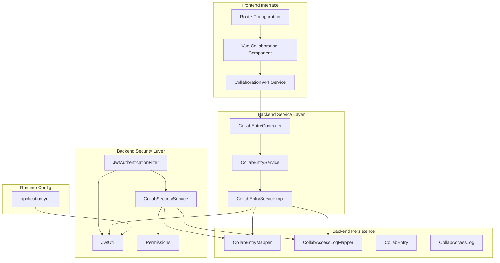
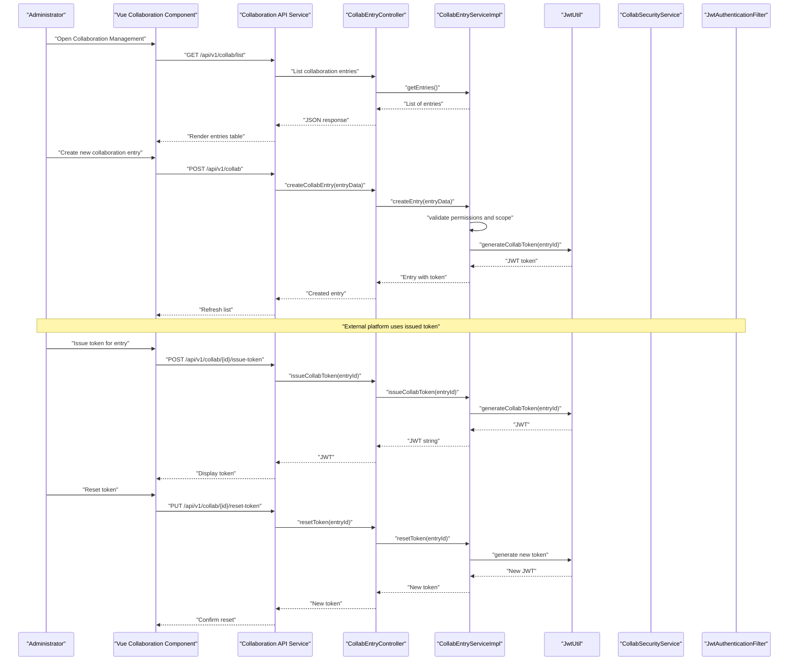
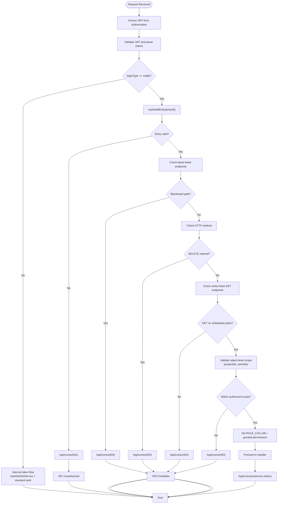
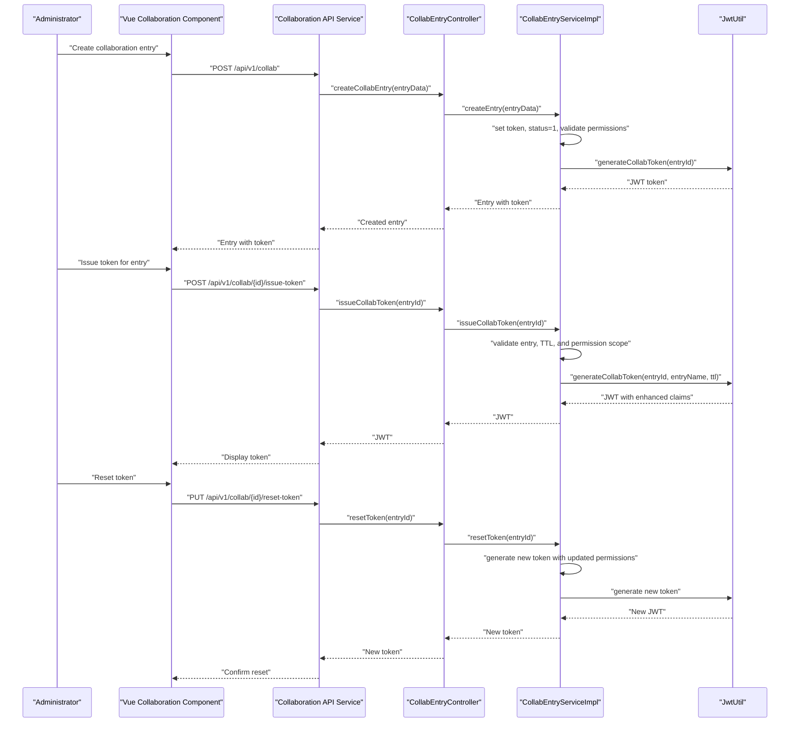
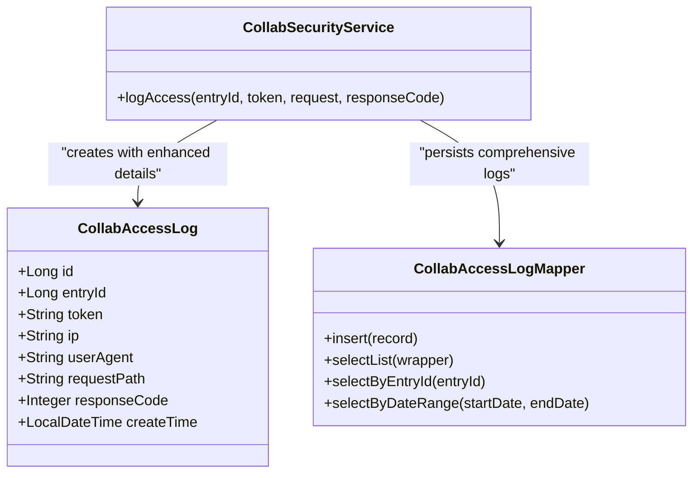
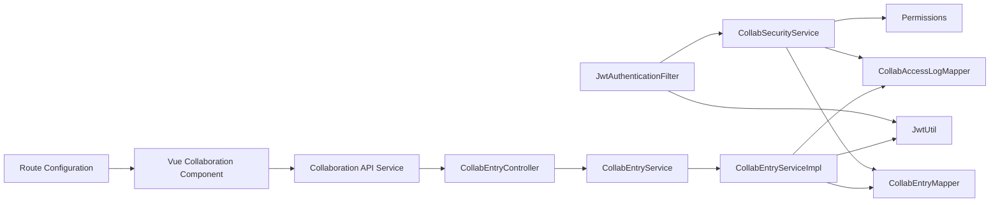

# Collaboration Tokens

<cite>
**Referenced Files in This Document**
- [index.vue](file://admin-web-soybean/src/views/system/collab/index.vue)
- [collab.ts](file://admin-web-soybean/src/service/api/collab.ts)
- [builtin.ts](file://admin-web-soybean/src/router/routes/builtin.ts)
- [JwtAuthenticationFilter.java](file://admin-backend/src/main/java/com/qhiot/survey/security/JwtAuthenticationFilter.java)
- [CollabSecurityService.java](file://admin-backend/src/main/java/com/qhiot/survey/security/CollabSecurityService.java)
- [JwtUtil.java](file://admin-backend/src/main/java/com/qhiot/survey/common/util/JwtUtil.java)
- [CollabEntryController.java](file://admin-backend/src/main/java/com/qhiot/survey/controller/CollabEntryController.java)
- [CollabEntryService.java](file://admin-backend/src/main/java/com/qhiot/survey/service/CollabEntryService.java)
- [CollabEntryServiceImpl.java](file://admin-backend/src/main/java/com/qhiot/survey/service/impl/CollabEntryServiceImpl.java)
- [CollabEntry.java](file://admin-backend/src/main/java/com/qhiot/survey/entity/CollabEntry.java)
- [CollabAccessLog.java](file://admin-backend/src/main/java/com/qhiot/survey/entity/CollabAccessLog.java)
- [CollabEntryMapper.java](file://admin-backend/src/main/java/com/qhiot/survey/mapper/CollabEntryMapper.java)
- [CollabAccessLogMapper.java](file://admin-backend/src/main/java/com/qhiot/survey/mapper/CollabAccessLogMapper.java)
- [Permissions.java](file://admin-backend/src/main/java/com/qhiot/survey/common/constant/Permissions.java)
- [01-init.sql](file://admin-backend/init-data/01-init.sql)
- [application.yml](file://admin-backend/src/main/resources/application.yml)
- [CollabTokenSecurityTest.java](file://admin-backend/src/test/java/com/qhiot/survey/security/CollabTokenSecurityTest.java)
</cite>

## Update Summary
**Changes Made**
- Added frontend Vue component for collaboration token management interface
- Integrated frontend API service for collaboration token operations
- Added routing configuration for collaboration management UI
- Enhanced collaboration access management with comprehensive frontend/backend integration

## Table of Contents
1. [Introduction](#introduction)
2. [Project Structure](#project-structure)
3. [Core Components](#core-components)
4. [Architecture Overview](#architecture-overview)
5. [Detailed Component Analysis](#detailed-component-analysis)
6. [Frontend Integration](#frontend-integration)
7. [Dependency Analysis](#dependency-analysis)
8. [Performance Considerations](#performance-considerations)
9. [Troubleshooting Guide](#troubleshooting-guide)
10. [Conclusion](#conclusion)
11. [Appendices](#appendices)

## Introduction
This document explains the enhanced collaboration token system that enables controlled, cross-platform access to survey-related resources with comprehensive security policies. The system now features white-list based access control, collaborative token support, detailed access logging for third-party collaborators, and a complete frontend management interface. The architecture provides robust security controls with explicit endpoint restrictions, object-level scope enforcement, comprehensive audit trails, and user-friendly administration capabilities for monitoring collaboration activities across external platforms.

## Project Structure
The collaboration token system spans security filters, services, controllers, persistence, frontend components, and tests. The backend module organizes these concerns by package:
- security: authentication filter and enhanced collaboration-specific security logic with white-list access control
- service and impl: business logic for collaboration entries and token issuance with permission validation
- controller: REST endpoints for managing collaboration entries and issuing tokens
- entity and mapper: persistence models and MyBatis mappers
- common/util: JWT utilities with enhanced token generation
- common/constant: permission code definitions for granular access control
- init-data: database schema initialization
- resources: runtime configuration (JWT secrets and expiration)
- frontend: Vue component with API service and routing for collaboration management

**Diagram sources**
- [index.vue](file://admin-web-soybean/src/views/system/collab/index.vue)
- [collab.ts](file://admin-web-soybean/src/service/api/collab.ts)
- [builtin.ts](file://admin-web-soybean/src/router/routes/builtin.ts)
- [JwtAuthenticationFilter.java](file://admin-backend/src/main/java/com/qhiot/survey/security/JwtAuthenticationFilter.java)
- [CollabSecurityService.java](file://admin-backend/src/main/java/com/qhiot/survey/security/CollabSecurityService.java)
- [JwtUtil.java](file://admin-backend/src/main/java/com/qhiot/survey/common/util/JwtUtil.java)
- [CollabEntryController.java](file://admin-backend/src/main/java/com/qhiot/survey/controller/CollabEntryController.java)
- [CollabEntryServiceImpl.java](file://admin-backend/src/main/java/com/qhiot/survey/service/impl/CollabEntryServiceImpl.java)

**Section sources**
- [index.vue](file://admin-web-soybean/src/views/system/collab/index.vue)
- [collab.ts](file://admin-web-soybean/src/service/api/collab.ts)
- [builtin.ts](file://admin-web-soybean/src/router/routes/builtin.ts)
- [JwtAuthenticationFilter.java](file://admin-backend/src/main/java/com/qhiot/survey/security/JwtAuthenticationFilter.java)
- [CollabEntryController.java](file://admin-backend/src/main/java/com/qhiot/survey/controller/CollabEntryController.java)
- [CollabEntryServiceImpl.java](file://admin-backend/src/main/java/com/qhiot/survey/service/impl/CollabEntryServiceImpl.java)

## Core Components
- **JwtAuthenticationFilter**: Central filter that detects collaboration tokens (loginType=collab), validates the associated entry, applies white-list/blacklist access control with object-level scope enforcement, sets a dedicated ROLE_COLLAB, and writes comprehensive access logs.
- **CollabSecurityService**: Validates collaboration entries (enabled and not expired), enforces comprehensive access policies including whitelist/blacklist and object-level permissions, and logs detailed access attempts with audit trails.
- **CollabEntryController**: Manages collaboration entries and issues tokens via dedicated endpoints with enhanced validation.
- **CollabEntryService/Impl**: Implements CRUD for entries, token reset, token issuance with TTL calculation, and comprehensive access log retrieval with filtering capabilities.
- **JwtUtil**: Generates collaboration tokens embedding collabEntryId and loginType=collab, and extracts claims for validation.
- **Permissions**: Defines granular permission codes (project:view, point:view, audit:view, etc.) for fine-grained access control.
- **Persistence**: CollabEntry and CollabAccessLog entities backed by CollabEntryMapper and CollabAccessLogMapper with enhanced indexing for performance.
- **Vue Collaboration Component**: Frontend interface for managing collaboration tokens with real-time data binding, form validation, and responsive design.
- **Collaboration API Service**: Frontend service layer handling HTTP requests to collaboration endpoints with error handling and data transformation.
- **Route Configuration**: Navigation setup for collaboration management interface with proper authentication guards.
- **Tests**: CollabTokenSecurityTest validates access policy enforcement, object-level scope restrictions, and comprehensive filter behavior under various scenarios.

**Section sources**
- [JwtAuthenticationFilter.java](file://admin-backend/src/main/java/com/qhiot/survey/security/JwtAuthenticationFilter.java)
- [CollabSecurityService.java](file://admin-backend/src/main/java/com/qhiot/survey/security/CollabSecurityService.java)
- [CollabEntryController.java](file://admin-backend/src/main/java/com/qhiot/survey/controller/CollabEntryController.java)
- [CollabEntryService.java](file://admin-backend/src/main/java/com/qhiot/survey/service/CollabEntryService.java)
- [CollabEntryServiceImpl.java](file://admin-backend/src/main/java/com/qhiot/survey/service/impl/CollabEntryServiceImpl.java)
- [JwtUtil.java](file://admin-backend/src/main/java/com/qhiot/survey/common/util/JwtUtil.java)
- [Permissions.java](file://admin-backend/src/main/java/com/qhiot/survey/common/constant/Permissions.java)
- [index.vue](file://admin-web-soybean/src/views/system/collab/index.vue)
- [collab.ts](file://admin-web-soybean/src/service/api/collab.ts)
- [builtin.ts](file://admin-web-soybean/src/router/routes/builtin.ts)

## Architecture Overview
The enhanced collaboration token architecture now features comprehensive security policies with white-list based access control for third-party integrations, including object-level scope enforcement, detailed audit logging, and a complete frontend management interface.

**Diagram sources**
- [index.vue](file://admin-web-soybean/src/views/system/collab/index.vue)
- [collab.ts](file://admin-web-soybean/src/service/api/collab.ts)
- [CollabEntryController.java](file://admin-backend/src/main/java/com/qhiot/survey/controller/CollabEntryController.java)
- [CollabEntryServiceImpl.java](file://admin-backend/src/main/java/com/qhiot/survey/service/impl/CollabEntryServiceImpl.java)
- [JwtUtil.java](file://admin-backend/src/main/java/com/qhiot/survey/common/util/JwtUtil.java)

## Detailed Component Analysis

### Enhanced White-List Based Access Control System
The collaboration security service now implements comprehensive access control policies with explicit white-list and black-list enforcement:

- **Entry validation**: Only enabled entries that are not expired are considered valid. Expired or revoked entries cause immediate 401 responses.
- **Black-list enforcement**: Explicitly blocks sensitive operations including audit processing, deletion operations, bulk exports, user/role/system management, dictionaries, and actuator endpoints.
- **White-list enforcement**: Only allows GET requests to specific read-only endpoints for point, result, template, project, section, file, and health services.
- **Method restriction**: All non-GET methods are blocked regardless of endpoint, ensuring write operations are prevented.
- **Object-level scope enforcement**: Validates access against authorized project IDs and point IDs defined in the collaboration entry.
- **Permission-based access control**: Supports granular permissions including project:view, point:view, template:view, and audit:view capabilities.
- **Role assignment**: On successful validation, assigns ROLE_COLLAB with granted permission codes to the security context.
- **Enhanced logging**: Every access attempt is logged with detailed information including IP, user-agent, request path, response code, and authorization scope.

**Diagram sources**
- [JwtAuthenticationFilter.java](file://admin-backend/src/main/java/com/qhiot/survey/security/JwtAuthenticationFilter.java)
- [CollabSecurityService.java](file://admin-backend/src/main/java/com/qhiot/survey/security/CollabSecurityService.java)

**Section sources**
- [CollabSecurityService.java](file://admin-backend/src/main/java/com/qhiot/survey/security/CollabSecurityService.java)
- [JwtAuthenticationFilter.java](file://admin-backend/src/main/java/com/qhiot/survey/security/JwtAuthenticationFilter.java)

### Token Lifecycle: Enhanced Creation to Expiration
The token lifecycle now includes enhanced validation and permission management:

- **Creation**: Collaboration entries are created with generated token, enabled status, and comprehensive permission configuration including project IDs, point IDs, and permission scopes.
- **Enhanced issuance**: The system generates a collaboration JWT embedding collabEntryId and loginType=collab with TTL derived from entry's expireTime or default 7 days.
- **Advanced validation**: The filter extracts collabEntryId from the token and validates entry status, expiration, and permission scope.
- **Revocation**: Entries can be revoked (status=3), invalidating future access attempts even with unexpired tokens.
- **Reset**: Tokens can be reset immediately invalidating old tokens and generating new ones with updated permissions.

**Diagram sources**
- [index.vue](file://admin-web-soybean/src/views/system/collab/index.vue)
- [collab.ts](file://admin-web-soybean/src/service/api/collab.ts)
- [CollabEntryController.java](file://admin-backend/src/main/java/com/qhiot/survey/controller/CollabEntryController.java)
- [CollabEntryServiceImpl.java](file://admin-backend/src/main/java/com/qhiot/survey/service/impl/CollabEntryServiceImpl.java)
- [JwtUtil.java](file://admin-backend/src/main/java/com/qhiot/survey/common/util/JwtUtil.java)

**Section sources**
- [CollabEntryServiceImpl.java](file://admin-backend/src/main/java/com/qhiot/survey/service/impl/CollabEntryServiceImpl.java)
- [CollabEntryController.java](file://admin-backend/src/main/java/com/qhiot/survey/controller/CollabEntryController.java)
- [JwtUtil.java](file://admin-backend/src/main/java/com/qhiot/survey/common/util/JwtUtil.java)

### Comprehensive Access Logging and Advanced Auditing
The access logging system now provides detailed audit trails with enhanced information capture:

- **Detailed logging**: Every access attempt is recorded in collab_access_log with entryId, token, client IP, user-agent, request path, response code, and timestamp.
- **Comprehensive audit trail**: Logs include permission validation results, object-level scope checks, and access policy decisions.
- **Enhanced persistence**: Logs are persisted even on failures (401/403), ensuring complete audit coverage for security monitoring.
- **Advanced querying**: Access logs support filtering by entryId, date ranges, response codes, and authorization outcomes for compliance reporting.

**Diagram sources**
- [CollabAccessLog.java](file://admin-backend/src/main/java/com/qhiot/survey/entity/CollabAccessLog.java)
- [CollabAccessLogMapper.java](file://admin-backend/src/main/java/com/qhiot/survey/mapper/CollabAccessLogMapper.java)
- [CollabSecurityService.java](file://admin-backend/src/main/java/com/qhiot/survey/security/CollabSecurityService.java)

**Section sources**
- [CollabSecurityService.java](file://admin-backend/src/main/java/com/qhiot/survey/security/CollabSecurityService.java)
- [CollabEntryServiceImpl.java](file://admin-backend/src/main/java/com/qhiot/survey/service/impl/CollabEntryServiceImpl.java)

### Security Implications vs Internal Tokens
The enhanced collaboration token system provides significantly stronger security controls compared to internal tokens:

- **Internal tokens** (loginType=internal or missing): Follow standard authentication flow using UserDetailsService and provide full role/permission sets for administrative access.
- **Enhanced collaboration tokens**:
  - Scoped to specific collaboration entries with comprehensive validation against entry status, expiration, and permission scope.
  - Enforce strict white-list/black-list policies with object-level scope restrictions for projects and points.
  - Carry dedicated ROLE_COLLAB with limited access to read-only operations only.
  - Trigger comprehensive audit logs with detailed permission validation results.
  - Support granular permission definitions including project:view, point:view, template:view, and audit:view capabilities.
- **Enhanced endpoint restrictions**: Collaboration tokens are denied access to all administrative operations, exports, user/role/system management, dictionaries, health actuator endpoints, and any write operations.

**Section sources**
- [JwtAuthenticationFilter.java](file://admin-backend/src/main/java/com/qhiot/survey/security/JwtAuthenticationFilter.java)
- [CollabSecurityService.java](file://admin-backend/src/main/java/com/qhiot/survey/security/CollabSecurityService.java)

### Examples and Enhanced Workflows

- **Example**: Generate an enhanced collaboration token with comprehensive permissions
  - Administrator creates collaboration entry with projectIds="[100,101]", pointIds="[200,201]", and permissions='["project:view","point:view","audit:view"]'
  - Administrator uses Vue interface to issue token, which calls POST /api/v1/collab/{id}/issue-token to obtain JWT with loginType=collab and embedded collabEntryId
  - Token's TTL derived from entry's expireTime or defaults to 7 days with enhanced permission validation

- **Example**: Validate collaboration token with object-level scope enforcement
  - External platform sends Authorization: Bearer <JWT> to GET /api/v1/project/100
  - Filter validates token, checks entry validity, enforces white-list policy, validates project ID scope (100), sets ROLE_COLLAB, and proceeds

- **Example**: Attempt access to unauthorized scope
  - External platform tries GET /api/v1/project/999 with token authorized only for project 100
  - Filter denies access (403) due to object-level scope violation, logs the attempt with scope validation details

- **Example**: Write operation blocked despite whitelisted endpoint
  - External platform tries POST /api/v1/point with token authorized to GET only
  - Filter denies access (403) due to method restriction, logs the attempt with policy decision details

- **Example**: Entry revocation with immediate effect
  - Administrator revokes collaboration entry (status=3)
  - Any subsequent access attempts with tokens tied to that entry return 401 with detailed revocation logging

- **Example**: Token reset with updated permissions
  - Administrator resets token for entry with updated project scope
  - Old token becomes invalid immediately; new token reflects updated permissions for future use

**Section sources**
- [CollabEntryController.java](file://admin-backend/src/main/java/com/qhiot/survey/controller/CollabEntryController.java)
- [CollabEntryServiceImpl.java](file://admin-backend/src/main/java/com/qhiot/survey/service/impl/CollabEntryServiceImpl.java)
- [JwtAuthenticationFilter.java](file://admin-backend/src/main/java/com/qhiot/survey/security/JwtAuthenticationFilter.java)

### Integration Patterns and Advanced Collaborative Workflow Management
The enhanced collaboration system supports sophisticated integration patterns with comprehensive security controls:

- **External platforms** receive collaboration JWTs with comprehensive permission scopes from the admin backend
- **Scoped access** enables platforms to access specific projects and points defined in the collaboration entry
- **Granular permissions** allow fine-tuned control over read operations including projects, points, results, templates, and audit data
- **Administrators** manage collaboration entries with detailed permission configurations, set expirations, revoke access, and reset tokens as needed
- **Advanced monitoring** through comprehensive access logs enables security monitoring, compliance reporting, and incident response by correlating entryId, IP, request paths, and authorization outcomes
- **Audit compliance** with detailed logging of permission validations, scope enforcement, and access decisions for regulatory requirements
- **Frontend management** through Vue component provides intuitive interface for creating, managing, and monitoring collaboration tokens with real-time feedback

**Section sources**
- [CollabEntryController.java](file://admin-backend/src/main/java/com/qhiot/survey/controller/CollabEntryController.java)
- [CollabEntryServiceImpl.java](file://admin-backend/src/main/java/com/qhiot/survey/service/impl/CollabEntryServiceImpl.java)
- [index.vue](file://admin-web-soybean/src/views/system/collab/index.vue)

## Frontend Integration

### Vue Collaboration Component
The new Vue component provides a comprehensive interface for managing collaboration tokens with modern web development practices:

- **Real-time data binding**: Reactive forms for creating and editing collaboration entries with automatic validation
- **Responsive design**: Mobile-first layout supporting various screen sizes and devices
- **Form validation**: Client-side validation for required fields, permission formats, and scope constraints
- **Error handling**: Comprehensive error messages and user feedback for failed operations
- **Loading states**: Progress indicators and disabled states during API operations
- **Table interface**: Grid view for displaying collaboration entries with sorting, filtering, and pagination
- **Action buttons**: Create, edit, delete, issue token, and reset token actions with appropriate permissions

### Collaboration API Service
The frontend service layer handles all communication with the backend collaboration endpoints:

- **HTTP client integration**: Axios-based service with proper error handling and response transformation
- **Endpoint abstraction**: Clean API methods for all collaboration operations (list, create, update, delete, issue token, reset token)
- **Data transformation**: Converts between frontend data structures and backend API formats
- **Authentication integration**: Automatically includes JWT tokens in requests when available
- **Error propagation**: Proper error handling and user-friendly error messages
- **Loading state management**: Tracks request status for UI feedback

### Route Configuration
The routing system provides seamless navigation to the collaboration management interface:

- **Protected routes**: Authentication guards prevent access without proper credentials
- **Navigation integration**: Menu items and breadcrumbs for easy access to collaboration management
- **Lazy loading**: Component lazy loading for improved performance
- **Route parameters**: Support for viewing specific collaboration entries and their associated tokens

**Section sources**
- [index.vue](file://admin-web-soybean/src/views/system/collab/index.vue)
- [collab.ts](file://admin-web-soybean/src/service/api/collab.ts)
- [builtin.ts](file://admin-web-soybean/src/router/routes/builtin.ts)

## Dependency Analysis
The enhanced collaboration token system maintains low coupling with improved separation of concerns:
- JwtAuthenticationFilter depends on JwtUtil for token parsing and CollabSecurityService for comprehensive validation and access control.
- CollabSecurityService depends on CollabEntryMapper and CollabAccessLogMapper for enhanced persistence with detailed audit logging.
- CollabEntryServiceImpl orchestrates business logic, enhanced token generation with permission validation, and comprehensive access log retrieval.
- Controllers expose management APIs for collaboration entries with enhanced validation and token issuance.
- Vue Collaboration Component integrates with Collaboration API Service for frontend-backend communication.
- Collaboration API Service depends on HTTP client configuration and authentication state management.
- Route configuration manages navigation and access control for the collaboration management interface.

**Diagram sources**
- [JwtAuthenticationFilter.java](file://admin-backend/src/main/java/com/qhiot/survey/security/JwtAuthenticationFilter.java)
- [CollabSecurityService.java](file://admin-backend/src/main/java/com/qhiot/survey/security/CollabSecurityService.java)
- [CollabEntryServiceImpl.java](file://admin-backend/src/main/java/com/qhiot/survey/service/impl/CollabEntryServiceImpl.java)
- [CollabEntryController.java](file://admin-backend/src/main/java/com/qhiot/survey/controller/CollabEntryController.java)
- [index.vue](file://admin-web-soybean/src/views/system/collab/index.vue)
- [collab.ts](file://admin-web-soybean/src/service/api/collab.ts)
- [builtin.ts](file://admin-web-soybean/src/router/routes/builtin.ts)

**Section sources**
- [JwtAuthenticationFilter.java](file://admin-backend/src/main/java/com/qhiot/survey/security/JwtAuthenticationFilter.java)
- [CollabSecurityService.java](file://admin-backend/src/main/java/com/qhiot/survey/security/CollabSecurityService.java)
- [CollabEntryServiceImpl.java](file://admin-backend/src/main/java/com/qhiot/survey/service/impl/CollabEntryServiceImpl.java)
- [CollabEntryController.java](file://admin-backend/src/main/java/com/qhiot/survey/controller/CollabEntryController.java)
- [index.vue](file://admin-web-soybean/src/views/system/collab/index.vue)
- [collab.ts](file://admin-web-soybean/src/service/api/collab.ts)
- [builtin.ts](file://admin-web-soybean/src/router/routes/builtin.ts)

## Performance Considerations
The enhanced collaboration token system maintains optimal performance with additional security features:
- Token validation remains lightweight relying on claim extraction and in-memory checks with enhanced permission validation; database reads occur only for entry lookup and comprehensive access log insertion.
- Access log writes are best-effort with enhanced error handling and wrapped in try/catch blocks to avoid impacting request processing latency.
- Enhanced indexing on collab_entry.token, collab_access_log entry_id, and collab_access_log authorization_scope improves query performance for lookups, audits, and scope validation.
- Permission validation occurs efficiently using JSON-based permission storage with optimized lookup algorithms.
- Frontend component optimization through lazy loading, efficient rendering, and minimal re-renders for improved user experience.
- API service caching strategies for frequently accessed collaboration data to reduce server load.

**Section sources**
- [CollabSecurityService.java](file://admin-backend/src/main/java/com/qhiot/survey/security/CollabSecurityService.java)
- [index.vue](file://admin-web-soybean/src/views/system/collab/index.vue)
- [collab.ts](file://admin-web-soybean/src/service/api/collab.ts)

## Troubleshooting Guide
Enhanced troubleshooting guidance for the improved collaboration token system:

- **401 Unauthorized on collaboration token**:
  - Indicates entry does not exist, is not enabled, has expired, or has been revoked. Verify entry status, expiration, and revocation status.
- **403 Forbidden on collaboration token**:
  - Multiple possible causes: requested endpoint not whitelisted, HTTP method not allowed, object-level scope violation, or permission validation failure. Check endpoint whitelist, method restrictions, and authorization scope.
- **No internal UserDetailsService invocation**:
  - Confirms token processed as collaboration token. Internal tokens would trigger UserDetailsService. Collaboration tokens bypass standard authentication flow.
- **Access logs not appearing**:
  - Check collab_access_log persistence, ensure no exceptions occurred during log insertion, verify enhanced logging configuration.
- **Permission validation errors**:
  - Verify collaboration entry contains proper JSON-encoded permissions array, check projectIds and pointIds arrays match expected formats, ensure permission strings follow required format.
- **Scope enforcement issues**:
  - Confirm object-level scope arrays (projectIds, pointIds) contain correct identifiers, verify parameter-based scope validation for list endpoints, check URI pattern matching for scope enforcement.
- **Frontend component not loading**:
  - Check Vue component compilation, verify API service connectivity, ensure proper route configuration, confirm authentication state.
- **API service errors**:
  - Verify backend endpoint availability, check network connectivity, ensure proper error handling, confirm JWT token validity.
- **Route access issues**:
  - Check authentication guards, verify user permissions, ensure proper route configuration, confirm navigation setup.

**Section sources**
- [JwtAuthenticationFilter.java](file://admin-backend/src/main/java/com/qhiot/survey/security/JwtAuthenticationFilter.java)
- [CollabSecurityService.java](file://admin-backend/src/main/java/com/qhiot/survey/security/CollabSecurityService.java)
- [index.vue](file://admin-web-soybean/src/views/system/collab/index.vue)
- [collab.ts](file://admin-web-soybean/src/service/api/collab.ts)
- [builtin.ts](file://admin-web-soybean/src/router/routes/builtin.ts)

## Conclusion
The enhanced collaboration token system provides a robust, auditable mechanism for granting controlled access to specific survey resources across platforms. With comprehensive white-list based access control policies, object-level scope restrictions, detailed audit logging, and a complete frontend management interface, the system significantly strengthens security while enabling flexible integrations. The enhanced permission model allows fine-grained control over read operations, administrators retain full control over lifecycle events with comprehensive logging, the advanced audit capabilities support ongoing monitoring, compliance, and security incident response, and the frontend Vue component provides an intuitive user experience for managing collaboration tokens effectively.

## Appendices

### Database Schema Notes
- **collab_entry**: stores entry metadata, token, comprehensive permissions, project scope, point scope, and lifecycle fields with enhanced permission validation.
- **collab_access_log**: records detailed access attempts with authorization scope validation and permission decision logs for comprehensive auditing.

**Section sources**
- [01-init.sql](file://admin-backend/init-data/01-init.sql)
- [01-init.sql](file://admin-backend/init-data/01-init.sql)

### Runtime Configuration
- JWT secret and expiration configured via application.yml and injected into JwtUtil for enhanced token generation.
- Enhanced security policies configured through CollabSecurityService with comprehensive access control rules.
- Frontend API service configuration supports environment-specific backend URLs and authentication handling.

**Section sources**
- [application.yml](file://admin-backend/src/main/resources/application.yml)
- [JwtUtil.java](file://admin-backend/src/main/java/com/qhiot/survey/common/util/JwtUtil.java)
- [CollabSecurityService.java](file://admin-backend/src/main/java/com/qhiot/survey/security/CollabSecurityService.java)
- [collab.ts](file://admin-web-soybean/src/service/api/collab.ts)