# JWT Implementation

<cite>
**Referenced Files in This Document**
- [JwtUtil.java](file://admin-backend/src/main/java/com/qhiot/survey/common/util/JwtUtil.java)
- [JwtAuthenticationFilter.java](file://admin-backend/src/main/java/com/qhiot/survey/security/JwtAuthenticationFilter.java)
- [SecurityConfig.java](file://admin-backend/src/main/java/com/qhiot/survey/security/SecurityConfig.java)
- [AuthController.java](file://admin-backend/src/main/java/com/qhiot/survey/controller/AuthController.java)
- [application.yml](file://admin-backend/src/main/resources/application.yml)
- [application-prod.yml](file://admin-backend/src/main/resources/application-prod.yml)
- [CollabSecurityService.java](file://admin-backend/src/main/java/com/qhiot/survey/security/CollabSecurityService.java)
- [CustomUserDetailsService.java](file://admin-backend/src/main/java/com/qhiot/survey/security/CustomUserDetailsService.java)
- [LoginUser.java](file://admin-backend/src/main/java/com/qhiot/survey/security/LoginUser.java)
- [LoginRequest.java](file://admin-backend/src/main/java/com/qhiot/survey/dto/LoginRequest.java)
- [LoginResponse.java](file://admin-backend/src/main/java/com/qhiot/survey/dto/LoginResponse.java)
- [SurveyApplication.java](file://admin-backend/src/main/java/com/qhiot/survey/SurveyApplication.java)
- [PermissionRegistry.java](file://admin-backend/src/main/java/com/qhiot/survey/common/util/PermissionRegistry.java)
- [CollabTokenSecurityTest.java](file://admin-backend/src/test/java/com/qhiot/survey/security/CollabTokenSecurityTest.java)
</cite>

## Update Summary
**Changes Made**
- Enhanced JWT authentication with dual-token support for internal and collaboration users
- Improved token validation logic with separate handling for login types
- Added comprehensive collaboration access control with whitelist/blacklist policies
- Strengthened security boundaries between internal and external user authentication flows
- Updated token structure to support distinct loginType claims for different user categories

## Table of Contents
1. [Introduction](#introduction)
2. [Project Structure](#project-structure)
3. [Core Components](#core-components)
4. [Architecture Overview](#architecture-overview)
5. [Detailed Component Analysis](#detailed-component-analysis)
6. [Dependency Analysis](#dependency-analysis)
7. [Performance Considerations](#performance-considerations)
8. [Troubleshooting Guide](#troubleshooting-guide)
9. [Conclusion](#conclusion)
10. [Appendices](#appendices)

## Introduction
This document provides comprehensive documentation for the JWT (JSON Web Token) implementation used for authentication in the backend service. The system now features enhanced dual-token support with separate authentication flows for internal employees and external collaborators. It covers token structure, payload contents, and claims used for both login types; the token generation process including username, login type differentiation, and expiration handling; token validation and signature verification; integration with Spring Security's authentication system; extraction from HTTP headers; refresh strategies; expiration handling; and security best practices for production environments.

## Project Structure
The JWT implementation spans several modules with enhanced dual-token architecture:
- Utility for JWT operations supporting internal and collaboration tokens
- Security filters and configuration with dual-token validation logic
- Authentication controller for login, refresh, and logout operations
- DTOs for request/response payloads
- Application configuration for JWT secrets and expiration
- Permission registry for wildcard expansion
- Collaboration security service for third-party access tokens with strict access controls

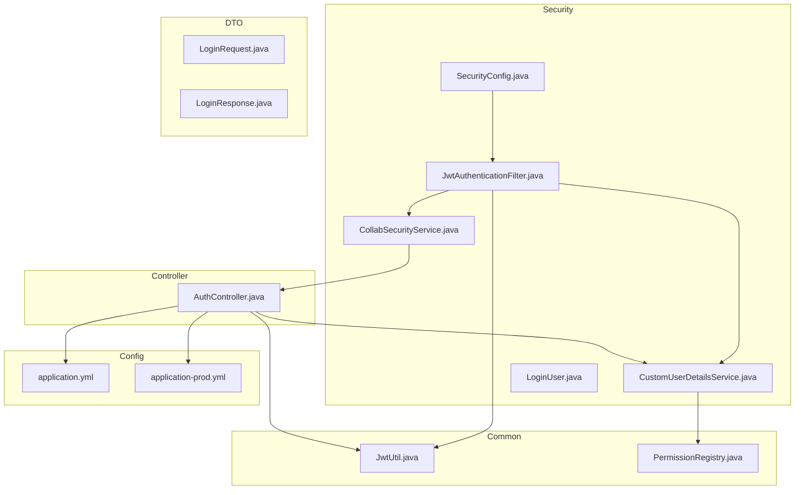

**Diagram sources**
- [JwtUtil.java:1-174](file://admin-backend/src/main/java/com/qhiot/survey/common/util/JwtUtil.java#L1-L174)
- [JwtAuthenticationFilter.java:1-135](file://admin-backend/src/main/java/com/qhiot/survey/security/JwtAuthenticationFilter.java#L1-L135)
- [SecurityConfig.java:1-99](file://admin-backend/src/main/java/com/qhiot/survey/security/SecurityConfig.java#L1-L99)
- [AuthController.java:1-552](file://admin-backend/src/main/java/com/qhiot/survey/controller/AuthController.java#L1-L552)
- [application.yml:1-149](file://admin-backend/src/main/resources/application.yml#L1-L149)
- [application-prod.yml:1-140](file://admin-backend/src/main/resources/application-prod.yml#L1-L140)
- [PermissionRegistry.java:1-175](file://admin-backend/src/main/java/com/qhiot/survey/common/util/PermissionRegistry.java#L1-L175)
- [CustomUserDetailsService.java:1-91](file://admin-backend/src/main/java/com/qhiot/survey/security/CustomUserDetailsService.java#L1-L91)
- [LoginUser.java:1-36](file://admin-backend/src/main/java/com/qhiot/survey/security/LoginUser.java#L1-L36)
- [CollabSecurityService.java:1-126](file://admin-backend/src/main/java/com/qhiot/survey/security/CollabSecurityService.java#L1-L126)
- [LoginRequest.java:1-25](file://admin-backend/src/main/java/com/qhiot/survey/dto/LoginRequest.java#L1-L25)
- [LoginResponse.java:1-56](file://admin-backend/src/main/java/com/qhiot/survey/dto/LoginResponse.java#L1-L56)

**Section sources**
- [JwtUtil.java:1-174](file://admin-backend/src/main/java/com/qhiot/survey/common/util/JwtUtil.java#L1-L174)
- [JwtAuthenticationFilter.java:1-135](file://admin-backend/src/main/java/com/qhiot/survey/security/JwtAuthenticationFilter.java#L1-L135)
- [SecurityConfig.java:1-99](file://admin-backend/src/main/java/com/qhiot/survey/security/SecurityConfig.java#L1-L99)
- [AuthController.java:1-552](file://admin-backend/src/main/java/com/qhiot/survey/controller/AuthController.java#L1-L552)
- [application.yml:1-149](file://admin-backend/src/main/resources/application.yml#L1-L149)
- [application-prod.yml:1-140](file://admin-backend/src/main/resources/application-prod.yml#L1-L140)
- [PermissionRegistry.java:1-175](file://admin-backend/src/main/java/com/qhiot/survey/common/util/PermissionRegistry.java#L1-L175)
- [CustomUserDetailsService.java:1-91](file://admin-backend/src/main/java/com/qhiot/survey/security/CustomUserDetailsService.java#L1-L91)
- [LoginUser.java:1-36](file://admin-backend/src/main/java/com/qhiot/survey/security/LoginUser.java#L1-L36)
- [CollabSecurityService.java:1-126](file://admin-backend/src/main/java/com/qhiot/survey/security/CollabSecurityService.java#L1-L126)
- [LoginRequest.java:1-25](file://admin-backend/src/main/java/com/qhiot/survey/dto/LoginRequest.java#L1-L25)
- [LoginResponse.java:1-56](file://admin-backend/src/main/java/com/qhiot/survey/dto/LoginResponse.java#L1-L56)

## Core Components
- **JwtUtil**: Generates and validates JWTs with dual-token support, extracting claims and checking expiration for both internal and collaboration tokens.
- **JwtAuthenticationFilter**: Enhanced to support dual-token architecture with separate handling for loginType=internal and loginType=collab, extracting Authorization Bearer tokens and validating them appropriately.
- **SecurityConfig**: Configures stateless sessions, CORS, and filter order for JWT processing with dual-token awareness.
- **AuthController**: Implements login, SMS login, refresh, logout, and user info retrieval with dual-token response handling.
- **CollabSecurityService**: Validates collaboration entries with strict whitelist/blacklist policy, enforces access control, and logs access attempts for collaboration tokens.
- **CustomUserDetailsService and LoginUser**: Load user roles and permissions for internal users, expand wildcards, and provide user principal with authorities.
- **PermissionRegistry**: Scans @PreAuthorize annotations to register all permissions for wildcard expansion.
- **DTOs**: LoginRequest and LoginResponse define the shape of authentication payloads with dual-token considerations.

**Section sources**
- [JwtUtil.java:1-174](file://admin-backend/src/main/java/com/qhiot/survey/common/util/JwtUtil.java#L1-L174)
- [JwtAuthenticationFilter.java:1-135](file://admin-backend/src/main/java/com/qhiot/survey/security/JwtAuthenticationFilter.java#L1-L135)
- [SecurityConfig.java:1-99](file://admin-backend/src/main/java/com/qhiot/survey/security/SecurityConfig.java#L1-L99)
- [AuthController.java:1-552](file://admin-backend/src/main/java/com/qhiot/survey/controller/AuthController.java#L1-L552)
- [CollabSecurityService.java:1-126](file://admin-backend/src/main/java/com/qhiot/survey/security/CollabSecurityService.java#L1-L126)
- [CustomUserDetailsService.java:1-91](file://admin-backend/src/main/java/com/qhiot/survey/security/CustomUserDetailsService.java#L1-L91)
- [LoginUser.java:1-36](file://admin-backend/src/main/java/com/qhiot/survey/security/LoginUser.java#L1-L36)
- [PermissionRegistry.java:1-175](file://admin-backend/src/main/java/com/qhiot/survey/common/util/PermissionRegistry.java#L1-L175)
- [LoginRequest.java:1-25](file://admin-backend/src/main/java/com/qhiot/survey/dto/LoginRequest.java#L1-L25)
- [LoginResponse.java:1-56](file://admin-backend/src/main/java/com/qhiot/survey/dto/LoginResponse.java#L1-L56)

## Architecture Overview
The enhanced JWT authentication pipeline integrates with Spring Security through a dual-token architecture:
- Requests arrive at the server and are intercepted by JwtAuthenticationFilter.
- The filter extracts the Authorization header and validates the token via JwtUtil.
- **Enhanced**: Token validation now includes loginType differentiation between internal and collaboration users.
- For loginType=internal: the filter delegates to CustomUserDetailsService to load roles and permissions.
- For loginType=collab: CollabSecurityService validates the entry and applies strict access policy with whitelist/blacklist enforcement.
- SecurityConfig defines stateless sessions and permits unauthenticated access to specific endpoints.
- **New**: Collaboration tokens trigger separate authentication, authorization, and auditing chains with ROLE_COLLAB assignment.

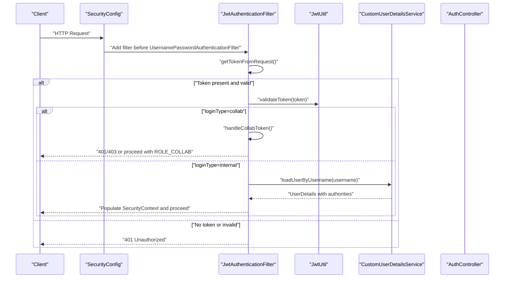

**Diagram sources**
- [SecurityConfig.java:39-61](file://admin-backend/src/main/java/com/qhiot/survey/security/SecurityConfig.java#L39-L61)
- [JwtAuthenticationFilter.java:43-81](file://admin-backend/src/main/java/com/qhiot/survey/security/JwtAuthenticationFilter.java#L43-L81)
- [JwtUtil.java:154-161](file://admin-backend/src/main/java/com/qhiot/survey/common/util/JwtUtil.java#L154-L161)
- [CustomUserDetailsService.java:31-89](file://admin-backend/src/main/java/com/qhiot/survey/security/CustomUserDetailsService.java#L31-L89)

**Section sources**
- [SecurityConfig.java:39-61](file://admin-backend/src/main/java/com/qhiot/survey/security/SecurityConfig.java#L39-L61)
- [JwtAuthenticationFilter.java:43-133](file://admin-backend/src/main/java/com/qhiot/survey/security/JwtAuthenticationFilter.java#L43-L133)
- [JwtUtil.java:154-161](file://admin-backend/src/main/java/com/qhiot/survey/common/util/JwtUtil.java#L154-L161)
- [CustomUserDetailsService.java:31-89](file://admin-backend/src/main/java/com/qhiot/survey/security/CustomUserDetailsService.java#L31-L89)

## Detailed Component Analysis

### JwtUtil: Enhanced Token Generation, Parsing, and Validation
- **Enhanced Claims and Payload Support**:
  - Access token: includes userId, username, tokenType=access, and loginType (internal/collab).
  - Refresh token: includes userId, username, tokenType=refresh.
  - Collaboration token: includes userId, username (prefixed), tokenType=access, loginType=collab, collabEntryId, and optional entryName.
- **Improved Token Type Handling**:
  - Enhanced validation logic supports dual-token architecture with loginType differentiation.
  - Separate claim extraction methods for internal and collaboration tokens.
- **Expiration Management**:
  - Access token expiration configured via jwt.expiration.
  - Refresh token expiration configured via jwt.refresh-expiration.
- **Signature and Algorithm**:
  - Uses HMAC SHA-256 with a symmetric secret derived from jwt.secret.
- **Enhanced Methods**:
  - generateAccessToken/generateRefreshToken/generateCollabToken: construct claims with loginType support.
  - getClaimsFromToken/getUserIdFromToken/getUsernameFromToken/getTokenType/getLoginType/getCollabEntryIdFromToken: extract claims with dual-token awareness.
  - validateToken/isTokenExpired: verify signature and expiration with loginType validation.

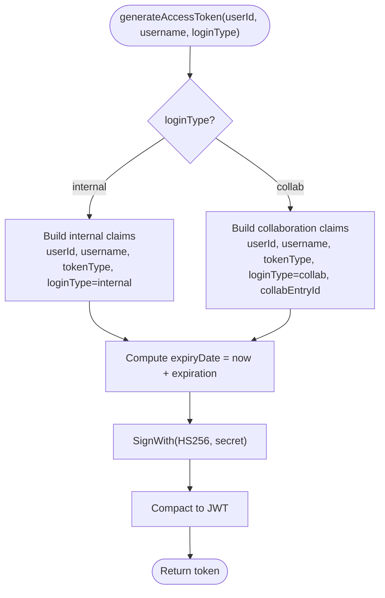

**Diagram sources**
- [JwtUtil.java:34-85](file://admin-backend/src/main/java/com/qhiot/survey/common/util/JwtUtil.java#L34-L85)

**Section sources**
- [JwtUtil.java:22-51](file://admin-backend/src/main/java/com/qhiot/survey/common/util/JwtUtil.java#L22-L51)
- [JwtUtil.java:73-85](file://admin-backend/src/main/java/com/qhiot/survey/common/util/JwtUtil.java#L73-L85)
- [JwtUtil.java:87-174](file://admin-backend/src/main/java/com/qhiot/survey/common/util/JwtUtil.java#L87-L174)
- [application.yml:9-14](file://admin-backend/src/main/resources/application.yml#L9-L14)
- [application-prod.yml:64-69](file://admin-backend/src/main/resources/application-prod.yml#L64-L69)

### JwtAuthenticationFilter: Dual-Token Header Extraction and Authentication
- **Enhanced Header Extraction**:
  - Reads Authorization header and expects Bearer <token>.
- **Improved Validation and Authentication**:
  - Validates token via JwtUtil with loginType awareness.
  - **New**: For loginType=collab: validates entry via CollabSecurityService, enforces strict access policy, logs access, and sets ROLE_COLLAB.
  - **Enhanced**: For loginType=internal: loads user via CustomUserDetailsService and sets SecurityContext with authorities.
- **Dual-Token Processing Logic**:
  - loginType=collab triggers separate collaboration authentication branch.
  - loginType=internal or missing triggers standard internal user authentication.
- **Error Handling**:
  - On failure, responds with 401 Unauthorized JSON body.
  - Collaboration token failures return appropriate 403/401 responses based on policy enforcement.

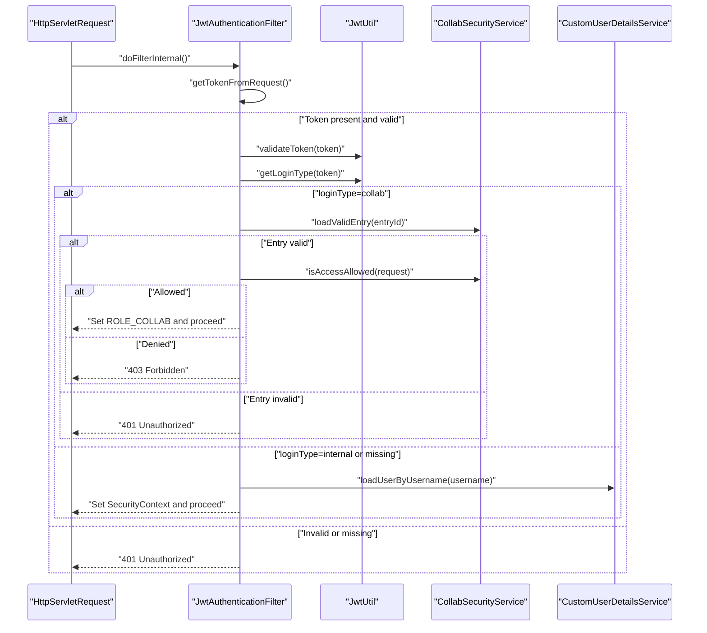

**Diagram sources**
- [JwtAuthenticationFilter.java:43-133](file://admin-backend/src/main/java/com/qhiot/survey/security/JwtAuthenticationFilter.java#L43-L133)
- [JwtUtil.java:154-161](file://admin-backend/src/main/java/com/qhiot/survey/common/util/JwtUtil.java#L154-L161)
- [CollabSecurityService.java:39-105](file://admin-backend/src/main/java/com/qhiot/survey/security/CollabSecurityService.java#L39-L105)
- [CustomUserDetailsService.java:31-89](file://admin-backend/src/main/java/com/qhiot/survey/security/CustomUserDetailsService.java#L31-L89)

**Section sources**
- [JwtAuthenticationFilter.java:24-133](file://admin-backend/src/main/java/com/qhiot/survey/security/JwtAuthenticationFilter.java#L24-L133)
- [JwtUtil.java:87-174](file://admin-backend/src/main/java/com/qhiot/survey/common/util/JwtUtil.java#L87-L174)
- [CollabSecurityService.java:39-105](file://admin-backend/src/main/java/com/qhiot/survey/security/CollabSecurityService.java#L39-L105)
- [CustomUserDetailsService.java:31-89](file://admin-backend/src/main/java/com/qhiot/survey/security/CustomUserDetailsService.java#L31-L89)

### SecurityConfig: Stateless Session and CORS with Dual-Token Awareness
- **Stateless Sessions**:
  - SessionCreationPolicy.STATELESS ensures no server-side session is created.
- **Enhanced Permit All Configuration**:
  - Public endpoints (e.g., /api/v1/auth/**, /api/v1/health/**, /api/public/**) are permitted without authentication.
- **Filter Order**:
  - Adds JwtAuthenticationFilter before UsernamePasswordAuthenticationFilter.
- **CORS Configuration**:
  - Configures allowed origins, methods, headers, credentials, and exposed headers.

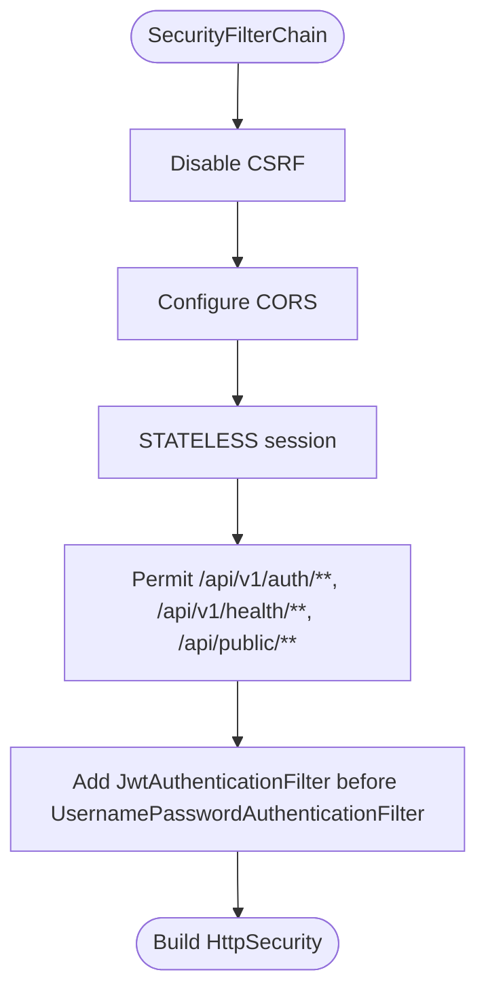

**Diagram sources**
- [SecurityConfig.java:39-61](file://admin-backend/src/main/java/com/qhiot/survey/security/SecurityConfig.java#L39-L61)

**Section sources**
- [SecurityConfig.java:39-99](file://admin-backend/src/main/java/com/qhiot/survey/security/SecurityConfig.java#L39-L99)

### AuthController: Enhanced Login, Refresh, Logout, and User Info
- **Enhanced Login Operations**:
  - Login (Username/Password): Validates captcha against Redis, authenticates via AuthenticationManager, generates access and refresh tokens, and returns LoginResponse with roles and permissions.
  - **New**: SMS Login: Verifies SMS code, loads user by phone, generates tokens with appropriate loginType, and logs activity.
- **Improved Refresh Operations**:
  - Refresh: Validates refresh token, verifies token type, loads user, and issues new access and refresh tokens.
- **Enhanced Logout Operations**:
  - Logout: Clears SecurityContext.
- **User Information Retrieval**:
  - User Info: Retrieves current user, roles, and expanded permissions.

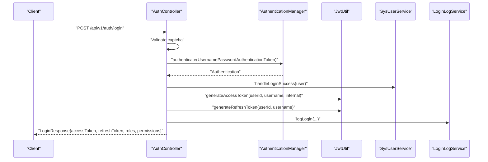

**Diagram sources**
- [AuthController.java:138-238](file://admin-backend/src/main/java/com/qhiot/survey/controller/AuthController.java#L138-L238)
- [JwtUtil.java:34-51](file://admin-backend/src/main/java/com/qhiot/survey/common/util/JwtUtil.java#L34-L51)
- [LoginResponse.java:17-56](file://admin-backend/src/main/java/com/qhiot/survey/dto/LoginResponse.java#L17-L56)

**Section sources**
- [AuthController.java:138-238](file://admin-backend/src/main/java/com/qhiot/survey/controller/AuthController.java#L138-L238)
- [AuthController.java:239-300](file://admin-backend/src/main/java/com/qhiot/survey/controller/AuthController.java#L239-L300)
- [AuthController.java:398-427](file://admin-backend/src/main/java/com/qhiot/survey/controller/AuthController.java#L398-L427)
- [AuthController.java:480-550](file://admin-backend/src/main/java/com/qhiot/survey/controller/AuthController.java#L480-L550)
- [LoginRequest.java:11-25](file://admin-backend/src/main/java/com/qhiot/survey/dto/LoginRequest.java#L11-L25)
- [LoginResponse.java:17-56](file://admin-backend/src/main/java/com/qhiot/survey/dto/LoginResponse.java#L17-L56)

### CollabSecurityService: Enhanced Collaboration Access Control
- **Enhanced Entry Validation**:
  - Loads entry by ID and checks status and expiration.
- **Strict Access Policy Enforcement**:
  - **New**: Blacklists sensitive operations and endpoints (audit disposition, deletion, bulk export, user management, role management).
  - **New**: Whitelists read-only GET endpoints for collaboration access.
  - **New**: Denies all write operations for collaboration users.
  - **Enhanced**: Comprehensive access control based on loginType=collab.
- **Enhanced Logging**:
  - Logs every access attempt with IP, UA, path, and response code to collab_access_log.
  - **New**: Separate audit trail for collaboration token usage.

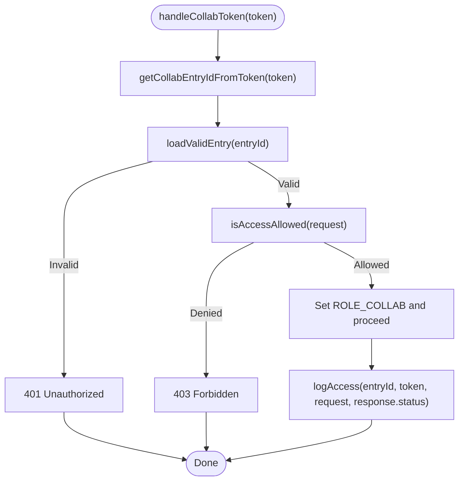

**Diagram sources**
- [JwtAuthenticationFilter.java:86-122](file://admin-backend/src/main/java/com/qhiot/survey/security/JwtAuthenticationFilter.java#L86-L122)
- [CollabSecurityService.java:39-105](file://admin-backend/src/main/java/com/qhiot/survey/security/CollabSecurityService.java#L39-L105)

**Section sources**
- [CollabSecurityService.java:15-126](file://admin-backend/src/main/java/com/qhiot/survey/security/CollabSecurityService.java#L15-L126)
- [JwtAuthenticationFilter.java:86-122](file://admin-backend/src/main/java/com/qhiot/survey/security/JwtAuthenticationFilter.java#L86-L122)

### CustomUserDetailsService and LoginUser: Enhanced Roles, Permissions, and Authorities
- **Enhanced Role and Permission Loading**:
  - Loads user roles and aggregates raw permissions for internal users.
  - Expands wildcards using PermissionRegistry.
  - Converts roles to ROLE_* authorities and merges with expanded permissions.
- **LoginUser Enhancement**:
  - Extends Spring Security's User with userId and realName for downstream use.

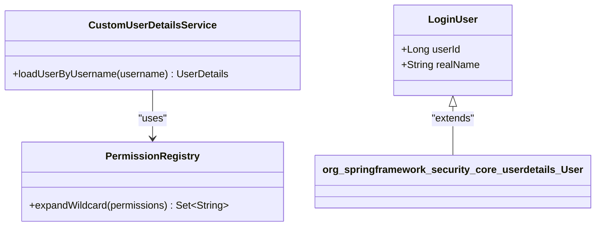

**Diagram sources**
- [CustomUserDetailsService.java:31-89](file://admin-backend/src/main/java/com/qhiot/survey/security/CustomUserDetailsService.java#L31-L89)
- [LoginUser.java:14-35](file://admin-backend/src/main/java/com/qhiot/survey/security/LoginUser.java#L14-L35)
- [PermissionRegistry.java:56-88](file://admin-backend/src/main/java/com/qhiot/survey/common/util/PermissionRegistry.java#L56-L88)

**Section sources**
- [CustomUserDetailsService.java:31-89](file://admin-backend/src/main/java/com/qhiot/survey/security/CustomUserDetailsService.java#L31-L89)
- [LoginUser.java:14-35](file://admin-backend/src/main/java/com/qhiot/survey/security/LoginUser.java#L14-L35)
- [PermissionRegistry.java:56-88](file://admin-backend/src/main/java/com/qhiot/survey/common/util/PermissionRegistry.java#L56-L88)

### Configuration: Enhanced JWT Settings and Environment Profiles
- **Enhanced application.yml**:
  - Defines jwt.secret, jwt.expiration (access), and jwt.refresh-expiration.
  - Sets CORS allowed origins and application environment.
- **Enhanced application-prod.yml**:
  - Enforces production-safe defaults: disables Swagger UI/API docs, reduces logging verbosity, and requires JWT_SECRET via environment variable.
  - **New**: Enhanced security configurations for dual-token environment.

**Section sources**
- [application.yml:9-14](file://admin-backend/src/main/resources/application.yml#L9-L14)
- [application.yml:134-140](file://admin-backend/src/main/resources/application.yml#L134-L140)
- [application-prod.yml:64-69](file://admin-backend/src/main/resources/application-prod.yml#L64-L69)
- [application-prod.yml:101-110](file://admin-backend/src/main/resources/application-prod.yml#L101-L110)
- [application-prod.yml:111-122](file://admin-backend/src/main/resources/application-prod.yml#L111-L122)

## Dependency Analysis
- **Enhanced JwtUtil Dependencies**:
  - jwt.secret, jwt.expiration, jwt.refresh-expiration from configuration.
  - io.jsonwebtoken APIs for signing and parsing.
  - **New**: Enhanced dependency on CollabSecurityService for collaboration token validation.
- **Enhanced JwtAuthenticationFilter Dependencies**:
  - JwtUtil for validation and claim extraction with loginType awareness.
  - CustomUserDetailsService for internal users.
  - CollabSecurityService for collaboration access control.
- **Enhanced AuthController Dependencies**:
  - JwtUtil for token issuance and refresh with dual-token support.
  - AuthenticationManager for credential verification.
  - Services for user lookup, role aggregation, and logging.
- **SecurityConfig Dependencies**:
  - JwtAuthenticationFilter to intercept requests with dual-token awareness.
- **PermissionRegistry Dependencies**:
  - Spring AOP scanning to register permissions from @PreAuthorize.

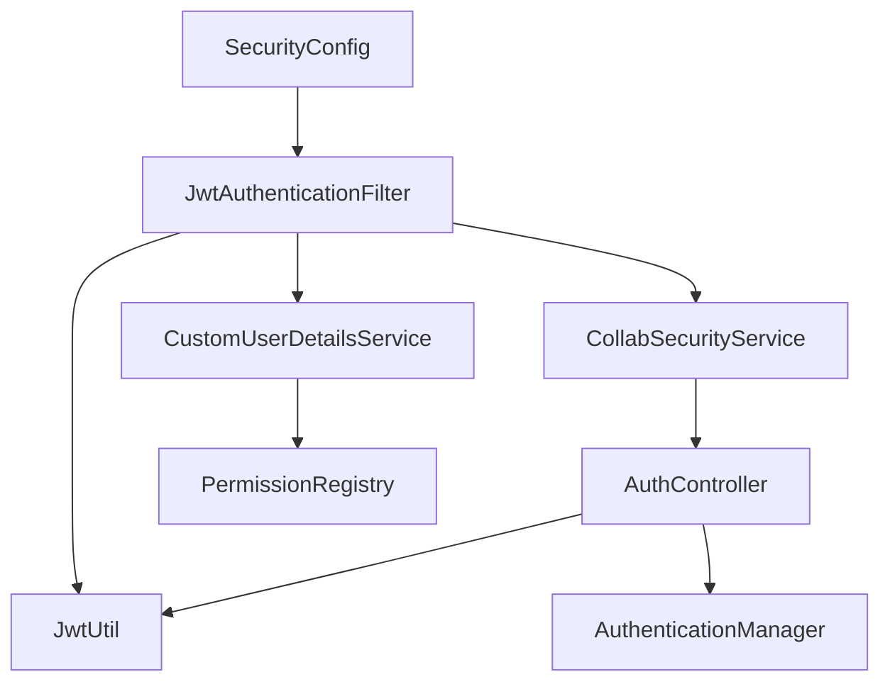

**Diagram sources**
- [AuthController.java:52-60](file://admin-backend/src/main/java/com/qhiot/survey/controller/AuthController.java#L52-L60)
- [JwtAuthenticationFilter.java:39-42](file://admin-backend/src/main/java/com/qhiot/survey/security/JwtAuthenticationFilter.java#L39-L42)
- [SecurityConfig.java:34-35](file://admin-backend/src/main/java/com/qhiot/survey/security/SecurityConfig.java#L34-L35)
- [CustomUserDetailsService.java:28-29](file://admin-backend/src/main/java/com/qhiot/survey/security/CustomUserDetailsService.java#L28-L29)
- [PermissionRegistry.java:95-114](file://admin-backend/src/main/java/com/qhiot/survey/common/util/PermissionRegistry.java#L95-L114)

**Section sources**
- [AuthController.java:52-60](file://admin-backend/src/main/java/com/qhiot/survey/controller/AuthController.java#L52-L60)
- [JwtAuthenticationFilter.java:39-42](file://admin-backend/src/main/java/com/qhiot/survey/security/JwtAuthenticationFilter.java#L39-L42)
- [SecurityConfig.java:34-35](file://admin-backend/src/main/java/com/qhiot/survey/security/SecurityConfig.java#L34-L35)
- [CustomUserDetailsService.java:28-29](file://admin-backend/src/main/java/com/qhiot/survey/security/CustomUserDetailsService.java#L28-L29)
- [PermissionRegistry.java:95-114](file://admin-backend/src/main/java/com/qhiot/survey/common/util/PermissionRegistry.java#L95-L114)

## Performance Considerations
- **Enhanced Stateless Design**:
  - No server-side session storage improves scalability for both internal and collaboration users.
- **Optimized Claims Processing**:
  - Keep claims minimal to reduce token size and parsing overhead for dual-token architecture.
- **Efficient Validation Logic**:
  - Signature verification is fast; avoid unnecessary repeated validations.
  - **New**: LoginType-based early exit for performance optimization.
- **Enhanced Caching Strategy**:
  - Consider caching frequently accessed user roles/permissions if needed, but rely on existing service-layer caching patterns.
- **CORS Optimization**:
  - Configure allowed origins carefully to avoid wildcard origins in production.

## Troubleshooting Guide
- **Enhanced 401 Unauthorized Handling**:
  - Occurs when Authorization header is missing, malformed, or token validation fails.
  - **New**: Distinguish between internal and collaboration token validation failures.
  - Verify jwt.secret matches across instances and that token is not expired.
- **Enhanced 403 Forbidden (Collaboration)**:
  - Occurs when collaboration entry is invalid or access is denied by policy.
  - **New**: Check collab entry status/expiry and endpoint access policy.
  - **New**: Verify loginType=collab token is being processed by collaboration branch.
- **Enhanced Token Claims Issues**:
  - Ensure the correct token type is used (access vs refresh) and that loginType is set appropriately for collaboration.
  - **New**: Verify collaboration tokens include collabEntryId and proper loginType=collab.
- **Production Configuration Issues**:
  - Ensure JWT_SECRET is provided via environment variables and not hardcoded.
  - **New**: Verify dual-token configuration in production environment.
  - Confirm CORS allowed origins are set correctly for production.

**Section sources**
- [JwtAuthenticationFilter.java:72-78](file://admin-backend/src/main/java/com/qhiot/survey/security/JwtAuthenticationFilter.java#L72-L78)
- [JwtAuthenticationFilter.java:92-98](file://admin-backend/src/main/java/com/qhiot/survey/security/JwtAuthenticationFilter.java#L92-L98)
- [application-prod.yml:64-69](file://admin-backend/src/main/resources/application-prod.yml#L64-L69)
- [application-prod.yml:124-125](file://admin-backend/src/main/resources/application-prod.yml#L124-L125)

## Conclusion
The enhanced JWT implementation provides secure, stateless authentication with clear separation between internal and collaboration access through dual-token support. Tokens carry minimal, sufficient claims with loginType differentiation, are validated with HMAC signatures, and integrate tightly with Spring Security. Collaboration access is strictly controlled via a comprehensive whitelist/blacklist policy with dedicated auditing. The dual-token architecture ensures robust security boundaries while maintaining performance and scalability. Proper configuration and adherence to production best practices ensure reliable operation across both internal and external user scenarios.

## Appendices

### Enhanced Token Structure and Claims Reference
- **Access Token**:
  - Required: userId, username, tokenType=access.
  - **Enhanced**: Optional: loginType=internal or loginType=collab.
- **Refresh Token**:
  - Required: userId, username, tokenType=refresh.
- **Collaboration Token**:
  - Required: userId, username (prefixed), tokenType=access, loginType=collab, collabEntryId.
  - Optional: entryName.

**Section sources**
- [JwtUtil.java:34-68](file://admin-backend/src/main/java/com/qhiot/survey/common/util/JwtUtil.java#L34-L68)
- [JwtUtil.java:102-130](file://admin-backend/src/main/java/com/qhiot/survey/common/util/JwtUtil.java#L102-L130)

### Enhanced Example Workflows

#### Enhanced Login Flow (Username/Password)
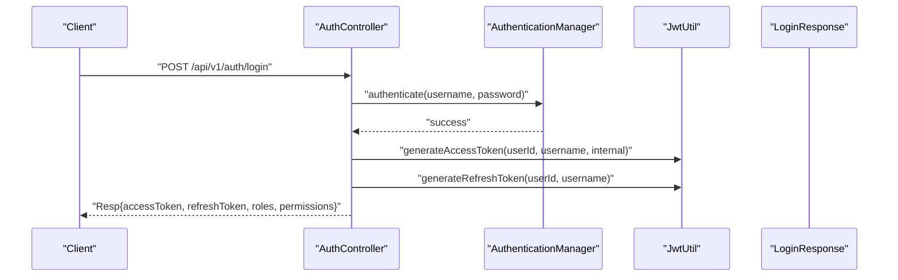

**Diagram sources**
- [AuthController.java:138-238](file://admin-backend/src/main/java/com/qhiot/survey/controller/AuthController.java#L138-L238)
- [JwtUtil.java:34-51](file://admin-backend/src/main/java/com/qhiot/survey/common/util/JwtUtil.java#L34-L51)
- [LoginResponse.java:17-56](file://admin-backend/src/main/java/com/qhiot/survey/dto/LoginResponse.java#L17-L56)

#### Enhanced Token Refresh Flow
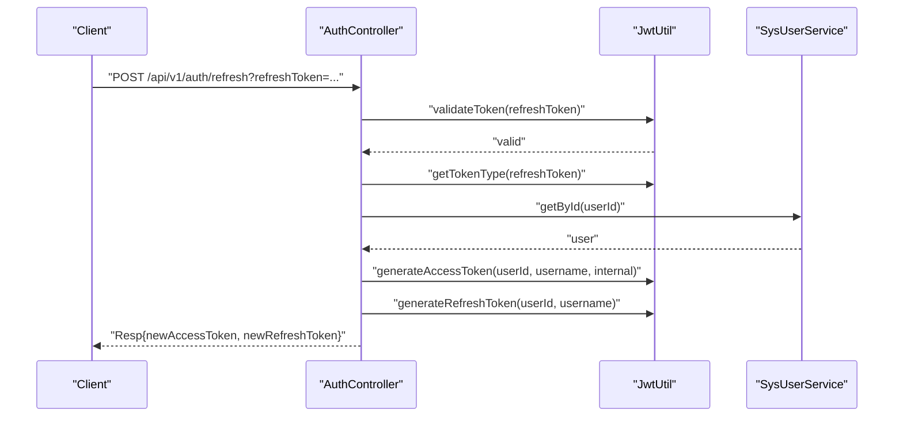

**Diagram sources**
- [AuthController.java:398-427](file://admin-backend/src/main/java/com/qhiot/survey/controller/AuthController.java#L398-L427)
- [JwtUtil.java:154-161](file://admin-backend/src/main/java/com/qhiot/survey/common/util/JwtUtil.java#L154-L161)
- [JwtUtil.java:45-51](file://admin-backend/src/main/java/com/qhiot/survey/common/util/JwtUtil.java#L45-L51)

#### Enhanced Collaboration Access Flow
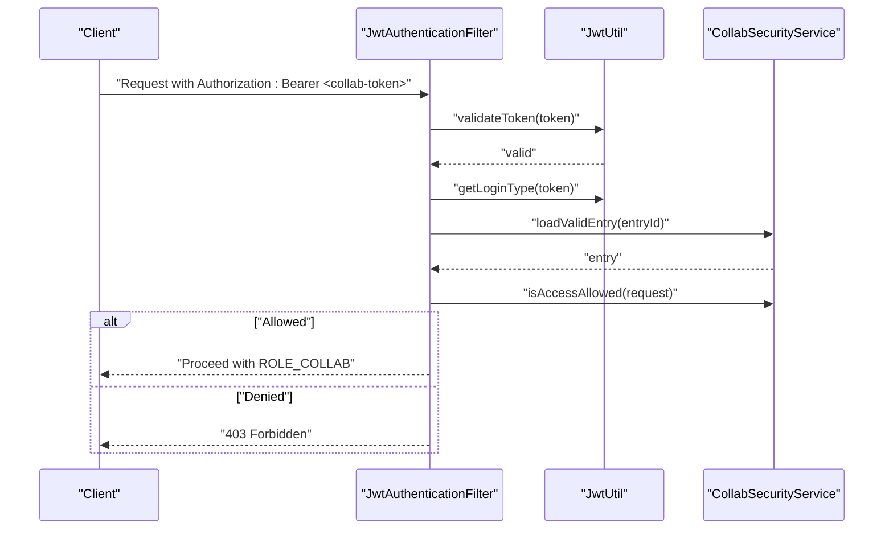

**Diagram sources**
- [JwtAuthenticationFilter.java:49-122](file://admin-backend/src/main/java/com/qhiot/survey/security/JwtAuthenticationFilter.java#L49-L122)
- [JwtUtil.java:154-161](file://admin-backend/src/main/java/com/qhiot/survey/common/util/JwtUtil.java#L154-L161)
- [CollabSecurityService.java:39-105](file://admin-backend/src/main/java/com/qhiot/survey/security/CollabSecurityService.java#L39-L105)

### Enhanced Security Best Practices for Production
- **Environment Variables**:
  - Provide JWT_SECRET via environment variables; do not hardcode in configuration files.
- **Enhanced Token Lifetimes**:
  - Use short-lived access tokens (e.g., hours) and longer refresh tokens (e.g., days) with rotation.
  - **New**: Implement separate expiration policies for internal vs collaboration tokens.
- **Transport Security**:
  - Serve over HTTPS only; consider SameSite cookies and secure flags for clients.
- **Secret Management**:
  - Rotate secrets periodically and invalidate stale tokens.
  - **New**: Implement dual-secret strategy for internal and collaboration token validation.
- **Enhanced Endpoint Exposure**:
  - Limit exposure of /v3/api-docs and swagger UI in production.
- **CORS Configuration**:
  - Configure allowed origins explicitly; avoid wildcard origins with credentials.
- **Enhanced Monitoring**:
  - **New**: Implement separate monitoring for internal and collaboration token validation failures.
  - **New**: Track collaboration access patterns and policy violations.

**Section sources**
- [application-prod.yml:64-69](file://admin-backend/src/main/resources/application-prod.yml#L64-L69)
- [application-prod.yml:101-110](file://admin-backend/src/main/resources/application-prod.yml#L101-L110)
- [application-prod.yml:124-125](file://admin-backend/src/main/resources/application-prod.yml#L124-L125)