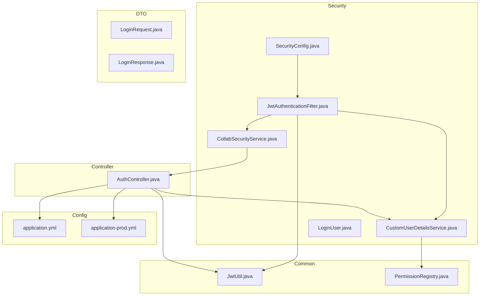
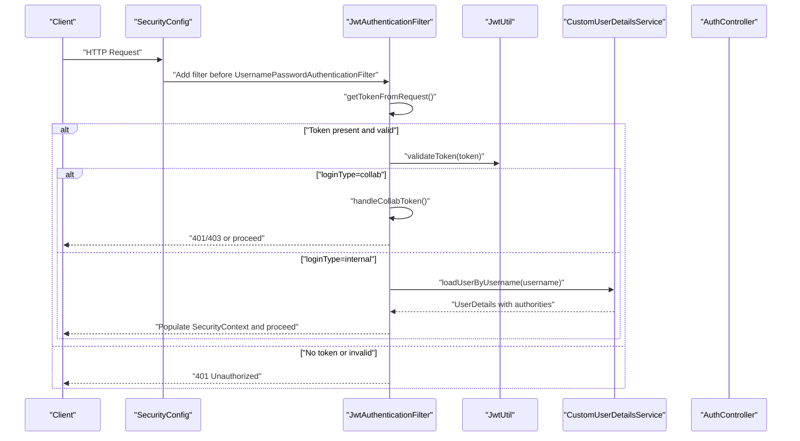
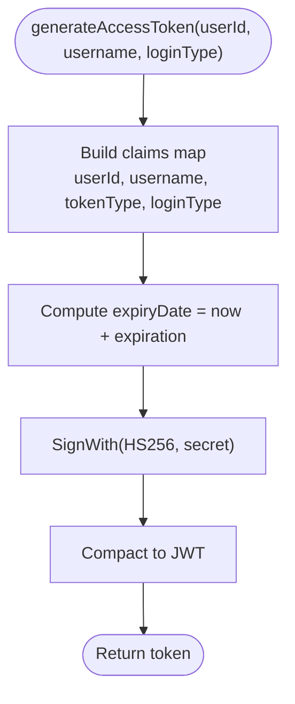
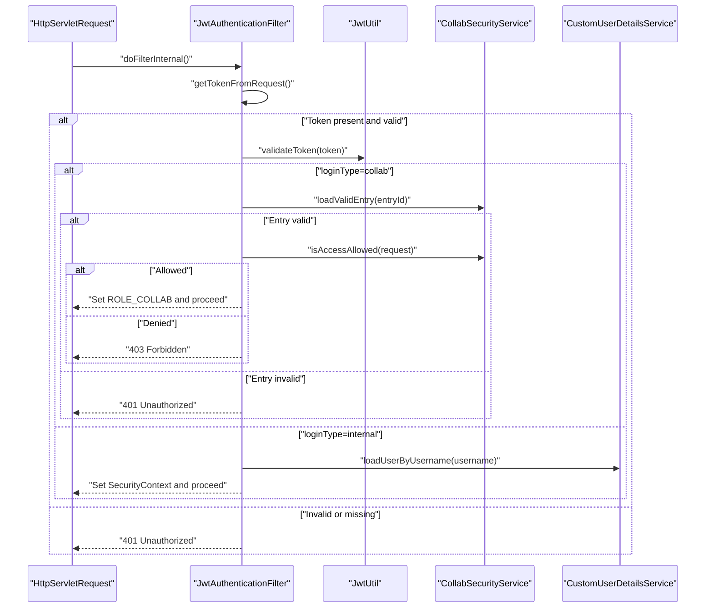
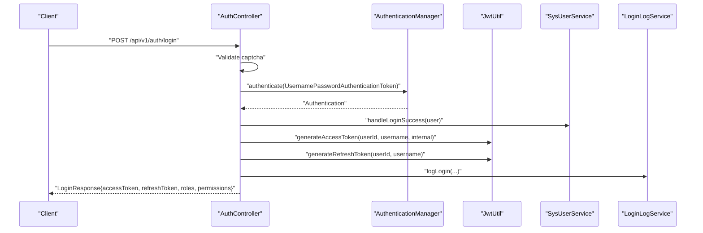
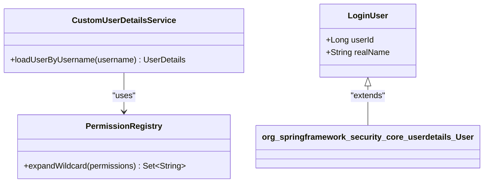
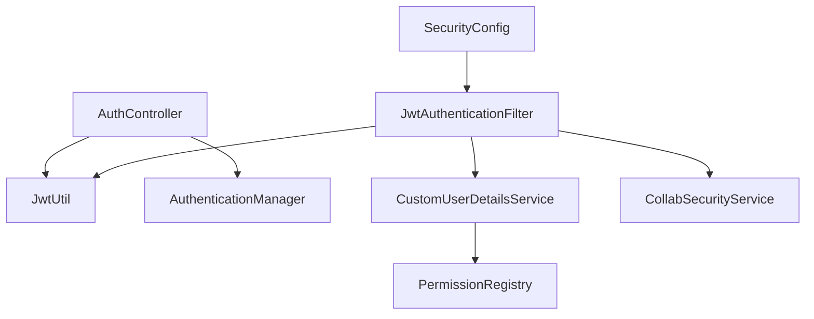
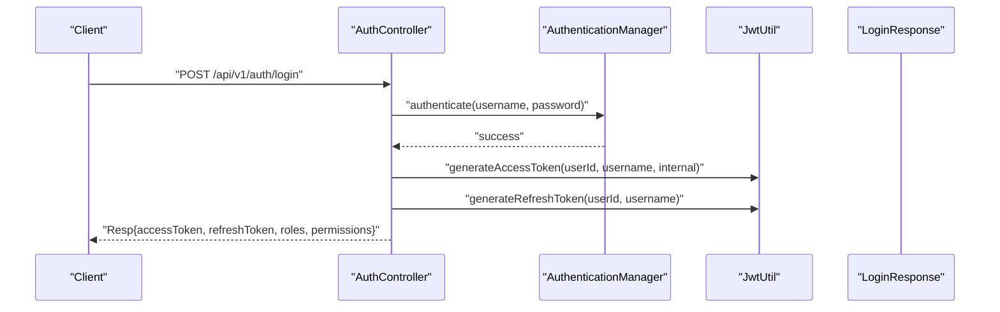
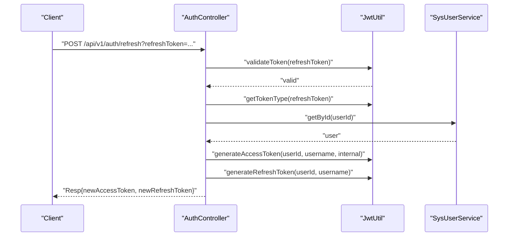
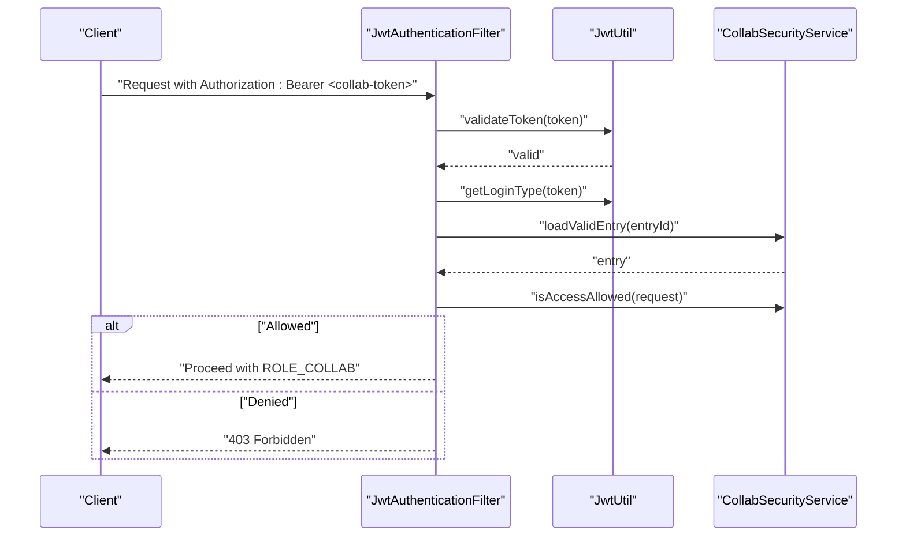

# JWT Implementation

<cite>
**Referenced Files in This Document**
- [JwtUtil.java](file://admin-backend/src/main/java/com/qhiot/survey/common/util/JwtUtil.java)
- [JwtAuthenticationFilter.java](file://admin-backend/src/main/java/com/qhiot/survey/security/JwtAuthenticationFilter.java)
- [SecurityConfig.java](file://admin-backend/src/main/java/com/qhiot/survey/security/SecurityConfig.java)
- [AuthController.java](file://admin-backend/src/main/java/com/qhiot/survey/controller/AuthController.java)
- [application.yml](file://admin-backend/src/main/resources/application.yml)
- [application-prod.yml](file://admin-backend/src/main/resources/application-prod.yml)
- [CollabSecurityService.java](file://admin-backend/src/main/java/com/qhiot/survey/security/CollabSecurityService.java)
- [CustomUserDetailsService.java](file://admin-backend/src/main/java/com/qhiot/survey/security/CustomUserDetailsService.java)
- [LoginUser.java](file://admin-backend/src/main/java/com/qhiot/survey/security/LoginUser.java)
- [LoginRequest.java](file://admin-backend/src/main/java/com/qhiot/survey/dto/LoginRequest.java)
- [LoginResponse.java](file://admin-backend/src/main/java/com/qhiot/survey/dto/LoginResponse.java)
- [SurveyApplication.java](file://admin-backend/src/main/java/com/qhiot/survey/SurveyApplication.java)
- [PermissionRegistry.java](file://admin-backend/src/main/java/com/qhiot/survey/common/util/PermissionRegistry.java)
- [CollabTokenSecurityTest.java](file://admin-backend/src/test/java/com/qhiot/survey/security/CollabTokenSecurityTest.java)
</cite>

## Table of Contents
1. [Introduction](#introduction)
2. [Project Structure](#project-structure)
3. [Core Components](#core-components)
4. [Architecture Overview](#architecture-overview)
5. [Detailed Component Analysis](#detailed-component-analysis)
6. [Dependency Analysis](#dependency-analysis)
7. [Performance Considerations](#performance-considerations)
8. [Troubleshooting Guide](#troubleshooting-guide)
9. [Conclusion](#conclusion)
10. [Appendices](#appendices)

## Introduction
This document provides comprehensive documentation for the JWT (JSON Web Token) implementation used for authentication in the backend service. It covers token structure, payload contents, and claims; the token generation process including username, login type, and expiration handling; token validation and signature verification; integration with Spring Security’s authentication system; extraction from HTTP headers; refresh strategies; expiration handling; and security best practices for production environments.

## Project Structure
The JWT implementation spans several modules:
- Utility for JWT operations
- Security filters and configuration
- Authentication controller for login, refresh, and logout
- DTOs for request/response payloads
- Application configuration for JWT secrets and expiration
- Permission registry for wildcard expansion
- Collaboration security service for third-party access tokens

**Diagram sources**
- [JwtUtil.java:1-174](file://admin-backend/src/main/java/com/qhiot/survey/common/util/JwtUtil.java#L1-L174)
- [JwtAuthenticationFilter.java:1-135](file://admin-backend/src/main/java/com/qhiot/survey/security/JwtAuthenticationFilter.java#L1-L135)
- [SecurityConfig.java:1-99](file://admin-backend/src/main/java/com/qhiot/survey/security/SecurityConfig.java#L1-L99)
- [AuthController.java:1-552](file://admin-backend/src/main/java/com/qhiot/survey/controller/AuthController.java#L1-L552)
- [application.yml:1-149](file://admin-backend/src/main/resources/application.yml#L1-L149)
- [application-prod.yml:1-140](file://admin-backend/src/main/resources/application-prod.yml#L1-L140)
- [PermissionRegistry.java:1-175](file://admin-backend/src/main/java/com/qhiot/survey/common/util/PermissionRegistry.java#L1-L175)
- [CustomUserDetailsService.java:1-91](file://admin-backend/src/main/java/com/qhiot/survey/security/CustomUserDetailsService.java#L1-L91)
- [LoginUser.java:1-36](file://admin-backend/src/main/java/com/qhiot/survey/security/LoginUser.java#L1-L36)
- [CollabSecurityService.java:1-126](file://admin-backend/src/main/java/com/qhiot/survey/security/CollabSecurityService.java#L1-L126)
- [LoginRequest.java:1-25](file://admin-backend/src/main/java/com/qhiot/survey/dto/LoginRequest.java#L1-L25)
- [LoginResponse.java:1-56](file://admin-backend/src/main/java/com/qhiot/survey/dto/LoginResponse.java#L1-L56)

**Section sources**
- [JwtUtil.java:1-174](file://admin-backend/src/main/java/com/qhiot/survey/common/util/JwtUtil.java#L1-L174)
- [JwtAuthenticationFilter.java:1-135](file://admin-backend/src/main/java/com/qhiot/survey/security/JwtAuthenticationFilter.java#L1-L135)
- [SecurityConfig.java:1-99](file://admin-backend/src/main/java/com/qhiot/survey/security/SecurityConfig.java#L1-L99)
- [AuthController.java:1-552](file://admin-backend/src/main/java/com/qhiot/survey/controller/AuthController.java#L1-L552)
- [application.yml:1-149](file://admin-backend/src/main/resources/application.yml#L1-L149)
- [application-prod.yml:1-140](file://admin-backend/src/main/resources/application-prod.yml#L1-L140)
- [PermissionRegistry.java:1-175](file://admin-backend/src/main/java/com/qhiot/survey/common/util/PermissionRegistry.java#L1-L175)
- [CustomUserDetailsService.java:1-91](file://admin-backend/src/main/java/com/qhiot/survey/security/CustomUserDetailsService.java#L1-L91)
- [LoginUser.java:1-36](file://admin-backend/src/main/java/com/qhiot/survey/security/LoginUser.java#L1-L36)
- [CollabSecurityService.java:1-126](file://admin-backend/src/main/java/com/qhiot/survey/security/CollabSecurityService.java#L1-L126)
- [LoginRequest.java:1-25](file://admin-backend/src/main/java/com/qhiot/survey/dto/LoginRequest.java#L1-L25)
- [LoginResponse.java:1-56](file://admin-backend/src/main/java/com/qhiot/survey/dto/LoginResponse.java#L1-L56)

## Core Components
- JwtUtil: Generates and validates JWTs, extracts claims, and checks expiration. Supports access tokens, refresh tokens, and collaboration tokens.
- JwtAuthenticationFilter: Extracts Authorization Bearer tokens, validates them, and populates Spring Security context. Handles internal and collaboration login types differently.
- SecurityConfig: Configures stateless sessions, CORS, and filter order for JWT processing.
- AuthController: Implements login, SMS login, refresh, logout, and user info retrieval. Returns structured LoginResponse with roles and permissions.
- CollabSecurityService: Validates collaboration entries, enforces a strict whitelist/blacklist policy for collaboration access, and logs access attempts.
- CustomUserDetailsService and LoginUser: Load user roles and permissions, expand wildcards, and provide user principal with authorities.
- PermissionRegistry: Scans @PreAuthorize annotations to register all permissions for wildcard expansion.
- DTOs: LoginRequest and LoginResponse define the shape of authentication payloads.

**Section sources**
- [JwtUtil.java:1-174](file://admin-backend/src/main/java/com/qhiot/survey/common/util/JwtUtil.java#L1-L174)
- [JwtAuthenticationFilter.java:1-135](file://admin-backend/src/main/java/com/qhiot/survey/security/JwtAuthenticationFilter.java#L1-L135)
- [SecurityConfig.java:1-99](file://admin-backend/src/main/java/com/qhiot/survey/security/SecurityConfig.java#L1-L99)
- [AuthController.java:1-552](file://admin-backend/src/main/java/com/qhiot/survey/controller/AuthController.java#L1-L552)
- [CollabSecurityService.java:1-126](file://admin-backend/src/main/java/com/qhiot/survey/security/CollabSecurityService.java#L1-L126)
- [CustomUserDetailsService.java:1-91](file://admin-backend/src/main/java/com/qhiot/survey/security/CustomUserDetailsService.java#L1-L91)
- [LoginUser.java:1-36](file://admin-backend/src/main/java/com/qhiot/survey/security/LoginUser.java#L1-L36)
- [PermissionRegistry.java:1-175](file://admin-backend/src/main/java/com/qhiot/survey/common/util/PermissionRegistry.java#L1-L175)
- [LoginRequest.java:1-25](file://admin-backend/src/main/java/com/qhiot/survey/dto/LoginRequest.java#L1-L25)
- [LoginResponse.java:1-56](file://admin-backend/src/main/java/com/qhiot/survey/dto/LoginResponse.java#L1-L56)

## Architecture Overview
The JWT authentication pipeline integrates with Spring Security as follows:
- Requests arrive at the server and are intercepted by JwtAuthenticationFilter.
- The filter extracts the Authorization header, validates the token via JwtUtil, and sets the SecurityContext.
- For internal login type, the filter delegates to CustomUserDetailsService to load roles and permissions.
- For collaboration login type, CollabSecurityService validates the entry and applies a strict access policy.
- SecurityConfig defines stateless sessions and permits unauthenticated access to specific endpoints (e.g., /api/v1/auth/**).

**Diagram sources**
- [SecurityConfig.java:39-61](file://admin-backend/src/main/java/com/qhiot/survey/security/SecurityConfig.java#L39-L61)
- [JwtAuthenticationFilter.java:43-81](file://admin-backend/src/main/java/com/qhiot/survey/security/JwtAuthenticationFilter.java#L43-L81)
- [JwtUtil.java:154-161](file://admin-backend/src/main/java/com/qhiot/survey/common/util/JwtUtil.java#L154-L161)
- [CustomUserDetailsService.java:31-89](file://admin-backend/src/main/java/com/qhiot/survey/security/CustomUserDetailsService.java#L31-L89)

**Section sources**
- [SecurityConfig.java:39-61](file://admin-backend/src/main/java/com/qhiot/survey/security/SecurityConfig.java#L39-L61)
- [JwtAuthenticationFilter.java:43-133](file://admin-backend/src/main/java/com/qhiot/survey/security/JwtAuthenticationFilter.java#L43-L133)
- [JwtUtil.java:154-161](file://admin-backend/src/main/java/com/qhiot/survey/common/util/JwtUtil.java#L154-L161)
- [CustomUserDetailsService.java:31-89](file://admin-backend/src/main/java/com/qhiot/survey/security/CustomUserDetailsService.java#L31-L89)

## Detailed Component Analysis

### JwtUtil: Token Generation, Parsing, and Validation
- Claims and Payload:
  - Access token: includes userId, username, tokenType=access, and optional loginType=internal.
  - Refresh token: includes userId, username, tokenType=refresh.
  - Collaboration token: includes userId, username (prefixed), tokenType=access, loginType=collab, collabEntryId, and optional entryName.
- Expiration:
  - Access token expiration configured via jwt.expiration.
  - Refresh token expiration configured via jwt.refresh-expiration.
- Signature and Algorithm:
  - Uses HMAC SHA-256 with a symmetric secret derived from jwt.secret.
- Methods:
  - generateAccessToken/generateRefreshToken/generateCollabToken: construct claims and issue compact JWT.
  - getClaimsFromToken/getUserIdFromToken/getUsernameFromToken/getTokenType/getLoginType/getCollabEntryIdFromToken: extract claims.
  - validateToken/isTokenExpired: verify signature and expiration.

**Diagram sources**
- [JwtUtil.java:34-85](file://admin-backend/src/main/java/com/qhiot/survey/common/util/JwtUtil.java#L34-L85)

**Section sources**
- [JwtUtil.java:22-51](file://admin-backend/src/main/java/com/qhiot/survey/common/util/JwtUtil.java#L22-L51)
- [JwtUtil.java:73-85](file://admin-backend/src/main/java/com/qhiot/survey/common/util/JwtUtil.java#L73-L85)
- [JwtUtil.java:87-174](file://admin-backend/src/main/java/com/qhiot/survey/common/util/JwtUtil.java#L87-L174)
- [application.yml:9-14](file://admin-backend/src/main/resources/application.yml#L9-L14)
- [application-prod.yml:64-69](file://admin-backend/src/main/resources/application-prod.yml#L64-L69)

### JwtAuthenticationFilter: Header Extraction and Authentication
- Header Extraction:
  - Reads Authorization header and expects Bearer <token>.
- Validation and Authentication:
  - Validates token via JwtUtil.
  - For loginType=collab: validates entry via CollabSecurityService, enforces access policy, logs access, and sets ROLE_COLLAB.
  - For loginType=internal: loads user via CustomUserDetailsService and sets SecurityContext with authorities.
- Error Handling:
  - On failure, responds with 401 Unauthorized JSON body.

**Diagram sources**
- [JwtAuthenticationFilter.java:43-133](file://admin-backend/src/main/java/com/qhiot/survey/security/JwtAuthenticationFilter.java#L43-L133)
- [JwtUtil.java:154-161](file://admin-backend/src/main/java/com/qhiot/survey/common/util/JwtUtil.java#L154-L161)
- [CollabSecurityService.java:39-105](file://admin-backend/src/main/java/com/qhiot/survey/security/CollabSecurityService.java#L39-L105)
- [CustomUserDetailsService.java:31-89](file://admin-backend/src/main/java/com/qhiot/survey/security/CustomUserDetailsService.java#L31-L89)

**Section sources**
- [JwtAuthenticationFilter.java:24-133](file://admin-backend/src/main/java/com/qhiot/survey/security/JwtAuthenticationFilter.java#L24-L133)
- [JwtUtil.java:87-174](file://admin-backend/src/main/java/com/qhiot/survey/common/util/JwtUtil.java#L87-L174)
- [CollabSecurityService.java:39-105](file://admin-backend/src/main/java/com/qhiot/survey/security/CollabSecurityService.java#L39-L105)
- [CustomUserDetailsService.java:31-89](file://admin-backend/src/main/java/com/qhiot/survey/security/CustomUserDetailsService.java#L31-L89)

### SecurityConfig: Stateless Session and CORS
- Stateless Sessions:
  - SessionCreationPolicy.STATELESS ensures no server-side session is created.
- Permit All:
  - Public endpoints (e.g., /api/v1/auth/**, /api/v1/health/**, /api/public/**) are permitted without authentication.
- Filter Order:
  - Adds JwtAuthenticationFilter before UsernamePasswordAuthenticationFilter.
- CORS:
  - Configures allowed origins, methods, headers, credentials, and exposed headers.

**Diagram sources**
- [SecurityConfig.java:39-61](file://admin-backend/src/main/java/com/qhiot/survey/security/SecurityConfig.java#L39-L61)

**Section sources**
- [SecurityConfig.java:39-99](file://admin-backend/src/main/java/com/qhiot/survey/security/SecurityConfig.java#L39-L99)

### AuthController: Login, Refresh, Logout, and User Info
- Login (Username/Password):
  - Validates captcha against Redis, authenticates via AuthenticationManager, generates access and refresh tokens, and returns LoginResponse with roles and permissions.
- SMS Login:
  - Verifies SMS code, loads user by phone, generates tokens, and logs activity.
- Refresh:
  - Validates refresh token, verifies token type, loads user, and issues new access and refresh tokens.
- Logout:
  - Clears SecurityContext.
- User Info:
  - Retrieves current user, roles, and expanded permissions.

**Diagram sources**
- [AuthController.java:138-238](file://admin-backend/src/main/java/com/qhiot/survey/controller/AuthController.java#L138-L238)
- [JwtUtil.java:34-51](file://admin-backend/src/main/java/com/qhiot/survey/common/util/JwtUtil.java#L34-L51)
- [LoginResponse.java:17-56](file://admin-backend/src/main/java/com/qhiot/survey/dto/LoginResponse.java#L17-L56)

**Section sources**
- [AuthController.java:138-238](file://admin-backend/src/main/java/com/qhiot/survey/controller/AuthController.java#L138-L238)
- [AuthController.java:239-300](file://admin-backend/src/main/java/com/qhiot/survey/controller/AuthController.java#L239-L300)
- [AuthController.java:398-427](file://admin-backend/src/main/java/com/qhiot/survey/controller/AuthController.java#L398-L427)
- [AuthController.java:480-550](file://admin-backend/src/main/java/com/qhiot/survey/controller/AuthController.java#L480-L550)
- [LoginRequest.java:11-25](file://admin-backend/src/main/java/com/qhiot/survey/dto/LoginRequest.java#L11-L25)
- [LoginResponse.java:17-56](file://admin-backend/src/main/java/com/qhiot/survey/dto/LoginResponse.java#L17-L56)

### CollabSecurityService: Collaboration Access Control
- Entry Validation:
  - Loads entry by ID and checks status and expiration.
- Access Policy:
  - Blacklists sensitive operations and endpoints.
  - Whitelists read-only GET endpoints for collaboration.
  - Denies all write operations for collaboration.
- Logging:
  - Logs every access attempt with IP, UA, path, and response code.

**Diagram sources**
- [JwtAuthenticationFilter.java:86-122](file://admin-backend/src/main/java/com/qhiot/survey/security/JwtAuthenticationFilter.java#L86-L122)
- [CollabSecurityService.java:39-105](file://admin-backend/src/main/java/com/qhiot/survey/security/CollabSecurityService.java#L39-L105)

**Section sources**
- [CollabSecurityService.java:15-126](file://admin-backend/src/main/java/com/qhiot/survey/security/CollabSecurityService.java#L15-L126)
- [JwtAuthenticationFilter.java:86-122](file://admin-backend/src/main/java/com/qhiot/survey/security/JwtAuthenticationFilter.java#L86-L122)

### CustomUserDetailsService and LoginUser: Roles, Permissions, and Authorities
- Role and Permission Loading:
  - Loads user roles and aggregates raw permissions.
  - Expands wildcards using PermissionRegistry.
  - Converts roles to ROLE_* authorities and merges with expanded permissions.
- LoginUser:
  - Extends Spring Security’s User with userId and realName for downstream use.

**Diagram sources**
- [CustomUserDetailsService.java:31-89](file://admin-backend/src/main/java/com/qhiot/survey/security/CustomUserDetailsService.java#L31-L89)
- [LoginUser.java:14-35](file://admin-backend/src/main/java/com/qhiot/survey/security/LoginUser.java#L14-L35)
- [PermissionRegistry.java:56-88](file://admin-backend/src/main/java/com/qhiot/survey/common/util/PermissionRegistry.java#L56-L88)

**Section sources**
- [CustomUserDetailsService.java:31-89](file://admin-backend/src/main/java/com/qhiot/survey/security/CustomUserDetailsService.java#L31-L89)
- [LoginUser.java:14-35](file://admin-backend/src/main/java/com/qhiot/survey/security/LoginUser.java#L14-L35)
- [PermissionRegistry.java:56-88](file://admin-backend/src/main/java/com/qhiot/survey/common/util/PermissionRegistry.java#L56-L88)

### Configuration: JWT Settings and Environment Profiles
- application.yml:
  - Defines jwt.secret, jwt.expiration (access), and jwt.refresh-expiration.
  - Sets CORS allowed origins and application environment.
- application-prod.yml:
  - Enforces production-safe defaults: disables Swagger UI/API docs, reduces logging verbosity, and requires JWT_SECRET via environment variable.

**Section sources**
- [application.yml:9-14](file://admin-backend/src/main/resources/application.yml#L9-L14)
- [application.yml:134-140](file://admin-backend/src/main/resources/application.yml#L134-L140)
- [application-prod.yml:64-69](file://admin-backend/src/main/resources/application-prod.yml#L64-L69)
- [application-prod.yml:101-110](file://admin-backend/src/main/resources/application-prod.yml#L101-L110)
- [application-prod.yml:111-122](file://admin-backend/src/main/resources/application-prod.yml#L111-L122)

## Dependency Analysis
- JwtUtil depends on:
  - jwt.secret, jwt.expiration, jwt.refresh-expiration from configuration.
  - io.jsonwebtoken APIs for signing and parsing.
- JwtAuthenticationFilter depends on:
  - JwtUtil for validation and claim extraction.
  - CustomUserDetailsService for internal users.
  - CollabSecurityService for collaboration access control.
- AuthController depends on:
  - JwtUtil for token issuance and refresh.
  - AuthenticationManager for credential verification.
  - Services for user lookup, role aggregation, and logging.
- SecurityConfig depends on:
  - JwtAuthenticationFilter to intercept requests.
- PermissionRegistry depends on:
  - Spring AOP scanning to register permissions from @PreAuthorize.

**Diagram sources**
- [AuthController.java:52-60](file://admin-backend/src/main/java/com/qhiot/survey/controller/AuthController.java#L52-L60)
- [JwtAuthenticationFilter.java:39-42](file://admin-backend/src/main/java/com/qhiot/survey/security/JwtAuthenticationFilter.java#L39-L42)
- [SecurityConfig.java:34-35](file://admin-backend/src/main/java/com/qhiot/survey/security/SecurityConfig.java#L34-L35)
- [CustomUserDetailsService.java:28-29](file://admin-backend/src/main/java/com/qhiot/survey/security/CustomUserDetailsService.java#L28-L29)
- [PermissionRegistry.java:95-114](file://admin-backend/src/main/java/com/qhiot/survey/common/util/PermissionRegistry.java#L95-L114)

**Section sources**
- [AuthController.java:52-60](file://admin-backend/src/main/java/com/qhiot/survey/controller/AuthController.java#L52-L60)
- [JwtAuthenticationFilter.java:39-42](file://admin-backend/src/main/java/com/qhiot/survey/security/JwtAuthenticationFilter.java#L39-L42)
- [SecurityConfig.java:34-35](file://admin-backend/src/main/java/com/qhiot/survey/security/SecurityConfig.java#L34-L35)
- [CustomUserDetailsService.java:28-29](file://admin-backend/src/main/java/com/qhiot/survey/security/CustomUserDetailsService.java#L28-L29)
- [PermissionRegistry.java:95-114](file://admin-backend/src/main/java/com/qhiot/survey/common/util/PermissionRegistry.java#L95-L114)

## Performance Considerations
- Stateless Design:
  - No server-side session storage improves scalability.
- Minimal Claims:
  - Keep claims minimal to reduce token size and parsing overhead.
- Efficient Validation:
  - Signature verification is fast; avoid unnecessary repeated validations.
- Caching:
  - Consider caching frequently accessed user roles/permissions if needed, but rely on the existing service-layer caching patterns.
- CORS:
  - Configure allowed origins carefully to avoid wildcard origins in production.

[No sources needed since this section provides general guidance]

## Troubleshooting Guide
- 401 Unauthorized:
  - Occurs when Authorization header is missing, malformed, or token validation fails.
  - Verify jwt.secret matches across instances and that token is not expired.
- 403 Forbidden (Collaboration):
  - Occurs when collaboration entry is invalid or access is denied by policy.
  - Check collab entry status/expiry and endpoint access policy.
- Token Claims Missing:
  - Ensure the correct token type is used (access vs refresh) and that loginType is set appropriately for collaboration.
- Production Misconfiguration:
  - Ensure JWT_SECRET is provided via environment variables and not hardcoded.
  - Confirm CORS allowed origins are set correctly for production.

**Section sources**
- [JwtAuthenticationFilter.java:72-78](file://admin-backend/src/main/java/com/qhiot/survey/security/JwtAuthenticationFilter.java#L72-L78)
- [JwtAuthenticationFilter.java:92-98](file://admin-backend/src/main/java/com/qhiot/survey/security/JwtAuthenticationFilter.java#L92-L98)
- [application-prod.yml:64-69](file://admin-backend/src/main/resources/application-prod.yml#L64-L69)
- [application-prod.yml:124-125](file://admin-backend/src/main/resources/application-prod.yml#L124-L125)

## Conclusion
The JWT implementation provides secure, stateless authentication with clear separation between internal and collaboration access. Tokens carry minimal, sufficient claims, are validated with HMAC signatures, and integrate tightly with Spring Security. Collaboration access is strictly controlled via a whitelist/blacklist policy. Proper configuration and adherence to production best practices ensure robust operation.

[No sources needed since this section summarizes without analyzing specific files]

## Appendices

### Token Structure and Claims Reference
- Access Token:
  - Required: userId, username, tokenType=access.
  - Optional: loginType=internal.
- Refresh Token:
  - Required: userId, username, tokenType=refresh.
- Collaboration Token:
  - Required: userId, username (prefixed), tokenType=access, loginType=collab, collabEntryId.
  - Optional: entryName.

**Section sources**
- [JwtUtil.java:34-68](file://admin-backend/src/main/java/com/qhiot/survey/common/util/JwtUtil.java#L34-L68)
- [JwtUtil.java:102-130](file://admin-backend/src/main/java/com/qhiot/survey/common/util/JwtUtil.java#L102-L130)

### Example Workflows

#### Login Flow (Username/Password)

**Diagram sources**
- [AuthController.java:138-238](file://admin-backend/src/main/java/com/qhiot/survey/controller/AuthController.java#L138-L238)
- [JwtUtil.java:34-51](file://admin-backend/src/main/java/com/qhiot/survey/common/util/JwtUtil.java#L34-L51)
- [LoginResponse.java:17-56](file://admin-backend/src/main/java/com/qhiot/survey/dto/LoginResponse.java#L17-L56)

#### Token Refresh Flow

**Diagram sources**
- [AuthController.java:398-427](file://admin-backend/src/main/java/com/qhiot/survey/controller/AuthController.java#L398-L427)
- [JwtUtil.java:154-161](file://admin-backend/src/main/java/com/qhiot/survey/common/util/JwtUtil.java#L154-L161)
- [JwtUtil.java:45-51](file://admin-backend/src/main/java/com/qhiot/survey/common/util/JwtUtil.java#L45-L51)

#### Collaboration Access Flow

**Diagram sources**
- [JwtAuthenticationFilter.java:49-122](file://admin-backend/src/main/java/com/qhiot/survey/security/JwtAuthenticationFilter.java#L49-L122)
- [JwtUtil.java:154-161](file://admin-backend/src/main/java/com/qhiot/survey/common/util/JwtUtil.java#L154-L161)
- [CollabSecurityService.java:39-105](file://admin-backend/src/main/java/com/qhiot/survey/security/CollabSecurityService.java#L39-L105)

### Security Best Practices for Production
- Environment Variables:
  - Provide JWT_SECRET via environment variables; do not hardcode in configuration files.
- Token Lifetimes:
  - Use short-lived access tokens (e.g., hours) and longer refresh tokens (e.g., days) with rotation.
- Transport Security:
  - Serve over HTTPS only; consider SameSite cookies and secure flags for clients.
- Secret Management:
  - Rotate secrets periodically and invalidate stale tokens.
- Endpoint Exposure:
  - Limit exposure of /v3/api-docs and swagger UI in production.
- CORS:
  - Configure allowed origins explicitly; avoid wildcard origins with credentials.

**Section sources**
- [application-prod.yml:64-69](file://admin-backend/src/main/resources/application-prod.yml#L64-L69)
- [application-prod.yml:101-110](file://admin-backend/src/main/resources/application-prod.yml#L101-L110)
- [application-prod.yml:124-125](file://admin-backend/src/main/resources/application-prod.yml#L124-L125)