# Security Filters & Interceptors

<cite>
**Referenced Files in This Document**
- [SecurityConfig.java](file://admin-backend/src/main/java/com/qhiot/survey/security/SecurityConfig.java)
- [JwtAuthenticationFilter.java](file://admin-backend/src/main/java/com/qhiot/survey/security/JwtAuthenticationFilter.java)
- [CollabSecurityService.java](file://admin-backend/src/main/java/com/qhiot/survey/security/CollabSecurityService.java)
- [WebMvcConfig.java](file://admin-backend/src/main/java/com/qhiot/survey/config/WebMvcConfig.java)
- [IdempotentInterceptor.java](file://admin-backend/src/main/java/com/qhiot/survey/common/interceptor/IdempotentInterceptor.java)
- [Idempotent.java](file://admin-backend/src/main/java/com/qhiot/survey/common/annotation/Idempotent.java)
- [RateLimitInterceptor.java](file://admin-backend/src/main/java/com/qhiot/survey/common/RateLimitInterceptor.java)
- [OperationLogAspect.java](file://admin-backend/src/main/java/com/qhiot/survey/common/aspect/OperationLogAspect.java)
- [OperationLog.java](file://admin-backend/src/main/java/com/qhiot/survey/common/annotation/OperationLog.java)
- [JwtUtil.java](file://admin-backend/src/main/java/com/qhiot/survey/common/util/JwtUtil.java)
- [AuthController.java](file://admin-backend/src/main/java/com/qhiot/survey/controller/AuthController.java)
- [AsyncConfig.java](file://admin-backend/src/main/java/com/qhiot/survey/config/AsyncConfig.java)
- [application.yml](file://admin-backend/src/main/resources/application.yml)
</cite>

## Table of Contents
1. [Introduction](#introduction)
2. [Project Structure](#project-structure)
3. [Core Components](#core-components)
4. [Architecture Overview](#architecture-overview)
5. [Detailed Component Analysis](#detailed-component-analysis)
6. [Dependency Analysis](#dependency-analysis)
7. [Performance Considerations](#performance-considerations)
8. [Troubleshooting Guide](#troubleshooting-guide)
9. [Conclusion](#conclusion)

## Introduction
This document explains the security filter chain and interceptor system used in the backend service. It covers Spring Security configuration, the JWT authentication filter, request validation, and security context establishment. It also documents the idempotent interceptor for preventing duplicate submissions and the operation logging aspect for audit trails. Guidance is included on filter ordering, custom security configurations, CORS and CSRF settings, rate limiting, and debugging techniques for performance and correctness.

## Project Structure
Security-related components are organized under dedicated packages:
- security: Spring Security configuration, filters, and collaboration security utilities
- common/interceptor: Web MVC interceptors (idempotency and rate limiting)
- common/aspect: AOP-based operation logging
- common/util: JWT utilities
- config: Web MVC and async configurations
- controller: Example controller demonstrating security usage

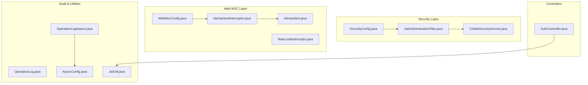

**Diagram sources**
- [SecurityConfig.java:39-61](file://admin-backend/src/main/java/com/qhiot/survey/security/SecurityConfig.java#L39-L61)
- [JwtAuthenticationFilter.java:37-81](file://admin-backend/src/main/java/com/qhiot/survey/security/JwtAuthenticationFilter.java#L37-L81)
- [CollabSecurityService.java:26-54](file://admin-backend/src/main/java/com/qhiot/survey/security/CollabSecurityService.java#L26-L54)
- [WebMvcConfig.java:18-27](file://admin-backend/src/main/java/com/qhiot/survey/config/WebMvcConfig.java#L18-L27)
- [IdempotentInterceptor.java:29-61](file://admin-backend/src/main/java/com/qhiot/survey/common/interceptor/IdempotentInterceptor.java#L29-L61)
- [Idempotent.java:12-23](file://admin-backend/src/main/java/com/qhiot/survey/common/annotation/Idempotent.java#L12-L23)
- [RateLimitInterceptor.java:31-54](file://admin-backend/src/main/java/com/qhiot/survey/common/RateLimitInterceptor.java#L31-L54)
- [OperationLogAspect.java:47-64](file://admin-backend/src/main/java/com/qhiot/survey/common/aspect/OperationLogAspect.java#L47-L64)
- [OperationLog.java:12-39](file://admin-backend/src/main/java/com/qhiot/survey/common/annotation/OperationLog.java#L12-L39)
- [AsyncConfig.java:24-50](file://admin-backend/src/main/java/com/qhiot/survey/config/AsyncConfig.java#L24-L50)
- [JwtUtil.java:34-85](file://admin-backend/src/main/java/com/qhiot/survey/common/util/JwtUtil.java#L34-L85)
- [AuthController.java:139-238](file://admin-backend/src/main/java/com/qhiot/survey/controller/AuthController.java#L139-L238)

**Section sources**
- [SecurityConfig.java:39-61](file://admin-backend/src/main/java/com/qhiot/survey/security/SecurityConfig.java#L39-L61)
- [WebMvcConfig.java:18-27](file://admin-backend/src/main/java/com/qhiot/survey/config/WebMvcConfig.java#L18-L27)

## Core Components
- Spring Security filter chain configuration with stateless session management, disabled CSRF/form login/basic auth, and CORS support
- JWT authentication filter validating tokens and establishing security context for internal users; special handling for collaboration tokens
- Collaboration security service enforcing a strict whitelist/blacklist policy for collaboration endpoints and writing access logs
- Idempotent interceptor leveraging Redis to prevent duplicate submissions via a one-time token mechanism
- Rate limit interceptor applying per-IP Guava RateLimiter to throttle requests
- Operation logging aspect capturing successful method executions asynchronously with user and request metadata
- JWT utilities supporting token generation, parsing, and claims extraction

**Section sources**
- [SecurityConfig.java:40-61](file://admin-backend/src/main/java/com/qhiot/survey/security/SecurityConfig.java#L40-L61)
- [JwtAuthenticationFilter.java:43-81](file://admin-backend/src/main/java/com/qhiot/survey/security/JwtAuthenticationFilter.java#L43-L81)
- [CollabSecurityService.java:36-105](file://admin-backend/src/main/java/com/qhiot/survey/security/CollabSecurityService.java#L36-L105)
- [IdempotentInterceptor.java:29-61](file://admin-backend/src/main/java/com/qhiot/survey/common/interceptor/IdempotentInterceptor.java#L29-L61)
- [RateLimitInterceptor.java:31-54](file://admin-backend/src/main/java/com/qhiot/survey/common/RateLimitInterceptor.java#L31-L54)
- [OperationLogAspect.java:56-182](file://admin-backend/src/main/java/com/qhiot/survey/common/aspect/OperationLogAspect.java#L56-L182)
- [JwtUtil.java:34-174](file://admin-backend/src/main/java/com/qhiot/survey/common/util/JwtUtil.java#L34-L174)

## Architecture Overview
The security pipeline integrates Spring Security’s filter chain with custom interceptors and aspects. Requests pass through CORS and encoding filters, JWT authentication, then MVC interceptors (idempotency and rate limiting), and finally reach controllers. Collaboration tokens are validated and audited separately, while operation logs are captured asynchronously.

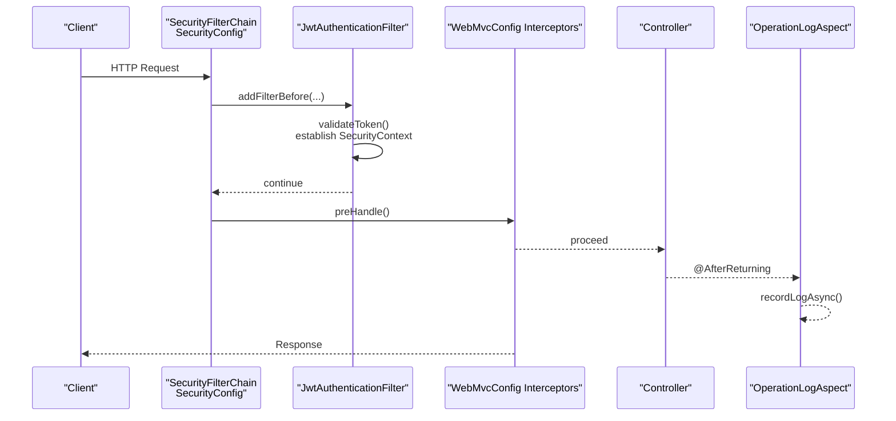

**Diagram sources**
- [SecurityConfig.java:57-58](file://admin-backend/src/main/java/com/qhiot/survey/security/SecurityConfig.java#L57-L58)
- [JwtAuthenticationFilter.java:43-81](file://admin-backend/src/main/java/com/qhiot/survey/security/JwtAuthenticationFilter.java#L43-L81)
- [WebMvcConfig.java:18-27](file://admin-backend/src/main/java/com/qhiot/survey/config/WebMvcConfig.java#L18-L27)
- [OperationLogAspect.java:56-64](file://admin-backend/src/main/java/com/qhiot/survey/common/aspect/OperationLogAspect.java#L56-L64)

## Detailed Component Analysis

### Spring Security Filter Chain and CORS/CSRF
- Stateless session management
- CSRF disabled; form login and HTTP basic disabled
- CORS configured with origin patterns, credentials allowed, exposed Authorization header, and max age
- Character encoding filter added early in the chain

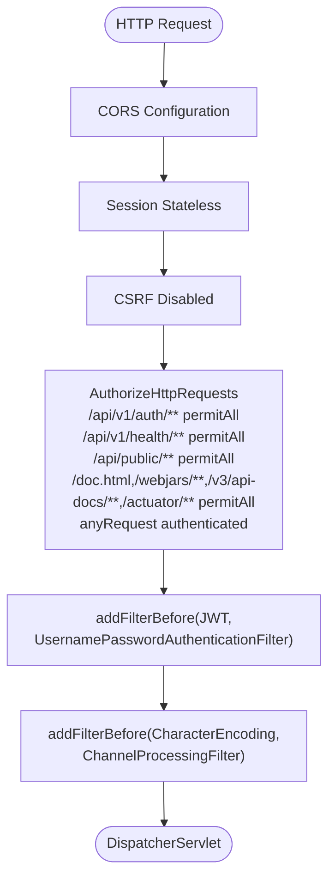

**Diagram sources**
- [SecurityConfig.java:40-61](file://admin-backend/src/main/java/com/qhiot/survey/security/SecurityConfig.java#L40-L61)
- [SecurityConfig.java:68-89](file://admin-backend/src/main/java/com/qhiot/survey/security/SecurityConfig.java#L68-L89)
- [SecurityConfig.java:91-97](file://admin-backend/src/main/java/com/qhiot/survey/security/SecurityConfig.java#L91-L97)

**Section sources**
- [SecurityConfig.java:40-61](file://admin-backend/src/main/java/com/qhiot/survey/security/SecurityConfig.java#L40-L61)
- [SecurityConfig.java:68-89](file://admin-backend/src/main/java/com/qhiot/survey/security/SecurityConfig.java#L68-L89)
- [SecurityConfig.java:91-97](file://admin-backend/src/main/java/com/qhiot/survey/security/SecurityConfig.java#L91-L97)

### JWT Authentication Filter
- Extracts Bearer token from Authorization header
- Validates token and determines login type
- For collaboration tokens:
  - Loads valid collaboration entry
  - Enforces whitelist/blacklist access policy
  - Establishes security context with a collaboration role
  - Logs access attempts and responses
- For internal tokens:
  - Loads UserDetails and sets authentication in SecurityContextHolder

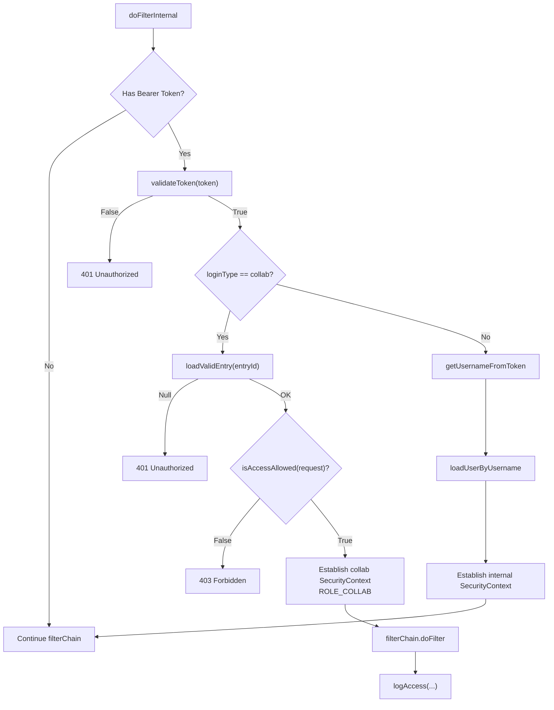

**Diagram sources**
- [JwtAuthenticationFilter.java:43-122](file://admin-backend/src/main/java/com/qhiot/survey/security/JwtAuthenticationFilter.java#L43-L122)
- [CollabSecurityService.java:36-105](file://admin-backend/src/main/java/com/qhiot/survey/security/CollabSecurityService.java#L36-L105)
- [JwtUtil.java:126-149](file://admin-backend/src/main/java/com/qhiot/survey/common/util/JwtUtil.java#L126-L149)

**Section sources**
- [JwtAuthenticationFilter.java:43-122](file://admin-backend/src/main/java/com/qhiot/survey/security/JwtAuthenticationFilter.java#L43-L122)
- [CollabSecurityService.java:36-105](file://admin-backend/src/main/java/com/qhiot/survey/security/CollabSecurityService.java#L36-L105)
- [JwtUtil.java:126-149](file://admin-backend/src/main/java/com/qhiot/survey/common/util/JwtUtil.java#L126-L149)

### Idempotent Interceptor
- Requires X-Idempotent-Token header for annotated methods
- Validates token against Redis; token is single-use and deleted after validation
- Exempts authentication and upload endpoints from idempotency checks

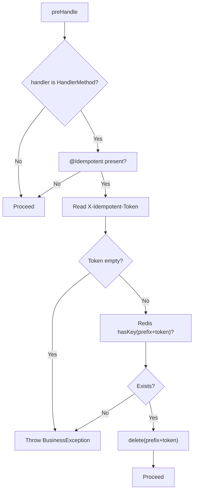

**Diagram sources**
- [IdempotentInterceptor.java:29-61](file://admin-backend/src/main/java/com/qhiot/survey/common/interceptor/IdempotentInterceptor.java#L29-L61)
- [WebMvcConfig.java:18-27](file://admin-backend/src/main/java/com/qhiot/survey/config/WebMvcConfig.java#L18-L27)
- [Idempotent.java:12-23](file://admin-backend/src/main/java/com/qhiot/survey/common/annotation/Idempotent.java#L12-L23)

**Section sources**
- [IdempotentInterceptor.java:29-61](file://admin-backend/src/main/java/com/qhiot/survey/common/interceptor/IdempotentInterceptor.java#L29-L61)
- [WebMvcConfig.java:18-27](file://admin-backend/src/main/java/com/qhiot/survey/config/WebMvcConfig.java#L18-L27)
- [Idempotent.java:12-23](file://admin-backend/src/main/java/com/qhiot/survey/common/annotation/Idempotent.java#L12-L23)

### Rate Limit Interceptor
- Applies per-IP Guava RateLimiter with a default permits-per-second
- Exempts authentication, public, and Swagger endpoints
- Returns 429 on exceeding quota

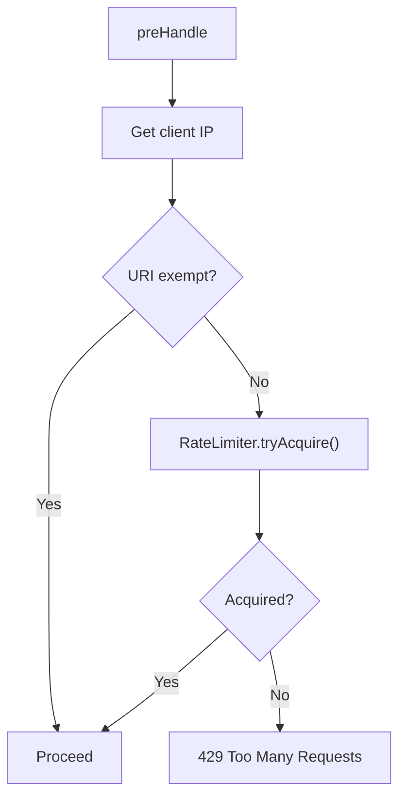

**Diagram sources**
- [RateLimitInterceptor.java:31-54](file://admin-backend/src/main/java/com/qhiot/survey/common/RateLimitInterceptor.java#L31-L54)

**Section sources**
- [RateLimitInterceptor.java:31-54](file://admin-backend/src/main/java/com/qhiot/survey/common/RateLimitInterceptor.java#L31-L54)

### Operation Logging Aspect
- Captures successful method executions annotated with @OperationLog
- Builds context from SecurityContextHolder and request attributes
- Asynchronously records logs using a dedicated thread pool

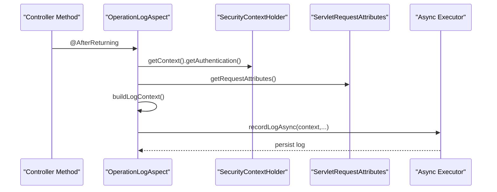

**Diagram sources**
- [OperationLogAspect.java:56-125](file://admin-backend/src/main/java/com/qhiot/survey/common/aspect/OperationLogAspect.java#L56-L125)
- [AsyncConfig.java:24-50](file://admin-backend/src/main/java/com/qhiot/survey/config/AsyncConfig.java#L24-L50)

**Section sources**
- [OperationLogAspect.java:56-182](file://admin-backend/src/main/java/com/qhiot/survey/common/aspect/OperationLogAspect.java#L56-L182)
- [AsyncConfig.java:24-50](file://admin-backend/src/main/java/com/qhiot/survey/config/AsyncConfig.java#L24-L50)

### Collaboration Security Policy
- Whitelist: GET access to read-only endpoints
- Blacklist: sensitive operations (audit pass/reject, exports, user/role/system/dict/log/collab/admin endpoints)
- DELETE is disallowed for collaboration tokens
- Access logs written regardless of outcome

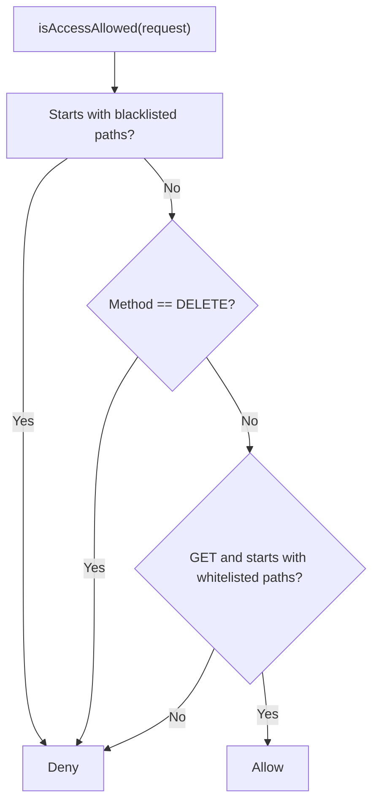

**Diagram sources**
- [CollabSecurityService.java:66-105](file://admin-backend/src/main/java/com/qhiot/survey/security/CollabSecurityService.java#L66-L105)

**Section sources**
- [CollabSecurityService.java:66-105](file://admin-backend/src/main/java/com/qhiot/survey/security/CollabSecurityService.java#L66-L105)

### JWT Utilities
- Generates access and refresh tokens with claims
- Supports collaboration tokens with loginType and collabEntryId
- Parses and validates tokens, extracts claims

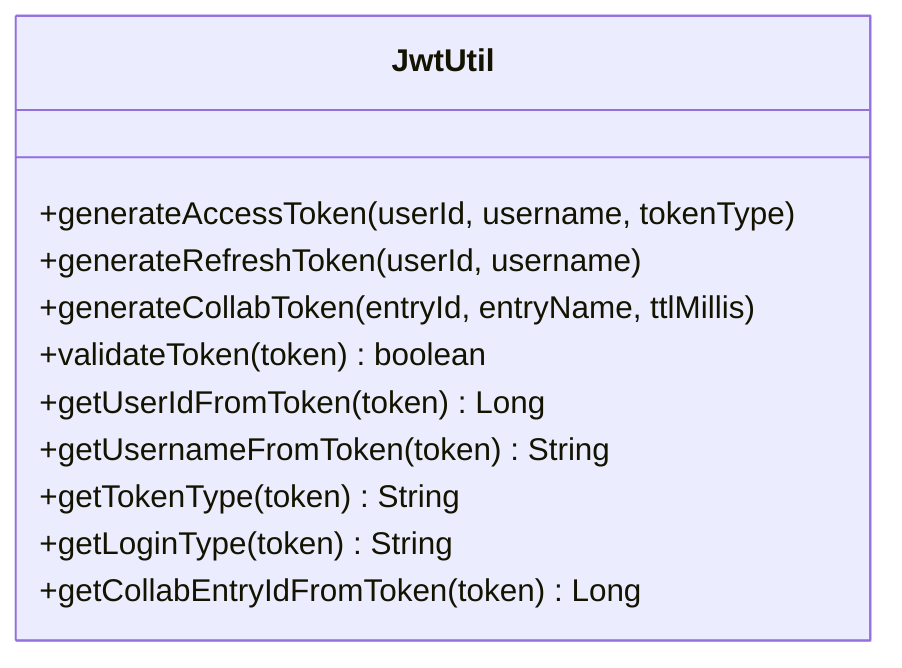

**Diagram sources**
- [JwtUtil.java:34-174](file://admin-backend/src/main/java/com/qhiot/survey/common/util/JwtUtil.java#L34-L174)

**Section sources**
- [JwtUtil.java:34-174](file://admin-backend/src/main/java/com/qhiot/survey/common/util/JwtUtil.java#L34-L174)

### Example: Auth Controller Integration
- Provides endpoints for login, SMS login, refresh, logout, and idempotent token retrieval
- Uses SecurityContextHolder to derive current user for protected operations
- Demonstrates JWT token issuance and usage

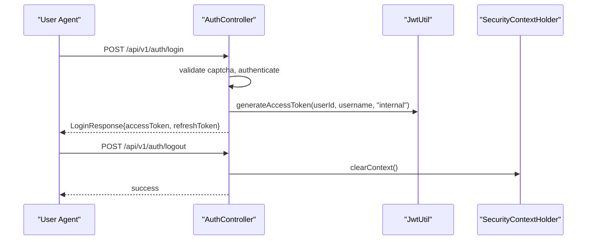

**Diagram sources**
- [AuthController.java:139-238](file://admin-backend/src/main/java/com/qhiot/survey/controller/AuthController.java#L139-L238)
- [JwtUtil.java:34-85](file://admin-backend/src/main/java/com/qhiot/survey/common/util/JwtUtil.java#L34-L85)

**Section sources**
- [AuthController.java:139-238](file://admin-backend/src/main/java/com/qhiot/survey/controller/AuthController.java#L139-L238)
- [JwtUtil.java:34-85](file://admin-backend/src/main/java/com/qhiot/survey/common/util/JwtUtil.java#L34-L85)

## Dependency Analysis
- SecurityConfig depends on JwtAuthenticationFilter and exposes CORS configuration and character encoding filter
- JwtAuthenticationFilter depends on JwtUtil, UserDetailsService, and CollabSecurityService
- CollabSecurityService depends on entry/access mappers and utilities for IP/UA extraction
- WebMvcConfig registers IdempotentInterceptor globally with exclusions
- OperationLogAspect depends on OperationLogService and AsyncConfig executor bean

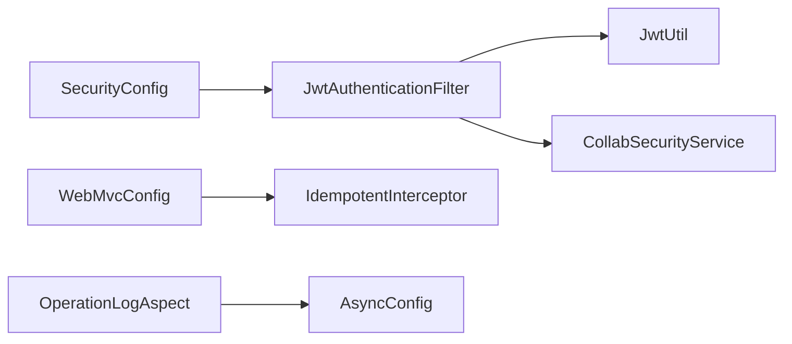

**Diagram sources**
- [SecurityConfig.java:34-37](file://admin-backend/src/main/java/com/qhiot/survey/security/SecurityConfig.java#L34-L37)
- [JwtAuthenticationFilter.java:39-41](file://admin-backend/src/main/java/com/qhiot/survey/security/JwtAuthenticationFilter.java#L39-L41)
- [WebMvcConfig.java:16](file://admin-backend/src/main/java/com/qhiot/survey/config/WebMvcConfig.java#L16)
- [OperationLogAspect.java:41](file://admin-backend/src/main/java/com/qhiot/survey/common/aspect/OperationLogAspect.java#L41)

**Section sources**
- [SecurityConfig.java:34-37](file://admin-backend/src/main/java/com/qhiot/survey/security/SecurityConfig.java#L34-L37)
- [JwtAuthenticationFilter.java:39-41](file://admin-backend/src/main/java/com/qhiot/survey/security/JwtAuthenticationFilter.java#L39-L41)
- [WebMvcConfig.java:16](file://admin-backend/src/main/java/com/qhiot/survey/config/WebMvcConfig.java#L16)
- [OperationLogAspect.java:41](file://admin-backend/src/main/java/com/qhiot/survey/common/aspect/OperationLogAspect.java#L41)

## Performance Considerations
- Filter ordering matters: ensure encoding filter runs before channel processing and JWT filter runs before standard username/password filter
- Stateless sessions reduce overhead; avoid session creation policies
- Use asynchronous operation logging to avoid blocking request threads
- Tune rate limiter permits-per-second and consider per-endpoint limits if needed
- Prefer Redis-backed idempotency tokens with short TTLs to minimize stale keys

[No sources needed since this section provides general guidance]

## Troubleshooting Guide
Common issues and remedies:
- 401 Unauthorized during JWT flow:
  - Verify Authorization header format and token validity
  - Check token claims and expiration
  - Confirm loginType and collaboration entry for collaboration tokens
- 403 Forbidden for collaboration endpoints:
  - Review collaboration access policy and request method/path
- 429 Too Many Requests:
  - Inspect client IP routing and rate limiter thresholds
- Idempotency failures:
  - Ensure X-Idempotent-Token is present and valid
  - Confirm token deletion after first use
- Operation logs not recorded:
  - Verify @OperationLog presence and successful method completion
  - Check async executor configuration and thread pool health

**Section sources**
- [JwtAuthenticationFilter.java:72-78](file://admin-backend/src/main/java/com/qhiot/survey/security/JwtAuthenticationFilter.java#L72-L78)
- [CollabSecurityService.java:66-105](file://admin-backend/src/main/java/com/qhiot/survey/security/CollabSecurityService.java#L66-L105)
- [RateLimitInterceptor.java:45-50](file://admin-backend/src/main/java/com/qhiot/survey/common/RateLimitInterceptor.java#L45-L50)
- [IdempotentInterceptor.java:42-57](file://admin-backend/src/main/java/com/qhiot/survey/common/interceptor/IdempotentInterceptor.java#L42-L57)
- [OperationLogAspect.java:56-64](file://admin-backend/src/main/java/com/qhiot/survey/common/aspect/OperationLogAspect.java#L56-L64)

## Conclusion
The security system combines Spring Security’s filter chain with custom JWT authentication, collaboration-specific controls, and complementary interceptors for idempotency and rate limiting. Asynchronous operation logging ensures audit trails without impacting latency. Proper configuration of CORS, CSRF, and filter ordering, along with careful tuning of rate limits and idempotency tokens, delivers a robust and performant security posture.