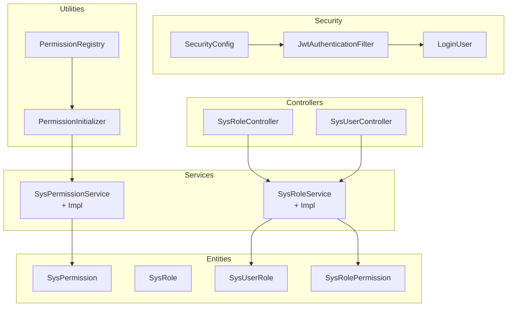
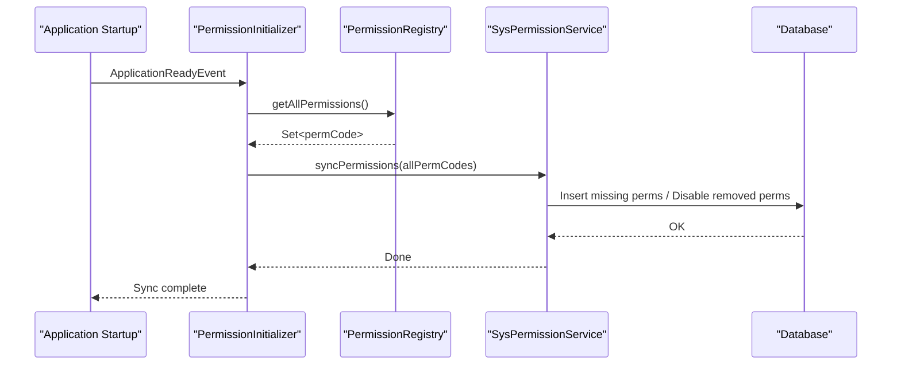
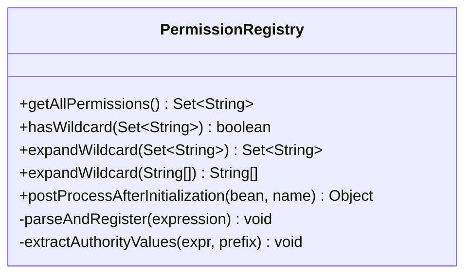
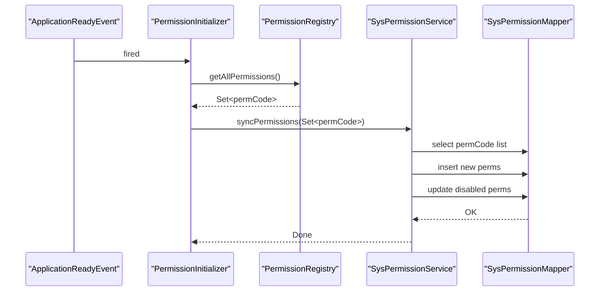
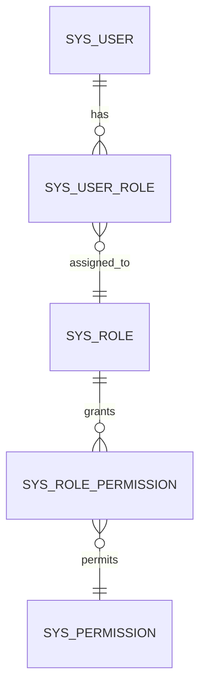
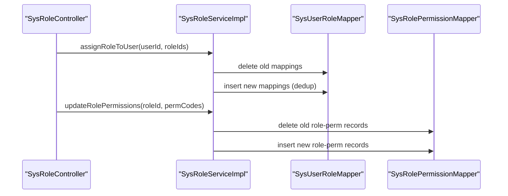
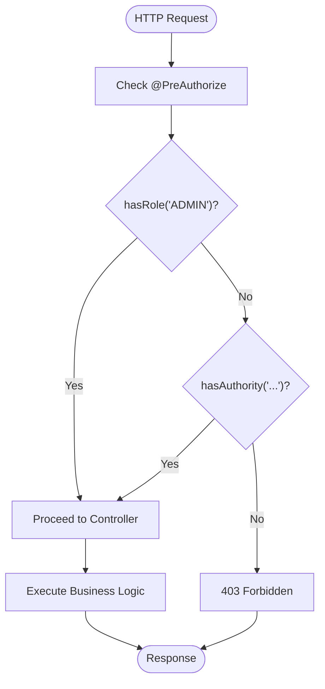
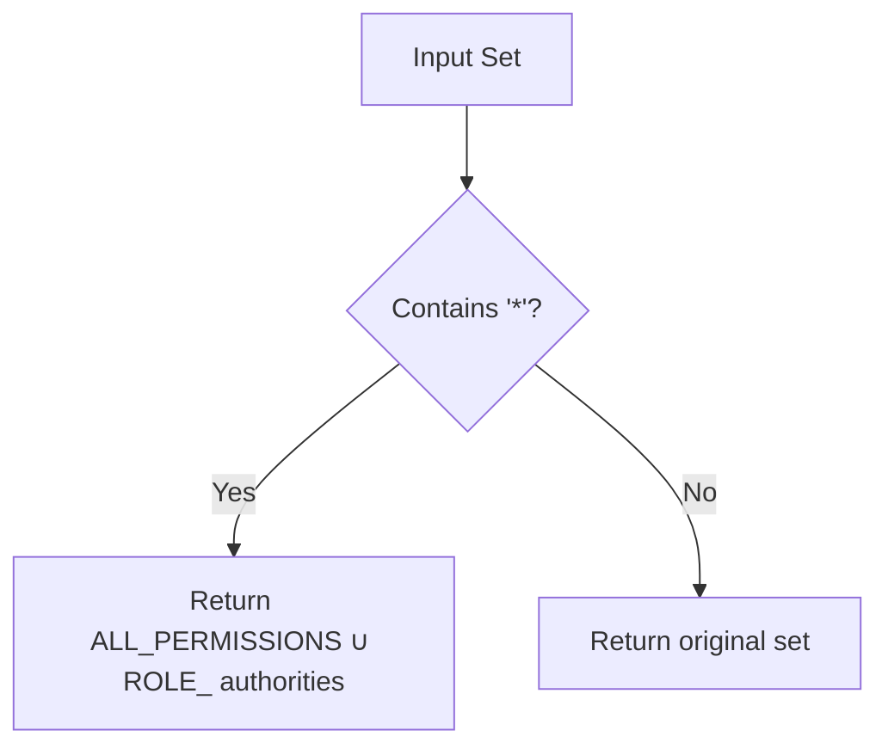
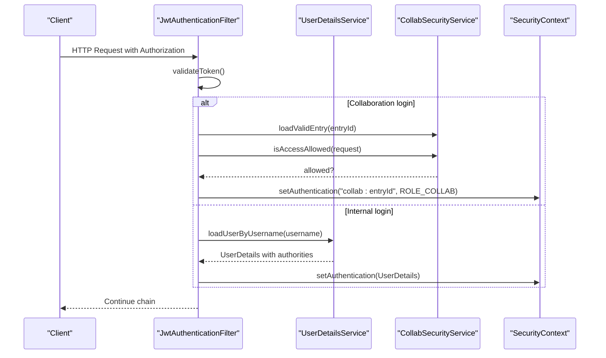
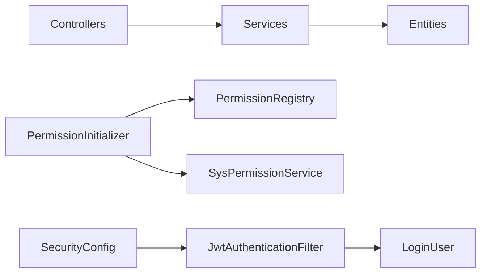

# User Roles & Permissions

<cite>
**Referenced Files in This Document**
- [Permissions.java](file://admin-backend/src/main/java/com/qhiot/survey/common/constant/Permissions.java)
- [PermissionRegistry.java](file://admin-backend/src/main/java/com/qhiot/survey/common/util/PermissionRegistry.java)
- [PermissionInitializer.java](file://admin-backend/src/main/java/com/qhiot/survey/common/init/PermissionInitializer.java)
- [SysPermission.java](file://admin-backend/src/main/java/com/qhiot/survey/entity/SysPermission.java)
- [SysRole.java](file://admin-backend/src/main/java/com/qhiot/survey/entity/SysRole.java)
- [SysUserRole.java](file://admin-backend/src/main/java/com/qhiot/survey/entity/SysUserRole.java)
- [SysRolePermission.java](file://admin-backend/src/main/java/com/qhiot/survey/entity/SysRolePermission.java)
- [SysRoleService.java](file://admin-backend/src/main/java/com/qhiot/survey/service/SysRoleService.java)
- [SysPermissionService.java](file://admin-backend/src/main/java/com/qhiot/survey/service/SysPermissionService.java)
- [SysRoleServiceImpl.java](file://admin-backend/src/main/java/com/qhiot/survey/service/impl/SysRoleServiceImpl.java)
- [SysPermissionServiceImpl.java](file://admin-backend/src/main/java/com/qhiot/survey/service/impl/SysPermissionServiceImpl.java)
- [SysRoleController.java](file://admin-backend/src/main/java/com/qhiot/survey/controller/SysRoleController.java)
- [SysUserController.java](file://admin-backend/src/main/java/com/qhiot/survey/controller/SysUserController.java)
- [SecurityConfig.java](file://admin-backend/src/main/java/com/qhiot/survey/security/SecurityConfig.java)
- [JwtAuthenticationFilter.java](file://admin-backend/src/main/java/com/qhiot/survey/security/JwtAuthenticationFilter.java)
- [LoginUser.java](file://admin-backend/src/main/java/com/qhiot/survey/security/LoginUser.java)
</cite>

## Table of Contents
1. [Introduction](#introduction)
2. [Project Structure](#project-structure)
3. [Core Components](#core-components)
4. [Architecture Overview](#architecture-overview)
5. [Detailed Component Analysis](#detailed-component-analysis)
6. [Dependency Analysis](#dependency-analysis)
7. [Performance Considerations](#performance-considerations)
8. [Troubleshooting Guide](#troubleshooting-guide)
9. [Conclusion](#conclusion)

## Introduction
This document describes the user role and permission management system, focusing on Role-Based Access Control (RBAC), permission inheritance, and access control enforcement. It explains the hierarchical role structure, many-to-many relationships among users, roles, and permissions, and how permissions are registered, synchronized, and enforced at runtime. It also covers method-level security annotations, dynamic permission evaluation, and security auditing.

## Project Structure
The RBAC subsystem spans several layers:
- Entities define the persistence model for permissions, roles, and associations.
- Services encapsulate business logic for role and permission management.
- Controllers expose administrative endpoints guarded by method-level security.
- Security configuration enables method security and JWT-based authentication.
- Utilities register and synchronize permissions across the application lifecycle.

**Diagram sources**
- [SysRoleController.java:1-138](file://admin-backend/src/main/java/com/qhiot/survey/controller/SysRoleController.java#L1-L138)
- [SysUserController.java:1-263](file://admin-backend/src/main/java/com/qhiot/survey/controller/SysUserController.java#L1-L263)
- [SysRoleService.java:1-64](file://admin-backend/src/main/java/com/qhiot/survey/service/SysRoleService.java#L1-L64)
- [SysPermissionService.java:1-35](file://admin-backend/src/main/java/com/qhiot/survey/service/SysPermissionService.java#L1-L35)
- [SysRoleServiceImpl.java:1-225](file://admin-backend/src/main/java/com/qhiot/survey/service/impl/SysRoleServiceImpl.java#L1-L225)
- [SysPermissionServiceImpl.java:1-94](file://admin-backend/src/main/java/com/qhiot/survey/service/impl/SysPermissionServiceImpl.java#L1-L94)
- [SysPermission.java:1-56](file://admin-backend/src/main/java/com/qhiot/survey/entity/SysPermission.java#L1-L56)
- [SysRole.java:1-40](file://admin-backend/src/main/java/com/qhiot/survey/entity/SysRole.java#L1-L40)
- [SysUserRole.java:1-26](file://admin-backend/src/main/java/com/qhiot/survey/entity/SysUserRole.java#L1-L26)
- [SysRolePermission.java:1-34](file://admin-backend/src/main/java/com/qhiot/survey/entity/SysRolePermission.java#L1-L34)
- [SecurityConfig.java:1-99](file://admin-backend/src/main/java/com/qhiot/survey/security/SecurityConfig.java#L1-L99)
- [JwtAuthenticationFilter.java:1-135](file://admin-backend/src/main/java/com/qhiot/survey/security/JwtAuthenticationFilter.java#L1-L135)
- [LoginUser.java:1-36](file://admin-backend/src/main/java/com/qhiot/survey/security/LoginUser.java#L1-L36)
- [PermissionRegistry.java:1-175](file://admin-backend/src/main/java/com/qhiot/survey/common/util/PermissionRegistry.java#L1-L175)
- [PermissionInitializer.java:1-38](file://admin-backend/src/main/java/com/qhiot/survey/common/init/PermissionInitializer.java#L1-L38)

**Section sources**
- [SysRoleController.java:1-138](file://admin-backend/src/main/java/com/qhiot/survey/controller/SysRoleController.java#L1-L138)
- [SysUserController.java:1-263](file://admin-backend/src/main/java/com/qhiot/survey/controller/SysUserController.java#L1-L263)
- [SysRoleService.java:1-64](file://admin-backend/src/main/java/com/qhiot/survey/service/SysRoleService.java#L1-L64)
- [SysPermissionService.java:1-35](file://admin-backend/src/main/java/com/qhiot/survey/service/SysPermissionService.java#L1-L35)
- [SysRoleServiceImpl.java:1-225](file://admin-backend/src/main/java/com/qhiot/survey/service/impl/SysRoleServiceImpl.java#L1-L225)
- [SysPermissionServiceImpl.java:1-94](file://admin-backend/src/main/java/com/qhiot/survey/service/impl/SysPermissionServiceImpl.java#L1-L94)
- [SysPermission.java:1-56](file://admin-backend/src/main/java/com/qhiot/survey/entity/SysPermission.java#L1-L56)
- [SysRole.java:1-40](file://admin-backend/src/main/java/com/qhiot/survey/entity/SysRole.java#L1-L40)
- [SysUserRole.java:1-26](file://admin-backend/src/main/java/com/qhiot/survey/entity/SysUserRole.java#L1-L26)
- [SysRolePermission.java:1-34](file://admin-backend/src/main/java/com/qhiot/survey/entity/SysRolePermission.java#L1-L34)
- [SecurityConfig.java:1-99](file://admin-backend/src/main/java/com/qhiot/survey/security/SecurityConfig.java#L1-L99)
- [JwtAuthenticationFilter.java:1-135](file://admin-backend/src/main/java/com/qhiot/survey/security/JwtAuthenticationFilter.java#L1-L135)
- [LoginUser.java:1-36](file://admin-backend/src/main/java/com/qhiot/survey/security/LoginUser.java#L1-L36)
- [PermissionRegistry.java:1-175](file://admin-backend/src/main/java/com/qhiot/survey/common/util/PermissionRegistry.java#L1-L175)
- [PermissionInitializer.java:1-38](file://admin-backend/src/main/java/com/qhiot/survey/common/init/PermissionInitializer.java#L1-L38)

## Core Components
- Permission registry and initializer: Collects permissions from annotations and synchronizes them to the database.
- Permission and role entities: Define persisted permission metadata and role configurations.
- Role and permission association entities: Track many-to-many relationships and role-permission bindings.
- Role and permission services: Provide CRUD, assignment, and synchronization operations.
- Controllers: Expose administrative endpoints guarded by method-level security.
- Security configuration: Enables method security and JWT authentication.

Key responsibilities:
- PermissionRegistry scans controllers for @PreAuthorize expressions and registers permission codes.
- PermissionInitializer runs after application startup to persist current permission set to sys_permission.
- SysPermissionService syncs permission codes: inserts missing ones and disables removed ones.
- SysRoleService manages role lifecycle, user-role assignments, and role-permission updates.
- Controllers enforce RBAC via @PreAuthorize("hasRole(...)" and @PreAuthorize("hasAuthority(...)").

**Section sources**
- [PermissionRegistry.java:1-175](file://admin-backend/src/main/java/com/qhiot/survey/common/util/PermissionRegistry.java#L1-L175)
- [PermissionInitializer.java:1-38](file://admin-backend/src/main/java/com/qhiot/survey/common/init/PermissionInitializer.java#L1-L38)
- [SysPermissionService.java:1-35](file://admin-backend/src/main/java/com/qhiot/survey/service/SysPermissionService.java#L1-L35)
- [SysPermissionServiceImpl.java:1-94](file://admin-backend/src/main/java/com/qhiot/survey/service/impl/SysPermissionServiceImpl.java#L1-L94)
- [SysRoleService.java:1-64](file://admin-backend/src/main/java/com/qhiot/survey/service/SysRoleService.java#L1-L64)
- [SysRoleServiceImpl.java:1-225](file://admin-backend/src/main/java/com/qhiot/survey/service/impl/SysRoleServiceImpl.java#L1-L225)
- [SysRoleController.java:1-138](file://admin-backend/src/main/java/com/qhiot/survey/controller/SysRoleController.java#L1-L138)
- [SysUserController.java:1-263](file://admin-backend/src/main/java/com/qhiot/survey/controller/SysUserController.java#L1-L263)
- [SecurityConfig.java:1-99](file://admin-backend/src/main/java/com/qhiot/survey/security/SecurityConfig.java#L1-L99)

## Architecture Overview
The RBAC architecture integrates compile-time permission declarations with runtime enforcement:
- Permission declaration: Centralized permission constants and @PreAuthorize annotations.
- Permission registration: PermissionRegistry extracts permission codes from annotations.
- Permission synchronization: PermissionInitializer triggers SysPermissionService to keep sys_permission consistent.
- Runtime enforcement: SecurityConfig enables method security; JwtAuthenticationFilter authenticates requests and populates authorities.

**Diagram sources**
- [PermissionInitializer.java:1-38](file://admin-backend/src/main/java/com/qhiot/survey/common/init/PermissionInitializer.java#L1-L38)
- [PermissionRegistry.java:1-175](file://admin-backend/src/main/java/com/qhiot/survey/common/util/PermissionRegistry.java#L1-L175)
- [SysPermissionServiceImpl.java:1-94](file://admin-backend/src/main/java/com/qhiot/survey/service/impl/SysPermissionServiceImpl.java#L1-L94)

**Section sources**
- [PermissionInitializer.java:1-38](file://admin-backend/src/main/java/com/qhiot/survey/common/init/PermissionInitializer.java#L1-L38)
- [PermissionRegistry.java:1-175](file://admin-backend/src/main/java/com/qhiot/survey/common/util/PermissionRegistry.java#L1-L175)
- [SysPermissionServiceImpl.java:1-94](file://admin-backend/src/main/java/com/qhiot/survey/service/impl/SysPermissionServiceImpl.java#L1-L94)

## Detailed Component Analysis

### Permission Registry and Dynamic Registration
- Purpose: Discover and register permission codes from @PreAuthorize annotations at startup.
- Behavior:
  - Scans @RestController beans and inspects methods for @PreAuthorize.
  - Extracts hasAuthority and hasAnyAuthority values, ignoring ROLE_ prefixes and wildcards.
  - Stores discovered codes in a concurrent set and logs a summary.
- Wildcard support:
  - Recognizes a special wildcard marker to indicate broad access.
  - Provides expansion utilities to convert wildcard sets into full permission sets.

**Diagram sources**
- [PermissionRegistry.java:1-175](file://admin-backend/src/main/java/com/qhiot/survey/common/util/PermissionRegistry.java#L1-L175)

**Section sources**
- [PermissionRegistry.java:1-175](file://admin-backend/src/main/java/com/qhiot/survey/common/util/PermissionRegistry.java#L1-L175)

### Permission Initialization and Synchronization
- Purpose: Persist current permission set to sys_permission after application startup.
- Behavior:
  - On ApplicationReadyEvent, collects all registered permission codes.
  - Calls SysPermissionService.syncPermissions to insert missing entries and disable removed ones.
  - Logs warnings if no permissions are found and errors on exceptions.

**Diagram sources**
- [PermissionInitializer.java:1-38](file://admin-backend/src/main/java/com/qhiot/survey/common/init/PermissionInitializer.java#L1-L38)
- [SysPermissionServiceImpl.java:1-94](file://admin-backend/src/main/java/com/qhiot/survey/service/impl/SysPermissionServiceImpl.java#L1-L94)

**Section sources**
- [PermissionInitializer.java:1-38](file://admin-backend/src/main/java/com/qhiot/survey/common/init/PermissionInitializer.java#L1-L38)
- [SysPermissionServiceImpl.java:1-94](file://admin-backend/src/main/java/com/qhiot/survey/service/impl/SysPermissionServiceImpl.java#L1-L94)

### Permission Model and Many-to-Many Associations
- Entities:
  - SysPermission: persisted permission metadata (code, module, name, description, status).
  - SysRole: persisted role metadata (code, name, permissions JSON array, status, sort).
  - SysUserRole: many-to-many mapping between users and roles.
  - SysRolePermission: many-to-many mapping between roles and permissions.
- Relationships:
  - Users ↔ Roles: many-to-many via SysUserRole.
  - Roles ↔ Permissions: many-to-many via SysRolePermission and SysRole.permissions.

**Diagram sources**
- [SysUserRole.java:1-26](file://admin-backend/src/main/java/com/qhiot/survey/entity/SysUserRole.java#L1-L26)
- [SysRole.java:1-40](file://admin-backend/src/main/java/com/qhiot/survey/entity/SysRole.java#L1-L40)
- [SysRolePermission.java:1-34](file://admin-backend/src/main/java/com/qhiot/survey/entity/SysRolePermission.java#L1-L34)
- [SysPermission.java:1-56](file://admin-backend/src/main/java/com/qhiot/survey/entity/SysPermission.java#L1-L56)

**Section sources**
- [SysUserRole.java:1-26](file://admin-backend/src/main/java/com/qhiot/survey/entity/SysUserRole.java#L1-L26)
- [SysRole.java:1-40](file://admin-backend/src/main/java/com/qhiot/survey/entity/SysRole.java#L1-L40)
- [SysRolePermission.java:1-34](file://admin-backend/src/main/java/com/qhiot/survey/entity/SysRolePermission.java#L1-L34)
- [SysPermission.java:1-56](file://admin-backend/src/main/java/com/qhiot/survey/entity/SysPermission.java#L1-L56)

### Role Management and Permission Assignment
- Responsibilities:
  - Create/update/delete roles and toggle status.
  - Assign roles to users (supports multi-role assignment).
  - Retrieve role permissions and update role-permission configuration.
- Implementation highlights:
  - Role-permission updates write to both SysRole.permissions (legacy JSON) and SysRolePermission (normalized table).
  - Role assignment clears old mappings and re-inserts new ones, deduplicating inputs defensively.

**Diagram sources**
- [SysRoleController.java:1-138](file://admin-backend/src/main/java/com/qhiot/survey/controller/SysRoleController.java#L1-L138)
- [SysRoleServiceImpl.java:1-225](file://admin-backend/src/main/java/com/qhiot/survey/service/impl/SysRoleServiceImpl.java#L1-L225)
- [SysUserRole.java:1-26](file://admin-backend/src/main/java/com/qhiot/survey/entity/SysUserRole.java#L1-L26)
- [SysRolePermission.java:1-34](file://admin-backend/src/main/java/com/qhiot/survey/entity/SysRolePermission.java#L1-L34)

**Section sources**
- [SysRoleController.java:1-138](file://admin-backend/src/main/java/com/qhiot/survey/controller/SysRoleController.java#L1-L138)
- [SysRoleServiceImpl.java:1-225](file://admin-backend/src/main/java/com/qhiot/survey/service/impl/SysRoleServiceImpl.java#L1-L225)

### Permission Checking in Controllers and Method-Level Security
- Controllers enforce RBAC using @PreAuthorize:
  - Administrative endpoints require ADMIN role.
  - Feature endpoints require specific authority codes (e.g., hasAuthority('...')).
- Permission constants centralize authority codes for consistent enforcement.

**Diagram sources**
- [SysRoleController.java:1-138](file://admin-backend/src/main/java/com/qhiot/survey/controller/SysRoleController.java#L1-L138)
- [SysUserController.java:1-263](file://admin-backend/src/main/java/com/qhiot/survey/controller/SysUserController.java#L1-L263)
- [Permissions.java:1-81](file://admin-backend/src/main/java/com/qhiot/survey/common/constant/Permissions.java#L1-L81)

**Section sources**
- [SysRoleController.java:1-138](file://admin-backend/src/main/java/com/qhiot/survey/controller/SysRoleController.java#L1-L138)
- [SysUserController.java:1-263](file://admin-backend/src/main/java/com/qhiot/survey/controller/SysUserController.java#L1-L263)
- [Permissions.java:1-81](file://admin-backend/src/main/java/com/qhiot/survey/common/constant/Permissions.java#L1-L81)

### Dynamic Permission Evaluation and Wildcard Expansion
- Wildcard semantics:
  - A special wildcard marker indicates broad access.
  - Expansion utilities convert wildcard sets into full permission sets while preserving ROLE_ authorities.
- Use cases:
  - Administrators may be granted wildcard access.
  - UI and admin tools can dynamically compute effective permissions for a user.

**Diagram sources**
- [PermissionRegistry.java:1-175](file://admin-backend/src/main/java/com/qhiot/survey/common/util/PermissionRegistry.java#L1-L175)

**Section sources**
- [PermissionRegistry.java:1-175](file://admin-backend/src/main/java/com/qhiot/survey/common/util/PermissionRegistry.java#L1-L175)

### Security Configuration and Authentication Flow
- SecurityConfig:
  - Enables method security and configures stateless JWT authentication.
  - Defines public endpoints and requires authentication for others.
- JwtAuthenticationFilter:
  - Extracts Authorization Bearer tokens and validates them.
  - Supports internal login and collaboration login types.
  - Populates SecurityContext with authorities derived from user roles and permissions.

**Diagram sources**
- [SecurityConfig.java:1-99](file://admin-backend/src/main/java/com/qhiot/survey/security/SecurityConfig.java#L1-L99)
- [JwtAuthenticationFilter.java:1-135](file://admin-backend/src/main/java/com/qhiot/survey/security/JwtAuthenticationFilter.java#L1-L135)
- [LoginUser.java:1-36](file://admin-backend/src/main/java/com/qhiot/survey/security/LoginUser.java#L1-L36)

**Section sources**
- [SecurityConfig.java:1-99](file://admin-backend/src/main/java/com/qhiot/survey/security/SecurityConfig.java#L1-L99)
- [JwtAuthenticationFilter.java:1-135](file://admin-backend/src/main/java/com/qhiot/survey/security/JwtAuthenticationFilter.java#L1-L135)
- [LoginUser.java:1-36](file://admin-backend/src/main/java/com/qhiot/survey/security/LoginUser.java#L1-L36)

## Dependency Analysis
- Coupling:
  - Controllers depend on services for role and permission operations.
  - Services depend on mappers for persistence and on each other for composite operations.
  - PermissionInitializer depends on PermissionRegistry and SysPermissionService.
- Cohesion:
  - Entities encapsulate persistence concerns.
  - Services encapsulate business rules for RBAC operations.
  - Utilities encapsulate cross-cutting concerns like permission discovery and synchronization.
- External dependencies:
  - Spring Security for method security and JWT filters.
  - MyBatis-Plus for data access.

**Diagram sources**
- [SysRoleController.java:1-138](file://admin-backend/src/main/java/com/qhiot/survey/controller/SysRoleController.java#L1-L138)
- [SysUserController.java:1-263](file://admin-backend/src/main/java/com/qhiot/survey/controller/SysUserController.java#L1-L263)
- [SysRoleServiceImpl.java:1-225](file://admin-backend/src/main/java/com/qhiot/survey/service/impl/SysRoleServiceImpl.java#L1-L225)
- [SysPermissionServiceImpl.java:1-94](file://admin-backend/src/main/java/com/qhiot/survey/service/impl/SysPermissionServiceImpl.java#L1-L94)
- [PermissionInitializer.java:1-38](file://admin-backend/src/main/java/com/qhiot/survey/common/init/PermissionInitializer.java#L1-L38)
- [PermissionRegistry.java:1-175](file://admin-backend/src/main/java/com/qhiot/survey/common/util/PermissionRegistry.java#L1-L175)
- [SecurityConfig.java:1-99](file://admin-backend/src/main/java/com/qhiot/survey/security/SecurityConfig.java#L1-L99)
- [JwtAuthenticationFilter.java:1-135](file://admin-backend/src/main/java/com/qhiot/survey/security/JwtAuthenticationFilter.java#L1-L135)
- [LoginUser.java:1-36](file://admin-backend/src/main/java/com/qhiot/survey/security/LoginUser.java#L1-L36)

**Section sources**
- [SysRoleController.java:1-138](file://admin-backend/src/main/java/com/qhiot/survey/controller/SysRoleController.java#L1-L138)
- [SysUserController.java:1-263](file://admin-backend/src/main/java/com/qhiot/survey/controller/SysUserController.java#L1-L263)
- [SysRoleServiceImpl.java:1-225](file://admin-backend/src/main/java/com/qhiot/survey/service/impl/SysRoleServiceImpl.java#L1-L225)
- [SysPermissionServiceImpl.java:1-94](file://admin-backend/src/main/java/com/qhiot/survey/service/impl/SysPermissionServiceImpl.java#L1-L94)
- [PermissionInitializer.java:1-38](file://admin-backend/src/main/java/com/qhiot/survey/common/init/PermissionInitializer.java#L1-L38)
- [PermissionRegistry.java:1-175](file://admin-backend/src/main/java/com/qhiot/survey/common/util/PermissionRegistry.java#L1-L175)
- [SecurityConfig.java:1-99](file://admin-backend/src/main/java/com/qhiot/survey/security/SecurityConfig.java#L1-L99)
- [JwtAuthenticationFilter.java:1-135](file://admin-backend/src/main/java/com/qhiot/survey/security/JwtAuthenticationFilter.java#L1-L135)
- [LoginUser.java:1-36](file://admin-backend/src/main/java/com/qhiot/survey/security/LoginUser.java#L1-L36)

## Performance Considerations
- Permission lookup:
  - Authorities are populated from user roles during authentication; subsequent checks are in-memory.
- Role assignment:
  - Batch deletion and insertion are used to minimize churn; deduplication reduces redundant writes.
- Permission synchronization:
  - Incremental insert/disable minimizes write overhead by comparing against existing codes.
- Recommendations:
  - Cache frequently accessed permission sets per user if the number of permissions grows large.
  - Consider indexing sys_role_permission.permCode and sys_permission.permCode for faster lookups.

[No sources needed since this section provides general guidance]

## Troubleshooting Guide
- No permissions found during initialization:
  - Symptom: Warning logged indicating empty permission set.
  - Action: Verify @PreAuthorize annotations are present and controllers are annotated with @RestController so they are scanned.
- Unauthorized access despite correct role:
  - Symptom: 403 Forbidden.
  - Action: Confirm endpoint uses hasAuthority with the correct code; ensure the user’s roles include the permission or wildcard.
- Role deletion fails:
  - Symptom: Business exception indicating the role is in use.
  - Action: Remove users from the role before deleting.
- Permission synchronization discrepancies:
  - Symptom: Missing or stale permissions in UI.
  - Action: Ensure application started successfully and PermissionInitializer ran; verify sys_permission reflects expected codes.

**Section sources**
- [PermissionInitializer.java:1-38](file://admin-backend/src/main/java/com/qhiot/survey/common/init/PermissionInitializer.java#L1-L38)
- [SysRoleServiceImpl.java:1-225](file://admin-backend/src/main/java/com/qhiot/survey/service/impl/SysRoleServiceImpl.java#L1-L225)
- [SysPermissionServiceImpl.java:1-94](file://admin-backend/src/main/java/com/qhiot/survey/service/impl/SysPermissionServiceImpl.java#L1-L94)

## Conclusion
The system implements a robust RBAC model with:
- Clear separation of concerns across entities, services, controllers, and utilities.
- Automatic discovery and synchronization of permissions from code to database.
- Strong method-level security enforcement and flexible wildcard semantics.
- Comprehensive many-to-many relationships enabling fine-grained access control.
This foundation supports scalable role and permission management with maintainable governance and auditable operations.