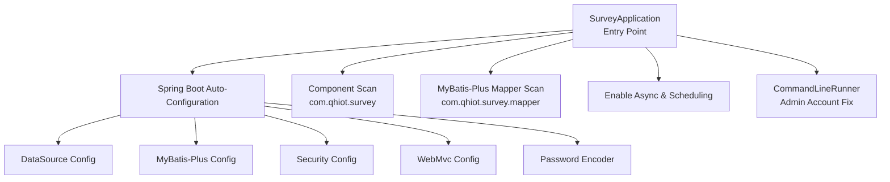
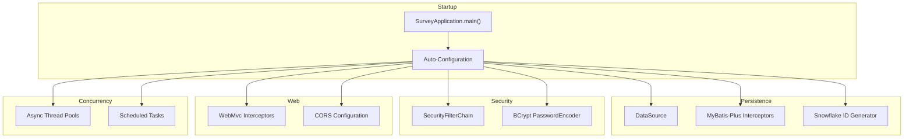
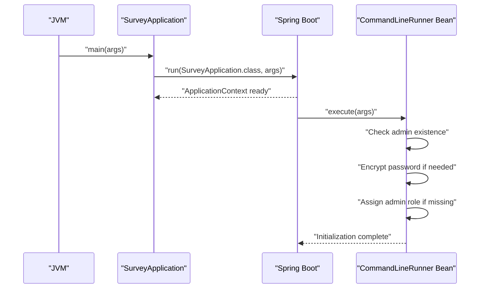
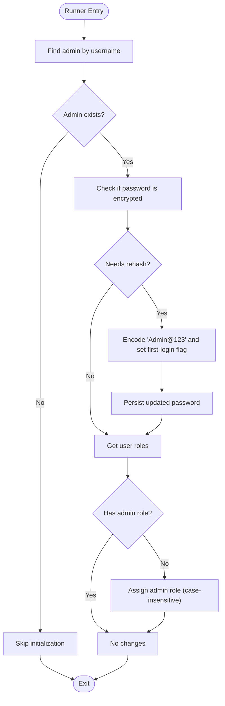
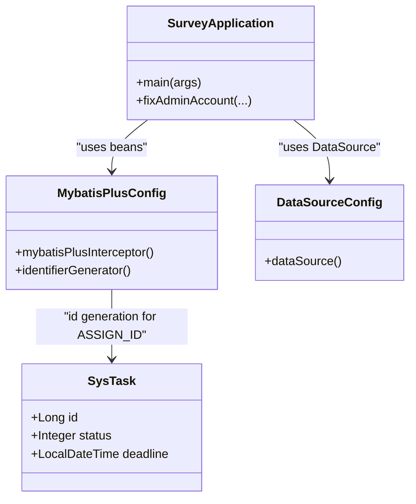
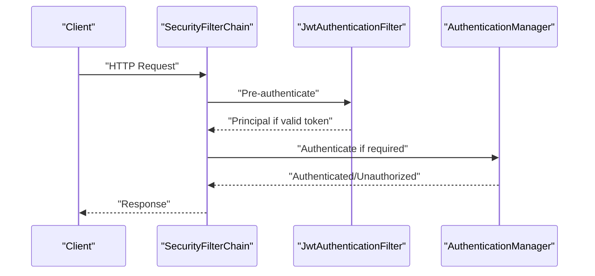
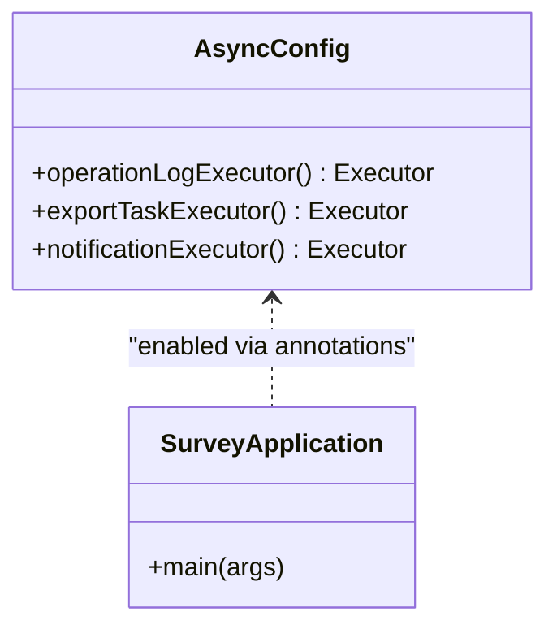
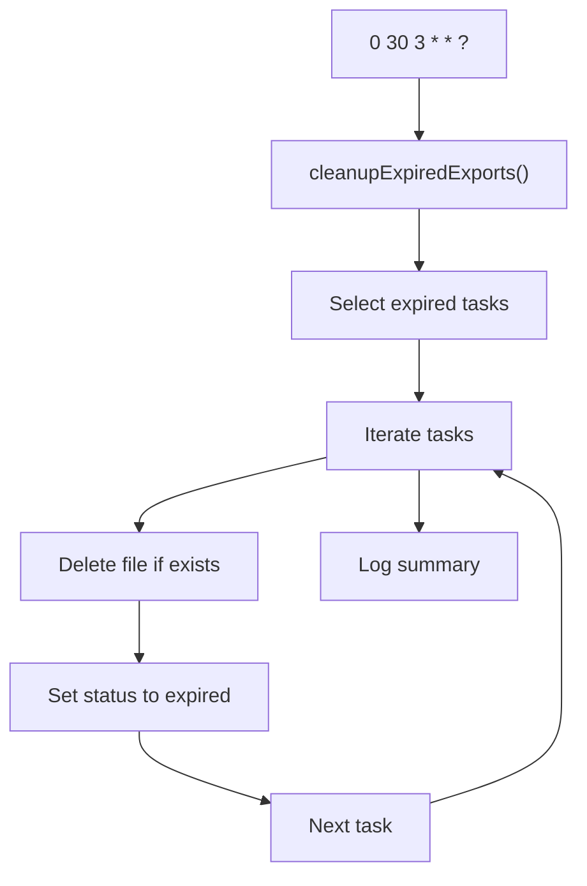
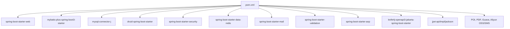

# Application Entry Point

<cite>
**Referenced Files in This Document**
- [SurveyApplication.java](file://admin-backend/src/main/java/com/qhiot/survey/SurveyApplication.java)
- [application.yml](file://admin-backend/src/main/resources/application.yml)
- [application-prod.yml](file://admin-backend/src/main/resources/application-prod.yml)
- [MybatisPlusConfig.java](file://admin-backend/src/main/java/com/qhiot/survey/config/MybatisPlusConfig.java)
- [AsyncConfig.java](file://admin-backend/src/main/java/com/qhiot/survey/config/AsyncConfig.java)
- [DataSourceConfig.java](file://admin-backend/src/main/java/com/qhiot/survey/config/DataSourceConfig.java)
- [SecurityConfig.java](file://admin-backend/src/main/java/com/qhiot/survey/security/SecurityConfig.java)
- [PasswordConfig.java](file://admin-backend/src/main/java/com/qhiot/survey/config/PasswordConfig.java)
- [WebMvcConfig.java](file://admin-backend/src/main/java/com/qhiot/survey/config/WebMvcConfig.java)
- [pom.xml](file://admin-backend/pom.xml)
- [docker-compose.yml](file://docker-compose.yml)
- [ExportTaskProcessor.java](file://admin-backend/src/main/java/com/qhiot/survey/service/ExportTaskProcessor.java)
- [SysTask.java](file://admin-backend/src/main/java/com/qhiot/survey/entity/SysTask.java)
</cite>

## Table of Contents
1. [Introduction](#introduction)
2. [Project Structure](#project-structure)
3. [Core Components](#core-components)
4. [Architecture Overview](#architecture-overview)
5. [Detailed Component Analysis](#detailed-component-analysis)
6. [Dependency Analysis](#dependency-analysis)
7. [Performance Considerations](#performance-considerations)
8. [Troubleshooting Guide](#troubleshooting-guide)
9. [Conclusion](#conclusion)

## Introduction
This document explains the Spring Boot application entry point and startup configuration for the Survey backend. It covers the SurveyApplication class, the @SpringBootApplication annotation, component and MyBatis-Plus mapper scanning, the admin account initialization via a CommandLineRunner bean, application properties and environment-specific settings, and the startup sequence. It also documents the integration with Spring Security, asynchronous processing enablement, and scheduled task configuration.

## Project Structure
The backend module follows a layered structure typical of Spring Boot applications:
- Entry point and configuration: SurveyApplication and configuration classes
- Properties: application.yml and application-prod.yml
- Persistence: MyBatis-Plus configuration and data source setup
- Security: Spring Security configuration and password encoder
- Web: MVC interceptors and CORS configuration
- Scheduling and async: Enablement and thread pools
- Packaging: Maven dependencies and plugin configuration

**Diagram sources**
- [SurveyApplication.java:20-29](file://admin-backend/src/main/java/com/qhiot/survey/SurveyApplication.java#L20-L29)
- [MybatisPlusConfig.java:15-41](file://admin-backend/src/main/java/com/qhiot/survey/config/MybatisPlusConfig.java#L15-L41)
- [DataSourceConfig.java:10-18](file://admin-backend/src/main/java/com/qhiot/survey/config/DataSourceConfig.java#L10-L18)
- [SecurityConfig.java:28-61](file://admin-backend/src/main/java/com/qhiot/survey/security/SecurityConfig.java#L28-L61)
- [WebMvcConfig.java:12-28](file://admin-backend/src/main/java/com/qhiot/survey/config/WebMvcConfig.java#L12-L28)
- [PasswordConfig.java:11-17](file://admin-backend/src/main/java/com/qhiot/survey/config/PasswordConfig.java#L11-L17)

**Section sources**
- [SurveyApplication.java:20-29](file://admin-backend/src/main/java/com/qhiot/survey/SurveyApplication.java#L20-L29)
- [MybatisPlusConfig.java:15-41](file://admin-backend/src/main/java/com/qhiot/survey/config/MybatisPlusConfig.java#L15-L41)
- [DataSourceConfig.java:10-18](file://admin-backend/src/main/java/com/qhiot/survey/config/DataSourceConfig.java#L10-L18)
- [SecurityConfig.java:28-61](file://admin-backend/src/main/java/com/qhiot/survey/security/SecurityConfig.java#L28-L61)
- [WebMvcConfig.java:12-28](file://admin-backend/src/main/java/com/qhiot/survey/config/WebMvcConfig.java#L12-L28)
- [PasswordConfig.java:11-17](file://admin-backend/src/main/java/com/qhiot/survey/config/PasswordConfig.java#L11-L17)

## Core Components
- SurveyApplication: Declares the Spring Boot entry point, enables component and mapper scanning, and registers a CommandLineRunner for admin account initialization.
- MybatisPlusConfig: Provides MyBatis-Plus interceptors (pagination, optimistic locking) and a snowflake ID generator.
- DataSourceConfig: Binds the data source properties to a DruidDataSource bean.
- SecurityConfig: Defines the security filter chain, CORS, and method-level security.
- PasswordConfig: Registers a BCryptPasswordEncoder bean.
- AsyncConfig: Enables async processing and defines multiple thread pools for operation logs, export tasks, and notifications.
- WebMvcConfig: Adds an idempotency interceptor and excludes specific paths from it.
- Properties: application.yml and application-prod.yml define server, datasource, Redis, JWT, logging, and environment-specific settings.

**Section sources**
- [SurveyApplication.java:20-89](file://admin-backend/src/main/java/com/qhiot/survey/SurveyApplication.java#L20-L89)
- [MybatisPlusConfig.java:15-41](file://admin-backend/src/main/java/com/qhiot/survey/config/MybatisPlusConfig.java#L15-L41)
- [DataSourceConfig.java:10-18](file://admin-backend/src/main/java/com/qhiot/survey/config/DataSourceConfig.java#L10-L18)
- [SecurityConfig.java:28-99](file://admin-backend/src/main/java/com/qhiot/survey/security/SecurityConfig.java#L28-L99)
- [PasswordConfig.java:11-17](file://admin-backend/src/main/java/com/qhiot/survey/config/PasswordConfig.java#L11-L17)
- [AsyncConfig.java:16-96](file://admin-backend/src/main/java/com/qhiot/survey/config/AsyncConfig.java#L16-L96)
- [WebMvcConfig.java:12-28](file://admin-backend/src/main/java/com/qhiot/survey/config/WebMvcConfig.java#L12-L28)
- [application.yml:1-149](file://admin-backend/src/main/resources/application.yml#L1-L149)
- [application-prod.yml:1-140](file://admin-backend/src/main/resources/application-prod.yml#L1-L140)

## Architecture Overview
The application starts with SurveyApplication, which triggers Spring Boot auto-configuration. Beans are registered from configuration classes, and the application connects to the database via Druid, configures MyBatis-Plus, sets up Spring Security, and initializes asynchronous and scheduled processing.

**Diagram sources**
- [SurveyApplication.java:27-29](file://admin-backend/src/main/java/com/qhiot/survey/SurveyApplication.java#L27-L29)
- [DataSourceConfig.java:13-17](file://admin-backend/src/main/java/com/qhiot/survey/config/DataSourceConfig.java#L13-L17)
- [MybatisPlusConfig.java:18-40](file://admin-backend/src/main/java/com/qhiot/survey/config/MybatisPlusConfig.java#L18-L40)
- [SecurityConfig.java:39-61](file://admin-backend/src/main/java/com/qhiot/survey/security/SecurityConfig.java#L39-L61)
- [PasswordConfig.java:14-17](file://admin-backend/src/main/java/com/qhiot/survey/config/PasswordConfig.java#L14-L17)
- [WebMvcConfig.java:18-27](file://admin-backend/src/main/java/com/qhiot/survey/config/WebMvcConfig.java#L18-L27)
- [AsyncConfig.java:18-96](file://admin-backend/src/main/java/com/qhiot/survey/config/AsyncConfig.java#L18-L96)
- [ExportTaskProcessor.java:184-214](file://admin-backend/src/main/java/com/qhiot/survey/service/ExportTaskProcessor.java#L184-L214)

## Detailed Component Analysis

### SurveyApplication Entry Point and Startup Sequence
- Annotation usage:
  - @SpringBootApplication enables component scanning, auto-configuration, and embedded web server support.
  - @ComponentScan explicitly scans the com.qhiot.survey package.
  - @MapperScan configures MyBatis-Plus mapper scanning under com.qhiot.survey.mapper.
  - @EnableAsync and @EnableScheduling activate asynchronous processing and scheduling.
- Startup sequence:
  - main() delegates to SpringApplication.run().
  - After context initialization, the CommandLineRunner bean executes to initialize or repair the admin account.

**Diagram sources**
- [SurveyApplication.java:27-29](file://admin-backend/src/main/java/com/qhiot/survey/SurveyApplication.java#L27-L29)
- [SurveyApplication.java:31-88](file://admin-backend/src/main/java/com/qhiot/survey/SurveyApplication.java#L31-L88)

**Section sources**
- [SurveyApplication.java:20-29](file://admin-backend/src/main/java/com/qhiot/survey/SurveyApplication.java#L20-L29)
- [SurveyApplication.java:31-88](file://admin-backend/src/main/java/com/qhiot/survey/SurveyApplication.java#L31-L88)

### CommandLineRunner: Admin Account Initialization and Password Encryption
- Purpose: Ensures the admin user exists, has a properly encrypted password, and possesses the admin role.
- Steps:
  - Locate admin by username.
  - If missing, skip initialization.
  - If password is unencrypted, encode it and mark as first login.
  - Ensure admin role assignment (case-insensitive match).
  - Log outcomes and handle exceptions.

**Diagram sources**
- [SurveyApplication.java:32-88](file://admin-backend/src/main/java/com/qhiot/survey/SurveyApplication.java#L32-L88)

**Section sources**
- [SurveyApplication.java:32-88](file://admin-backend/src/main/java/com/qhiot/survey/SurveyApplication.java#L32-L88)

### Application Properties and Environment-Specific Settings
- application.yml:
  - Server, encoding, multipart upload sizes, datasource (Druid), Redis, JWT, logging, CORS, and application-level settings.
  - MyBatis-Plus mapper locations, type aliases, underscore-to-camel case, cache, and global logic-delete configuration.
- application-prod.yml:
  - Production overrides: stricter error exposure, larger Druid pools, Redis settings, JWT via environment variables, production logging, disabled Swagger/Knife4j, Actuator endpoints, and CORS origins from environment.

Environment activation:
- docker-compose sets SPRING_PROFILES_ACTIVE=prod and APP_ENV=prod.

**Section sources**
- [application.yml:1-149](file://admin-backend/src/main/resources/application.yml#L1-L149)
- [application-prod.yml:1-140](file://admin-backend/src/main/resources/application-prod.yml#L1-L140)
- [docker-compose.yml:111-112](file://docker-compose.yml#L111-L112)

### MyBatis-Plus Configuration and Mapper Scanning
- Mapper scanning:
  - SurveyApplication uses @MapperScan("com.qhiot.survey.mapper").
- Additional configuration:
  - MybatisPlusConfig registers:
    - Pagination interceptor for MySQL with a max limit.
    - Optimistic locker interceptor.
    - Snowflake ID generator for entities using ASSIGN_ID.

**Diagram sources**
- [SurveyApplication.java:22-25](file://admin-backend/src/main/java/com/qhiot/survey/SurveyApplication.java#L22-L25)
- [MybatisPlusConfig.java:18-40](file://admin-backend/src/main/java/com/qhiot/survey/config/MybatisPlusConfig.java#L18-L40)
- [DataSourceConfig.java:13-17](file://admin-backend/src/main/java/com/qhiot/survey/config/DataSourceConfig.java#L13-L17)
- [SysTask.java:19](file://admin-backend/src/main/java/com/qhiot/survey/entity/SysTask.java#L19)

**Section sources**
- [SurveyApplication.java:22-25](file://admin-backend/src/main/java/com/qhiot/survey/SurveyApplication.java#L22-L25)
- [MybatisPlusConfig.java:15-41](file://admin-backend/src/main/java/com/qhiot/survey/config/MybatisPlusConfig.java#L15-L41)
- [SysTask.java:19](file://admin-backend/src/main/java/com/qhiot/survey/entity/SysTask.java#L19)

### Spring Security Integration
- SecurityConfig:
  - Stateless session policy.
  - CSRF disabled, form login and HTTP basic disabled.
  - CORS configured with allowed origins (pattern or list), credentials allowed, exposed Authorization header.
  - Public endpoints: authentication, health, Swagger docs, Actuator, and public API paths.
  - JWT filter added before UsernamePasswordAuthenticationFilter.
  - Method-level security enabled.
- PasswordConfig:
  - BCryptPasswordEncoder bean registered for password encoding.

**Diagram sources**
- [SecurityConfig.java:39-61](file://admin-backend/src/main/java/com/qhiot/survey/security/SecurityConfig.java#L39-L61)
- [SecurityConfig.java:68-89](file://admin-backend/src/main/java/com/qhiot/survey/security/SecurityConfig.java#L68-L89)
- [PasswordConfig.java:14-17](file://admin-backend/src/main/java/com/qhiot/survey/config/PasswordConfig.java#L14-L17)

**Section sources**
- [SecurityConfig.java:28-99](file://admin-backend/src/main/java/com/qhiot/survey/security/SecurityConfig.java#L28-L99)
- [PasswordConfig.java:11-17](file://admin-backend/src/main/java/com/qhiot/survey/config/PasswordConfig.java#L11-L17)

### Asynchronous Processing Enablement
- SurveyApplication enables @EnableAsync and @EnableScheduling.
- AsyncConfig defines three named executors:
  - operationLogExecutor: dedicated for operation logs.
  - exportTaskExecutor: for export tasks.
  - notificationExecutor: for emails and SMS notifications.
- All executors use CallerRunsPolicy on rejection and wait for tasks on shutdown.

**Diagram sources**
- [AsyncConfig.java:18-96](file://admin-backend/src/main/java/com/qhiot/survey/config/AsyncConfig.java#L18-L96)
- [SurveyApplication.java:24-25](file://admin-backend/src/main/java/com/qhiot/survey/SurveyApplication.java#L24-L25)

**Section sources**
- [AsyncConfig.java:16-96](file://admin-backend/src/main/java/com/qhiot/survey/config/AsyncConfig.java#L16-L96)
- [SurveyApplication.java:24-25](file://admin-backend/src/main/java/com/qhiot/survey/SurveyApplication.java#L24-L25)

### Scheduled Task Configuration
- SurveyApplication enables scheduling via @EnableScheduling.
- ExportTaskProcessor contains a scheduled task to clean up expired export tasks daily at 03:30 AM.

**Diagram sources**
- [SurveyApplication.java:24-25](file://admin-backend/src/main/java/com/qhiot/survey/SurveyApplication.java#L24-L25)
- [ExportTaskProcessor.java:184-214](file://admin-backend/src/main/java/com/qhiot/survey/service/ExportTaskProcessor.java#L184-L214)

**Section sources**
- [SurveyApplication.java:24-25](file://admin-backend/src/main/java/com/qhiot/survey/SurveyApplication.java#L24-L25)
- [ExportTaskProcessor.java:184-214](file://admin-backend/src/main/java/com/qhiot/survey/service/ExportTaskProcessor.java#L184-L214)

### Web MVC and Idempotency Interceptor
- WebMvcConfig registers an idempotency interceptor for /api/** excluding authentication and file upload endpoints.
- SecurityConfig adds a character encoding filter to enforce UTF-8.

**Section sources**
- [WebMvcConfig.java:12-28](file://admin-backend/src/main/java/com/qhiot/survey/config/WebMvcConfig.java#L12-L28)
- [SecurityConfig.java:91-97](file://admin-backend/src/main/java/com/qhiot/survey/security/SecurityConfig.java#L91-L97)

## Dependency Analysis
The application relies on Spring Boot starters and third-party libraries for persistence, security, concurrency, and integrations.

**Diagram sources**
- [pom.xml:31-196](file://admin-backend/pom.xml#L31-L196)

**Section sources**
- [pom.xml:19-29](file://admin-backend/pom.xml#L19-L29)
- [pom.xml:31-196](file://admin-backend/pom.xml#L31-L196)

## Performance Considerations
- Database pooling: Druid configuration in application.yml and application-prod.yml controls initial size, max active, abandon detection, and slow SQL logging.
- MyBatis-Plus: Pagination limit set to 1000 per page; optimistic locking reduces write conflicts.
- Async executors: Separate pools isolate operation logs, exports, and notifications to prevent cross-interference.
- Logging: Production disables SQL logging and uses file rolling with controlled retention.

[No sources needed since this section provides general guidance]

## Troubleshooting Guide
- Admin account not initialized:
  - Verify the admin user exists and password is encrypted; the runner logs warnings or info depending on changes.
- Database connectivity:
  - Confirm datasource URL, credentials, and SSL settings; check Druid statistics and slow SQL logs.
- Security issues:
  - Ensure allowed origins configuration matches frontend origin; verify JWT secret and expiration are set in production.
- Async/scheduled tasks:
  - Check executor thread pool configuration and rejected task handling; confirm @EnableAsync/@EnableScheduling presence.
- Health checks:
  - The compose healthcheck probes the health endpoint; verify Actuator exposure in production profiles.

**Section sources**
- [SurveyApplication.java:32-88](file://admin-backend/src/main/java/com/qhiot/survey/SurveyApplication.java#L32-L88)
- [application.yml:24-44](file://admin-backend/src/main/resources/application.yml#L24-L44)
- [application-prod.yml:21-47](file://admin-backend/src/main/resources/application-prod.yml#L21-L47)
- [SecurityConfig.java:68-89](file://admin-backend/src/main/java/com/qhiot/survey/security/SecurityConfig.java#L68-L89)
- [AsyncConfig.java:18-96](file://admin-backend/src/main/java/com/qhiot/survey/config/AsyncConfig.java#L18-L96)
- [docker-compose.yml:133-138](file://docker-compose.yml#L133-L138)

## Conclusion
SurveyApplication serves as the central startup entry point, enabling component and mapper scanning, persistence, security, and concurrency features. The CommandLineRunner ensures a secure and consistent admin account state, while environment-specific properties tailor runtime behavior. Together, these configurations establish a robust foundation for initializing services, connecting to the database, and preparing the system for operation with integrated security, asynchronous processing, and scheduled maintenance.