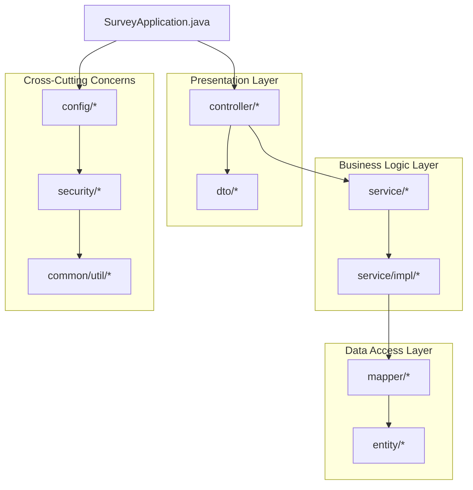
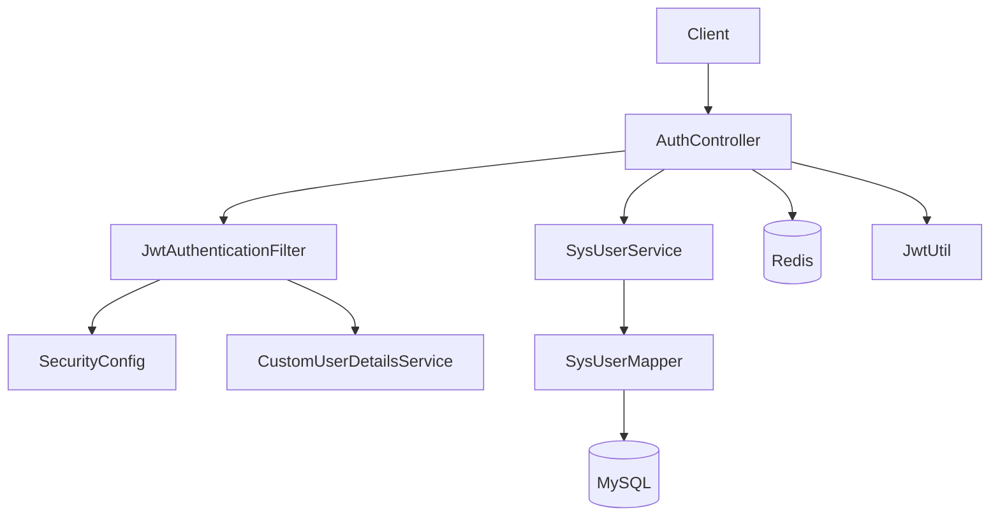
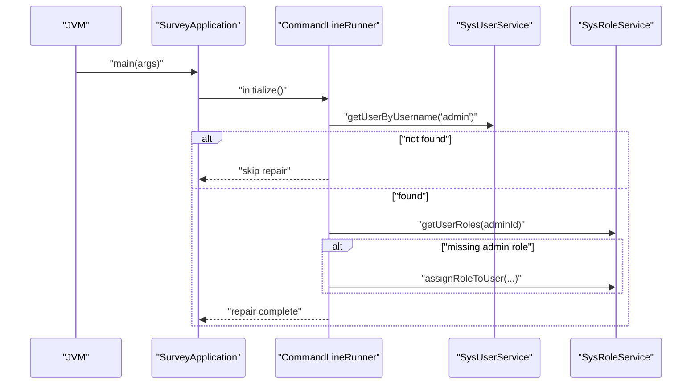
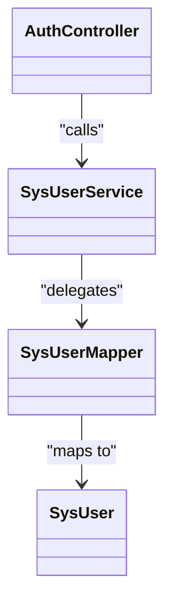
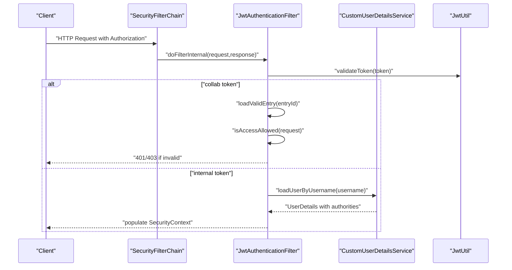
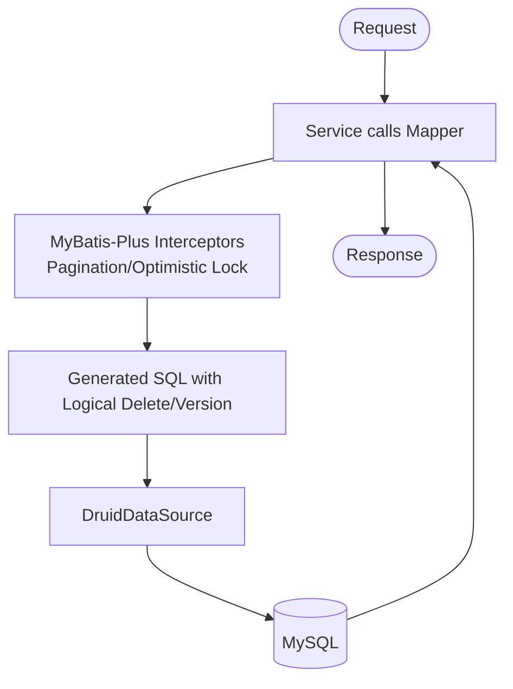
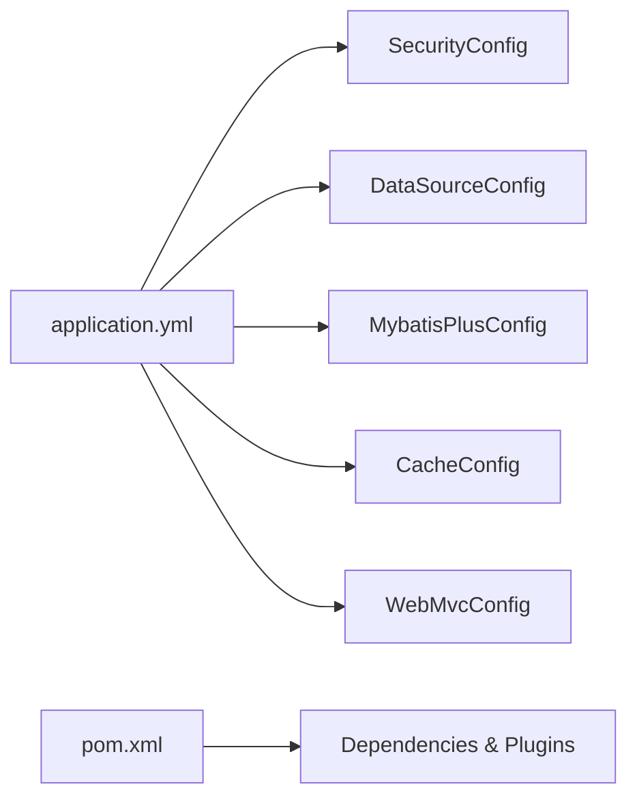
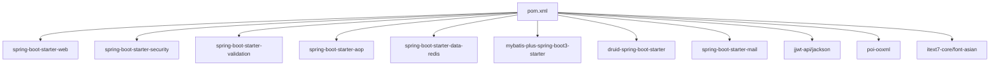

# Backend Architecture

<cite>
**Referenced Files in This Document**
- [SurveyApplication.java](file://admin-backend/src/main/java/com/qhiot/survey/SurveyApplication.java)
- [application.yml](file://admin-backend/src/main/resources/application.yml)
- [pom.xml](file://admin-backend/pom.xml)
- [WebMvcConfig.java](file://admin-backend/src/main/java/com/qhiot/survey/config/WebMvcConfig.java)
- [MybatisPlusConfig.java](file://admin-backend/src/main/java/com/qhiot/survey/config/MybatisPlusConfig.java)
- [DataSourceConfig.java](file://admin-backend/src/main/java/com/qhiot/survey/config/DataSourceConfig.java)
- [CacheConfig.java](file://admin-backend/src/main/java/com/qhiot/survey/config/CacheConfig.java)
- [SecurityConfig.java](file://admin-backend/src/main/java/com/qhiot/survey/security/SecurityConfig.java)
- [JwtAuthenticationFilter.java](file://admin-backend/src/main/java/com/qhiot/survey/security/JwtAuthenticationFilter.java)
- [CustomUserDetailsService.java](file://admin-backend/src/main/java/com/qhiot/survey/security/CustomUserDetailsService.java)
- [JwtUtil.java](file://admin-backend/src/main/java/com/qhiot/survey/common/util/JwtUtil.java)
- [AuthController.java](file://admin-backend/src/main/java/com/qhiot/survey/controller/AuthController.java)
- [SysUserService.java](file://admin-backend/src/main/java/com/qhiot/survey/service/SysUserService.java)
- [SysUserMapper.java](file://admin-backend/src/main/java/com/qhiot/survey/mapper/SysUserMapper.java)
- [SysUser.java](file://admin-backend/src/main/java/com/qhiot/survey/entity/SysUser.java)
</cite>

## Table of Contents
1. [Introduction](#introduction)
2. [Project Structure](#project-structure)
3. [Core Components](#core-components)
4. [Architecture Overview](#architecture-overview)
5. [Detailed Component Analysis](#detailed-component-analysis)
6. [Dependency Analysis](#dependency-analysis)
7. [Performance Considerations](#performance-considerations)
8. [Troubleshooting Guide](#troubleshooting-guide)
9. [Conclusion](#conclusion)
10. [Appendices](#appendices)

## Introduction
This document describes the backend architecture of the Spring Boot application. It explains the layered architecture with clear separation between presentation, business logic, and data access layers. It documents the MVC pattern implementation, package organization conventions, and component relationships. It also covers configuration management (auto-configuration, custom configurations for security, database, and caching), the application entry point and startup sequence, service initialization, MyBatis-Plus integration, JWT-based authentication, and cross-cutting concerns such as logging and exception handling. System context diagrams illustrate component interactions and data flow patterns.

## Project Structure
The backend follows a conventional Spring Boot layout with explicit separation of concerns:
- Presentation layer: controllers under controller package, DTOs under dto package
- Business logic layer: services under service package, with service interfaces and implementations
- Data access layer: MyBatis-Plus mappers under mapper package, entities under entity package
- Cross-cutting concerns: configuration classes under config, security under security, utilities under common/util
- Application entry point: SurveyApplication.java

**Diagram sources**
- [SurveyApplication.java:20-26](file://admin-backend/src/main/java/com/qhiot/survey/SurveyApplication.java#L20-L26)
- [WebMvcConfig.java:14](file://admin-backend/src/main/java/com/qhiot/survey/config/WebMvcConfig.java#L14)
- [SecurityConfig.java:32](file://admin-backend/src/main/java/com/qhiot/survey/security/SecurityConfig.java#L32)
- [MybatisPlusConfig.java:15](file://admin-backend/src/main/java/com/qhiot/survey/config/MybatisPlusConfig.java#L15)

**Section sources**
- [SurveyApplication.java:20-26](file://admin-backend/src/main/java/com/qhiot/survey/SurveyApplication.java#L20-L26)
- [pom.xml:31-196](file://admin-backend/pom.xml#L31-L196)

## Core Components
- Application entry point and lifecycle:
  - Spring Boot main class enables component scanning, MyBatis-Plus mapper scanning, async/scheduling, and includes a startup runner to repair admin account state.
- MVC configuration:
  - Interceptor registration for idempotency enforcement on selected API paths.
- Security configuration:
  - Stateless session policy, CORS configuration, JWT filter chain, and method-level security.
- Data access configuration:
  - MyBatis-Plus interceptors (pagination, optimistic locking), ID generation strategy, and data source configuration via Druid.
- Caching configuration:
  - Redis-backed cache manager with typed JSON serialization and namespace-based TTL policies.
- Authentication controller:
  - Handles login, SMS login, password reset, token refresh, and user info retrieval with Redis-backed rate-limiting tokens and captcha.

**Section sources**
- [SurveyApplication.java:27-89](file://admin-backend/src/main/java/com/qhiot/survey/SurveyApplication.java#L27-L89)
- [WebMvcConfig.java:18-27](file://admin-backend/src/main/java/com/qhiot/survey/config/WebMvcConfig.java#L18-L27)
- [SecurityConfig.java:40-97](file://admin-backend/src/main/java/com/qhiot/survey/security/SecurityConfig.java#L40-L97)
- [MybatisPlusConfig.java:18-41](file://admin-backend/src/main/java/com/qhiot/survey/config/MybatisPlusConfig.java#L18-L41)
- [DataSourceConfig.java:13-17](file://admin-backend/src/main/java/com/qhiot/survey/config/DataSourceConfig.java#L13-L17)
- [CacheConfig.java:75-92](file://admin-backend/src/main/java/com/qhiot/survey/config/CacheConfig.java#L75-L92)
- [AuthController.java:139-427](file://admin-backend/src/main/java/com/qhiot/survey/controller/AuthController.java#L139-L427)

## Architecture Overview
The system follows a layered architecture:
- Presentation layer: REST controllers expose API endpoints and delegate to services.
- Business logic layer: services encapsulate domain workflows and orchestrate data access.
- Data access layer: MyBatis-Plus provides ORM, paging, optimistic locking, and logical deletion.
- Cross-cutting concerns: Security filters enforce authentication/authorization, interceptors handle idempotency, caches improve performance, and utilities support JWT and logging.

**Diagram sources**
- [AuthController.java:52-59](file://admin-backend/src/main/java/com/qhiot/survey/controller/AuthController.java#L52-L59)
- [JwtAuthenticationFilter.java:44-81](file://admin-backend/src/main/java/com/qhiot/survey/security/JwtAuthenticationFilter.java#L44-L81)
- [SecurityConfig.java:40-61](file://admin-backend/src/main/java/com/qhiot/survey/security/SecurityConfig.java#L40-L61)
- [CustomUserDetailsService.java:32-89](file://admin-backend/src/main/java/com/qhiot/survey/security/CustomUserDetailsService.java#L32-L89)
- [SysUserService.java:10](file://admin-backend/src/main/java/com/qhiot/survey/service/SysUserService.java#L10)
- [SysUserMapper.java:8](file://admin-backend/src/main/java/com/qhiot/survey/mapper/SysUserMapper.java#L8)
- [JwtUtil.java:34-51](file://admin-backend/src/main/java/com/qhiot/survey/common/util/JwtUtil.java#L34-L51)

## Detailed Component Analysis

### Application Entry Point and Startup Sequence
- The main class enables component scanning, MyBatis-Plus mapper scanning, asynchronous processing, and scheduling.
- A CommandLineRunner ensures admin account integrity at startup: checks password hashing and admin role assignment, resetting as needed.

**Diagram sources**
- [SurveyApplication.java:27-89](file://admin-backend/src/main/java/com/qhiot/survey/SurveyApplication.java#L27-L89)

**Section sources**
- [SurveyApplication.java:27-89](file://admin-backend/src/main/java/com/qhiot/survey/SurveyApplication.java#L27-L89)

### MVC Pattern and Package Organization
- Controllers reside in controller package and are mapped under /api/v1/auth.
- DTOs encapsulate request/response shapes.
- Services define business interfaces and implementations under service and service/impl respectively.
- Mappers and entities under mapper and entity packages integrate with MyBatis-Plus.
- Configuration classes centralize cross-cutting concerns.

**Diagram sources**
- [AuthController.java:50](file://admin-backend/src/main/java/com/qhiot/survey/controller/AuthController.java#L50)
- [SysUserService.java:10](file://admin-backend/src/main/java/com/qhiot/survey/service/SysUserService.java#L10)
- [SysUserMapper.java:8](file://admin-backend/src/main/java/com/qhiot/survey/mapper/SysUserMapper.java#L8)
- [SysUser.java:21](file://admin-backend/src/main/java/com/qhiot/survey/entity/SysUser.java#L21)

**Section sources**
- [AuthController.java:48](file://admin-backend/src/main/java/com/qhiot/survey/controller/AuthController.java#L48)
- [SysUserService.java:10](file://admin-backend/src/main/java/com/qhiot/survey/service/SysUserService.java#L10)
- [SysUserMapper.java:8](file://admin-backend/src/main/java/com/qhiot/survey/mapper/SysUserMapper.java#L8)
- [SysUser.java:21](file://admin-backend/src/main/java/com/qhiot/survey/entity/SysUser.java#L21)

### Security and JWT Authentication
- SecurityConfig disables CSRF/form login, sets stateless sessions, defines permit-all endpoints, and registers a JWT filter before the default authentication filter.
- JwtAuthenticationFilter extracts Authorization header, validates token, supports internal and collaboration login types, and populates SecurityContext.
- CustomUserDetailsService loads user roles and expands wildcard permissions, returning LoginUser with authorities.
- JwtUtil generates access/refresh/collaboration tokens with configurable secrets and expirations.

**Diagram sources**
- [SecurityConfig.java:40-61](file://admin-backend/src/main/java/com/qhiot/survey/security/SecurityConfig.java#L40-L61)
- [JwtAuthenticationFilter.java:44-122](file://admin-backend/src/main/java/com/qhiot/survey/security/JwtAuthenticationFilter.java#L44-L122)
- [CustomUserDetailsService.java:32-89](file://admin-backend/src/main/java/com/qhiot/survey/security/CustomUserDetailsService.java#L32-L89)
- [JwtUtil.java:34-85](file://admin-backend/src/main/java/com/qhiot/survey/common/util/JwtUtil.java#L34-L85)

**Section sources**
- [SecurityConfig.java:39-97](file://admin-backend/src/main/java/com/qhiot/survey/security/SecurityConfig.java#L39-L97)
- [JwtAuthenticationFilter.java:37-135](file://admin-backend/src/main/java/com/qhiot/survey/security/JwtAuthenticationFilter.java#L37-L135)
- [CustomUserDetailsService.java:26-91](file://admin-backend/src/main/java/com/qhiot/survey/security/CustomUserDetailsService.java#L26-L91)
- [JwtUtil.java:20-174](file://admin-backend/src/main/java/com/qhiot/survey/common/util/JwtUtil.java#L20-174)

### Data Access with MyBatis-Plus
- MybatisPlusConfig registers pagination and optimistic locking interceptors and configures an IdentifierGenerator for snowflake IDs.
- DataSourceConfig binds spring.datasource properties to a DruidDataSource bean.
- Entities use logical deletion and version fields; mappers extend BaseMapper for CRUD operations.

**Diagram sources**
- [MybatisPlusConfig.java:18-41](file://admin-backend/src/main/java/com/qhiot/survey/config/MybatisPlusConfig.java#L18-L41)
- [DataSourceConfig.java:13-17](file://admin-backend/src/main/java/com/qhiot/survey/config/DataSourceConfig.java#L13-L17)
- [SysUser.java:51-55](file://admin-backend/src/main/java/com/qhiot/survey/entity/SysUser.java#L51-L55)
- [SysUserMapper.java:8](file://admin-backend/src/main/java/com/qhiot/survey/mapper/SysUserMapper.java#L8)

**Section sources**
- [MybatisPlusConfig.java:15-42](file://admin-backend/src/main/java/com/qhiot/survey/config/MybatisPlusConfig.java#L15-L42)
- [DataSourceConfig.java:11-18](file://admin-backend/src/main/java/com/qhiot/survey/config/DataSourceConfig.java#L11-L18)
- [SysUser.java:21-66](file://admin-backend/src/main/java/com/qhiot/survey/entity/SysUser.java#L21-L66)
- [SysUserMapper.java:8](file://admin-backend/src/main/java/com/qhiot/survey/mapper/SysUserMapper.java#L8)

### Configuration Management
- application.yml defines server, CORS, JWT, datasource (Druid), mail, Redis, MyBatis-Plus, Aliyun OSS/SMS, Swagger/Knife4j, logging, and app environment settings.
- pom.xml declares Spring Boot 3 starter dependencies, MyBatis-Plus, Druid, Redis, Security, AOP, validation, JWT, and optional OSS/SMS/PDF libraries.

**Diagram sources**
- [application.yml:15-149](file://admin-backend/src/main/resources/application.yml#L15-L149)
- [pom.xml:31-196](file://admin-backend/pom.xml#L31-L196)

**Section sources**
- [application.yml:15-149](file://admin-backend/src/main/resources/application.yml#L15-L149)
- [pom.xml:31-196](file://admin-backend/pom.xml#L31-L196)

### Cross-Cutting Concerns: Logging and Exception Handling
- Logging levels are configured via application.yml; package-level debug logging is enabled for the application.
- Global exception handling is implemented centrally in a dedicated handler class to unify error responses across the application.

**Section sources**
- [application.yml:129-132](file://admin-backend/src/main/resources/application.yml#L129-L132)
- [SurveyApplication.java:8](file://admin-backend/src/main/java/com/qhiot/survey/SurveyApplication.java#L8)

## Dependency Analysis
The backend leverages Spring Boot’s auto-configuration while customizing key areas:
- Web: spring-boot-starter-web
- Security: spring-boot-starter-security
- Validation: spring-boot-starter-validation
- AOP: spring-boot-starter-aop
- Data Redis: spring-boot-starter-data-redis
- MyBatis-Plus: mybatis-plus-spring-boot3-starter
- Database: Druid starter
- Utilities: JWT, Apache POI, PDF libraries, embedded Redis for tests

**Diagram sources**
- [pom.xml:32-196](file://admin-backend/pom.xml#L32-L196)

**Section sources**
- [pom.xml:31-196](file://admin-backend/pom.xml#L31-L196)

## Performance Considerations
- MyBatis-Plus pagination interceptor limits max page size to prevent heavy queries.
- Redis cache manager uses typed JSON serialization and transaction-aware writes to avoid dirty reads.
- Druid datasource includes leak detection and slow SQL logging to monitor DB health.
- Stateless JWT reduces server-side session overhead.

[No sources needed since this section provides general guidance]

## Troubleshooting Guide
Common issues and diagnostics:
- Startup admin repair failures: verify credentials and role existence; check logs emitted during CommandLineRunner execution.
- JWT validation errors: confirm secret and expiration settings match client expectations; inspect Unauthorized responses from JwtAuthenticationFilter.
- CORS problems: ensure allowed origins configuration aligns with frontend origin; verify allowed headers/exposed headers.
- MyBatis-Plus errors: check logical delete and version fields; validate mapper XML locations and entity mappings.
- Redis connectivity: verify host/port/password/database settings; confirm cache TTL namespaces and JSON serializer compatibility.

**Section sources**
- [SurveyApplication.java:84-87](file://admin-backend/src/main/java/com/qhiot/survey/SurveyApplication.java#L84-L87)
- [JwtAuthenticationFilter.java:72-78](file://admin-backend/src/main/java/com/qhiot/survey/security/JwtAuthenticationFilter.java#L72-L78)
- [SecurityConfig.java:69-89](file://admin-backend/src/main/java/com/qhiot/survey/security/SecurityConfig.java#L69-L89)
- [MybatisPlusConfig.java:23-25](file://admin-backend/src/main/java/com/qhiot/survey/config/MybatisPlusConfig.java#L23-L25)
- [CacheConfig.java:75-92](file://admin-backend/src/main/java/com/qhiot/survey/config/CacheConfig.java#L75-L92)

## Conclusion
The backend employs a clean layered architecture with explicit separation of concerns, robust security via JWT and Spring Security, efficient data access through MyBatis-Plus, and pragmatic configuration management. The MVC controller layer orchestrates business workflows, while cross-cutting concerns like caching, logging, and interceptors ensure reliability and maintainability.

[No sources needed since this section summarizes without analyzing specific files]

## Appendices
- Environment variables and property placeholders are defined in application.yml for database, Redis, JWT, mail, OSS/SMS, and app behavior.
- Maven coordinates and plugin configuration are centralized in pom.xml to manage dependencies and build lifecycle.

**Section sources**
- [application.yml:15-149](file://admin-backend/src/main/resources/application.yml#L15-L149)
- [pom.xml:19-240](file://admin-backend/pom.xml#L19-L240)