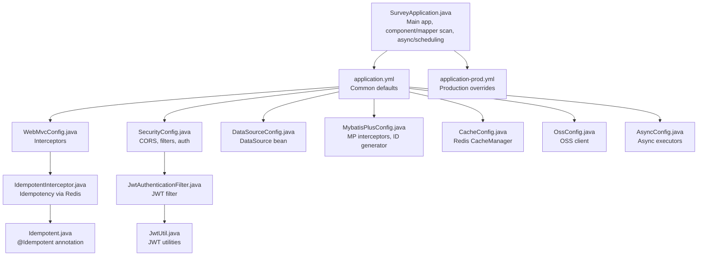
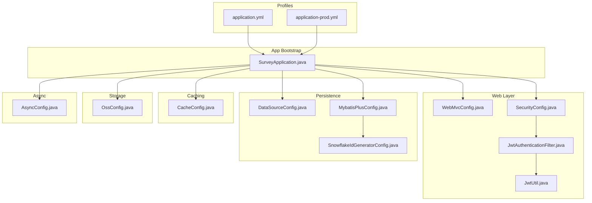
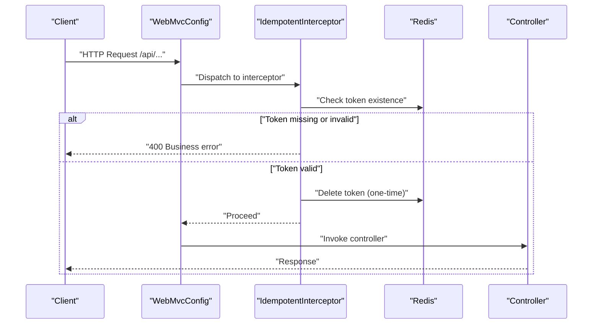
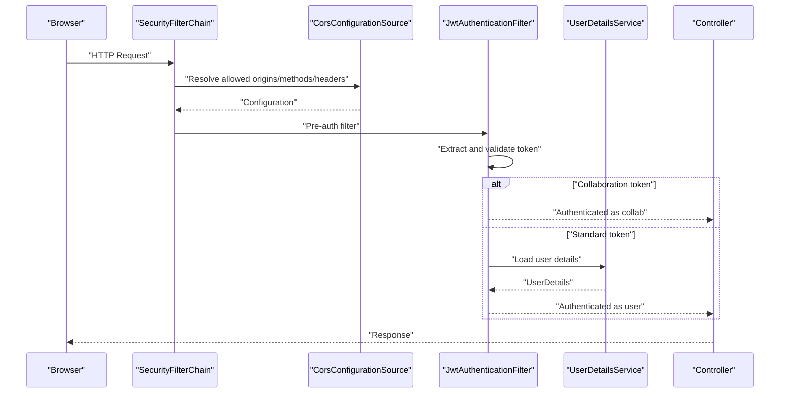
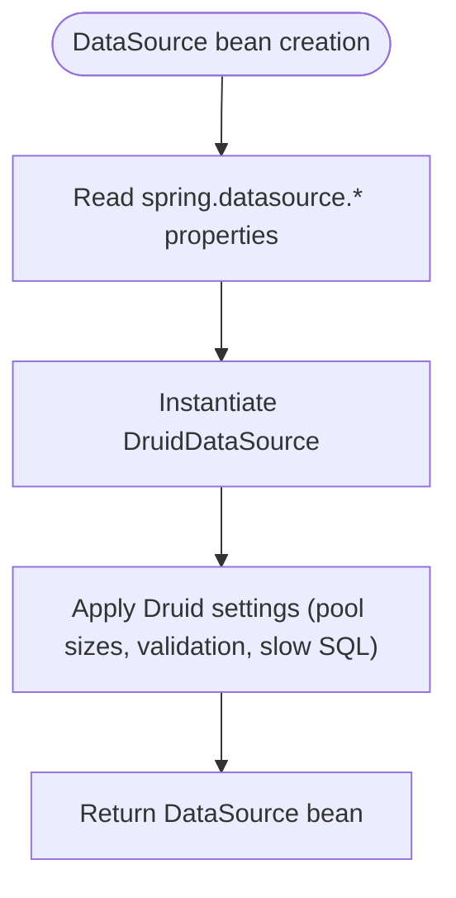
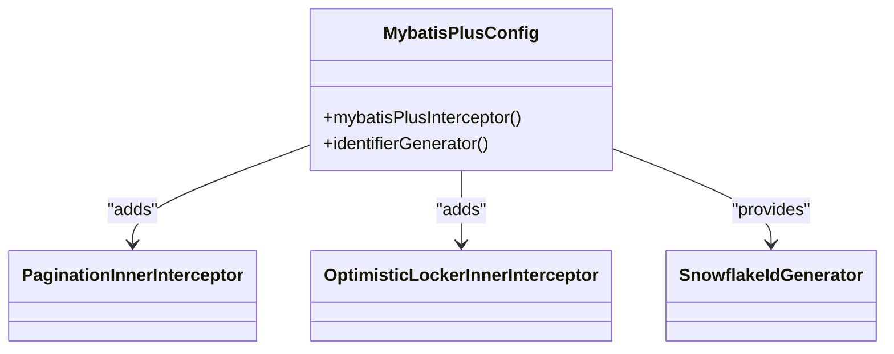
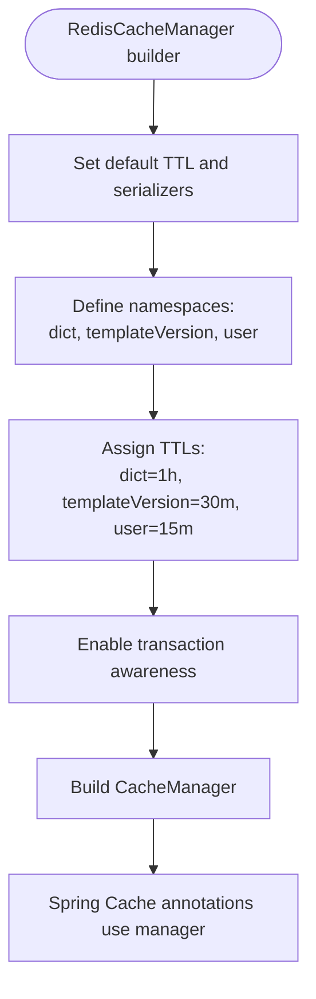
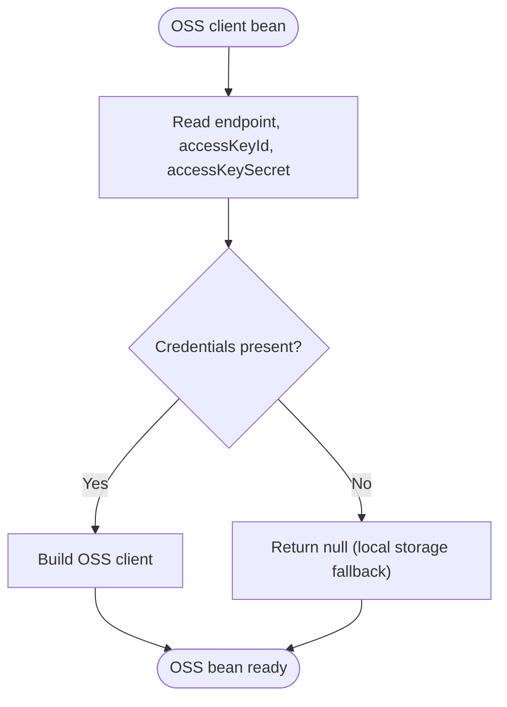
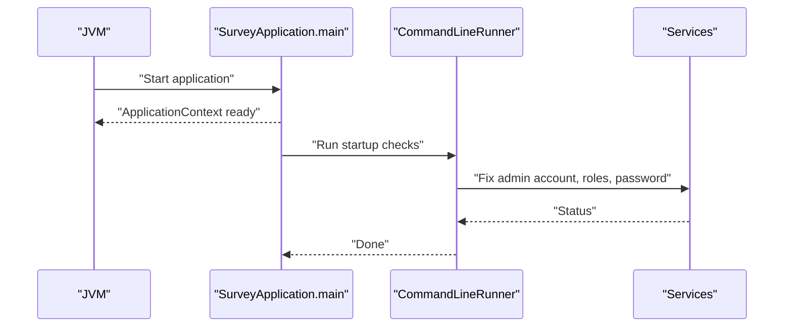
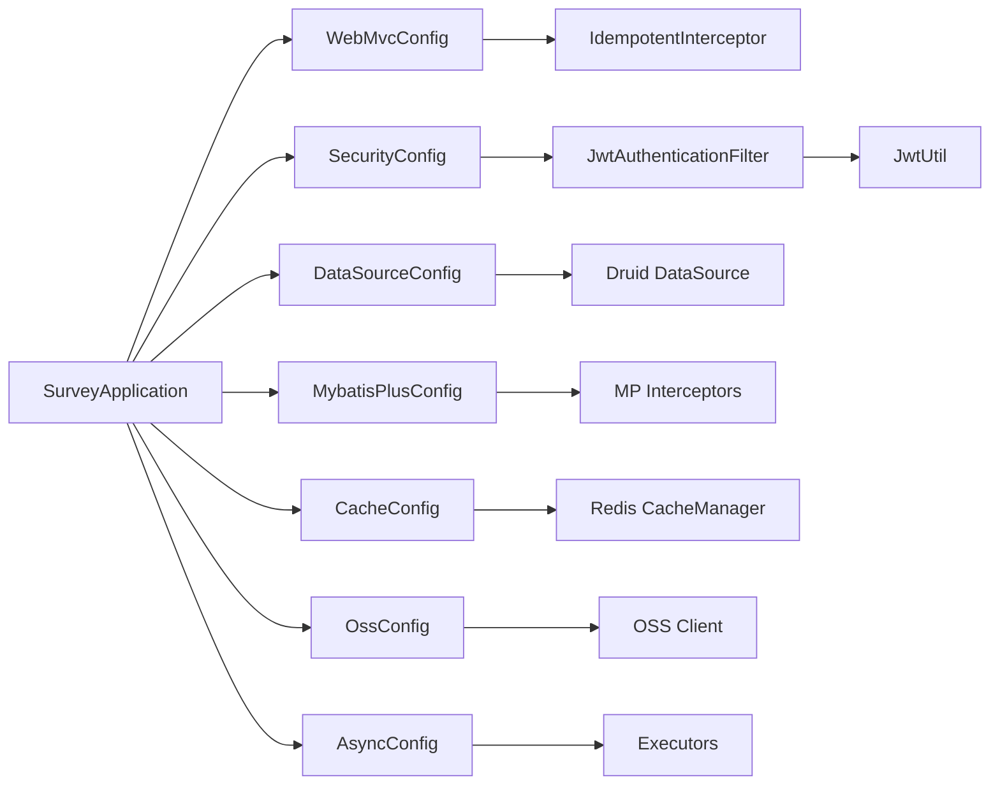

# Configuration Management

<cite>
**Referenced Files in This Document**
- [SurveyApplication.java](file://admin-backend/src/main/java/com/qhiot/survey/SurveyApplication.java)
- [application.yml](file://admin-backend/src/main/resources/application.yml)
- [application-prod.yml](file://admin-backend/src/main/resources/application-prod.yml)
- [WebMvcConfig.java](file://admin-backend/src/main/java/com/qhiot/survey/config/WebMvcConfig.java)
- [MybatisPlusConfig.java](file://admin-backend/src/main/java/com/qhiot/survey/config/MybatisPlusConfig.java)
- [DataSourceConfig.java](file://admin-backend/src/main/java/com/qhiot/survey/config/DataSourceConfig.java)
- [CacheConfig.java](file://admin-backend/src/main/java/com/qhiot/survey/config/CacheConfig.java)
- [OssConfig.java](file://admin-backend/src/main/java/com/qhiot/survey/config/OssConfig.java)
- [SecurityConfig.java](file://admin-backend/src/main/java/com/qhiot/survey/security/SecurityConfig.java)
- [JwtAuthenticationFilter.java](file://admin-backend/src/main/java/com/qhiot/survey/security/JwtAuthenticationFilter.java)
- [JwtUtil.java](file://admin-backend/src/main/java/com/qhiot/survey/common/util/JwtUtil.java)
- [IdempotentInterceptor.java](file://admin-backend/src/main/java/com/qhiot/survey/common/interceptor/IdempotentInterceptor.java)
- [Idempotent.java](file://admin-backend/src/main/java/com/qhiot/survey/common/annotation/Idempotent.java)
- [AsyncConfig.java](file://admin-backend/src/main/java/com/qhiot/survey/config/AsyncConfig.java)
- [SnowflakeIdGeneratorConfig.java](file://admin-backend/src/main/java/com/qhiot/survey/config/SnowflakeIdGeneratorConfig.java)
</cite>

## Table of Contents
1. [Introduction](#introduction)
2. [Project Structure](#project-structure)
3. [Core Components](#core-components)
4. [Architecture Overview](#architecture-overview)
5. [Detailed Component Analysis](#detailed-component-analysis)
6. [Dependency Analysis](#dependency-analysis)
7. [Performance Considerations](#performance-considerations)
8. [Troubleshooting Guide](#troubleshooting-guide)
9. [Conclusion](#conclusion)
10. [Appendices](#appendices)

## Introduction
This document explains the Spring Boot configuration management system for the backend module. It covers custom configuration classes, environment-aware property management, and how Spring Boot auto-configuration interacts with custom beans. Practical examples demonstrate database connections, security settings, file upload limits, and cache strategies. The goal is to help developers configure, operate, and troubleshoot the system effectively across environments.

## Project Structure
The configuration system centers around:
- Application entry and scanning
- YAML-based configuration profiles
- Custom configuration classes for web, persistence, caching, data source, and cloud storage
- Security and JWT integration
- Async and scheduling support

**Diagram sources**
- [SurveyApplication.java:20-26](file://admin-backend/src/main/java/com/qhiot/survey/SurveyApplication.java#L20-L26)
- [application.yml:1-149](file://admin-backend/src/main/resources/application.yml#L1-L149)
- [application-prod.yml:1-140](file://admin-backend/src/main/resources/application-prod.yml#L1-L140)
- [WebMvcConfig.java:12-28](file://admin-backend/src/main/java/com/qhiot/survey/config/WebMvcConfig.java#L12-L28)
- [SecurityConfig.java:28-99](file://admin-backend/src/main/java/com/qhiot/survey/security/SecurityConfig.java#L28-L99)
- [DataSourceConfig.java:10-18](file://admin-backend/src/main/java/com/qhiot/survey/config/DataSourceConfig.java#L10-L18)
- [MybatisPlusConfig.java:15-42](file://admin-backend/src/main/java/com/qhiot/survey/config/MybatisPlusConfig.java#L15-L42)
- [CacheConfig.java:35-94](file://admin-backend/src/main/java/com/qhiot/survey/config/CacheConfig.java#L35-L94)
- [OssConfig.java:12-34](file://admin-backend/src/main/java/com/qhiot/survey/config/OssConfig.java#L12-L34)
- [AsyncConfig.java:16-96](file://admin-backend/src/main/java/com/qhiot/survey/config/AsyncConfig.java#L16-L96)
- [JwtAuthenticationFilter.java:34-135](file://admin-backend/src/main/java/com/qhiot/survey/security/JwtAuthenticationFilter.java#L34-L135)
- [JwtUtil.java:19-174](file://admin-backend/src/main/java/com/qhiot/survey/common/util/JwtUtil.java#L19-L174)
- [IdempotentInterceptor.java:20-63](file://admin-backend/src/main/java/com/qhiot/survey/common/interceptor/IdempotentInterceptor.java#L20-L63)
- [Idempotent.java:5-24](file://admin-backend/src/main/java/com/qhiot/survey/common/annotation/Idempotent.java#L5-L24)

**Section sources**
- [SurveyApplication.java:20-26](file://admin-backend/src/main/java/com/qhiot/survey/SurveyApplication.java#L20-L26)
- [application.yml:1-149](file://admin-backend/src/main/resources/application.yml#L1-L149)
- [application-prod.yml:1-140](file://admin-backend/src/main/resources/application-prod.yml#L1-L140)

## Core Components
- WebMvcConfig: Registers the idempotency interceptor for selected API paths and excludes authentication and file upload endpoints.
- SecurityConfig: Disables CSRF, configures CORS, sets stateless sessions, and registers JWT and character encoding filters.
- DataSourceConfig: Binds spring.datasource properties to a Druid DataSource bean.
- MybatisPlusConfig: Adds pagination, optimistic locking, and a snowflake ID generator.
- CacheConfig: Provides a Redis-backed CacheManager with namespace-aware keys and per-cache TTLs.
- OssConfig: Creates an OSS client when credentials are present; otherwise returns null to fall back to local storage.
- AsyncConfig: Defines named thread pools for operation logs, exports, and notifications.
- SurveyApplication: Bootstraps the app, enables async/scheduling, and scans components and mappers.

**Section sources**
- [WebMvcConfig.java:12-28](file://admin-backend/src/main/java/com/qhiot/survey/config/WebMvcConfig.java#L12-L28)
- [SecurityConfig.java:28-99](file://admin-backend/src/main/java/com/qhiot/survey/security/SecurityConfig.java#L28-L99)
- [DataSourceConfig.java:10-18](file://admin-backend/src/main/java/com/qhiot/survey/config/DataSourceConfig.java#L10-L18)
- [MybatisPlusConfig.java:15-42](file://admin-backend/src/main/java/com/qhiot/survey/config/MybatisPlusConfig.java#L15-L42)
- [CacheConfig.java:35-94](file://admin-backend/src/main/java/com/qhiot/survey/config/CacheConfig.java#L35-L94)
- [OssConfig.java:12-34](file://admin-backend/src/main/java/com/qhiot/survey/config/OssConfig.java#L12-L34)
- [AsyncConfig.java:16-96](file://admin-backend/src/main/java/com/qhiot/survey/config/AsyncConfig.java#L16-L96)
- [SurveyApplication.java:20-26](file://admin-backend/src/main/java/com/qhiot/survey/SurveyApplication.java#L20-L26)

## Architecture Overview
The configuration architecture blends Spring Boot’s convention-over-configuration with explicit customizations:
- application.yml defines defaults and environment variables for secrets and hosts.
- application-prod.yml overrides production-specific behavior (logging, SQL logging, cache, actuator exposure).
- Custom @Configuration classes contribute beans that complement auto-configuration.
- SecurityConfig and WebMvcConfig integrate with Spring Security and MVC stacks.
- DataSourceConfig binds to spring.datasource.* and produces a Druid DataSource.
- MybatisPlusConfig adds MP interceptors and a global ID generator.
- CacheConfig builds a Redis CacheManager with typed TTLs and transaction awareness.
- OssConfig conditionally provides an OSS client; absence triggers local storage fallback.
- AsyncConfig and SurveyApplication enable asynchronous and scheduled tasks.

**Diagram sources**
- [application.yml:1-149](file://admin-backend/src/main/resources/application.yml#L1-L149)
- [application-prod.yml:1-140](file://admin-backend/src/main/resources/application-prod.yml#L1-L140)
- [SurveyApplication.java:20-26](file://admin-backend/src/main/java/com/qhiot/survey/SurveyApplication.java#L20-L26)
- [WebMvcConfig.java:12-28](file://admin-backend/src/main/java/com/qhiot/survey/config/WebMvcConfig.java#L12-L28)
- [SecurityConfig.java:28-99](file://admin-backend/src/main/java/com/qhiot/survey/security/SecurityConfig.java#L28-L99)
- [JwtAuthenticationFilter.java:34-135](file://admin-backend/src/main/java/com/qhiot/survey/security/JwtAuthenticationFilter.java#L34-L135)
- [JwtUtil.java:19-174](file://admin-backend/src/main/java/com/qhiot/survey/common/util/JwtUtil.java#L19-L174)
- [DataSourceConfig.java:10-18](file://admin-backend/src/main/java/com/qhiot/survey/config/DataSourceConfig.java#L10-L18)
- [MybatisPlusConfig.java:15-42](file://admin-backend/src/main/java/com/qhiot/survey/config/MybatisPlusConfig.java#L15-L42)
- [SnowflakeIdGeneratorConfig.java:18-165](file://admin-backend/src/main/java/com/qhiot/survey/config/SnowflakeIdGeneratorConfig.java#L18-165)
- [CacheConfig.java:35-94](file://admin-backend/src/main/java/com/qhiot/survey/config/CacheConfig.java#L35-L94)
- [OssConfig.java:12-34](file://admin-backend/src/main/java/com/qhiot/survey/config/OssConfig.java#L12-L34)
- [AsyncConfig.java:16-96](file://admin-backend/src/main/java/com/qhiot/survey/config/AsyncConfig.java#L16-L96)

## Detailed Component Analysis

### WebMvcConfig: CORS and Interceptor Setup
- Purpose: Registers a global idempotency interceptor for API paths while excluding authentication and file upload endpoints.
- Impact: Prevents duplicate submissions by validating a token header against Redis; improves reliability for idempotent operations.

**Diagram sources**
- [WebMvcConfig.java:18-27](file://admin-backend/src/main/java/com/qhiot/survey/config/WebMvcConfig.java#L18-L27)
- [IdempotentInterceptor.java:29-61](file://admin-backend/src/main/java/com/qhiot/survey/common/interceptor/IdempotentInterceptor.java#L29-L61)
- [Idempotent.java:12-23](file://admin-backend/src/main/java/com/qhiot/survey/common/annotation/Idempotent.java#L12-L23)

**Section sources**
- [WebMvcConfig.java:12-28](file://admin-backend/src/main/java/com/qhiot/survey/config/WebMvcConfig.java#L12-L28)
- [IdempotentInterceptor.java:20-63](file://admin-backend/src/main/java/com/qhiot/survey/common/interceptor/IdempotentInterceptor.java#L20-L63)
- [Idempotent.java:5-24](file://admin-backend/src/main/java/com/qhiot/survey/common/annotation/Idempotent.java#L5-L24)

### SecurityConfig: CORS, Filters, and Authentication Chain
- Purpose: Disables CSRF, configures CORS with origin patterns, sets stateless sessions, permits specific endpoints, and injects JWT and character encoding filters.
- Impact: Enforces secure, stateless authentication and controlled cross-origin access.

**Diagram sources**
- [SecurityConfig.java:39-89](file://admin-backend/src/main/java/com/qhiot/survey/security/SecurityConfig.java#L39-L89)
- [JwtAuthenticationFilter.java:43-122](file://admin-backend/src/main/java/com/qhiot/survey/security/JwtAuthenticationFilter.java#L43-L122)
- [JwtUtil.java:22-174](file://admin-backend/src/main/java/com/qhiot/survey/common/util/JwtUtil.java#L22-L174)

**Section sources**
- [SecurityConfig.java:28-99](file://admin-backend/src/main/java/com/qhiot/survey/security/SecurityConfig.java#L28-L99)
- [JwtAuthenticationFilter.java:34-135](file://admin-backend/src/main/java/com/qhiot/survey/security/JwtAuthenticationFilter.java#L34-L135)
- [JwtUtil.java:19-174](file://admin-backend/src/main/java/com/qhiot/survey/common/util/JwtUtil.java#L19-L174)

### DataSourceConfig: Database Connection Pooling
- Purpose: Binds spring.datasource.* properties to a Druid DataSource bean.
- Impact: Centralizes DB configuration and leverages Druid’s monitoring and leak detection.

**Diagram sources**
- [DataSourceConfig.java:13-17](file://admin-backend/src/main/java/com/qhiot/survey/config/DataSourceConfig.java#L13-L17)
- [application.yml:24-44](file://admin-backend/src/main/resources/application.yml#L24-L44)
- [application-prod.yml:21-47](file://admin-backend/src/main/resources/application-prod.yml#L21-L47)

**Section sources**
- [DataSourceConfig.java:10-18](file://admin-backend/src/main/java/com/qhiot/survey/config/DataSourceConfig.java#L10-L18)
- [application.yml:24-44](file://admin-backend/src/main/resources/application.yml#L24-L44)
- [application-prod.yml:21-47](file://admin-backend/src/main/resources/application-prod.yml#L21-L47)

### MybatisPlusConfig: Database Mapping Enhancements
- Purpose: Adds pagination, optimistic locking, and a snowflake ID generator.
- Impact: Improves query pagination limits, supports concurrency-safe updates, and standardizes globally unique IDs.

**Diagram sources**
- [MybatisPlusConfig.java:18-40](file://admin-backend/src/main/java/com/qhiot/survey/config/MybatisPlusConfig.java#L18-L40)
- [SnowflakeIdGeneratorConfig.java:18-165](file://admin-backend/src/main/java/com/qhiot/survey/config/SnowflakeIdGeneratorConfig.java#L18-165)

**Section sources**
- [MybatisPlusConfig.java:15-42](file://admin-backend/src/main/java/com/qhiot/survey/config/MybatisPlusConfig.java#L15-L42)
- [SnowflakeIdGeneratorConfig.java:18-165](file://admin-backend/src/main/java/com/qhiot/survey/config/SnowflakeIdGeneratorConfig.java#L18-165)

### CacheConfig: Redis Integration
- Purpose: Builds a Redis CacheManager with namespace-aware keys and per-cache TTLs; enables transaction-aware writes.
- Impact: Reduces DB load with cached dictionaries, template versions, and user info; improves responsiveness.

**Diagram sources**
- [CacheConfig.java:75-92](file://admin-backend/src/main/java/com/qhiot/survey/config/CacheConfig.java#L75-L92)

**Section sources**
- [CacheConfig.java:35-94](file://admin-backend/src/main/java/com/qhiot/survey/config/CacheConfig.java#L35-L94)

### OssConfig: Cloud Storage
- Purpose: Creates an OSS client when credentials are provided; otherwise returns null to enable local storage fallback.
- Impact: Enables optional cloud storage uploads; avoids runtime errors when credentials are absent.

**Diagram sources**
- [OssConfig.java:24-33](file://admin-backend/src/main/java/com/qhiot/survey/config/OssConfig.java#L24-L33)
- [application.yml:97-104](file://admin-backend/src/main/resources/application.yml#L97-L104)

**Section sources**
- [OssConfig.java:12-34](file://admin-backend/src/main/java/com/qhiot/survey/config/OssConfig.java#L12-L34)
- [application.yml:97-104](file://admin-backend/src/main/resources/application.yml#L97-L104)

### Application Startup and Scanning
- Purpose: Bootstraps the application, enables async/scheduling, scans components and mappers, and performs admin account maintenance.
- Impact: Ensures proper initialization order and operational hygiene during startup.

**Diagram sources**
- [SurveyApplication.java:27-89](file://admin-backend/src/main/java/com/qhiot/survey/SurveyApplication.java#L27-L89)

**Section sources**
- [SurveyApplication.java:20-26](file://admin-backend/src/main/java/com/qhiot/survey/SurveyApplication.java#L20-L26)
- [SurveyApplication.java:31-89](file://admin-backend/src/main/java/com/qhiot/survey/SurveyApplication.java#L31-L89)

## Dependency Analysis
- Web layer depends on SecurityConfig and JwtAuthenticationFilter; CORS settings derive from application.yml and SecurityConfig.
- Persistence layer depends on DataSourceConfig and MybatisPlusConfig; ID generation is globalized via MybatisPlusConfig.
- Caching depends on Redis connectivity; CacheConfig provides the CacheManager used by Spring Cache annotations.
- Storage depends on OssConfig; when absent, local storage is used.
- Async tasks depend on AsyncConfig executors; SurveyApplication enables async/scheduling.

**Diagram sources**
- [WebMvcConfig.java:12-28](file://admin-backend/src/main/java/com/qhiot/survey/config/WebMvcConfig.java#L12-L28)
- [SecurityConfig.java:28-99](file://admin-backend/src/main/java/com/qhiot/survey/security/SecurityConfig.java#L28-L99)
- [JwtAuthenticationFilter.java:34-135](file://admin-backend/src/main/java/com/qhiot/survey/security/JwtAuthenticationFilter.java#L34-L135)
- [JwtUtil.java:19-174](file://admin-backend/src/main/java/com/qhiot/survey/common/util/JwtUtil.java#L19-L174)
- [DataSourceConfig.java:10-18](file://admin-backend/src/main/java/com/qhiot/survey/config/DataSourceConfig.java#L10-L18)
- [MybatisPlusConfig.java:15-42](file://admin-backend/src/main/java/com/qhiot/survey/config/MybatisPlusConfig.java#L15-L42)
- [CacheConfig.java:35-94](file://admin-backend/src/main/java/com/qhiot/survey/config/CacheConfig.java#L35-L94)
- [OssConfig.java:12-34](file://admin-backend/src/main/java/com/qhiot/survey/config/OssConfig.java#L12-L34)
- [AsyncConfig.java:16-96](file://admin-backend/src/main/java/com/qhiot/survey/config/AsyncConfig.java#L16-L96)
- [SurveyApplication.java:20-26](file://admin-backend/src/main/java/com/qhiot/survey/SurveyApplication.java#L20-L26)

**Section sources**
- [SurveyApplication.java:20-26](file://admin-backend/src/main/java/com/qhiot/survey/SurveyApplication.java#L20-L26)
- [SecurityConfig.java:28-99](file://admin-backend/src/main/java/com/qhiot/survey/security/SecurityConfig.java#L28-L99)
- [DataSourceConfig.java:10-18](file://admin-backend/src/main/java/com/qhiot/survey/config/DataSourceConfig.java#L10-L18)
- [MybatisPlusConfig.java:15-42](file://admin-backend/src/main/java/com/qhiot/survey/config/MybatisPlusConfig.java#L15-L42)
- [CacheConfig.java:35-94](file://admin-backend/src/main/java/com/qhiot/survey/config/CacheConfig.java#L35-L94)
- [OssConfig.java:12-34](file://admin-backend/src/main/java/com/qhiot/survey/config/OssConfig.java#L12-L34)
- [AsyncConfig.java:16-96](file://admin-backend/src/main/java/com/qhiot/survey/config/AsyncConfig.java#L16-L96)

## Performance Considerations
- Database pooling: Tune initial-size, min-idle, max-active, and max-wait according to workload; enable slow SQL logging for diagnostics.
- Caching: Use appropriate TTLs per cache namespace; transaction-aware cache writes prevent dirty reads under transactions.
- Async: Separate executors isolate notification, export, and log tasks; caller-runs policy prevents task loss under pressure.
- CORS: Use allowedOriginPatterns carefully to avoid mixing wildcard with allowCredentials in the same configuration.
- Logging: Production disables SQL logging and reduces root log level; consider structured logging and retention policies.

[No sources needed since this section provides general guidance]

## Troubleshooting Guide
- CORS failures: Verify allowed-origins in application.yml and SecurityConfig’s origin resolution logic.
- JWT unauthorized: Confirm token presence, validity, and expiration; check secret and expiration settings.
- Idempotency errors: Ensure X-Idempotent-Token is set and valid; confirm Redis connectivity.
- Database connection issues: Validate spring.datasource properties and Druid settings; check remove-abandoned and slow SQL logs.
- Cache misses or stale data: Confirm cache namespace and TTL; verify transaction awareness and key prefixes.
- OSS upload failures: Ensure OSS credentials are provided; when absent, expect local storage fallback behavior.

**Section sources**
- [SecurityConfig.java:68-89](file://admin-backend/src/main/java/com/qhiot/survey/security/SecurityConfig.java#L68-L89)
- [JwtAuthenticationFilter.java:43-81](file://admin-backend/src/main/java/com/qhiot/survey/security/JwtAuthenticationFilter.java#L43-L81)
- [JwtUtil.java:154-173](file://admin-backend/src/main/java/com/qhiot/survey/common/util/JwtUtil.java#L154-L173)
- [IdempotentInterceptor.java:42-57](file://admin-backend/src/main/java/com/qhiot/survey/common/interceptor/IdempotentInterceptor.java#L42-L57)
- [application.yml:24-44](file://admin-backend/src/main/resources/application.yml#L24-L44)
- [application-prod.yml:48-62](file://admin-backend/src/main/resources/application-prod.yml#L48-L62)
- [CacheConfig.java:75-92](file://admin-backend/src/main/java/com/qhiot/survey/config/CacheConfig.java#L75-L92)
- [OssConfig.java:24-33](file://admin-backend/src/main/java/com/qhiot/survey/config/OssConfig.java#L24-L33)

## Conclusion
The configuration system combines Spring Boot’s auto-configuration with targeted customizations to deliver a secure, scalable, and maintainable backend. Environment-specific properties, explicit configuration beans, and pragmatic defaults enable smooth operations across development and production. By understanding the relationships among these components, teams can confidently tune performance, enforce security, and extend functionality.

[No sources needed since this section summarizes without analyzing specific files]

## Appendices

### Practical Examples

- Database connections
  - Set spring.datasource.url, username, password, and Druid pool parameters in application.yml or environment variables.
  - Reference: [application.yml:24-44](file://admin-backend/src/main/resources/application.yml#L24-L44), [application-prod.yml:21-47](file://admin-backend/src/main/resources/application-prod.yml#L21-L47), [DataSourceConfig.java:13-17](file://admin-backend/src/main/java/com/qhiot/survey/config/DataSourceConfig.java#L13-L17)

- Security settings
  - Configure allowed-origins in application.yml and ensure SecurityConfig applies them; set JWT secret and expiration.
  - Reference: [application.yml:10-13](file://admin-backend/src/main/resources/application.yml#L10-L13), [application.yml:134-137](file://admin-backend/src/main/resources/application.yml#L134-L137), [SecurityConfig.java:36-89](file://admin-backend/src/main/java/com/qhiot/survey/security/SecurityConfig.java#L36-L89)

- File upload limits
  - Adjust multipart.max-file-size and multipart.max-request-size in application.yml.
  - Reference: [application.yml:18-23](file://admin-backend/src/main/resources/application.yml#L18-L23), [application-prod.yml:15-20](file://admin-backend/src/main/resources/application-prod.yml#L15-L20)

- Cache strategies
  - Use CacheConfig’s namespaces and TTLs; enable transaction-aware cache writes.
  - Reference: [CacheConfig.java:75-92](file://admin-backend/src/main/java/com/qhiot/survey/config/CacheConfig.java#L75-L92)

- External configuration management
  - Prefer environment variables for secrets (DB, Redis, JWT, OSS, Mail). Profiles override defaults for production.
  - Reference: [application.yml:10-13](file://admin-backend/src/main/resources/application.yml#L10-L13), [application.yml:64-78](file://admin-backend/src/main/resources/application.yml#L64-L78), [application.yml:97-104](file://admin-backend/src/main/resources/application.yml#L97-L104), [application-prod.yml:64-68](file://admin-backend/src/main/resources/application-prod.yml#L64-L68), [application-prod.yml:85-99](file://admin-backend/src/main/resources/application-prod.yml#L85-L99)