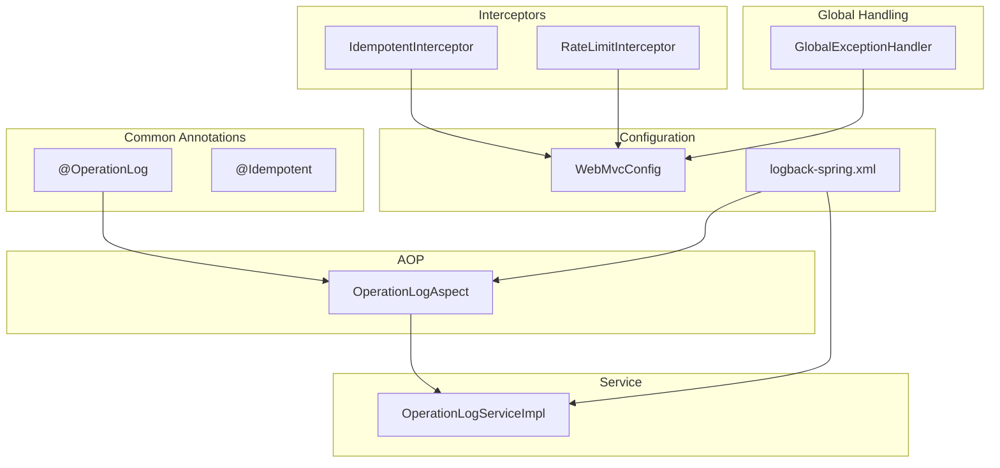
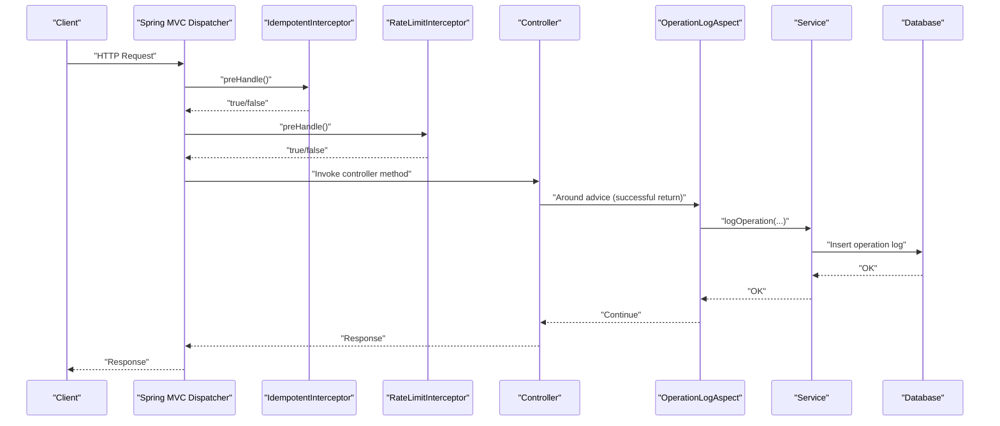
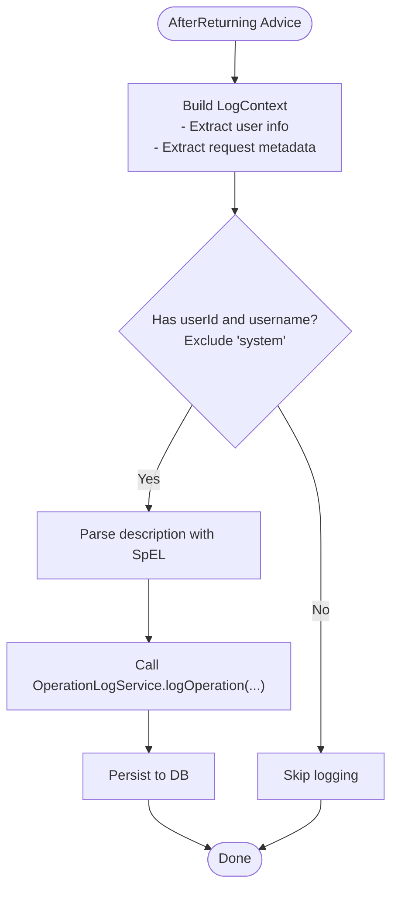
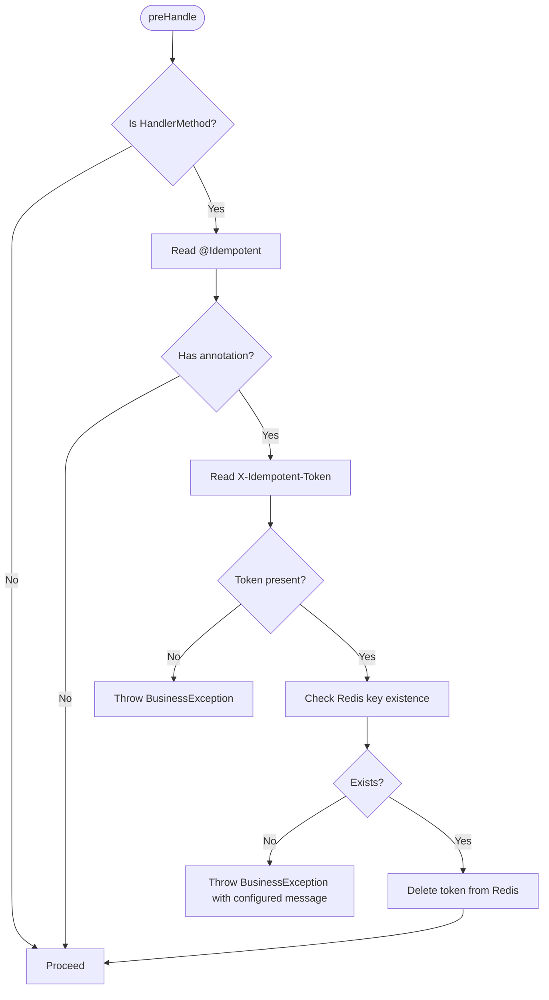
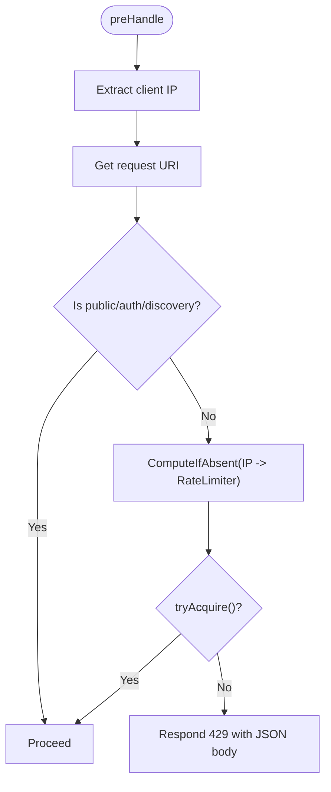
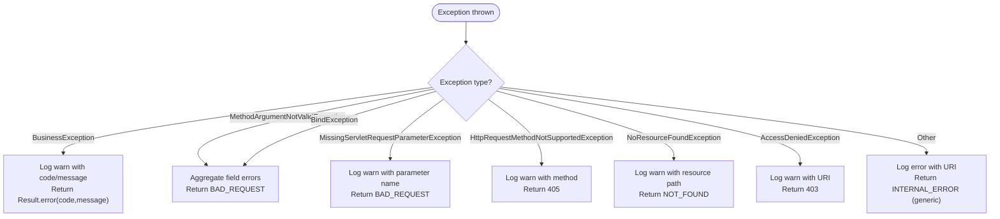
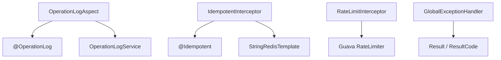

# Cross-Cutting Concerns

<cite>
**Referenced Files in This Document**
- [OperationLogAspect.java](file://admin-backend/src/main/java/com/qhiot/survey/common/aspect/OperationLogAspect.java)
- [OperationLog.java](file://admin-backend/src/main/java/com/qhiot/survey/common/annotation/OperationLog.java)
- [IdempotentInterceptor.java](file://admin-backend/src/main/java/com/qhiot/survey/common/interceptor/IdempotentInterceptor.java)
- [Idempotent.java](file://admin-backend/src/main/java/com/qhiot/survey/common/annotation/Idempotent.java)
- [RateLimitInterceptor.java](file://admin-backend/src/main/java/com/qhiot/survey/common/RateLimitInterceptor.java)
- [GlobalExceptionHandler.java](file://admin-backend/src/main/java/com/qhiot/survey/common/GlobalExceptionHandler.java)
- [WebMvcConfig.java](file://admin-backend/src/main/java/com/qhiot/survey/config/WebMvcConfig.java)
- [logback-spring.xml](file://admin-backend/src/main/resources/logback-spring.xml)
- [OperationLogServiceImpl.java](file://admin-backend/src/main/java/com/qhiot/survey/service/impl/OperationLogServiceImpl.java)
</cite>

## Table of Contents
1. [Introduction](#introduction)
2. [Project Structure](#project-structure)
3. [Core Components](#core-components)
4. [Architecture Overview](#architecture-overview)
5. [Detailed Component Analysis](#detailed-component-analysis)
6. [Dependency Analysis](#dependency-analysis)
7. [Performance Considerations](#performance-considerations)
8. [Troubleshooting Guide](#troubleshooting-guide)
9. [Conclusion](#conclusion)
10. [Appendices](#appendices)

## Introduction
This document explains the cross-cutting concerns implemented in the backend application, focusing on:
- Automatic operation logging via OperationLogAspect
- IdempotentInterceptor for preventing duplicate requests
- RateLimitInterceptor for traffic control
- GlobalExceptionHandler for centralized error handling

It details the AOP implementation patterns, interceptor chain execution, exception handling strategies, logging configuration with Logback, structured logging approaches, and monitoring integration. Practical examples demonstrate how these concerns improve reliability, security, and maintainability, along with configuration options and customization possibilities.

## Project Structure
The cross-cutting concerns are implemented across dedicated packages:
- common/annotation: Cross-cutting concern annotations (e.g., @OperationLog, @Idempotent)
- common/aspect: AOP aspects (e.g., OperationLogAspect)
- common/interceptor: Spring MVC interceptors (e.g., IdempotentInterceptor, RateLimitInterceptor)
- common: Global exception handler (GlobalExceptionHandler)
- config: Web MVC registration (WebMvcConfig)
- resources: Logging configuration (logback-spring.xml)
- service/impl: Supporting service for operation logs (OperationLogServiceImpl)

**Diagram sources**
- [OperationLogAspect.java:35-39](file://admin-backend/src/main/java/com/qhiot/survey/common/aspect/OperationLogAspect.java#L35-L39)
- [OperationLog.java:12-39](file://admin-backend/src/main/java/com/qhiot/survey/common/annotation/OperationLog.java#L12-L39)
- [IdempotentInterceptor.java:23-25](file://admin-backend/src/main/java/com/qhiot/survey/common/interceptor/IdempotentInterceptor.java#L23-L25)
- [Idempotent.java:12-23](file://admin-backend/src/main/java/com/qhiot/survey/common/annotation/Idempotent.java#L12-L23)
- [RateLimitInterceptor.java:19-29](file://admin-backend/src/main/java/com/qhiot/survey/common/RateLimitInterceptor.java#L19-L29)
- [GlobalExceptionHandler.java:23-23](file://admin-backend/src/main/java/com/qhiot/survey/common/GlobalExceptionHandler.java#L23-L23)
- [WebMvcConfig.java:14-27](file://admin-backend/src/main/java/com/qhiot/survey/config/WebMvcConfig.java#L14-L27)
- [logback-spring.xml:93-101](file://admin-backend/src/main/resources/logback-spring.xml#L93-L101)
- [OperationLogServiceImpl.java:25-72](file://admin-backend/src/main/java/com/qhiot/survey/service/impl/OperationLogServiceImpl.java#L25-L72)

**Section sources**
- [WebMvcConfig.java:14-27](file://admin-backend/src/main/java/com/qhiot/survey/config/WebMvcConfig.java#L14-L27)
- [logback-spring.xml:93-101](file://admin-backend/src/main/resources/logback-spring.xml#L93-L101)

## Core Components
- OperationLogAspect: Asynchronous AOP logging for successful operations, extracting user context, request metadata, and resolving structured descriptions via SpEL expressions.
- IdempotentInterceptor: Validates a token header to prevent duplicate submissions using Redis.
- RateLimitInterceptor: Enforces per-IP request rate limits using Guava RateLimiter, excluding public/auth endpoints.
- GlobalExceptionHandler: Centralized error handling returning standardized Result responses and logging error details.

**Section sources**
- [OperationLogAspect.java:35-182](file://admin-backend/src/main/java/com/qhiot/survey/common/aspect/OperationLogAspect.java#L35-L182)
- [IdempotentInterceptor.java:23-61](file://admin-backend/src/main/java/com/qhiot/survey/common/interceptor/IdempotentInterceptor.java#L23-L61)
- [RateLimitInterceptor.java:19-54](file://admin-backend/src/main/java/com/qhiot/survey/common/RateLimitInterceptor.java#L19-L54)
- [GlobalExceptionHandler.java:23-102](file://admin-backend/src/main/java/com/qhiot/survey/common/GlobalExceptionHandler.java#L23-L102)

## Architecture Overview
The cross-cutting concerns integrate with Spring’s AOP and MVC interceptor chain. OperationLogAspect runs around annotated methods to capture successful operations asynchronously. IdempotentInterceptor and RateLimitInterceptor filter incoming requests before controllers execute. GlobalExceptionHandler standardizes error responses globally.

**Diagram sources**
- [OperationLogAspect.java:56-64](file://admin-backend/src/main/java/com/qhiot/survey/common/aspect/OperationLogAspect.java#L56-L64)
- [IdempotentInterceptor.java:29-61](file://admin-backend/src/main/java/com/qhiot/survey/common/interceptor/IdempotentInterceptor.java#L29-L61)
- [RateLimitInterceptor.java:32-54](file://admin-backend/src/main/java/com/qhiot/survey/common/RateLimitInterceptor.java#L32-L54)
- [OperationLogServiceImpl.java:45-72](file://admin-backend/src/main/java/com/qhiot/survey/service/impl/OperationLogServiceImpl.java#L45-L72)

## Detailed Component Analysis

### OperationLogAspect
- Purpose: Automatically record successful operations marked with @OperationLog, capturing user identity, IP, User-Agent, and structured descriptions via SpEL.
- AOP Pattern: Uses AfterReturning advice to trigger after successful method execution. Builds a LogContext in the main thread and delegates asynchronous recording to a dedicated executor.
- SpEL Description Parsing: Transforms simple #variable references into SpEL expressions and evaluates them against method arguments and the result object.
- Security Context Extraction: Reads current user via SecurityUtils and validates principal type to avoid system users or missing identities.
- Asynchronous Execution: Delegates to a bean named "operationLogExecutor" to avoid blocking the request thread.
- Structured Logging: Writes to a dedicated logger and appender for operation logs, enabling separate rolling files and async buffering.

**Diagram sources**
- [OperationLogAspect.java:75-182](file://admin-backend/src/main/java/com/qhiot/survey/common/aspect/OperationLogAspect.java#L75-L182)
- [OperationLogServiceImpl.java:45-72](file://admin-backend/src/main/java/com/qhiot/survey/service/impl/OperationLogServiceImpl.java#L45-L72)

**Section sources**
- [OperationLogAspect.java:35-182](file://admin-backend/src/main/java/com/qhiot/survey/common/aspect/OperationLogAspect.java#L35-L182)
- [OperationLog.java:12-39](file://admin-backend/src/main/java/com/qhiot/survey/common/annotation/OperationLog.java#L12-L39)
- [OperationLogServiceImpl.java:45-72](file://admin-backend/src/main/java/com/qhiot/survey/service/impl/OperationLogServiceImpl.java#L45-L72)

### IdempotentInterceptor
- Purpose: Prevent duplicate submissions by validating a token present in the X-Idempotent-Token header. Tokens are stored in Redis and consumed (deleted) upon successful validation.
- Interceptor Chain: Registered globally under /api/** with exclusions for authentication and file upload endpoints.
- Validation Logic: Throws a business exception if the token is missing or invalid; otherwise deletes the token to ensure single-use.

**Diagram sources**
- [IdempotentInterceptor.java:29-61](file://admin-backend/src/main/java/com/qhiot/survey/common/interceptor/IdempotentInterceptor.java#L29-L61)
- [Idempotent.java:12-23](file://admin-backend/src/main/java/com/qhiot/survey/common/annotation/Idempotent.java#L12-L23)
- [WebMvcConfig.java:19-27](file://admin-backend/src/main/java/com/qhiot/survey/config/WebMvcConfig.java#L19-L27)

**Section sources**
- [IdempotentInterceptor.java:23-61](file://admin-backend/src/main/java/com/qhiot/survey/common/interceptor/IdempotentInterceptor.java#L23-L61)
- [Idempotent.java:12-23](file://admin-backend/src/main/java/com/qhiot/survey/common/annotation/Idempotent.java#L12-L23)
- [WebMvcConfig.java:19-27](file://admin-backend/src/main/java/com/qhiot/survey/config/WebMvcConfig.java#L19-L27)

### RateLimitInterceptor
- Purpose: Throttle incoming requests per client IP using Guava RateLimiter with a default permits-per-second rate.
- Exclusions: Public and authentication endpoints are excluded from rate limiting to support login and discovery flows.
- Per-IP Limiters: Maintains a concurrent map of limiters keyed by client IP, lazily created on first request.

**Diagram sources**
- [RateLimitInterceptor.java:32-54](file://admin-backend/src/main/java/com/qhiot/survey/common/RateLimitInterceptor.java#L32-L54)

**Section sources**
- [RateLimitInterceptor.java:19-54](file://admin-backend/src/main/java/com/qhiot/survey/common/RateLimitInterceptor.java#L19-L54)

### GlobalExceptionHandler
- Purpose: Centralized error handling returning standardized Result responses and logging error details for various exception types.
- Coverage: Business exceptions, validation errors, missing parameters, unsupported methods, resource not found, access denied, and unknown exceptions.
- Logging: Emits warnings or errors with request context; production-grade messages hide internal details.

**Diagram sources**
- [GlobalExceptionHandler.java:28-102](file://admin-backend/src/main/java/com/qhiot/survey/common/GlobalExceptionHandler.java#L28-L102)

**Section sources**
- [GlobalExceptionHandler.java:23-102](file://admin-backend/src/main/java/com/qhiot/survey/common/GlobalExceptionHandler.java#L23-L102)

## Dependency Analysis
- OperationLogAspect depends on:
  - OperationLog annotation for metadata
  - SecurityUtils for current user extraction
  - OperationLogService for persistence
  - Async executor bean "operationLogExecutor"
- IdempotentInterceptor depends on:
  - StringRedisTemplate for token validation
  - Idempotent annotation for opt-in
- RateLimitInterceptor depends on:
  - Guava RateLimiter
  - HttpServletRequest for IP extraction
- GlobalExceptionHandler depends on:
  - Spring MVC exception types
  - Result and ResultCode for standardized responses

**Diagram sources**
- [OperationLogAspect.java:41-42](file://admin-backend/src/main/java/com/qhiot/survey/common/aspect/OperationLogAspect.java#L41-L42)
- [OperationLog.java:12-39](file://admin-backend/src/main/java/com/qhiot/survey/common/annotation/OperationLog.java#L12-L39)
- [IdempotentInterceptor.java:25-25](file://admin-backend/src/main/java/com/qhiot/survey/common/interceptor/IdempotentInterceptor.java#L25-L25)
- [Idempotent.java:12-23](file://admin-backend/src/main/java/com/qhiot/survey/common/annotation/Idempotent.java#L12-L23)
- [RateLimitInterceptor.java:3-3](file://admin-backend/src/main/java/com/qhiot/survey/common/RateLimitInterceptor.java#L3-L3)
- [GlobalExceptionHandler.java:23-23](file://admin-backend/src/main/java/com/qhiot/survey/common/GlobalExceptionHandler.java#L23-L23)

**Section sources**
- [OperationLogAspect.java:41-42](file://admin-backend/src/main/java/com/qhiot/survey/common/aspect/OperationLogAspect.java#L41-L42)
- [IdempotentInterceptor.java:25-25](file://admin-backend/src/main/java/com/qhiot/survey/common/interceptor/IdempotentInterceptor.java#L25-L25)
- [RateLimitInterceptor.java:3-3](file://admin-backend/src/main/java/com/qhiot/survey/common/RateLimitInterceptor.java#L3-L3)
- [GlobalExceptionHandler.java:23-23](file://admin-backend/src/main/java/com/qhiot/survey/common/GlobalExceptionHandler.java#L23-L23)

## Performance Considerations
- Asynchronous Operation Logging: Offloads persistence to a dedicated executor to reduce request latency. The Logback configuration uses an AsyncAppender for the operation logger to decouple I/O from request threads.
- Redis-Based Idempotency: Efficient token existence checks and atomic deletion minimize overhead while ensuring single-use tokens.
- RateLimiter Per-IP: Concurrent map lookup and tryAcquire are lightweight; default permits-per-second can be tuned per endpoint or environment.
- Centralized Error Handling: Reduces controller boilerplate and ensures consistent error payloads.

[No sources needed since this section provides general guidance]

## Troubleshooting Guide
- Operation logs not recorded:
  - Verify @OperationLog annotation presence and successful method completion (only successful returns trigger logging).
  - Confirm operationLogExecutor bean exists and is configured.
  - Check operation logger configuration in Logback and AsyncAppender queue settings.
- Duplicate submission errors:
  - Ensure clients send X-Idempotent-Token header with each request requiring idempotency.
  - Confirm Redis connectivity and token lifecycle.
- Rate limit exceeded:
  - Review default permits-per-second and adjust per endpoint or environment.
  - Verify excluded paths for public/auth endpoints.
- Standardized error responses:
  - Confirm GlobalExceptionHandler is registered and exception types are handled.
  - Validate Result and ResultCode usage across the application.

**Section sources**
- [OperationLogAspect.java:56-64](file://admin-backend/src/main/java/com/qhiot/survey/common/aspect/OperationLogAspect.java#L56-L64)
- [logback-spring.xml:77-83](file://admin-backend/src/main/resources/logback-spring.xml#L77-L83)
- [IdempotentInterceptor.java:43-57](file://admin-backend/src/main/java/com/qhiot/survey/common/interceptor/IdempotentInterceptor.java#L43-L57)
- [RateLimitInterceptor.java:42-51](file://admin-backend/src/main/java/com/qhiot/survey/common/RateLimitInterceptor.java#L42-L51)
- [GlobalExceptionHandler.java:28-102](file://admin-backend/src/main/java/com/qhiot/survey/common/GlobalExceptionHandler.java#L28-L102)

## Conclusion
These cross-cutting concerns collectively enhance reliability, security, and maintainability:
- OperationLogAspect provides transparent, structured auditing for successful operations.
- IdempotentInterceptor prevents accidental duplicate submissions, improving data integrity.
- RateLimitInterceptor protects the system from abuse and resource exhaustion.
- GlobalExceptionHandler ensures consistent, secure error reporting.

They are integrated cleanly via Spring AOP and MVC, with robust logging and extensibility points for future enhancements.

[No sources needed since this section summarizes without analyzing specific files]

## Appendices

### Logging Configuration and Monitoring Integration
- Dedicated operation logger and AsyncAppender decouple I/O and improve throughput.
- Separate rolling files for operation logs enable targeted monitoring and alerting.
- Third-party library log levels are tuned to balance observability and noise.
- Structured logging supports downstream aggregation and analysis.

**Section sources**
- [logback-spring.xml:63-101](file://admin-backend/src/main/resources/logback-spring.xml#L63-L101)

### Configuration Options and Customization
- OperationLogAspect
  - Annotation fields: module, action, description (supports SpEL), targetType, riskLevel.
  - Executor bean name: "operationLogExecutor".
  - IP extraction logic: respects proxy headers and trims values.
- IdempotentInterceptor
  - Header name: "X-Idempotent-Token".
  - Redis key prefix: "idempotent:token:".
  - Expirations and messages configurable via @Idempotent annotation defaults.
  - Registration exclusions: customize in WebMvcConfig.
- RateLimitInterceptor
  - Default permits-per-second: adjustable in code.
  - Excluded paths: customize in preHandle logic.
  - IP extraction: respects proxy headers.
- GlobalExceptionHandler
  - Standardized Result responses for business and framework exceptions.
  - Production-safe messages; development environments can expose more details.

**Section sources**
- [OperationLog.java:12-39](file://admin-backend/src/main/java/com/qhiot/survey/common/annotation/OperationLog.java#L12-L39)
- [Idempotent.java:12-23](file://admin-backend/src/main/java/com/qhiot/survey/common/annotation/Idempotent.java#L12-L23)
- [WebMvcConfig.java:19-27](file://admin-backend/src/main/java/com/qhiot/survey/config/WebMvcConfig.java#L19-L27)
- [RateLimitInterceptor.java:24-43](file://admin-backend/src/main/java/com/qhiot/survey/common/RateLimitInterceptor.java#L24-L43)
- [GlobalExceptionHandler.java:28-102](file://admin-backend/src/main/java/com/qhiot/survey/common/GlobalExceptionHandler.java#L28-L102)