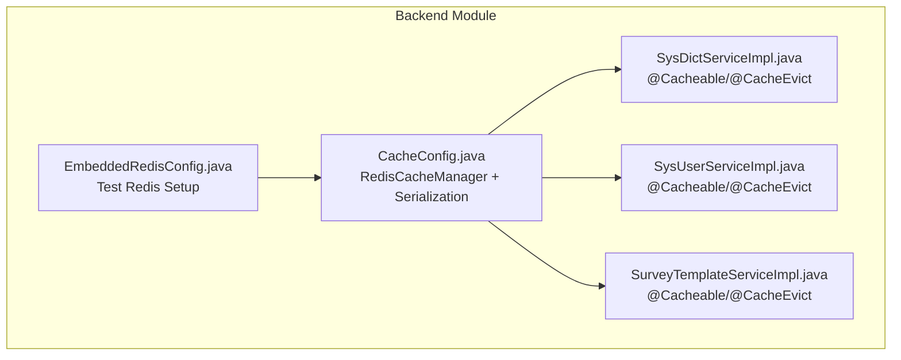
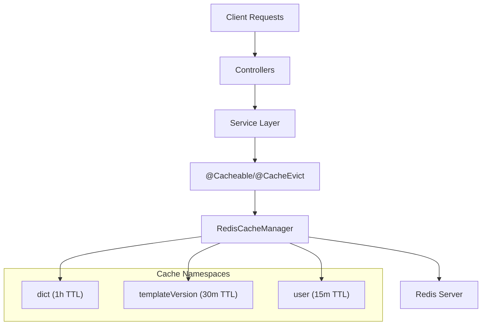
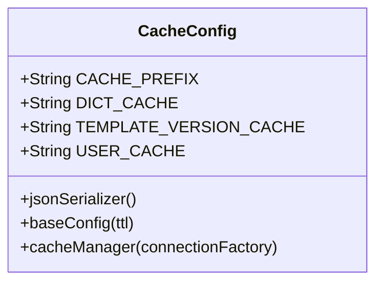
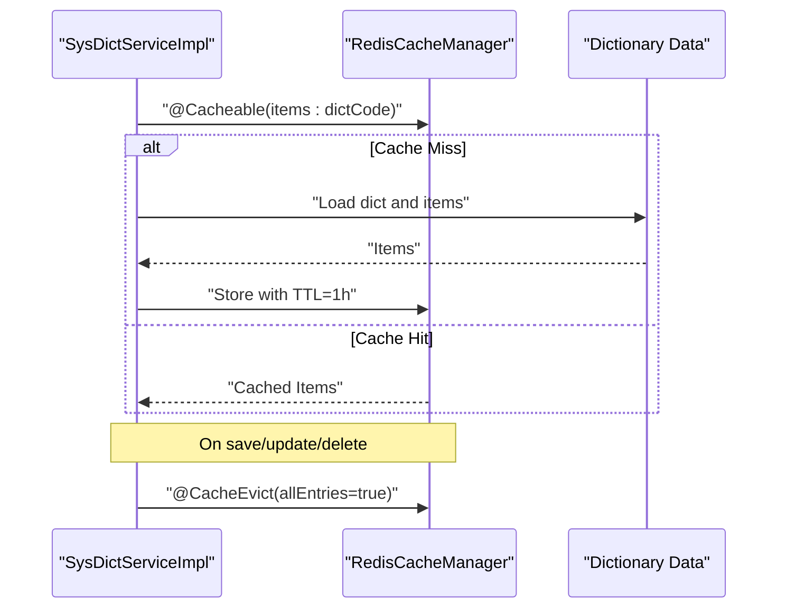
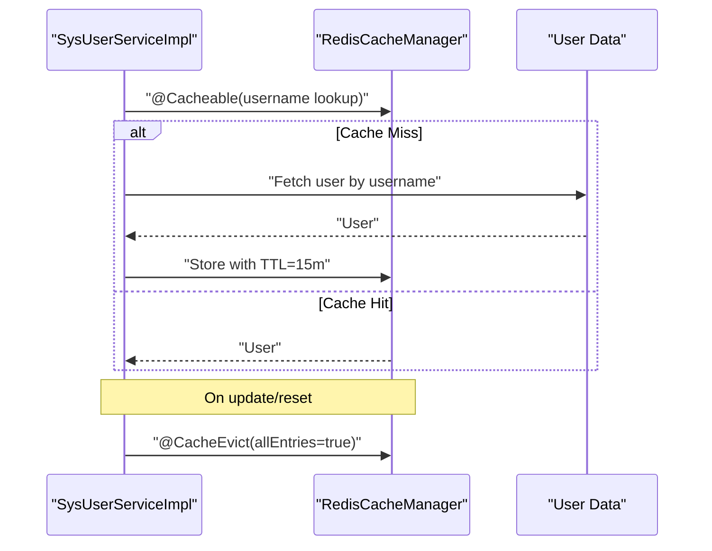
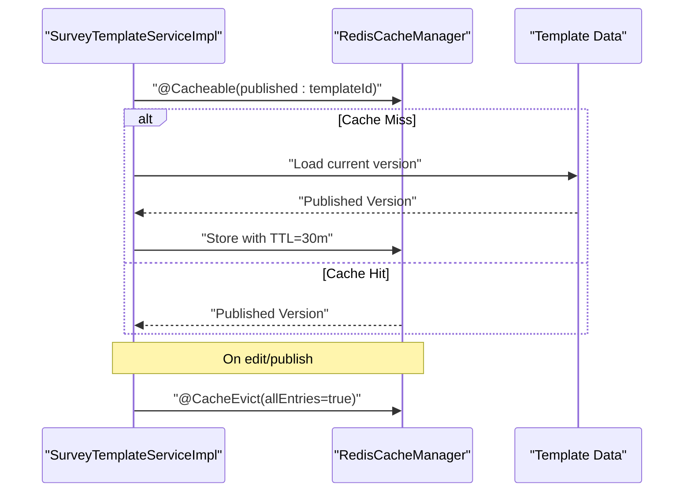
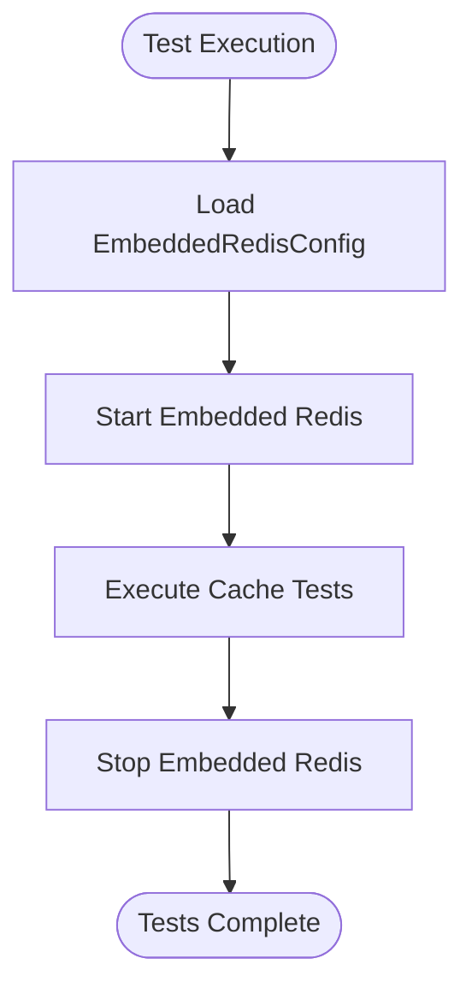
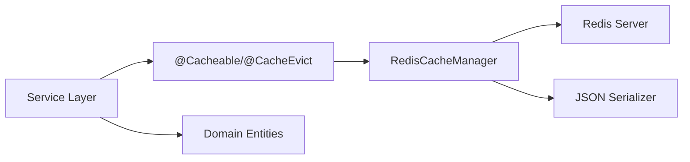

# Cache & Redis Performance

<cite>
**Referenced Files in This Document**
- [CacheConfig.java](file://admin-backend/src/main/java/com/qhiot/survey/config/CacheConfig.java)
- [SysDictServiceImpl.java](file://admin-backend/src/main/java/com/qhiot/survey/service/impl/SysDictServiceImpl.java)
- [SysUserServiceImpl.java](file://admin-backend/src/main/java/com/qhiot/survey/service/impl/SysUserServiceImpl.java)
- [SurveyTemplateServiceImpl.java](file://admin-backend/src/main/java/com/qhiot/survey/service/impl/SurveyTemplateServiceImpl.java)
- [EmbeddedRedisConfig.java](file://admin-backend/src/test/java/com/qhiot/survey/config/EmbeddedRedisConfig.java)
</cite>

## Table of Contents
1. [Introduction](#introduction)
2. [Project Structure](#project-structure)
3. [Core Components](#core-components)
4. [Architecture Overview](#architecture-overview)
5. [Detailed Component Analysis](#detailed-component-analysis)
6. [Dependency Analysis](#dependency-analysis)
7. [Performance Considerations](#performance-considerations)
8. [Troubleshooting Guide](#troubleshooting-guide)
9. [Conclusion](#conclusion)

## Introduction
This document analyzes the cache and Redis performance implementation within the Survey-App backend. It focuses on the Spring Cache + Redis configuration, cache key strategies, TTL policies, and service-layer caching patterns. The analysis covers how cached data is organized, invalidated, and accessed to ensure optimal performance while maintaining data consistency.

## Project Structure
The caching system is primarily implemented in the backend module under the admin-backend directory. Key components include:
- Cache configuration for Redis and Spring Cache integration
- Service implementations that leverage caching annotations
- Test configuration for embedded Redis during integration tests

**Diagram sources**
- [CacheConfig.java:35-93](file://admin-backend/src/main/java/com/qhiot/survey/config/CacheConfig.java#L35-L93)
- [SysDictServiceImpl.java:42-83](file://admin-backend/src/main/java/com/qhiot/survey/service/impl/SysDictServiceImpl.java#L42-L83)
- [SysUserServiceImpl.java:76-203](file://admin-backend/src/main/java/com/qhiot/survey/service/impl/SysUserServiceImpl.java#L76-L203)
- [SurveyTemplateServiceImpl.java:185-215](file://admin-backend/src/main/java/com/qhiot/survey/service/impl/SurveyTemplateServiceImpl.java#L185-L215)
- [EmbeddedRedisConfig.java](file://admin-backend/src/test/java/com/qhiot/survey/config/EmbeddedRedisConfig.java)

**Section sources**
- [CacheConfig.java:35-93](file://admin-backend/src/main/java/com/qhiot/survey/config/CacheConfig.java#L35-L93)
- [SysDictServiceImpl.java:42-83](file://admin-backend/src/main/java/com/qhiot/survey/service/impl/SysDictServiceImpl.java#L42-L83)
- [SysUserServiceImpl.java:76-203](file://admin-backend/src/main/java/com/qhiot/survey/service/impl/SysUserServiceImpl.java#L76-L203)
- [SurveyTemplateServiceImpl.java:185-215](file://admin-backend/src/main/java/com/qhiot/survey/service/impl/SurveyTemplateServiceImpl.java#L185-L215)
- [EmbeddedRedisConfig.java](file://admin-backend/src/test/java/com/qhiot/survey/config/EmbeddedRedisConfig.java)

## Core Components
- Cache configuration defines serialization, TTL defaults, and cache manager behavior.
- Service implementations apply caching annotations to optimize read-heavy operations and manage invalidation after writes.
- Embedded Redis configuration supports testing environments.

Key responsibilities:
- CacheConfig: Centralizes Redis and Spring Cache setup, including JSON serialization, TTL defaults, and transaction-aware cache writes.
- SysDictServiceImpl: Caches dictionary items and clears the cache namespace upon data changes.
- SysUserServiceImpl: Caches user lookup by username and evicts the user cache on updates or resets.
- SurveyTemplateServiceImpl: Caches published template versions and clears the cache namespace after edits or publishing.
- EmbeddedRedisConfig: Provides an embedded Redis instance for integration tests.

**Section sources**
- [CacheConfig.java:35-93](file://admin-backend/src/main/java/com/qhiot/survey/config/CacheConfig.java#L35-L93)
- [SysDictServiceImpl.java:42-83](file://admin-backend/src/main/java/com/qhiot/survey/service/impl/SysDictServiceImpl.java#L42-L83)
- [SysUserServiceImpl.java:76-203](file://admin-backend/src/main/java/com/qhiot/survey/service/impl/SysUserServiceImpl.java#L76-L203)
- [SurveyTemplateServiceImpl.java:185-215](file://admin-backend/src/main/java/com/qhiot/survey/service/impl/SurveyTemplateServiceImpl.java#L185-L215)
- [EmbeddedRedisConfig.java](file://admin-backend/src/test/java/com/qhiot/survey/config/EmbeddedRedisConfig.java)

## Architecture Overview
The caching architecture integrates Spring Cache annotations with Redis through a RedisCacheManager. It applies per-cache TTL policies and ensures transaction-aware writes to avoid partial or inconsistent cache entries.

**Diagram sources**
- [CacheConfig.java:75-93](file://admin-backend/src/main/java/com/qhiot/survey/config/CacheConfig.java#L75-L93)
- [SysDictServiceImpl.java:42-83](file://admin-backend/src/main/java/com/qhiot/survey/service/impl/SysDictServiceImpl.java#L42-L83)
- [SysUserServiceImpl.java:76-203](file://admin-backend/src/main/java/com/qhiot/survey/service/impl/SysUserServiceImpl.java#L76-L203)
- [SurveyTemplateServiceImpl.java:185-215](file://admin-backend/src/main/java/com/qhiot/survey/service/impl/SurveyTemplateServiceImpl.java#L185-L215)

## Detailed Component Analysis

### Cache Configuration
The cache configuration establishes:
- A shared JSON serializer with time module registration and controlled polymorphic typing for safe deserialization.
- A base cache configuration with a computed key prefix and disabled null caching.
- A RedisCacheManager with:
  - Default TTL of 30 minutes for unspecified caches.
  - Per-cache TTLs:
    - dict: 1 hour
    - templateVersion: 30 minutes
    - user: 15 minutes
  - Transaction awareness to commit cache writes after successful transactions.

**Diagram sources**
- [CacheConfig.java:35-93](file://admin-backend/src/main/java/com/qhiot/survey/config/CacheConfig.java#L35-L93)

**Section sources**
- [CacheConfig.java:48-93](file://admin-backend/src/main/java/com/qhiot/survey/config/CacheConfig.java#L48-L93)

### Dictionary Cache Pattern
The dictionary service caches items by dictionary code and clears the entire dict namespace when data changes occur. This ensures stale data is not served after modifications.

**Diagram sources**
- [SysDictServiceImpl.java:42-83](file://admin-backend/src/main/java/com/qhiot/survey/service/impl/SysDictServiceImpl.java#L42-L83)
- [CacheConfig.java:81-84](file://admin-backend/src/main/java/com/qhiot/survey/config/CacheConfig.java#L81-L84)

**Section sources**
- [SysDictServiceImpl.java:42-83](file://admin-backend/src/main/java/com/qhiot/survey/service/impl/SysDictServiceImpl.java#L42-L83)

### User Cache Pattern
The user service caches user lookups by username and evicts the entire user cache on updates or password resets. This reduces repeated database queries for user identity resolution.

**Diagram sources**
- [SysUserServiceImpl.java:76-203](file://admin-backend/src/main/java/com/qhiot/survey/service/impl/SysUserServiceImpl.java#L76-L203)
- [CacheConfig.java](file://admin-backend/src/main/java/com/qhiot/survey/config/CacheConfig.java#L84)

**Section sources**
- [SysUserServiceImpl.java:76-203](file://admin-backend/src/main/java/com/qhiot/survey/service/impl/SysUserServiceImpl.java#L76-L203)

### Template Version Cache Pattern
The template service caches published versions keyed by template ID and clears the templateVersion namespace on edits or publishing. This accelerates template rendering and audit operations.

**Diagram sources**
- [SurveyTemplateServiceImpl.java:185-215](file://admin-backend/src/main/java/com/qhiot/survey/service/impl/SurveyTemplateServiceImpl.java#L185-L215)
- [CacheConfig.java:82-84](file://admin-backend/src/main/java/com/qhiot/survey/config/CacheConfig.java#L82-L84)

**Section sources**
- [SurveyTemplateServiceImpl.java:185-215](file://admin-backend/src/main/java/com/qhiot/survey/service/impl/SurveyTemplateServiceImpl.java#L185-L215)

### Embedded Redis for Testing
The test configuration sets up an embedded Redis instance to support integration tests without requiring an external Redis server.

**Diagram sources**
- [EmbeddedRedisConfig.java](file://admin-backend/src/test/java/com/qhiot/survey/config/EmbeddedRedisConfig.java)

**Section sources**
- [EmbeddedRedisConfig.java](file://admin-backend/src/test/java/com/qhiot/survey/config/EmbeddedRedisConfig.java)

## Dependency Analysis
The caching layer depends on:
- Spring Cache annotations in services to declare caching and eviction policies.
- RedisCacheManager for cache infrastructure and TTL enforcement.
- JSON serialization for value marshaling/unmarshaling.
- Transaction boundaries to coordinate cache writes.

**Diagram sources**
- [CacheConfig.java:64-93](file://admin-backend/src/main/java/com/qhiot/survey/config/CacheConfig.java#L64-L93)
- [SysDictServiceImpl.java:42-83](file://admin-backend/src/main/java/com/qhiot/survey/service/impl/SysDictServiceImpl.java#L42-L83)
- [SysUserServiceImpl.java:76-203](file://admin-backend/src/main/java/com/qhiot/survey/service/impl/SysUserServiceImpl.java#L76-L203)
- [SurveyTemplateServiceImpl.java:185-215](file://admin-backend/src/main/java/com/qhiot/survey/service/impl/SurveyTemplateServiceImpl.java#L185-L215)

**Section sources**
- [CacheConfig.java:64-93](file://admin-backend/src/main/java/com/qhiot/survey/config/CacheConfig.java#L64-L93)
- [SysDictServiceImpl.java:42-83](file://admin-backend/src/main/java/com/qhiot/survey/service/impl/SysDictServiceImpl.java#L42-L83)
- [SysUserServiceImpl.java:76-203](file://admin-backend/src/main/java/com/qhiot/survey/service/impl/SysUserServiceImpl.java#L76-L203)
- [SurveyTemplateServiceImpl.java:185-215](file://admin-backend/src/main/java/com/qhiot/survey/service/impl/SurveyTemplateServiceImpl.java#L185-L215)

## Performance Considerations
- TTL Strategy: Different cache namespaces use distinct TTLs to balance freshness and performance. High-read, low-churn data (dict) benefits from longer TTLs, while rapidly changing data (user) uses shorter TTLs.
- Transaction Awareness: Enabling transaction-aware cache writes prevents dirty reads and improves consistency by committing cache updates only after successful database transactions.
- Key Design: Keys are prefixed consistently to simplify cache management and selective invalidation. Using cache namespaces allows targeted eviction without scanning entire Redis instances.
- Serialization Overhead: JSON serialization with time module adds overhead but ensures robustness. Consider compression or alternative serializers if payload sizes grow significantly.
- Cache Miss Handling: Services should handle cache misses gracefully and populate caches to reduce future load on the database.

[No sources needed since this section provides general guidance]

## Troubleshooting Guide
Common issues and resolutions:
- Stale Data After Updates: Verify that cache eviction annotations are applied on write operations and that the correct cache namespace is targeted.
- Serialization Errors: Confirm that serialized objects match expected types and that the JSON serializer is configured with appropriate type information.
- Transaction Rollbacks: Ensure cache writes are transaction-aware so failed transactions do not leave inconsistent cache entries.
- Test Environment: Use the embedded Redis configuration for local integration tests to avoid external dependency failures.

**Section sources**
- [CacheConfig.java:89-91](file://admin-backend/src/main/java/com/qhiot/survey/config/CacheConfig.java#L89-L91)
- [SysDictServiceImpl.java:76-83](file://admin-backend/src/main/java/com/qhiot/survey/service/impl/SysDictServiceImpl.java#L76-L83)
- [SysUserServiceImpl.java:167-203](file://admin-backend/src/main/java/com/qhiot/survey/service/impl/SysUserServiceImpl.java#L167-L203)
- [SurveyTemplateServiceImpl.java:210-215](file://admin-backend/src/main/java/com/qhiot/survey/service/impl/SurveyTemplateServiceImpl.java#L210-L215)
- [EmbeddedRedisConfig.java](file://admin-backend/src/test/java/com/qhiot/survey/config/EmbeddedRedisConfig.java)

## Conclusion
The Survey-App backend implements a robust caching strategy using Spring Cache and Redis. By applying per-cache TTL policies, transaction-aware cache writes, and namespace-based invalidation, the system achieves improved performance while maintaining data consistency. The service-layer patterns demonstrate best practices for balancing cache hits, minimizing database load, and ensuring timely cache refresh on data changes.

[No sources needed since this section summarizes without analyzing specific files]