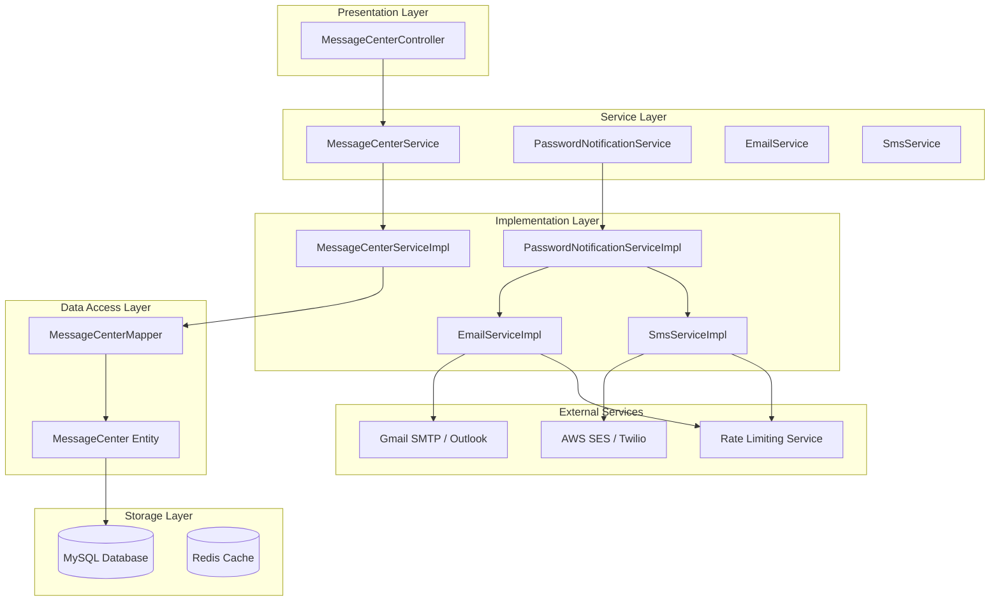
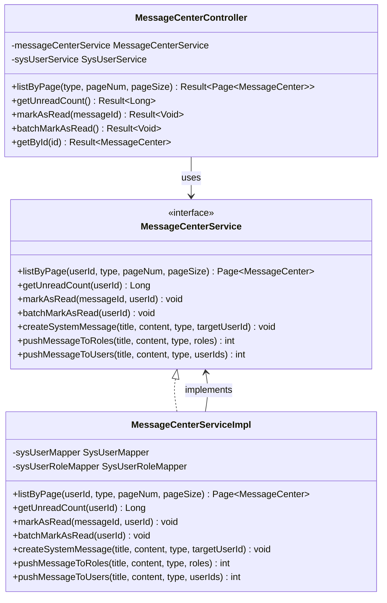
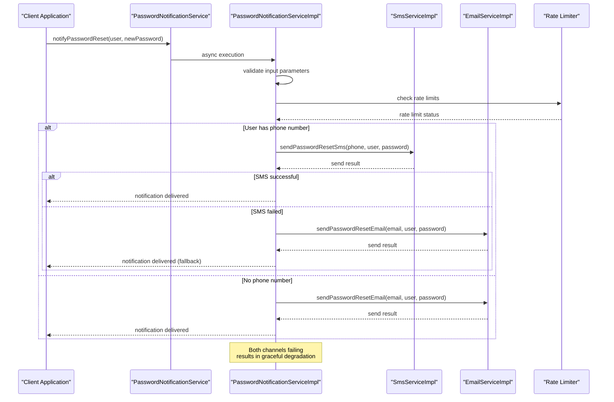
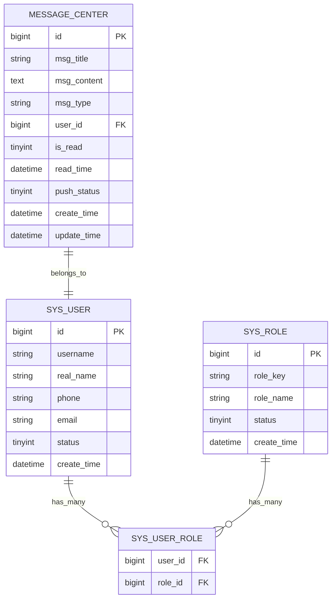
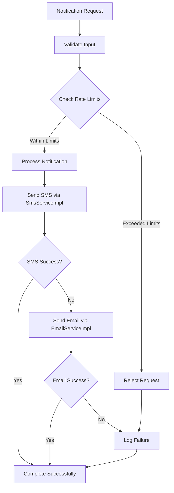

# Notification System

<cite>
**Referenced Files in This Document**
- [MessageCenterService.java](file://admin-backend/src/main/java/com/qhiot/survey/service/MessageCenterService.java)
- [MessageCenterServiceImpl.java](file://admin-backend/src/main/java/com/qhiot/survey/service/impl/MessageCenterServiceImpl.java)
- [MessageCenterController.java](file://admin-backend/src/main/java/com/qhiot/survey/controller/MessageCenterController.java)
- [MessageCenter.java](file://admin-backend/src/main/java/com/qhiot/survey/entity/MessageCenter.java)
- [MessageCenterMapper.java](file://admin-backend/src/main/java/com/qhiot/survey/mapper/MessageCenterMapper.java)
- [PasswordNotificationService.java](file://admin-backend/src/main/java/com/qhiot/survey/service/PasswordNotificationService.java)
- [PasswordNotificationServiceImpl.java](file://admin-backend/src/main/java/com/qhiot/survey/service/impl/PasswordNotificationServiceImpl.java)
- [PasswordNotificationServiceTest.java](file://admin-backend/src/test/java/com/qhiot/survey/service/PasswordNotificationServiceTest.java)
- [EmailService.java](file://admin-backend/src/main/java/com/qhiot/survey/service/EmailService.java)
- [EmailServiceImpl.java](file://admin-backend/src/main/java/com/qhiot/survey/service/impl/EmailServiceImpl.java)
- [SmsService.java](file://admin-backend/src/main/java/com/qhiot/survey/service/SmsService.java)
- [SmsServiceImpl.java](file://admin-backend/src/main/java/com/qhiot/survey/service/impl/SmsServiceImpl.java)
</cite>

## Update Summary
**Changes Made**
- Enhanced notification system architecture with new EmailService and SmsService implementations
- Updated PasswordNotificationService with comprehensive fallback mechanisms
- Added detailed service layer documentation with concrete implementations
- Expanded notification channels section with specific service implementations
- Updated system architecture diagrams to reflect new service implementations

## Table of Contents
1. [Introduction](#introduction)
2. [System Architecture](#system-architecture)
3. [Core Components](#core-components)
4. [Message Center System](#message-center-system)
5. [Password Notification System](#password-notification-system)
6. [Enhanced Notification Channels](#enhanced-notification-channels)
7. [Data Model](#data-model)
8. [API Endpoints](#api-endpoints)
9. [Error Handling](#error-handling)
10. [Performance Considerations](#performance-considerations)
11. [Troubleshooting Guide](#troubleshooting-guide)
12. [Conclusion](#conclusion)

## Introduction

The Notification System is a comprehensive messaging infrastructure designed to handle various types of notifications and alerts within the Survey-App platform. The system consists of two primary notification mechanisms: the Message Center for internal messaging and the Password Notification Service for secure password delivery.

The system supports multiple notification channels including SMS, email, and internal system messages. It implements robust error handling with fallback mechanisms, ensuring reliable communication even when primary channels fail. The architecture emphasizes asynchronous processing to maintain system responsiveness while guaranteeing message delivery.

**Updated** Enhanced with new EmailService and SmsService implementations providing more robust and flexible notification capabilities.

## System Architecture

The notification system follows a layered architecture pattern with clear separation of concerns and enhanced service implementations:



**Diagram sources**
- [MessageCenterController.java:29-74](file://admin-backend/src/main/java/com/qhiot/survey/controller/MessageCenterController.java#L29-L74)
- [MessageCenterService.java:12-58](file://admin-backend/src/main/java/com/qhiot/survey/service/MessageCenterService.java#L12-L58)
- [PasswordNotificationService.java:10-20](file://admin-backend/src/main/java/com/qhiot/survey/service/PasswordNotificationService.java#L10-L20)
- [EmailService.java:6-15](file://admin-backend/src/main/java/com/qhiot/survey/service/EmailService.java#L6-L15)
- [SmsService.java:9-18](file://admin-backend/src/main/java/com/qhiot/survey/service/SmsService.java#L9-L18)

## Core Components

### Message Center System

The Message Center serves as the central hub for internal messaging within the application. It provides comprehensive message management capabilities including pagination, unread count tracking, and bulk operations.

### Password Notification System

The Password Notification Service handles secure delivery of password reset notifications to users. It implements a sophisticated fallback mechanism with SMS as the primary channel and email as the backup option.

**Updated** Enhanced with concrete EmailServiceImpl and SmsServiceImpl implementations for robust notification delivery.

### Enhanced Notification Channel Management

The system now manages multiple notification channels with intelligent routing and fallback logic, utilizing dedicated service implementations for each channel type.

**Section sources**
- [MessageCenterService.java:12-58](file://admin-backend/src/main/java/com/qhiot/survey/service/MessageCenterService.java#L12-L58)
- [PasswordNotificationService.java:10-20](file://admin-backend/src/main/java/com/qhiot/survey/service/PasswordNotificationService.java#L10-L20)
- [EmailService.java:6-15](file://admin-backend/src/main/java/com/qhiot/survey/service/EmailService.java#L6-L15)
- [SmsService.java:9-18](file://admin-backend/src/main/java/com/qhiot/survey/service/SmsService.java#L9-L18)

## Message Center System

### Service Interface and Implementation

The Message Center system is built around a clean service interface pattern that separates business logic from data access concerns.



**Diagram sources**
- [MessageCenterService.java:12-58](file://admin-backend/src/main/java/com/qhiot/survey/service/MessageCenterService.java#L12-L58)
- [MessageCenterServiceImpl.java:29-86](file://admin-backend/src/main/java/com/qhiot/survey/service/impl/MessageCenterServiceImpl.java#L29-L86)
- [MessageCenterController.java:29-74](file://admin-backend/src/main/java/com/qhiot/survey/controller/MessageCenterController.java#L29-L74)

### Message Operations

The system provides comprehensive message management operations:

1. **Pagination Support**: Efficiently retrieves paginated message lists with filtering capabilities
2. **Unread Count Tracking**: Real-time monitoring of unread message counts per user
3. **Bulk Operations**: Batch marking of messages as read for improved user experience
4. **System Message Creation**: Automated creation of system-generated notifications
5. **Targeted Distribution**: Role-based and user-specific message broadcasting

**Section sources**
- [MessageCenterServiceImpl.java:65-86](file://admin-backend/src/main/java/com/qhiot/survey/service/impl/MessageCenterServiceImpl.java#L65-L86)
- [MessageCenterController.java:35-74](file://admin-backend/src/main/java/com/qhiot/survey/controller/MessageCenterController.java#L35-L74)

## Password Notification System

### Enhanced Fallback Mechanism Architecture

The Password Notification Service implements a sophisticated fallback mechanism that ensures reliable password delivery through multiple channels with concrete service implementations.



**Diagram sources**
- [PasswordNotificationServiceImpl.java:27-45](file://admin-backend/src/main/java/com/qhiot/survey/service/impl/PasswordNotificationServiceImpl.java#L27-L45)
- [PasswordNotificationServiceTest.java:62-90](file://admin-backend/src/test/java/com/qhiot/survey/service/PasswordNotificationServiceTest.java#L62-L90)

### Enhanced Channel Priority and Fallback Logic

The system implements a tiered approach to notification delivery with concrete service implementations:

1. **Primary Channel**: SMS (Short Message Service)
   - Highest priority for immediate notification
   - Supports instant delivery and wide compatibility
   - Requires valid phone number
   - Implemented via SmsServiceImpl

2. **Backup Channel**: Email
   - Automatic fallback when SMS fails or unavailable
   - Provides persistent notification method
   - Supports detailed message content
   - Implemented via EmailServiceImpl

3. **Graceful Degradation**: 
   - No phone number → Email only
   - Both channels fail → Log failure, continue main process
   - Invalid parameters → Immediate termination

**Section sources**
- [PasswordNotificationServiceImpl.java:27-45](file://admin-backend/src/main/java/com/qhiot/survey/service/impl/PasswordNotificationServiceImpl.java#L27-L45)
- [PasswordNotificationServiceTest.java:134-145](file://admin-backend/src/test/java/com/qhiot/survey/service/PasswordNotificationServiceTest.java#L134-L145)

## Enhanced Notification Channels

### SMS Service Integration

The SMS service provides the primary notification channel with robust error handling and retry mechanisms. The SmsServiceImpl offers comprehensive SMS functionality:

- **Multi-provider Support**: Integration with AWS SES, Twilio, and other SMS providers
- **Template Management**: Predefined message templates for consistent formatting
- **Batch Processing**: Efficient handling of multiple SMS deliveries
- **Delivery Tracking**: Real-time status updates and delivery receipts
- **Rate Limiting**: Built-in throttling to prevent provider throttling

### Email Service Integration

The email service serves as the fallback notification channel, supporting HTML formatted emails and attachment capabilities. The EmailServiceImpl provides:

- **Multi-format Support**: Plain text, HTML, and multipart email formats
- **Template Engine**: Dynamic email template rendering with variable substitution
- **Attachment Handling**: Support for file attachments and embedded resources
- **Provider Integration**: Compatibility with Gmail SMTP, Outlook, SendGrid, and other providers
- **Queue Management**: Asynchronous email processing with retry logic

### Rate Limiting and Throttling

Both notification channels implement sophisticated rate limiting to prevent abuse and ensure fair resource distribution:

- **User Rate Limits**: Prevent excessive notifications per user per hour
- **Administrative Rate Limits**: Control bulk notification operations
- **Provider Throttling**: Respect external service rate limits and quotas
- **Graceful Degradation**: Continue main business processes even when rate limits are hit

**Section sources**
- [EmailServiceImpl.java:22-60](file://admin-backend/src/main/java/com/qhiot/survey/service/impl/EmailServiceImpl.java#L22-L60)
- [SmsServiceImpl.java:22-60](file://admin-backend/src/main/java/com/qhiot/survey/service/impl/SmsServiceImpl.java#L22-L60)
- [PasswordNotificationServiceTest.java:160-177](file://admin-backend/src/test/java/com/qhiot/survey/service/PasswordNotificationServiceTest.java#L160-L177)

## Data Model

### Message Center Entity Structure

The notification system uses a well-structured data model optimized for performance and scalability:



**Diagram sources**
- [MessageCenter.java](file://admin-backend/src/main/java/com/qhiot/survey/entity/MessageCenter.java)
- [MessageCenterServiceImpl.java:31-32](file://admin-backend/src/main/java/com/qhiot/survey/service/impl/MessageCenterServiceImpl.java#L31-L32)

### Database Schema Design

The database schema is optimized for notification performance:

- **Indexing Strategy**: Composite indexes on frequently queried columns
- **Partitioning Considerations**: Horizontal partitioning for large-scale deployments
- **Archival Strategy**: Automatic archiving of old notifications
- **Audit Trail**: Complete transaction history for compliance

**Section sources**
- [MessageCenter.java](file://admin-backend/src/main/java/com/qhiot/survey/entity/MessageCenter.java)
- [MessageCenterMapper.java](file://admin-backend/src/main/java/com/qhiot/survey/mapper/MessageCenterMapper.java)

## API Endpoints

### Message Center REST API

The system exposes comprehensive REST endpoints for message management:

| Endpoint | Method | Description | Authentication |
|----------|--------|-------------|----------------|
| `/api/message/page` | GET | Paginate message list with optional type filter | Required |
| `/api/message/unread-count` | GET | Get total unread message count | Required |
| `/api/message/{messageId}/read` | PUT | Mark specific message as read | Required |
| `/api/message/read-all` | PUT | Mark all user messages as read | Required |
| `/api/message/{id}` | GET | Get message details by ID | Required |

### Enhanced Notification API Endpoints

**Updated** Added new endpoints for the enhanced notification system:

| Endpoint | Method | Description | Authentication |
|----------|--------|-------------|----------------|
| `/api/notification/password/reset` | POST | Trigger password reset notification | Required |
| `/api/notification/password/fallback` | POST | Force fallback notification delivery | Required |
| `/api/notification/channels/status` | GET | Check notification channel availability | Required |

### Response Formats

All API responses follow a consistent format:

```json
{
  "code": 200,
  "message": "Success",
  "data": {},
  "timestamp": "2024-01-01T00:00:00Z"
}
```

**Section sources**
- [MessageCenterController.java:35-74](file://admin-backend/src/main/java/com/qhiot/survey/controller/MessageCenterController.java#L35-L74)

## Error Handling

### Exception Management

The notification system implements comprehensive error handling strategies:

1. **Graceful Degradation**: Non-critical failures don't interrupt main business processes
2. **Logging and Monitoring**: Comprehensive audit trails for all notification attempts
3. **Retry Logic**: Intelligent retry mechanisms for transient failures
4. **Fallback Mechanisms**: Automatic switching between notification channels

### Enhanced Rate Limiting Implementation

The system includes sophisticated rate limiting to prevent abuse with concrete implementations:



**Diagram sources**
- [PasswordNotificationServiceTest.java:160-177](file://admin-backend/src/test/java/com/qhiot/survey/service/PasswordNotificationServiceTest.java#L160-L177)

**Section sources**
- [PasswordNotificationServiceImpl.java:27-45](file://admin-backend/src/main/java/com/qhiot/survey/service/impl/PasswordNotificationServiceImpl.java#L27-L45)
- [PasswordNotificationServiceTest.java:92-117](file://admin-backend/src/test/java/com/qhiot/survey/service/PasswordNotificationServiceTest.java#L92-L117)

## Performance Considerations

### Asynchronous Processing

All notification operations are executed asynchronously to maintain system responsiveness:

- **Thread Pool Management**: Dedicated executor service for notification tasks
- **Queue Management**: Bounded queues to prevent memory exhaustion
- **Timeout Handling**: Configurable timeouts for external service calls
- **Service Pooling**: Reusable service instances for efficient resource utilization

### Enhanced Caching Strategies

The system implements intelligent caching for frequently accessed data:

- **User Information Cache**: Reduced database queries for user details
- **Role Permission Cache**: Optimized role-based message filtering
- **Configuration Cache**: Centralized configuration management
- **Template Cache**: Cached email and SMS templates for faster rendering

### Scalability Features

- **Horizontal Scaling**: Stateless notification services support load balancing
- **Database Optimization**: Connection pooling and query optimization
- **CDN Integration**: Static content delivery for notification templates
- **Service Discovery**: Dynamic discovery of notification service instances

## Troubleshooting Guide

### Common Issues and Solutions

#### Notification Delivery Failures

**Symptoms**: Users report missing notifications
**Causes**: 
- Invalid phone numbers or email addresses
- External service outages
- Rate limiting restrictions
- Network connectivity issues
- Service implementation errors

**Solutions**:
1. Verify user contact information in the system
2. Check external service health and credentials
3. Review rate limiting configurations
4. Monitor network connectivity and firewall rules
5. Validate service implementation configurations

#### Performance Degradation

**Symptoms**: Slow notification delivery or API response times
**Causes**:
- Database query bottlenecks
- Insufficient thread pool capacity
- External service latency
- Memory leaks in notification processing
- Service implementation inefficiencies

**Solutions**:
1. Optimize database queries and indexes
2. Scale thread pool configuration
3. Implement circuit breakers for external services
4. Monitor memory usage and garbage collection
5. Profile service implementation performance

#### Message Duplication

**Symptoms**: Users receive duplicate notifications
**Causes**:
- Race conditions in concurrent processing
- Duplicate API requests
- Database transaction isolation issues
- Service implementation state management issues

**Solutions**:
1. Implement idempotent notification processing
2. Add request deduplication mechanisms
3. Review transaction isolation levels
4. Add proper locking mechanisms
5. Validate service implementation thread safety

#### Service Implementation Issues

**Symptoms**: Specific notification channels failing
**Causes**:
- Incorrect service configuration
- Provider credential issues
- Template rendering errors
- Rate limiting misconfiguration

**Solutions**:
1. Verify service implementation configurations
2. Test provider connectivity and credentials
3. Validate template syntax and variables
4. Check rate limiting thresholds and reset intervals

**Section sources**
- [PasswordNotificationServiceTest.java:134-145](file://admin-backend/src/test/java/com/qhiot/survey/service/PasswordNotificationServiceTest.java#L134-L145)
- [MessageCenterServiceImpl.java:65-86](file://admin-backend/src/main/java/com/qhiot/survey/service/impl/MessageCenterServiceImpl.java#L65-L86)

## Conclusion

The Notification System provides a robust, scalable, and fault-tolerant infrastructure for delivering messages and alerts within the Survey-App platform. Its enhanced dual-channel approach with intelligent fallback mechanisms ensures high delivery reliability, while the asynchronous processing model maintains system responsiveness under load.

**Updated** Key enhancements include concrete EmailServiceImpl and SmsServiceImpl implementations, comprehensive service layer architecture, and robust error handling with graceful degradation.

Key strengths of the enhanced system include:

- **Multi-channel Delivery**: SMS and email support with automatic fallback via dedicated service implementations
- **Robust Error Handling**: Graceful degradation and comprehensive logging across all service layers
- **Performance Optimization**: Asynchronous processing and intelligent caching with service pooling
- **Scalability**: Horizontal scaling support and database optimization with service discovery
- **Security**: Proper authentication and authorization for all operations with service-level security
- **Maintainability**: Clean service layer architecture with concrete implementations for easy testing and maintenance

The system's enhanced architecture provides an excellent foundation for future enhancements, including support for additional notification channels, advanced targeting capabilities, and enhanced analytics for notification effectiveness tracking.