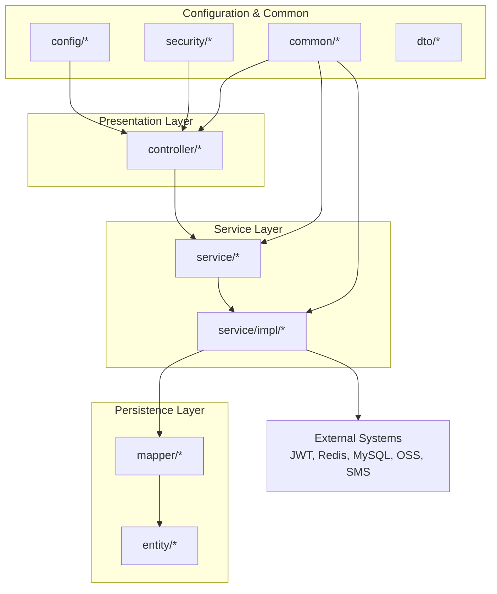
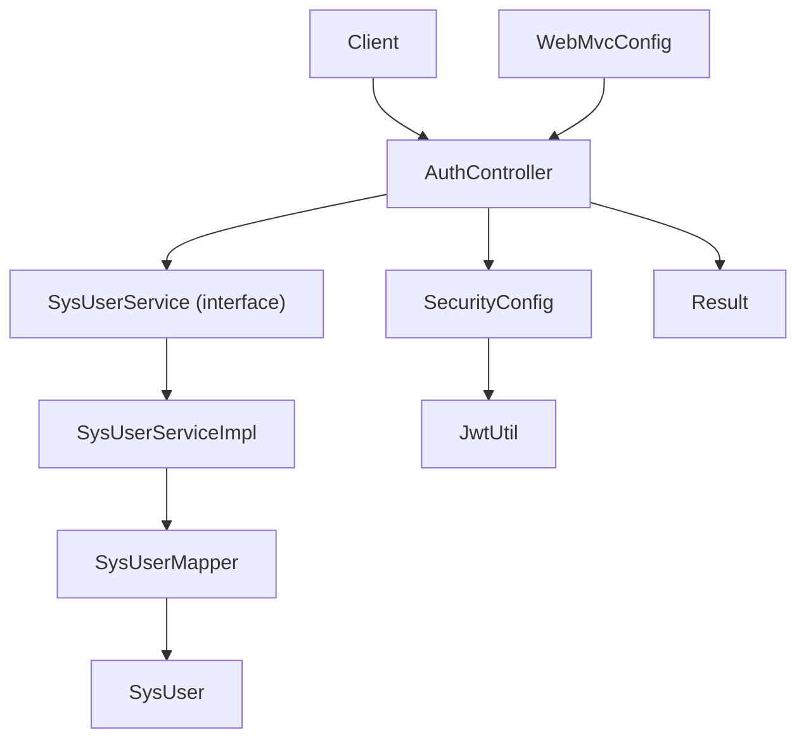
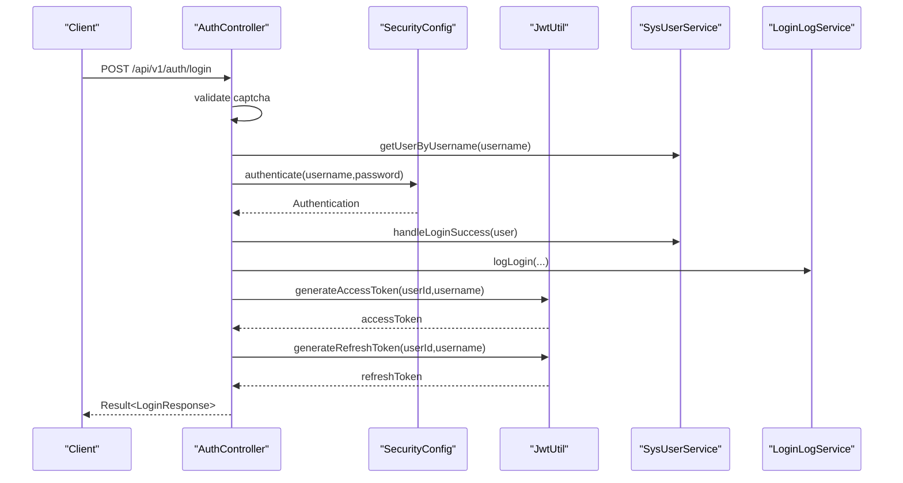
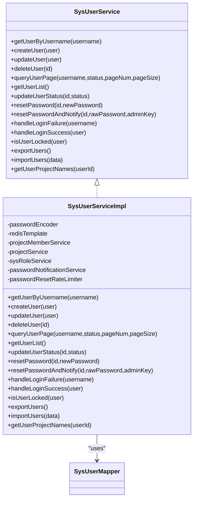
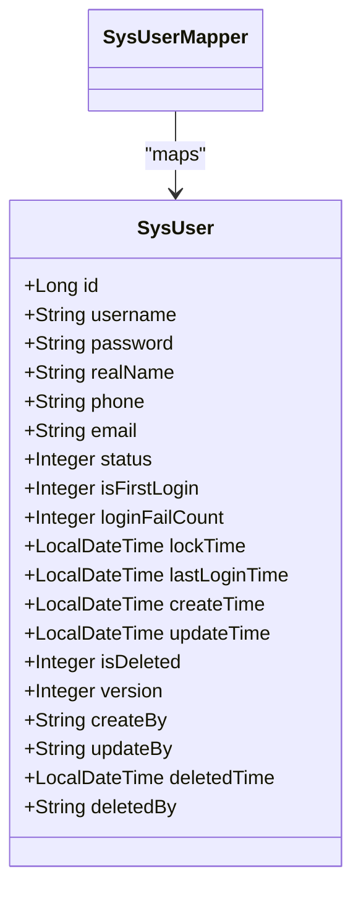
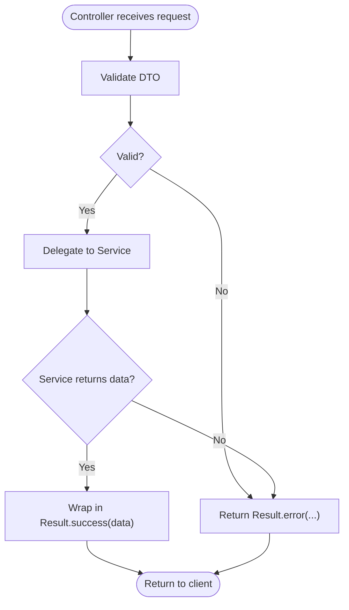
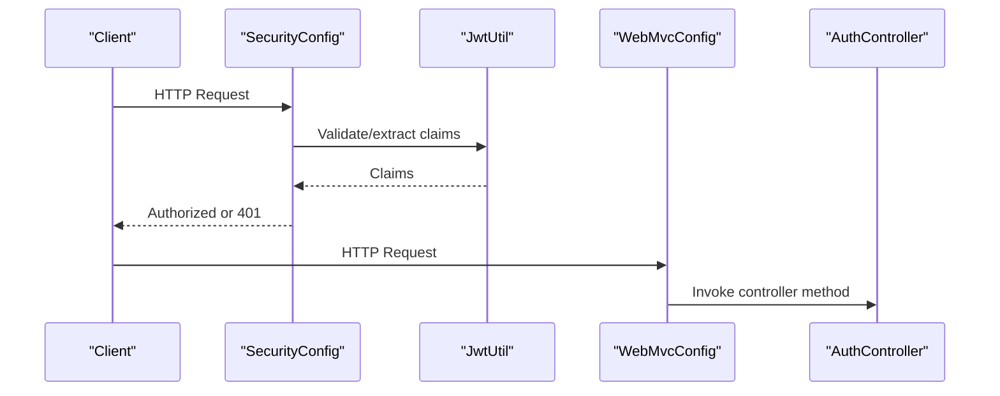
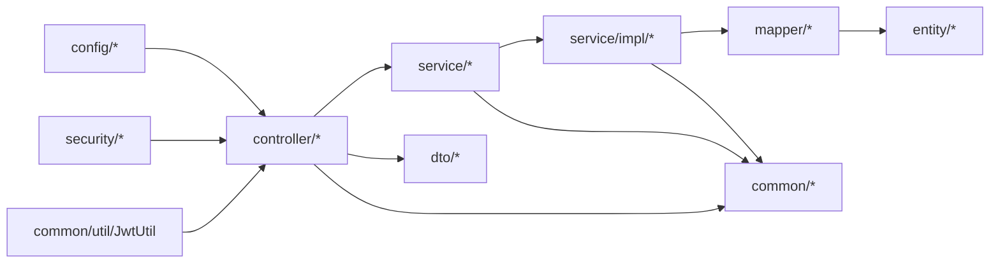

# Package Organization & Conventions

<cite>
**Referenced Files in This Document**
- [SurveyApplication.java](file://admin-backend/src/main/java/com/qhiot/survey/SurveyApplication.java)
- [AuthController.java](file://admin-backend/src/main/java/com/qhiot/survey/controller/AuthController.java)
- [SysUserServiceImpl.java](file://admin-backend/src/main/java/com/qhiot/survey/service/impl/SysUserServiceImpl.java)
- [SysUserMapper.java](file://admin-backend/src/main/java/com/qhiot/survey/mapper/SysUserMapper.java)
- [SysUser.java](file://admin-backend/src/main/java/com/qhiot/survey/entity/SysUser.java)
- [SysUserService.java](file://admin-backend/src/main/java/com/qhiot/survey/service/SysUserService.java)
- [SecurityConfig.java](file://admin-backend/src/main/java/com/qhiot/survey/security/SecurityConfig.java)
- [JwtUtil.java](file://admin-backend/src/main/java/com/qhiot/survey/common/util/JwtUtil.java)
- [WebMvcConfig.java](file://admin-backend/src/main/java/com/qhiot/survey/config/WebMvcConfig.java)
- [Idempotent.java](file://admin-backend/src/main/java/com/qhiot/survey/common/annotation/Idempotent.java)
- [Result.java](file://admin-backend/src/main/java/com/qhiot/survey/common/result/Result.java)
- [LoginRequest.java](file://admin-backend/src/main/java/com/qhiot/survey/dto/LoginRequest.java)
- [PageResult.java](file://admin-backend/src/main/java/com/qhiot/survey/dto/PageResult.java)
- [application.yml](file://admin-backend/src/main/resources/application.yml)
- [pom.xml](file://admin-backend/pom.xml)
</cite>

## Table of Contents
1. [Introduction](#introduction)
2. [Project Structure](#project-structure)
3. [Core Components](#core-components)
4. [Architecture Overview](#architecture-overview)
5. [Detailed Component Analysis](#detailed-component-analysis)
6. [Dependency Analysis](#dependency-analysis)
7. [Performance Considerations](#performance-considerations)
8. [Troubleshooting Guide](#troubleshooting-guide)
9. [Conclusion](#conclusion)

## Introduction
This document describes the backend’s package organization and architectural conventions, focusing on a layered architecture pattern with clear separation among controller, service, mapper, entity, DTO, configuration, and common packages. It explains naming conventions, file organization principles, and code structure patterns, and demonstrates how the Model-View-Control (MVC) pattern is implemented across these layers. It also documents dependency relationships between packages and how they contribute to maintainable, testable, and scalable code organization.

## Project Structure
The backend follows a conventional Spring Boot layout under the package namespace com.qhiot.survey. The primary layers are organized as follows:
- controller: REST endpoints and HTTP request handling
- service: business logic and orchestration
- mapper: MyBatis-Plus mappers for persistence
- entity: JPA-style persistent entities mapped to database tables
- dto: request/response transfer objects
- config: Spring configuration, interceptors, and web settings
- common: shared utilities, annotations, enums, exceptions, and unified response envelopes
- security: Spring Security configuration and filters
- resources: application configuration, MyBatis XML mappings, and logging configuration

**Diagram sources**
- [SurveyApplication.java:22-25](file://admin-backend/src/main/java/com/qhiot/survey/SurveyApplication.java#L22-L25)
- [AuthController.java:1-50](file://admin-backend/src/main/java/com/qhiot/survey/controller/AuthController.java#L1-L50)
- [SysUserServiceImpl.java:1-42](file://admin-backend/src/main/java/com/qhiot/survey/service/impl/SysUserServiceImpl.java#L1-L42)
- [SysUserMapper.java:1-10](file://admin-backend/src/main/java/com/qhiot/survey/mapper/SysUserMapper.java#L1-L10)
- [SysUser.java:1-22](file://admin-backend/src/main/java/com/qhiot/survey/entity/SysUser.java#L1-L22)
- [WebMvcConfig.java:14-28](file://admin-backend/src/main/java/com/qhiot/survey/config/WebMvcConfig.java#L14-L28)
- [SecurityConfig.java:32-61](file://admin-backend/src/main/java/com/qhiot/survey/security/SecurityConfig.java#L32-L61)
- [JwtUtil.java:19-40](file://admin-backend/src/main/java/com/qhiot/survey/common/util/JwtUtil.java#L19-L40)

**Section sources**
- [SurveyApplication.java:22-25](file://admin-backend/src/main/java/com/qhiot/survey/SurveyApplication.java#L22-L25)
- [application.yml:15-96](file://admin-backend/src/main/resources/application.yml#L15-L96)

## Core Components
This section outlines the core architectural building blocks and their responsibilities:
- Controller layer: Exposes REST endpoints, validates requests, delegates to services, and returns unified responses via a common envelope.
- Service layer: Encapsulates business logic, orchestrates domain operations, coordinates with external systems, and manages transactions.
- Mapper layer: Defines MyBatis-Plus mappers for CRUD operations against entities.
- Entity layer: Represents persistent domain models with annotations for ID generation, logical deletion, optimistic locking, and field auto-fill.
- DTO layer: Carries request/response payloads with validation annotations and OpenAPI metadata.
- Configuration layer: Registers interceptors, CORS, security filter chains, and web MVC settings.
- Common layer: Provides shared utilities, annotations, enums, exceptions, and a unified response envelope.

Examples of typical structures:
- Controller: [AuthController.java:46-50](file://admin-backend/src/main/java/com/qhiot/survey/controller/AuthController.java#L46-L50)
- Service interface: [SysUserService.java:10-101](file://admin-backend/src/main/java/com/qhiot/survey/service/SysUserService.java#L10-L101)
- Service implementation: [SysUserServiceImpl.java:42-64](file://admin-backend/src/main/java/com/qhiot/survey/service/impl/SysUserServiceImpl.java#L42-L64)
- Mapper: [SysUserMapper.java:7-9](file://admin-backend/src/main/java/com/qhiot/survey/mapper/SysUserMapper.java#L7-L9)
- Entity: [SysUser.java:19-22](file://admin-backend/src/main/java/com/qhiot/survey/entity/SysUser.java#L19-L22)
- DTO: [LoginRequest.java:11-24](file://admin-backend/src/main/java/com/qhiot/survey/dto/LoginRequest.java#L11-L24), [PageResult.java:17-33](file://admin-backend/src/main/java/com/qhiot/survey/dto/PageResult.java#L17-L33)
- Unified response: [Result.java:11-41](file://admin-backend/src/main/java/com/qhiot/survey/common/result/Result.java#L11-L41)
- Security configuration: [SecurityConfig.java:39-61](file://admin-backend/src/main/java/com/qhiot/survey/security/SecurityConfig.java#L39-L61)
- Web configuration: [WebMvcConfig.java:18-27](file://admin-backend/src/main/java/com/qhiot/survey/config/WebMvcConfig.java#L18-L27)

**Section sources**
- [AuthController.java:46-50](file://admin-backend/src/main/java/com/qhiot/survey/controller/AuthController.java#L46-L50)
- [SysUserService.java:10-101](file://admin-backend/src/main/java/com/qhiot/survey/service/SysUserService.java#L10-L101)
- [SysUserServiceImpl.java:42-64](file://admin-backend/src/main/java/com/qhiot/survey/service/impl/SysUserServiceImpl.java#L42-L64)
- [SysUserMapper.java:7-9](file://admin-backend/src/main/java/com/qhiot/survey/mapper/SysUserMapper.java#L7-L9)
- [SysUser.java:19-22](file://admin-backend/src/main/java/com/qhiot/survey/entity/SysUser.java#L19-L22)
- [LoginRequest.java:11-24](file://admin-backend/src/main/java/com/qhiot/survey/dto/LoginRequest.java#L11-L24)
- [PageResult.java:17-33](file://admin-backend/src/main/java/com/qhiot/survey/dto/PageResult.java#L17-L33)
- [Result.java:11-41](file://admin-backend/src/main/java/com/qhiot/survey/common/result/Result.java#L11-L41)
- [SecurityConfig.java:39-61](file://admin-backend/src/main/java/com/qhiot/survey/security/SecurityConfig.java#L39-L61)
- [WebMvcConfig.java:18-27](file://admin-backend/src/main/java/com/qhiot/survey/config/WebMvcConfig.java#L18-L27)

## Architecture Overview
The backend implements a layered MVC architecture:
- Presentation: Controllers accept HTTP requests, validate DTOs, and return unified Result envelopes.
- Application: Services encapsulate business logic, coordinate with mappers and external systems, and manage transactions.
- Persistence: Mappers define data access operations; entities model database tables with MyBatis-Plus annotations.
- Cross-cutting: Security, interceptors, and utilities support authentication, authorization, idempotency, and response formatting.

**Diagram sources**
- [AuthController.java:52-60](file://admin-backend/src/main/java/com/qhiot/survey/controller/AuthController.java#L52-L60)
- [SysUserService.java:10](file://admin-backend/src/main/java/com/qhiot/survey/service/SysUserService.java#L10)
- [SysUserServiceImpl.java:42](file://admin-backend/src/main/java/com/qhiot/survey/service/impl/SysUserServiceImpl.java#L42)
- [SysUserMapper.java:7-9](file://admin-backend/src/main/java/com/qhiot/survey/mapper/SysUserMapper.java#L7-L9)
- [SysUser.java:19-22](file://admin-backend/src/main/java/com/qhiot/survey/entity/SysUser.java#L19-L22)
- [SecurityConfig.java:39-61](file://admin-backend/src/main/java/com/qhiot/survey/security/SecurityConfig.java#L39-L61)
- [JwtUtil.java:19-40](file://admin-backend/src/main/java/com/qhiot/survey/common/util/JwtUtil.java#L19-L40)
- [Result.java:11-41](file://admin-backend/src/main/java/com/qhiot/survey/common/result/Result.java#L11-L41)
- [WebMvcConfig.java:18-27](file://admin-backend/src/main/java/com/qhiot/survey/config/WebMvcConfig.java#L18-L27)

## Detailed Component Analysis

### Controller Layer: AuthController
Responsibilities:
- Accepts authentication requests (login, SMS login, password reset, token refresh).
- Validates DTOs and performs preconditions (captcha, rate limits).
- Delegates to services for business logic and persistence.
- Returns unified Result envelopes.

Key patterns:
- Annotation-driven endpoints with Swagger tags.
- Uses SecurityContextHolder for current user resolution.
- Integrates with JwtUtil for token generation and validation.
- Logs login attempts via LoginLogService.

**Diagram sources**
- [AuthController.java:138-238](file://admin-backend/src/main/java/com/qhiot/survey/controller/AuthController.java#L138-L238)
- [JwtUtil.java:34-51](file://admin-backend/src/main/java/com/qhiot/survey/common/util/JwtUtil.java#L34-L51)
- [SysUserServiceImpl.java:288-307](file://admin-backend/src/main/java/com/qhiot/survey/service/impl/SysUserServiceImpl.java#L288-L307)

**Section sources**
- [AuthController.java:46-50](file://admin-backend/src/main/java/com/qhiot/survey/controller/AuthController.java#L46-L50)
- [AuthController.java:138-238](file://admin-backend/src/main/java/com/qhiot/survey/controller/AuthController.java#L138-L238)
- [JwtUtil.java:34-51](file://admin-backend/src/main/java/com/qhiot/survey/common/util/JwtUtil.java#L34-L51)
- [SysUserServiceImpl.java:288-307](file://admin-backend/src/main/java/com/qhiot/survey/service/impl/SysUserServiceImpl.java#L288-L307)

### Service Layer: SysUserService and SysUserServiceImpl
Responsibilities:
- Define the contract for user operations (CRUD, pagination, status updates, password reset, import/export).
- Implement business logic including login failure/success handling, account locking, and asynchronous notifications.
- Coordinate with mappers, Redis, and external services (email/SMS).

Key patterns:
- Extends MyBatis-Plus ServiceImpl for common CRUD operations.
- Uses @Transactional for write operations.
- Applies caching annotations for user retrieval and eviction on updates.
- Integrates with PasswordResetRateLimiter and PasswordNotificationService.

**Diagram sources**
- [SysUserService.java:10-101](file://admin-backend/src/main/java/com/qhiot/survey/service/SysUserService.java#L10-L101)
- [SysUserServiceImpl.java:42-64](file://admin-backend/src/main/java/com/qhiot/survey/service/impl/SysUserServiceImpl.java#L42-L64)
- [SysUserMapper.java:7-9](file://admin-backend/src/main/java/com/qhiot/survey/mapper/SysUserMapper.java#L7-L9)

**Section sources**
- [SysUserService.java:10-101](file://admin-backend/src/main/java/com/qhiot/survey/service/SysUserService.java#L10-L101)
- [SysUserServiceImpl.java:42-64](file://admin-backend/src/main/java/com/qhiot/survey/service/impl/SysUserServiceImpl.java#L42-L64)
- [SysUserMapper.java:7-9](file://admin-backend/src/main/java/com/qhiot/survey/mapper/SysUserMapper.java#L7-L9)

### Mapper and Entity Layers
Responsibilities:
- Mapper: Declares data access methods for entities.
- Entity: Models persistent attributes with MyBatis-Plus annotations for ID generation, logical deletion, optimistic locking, and auto-fill.

Key patterns:
- Mapper interface extends BaseMapper to inherit common CRUD methods.
- Entity uses annotations for table mapping, ID strategy, logical delete, versioning, and field fill.

**Diagram sources**
- [SysUserMapper.java:7-9](file://admin-backend/src/main/java/com/qhiot/survey/mapper/SysUserMapper.java#L7-L9)
- [SysUser.java:19-94](file://admin-backend/src/main/java/com/qhiot/survey/entity/SysUser.java#L19-L94)

**Section sources**
- [SysUserMapper.java:7-9](file://admin-backend/src/main/java/com/qhiot/survey/mapper/SysUserMapper.java#L7-L9)
- [SysUser.java:19-94](file://admin-backend/src/main/java/com/qhiot/survey/entity/SysUser.java#L19-L94)

### DTOs and Unified Response
Responsibilities:
- DTOs: Encapsulate request/response payloads with validation and OpenAPI annotations.
- Unified response: Standardizes success/error responses across all endpoints.

Key patterns:
- DTOs define schema and examples for Swagger/OpenAPI.
- Result envelope carries code, message, and data.

**Diagram sources**
- [LoginRequest.java:11-24](file://admin-backend/src/main/java/com/qhiot/survey/dto/LoginRequest.java#L11-L24)
- [Result.java:18-40](file://admin-backend/src/main/java/com/qhiot/survey/common/result/Result.java#L18-L40)

**Section sources**
- [LoginRequest.java:11-24](file://admin-backend/src/main/java/com/qhiot/survey/dto/LoginRequest.java#L11-L24)
- [PageResult.java:17-33](file://admin-backend/src/main/java/com/qhiot/survey/dto/PageResult.java#L17-L33)
- [Result.java:11-41](file://admin-backend/src/main/java/com/qhiot/survey/common/result/Result.java#L11-L41)

### Security and Interceptors
Responsibilities:
- SecurityConfig: Configures stateless sessions, CORS, permit-all paths, and JWT filter chain.
- WebMvcConfig: Registers idempotency interceptor for selected paths.
- Idempotent annotation: Marks methods requiring idempotency tokens.

**Diagram sources**
- [SecurityConfig.java:39-61](file://admin-backend/src/main/java/com/qhiot/survey/security/SecurityConfig.java#L39-L61)
- [JwtUtil.java:90-121](file://admin-backend/src/main/java/com/qhiot/survey/common/util/JwtUtil.java#L90-L121)
- [WebMvcConfig.java:18-27](file://admin-backend/src/main/java/com/qhiot/survey/config/WebMvcConfig.java#L18-L27)
- [Idempotent.java:12-23](file://admin-backend/src/main/java/com/qhiot/survey/common/annotation/Idempotent.java#L12-L23)

**Section sources**
- [SecurityConfig.java:39-61](file://admin-backend/src/main/java/com/qhiot/survey/security/SecurityConfig.java#L39-L61)
- [WebMvcConfig.java:18-27](file://admin-backend/src/main/java/com/qhiot/survey/config/WebMvcConfig.java#L18-L27)
- [Idempotent.java:12-23](file://admin-backend/src/main/java/com/qhiot/survey/common/annotation/Idempotent.java#L12-L23)

## Dependency Analysis
High-level dependencies:
- Controllers depend on Services and DTOs.
- Services depend on Mappers, Entities, and external utilities (JWT, Redis, rate limiter).
- Mappers depend on Entities.
- Configuration depends on Security and Web components.
- Common utilities are consumed across layers.

**Diagram sources**
- [AuthController.java:52-60](file://admin-backend/src/main/java/com/qhiot/survey/controller/AuthController.java#L52-L60)
- [SysUserService.java:10](file://admin-backend/src/main/java/com/qhiot/survey/service/SysUserService.java#L10)
- [SysUserServiceImpl.java:42](file://admin-backend/src/main/java/com/qhiot/survey/service/impl/SysUserServiceImpl.java#L42)
- [SysUserMapper.java:7-9](file://admin-backend/src/main/java/com/qhiot/survey/mapper/SysUserMapper.java#L7-L9)
- [SysUser.java:19-22](file://admin-backend/src/main/java/com/qhiot/survey/entity/SysUser.java#L19-L22)
- [JwtUtil.java:19-40](file://admin-backend/src/main/java/com/qhiot/survey/common/util/JwtUtil.java#L19-L40)
- [WebMvcConfig.java:18-27](file://admin-backend/src/main/java/com/qhiot/survey/config/WebMvcConfig.java#L18-L27)
- [SecurityConfig.java:39-61](file://admin-backend/src/main/java/com/qhiot/survey/security/SecurityConfig.java#L39-L61)

**Section sources**
- [pom.xml:31-196](file://admin-backend/pom.xml#L31-L196)
- [application.yml:15-149](file://admin-backend/src/main/resources/application.yml#L15-L149)

## Performance Considerations
- Caching: User retrieval is cached; cache entries are evicted on updates to ensure consistency.
- Transactions: Write operations are wrapped in transactions to maintain atomicity.
- Asynchronous notifications: Password reset notifications are offloaded to avoid blocking the main transaction.
- Pagination: Service methods return paginated results to limit payload sizes.
- External integrations: Redis and JWT are used to reduce repeated computation and enforce stateless authentication.

[No sources needed since this section provides general guidance]

## Troubleshooting Guide
Common areas to inspect:
- Authentication failures: Verify JWT secret and expiration settings; check login failure handling and account lock thresholds.
- CORS issues: Confirm allowed origins and credentials configuration.
- Idempotency errors: Ensure idempotency tokens are requested and included for protected endpoints.
- Database connectivity: Validate datasource configuration and Druid settings.
- Logging: Enable debug logs for com.qhiot.survey to trace request flows and exceptions.

**Section sources**
- [application.yml:9-149](file://admin-backend/src/main/resources/application.yml#L9-L149)
- [SecurityConfig.java:68-89](file://admin-backend/src/main/java/com/qhiot/survey/security/SecurityConfig.java#L68-L89)
- [WebMvcConfig.java:18-27](file://admin-backend/src/main/java/com/qhiot/survey/config/WebMvcConfig.java#L18-L27)
- [SysUserServiceImpl.java:254-334](file://admin-backend/src/main/java/com/qhiot/survey/service/impl/SysUserServiceImpl.java#L254-L334)

## Conclusion
The backend employs a clean, layered architecture with well-defined responsibilities across controller, service, mapper, entity, DTO, configuration, and common packages. The MVC pattern is consistently applied: controllers handle presentation concerns, services encapsulate business logic, and mappers abstract persistence. Shared utilities and configuration ensure cross-cutting concerns are centralized. This organization promotes maintainability, testability, and scalability while enforcing consistent response formats and security practices.