# Data Collection & Forms

<cite>
**Referenced Files in This Document**
- [SurveyTemplate.java](file://admin-backend/src/main/java/com/qhiot/survey/entity/SurveyTemplate.java)
- [SurveyTemplateVersion.java](file://admin-backend/src/main/java/com/qhiot/survey/entity/SurveyTemplateVersion.java)
- [SurveyPointTemplateBinding.java](file://admin-backend/src/main/java/com/qhiot/survey/entity/SurveyPointTemplateBinding.java)
- [SurveyPoint.java](file://admin-backend/src/main/java/com/qhiot/survey/entity/SurveyPoint.java)
- [SurveyResult.java](file://admin-backend/src/main/java/com/qhiot/survey/entity/SurveyResult.java)
- [SurveyTemplateController.java](file://admin-backend/src/main/java/com/qhiot/survey/controller/SurveyTemplateController.java)
- [SurveyResultController.java](file://admin-backend/src/main/java/com/qhiot/survey/controller/SurveyResultController.java)
- [SurveyTemplateService.java](file://admin-backend/src/main/java/com/qhiot/survey/service/SurveyTemplateService.java)
- [SurveyTemplateServiceImpl.java](file://admin-backend/src/main/java/com/qhiot/survey/service/impl/SurveyTemplateServiceImpl.java)
- [SurveyResultService.java](file://admin-backend/src/main/java/com/qhiot/survey/service/SurveyResultService.java)
- [SurveyResultServiceImpl.java](file://admin-backend/src/main/java/com/qhiot/survey/service/impl/SurveyResultServiceImpl.java)
- [OfflineDataSyncController.java](file://admin-backend/src/main/java/com/qhiot/survey/controller/OfflineDataSyncController.java)
- [OfflineDataSyncService.java](file://admin-backend/src/main/java/com/qhiot/survey/service/OfflineDataSyncService.java)
- [OfflineDataSyncServiceImpl.java](file://admin-backend/src/main/java/com/qhiot/survey/service/impl/OfflineDataSyncServiceImpl.java)
- [FileUploadController.java](file://admin-backend/src/main/java/com/qhiot/survey/controller/FileUploadController.java)
- [FileUploadService.java](file://admin-backend/src/main/java/com/qhiot/survey/service/FileUploadService.java)
- [03-offline-data-sync.sql](file://admin-backend/init-data/03-offline-data-sync.sql)
- [dynamic-form.vue](file://mobile-app/src/components/dynamic-form/dynamic-form.vue)
- [survey.vue](file://mobile-app/src/pages/survey/survey.vue)
- [api.js](file://mobile-app/src/utils/api.js)
- [draft.js](file://mobile-app/src/utils/draft.js)
</cite>

## Table of Contents
1. [Introduction](#introduction)
2. [Project Structure](#project-structure)
3. [Core Components](#core-components)
4. [Architecture Overview](#architecture-overview)
5. [Detailed Component Analysis](#detailed-component-analysis)
6. [Dependency Analysis](#dependency-analysis)
7. [Performance Considerations](#performance-considerations)
8. [Troubleshooting Guide](#troubleshooting-guide)
9. [Conclusion](#conclusion)
10. [Appendices](#appendices)

## Introduction
This document describes the dynamic form collection system used for field data capture. It covers:
- How administrators define custom survey questionnaires via templates with multiple input types
- How field workers render forms, collect data, and submit results
- How the system validates data, handles images, and synchronizes offline submissions
- How templates relate to survey points and how results are aggregated and audited
- How images are processed and stored, and how data can be exported

## Project Structure
The system spans three primary areas:
- Admin Backend: REST APIs, business services, and persistence for templates, points, results, offline sync, and file storage
- Mobile App: Dynamic form renderer, draft persistence, and submission flows
- Database: Schema supporting templates, points, results, offline sync, and file metadata

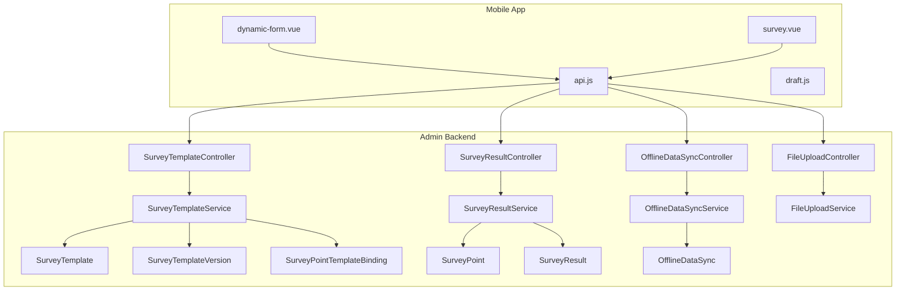

**Diagram sources**
- [SurveyTemplateController.java:30-193](file://admin-backend/src/main/java/com/qhiot/survey/controller/SurveyTemplateController.java#L30-L193)
- [SurveyResultController.java:28-181](file://admin-backend/src/main/java/com/qhiot/survey/controller/SurveyResultController.java#L28-L181)
- [OfflineDataSyncController.java:22-95](file://admin-backend/src/main/java/com/qhiot/survey/controller/OfflineDataSyncController.java#L22-L95)
- [FileUploadController.java:20-80](file://admin-backend/src/main/java/com/qhiot/survey/controller/FileUploadController.java#L20-L80)
- [SurveyTemplateService.java:12-59](file://admin-backend/src/main/java/com/qhiot/survey/service/SurveyTemplateService.java#L12-L59)
- [SurveyResultService.java:11-81](file://admin-backend/src/main/java/com/qhiot/survey/service/SurveyResultService.java#L11-L81)
- [OfflineDataSyncService.java:12-84](file://admin-backend/src/main/java/com/qhiot/survey/service/OfflineDataSyncService.java#L12-L84)
- [FileUploadService.java:22-122](file://admin-backend/src/main/java/com/qhiot/survey/service/FileUploadService.java#L22-L122)
- [SurveyTemplate.java:15-61](file://admin-backend/src/main/java/com/qhiot/survey/entity/SurveyTemplate.java#L15-L61)
- [SurveyTemplateVersion.java:14-38](file://admin-backend/src/main/java/com/qhiot/survey/entity/SurveyTemplateVersion.java#L14-L38)
- [SurveyPointTemplateBinding.java:14-32](file://admin-backend/src/main/java/com/qhiot/survey/entity/SurveyPointTemplateBinding.java#L14-L32)
- [SurveyPoint.java:18-84](file://admin-backend/src/main/java/com/qhiot/survey/entity/SurveyPoint.java#L18-L84)
- [SurveyResult.java:15-93](file://admin-backend/src/main/java/com/qhiot/survey/entity/SurveyResult.java#L15-L93)
- [dynamic-form.vue:6-336](file://mobile-app/src/components/dynamic-form/dynamic-form.vue#L6-L336)
- [survey.vue:5-30](file://mobile-app/src/pages/survey/survey.vue#L5-L30)
- [api.js:76-101](file://mobile-app/src/utils/api.js#L76-L101)

**Section sources**
- [SurveyTemplateController.java:30-193](file://admin-backend/src/main/java/com/qhiot/survey/controller/SurveyTemplateController.java#L30-L193)
- [SurveyResultController.java:28-181](file://admin-backend/src/main/java/com/qhiot/survey/controller/SurveyResultController.java#L28-L181)
- [OfflineDataSyncController.java:22-95](file://admin-backend/src/main/java/com/qhiot/survey/controller/OfflineDataSyncController.java#L22-L95)
- [FileUploadController.java:20-80](file://admin-backend/src/main/java/com/qhiot/survey/controller/FileUploadController.java#L20-L80)
- [SurveyTemplateService.java:12-59](file://admin-backend/src/main/java/com/qhiot/survey/service/SurveyTemplateService.java#L12-L59)
- [SurveyResultService.java:11-81](file://admin-backend/src/main/java/com/qhiot/survey/service/SurveyResultService.java#L11-L81)
- [OfflineDataSyncService.java:12-84](file://admin-backend/src/main/java/com/qhiot/survey/service/OfflineDataSyncService.java#L12-L84)
- [FileUploadService.java:22-122](file://admin-backend/src/main/java/com/qhiot/survey/service/FileUploadService.java#L22-L122)
- [SurveyTemplate.java:15-61](file://admin-backend/src/main/java/com/qhiot/survey/entity/SurveyTemplate.java#L15-L61)
- [SurveyTemplateVersion.java:14-38](file://admin-backend/src/main/java/com/qhiot/survey/entity/SurveyTemplateVersion.java#L14-L38)
- [SurveyPointTemplateBinding.java:14-32](file://admin-backend/src/main/java/com/qhiot/survey/entity/SurveyPointTemplateBinding.java#L14-L32)
- [SurveyPoint.java:18-84](file://admin-backend/src/main/java/com/qhiot/survey/entity/SurveyPoint.java#L18-L84)
- [SurveyResult.java:15-93](file://admin-backend/src/main/java/com/qhiot/survey/entity/SurveyResult.java#L15-L93)
- [dynamic-form.vue:6-336](file://mobile-app/src/components/dynamic-form/dynamic-form.vue#L6-L336)
- [survey.vue:5-30](file://mobile-app/src/pages/survey/survey.vue#L5-L30)
- [api.js:76-101](file://mobile-app/src/utils/api.js#L76-L101)

## Core Components
- Templates and Versions: Administrators create templates and publish versions with fields, rules, and linkage rules. Bindings connect outfall types to specific template versions per project/section.
- Survey Points: Field locations with geographic coordinates and status lifecycle.
- Survey Results: Per-point records containing form data, images, status, audit info, and versioning.
- Offline Sync: Mechanism to accept offline submissions, detect conflicts, and reconcile data.
- File Upload: Image ingestion with optional watermarks and storage to OSS or local fallback.
- Mobile Form Renderer: Dynamic rendering of fields, validation, linkage rules, and image capture.

**Section sources**
- [SurveyTemplate.java:15-61](file://admin-backend/src/main/java/com/qhiot/survey/entity/SurveyTemplate.java#L15-L61)
- [SurveyTemplateVersion.java:14-38](file://admin-backend/src/main/java/com/qhiot/survey/entity/SurveyTemplateVersion.java#L14-L38)
- [SurveyPointTemplateBinding.java:14-32](file://admin-backend/src/main/java/com/qhiot/survey/entity/SurveyPointTemplateBinding.java#L14-L32)
- [SurveyPoint.java:18-84](file://admin-backend/src/main/java/com/qhiot/survey/entity/SurveyPoint.java#L18-L84)
- [SurveyResult.java:15-93](file://admin-backend/src/main/java/com/qhiot/survey/entity/SurveyResult.java#L15-L93)
- [SurveyTemplateController.java:30-193](file://admin-backend/src/main/java/com/qhiot/survey/controller/SurveyTemplateController.java#L30-L193)
- [SurveyResultController.java:28-181](file://admin-backend/src/main/java/com/qhiot/survey/controller/SurveyResultController.java#L28-L181)
- [OfflineDataSyncController.java:22-95](file://admin-backend/src/main/java/com/qhiot/survey/controller/OfflineDataSyncController.java#L22-L95)
- [FileUploadController.java:20-80](file://admin-backend/src/main/java/com/qhiot/survey/controller/FileUploadController.java#L20-L80)
- [dynamic-form.vue:6-336](file://mobile-app/src/components/dynamic-form/dynamic-form.vue#L6-L336)

## Architecture Overview
The system follows a layered architecture:
- Presentation: Mobile app renders dynamic forms and submits results
- API Layer: Controllers expose REST endpoints for templates, results, offline sync, and file upload
- Service Layer: Business logic for template/version management, result lifecycle, offline reconciliation, and file handling
- Persistence: Entities mapped to relational tables; offline sync table supports offline-first workflows

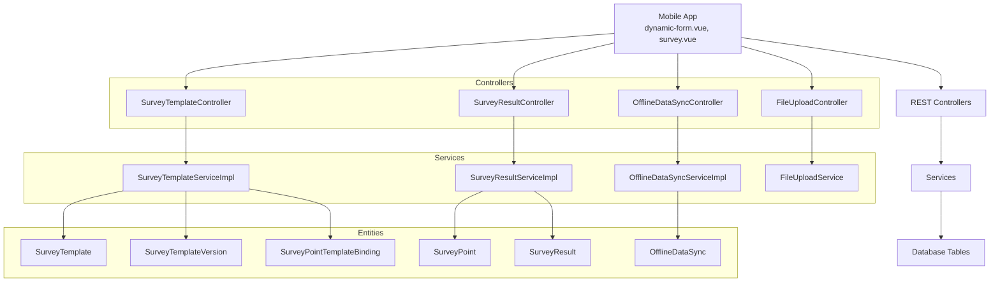

**Diagram sources**
- [SurveyTemplateController.java:30-193](file://admin-backend/src/main/java/com/qhiot/survey/controller/SurveyTemplateController.java#L30-L193)
- [SurveyResultController.java:28-181](file://admin-backend/src/main/java/com/qhiot/survey/controller/SurveyResultController.java#L28-L181)
- [OfflineDataSyncController.java:22-95](file://admin-backend/src/main/java/com/qhiot/survey/controller/OfflineDataSyncController.java#L22-L95)
- [FileUploadController.java:20-80](file://admin-backend/src/main/java/com/qhiot/survey/controller/FileUploadController.java#L20-L80)
- [SurveyTemplateServiceImpl.java:32-384](file://admin-backend/src/main/java/com/qhiot/survey/service/impl/SurveyTemplateServiceImpl.java#L32-L384)
- [SurveyResultServiceImpl.java:33-364](file://admin-backend/src/main/java/com/qhiot/survey/service/impl/SurveyResultServiceImpl.java#L33-L364)
- [OfflineDataSyncServiceImpl.java:37-694](file://admin-backend/src/main/java/com/qhiot/survey/service/impl/OfflineDataSyncServiceImpl.java#L37-L694)
- [FileUploadService.java:22-122](file://admin-backend/src/main/java/com/qhiot/survey/service/FileUploadService.java#L22-L122)
- [SurveyTemplate.java:15-61](file://admin-backend/src/main/java/com/qhiot/survey/entity/SurveyTemplate.java#L15-L61)
- [SurveyTemplateVersion.java:14-38](file://admin-backend/src/main/java/com/qhiot/survey/entity/SurveyTemplateVersion.java#L14-L38)
- [SurveyPointTemplateBinding.java:14-32](file://admin-backend/src/main/java/com/qhiot/survey/entity/SurveyPointTemplateBinding.java#L14-L32)
- [SurveyPoint.java:18-84](file://admin-backend/src/main/java/com/qhiot/survey/entity/SurveyPoint.java#L18-L84)
- [SurveyResult.java:15-93](file://admin-backend/src/main/java/com/qhiot/survey/entity/SurveyResult.java#L15-L93)
- [dynamic-form.vue:6-336](file://mobile-app/src/components/dynamic-form/dynamic-form.vue#L6-L336)
- [survey.vue:5-30](file://mobile-app/src/pages/survey/survey.vue#L5-L30)

## Detailed Component Analysis

### Template Management
Administrators define templates and publish versions with fields, rules, and linkage rules. Outfall-type bindings connect project/section contexts to specific template versions.

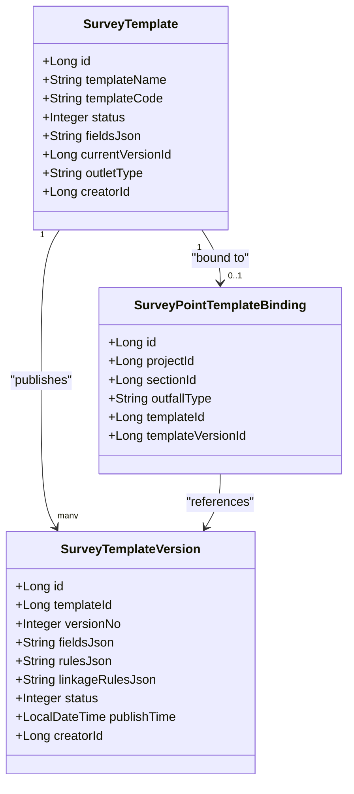

**Diagram sources**
- [SurveyTemplate.java:15-61](file://admin-backend/src/main/java/com/qhiot/survey/entity/SurveyTemplate.java#L15-L61)
- [SurveyTemplateVersion.java:14-38](file://admin-backend/src/main/java/com/qhiot/survey/entity/SurveyTemplateVersion.java#L14-L38)
- [SurveyPointTemplateBinding.java:14-32](file://admin-backend/src/main/java/com/qhiot/survey/entity/SurveyPointTemplateBinding.java#L14-L32)

Key behaviors:
- Creation initializes a draft template and a draft version
- Publishing increments version numbers and sets status to published
- Preview and field config retrieval support mobile rendering
- Bindings enable context-aware template selection by outfall type

**Section sources**
- [SurveyTemplateController.java:30-193](file://admin-backend/src/main/java/com/qhiot/survey/controller/SurveyTemplateController.java#L30-L193)
- [SurveyTemplateService.java:12-59](file://admin-backend/src/main/java/com/qhiot/survey/service/SurveyTemplateService.java#L12-L59)
- [SurveyTemplateServiceImpl.java:70-174](file://admin-backend/src/main/java/com/qhiot/survey/service/impl/SurveyTemplateServiceImpl.java#L70-L174)
- [SurveyTemplateServiceImpl.java:357-383](file://admin-backend/src/main/java/com/qhiot/survey/service/impl/SurveyTemplateServiceImpl.java#L357-L383)

### Survey Point Lifecycle and Relationship to Templates
Survey points carry geographic data and status. The system maps results to points and updates point status based on result actions.

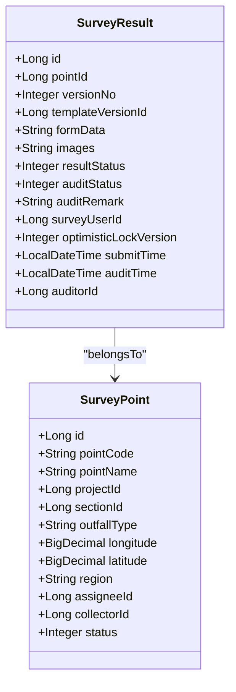

**Diagram sources**
- [SurveyPoint.java:18-84](file://admin-backend/src/main/java/com/qhiot/survey/entity/SurveyPoint.java#L18-L84)
- [SurveyResult.java:15-93](file://admin-backend/src/main/java/com/qhiot/survey/entity/SurveyResult.java#L15-L93)

**Section sources**
- [SurveyResultService.java:11-81](file://admin-backend/src/main/java/com/qhiot/survey/service/SurveyResultService.java#L11-L81)
- [SurveyResultServiceImpl.java:38-53](file://admin-backend/src/main/java/com/qhiot/survey/service/impl/SurveyResultServiceImpl.java#L38-L53)
- [SurveyResultServiceImpl.java:157-189](file://admin-backend/src/main/java/com/qhiot/survey/service/impl/SurveyResultServiceImpl.java#L157-L189)

### Survey Result Processing Pipeline
Results are created, edited with optimistic locking, submitted for audit, and audited with status transitions. Version diffs are supported for comparison.

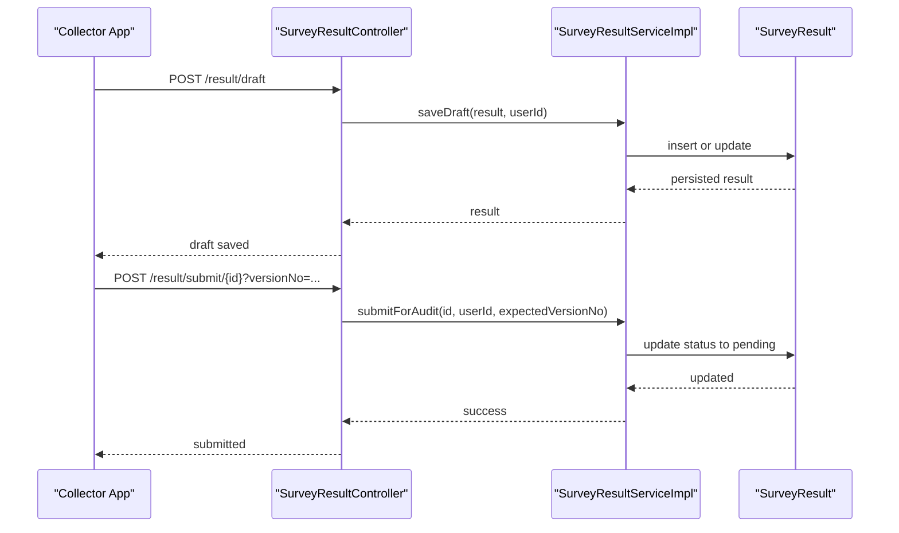

**Diagram sources**
- [SurveyResultController.java:134-144](file://admin-backend/src/main/java/com/qhiot/survey/controller/SurveyResultController.java#L134-L144)
- [SurveyResultService.java:69-70](file://admin-backend/src/main/java/com/qhiot/survey/service/SurveyResultService.java#L69-L70)
- [SurveyResultServiceImpl.java:270-311](file://admin-backend/src/main/java/com/qhiot/survey/service/impl/SurveyResultServiceImpl.java#L270-L311)

**Section sources**
- [SurveyResultController.java:134-153](file://admin-backend/src/main/java/com/qhiot/survey/controller/SurveyResultController.java#L134-L153)
- [SurveyResultServiceImpl.java:55-81](file://admin-backend/src/main/java/com/qhiot/survey/service/impl/SurveyResultServiceImpl.java#L55-L81)
- [SurveyResultServiceImpl.java:83-106](file://admin-backend/src/main/java/com/qhiot/survey/service/impl/SurveyResultServiceImpl.java#L83-L106)
- [SurveyResultServiceImpl.java:270-311](file://admin-backend/src/main/java/com/qhiot/survey/service/impl/SurveyResultServiceImpl.java#L270-L311)

### Offline Data Synchronization
The offline-first approach captures data locally and reconciles later. The system accepts batches, detects version conflicts, merges or overrides selectively, and updates point statuses.

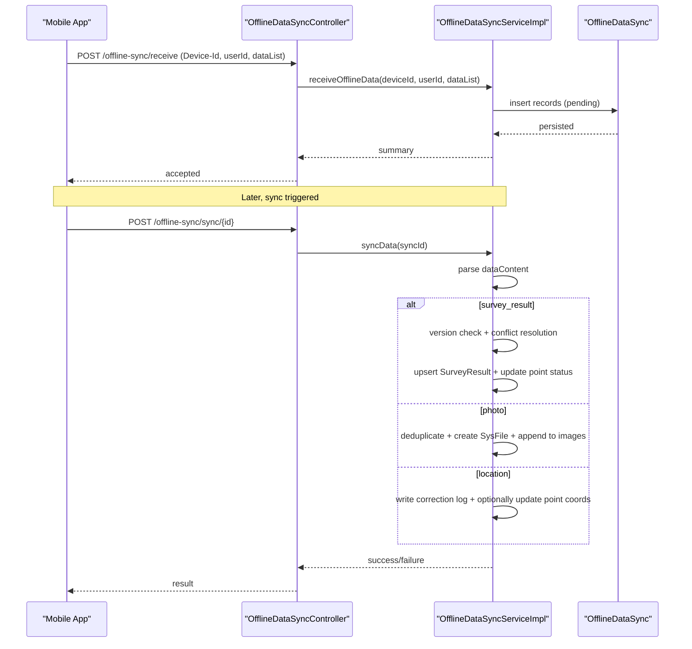

**Diagram sources**
- [OfflineDataSyncController.java:26-36](file://admin-backend/src/main/java/com/qhiot/survey/controller/OfflineDataSyncController.java#L26-L36)
- [OfflineDataSyncServiceImpl.java:62-106](file://admin-backend/src/main/java/com/qhiot/survey/service/impl/OfflineDataSyncServiceImpl.java#L62-L106)
- [OfflineDataSyncServiceImpl.java:118-182](file://admin-backend/src/main/java/com/qhiot/survey/service/impl/OfflineDataSyncServiceImpl.java#L118-L182)
- [OfflineDataSyncServiceImpl.java:355-442](file://admin-backend/src/main/java/com/qhiot/survey/service/impl/OfflineDataSyncServiceImpl.java#L355-L442)
- [OfflineDataSyncServiceImpl.java:444-516](file://admin-backend/src/main/java/com/qhiot/survey/service/impl/OfflineDataSyncServiceImpl.java#L444-L516)
- [OfflineDataSyncServiceImpl.java:518-574](file://admin-backend/src/main/java/com/qhiot/survey/service/impl/OfflineDataSyncServiceImpl.java#L518-L574)

**Section sources**
- [OfflineDataSyncController.java:26-93](file://admin-backend/src/main/java/com/qhiot/survey/controller/OfflineDataSyncController.java#L26-L93)
- [OfflineDataSyncService.java:12-84](file://admin-backend/src/main/java/com/qhiot/survey/service/OfflineDataSyncService.java#L12-L84)
- [OfflineDataSyncServiceImpl.java:62-106](file://admin-backend/src/main/java/com/qhiot/survey/service/impl/OfflineDataSyncServiceImpl.java#L62-L106)
- [OfflineDataSyncServiceImpl.java:355-442](file://admin-backend/src/main/java/com/qhiot/survey/service/impl/OfflineDataSyncServiceImpl.java#L355-L442)
- [OfflineDataSyncServiceImpl.java:444-516](file://admin-backend/src/main/java/com/qhiot/survey/service/impl/OfflineDataSyncServiceImpl.java#L444-L516)
- [OfflineDataSyncServiceImpl.java:518-574](file://admin-backend/src/main/java/com/qhiot/survey/service/impl/OfflineDataSyncServiceImpl.java#L518-L574)
- [03-offline-data-sync.sql:1-27](file://admin-backend/init-data/03-offline-data-sync.sql#L1-L27)

### Mobile Form Rendering and Submission
The mobile app renders dynamic forms based on template fields, validates inputs, supports linkage rules, and integrates image capture and location pickers. Drafts are persisted locally and can be submitted later.

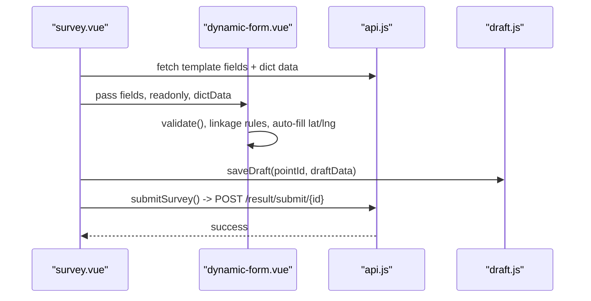

**Diagram sources**
- [survey.vue:32-35](file://mobile-app/src/pages/survey/survey.vue#L32-L35)
- [dynamic-form.vue:146-307](file://mobile-app/src/components/dynamic-form/dynamic-form.vue#L146-L307)
- [api.js:264-286](file://mobile-app/src/utils/api.js#L264-L286)
- [draft.js:14-34](file://mobile-app/src/utils/draft.js#L14-L34)

**Section sources**
- [dynamic-form.vue:6-336](file://mobile-app/src/components/dynamic-form/dynamic-form.vue#L6-L336)
- [survey.vue:5-30](file://mobile-app/src/pages/survey/survey.vue#L5-L30)
- [api.js:76-101](file://mobile-app/src/utils/api.js#L76-L101)
- [draft.js:14-57](file://mobile-app/src/utils/draft.js#L14-L57)

### Image Processing and Storage
Images are captured via the dynamic form’s image uploader, optionally watermarked with collector and coordinate metadata, and uploaded to OSS or local fallback. Offline photo sync appends URLs to result images.

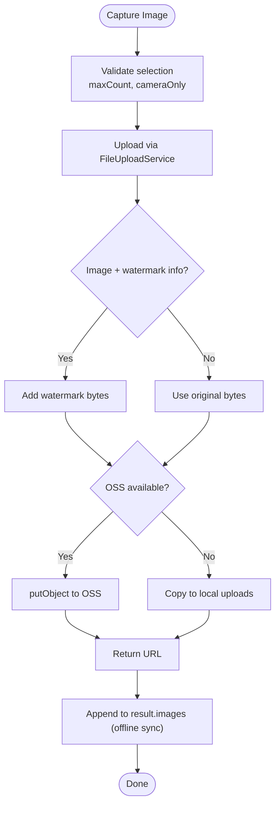

**Diagram sources**
- [FileUploadService.java:39-96](file://admin-backend/src/main/java/com/qhiot/survey/service/FileUploadService.java#L39-L96)
- [FileUploadController.java:25-43](file://admin-backend/src/main/java/com/qhiot/survey/controller/FileUploadController.java#L25-L43)
- [OfflineDataSyncServiceImpl.java:444-516](file://admin-backend/src/main/java/com/qhiot/survey/service/impl/OfflineDataSyncServiceImpl.java#L444-L516)

**Section sources**
- [FileUploadService.java:22-122](file://admin-backend/src/main/java/com/qhiot/survey/service/FileUploadService.java#L22-L122)
- [FileUploadController.java:20-80](file://admin-backend/src/main/java/com/qhiot/survey/controller/FileUploadController.java#L20-L80)
- [OfflineDataSyncServiceImpl.java:444-516](file://admin-backend/src/main/java/com/qhiot/survey/service/impl/OfflineDataSyncServiceImpl.java#L444-L516)

### Data Validation, Linkage Rules, and Field Types
The dynamic form supports diverse input types and validation:
- Inputs: text, number, textarea
- Selections: single select, multi-select (checkbox)
- Interactions: radio with sub-fields, switch, date
- Media: image picker with max count and camera-only options
- Location: integrated picker with auto-fill of linked lat/lng fields
- Validation: required, min/max length, numeric bounds, regex pattern
- Linkage rules: hide/clear fields based on trigger values

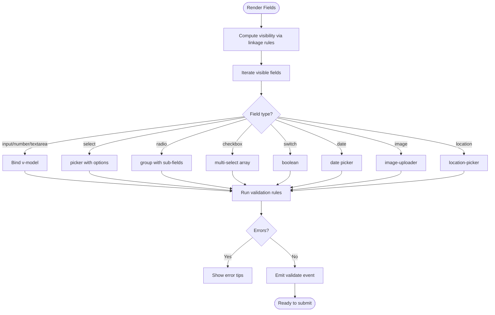

**Diagram sources**
- [dynamic-form.vue:180-200](file://mobile-app/src/components/dynamic-form/dynamic-form.vue#L180-L200)
- [dynamic-form.vue:262-302](file://mobile-app/src/components/dynamic-form/dynamic-form.vue#L262-L302)
- [dynamic-form.vue:121-133](file://mobile-app/src/components/dynamic-form/dynamic-form.vue#L121-L133)

**Section sources**
- [dynamic-form.vue:6-336](file://mobile-app/src/components/dynamic-form/dynamic-form.vue#L6-L336)

### Example Workflows

- Template creation and publishing
  - Create template (draft), save designer draft, publish to new version, bind to outfall type
  - Reference: [SurveyTemplateController.java:59-130](file://admin-backend/src/main/java/com/qhiot/survey/controller/SurveyTemplateController.java#L59-L130), [SurveyTemplateServiceImpl.java:70-174](file://admin-backend/src/main/java/com/qhiot/survey/service/impl/SurveyTemplateServiceImpl.java#L70-L174), [SurveyTemplateServiceImpl.java:217-281](file://admin-backend/src/main/java/com/qhiot/survey/service/impl/SurveyTemplateServiceImpl.java#L217-L281)

- Form rendering and data submission
  - Fetch template fields, render dynamic form, validate, save draft, submit for audit
  - Reference: [survey.vue:32-35](file://mobile-app/src/pages/survey/survey.vue#L32-L35), [dynamic-form.vue:146-307](file://mobile-app/src/components/dynamic-form/dynamic-form.vue#L146-L307), [api.js:264-286](file://mobile-app/src/utils/api.js#L264-L286), [SurveyResultController.java:134-144](file://admin-backend/src/main/java/com/qhiot/survey/controller/SurveyResultController.java#L134-L144)

- Offline data sync and conflict resolution
  - Receive offline batch, queue records, sync individual items, handle conflicts (server/client/merge), update point status
  - Reference: [OfflineDataSyncController.java:26-93](file://admin-backend/src/main/java/com/qhiot/survey/controller/OfflineDataSyncController.java#L26-L93), [OfflineDataSyncServiceImpl.java:62-106](file://admin-backend/src/main/java/com/qhiot/survey/service/impl/OfflineDataSyncServiceImpl.java#L62-L106), [OfflineDataSyncServiceImpl.java:355-442](file://admin-backend/src/main/java/com/qhiot/survey/service/impl/OfflineDataSyncServiceImpl.java#L355-L442)

- Image upload and association
  - Capture image, upload with optional watermark, append URL to result images (online and offline)
  - Reference: [FileUploadService.java:39-96](file://admin-backend/src/main/java/com/qhiot/survey/service/FileUploadService.java#L39-L96), [OfflineDataSyncServiceImpl.java:444-516](file://admin-backend/src/main/java/com/qhiot/survey/service/impl/OfflineDataSyncServiceImpl.java#L444-L516)

## Dependency Analysis
- Controllers depend on Services for business logic
- Services depend on Mappers/Repositories and Entities for persistence
- Mobile app depends on API utilities for HTTP requests and on local draft utilities for offline persistence
- Offline sync orchestrates result, point, file, and location correction entities

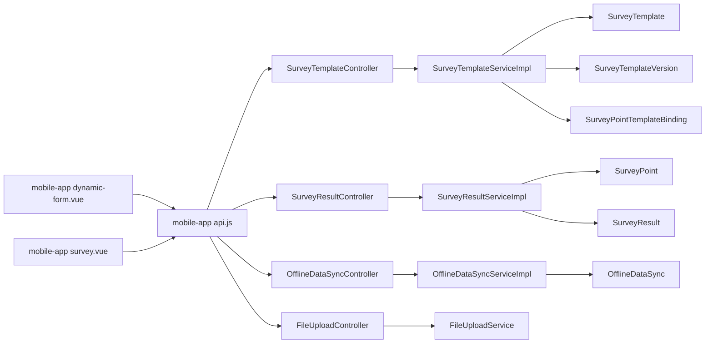

**Diagram sources**
- [dynamic-form.vue:6-336](file://mobile-app/src/components/dynamic-form/dynamic-form.vue#L6-L336)
- [survey.vue:5-30](file://mobile-app/src/pages/survey/survey.vue#L5-L30)
- [api.js:76-101](file://mobile-app/src/utils/api.js#L76-L101)
- [SurveyTemplateController.java:30-193](file://admin-backend/src/main/java/com/qhiot/survey/controller/SurveyTemplateController.java#L30-L193)
- [SurveyResultController.java:28-181](file://admin-backend/src/main/java/com/qhiot/survey/controller/SurveyResultController.java#L28-L181)
- [OfflineDataSyncController.java:22-95](file://admin-backend/src/main/java/com/qhiot/survey/controller/OfflineDataSyncController.java#L22-L95)
- [FileUploadController.java:20-80](file://admin-backend/src/main/java/com/qhiot/survey/controller/FileUploadController.java#L20-L80)
- [SurveyTemplateServiceImpl.java:32-384](file://admin-backend/src/main/java/com/qhiot/survey/service/impl/SurveyTemplateServiceImpl.java#L32-L384)
- [SurveyResultServiceImpl.java:33-364](file://admin-backend/src/main/java/com/qhiot/survey/service/impl/SurveyResultServiceImpl.java#L33-L364)
- [OfflineDataSyncServiceImpl.java:37-694](file://admin-backend/src/main/java/com/qhiot/survey/service/impl/OfflineDataSyncServiceImpl.java#L37-L694)
- [FileUploadService.java:22-122](file://admin-backend/src/main/java/com/qhiot/survey/service/FileUploadService.java#L22-L122)
- [SurveyTemplate.java:15-61](file://admin-backend/src/main/java/com/qhiot/survey/entity/SurveyTemplate.java#L15-L61)
- [SurveyTemplateVersion.java:14-38](file://admin-backend/src/main/java/com/qhiot/survey/entity/SurveyTemplateVersion.java#L14-L38)
- [SurveyPointTemplateBinding.java:14-32](file://admin-backend/src/main/java/com/qhiot/survey/entity/SurveyPointTemplateBinding.java#L14-L32)
- [SurveyPoint.java:18-84](file://admin-backend/src/main/java/com/qhiot/survey/entity/SurveyPoint.java#L18-L84)
- [SurveyResult.java:15-93](file://admin-backend/src/main/java/com/qhiot/survey/entity/SurveyResult.java#L15-L93)
- [OfflineDataSync.java:1-200](file://admin-backend/src/main/java/com/qhiot/survey/entity/OfflineDataSync.java#L1-L200)

**Section sources**
- [SurveyTemplateController.java:30-193](file://admin-backend/src/main/java/com/qhiot/survey/controller/SurveyTemplateController.java#L30-L193)
- [SurveyResultController.java:28-181](file://admin-backend/src/main/java/com/qhiot/survey/controller/SurveyResultController.java#L28-L181)
- [OfflineDataSyncController.java:22-95](file://admin-backend/src/main/java/com/qhiot/survey/controller/OfflineDataSyncController.java#L22-L95)
- [FileUploadController.java:20-80](file://admin-backend/src/main/java/com/qhiot/survey/controller/FileUploadController.java#L20-L80)
- [SurveyTemplateServiceImpl.java:32-384](file://admin-backend/src/main/java/com/qhiot/survey/service/impl/SurveyTemplateServiceImpl.java#L32-L384)
- [SurveyResultServiceImpl.java:33-364](file://admin-backend/src/main/java/com/qhiot/survey/service/impl/SurveyResultServiceImpl.java#L33-L364)
- [OfflineDataSyncServiceImpl.java:37-694](file://admin-backend/src/main/java/com/qhiot/survey/service/impl/OfflineDataSyncServiceImpl.java#L37-L694)
- [FileUploadService.java:22-122](file://admin-backend/src/main/java/com/qhiot/survey/service/FileUploadService.java#L22-L122)

## Performance Considerations
- Template version caching: Published versions are cached to reduce repeated loads during form rendering
- Pagination and indexing: Controllers use pagination and database indexes for efficient queries
- Asynchronous offline sync: Background processing reduces latency for mobile clients
- Optimistic locking: Minimizes contention and avoids unnecessary retries
- Image watermarking: Optional and only applied when metadata is present to avoid overhead

[No sources needed since this section provides general guidance]

## Troubleshooting Guide
Common issues and resolutions:
- Version conflict on submit: Ensure the client’s expected version matches the server’s current version; refresh data before submitting
  - Reference: [SurveyResultServiceImpl.java:288-306](file://admin-backend/src/main/java/com/qhiot/survey/service/impl/SurveyResultServiceImpl.java#L288-L306)
- Offline sync failures: Check retry counts and error messages; resolve conflicts (server/client/merge) and retry
  - Reference: [OfflineDataSyncController.java:68-85](file://admin-backend/src/main/java/com/qhiot/survey/controller/OfflineDataSyncController.java#L68-L85), [OfflineDataSyncServiceImpl.java:162-181](file://admin-backend/src/main/java/com/qhiot/survey/service/impl/OfflineDataSyncServiceImpl.java#L162-L181)
- Missing or invalid data in offline sync: Validate presence of required fields (e.g., pointId, formData) and correct JSON content
  - Reference: [OfflineDataSyncServiceImpl.java:362-366](file://admin-backend/src/main/java/com/qhiot/survey/service/impl/OfflineDataSyncServiceImpl.java#L362-L366), [OfflineDataSyncServiceImpl.java:451-456](file://admin-backend/src/main/java/com/qhiot/survey/service/impl/OfflineDataSyncServiceImpl.java#L451-L456)
- Image upload errors: Verify OSS availability or local storage permissions; confirm file type and size constraints
  - Reference: [FileUploadService.java:79-96](file://admin-backend/src/main/java/com/qhiot/survey/service/FileUploadService.java#L79-L96)

**Section sources**
- [SurveyResultServiceImpl.java:288-306](file://admin-backend/src/main/java/com/qhiot/survey/service/impl/SurveyResultServiceImpl.java#L288-L306)
- [OfflineDataSyncController.java:68-85](file://admin-backend/src/main/java/com/qhiot/survey/controller/OfflineDataSyncController.java#L68-L85)
- [OfflineDataSyncServiceImpl.java:162-181](file://admin-backend/src/main/java/com/qhiot/survey/service/impl/OfflineDataSyncServiceImpl.java#L162-L181)
- [OfflineDataSyncServiceImpl.java:362-366](file://admin-backend/src/main/java/com/qhiot/survey/service/impl/OfflineDataSyncServiceImpl.java#L362-L366)
- [OfflineDataSyncServiceImpl.java:451-456](file://admin-backend/src/main/java/com/qhiot/survey/service/impl/OfflineDataSyncServiceImpl.java#L451-L456)
- [FileUploadService.java:79-96](file://admin-backend/src/main/java/com/qhiot/survey/service/FileUploadService.java#L79-L96)

## Conclusion
The dynamic form collection system combines flexible template-driven forms, robust offline-first workflows, and secure file handling. Administrators can rapidly adapt forms to project needs, while field teams benefit from intuitive rendering, validation, and offline persistence. The backend ensures data integrity through versioning, auditing, and conflict resolution, and provides extensible mechanisms for exports and integrations.

[No sources needed since this section summarizes without analyzing specific files]

## Appendices

### Data Model Overview
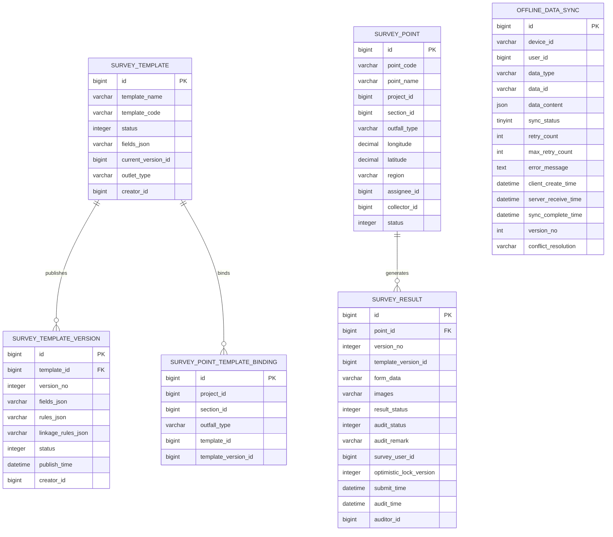

**Diagram sources**
- [SurveyTemplate.java:15-61](file://admin-backend/src/main/java/com/qhiot/survey/entity/SurveyTemplate.java#L15-L61)
- [SurveyTemplateVersion.java:14-38](file://admin-backend/src/main/java/com/qhiot/survey/entity/SurveyTemplateVersion.java#L14-L38)
- [SurveyPointTemplateBinding.java:14-32](file://admin-backend/src/main/java/com/qhiot/survey/entity/SurveyPointTemplateBinding.java#L14-L32)
- [SurveyPoint.java:18-84](file://admin-backend/src/main/java/com/qhiot/survey/entity/SurveyPoint.java#L18-L84)
- [SurveyResult.java:15-93](file://admin-backend/src/main/java/com/qhiot/survey/entity/SurveyResult.java#L15-L93)
- [03-offline-data-sync.sql:1-27](file://admin-backend/init-data/03-offline-data-sync.sql#L1-L27)