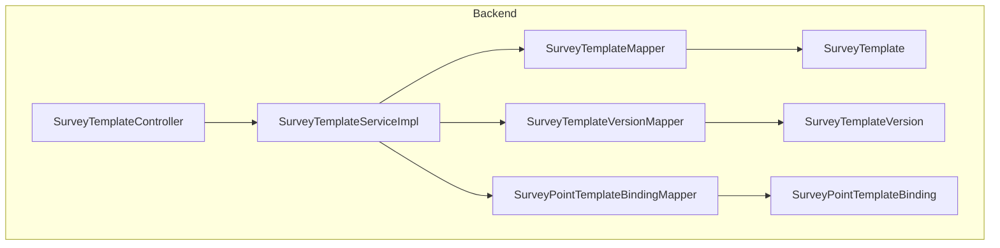
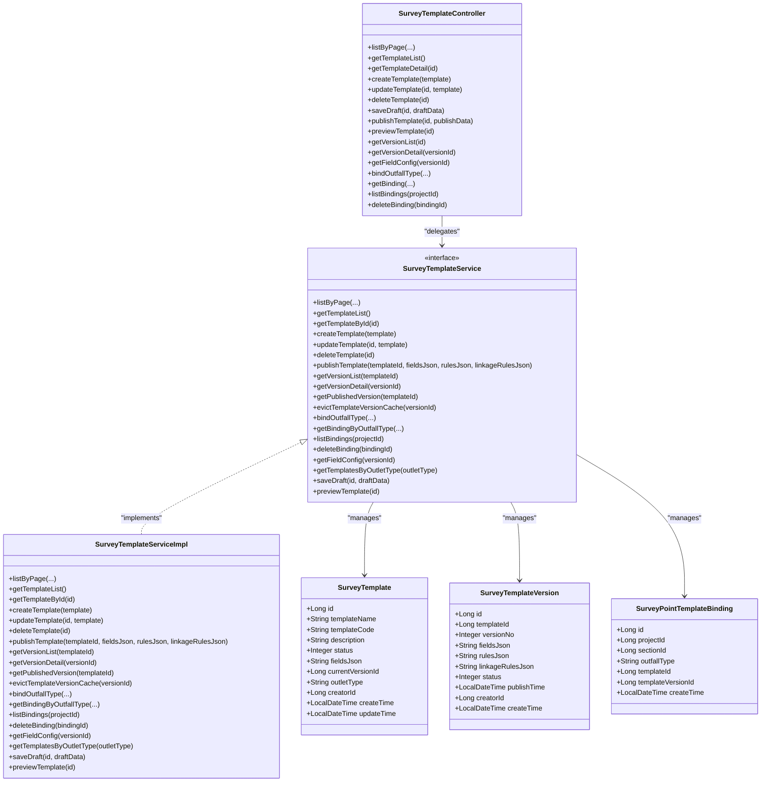
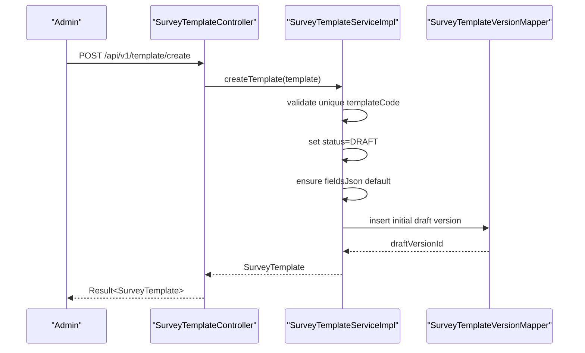
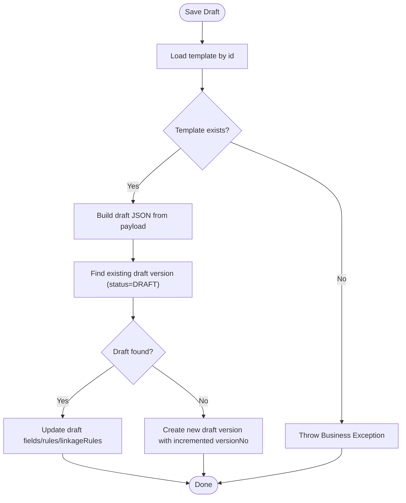
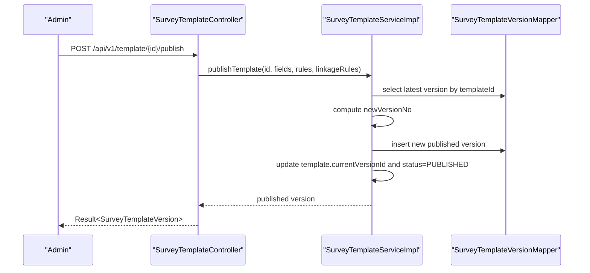
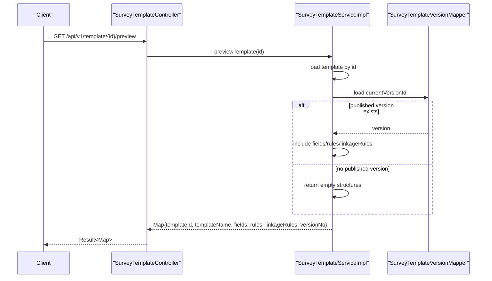
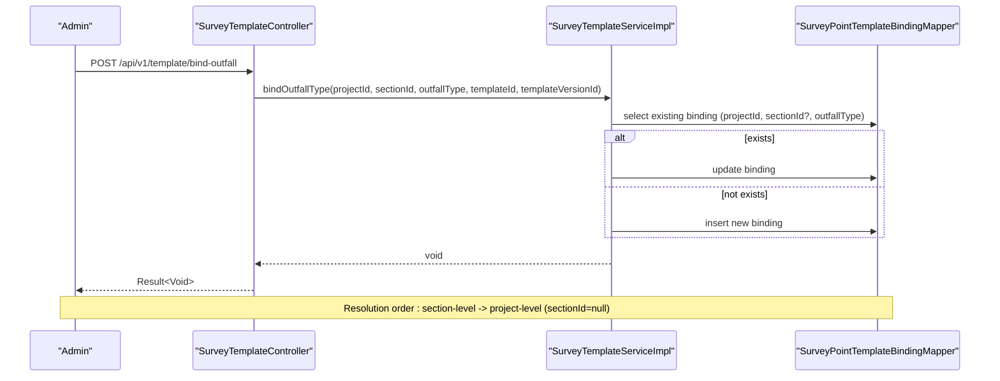
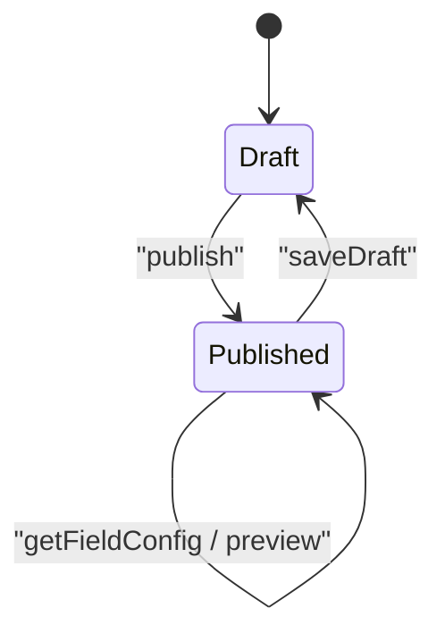
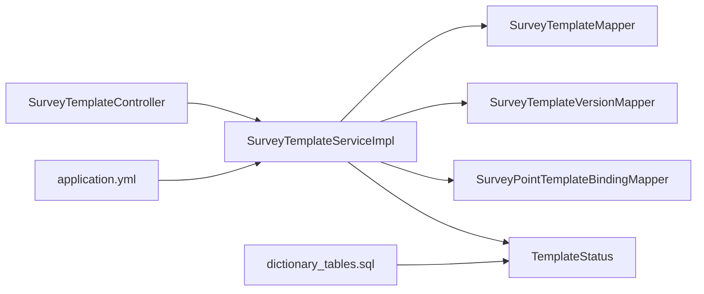

# Form Template System

<cite>
**Referenced Files in This Document**
- [SurveyTemplate.java](file://admin-backend/src/main/java/com/qhiot/survey/entity/SurveyTemplate.java)
- [SurveyTemplateVersion.java](file://admin-backend/src/main/java/com/qhiot/survey/entity/SurveyTemplateVersion.java)
- [SurveyPointTemplateBinding.java](file://admin-backend/src/main/java/com/qhiot/survey/entity/SurveyPointTemplateBinding.java)
- [SurveyTemplateController.java](file://admin-backend/src/main/java/com/qhiot/survey/controller/SurveyTemplateController.java)
- [SurveyTemplateService.java](file://admin-backend/src/main/java/com/qhiot/survey/service/SurveyTemplateService.java)
- [SurveyTemplateServiceImpl.java](file://admin-backend/src/main/java/com/qhiot/survey/service/impl/SurveyTemplateServiceImpl.java)
- [SurveyTemplateMapper.java](file://admin-backend/src/main/java/com/qhiot/survey/mapper/SurveyTemplateMapper.java)
- [SurveyTemplateVersionMapper.java](file://admin-backend/src/main/java/com/qhiot/survey/mapper/SurveyTemplateVersionMapper.java)
- [SurveyPointTemplateBindingMapper.java](file://admin-backend/src/main/java/com/qhiot/survey/mapper/SurveyPointTemplateBindingMapper.java)
- [TemplateStatus.java](file://admin-backend/src/main/java/com/qhiot/survey/common/enums/TemplateStatus.java)
- [application.yml](file://admin-backend/src/main/resources/application.yml)
- [dictionary_tables.sql](file://admin-backend/src/main/resources/db/dictionary_tables.sql)
</cite>

## Table of Contents
1. [Introduction](#introduction)
2. [Project Structure](#project-structure)
3. [Core Components](#core-components)
4. [Architecture Overview](#architecture-overview)
5. [Detailed Component Analysis](#detailed-component-analysis)
6. [Dependency Analysis](#dependency-analysis)
7. [Performance Considerations](#performance-considerations)
8. [Troubleshooting Guide](#troubleshooting-guide)
9. [Conclusion](#conclusion)
10. [Appendices](#appendices)

## Introduction
This document describes the dynamic form template system used to define, version, publish, and reuse questionnaire templates across survey points. It explains the template architecture built around three core entities:
- SurveyTemplate: the master record for a template, including metadata and current version linkage
- SurveyTemplateVersion: immutable historical versions containing field definitions, validation rules, and conditional logic
- SurveyPointTemplateBinding: association between a project/section/outlet type and a specific template version

The system supports:
- Template creation and drafting workflows
- Question types via field definitions (text, numeric, date, image, dropdown)
- Validation rules and conditional visibility/linkage rules
- Publishing process with version numbering and caching
- Backward compatibility through versioned rendering
- Administrative controls for lifecycle management
- Integration with survey point assignments via outlet-type bindings

## Project Structure
The template system resides in the backend module under the admin-backend package. The structure follows a layered architecture:
- Entity layer: JPA-like MyBatis entities
- Mapper layer: MyBatis mappers for persistence
- Service layer: business logic and orchestration
- Controller layer: REST endpoints for administration and preview
- Configuration: application YAML and dictionary initialization SQL

**Diagram sources**
- [SurveyTemplateController.java:1-194](file://admin-backend/src/main/java/com/qhiot/survey/controller/SurveyTemplateController.java#L1-L194)
- [SurveyTemplateServiceImpl.java:1-384](file://admin-backend/src/main/java/com/qhiot/survey/service/impl/SurveyTemplateServiceImpl.java#L1-L384)
- [SurveyTemplateMapper.java:1-10](file://admin-backend/src/main/java/com/qhiot/survey/mapper/SurveyTemplateMapper.java#L1-L10)
- [SurveyTemplateVersionMapper.java:1-9](file://admin-backend/src/main/java/com/qhiot/survey/mapper/SurveyTemplateVersionMapper.java#L1-L9)
- [SurveyPointTemplateBindingMapper.java:1-9](file://admin-backend/src/main/java/com/qhiot/survey/mapper/SurveyPointTemplateBindingMapper.java#L1-L9)
- [SurveyTemplate.java:1-61](file://admin-backend/src/main/java/com/qhiot/survey/entity/SurveyTemplate.java#L1-L61)
- [SurveyTemplateVersion.java:1-38](file://admin-backend/src/main/java/com/qhiot/survey/entity/SurveyTemplateVersion.java#L1-L38)
- [SurveyPointTemplateBinding.java:1-32](file://admin-backend/src/main/java/com/qhiot/survey/entity/SurveyPointTemplateBinding.java#L1-L32)

**Section sources**
- [SurveyTemplateController.java:1-194](file://admin-backend/src/main/java/com/qhiot/survey/controller/SurveyTemplateController.java#L1-L194)
- [SurveyTemplateService.java:1-59](file://admin-backend/src/main/java/com/qhiot/survey/service/SurveyTemplateService.java#L1-L59)
- [SurveyTemplateServiceImpl.java:1-384](file://admin-backend/src/main/java/com/qhiot/survey/service/impl/SurveyTemplateServiceImpl.java#L1-L384)
- [SurveyTemplateMapper.java:1-10](file://admin-backend/src/main/java/com/qhiot/survey/mapper/SurveyTemplateMapper.java#L1-L10)
- [SurveyTemplateVersionMapper.java:1-9](file://admin-backend/src/main/java/com/qhiot/survey/mapper/SurveyTemplateVersionMapper.java#L1-L9)
- [SurveyPointTemplateBindingMapper.java:1-9](file://admin-backend/src/main/java/com/qhiot/survey/mapper/SurveyPointTemplateBindingMapper.java#L1-L9)

## Core Components
This section documents the three primary entities and their roles in the template system.

- SurveyTemplate
  - Purpose: Master record for a template, storing metadata and linking to the current published version
  - Key attributes: identifiers, template name/code/description, status, currentVersionId, outletType, creatorId, timestamps
  - Notes: fieldsJson is retained for backward compatibility

- SurveyTemplateVersion
  - Purpose: Immutable snapshot of a template at a specific version
  - Key attributes: templateId, versionNo, fieldsJson, rulesJson, linkageRulesJson, status, publishTime, creatorId, timestamps
  - Notes: Used for rendering forms and enforcing backward compatibility

- SurveyPointTemplateBinding
  - Purpose: Associates a project/section/outlet type to a specific template version
  - Key attributes: projectId, sectionId, outfallType, templateId, templateVersionId, timestamps
  - Notes: Supports hierarchical binding precedence (section-level overrides project-level)

**Section sources**
- [SurveyTemplate.java:10-61](file://admin-backend/src/main/java/com/qhiot/survey/entity/SurveyTemplate.java#L10-L61)
- [SurveyTemplateVersion.java:10-38](file://admin-backend/src/main/java/com/qhiot/survey/entity/SurveyTemplateVersion.java#L10-L38)
- [SurveyPointTemplateBinding.java:10-32](file://admin-backend/src/main/java/com/qhiot/survey/entity/SurveyPointTemplateBinding.java#L10-L32)

## Architecture Overview
The template system is designed around JSON-based field definitions and rule sets. The controller exposes administrative endpoints, the service encapsulates business logic, and the mappers handle persistence. Version caching improves performance for frequently accessed published versions.

**Diagram sources**
- [SurveyTemplate.java:10-61](file://admin-backend/src/main/java/com/qhiot/survey/entity/SurveyTemplate.java#L10-L61)
- [SurveyTemplateVersion.java:10-38](file://admin-backend/src/main/java/com/qhiot/survey/entity/SurveyTemplateVersion.java#L10-L38)
- [SurveyPointTemplateBinding.java:10-32](file://admin-backend/src/main/java/com/qhiot/survey/entity/SurveyPointTemplateBinding.java#L10-L32)
- [SurveyTemplateController.java:23-194](file://admin-backend/src/main/java/com/qhiot/survey/controller/SurveyTemplateController.java#L23-L194)
- [SurveyTemplateService.java:12-59](file://admin-backend/src/main/java/com/qhiot/survey/service/SurveyTemplateService.java#L12-L59)
- [SurveyTemplateServiceImpl.java:30-384](file://admin-backend/src/main/java/com/qhiot/survey/service/impl/SurveyTemplateServiceImpl.java#L30-L384)

## Detailed Component Analysis

### Template Creation Workflow
The creation workflow initializes a template with a draft status and creates an initial draft version. It validates uniqueness of the template code and ensures default JSON structures for fields and rules.

**Diagram sources**
- [SurveyTemplateController.java:60-81](file://admin-backend/src/main/java/com/qhiot/survey/controller/SurveyTemplateController.java#L60-L81)
- [SurveyTemplateServiceImpl.java:70-103](file://admin-backend/src/main/java/com/qhiot/survey/service/impl/SurveyTemplateServiceImpl.java#L70-L103)
- [SurveyTemplateVersionMapper.java:1-9](file://admin-backend/src/main/java/com/qhiot/survey/mapper/SurveyTemplateVersionMapper.java#L1-L9)

**Section sources**
- [SurveyTemplateServiceImpl.java:70-103](file://admin-backend/src/main/java/com/qhiot/survey/service/impl/SurveyTemplateServiceImpl.java#L70-L103)

### Draft Saving and Version Management
Drafts are saved against the template’s latest draft version or created as a new draft version. Published versions are immutable; drafts allow iterative editing before publishing.

**Diagram sources**
- [SurveyTemplateServiceImpl.java:300-355](file://admin-backend/src/main/java/com/qhiot/survey/service/impl/SurveyTemplateServiceImpl.java#L300-L355)

**Section sources**
- [SurveyTemplateServiceImpl.java:300-355](file://admin-backend/src/main/java/com/qhiot/survey/service/impl/SurveyTemplateServiceImpl.java#L300-L355)

### Publishing and Version Control
Publishing increments the version number, persists a new published version, updates the template’s currentVersionId, and marks the template as published. It also evicts template version cache entries.

**Diagram sources**
- [SurveyTemplateController.java:109-131](file://admin-backend/src/main/java/com/qhiot/survey/controller/SurveyTemplateController.java#L109-L131)
- [SurveyTemplateServiceImpl.java:138-174](file://admin-backend/src/main/java/com/qhiot/survey/service/impl/SurveyTemplateServiceImpl.java#L138-L174)
- [SurveyTemplateVersionMapper.java:1-9](file://admin-backend/src/main/java/com/qhiot/survey/mapper/SurveyTemplateVersionMapper.java#L1-L9)

**Section sources**
- [SurveyTemplateServiceImpl.java:138-174](file://admin-backend/src/main/java/com/qhiot/survey/service/impl/SurveyTemplateServiceImpl.java#L138-L174)
- [TemplateStatus.java:8-30](file://admin-backend/src/main/java/com/qhiot/survey/common/enums/TemplateStatus.java#L8-L30)

### Template Preview and Rendering
Preview aggregates template metadata and the fields, rules, and linkage rules from the current published version. If no published version exists, it returns empty structures.

**Diagram sources**
- [SurveyTemplateController.java:133-137](file://admin-backend/src/main/java/com/qhiot/survey/controller/SurveyTemplateController.java#L133-L137)
- [SurveyTemplateServiceImpl.java:357-383](file://admin-backend/src/main/java/com/qhiot/survey/service/impl/SurveyTemplateServiceImpl.java#L357-L383)
- [SurveyTemplateVersionMapper.java:1-9](file://admin-backend/src/main/java/com/qhiot/survey/mapper/SurveyTemplateVersionMapper.java#L1-L9)

**Section sources**
- [SurveyTemplateServiceImpl.java:357-383](file://admin-backend/src/main/java/com/qhiot/survey/service/impl/SurveyTemplateServiceImpl.java#L357-L383)

### Outfall Type Binding and Survey Point Assignment Integration
Bindings connect outlet types to specific template versions at project or section scope. Resolution prefers section-level bindings; otherwise falls back to project-level.

**Diagram sources**
- [SurveyTemplateController.java:157-169](file://admin-backend/src/main/java/com/qhiot/survey/controller/SurveyTemplateController.java#L157-L169)
- [SurveyTemplateServiceImpl.java:217-246](file://admin-backend/src/main/java/com/qhiot/survey/service/impl/SurveyTemplateServiceImpl.java#L217-L246)
- [SurveyPointTemplateBindingMapper.java:1-9](file://admin-backend/src/main/java/com/qhiot/survey/mapper/SurveyPointTemplateBindingMapper.java#L1-L9)

**Section sources**
- [SurveyTemplateServiceImpl.java:217-246](file://admin-backend/src/main/java/com/qhiot/survey/service/impl/SurveyTemplateServiceImpl.java#L217-L246)

### Template JSON Schema Concepts
The system stores template definitions as JSON blobs:
- fields: array defining questions and their properties (e.g., type, label, key, required flag)
- rules: object defining validation constraints per field
- linkageRules: array defining conditional visibility or logic between fields

Example conceptual schema outline (descriptive):
- fields: [
  {
    "key": "string",
    "type": "text | numeric | date | image | dropdown",
    "label": "string",
    "required": "boolean",
    "options": ["array of strings"] // for dropdown
  }
]
- rules: {
  "fieldKey": {
    "required": "boolean",
    "min": "number or null",
    "max": "number or null",
    "pattern": "string or null",
    "message": "string"
  }
}
- linkageRules: [
  {
    "from": "string",
    "to": "string",
    "condition": {
      "operator": "== | != | > | < | >= | <= | in | not-in",
      "value": "any"
    },
    "visible": "boolean"
  }
]

Note: These are conceptual outlines to guide understanding. Actual payloads are JSON strings stored in fieldsJson, rulesJson, and linkageRulesJson.

**Section sources**
- [SurveyTemplateVersion.java:20-30](file://admin-backend/src/main/java/com/qhiot/survey/entity/SurveyTemplateVersion.java#L20-L30)
- [SurveyTemplateController.java:113-126](file://admin-backend/src/main/java/com/qhiot/survey/controller/SurveyTemplateController.java#L113-L126)

### Question Types and Conditional Logic
Supported question types are encoded in the fields array:
- Text: free-text input
- Numeric: number input with optional min/max
- Date: date picker input
- Image: image upload field
- Dropdown: selection from predefined options

Conditional logic is expressed via linkageRules that control visibility or enablement of fields based on the value of another field.

**Section sources**
- [SurveyTemplateVersion.java:20-30](file://admin-backend/src/main/java/com/qhiot/survey/entity/SurveyTemplateVersion.java#L20-L30)
- [SurveyTemplateController.java:113-126](file://admin-backend/src/main/java/com/qhiot/survey/controller/SurveyTemplateController.java#L113-L126)

### Validation Rules
Validation rules are defined per field in rulesJson. Typical constraints include:
- required: boolean flag
- min/max: numeric bounds
- pattern: regex string
- message: custom error message

These rules are enforced during form submission and rendering.

**Section sources**
- [SurveyTemplateVersion.java:20-30](file://admin-backend/src/main/java/com/qhiot/survey/entity/SurveyTemplateVersion.java#L20-L30)
- [SurveyTemplateController.java:113-126](file://admin-backend/src/main/java/com/qhiot/survey/controller/SurveyTemplateController.java#L113-L126)

### Template Publishing, Versioning, and Backward Compatibility
- Publishing increments versionNo and sets status to published
- The template’s currentVersionId points to the latest published version
- Rendering uses the published version to ensure backward compatibility
- Cache annotations improve performance for published version retrieval

**Diagram sources**
- [SurveyTemplateServiceImpl.java:185-208](file://admin-backend/src/main/java/com/qhiot/survey/service/impl/SurveyTemplateServiceImpl.java#L185-L208)
- [TemplateStatus.java:8-30](file://admin-backend/src/main/java/com/qhiot/survey/common/enums/TemplateStatus.java#L8-L30)

**Section sources**
- [SurveyTemplateServiceImpl.java:138-174](file://admin-backend/src/main/java/com/qhiot/survey/service/impl/SurveyTemplateServiceImpl.java#L138-L174)
- [SurveyTemplateService.java:32-41](file://admin-backend/src/main/java/com/qhiot/survey/service/SurveyTemplateService.java#L32-L41)

### Administrative Controls and Lifecycle Management
Administrative endpoints support:
- Listing templates with pagination and filtering
- Retrieving lists and details
- Creating, updating, and deleting templates
- Saving drafts and publishing versions
- Managing outfall-type bindings
- Previewing templates for mobile rendering

Access control is enforced via role-based annotations on endpoints.

**Section sources**
- [SurveyTemplateController.java:38-194](file://admin-backend/src/main/java/com/qhiot/survey/controller/SurveyTemplateController.java#L38-L194)

## Dependency Analysis
The service layer orchestrates interactions among entities and mappers. Controllers depend on services, while services depend on mappers. Status values are governed by the TemplateStatus enum, and dictionary tables initialize system-wide status codes.

**Diagram sources**
- [SurveyTemplateController.java:1-194](file://admin-backend/src/main/java/com/qhiot/survey/controller/SurveyTemplateController.java#L1-L194)
- [SurveyTemplateServiceImpl.java:1-384](file://admin-backend/src/main/java/com/qhiot/survey/service/impl/SurveyTemplateServiceImpl.java#L1-L384)
- [SurveyTemplateMapper.java:1-10](file://admin-backend/src/main/java/com/qhiot/survey/mapper/SurveyTemplateMapper.java#L1-L10)
- [SurveyTemplateVersionMapper.java:1-9](file://admin-backend/src/main/java/com/qhiot/survey/mapper/SurveyTemplateVersionMapper.java#L1-L9)
- [SurveyPointTemplateBindingMapper.java:1-9](file://admin-backend/src/main/java/com/qhiot/survey/mapper/SurveyPointTemplateBindingMapper.java#L1-L9)
- [TemplateStatus.java:1-30](file://admin-backend/src/main/java/com/qhiot/survey/common/enums/TemplateStatus.java#L1-L30)
- [application.yml:1-149](file://admin-backend/src/main/resources/application.yml#L1-L149)
- [dictionary_tables.sql:65-69](file://admin-backend/src/main/resources/db/dictionary_tables.sql#L65-L69)

**Section sources**
- [SurveyTemplateService.java:1-59](file://admin-backend/src/main/java/com/qhiot/survey/service/SurveyTemplateService.java#L1-L59)
- [SurveyTemplateServiceImpl.java:1-384](file://admin-backend/src/main/java/com/qhiot/survey/service/impl/SurveyTemplateServiceImpl.java#L1-L384)
- [TemplateStatus.java:1-30](file://admin-backend/src/main/java/com/qhiot/survey/common/enums/TemplateStatus.java#L1-L30)
- [application.yml:1-149](file://admin-backend/src/main/resources/application.yml#L1-L149)
- [dictionary_tables.sql:65-69](file://admin-backend/src/main/resources/db/dictionary_tables.sql#L65-L69)

## Performance Considerations
- Published version caching: The service caches published versions keyed by templateId to reduce database queries during rendering and preview operations.
- Cache eviction: Operations that modify templates or versions trigger cache eviction to maintain consistency.
- Pagination: Listing templates supports pagination to avoid heavy loads.
- JSON parsing: Draft and publish endpoints serialize/deserialize JSON payloads; ensure payload sizes remain reasonable.

**Section sources**
- [SurveyTemplateService.java:32-41](file://admin-backend/src/main/java/com/qhiot/survey/service/SurveyTemplateService.java#L32-L41)
- [SurveyTemplateServiceImpl.java:185-215](file://admin-backend/src/main/java/com/qhiot/survey/service/impl/SurveyTemplateServiceImpl.java#L185-L215)
- [application.yml:64-79](file://admin-backend/src/main/resources/application.yml#L64-L79)

## Troubleshooting Guide
Common issues and resolutions:
- Template not found: Ensure the template ID exists before attempting preview, publishing, or binding operations.
- Duplicate template code: Creation fails if the templateCode already exists; choose a unique code.
- Publishing errors: Verify that fieldsJson, rulesJson, and linkageRulesJson are valid JSON strings.
- Cache inconsistencies: After publishing or editing, rely on automatic cache eviction or explicitly evict caches if needed.
- Binding resolution: If no binding is returned, confirm whether a section-level binding exists; otherwise, project-level binding without sectionId applies.

**Section sources**
- [SurveyTemplateServiceImpl.java:62-68](file://admin-backend/src/main/java/com/qhiot/survey/service/impl/SurveyTemplateServiceImpl.java#L62-L68)
- [SurveyTemplateServiceImpl.java:73-87](file://admin-backend/src/main/java/com/qhiot/survey/service/impl/SurveyTemplateServiceImpl.java#L73-L87)
- [SurveyTemplateServiceImpl.java:141-145](file://admin-backend/src/main/java/com/qhiot/survey/service/impl/SurveyTemplateServiceImpl.java#L141-L145)
- [SurveyTemplateServiceImpl.java:248-267](file://admin-backend/src/main/java/com/qhiot/survey/service/impl/SurveyTemplateServiceImpl.java#L248-L267)

## Conclusion
The dynamic form template system provides a robust framework for designing, versioning, and deploying questionnaire templates. Its JSON-based field and rule definitions enable flexible question types and conditional logic, while versioning and caching ensure backward compatibility and performance. Administrative controls and outfall-type bindings integrate seamlessly with survey point assignments, supporting scalable and maintainable survey workflows.

## Appendices

### Appendix A: Template Status Codes
TemplateStatus enum defines the lifecycle states used across the system.

**Section sources**
- [TemplateStatus.java:8-30](file://admin-backend/src/main/java/com/qhiot/survey/common/enums/TemplateStatus.java#L8-L30)
- [dictionary_tables.sql:65-69](file://admin-backend/src/main/resources/db/dictionary_tables.sql#L65-L69)

### Appendix B: Application Configuration References
- Redis configuration enables caching for template versions
- MyBatis configuration maps entities to database tables
- Data source configuration connects to MySQL

**Section sources**
- [application.yml:64-96](file://admin-backend/src/main/resources/application.yml#L64-L96)