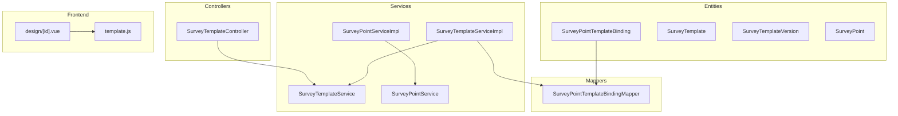
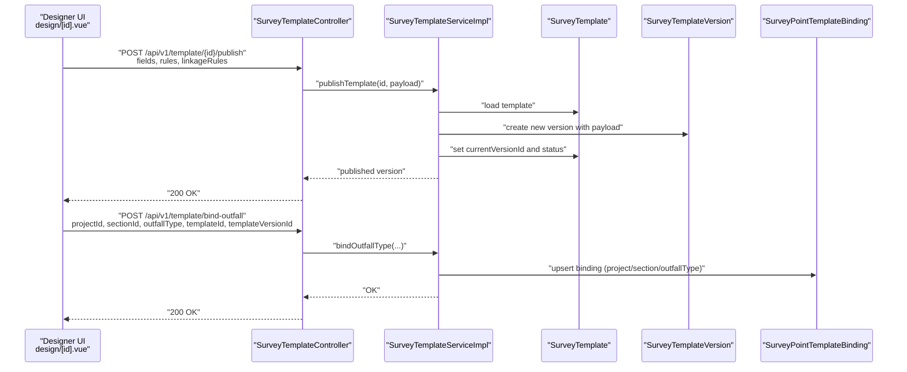
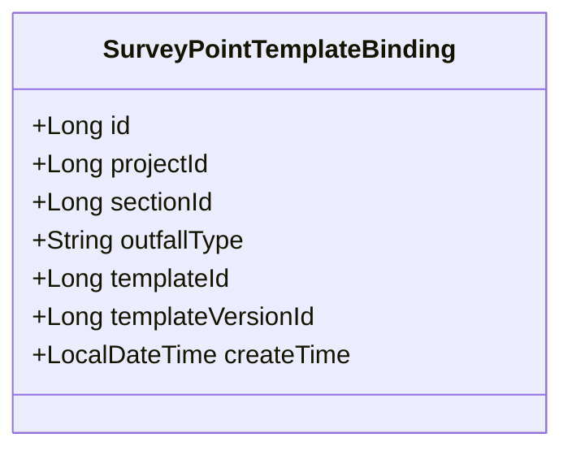
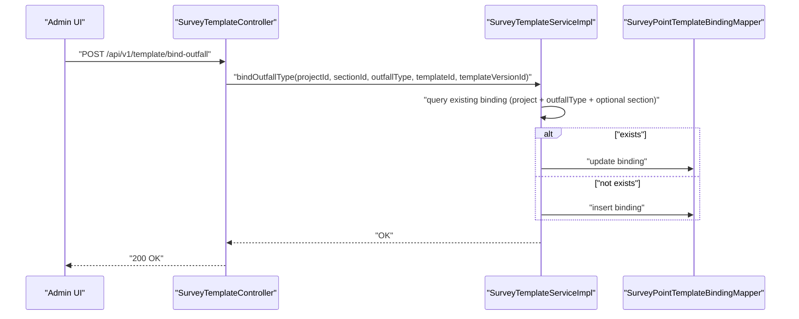
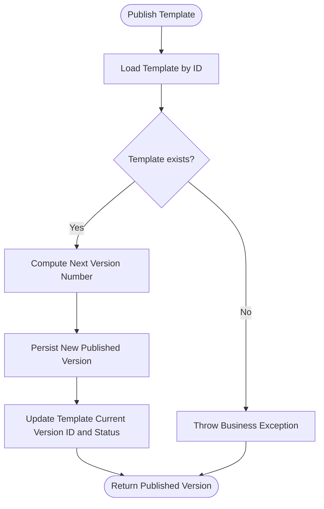
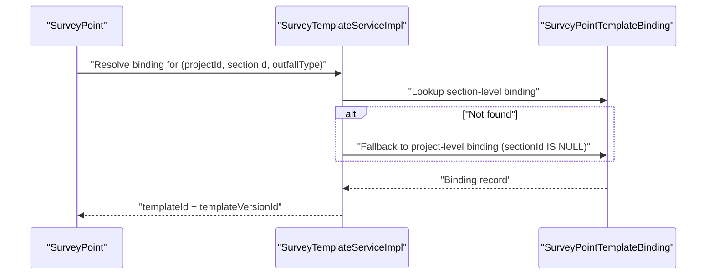
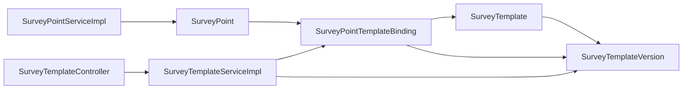

# Template Binding & Assignment

<cite>
**Referenced Files in This Document**
- [SurveyPointTemplateBinding.java](file://admin-backend/src/main/java/com/qhiot/survey/entity/SurveyPointTemplateBinding.java)
- [SurveyTemplate.java](file://admin-backend/src/main/java/com/qhiot/survey/entity/SurveyTemplate.java)
- [SurveyTemplateVersion.java](file://admin-backend/src/main/java/com/qhiot/survey/entity/SurveyTemplateVersion.java)
- [SurveyPoint.java](file://admin-backend/src/main/java/com/qhiot/survey/entity/SurveyPoint.java)
- [SurveyTemplateService.java](file://admin-backend/src/main/java/com/qhiot/survey/service/SurveyTemplateService.java)
- [SurveyTemplateServiceImpl.java](file://admin-backend/src/main/java/com/qhiot/survey/service/impl/SurveyTemplateServiceImpl.java)
- [SurveyTemplateController.java](file://admin-backend/src/main/java/com/qhiot/survey/controller/SurveyTemplateController.java)
- [SurveyPointService.java](file://admin-backend/src/main/java/com/qhiot/survey/service/SurveyPointService.java)
- [SurveyPointServiceImpl.java](file://admin-backend/src/main/java/com/qhiot/survey/service/impl/SurveyPointServiceImpl.java)
- [SurveyPointTemplateBindingMapper.java](file://admin-backend/src/main/java/com/qhiot/survey/mapper/SurveyPointTemplateBindingMapper.java)
- [design/[id].vue](file://admin-web-soybean/src/views/template/design/[id].vue)
- [template.js](file://admin-web-soybean/src/api/template.js)
</cite>

## Table of Contents
1. [Introduction](#introduction)
2. [Project Structure](#project-structure)
3. [Core Components](#core-components)
4. [Architecture Overview](#architecture-overview)
5. [Detailed Component Analysis](#detailed-component-analysis)
6. [Dependency Analysis](#dependency-analysis)
7. [Performance Considerations](#performance-considerations)
8. [Troubleshooting Guide](#troubleshooting-guide)
9. [Conclusion](#conclusion)

## Introduction
This document explains the template binding and assignment system used to associate survey points with specific survey templates. It focuses on the SurveyPointTemplateBinding entity and its role in enabling dynamic template application based on point attributes such as project, section, and outfall type. The document covers the binding workflow, assignment procedures, template activation, validation, conflict resolution, and integration with the survey point lifecycle.

## Project Structure
The template binding system spans backend entities, services, controllers, and frontend designer components:
- Entities define the binding relationship and template/version metadata.
- Services encapsulate business logic for binding, publishing, and retrieval.
- Controllers expose REST endpoints for binding management and template operations.
- Frontend provides a designer to create, edit, and publish templates.

**Diagram sources**
- [SurveyPointTemplateBinding.java:1-32](file://admin-backend/src/main/java/com/qhiot/survey/entity/SurveyPointTemplateBinding.java#L1-L32)
- [SurveyTemplate.java:1-61](file://admin-backend/src/main/java/com/qhiot/survey/entity/SurveyTemplate.java#L1-L61)
- [SurveyTemplateVersion.java:1-38](file://admin-backend/src/main/java/com/qhiot/survey/entity/SurveyTemplateVersion.java#L1-L38)
- [SurveyPoint.java:1-84](file://admin-backend/src/main/java/com/qhiot/survey/entity/SurveyPoint.java#L1-L84)
- [SurveyTemplateService.java:1-59](file://admin-backend/src/main/java/com/qhiot/survey/service/SurveyTemplateService.java#L1-L59)
- [SurveyTemplateServiceImpl.java:1-384](file://admin-backend/src/main/java/com/qhiot/survey/service/impl/SurveyTemplateServiceImpl.java#L1-L384)
- [SurveyTemplateController.java:1-194](file://admin-backend/src/main/java/com/qhiot/survey/controller/SurveyTemplateController.java#L1-L194)
- [SurveyPointService.java:1-79](file://admin-backend/src/main/java/com/qhiot/survey/service/SurveyPointService.java#L1-L79)
- [SurveyPointServiceImpl.java:1-261](file://admin-backend/src/main/java/com/qhiot/survey/service/impl/SurveyPointServiceImpl.java#L1-L261)
- [SurveyPointTemplateBindingMapper.java:1-9](file://admin-backend/src/main/java/com/qhiot/survey/mapper/SurveyPointTemplateBindingMapper.java#L1-L9)
- [design/[id].vue](file://admin-web-soybean/src/views/template/design/[id].vue#L1-L514)
- [template.js:1-3](file://admin-web-soybean/src/api/template.js#L1-L3)

**Section sources**
- [SurveyPointTemplateBinding.java:1-32](file://admin-backend/src/main/java/com/qhiot/survey/entity/SurveyPointTemplateBinding.java#L1-L32)
- [SurveyTemplate.java:1-61](file://admin-backend/src/main/java/com/qhiot/survey/entity/SurveyTemplate.java#L1-L61)
- [SurveyTemplateVersion.java:1-38](file://admin-backend/src/main/java/com/qhiot/survey/entity/SurveyTemplateVersion.java#L1-L38)
- [SurveyPoint.java:1-84](file://admin-backend/src/main/java/com/qhiot/survey/entity/SurveyPoint.java#L1-L84)
- [SurveyTemplateService.java:1-59](file://admin-backend/src/main/java/com/qhiot/survey/service/SurveyTemplateService.java#L1-L59)
- [SurveyTemplateServiceImpl.java:1-384](file://admin-backend/src/main/java/com/qhiot/survey/service/impl/SurveyTemplateServiceImpl.java#L1-L384)
- [SurveyTemplateController.java:1-194](file://admin-backend/src/main/java/com/qhiot/survey/controller/SurveyTemplateController.java#L1-L194)
- [SurveyPointService.java:1-79](file://admin-backend/src/main/java/com/qhiot/survey/service/SurveyPointService.java#L1-L79)
- [SurveyPointServiceImpl.java:1-261](file://admin-backend/src/main/java/com/qhiot/survey/service/impl/SurveyPointServiceImpl.java#L1-L261)
- [SurveyPointTemplateBindingMapper.java:1-9](file://admin-backend/src/main/java/com/qhiot/survey/mapper/SurveyPointTemplateBindingMapper.java#L1-L9)
- [design/[id].vue](file://admin-web-soybean/src/views/template/design/[id].vue#L1-L514)
- [template.js:1-3](file://admin-web-soybean/src/api/template.js#L1-L3)

## Core Components
- SurveyPointTemplateBinding: Associates a survey point’s project/section/outfallType with a specific template and template version.
- SurveyTemplate: Master record for a survey template, including status and current version reference.
- SurveyTemplateVersion: Stores published versions of a template with fields, rules, and linkage rules.
- SurveyPoint: Represents a geographic point with attributes such as outfallType, used to resolve applicable templates via binding.
- SurveyTemplateService and SurveyTemplateServiceImpl: Provide binding APIs, template publishing, and version caching.
- SurveyTemplateController: Exposes REST endpoints for binding management and template operations.
- SurveyPointService and SurveyPointServiceImpl: Manage survey points and support outfall-type updates used by binding resolution.
- SurveyPointTemplateBindingMapper: Data access layer for binding records.

**Section sources**
- [SurveyPointTemplateBinding.java:10-32](file://admin-backend/src/main/java/com/qhiot/survey/entity/SurveyPointTemplateBinding.java#L10-L32)
- [SurveyTemplate.java:10-61](file://admin-backend/src/main/java/com/qhiot/survey/entity/SurveyTemplate.java#L10-L61)
- [SurveyTemplateVersion.java:10-38](file://admin-backend/src/main/java/com/qhiot/survey/entity/SurveyTemplateVersion.java#L10-L38)
- [SurveyPoint.java:14-84](file://admin-backend/src/main/java/com/qhiot/survey/entity/SurveyPoint.java#L14-L84)
- [SurveyTemplateService.java:12-59](file://admin-backend/src/main/java/com/qhiot/survey/service/SurveyTemplateService.java#L12-L59)
- [SurveyTemplateServiceImpl.java:217-281](file://admin-backend/src/main/java/com/qhiot/survey/service/impl/SurveyTemplateServiceImpl.java#L217-L281)
- [SurveyTemplateController.java:157-194](file://admin-backend/src/main/java/com/qhiot/survey/controller/SurveyTemplateController.java#L157-L194)
- [SurveyPointService.java:12-79](file://admin-backend/src/main/java/com/qhiot/survey/service/SurveyPointService.java#L12-L79)
- [SurveyPointServiceImpl.java:236-246](file://admin-backend/src/main/java/com/qhiot/survey/service/impl/SurveyPointServiceImpl.java#L236-L246)
- [SurveyPointTemplateBindingMapper.java:1-9](file://admin-backend/src/main/java/com/qhiot/survey/mapper/SurveyPointTemplateBindingMapper.java#L1-L9)

## Architecture Overview
The system integrates template design, publishing, and runtime binding to dynamically apply templates to survey points.

**Diagram sources**
- [SurveyTemplateController.java:109-131](file://admin-backend/src/main/java/com/qhiot/survey/controller/SurveyTemplateController.java#L109-L131)
- [SurveyTemplateController.java:157-169](file://admin-backend/src/main/java/com/qhiot/survey/controller/SurveyTemplateController.java#L157-L169)
- [SurveyTemplateServiceImpl.java:138-174](file://admin-backend/src/main/java/com/qhiot/survey/service/impl/SurveyTemplateServiceImpl.java#L138-L174)
- [SurveyTemplateServiceImpl.java:217-246](file://admin-backend/src/main/java/com/qhiot/survey/service/impl/SurveyTemplateServiceImpl.java#L217-L246)
- [SurveyTemplate.java:1-61](file://admin-backend/src/main/java/com/qhiot/survey/entity/SurveyTemplate.java#L1-L61)
- [SurveyTemplateVersion.java:1-38](file://admin-backend/src/main/java/com/qhiot/survey/entity/SurveyTemplateVersion.java#L1-L38)
- [SurveyPointTemplateBinding.java:1-32](file://admin-backend/src/main/java/com/qhiot/survey/entity/SurveyPointTemplateBinding.java#L1-L32)

## Detailed Component Analysis

### SurveyPointTemplateBinding Entity
- Purpose: Encapsulates the binding between a project/section/outfallType and a template/version pair.
- Fields:
  - projectId, sectionId, outfallType: identifies the scope of the binding.
  - templateId, templateVersionId: references the active template and its published version.
  - createTime: audit trail for creation.
- Behavior:
  - Supports upsert semantics during binding updates.
  - Allows hierarchical lookup: section-level binding overrides project-level binding when present.

**Diagram sources**
- [SurveyPointTemplateBinding.java:10-32](file://admin-backend/src/main/java/com/qhiot/survey/entity/SurveyPointTemplateBinding.java#L10-L32)

**Section sources**
- [SurveyPointTemplateBinding.java:10-32](file://admin-backend/src/main/java/com/qhiot/survey/entity/SurveyPointTemplateBinding.java#L10-L32)
- [SurveyPointTemplateBindingMapper.java:1-9](file://admin-backend/src/main/java/com/qhiot/survey/mapper/SurveyPointTemplateBindingMapper.java#L1-L9)

### Binding Workflow and Procedures
- Binding creation/updating:
  - Endpoint: POST /api/v1/template/bind-outfall
  - Service method: bindOutfallType(projectId, sectionId, outfallType, templateId, templateVersionId)
  - Behavior: Upserts a binding keyed by project and outfallType, optionally scoped to sectionId. If sectionId is null, a project-level binding is stored.
- Retrieval:
  - Endpoint: GET /api/v1/template/binding
  - Service method: getBindingByOutfallType(projectId, sectionId, outfallType)
  - Resolution order: section-level binding takes precedence; otherwise falls back to project-level binding (sectionId is null).
- Listing and deletion:
  - GET /api/v1/template/bindings lists all bindings for a project.
  - DELETE /api/v1/template/binding/{bindingId} removes a binding.

**Diagram sources**
- [SurveyTemplateController.java:157-169](file://admin-backend/src/main/java/com/qhiot/survey/controller/SurveyTemplateController.java#L157-L169)
- [SurveyTemplateServiceImpl.java:217-246](file://admin-backend/src/main/java/com/qhiot/survey/service/impl/SurveyTemplateServiceImpl.java#L217-L246)
- [SurveyPointTemplateBindingMapper.java:1-9](file://admin-backend/src/main/java/com/qhiot/survey/mapper/SurveyPointTemplateBindingMapper.java#L1-L9)

**Section sources**
- [SurveyTemplateController.java:157-178](file://admin-backend/src/main/java/com/qhiot/survey/controller/SurveyTemplateController.java#L157-L178)
- [SurveyTemplateServiceImpl.java:217-267](file://admin-backend/src/main/java/com/qhiot/survey/service/impl/SurveyTemplateServiceImpl.java#L217-L267)
- [SurveyPointTemplateBindingMapper.java:1-9](file://admin-backend/src/main/java/com/qhiot/survey/mapper/SurveyPointTemplateBindingMapper.java#L1-L9)

### Template Assignment and Activation
- Template creation and initial version:
  - On creation, a draft template is created with an initial draft version.
- Publishing a new version:
  - Endpoint: POST /api/v1/template/{id}/publish
  - Service method: publishTemplate(templateId, fieldsJson, rulesJson, linkageRulesJson)
  - Behavior: Computes next version number, persists a new published version, updates template’s currentVersionId and status.
- Version caching:
  - getPublishedVersion(templateId) is cached to optimize frequent reads during point loading and mobile rendering.
  - evictTemplateVersionCache(versionId) clears cache entries after edits/publishing.

**Diagram sources**
- [SurveyTemplateController.java:109-131](file://admin-backend/src/main/java/com/qhiot/survey/controller/SurveyTemplateController.java#L109-L131)
- [SurveyTemplateServiceImpl.java:138-174](file://admin-backend/src/main/java/com/qhiot/survey/service/impl/SurveyTemplateServiceImpl.java#L138-L174)

**Section sources**
- [SurveyTemplateController.java:109-131](file://admin-backend/src/main/java/com/qhiot/survey/controller/SurveyTemplateController.java#L109-L131)
- [SurveyTemplateServiceImpl.java:138-174](file://admin-backend/src/main/java/com/qhiot/survey/service/impl/SurveyTemplateServiceImpl.java#L138-L174)
- [SurveyTemplateService.java:32-41](file://admin-backend/src/main/java/com/qhiot/survey/service/SurveyTemplateService.java#L32-L41)

### Dynamic Template Application
- At runtime, a survey point’s applicable template is resolved by:
  - Using the point’s projectId, sectionId, and outfallType.
  - Calling getBindingByOutfallType(projectId, sectionId, outfallType).
  - Returning the associated templateId and templateVersionId.
- The frontend designer (design/[id].vue) supports:
  - Loading template versions and fields.
  - Saving drafts and publishing versions.
  - Previewing forms on a mobile-like device.

**Diagram sources**
- [SurveyPoint.java:26-44](file://admin-backend/src/main/java/com/qhiot/survey/entity/SurveyPoint.java#L26-L44)
- [SurveyTemplateServiceImpl.java:248-267](file://admin-backend/src/main/java/com/qhiot/survey/service/impl/SurveyTemplateServiceImpl.java#L248-L267)
- [SurveyPointTemplateBinding.java:18-31](file://admin-backend/src/main/java/com/qhiot/survey/entity/SurveyPointTemplateBinding.java#L18-L31)

**Section sources**
- [SurveyPoint.java:26-44](file://admin-backend/src/main/java/com/qhiot/survey/entity/SurveyPoint.java#L26-L44)
- [SurveyTemplateServiceImpl.java:248-267](file://admin-backend/src/main/java/com/qhiot/survey/service/impl/SurveyTemplateServiceImpl.java#L248-L267)
- [design/[id].vue](file://admin-web-soybean/src/views/template/design/[id].vue#L136-L184)

### Template Inheritance Patterns
- Scope precedence:
  - Section-level binding: most specific, overrides project-level binding.
  - Project-level binding: applies when no section-level binding exists.
- Outfall type specificity:
  - Binding is keyed by outfallType, allowing different templates per discharge type within the same project/section.

**Section sources**
- [SurveyTemplateServiceImpl.java:248-267](file://admin-backend/src/main/java/com/qhiot/survey/service/impl/SurveyTemplateServiceImpl.java#L248-L267)

### Examples of Binding Configurations
- Example binding request:
  - projectId: 1001
  - sectionId: 2002
  - outfallType: "rainwater"
  - templateId: 3003
  - templateVersionId: 4004
- Example binding retrieval:
  - Request: GET /api/v1/template/binding?projectId=1001&sectionId=2002&outfallType=rainwater
  - Response: SurveyPointTemplateBinding with templateId and templateVersionId
- Example bulk outfall-type update for points:
  - Service method: batchSetOutfallType(pointIds, outfallType)
  - Enables re-binding scenarios when point outfall types change.

**Section sources**
- [SurveyTemplateController.java:157-178](file://admin-backend/src/main/java/com/qhiot/survey/controller/SurveyTemplateController.java#L157-L178)
- [SurveyPointServiceImpl.java:236-246](file://admin-backend/src/main/java/com/qhiot/survey/service/impl/SurveyPointServiceImpl.java#L236-L246)

### Real-Time Template Updates
- After publishing a new version, cache eviction ensures subsequent reads fetch the latest published version.
- Frontend designer supports live preview of published versions.

**Section sources**
- [SurveyTemplateServiceImpl.java:210-215](file://admin-backend/src/main/java/com/qhiot/survey/service/impl/SurveyTemplateServiceImpl.java#L210-L215)
- [SurveyTemplateController.java:133-137](file://admin-backend/src/main/java/com/qhiot/survey/controller/SurveyTemplateController.java#L133-L137)
- [design/[id].vue](file://admin-web-soybean/src/views/template/design/[id].vue#L136-L184)

### Template Binding Validation and Conflict Resolution
- Validation:
  - Binding uniqueness: enforced by composite key (projectId, outfallType, sectionId).
  - Section-level overrides project-level binding automatically upon upsert.
- Conflict resolution:
  - If a section-level binding exists, it supersedes project-level binding for the same outfallType.
  - Deleting a binding removes ambiguity and allows fallback to other bindings or absence of a template.

**Section sources**
- [SurveyTemplateServiceImpl.java:217-246](file://admin-backend/src/main/java/com/qhiot/survey/service/impl/SurveyTemplateServiceImpl.java#L217-L246)
- [SurveyTemplateServiceImpl.java:248-267](file://admin-backend/src/main/java/com/qhiot/survey/service/impl/SurveyTemplateServiceImpl.java#L248-L267)

### Integration with Survey Point Lifecycle Management
- Point creation/import sets outfallType and coordinates.
- Batch operations can update outfallType across points, enabling binding re-evaluation.
- Point status and audit history are managed independently but rely on the applied template’s fields/rules for rendering and validation.

**Section sources**
- [SurveyPointServiceImpl.java:127-185](file://admin-backend/src/main/java/com/qhiot/survey/service/impl/SurveyPointServiceImpl.java#L127-L185)
- [SurveyPointServiceImpl.java:236-246](file://admin-backend/src/main/java/com/qhiot/survey/service/impl/SurveyPointServiceImpl.java#L236-L246)
- [SurveyPoint.java:26-84](file://admin-backend/src/main/java/com/qhiot/survey/entity/SurveyPoint.java#L26-L84)

## Dependency Analysis
- Entities:
  - SurveyPointTemplateBinding depends on SurveyTemplate and SurveyTemplateVersion via foreign keys.
  - SurveyTemplateVersion belongs to SurveyTemplate.
  - SurveyPoint holds outfallType used to resolve bindings.
- Services:
  - SurveyTemplateServiceImpl depends on SurveyPointTemplateBindingMapper and SurveyTemplateVersionMapper.
  - SurveyTemplateController delegates to SurveyTemplateService.
  - SurveyPointServiceImpl supports outfall-type updates used by binding resolution.
- Frontend:
  - design/[id].vue integrates with template APIs for publishing and previewing.

**Diagram sources**
- [SurveyPoint.java:1-84](file://admin-backend/src/main/java/com/qhiot/survey/entity/SurveyPoint.java#L1-L84)
- [SurveyPointTemplateBinding.java:1-32](file://admin-backend/src/main/java/com/qhiot/survey/entity/SurveyPointTemplateBinding.java#L1-L32)
- [SurveyTemplate.java:1-61](file://admin-backend/src/main/java/com/qhiot/survey/entity/SurveyTemplate.java#L1-L61)
- [SurveyTemplateVersion.java:1-38](file://admin-backend/src/main/java/com/qhiot/survey/entity/SurveyTemplateVersion.java#L1-L38)
- [SurveyTemplateServiceImpl.java:1-384](file://admin-backend/src/main/java/com/qhiot/survey/service/impl/SurveyTemplateServiceImpl.java#L1-L384)
- [SurveyTemplateController.java:1-194](file://admin-backend/src/main/java/com/qhiot/survey/controller/SurveyTemplateController.java#L1-L194)
- [SurveyPointServiceImpl.java:1-261](file://admin-backend/src/main/java/com/qhiot/survey/service/impl/SurveyPointServiceImpl.java#L1-L261)

**Section sources**
- [SurveyPoint.java:1-84](file://admin-backend/src/main/java/com/qhiot/survey/entity/SurveyPoint.java#L1-L84)
- [SurveyPointTemplateBinding.java:1-32](file://admin-backend/src/main/java/com/qhiot/survey/entity/SurveyPointTemplateBinding.java#L1-L32)
- [SurveyTemplate.java:1-61](file://admin-backend/src/main/java/com/qhiot/survey/entity/SurveyTemplate.java#L1-L61)
- [SurveyTemplateVersion.java:1-38](file://admin-backend/src/main/java/com/qhiot/survey/entity/SurveyTemplateVersion.java#L1-L38)
- [SurveyTemplateServiceImpl.java:1-384](file://admin-backend/src/main/java/com/qhiot/survey/service/impl/SurveyTemplateServiceImpl.java#L1-L384)
- [SurveyTemplateController.java:1-194](file://admin-backend/src/main/java/com/qhiot/survey/controller/SurveyTemplateController.java#L1-L194)
- [SurveyPointServiceImpl.java:1-261](file://admin-backend/src/main/java/com/qhiot/survey/service/impl/SurveyPointServiceImpl.java#L1-L261)

## Performance Considerations
- Cache published template versions to reduce database reads during point loading and mobile rendering.
- Use pagination and targeted queries for binding listings.
- Minimize JSON parsing overhead by streaming or batching operations where feasible.

[No sources needed since this section provides general guidance]

## Troubleshooting Guide
- Binding not applied:
  - Verify sectionId is set correctly; section-level bindings override project-level ones.
  - Confirm outfallType matches exactly (case-sensitive) and that a binding exists.
- Template not appearing in preview:
  - Ensure the template has a published version; draft-only templates are not returned by published-version queries.
- Cache stale data:
  - Trigger cache eviction after publishing or editing versions to refresh cached published versions.

**Section sources**
- [SurveyTemplateServiceImpl.java:195-208](file://admin-backend/src/main/java/com/qhiot/survey/service/impl/SurveyTemplateServiceImpl.java#L195-L208)
- [SurveyTemplateServiceImpl.java:210-215](file://admin-backend/src/main/java/com/qhiot/survey/service/impl/SurveyTemplateServiceImpl.java#L210-L215)

## Conclusion
The template binding and assignment system provides a robust mechanism to associate survey points with specific templates based on project, section, and outfall type. It supports dynamic template application, hierarchical binding precedence, and efficient caching of published versions. Together with the frontend designer, it enables administrators to create, publish, and manage templates while ensuring accurate and timely application to survey points.