# Template Definition & Structure

<cite>
**Referenced Files in This Document**
- [SurveyTemplate.java](file://admin-backend/src/main/java/com/qhiot/survey/entity/SurveyTemplate.java)
- [SurveyTemplateVersion.java](file://admin-backend/src/main/java/com/qhiot/survey/entity/SurveyTemplateVersion.java)
- [SurveyPointTemplateBinding.java](file://admin-backend/src/main/java/com/qhiot/survey/entity/SurveyPointTemplateBinding.java)
- [SurveyTemplateController.java](file://admin-backend/src/main/java/com/qhiot/survey/controller/SurveyTemplateController.java)
- [SurveyTemplateService.java](file://admin-backend/src/main/java/com/qhiot/survey/service/SurveyTemplateService.java)
- [SurveyTemplateServiceImpl.java](file://admin-backend/src/main/java/com/qhiot/survey/service/impl/SurveyTemplateServiceImpl.java)
- [SurveyTemplateMapper.java](file://admin-backend/src/main/java/com/qhiot/survey/mapper/SurveyTemplateMapper.java)
- [TemplateStatus.java](file://admin-backend/src/main/java/com/qhiot/survey/common/enums/TemplateStatus.java)
- [SysDictionary.java](file://admin-backend/src/main/java/com/qhiot/survey/entity/SysDictionary.java)
- [SysDict.java](file://admin-backend/src/main/java/com/qhiot/survey/entity/SysDict.java)
- [dictionary_tables.sql](file://admin-backend/src/main/resources/db/dictionary_tables.sql)
- [template.ts](file://admin-web-soybean/src/service/api/template.ts)
- [template.js](file://admin-web-soybean/src/api/template.js)
</cite>

## Table of Contents
1. [Introduction](#introduction)
2. [Project Structure](#project-structure)
3. [Core Components](#core-components)
4. [Architecture Overview](#architecture-overview)
5. [Detailed Component Analysis](#detailed-component-analysis)
6. [Dependency Analysis](#dependency-analysis)
7. [Performance Considerations](#performance-considerations)
8. [Troubleshooting Guide](#troubleshooting-guide)
9. [Conclusion](#conclusion)
10. [Appendices](#appendices)

## Introduction
This document explains the Survey Template definition and structure component. It covers the SurveyTemplate entity architecture, template metadata, status management, and the field configuration JSON structure. It documents the template creation workflow, validation rules, administrative controls, and the relationship between template fields and the old fieldsJson compatibility layer. It also describes template categorization by outlet types, lifecycle management, and integration with the dictionary system.

## Project Structure
The template feature spans backend domain entities, service layer, controller, and frontend API contracts. The backend defines the template model, versioning, and binding to outlet types. The frontend exposes typed APIs for designing, publishing, and previewing templates.

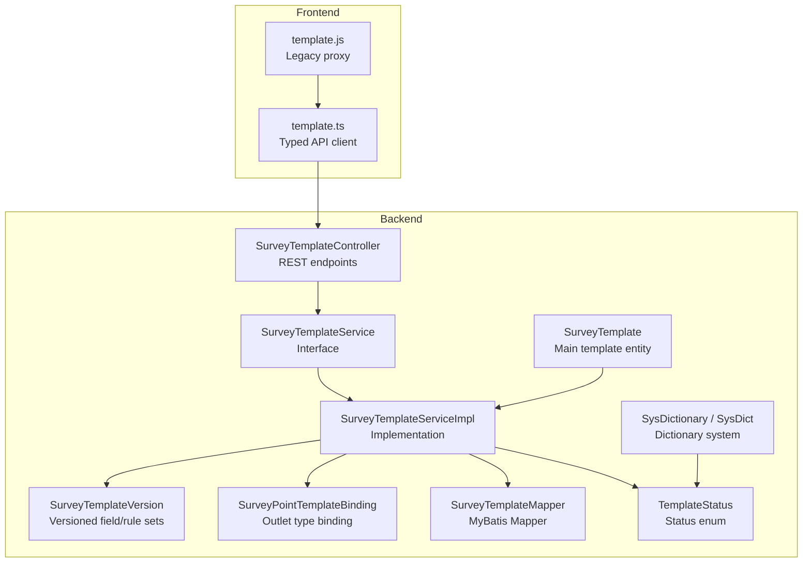

**Diagram sources**
- [SurveyTemplate.java:1-61](file://admin-backend/src/main/java/com/qhiot/survey/entity/SurveyTemplate.java#L1-L61)
- [SurveyTemplateVersion.java:1-38](file://admin-backend/src/main/java/com/qhiot/survey/entity/SurveyTemplateVersion.java#L1-L38)
- [SurveyPointTemplateBinding.java:1-32](file://admin-backend/src/main/java/com/qhiot/survey/entity/SurveyPointTemplateBinding.java#L1-L32)
- [SurveyTemplateController.java:1-194](file://admin-backend/src/main/java/com/qhiot/survey/controller/SurveyTemplateController.java#L1-L194)
- [SurveyTemplateService.java:1-59](file://admin-backend/src/main/java/com/qhiot/survey/service/SurveyTemplateService.java#L1-L59)
- [SurveyTemplateServiceImpl.java:1-384](file://admin-backend/src/main/java/com/qhiot/survey/service/impl/SurveyTemplateServiceImpl.java#L1-L384)
- [SurveyTemplateMapper.java:1-10](file://admin-backend/src/main/java/com/qhiot/survey/mapper/SurveyTemplateMapper.java#L1-L10)
- [TemplateStatus.java:1-30](file://admin-backend/src/main/java/com/qhiot/survey/common/enums/TemplateStatus.java#L1-L30)
- [SysDictionary.java:1-46](file://admin-backend/src/main/java/com/qhiot/survey/entity/SysDictionary.java#L1-L46)
- [SysDict.java:1-60](file://admin-backend/src/main/java/com/qhiot/survey/entity/SysDict.java#L1-L60)
- [template.ts:1-214](file://admin-web-soybean/src/service/api/template.ts#L1-L214)
- [template.js:1-3](file://admin-web-soybean/src/api/template.js#L1-L3)

**Section sources**
- [SurveyTemplate.java:1-61](file://admin-backend/src/main/java/com/qhiot/survey/entity/SurveyTemplate.java#L1-L61)
- [SurveyTemplateController.java:1-194](file://admin-backend/src/main/java/com/qhiot/survey/controller/SurveyTemplateController.java#L1-L194)
- [SurveyTemplateService.java:1-59](file://admin-backend/src/main/java/com/qhiot/survey/service/SurveyTemplateService.java#L1-L59)
- [SurveyTemplateServiceImpl.java:1-384](file://admin-backend/src/main/java/com/qhiot/survey/service/impl/SurveyTemplateServiceImpl.java#L1-L384)
- [SurveyTemplateMapper.java:1-10](file://admin-backend/src/main/java/com/qhiot/survey/mapper/SurveyTemplateMapper.java#L1-L10)
- [TemplateStatus.java:1-30](file://admin-backend/src/main/java/com/qhiot/survey/common/enums/TemplateStatus.java#L1-L30)
- [SysDictionary.java:1-46](file://admin-backend/src/main/java/com/qhiot/survey/entity/SysDictionary.java#L1-L46)
- [SysDict.java:1-60](file://admin-backend/src/main/java/com/qhiot/survey/entity/SysDict.java#L1-L60)
- [dictionary_tables.sql:1-88](file://admin-backend/src/main/resources/db/dictionary_tables.sql#L1-L88)
- [template.ts:1-214](file://admin-web-soybean/src/service/api/template.ts#L1-L214)
- [template.js:1-3](file://admin-web-soybean/src/api/template.js#L1-L3)

## Core Components
- SurveyTemplate: The main template entity storing metadata (id, templateName, templateCode, description), status, fieldsJson compatibility, currentVersionId, outletType, and audit fields.
- SurveyTemplateVersion: Versioned snapshot of field configuration (fieldsJson), rules (rulesJson), linkage rules (linkageRulesJson), status, publish time, and creator.
- SurveyPointTemplateBinding: Association between a project/section/outlet type and a specific template version for automatic form selection.
- Status Management: Enumerated statuses (draft, published, disabled) backed by a dictionary system.
- Controller and Service: REST endpoints and business logic for CRUD, publishing, previewing, and binding.
- Frontend API: Typed TypeScript contracts for template operations.

Key responsibilities:
- Enforce uniqueness of templateCode during creation.
- Maintain a draft version alongside published versions.
- Support previewing the current published fields and rules.
- Bind outlet types to template versions for downstream point creation.

**Section sources**
- [SurveyTemplate.java:1-61](file://admin-backend/src/main/java/com/qhiot/survey/entity/SurveyTemplate.java#L1-L61)
- [SurveyTemplateVersion.java:1-38](file://admin-backend/src/main/java/com/qhiot/survey/entity/SurveyTemplateVersion.java#L1-L38)
- [SurveyPointTemplateBinding.java:1-32](file://admin-backend/src/main/java/com/qhiot/survey/entity/SurveyPointTemplateBinding.java#L1-L32)
- [TemplateStatus.java:1-30](file://admin-backend/src/main/java/com/qhiot/survey/common/enums/TemplateStatus.java#L1-L30)
- [SurveyTemplateController.java:1-194](file://admin-backend/src/main/java/com/qhiot/survey/controller/SurveyTemplateController.java#L1-L194)
- [SurveyTemplateService.java:1-59](file://admin-backend/src/main/java/com/qhiot/survey/service/SurveyTemplateService.java#L1-L59)
- [SurveyTemplateServiceImpl.java:70-103](file://admin-backend/src/main/java/com/qhiot/survey/service/impl/SurveyTemplateServiceImpl.java#L70-L103)
- [template.ts:1-214](file://admin-web-soybean/src/service/api/template.ts#L1-L214)

## Architecture Overview
The template subsystem follows a layered architecture:
- Entities define persistence models.
- Service layer encapsulates business rules (validation, publishing, caching).
- Controller exposes REST endpoints with role-based access.
- Frontend consumes strongly-typed API contracts.

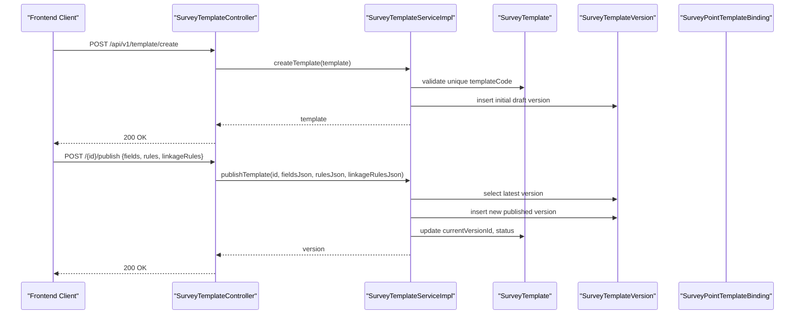

**Diagram sources**
- [SurveyTemplateController.java:60-131](file://admin-backend/src/main/java/com/qhiot/survey/controller/SurveyTemplateController.java#L60-L131)
- [SurveyTemplateServiceImpl.java:70-103](file://admin-backend/src/main/java/com/qhiot/survey/service/impl/SurveyTemplateServiceImpl.java#L70-L103)
- [SurveyTemplateServiceImpl.java:141-174](file://admin-backend/src/main/java/com/qhiot/survey/service/impl/SurveyTemplateServiceImpl.java#L141-L174)

**Section sources**
- [SurveyTemplateController.java:1-194](file://admin-backend/src/main/java/com/qhiot/survey/controller/SurveyTemplateController.java#L1-L194)
- [SurveyTemplateServiceImpl.java:1-384](file://admin-backend/src/main/java/com/qhiot/survey/service/impl/SurveyTemplateServiceImpl.java#L1-L384)

## Detailed Component Analysis

### Entity Model: SurveyTemplate
- Purpose: Stores template metadata and current state.
- Fields:
  - Identifier and audit fields (id, creatorId, createTime, updateTime).
  - Metadata: templateName, templateCode (unique), description.
  - Status: status mapped to TemplateStatus enum.
  - Compatibility: fieldsJson for backward compatibility with older designs.
  - Versioning: currentVersionId referencing the latest published version.
  - Outlet association: outletType linked to dictionary entries.

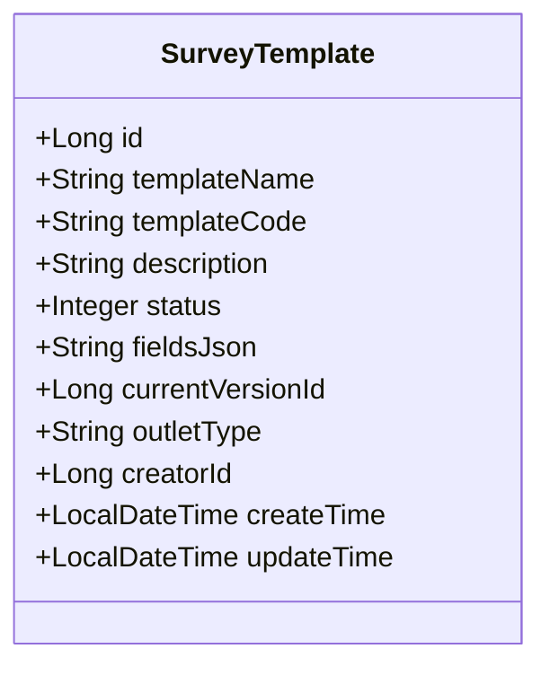

**Diagram sources**
- [SurveyTemplate.java:1-61](file://admin-backend/src/main/java/com/qhiot/survey/entity/SurveyTemplate.java#L1-L61)

**Section sources**
- [SurveyTemplate.java:1-61](file://admin-backend/src/main/java/com/qhiot/survey/entity/SurveyTemplate.java#L1-L61)

### Entity Model: SurveyTemplateVersion
- Purpose: Encapsulates a versioned snapshot of the template’s field configuration and rules.
- Fields:
  - Identifiers: id, templateId, versionNo.
  - Configurations: fieldsJson (array), rulesJson (object), linkageRulesJson (array).
  - Lifecycle: status, publishTime, creatorId, createTime.

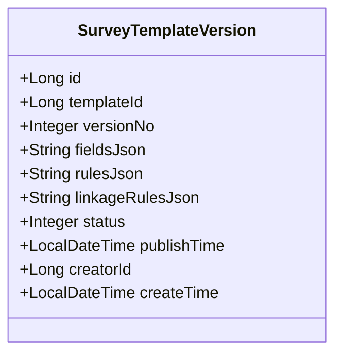

**Diagram sources**
- [SurveyTemplateVersion.java:1-38](file://admin-backend/src/main/java/com/qhiot/survey/entity/SurveyTemplateVersion.java#L1-L38)

**Section sources**
- [SurveyTemplateVersion.java:1-38](file://admin-backend/src/main/java/com/qhiot/survey/entity/SurveyTemplateVersion.java#L1-L38)

### Entity Model: SurveyPointTemplateBinding
- Purpose: Associates an outlet type with a specific template version for a project/section.
- Fields:
  - Identifiers: id, projectId, sectionId (nullable), outfallType.
  - Target: templateId, templateVersionId.
  - Audit: createTime.

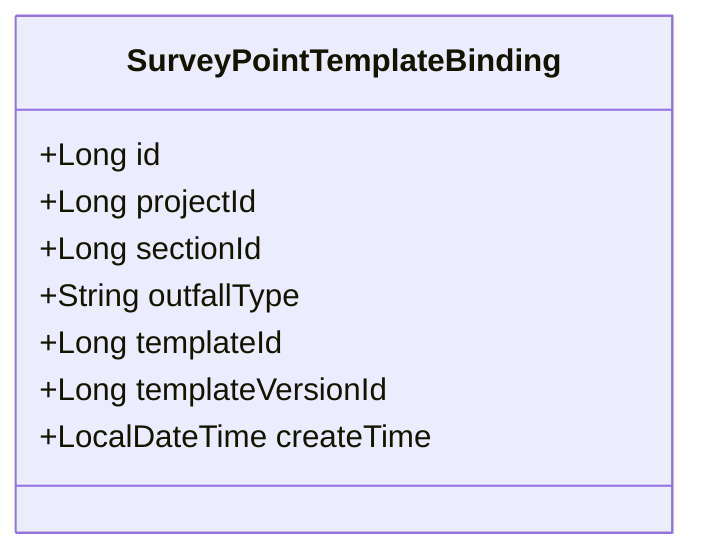

**Diagram sources**
- [SurveyPointTemplateBinding.java:1-32](file://admin-backend/src/main/java/com/qhiot/survey/entity/SurveyPointTemplateBinding.java#L1-L32)

**Section sources**
- [SurveyPointTemplateBinding.java:1-32](file://admin-backend/src/main/java/com/qhiot/survey/entity/SurveyPointTemplateBinding.java#L1-L32)

### Status Management and Dictionary Integration
- TemplateStatus enum defines DRAFT (0), PUBLISHED (1), DISABLED (2).
- The dictionary system initializes a TEMPLATE_STATUS category with the same codes and labels, enabling consistent lookup and UI labeling.

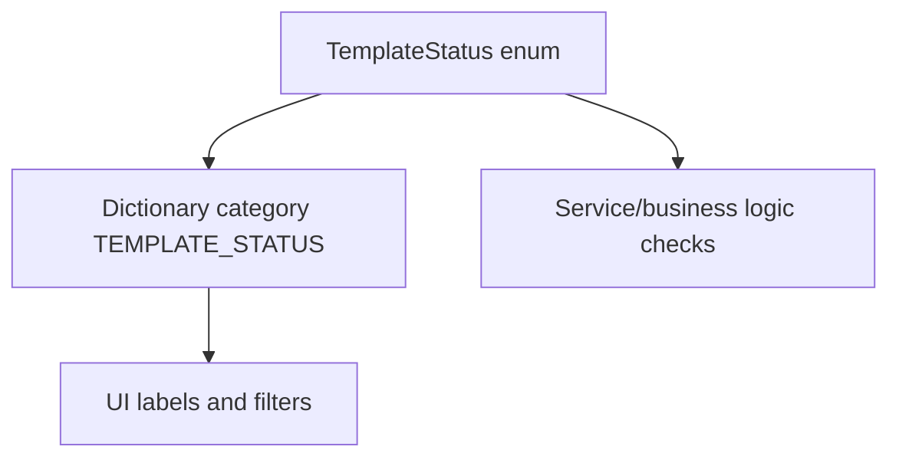

**Diagram sources**
- [TemplateStatus.java:1-30](file://admin-backend/src/main/java/com/qhiot/survey/common/enums/TemplateStatus.java#L1-L30)
- [dictionary_tables.sql:65-69](file://admin-backend/src/main/resources/db/dictionary_tables.sql#L65-L69)

**Section sources**
- [TemplateStatus.java:1-30](file://admin-backend/src/main/java/com/qhiot/survey/common/enums/TemplateStatus.java#L1-L30)
- [dictionary_tables.sql:34-88](file://admin-backend/src/main/resources/db/dictionary_tables.sql#L34-L88)

### Template Creation Workflow and Validation
- Uniqueness: Validates templateCode uniqueness before creation.
- Initial state: Sets status to DRAFT and ensures fieldsJson defaults to an empty array.
- Initial version: Creates a draft version with empty configurations and status DRAFT.
- Administrative control: Requires ADMIN role for create/update/delete/publish/binding operations.

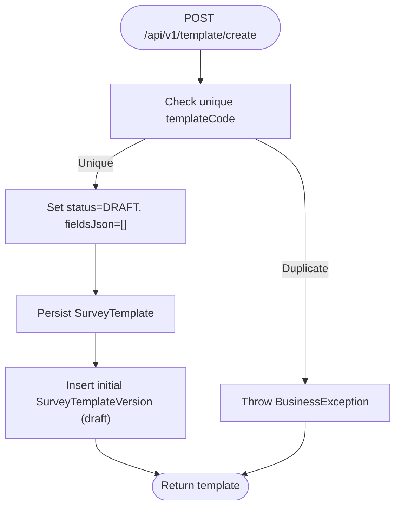

**Diagram sources**
- [SurveyTemplateServiceImpl.java:70-103](file://admin-backend/src/main/java/com/qhiot/survey/service/impl/SurveyTemplateServiceImpl.java#L70-L103)

**Section sources**
- [SurveyTemplateController.java:60-81](file://admin-backend/src/main/java/com/qhiot/survey/controller/SurveyTemplateController.java#L60-L81)
- [SurveyTemplateServiceImpl.java:70-103](file://admin-backend/src/main/java/com/qhiot/survey/service/impl/SurveyTemplateServiceImpl.java#L70-L103)

### Publishing Workflow and Versioning
- Publish endpoint accepts fields, rules, and linkageRules as JSON.
- Determines next version number from the latest version.
- Inserts a new published version, updates template’s currentVersionId and status, and clears version cache.

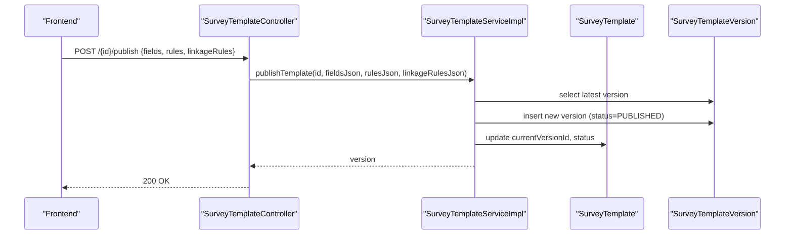

**Diagram sources**
- [SurveyTemplateController.java:109-131](file://admin-backend/src/main/java/com/qhiot/survey/controller/SurveyTemplateController.java#L109-L131)
- [SurveyTemplateServiceImpl.java:141-174](file://admin-backend/src/main/java/com/qhiot/survey/service/impl/SurveyTemplateServiceImpl.java#L141-L174)

**Section sources**
- [SurveyTemplateController.java:109-131](file://admin-backend/src/main/java/com/qhiot/survey/controller/SurveyTemplateController.java#L109-L131)
- [SurveyTemplateServiceImpl.java:141-174](file://admin-backend/src/main/java/com/qhiot/survey/service/impl/SurveyTemplateServiceImpl.java#L141-L174)

### Draft Saving and Preview
- Draft saving persists fields, rules, and linkageRules into a draft version (status DRAFT) and optionally updates templateName.
- Preview returns the current published fields and rules, defaulting to empty arrays if no published version exists.

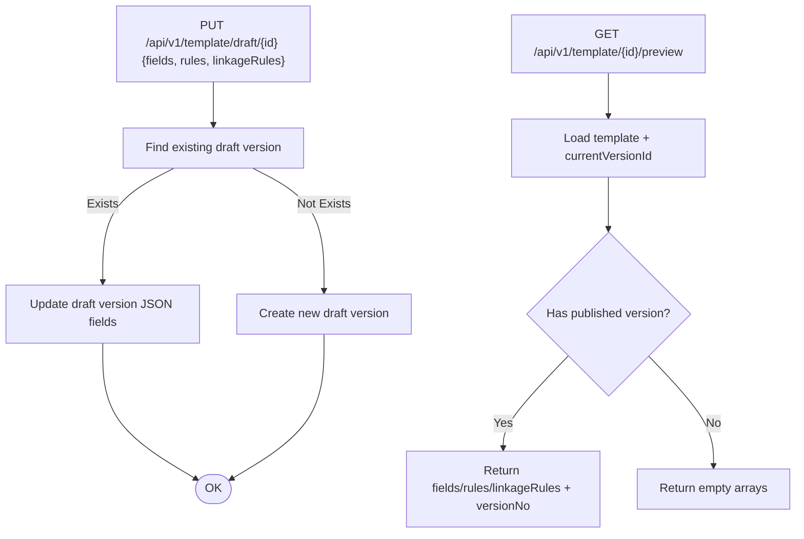

**Diagram sources**
- [SurveyTemplateController.java:100-137](file://admin-backend/src/main/java/com/qhiot/survey/controller/SurveyTemplateController.java#L100-L137)
- [SurveyTemplateServiceImpl.java:300-355](file://admin-backend/src/main/java/com/qhiot/survey/service/impl/SurveyTemplateServiceImpl.java#L300-L355)
- [SurveyTemplateServiceImpl.java:357-383](file://admin-backend/src/main/java/com/qhiot/survey/service/impl/SurveyTemplateServiceImpl.java#L357-L383)

**Section sources**
- [SurveyTemplateController.java:100-137](file://admin-backend/src/main/java/com/qhiot/survey/controller/SurveyTemplateController.java#L100-L137)
- [SurveyTemplateServiceImpl.java:300-355](file://admin-backend/src/main/java/com/qhiot/survey/service/impl/SurveyTemplateServiceImpl.java#L300-L355)
- [SurveyTemplateServiceImpl.java:357-383](file://admin-backend/src/main/java/com/qhiot/survey/service/impl/SurveyTemplateServiceImpl.java#L357-L383)

### Outlet Type Binding and Automatic Matching
- Bind endpoint associates an outlet type to a template version for a project/section.
- Get binding resolves section-level first, falls back to project-level (sectionId=null).
- List bindings retrieves all bindings for a project.

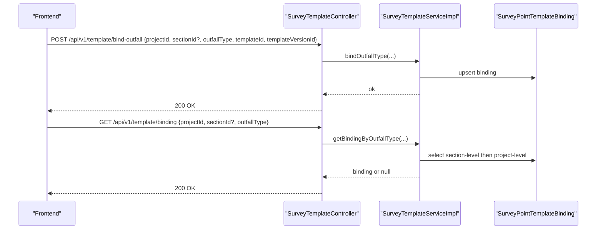

**Diagram sources**
- [SurveyTemplateController.java:157-178](file://admin-backend/src/main/java/com/qhiot/survey/controller/SurveyTemplateController.java#L157-L178)
- [SurveyTemplateServiceImpl.java:218-246](file://admin-backend/src/main/java/com/qhiot/survey/service/impl/SurveyTemplateServiceImpl.java#L218-L246)
- [SurveyTemplateServiceImpl.java:248-267](file://admin-backend/src/main/java/com/qhiot/survey/service/impl/SurveyTemplateServiceImpl.java#L248-L267)

**Section sources**
- [SurveyTemplateController.java:157-178](file://admin-backend/src/main/java/com/qhiot/survey/controller/SurveyTemplateController.java#L157-L178)
- [SurveyTemplateServiceImpl.java:218-246](file://admin-backend/src/main/java/com/qhiot/survey/service/impl/SurveyTemplateServiceImpl.java#L218-L246)
- [SurveyTemplateServiceImpl.java:248-267](file://admin-backend/src/main/java/com/qhiot/survey/service/impl/SurveyTemplateServiceImpl.java#L248-L267)

### Field Configuration JSON Structure and Old Compatibility Layer
- fieldsJson: Array of field definitions. The frontend defines a FieldSchema interface including id, type, label, placeholder, required, disabled, hidden, defaultValue, validation, options, optionSource, imageConfig, linkageRules, and location-specific fields.
- rulesJson: Arbitrary JSON object representing validation/business rules.
- linkageRulesJson: Array of linkage rules with actions and conditions.
- Old fieldsJson compatibility: The SurveyTemplate entity retains fieldsJson to support legacy clients while new designs are stored in SurveyTemplateVersion.

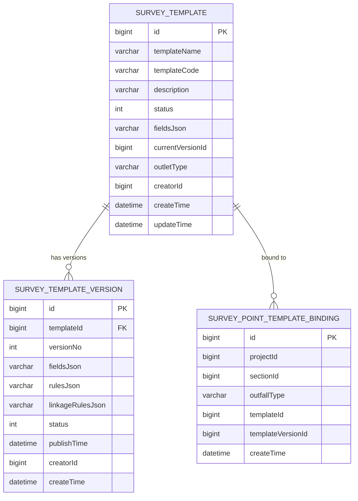

**Diagram sources**
- [SurveyTemplate.java:1-61](file://admin-backend/src/main/java/com/qhiot/survey/entity/SurveyTemplate.java#L1-L61)
- [SurveyTemplateVersion.java:1-38](file://admin-backend/src/main/java/com/qhiot/survey/entity/SurveyTemplateVersion.java#L1-L38)
- [SurveyPointTemplateBinding.java:1-32](file://admin-backend/src/main/java/com/qhiot/survey/entity/SurveyPointTemplateBinding.java#L1-L32)

**Section sources**
- [SurveyTemplate.java:38-41](file://admin-backend/src/main/java/com/qhiot/survey/entity/SurveyTemplate.java#L38-L41)
- [SurveyTemplateVersion.java:25-29](file://admin-backend/src/main/java/com/qhiot/survey/entity/SurveyTemplateVersion.java#L25-L29)
- [template.ts:42-62](file://admin-web-soybean/src/service/api/template.ts#L42-L62)

### Template Lifecycle Management
- Draft: Created automatically with initial empty configurations.
- Edit: Save draft updates fields, rules, linkageRules, and optionally templateName.
- Publish: Creates a new published version, increments version number, updates template status and currentVersionId.
- Preview: Returns current published configuration for rendering forms.
- Disable: Managed via status transitions and dictionary-backed UI.

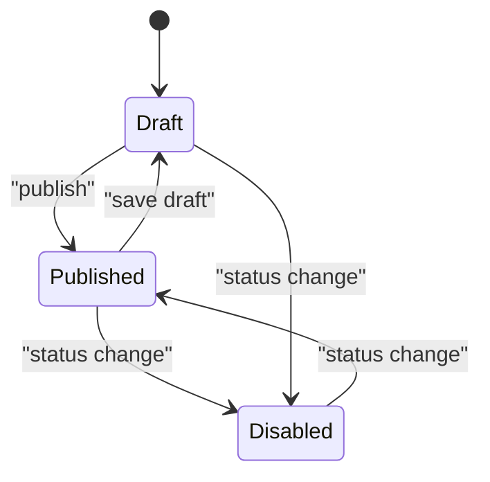

**Diagram sources**
- [SurveyTemplateServiceImpl.java:300-355](file://admin-backend/src/main/java/com/qhiot/survey/service/impl/SurveyTemplateServiceImpl.java#L300-L355)
- [SurveyTemplateServiceImpl.java:141-174](file://admin-backend/src/main/java/com/qhiot/survey/service/impl/SurveyTemplateServiceImpl.java#L141-L174)
- [TemplateStatus.java:10-12](file://admin-backend/src/main/java/com/qhiot/survey/common/enums/TemplateStatus.java#L10-L12)

**Section sources**
- [SurveyTemplateServiceImpl.java:300-355](file://admin-backend/src/main/java/com/qhiot/survey/service/impl/SurveyTemplateServiceImpl.java#L300-L355)
- [SurveyTemplateServiceImpl.java:141-174](file://admin-backend/src/main/java/com/qhiot/survey/service/impl/SurveyTemplateServiceImpl.java#L141-L174)
- [SurveyTemplateController.java:109-131](file://admin-backend/src/main/java/com/qhiot/survey/controller/SurveyTemplateController.java#L109-L131)

### Frontend Integration and API Contracts
- The frontend provides a typed API client with interfaces for FieldSchema, LinkageRule, FieldValidation, OptionSource, ImageConfig, and request/response shapes.
- Legacy proxy re-exports are present for continuity.

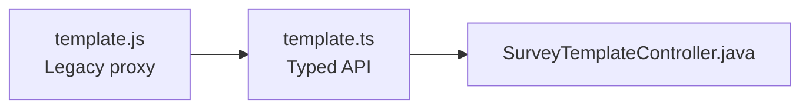

**Diagram sources**
- [template.ts:1-214](file://admin-web-soybean/src/service/api/template.ts#L1-L214)
- [template.js:1-3](file://admin-web-soybean/src/api/template.js#L1-L3)
- [SurveyTemplateController.java:1-194](file://admin-backend/src/main/java/com/qhiot/survey/controller/SurveyTemplateController.java#L1-L194)

**Section sources**
- [template.ts:1-214](file://admin-web-soybean/src/service/api/template.ts#L1-L214)
- [template.js:1-3](file://admin-web-soybean/src/api/template.js#L1-L3)

## Dependency Analysis
- Entities are mapped via MyBatis plus the base mapper for SurveyTemplate.
- Service depends on mappers for versions and bindings, and caches version queries.
- Controller delegates to service and enforces ADMIN role for sensitive operations.
- Dictionary system supports status enumeration and UI labels.

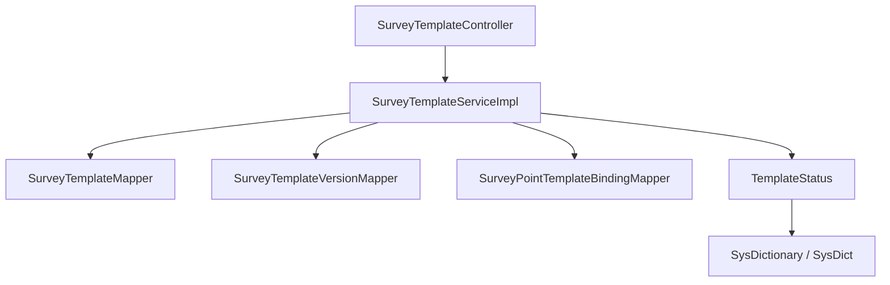

**Diagram sources**
- [SurveyTemplateController.java:1-194](file://admin-backend/src/main/java/com/qhiot/survey/controller/SurveyTemplateController.java#L1-L194)
- [SurveyTemplateServiceImpl.java:1-384](file://admin-backend/src/main/java/com/qhiot/survey/service/impl/SurveyTemplateServiceImpl.java#L1-L384)
- [SurveyTemplateMapper.java:1-10](file://admin-backend/src/main/java/com/qhiot/survey/mapper/SurveyTemplateMapper.java#L1-L10)
- [TemplateStatus.java:1-30](file://admin-backend/src/main/java/com/qhiot/survey/common/enums/TemplateStatus.java#L1-L30)
- [SysDictionary.java:1-46](file://admin-backend/src/main/java/com/qhiot/survey/entity/SysDictionary.java#L1-L46)
- [SysDict.java:1-60](file://admin-backend/src/main/java/com/qhiot/survey/entity/SysDict.java#L1-L60)

**Section sources**
- [SurveyTemplateController.java:1-194](file://admin-backend/src/main/java/com/qhiot/survey/controller/SurveyTemplateController.java#L1-L194)
- [SurveyTemplateServiceImpl.java:1-384](file://admin-backend/src/main/java/com/qhiot/survey/service/impl/SurveyTemplateServiceImpl.java#L1-L384)
- [SurveyTemplateMapper.java:1-10](file://admin-backend/src/main/java/com/qhiot/survey/mapper/SurveyTemplateMapper.java#L1-L10)
- [TemplateStatus.java:1-30](file://admin-backend/src/main/java/com/qhiot/survey/common/enums/TemplateStatus.java#L1-L30)
- [SysDictionary.java:1-46](file://admin-backend/src/main/java/com/qhiot/survey/entity/SysDictionary.java#L1-L46)
- [SysDict.java:1-60](file://admin-backend/src/main/java/com/qhiot/survey/entity/SysDict.java#L1-L60)

## Performance Considerations
- Version caching: Published and detailed version queries are cached to reduce repeated DB hits for frequent form rendering.
- Cache eviction: Operations that modify templates or versions trigger cache eviction to keep data consistent.
- Pagination: Listing templates supports pagination and filtering by keyword and status.

Recommendations:
- Monitor cache hit rates for template version retrieval.
- Consider indexing fields frequently queried (e.g., templateCode, outletType, status).
- Batch operations for bulk publishing or binding updates.

**Section sources**
- [SurveyTemplateServiceImpl.java:186-208](file://admin-backend/src/main/java/com/qhiot/survey/service/impl/SurveyTemplateServiceImpl.java#L186-L208)
- [SurveyTemplateServiceImpl.java:211-215](file://admin-backend/src/main/java/com/qhiot/survey/service/impl/SurveyTemplateServiceImpl.java#L211-L215)
- [SurveyTemplateController.java:38-46](file://admin-backend/src/main/java/com/qhiot/survey/controller/SurveyTemplateController.java#L38-L46)

## Troubleshooting Guide
Common issues and resolutions:
- Template creation fails due to duplicate templateCode: Ensure uniqueness before creation.
- Updating/deleting non-existent template: Throws business exception; verify templateId.
- Publishing without fields: Ensure fieldsJson is a valid array and rulesJson is an object.
- Preview returns empty arrays: Indicates no published version; publish a version first.
- Binding conflicts: Upserstion replaces existing bindings; verify projectId/sectionId/outfallType combination.

Operational logging:
- Controller logs request and exceptions for create, update, delete, publish, and draft save operations.

**Section sources**
- [SurveyTemplateServiceImpl.java:70-103](file://admin-backend/src/main/java/com/qhiot/survey/service/impl/SurveyTemplateServiceImpl.java#L70-L103)
- [SurveyTemplateServiceImpl.java:115-136](file://admin-backend/src/main/java/com/qhiot/survey/service/impl/SurveyTemplateServiceImpl.java#L115-L136)
- [SurveyTemplateServiceImpl.java:141-174](file://admin-backend/src/main/java/com/qhiot/survey/service/impl/SurveyTemplateServiceImpl.java#L141-L174)
- [SurveyTemplateServiceImpl.java:357-383](file://admin-backend/src/main/java/com/qhiot/survey/service/impl/SurveyTemplateServiceImpl.java#L357-L383)
- [SurveyTemplateController.java:60-81](file://admin-backend/src/main/java/com/qhiot/survey/controller/SurveyTemplateController.java#L60-L81)

## Conclusion
The template subsystem provides a robust, versioned, and dictionary-backed framework for managing survey forms. It supports iterative design via drafts, controlled publication, and automatic matching through outlet-type bindings. The JSON-based field configuration enables flexible form schemas while maintaining backward compatibility. Administrative controls and caching ensure secure and efficient operation.

## Appendices

### Appendix A: Example JSON Schemas and Field Definitions
- FieldSchema (selected fields):
  - id: string identifier
  - type: input | textarea | number | select | radio | checkbox | switch | date | image | location | divider
  - label: string
  - required: boolean
  - validation: optional min/max/regex length constraints
  - options: static options
  - optionSource: static or dictionary-backed options
  - imageConfig: cameraOnly, maxCount, maxSize
  - linkageRules: array of show/hide/clear/require actions with conditions
  - location-specific fields: mapZoom, autoFillLngFieldId, autoFillLatFieldId

- fieldsJson: Array of FieldSchema objects.
- rulesJson: Arbitrary object for validation/business rules.
- linkageRulesJson: Array of linkage rule definitions.

These definitions align with the frontend FieldSchema interface and backend versioned JSON fields.

**Section sources**
- [template.ts:42-62](file://admin-web-soybean/src/service/api/template.ts#L42-L62)
- [SurveyTemplateVersion.java:25-29](file://admin-backend/src/main/java/com/qhiot/survey/entity/SurveyTemplateVersion.java#L25-L29)
- [SurveyTemplate.java:38-41](file://admin-backend/src/main/java/com/qhiot/survey/entity/SurveyTemplate.java#L38-L41)