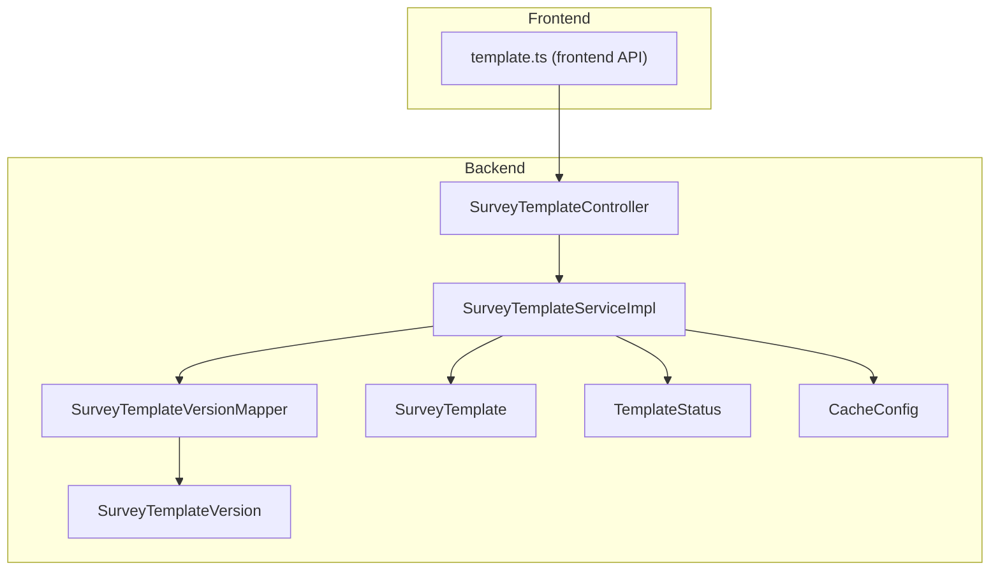
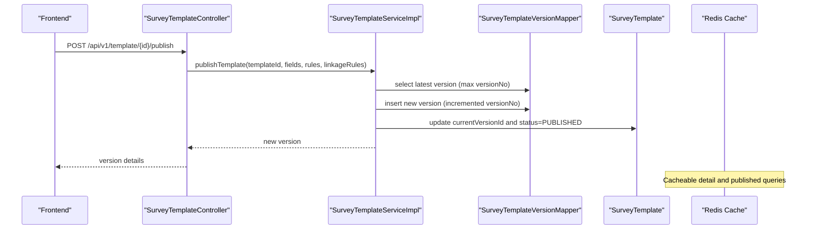
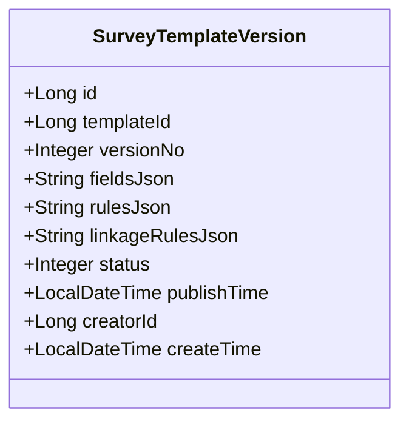
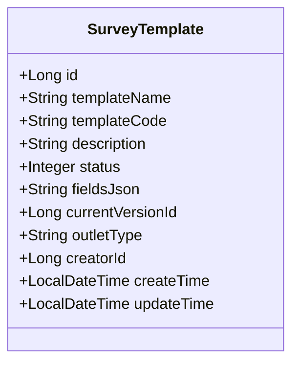
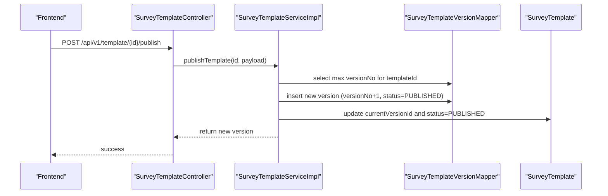
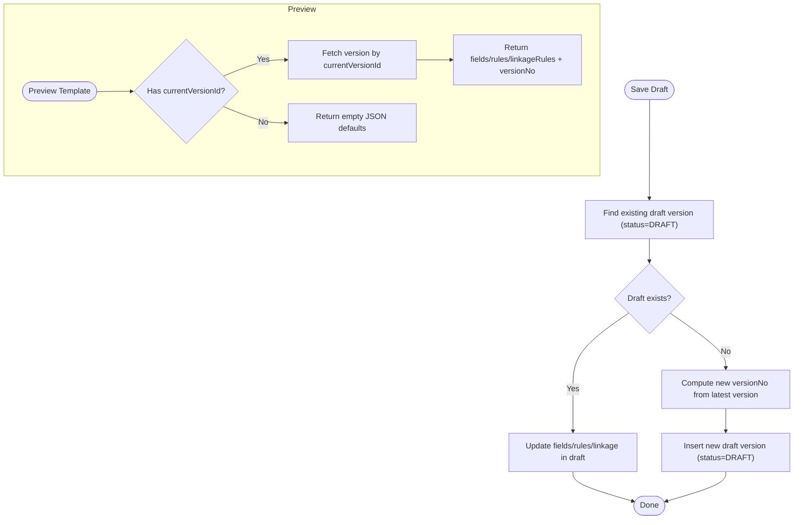
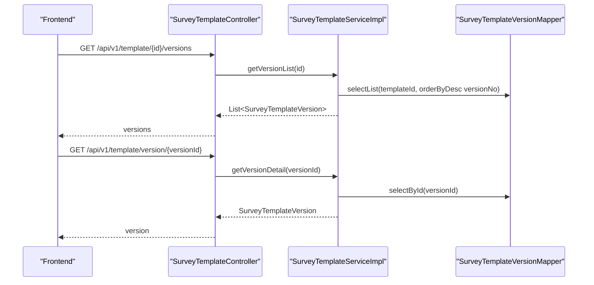
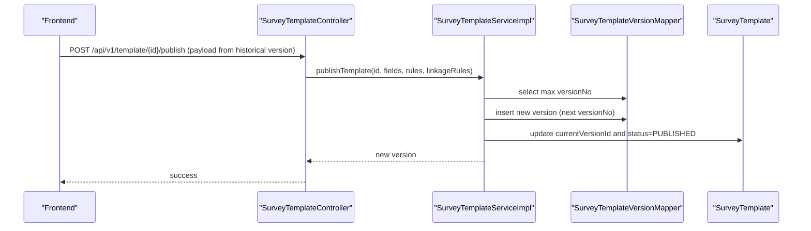
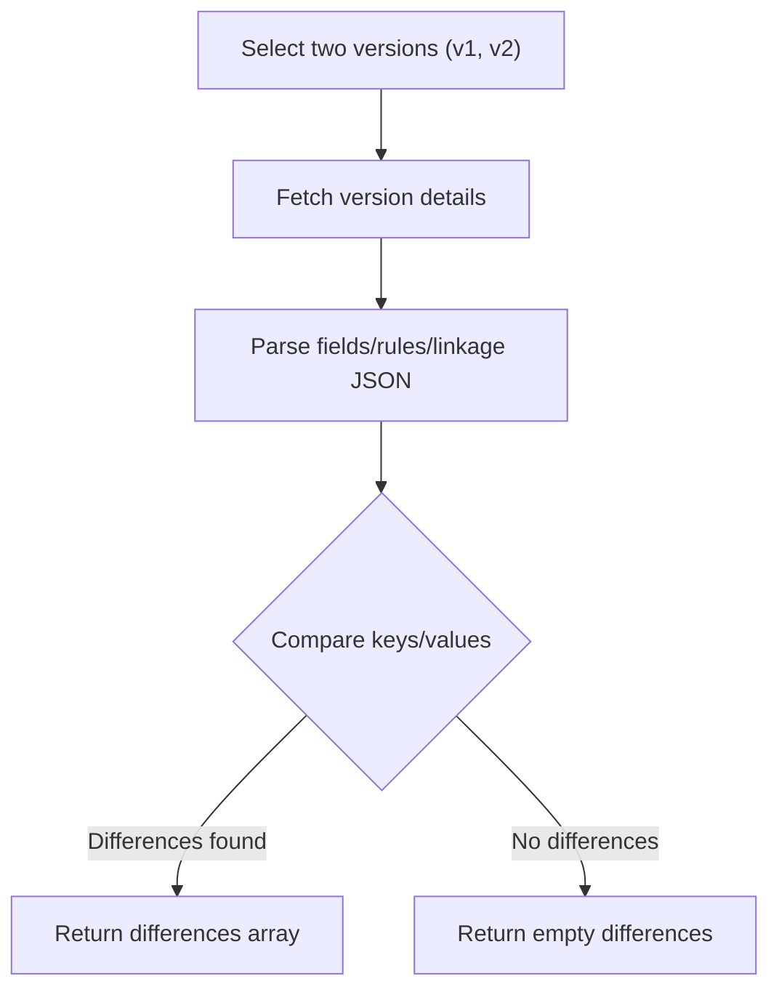
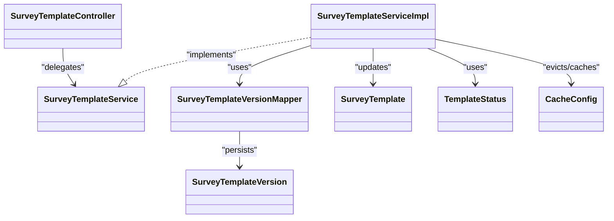

# Template Version Management

<cite>
**Referenced Files in This Document**
- [SurveyTemplate.java](file://admin-backend/src/main/java/com/qhiot/survey/entity/SurveyTemplate.java)
- [SurveyTemplateVersion.java](file://admin-backend/src/main/java/com/qhiot/survey/entity/SurveyTemplateVersion.java)
- [SurveyTemplateService.java](file://admin-backend/src/main/java/com/qhiot/survey/service/SurveyTemplateService.java)
- [SurveyTemplateServiceImpl.java](file://admin-backend/src/main/java/com/qhiot/survey/service/impl/SurveyTemplateServiceImpl.java)
- [SurveyTemplateController.java](file://admin-backend/src/main/java/com/qhiot/survey/controller/SurveyTemplateController.java)
- [SurveyTemplateVersionMapper.java](file://admin-backend/src/main/java/com/qhiot/survey/mapper/SurveyTemplateVersionMapper.java)
- [TemplateStatus.java](file://admin-backend/src/main/java/com/qhiot/survey/common/enums/TemplateStatus.java)
- [CacheConfig.java](file://admin-backend/src/main/java/com/qhiot/survey/config/CacheConfig.java)
- [template.ts](file://admin-web-soybean/src/service/api/template.ts)
</cite>

## Table of Contents
1. [Introduction](#introduction)
2. [Project Structure](#project-structure)
3. [Core Components](#core-components)
4. [Architecture Overview](#architecture-overview)
5. [Detailed Component Analysis](#detailed-component-analysis)
6. [Dependency Analysis](#dependency-analysis)
7. [Performance Considerations](#performance-considerations)
8. [Troubleshooting Guide](#troubleshooting-guide)
9. [Conclusion](#conclusion)

## Introduction
This document explains the template version management system used by the Survey-App. It focuses on the SurveyTemplateVersion entity, version control mechanisms, workflows for creating and publishing versions, rollback procedures, version comparison and change tracking, backward compatibility handling, and the relationship between currentVersionId in SurveyTemplate and version history. It also documents version validation, approval workflows, and integration with template publishing processes.

## Project Structure
The version management system spans backend entities, service layer, persistence layer, and controller APIs, plus frontend integration for publishing and previewing templates.

**Diagram sources**
- [SurveyTemplateController.java:110-131](file://admin-backend/src/main/java/com/qhiot/survey/controller/SurveyTemplateController.java#L110-L131)
- [SurveyTemplateServiceImpl.java:139-174](file://admin-backend/src/main/java/com/qhiot/survey/service/impl/SurveyTemplateServiceImpl.java#L139-L174)
- [SurveyTemplateVersionMapper.java:1-9](file://admin-backend/src/main/java/com/qhiot/survey/mapper/SurveyTemplateVersionMapper.java#L1-L9)
- [SurveyTemplateVersion.java:1-38](file://admin-backend/src/main/java/com/qhiot/survey/entity/SurveyTemplateVersion.java#L1-L38)
- [SurveyTemplate.java:1-61](file://admin-backend/src/main/java/com/qhiot/survey/entity/SurveyTemplate.java#L1-L61)
- [TemplateStatus.java:1-30](file://admin-backend/src/main/java/com/qhiot/survey/common/enums/TemplateStatus.java#L1-L30)
- [CacheConfig.java:35-92](file://admin-backend/src/main/java/com/qhiot/survey/config/CacheConfig.java#L35-L92)
- [template.ts:118-134](file://admin-web-soybean/src/service/api/template.ts#L118-L134)

**Section sources**
- [SurveyTemplateController.java:1-194](file://admin-backend/src/main/java/com/qhiot/survey/controller/SurveyTemplateController.java#L1-L194)
- [SurveyTemplateServiceImpl.java:1-384](file://admin-backend/src/main/java/com/qhiot/survey/service/impl/SurveyTemplateServiceImpl.java#L1-L384)
- [SurveyTemplateVersion.java:1-38](file://admin-backend/src/main/java/com/qhiot/survey/entity/SurveyTemplateVersion.java#L1-L38)
- [SurveyTemplate.java:1-61](file://admin-backend/src/main/java/com/qhiot/survey/entity/SurveyTemplate.java#L1-L61)
- [SurveyTemplateVersionMapper.java:1-9](file://admin-backend/src/main/java/com/qhiot/survey/mapper/SurveyTemplateVersionMapper.java#L1-L9)
- [TemplateStatus.java:1-30](file://admin-backend/src/main/java/com/qhiot/survey/common/enums/TemplateStatus.java#L1-L30)
- [CacheConfig.java:1-94](file://admin-backend/src/main/java/com/qhiot/survey/config/CacheConfig.java#L1-L94)
- [template.ts:1-214](file://admin-web-soybean/src/service/api/template.ts#L1-L214)

## Core Components
- SurveyTemplateVersion: Stores versioned field definitions, validation rules, and linkage rules for a template. Includes metadata such as version number, status, publish time, and creator.
- SurveyTemplate: Contains template metadata and a pointer to the current published version via currentVersionId.
- SurveyTemplateService and SurveyTemplateServiceImpl: Implement version lifecycle operations (create, publish, list, get details, preview, draft save).
- SurveyTemplateController: Exposes REST endpoints for version management and publishing.
- CacheConfig: Configures Redis caching for template version details with appropriate TTL and eviction policies.
- TemplateStatus: Enumerates draft, published, and disabled states.

**Section sources**
- [SurveyTemplateVersion.java:1-38](file://admin-backend/src/main/java/com/qhiot/survey/entity/SurveyTemplateVersion.java#L1-L38)
- [SurveyTemplate.java:1-61](file://admin-backend/src/main/java/com/qhiot/survey/entity/SurveyTemplate.java#L1-L61)
- [SurveyTemplateService.java:1-58](file://admin-backend/src/main/java/com/qhiot/survey/service/SurveyTemplateService.java#L1-L58)
- [SurveyTemplateServiceImpl.java:139-174](file://admin-backend/src/main/java/com/qhiot/survey/service/impl/SurveyTemplateServiceImpl.java#L139-L174)
- [SurveyTemplateController.java:109-131](file://admin-backend/src/main/java/com/qhiot/survey/controller/SurveyTemplateController.java#L109-L131)
- [CacheConfig.java:23-92](file://admin-backend/src/main/java/com/qhiot/survey/config/CacheConfig.java#L23-L92)
- [TemplateStatus.java:1-30](file://admin-backend/src/main/java/com/qhiot/survey/common/enums/TemplateStatus.java#L1-L30)

## Architecture Overview
The system follows a layered architecture:
- Frontend invokes publish and preview endpoints.
- Controller validates inputs and delegates to the service.
- Service orchestrates persistence and cache operations, ensuring atomic updates to both version records and template currentVersionId.
- Mapper persists version records; Redis caches frequently accessed version details.

**Diagram sources**
- [SurveyTemplateController.java:110-131](file://admin-backend/src/main/java/com/qhiot/survey/controller/SurveyTemplateController.java#L110-L131)
- [SurveyTemplateServiceImpl.java:139-174](file://admin-backend/src/main/java/com/qhiot/survey/service/impl/SurveyTemplateServiceImpl.java#L139-L174)
- [SurveyTemplateVersionMapper.java:1-9](file://admin-backend/src/main/java/com/qhiot/survey/mapper/SurveyTemplateVersionMapper.java#L1-L9)
- [CacheConfig.java:19-92](file://admin-backend/src/main/java/com/qhiot/survey/config/CacheConfig.java#L19-L92)

## Detailed Component Analysis

### SurveyTemplateVersion Entity
- Purpose: Encapsulates a single version of a template’s structure and behavior.
- Fields:
  - templateId: Links to the parent template.
  - versionNo: Monotonically increasing integer version identifier.
  - fieldsJson, rulesJson, linkageRulesJson: JSON blobs storing field schema, validation rules, and conditional linkage rules.
  - status: Lifecycle state (draft/published/disabled).
  - publishTime: Timestamp when the version was published.
  - creatorId, createTime: Metadata for auditing.

**Diagram sources**
- [SurveyTemplateVersion.java:1-38](file://admin-backend/src/main/java/com/qhiot/survey/entity/SurveyTemplateVersion.java#L1-L38)

**Section sources**
- [SurveyTemplateVersion.java:1-38](file://admin-backend/src/main/java/com/qhiot/survey/entity/SurveyTemplateVersion.java#L1-L38)

### SurveyTemplate Entity and currentVersionId
- Purpose: Holds template metadata and points to the currently published version.
- Key fields:
  - currentVersionId: References the active SurveyTemplateVersion.id.
  - status: Reflects overall template state (draft/published/disabled).
  - fieldsJson: Deprecated compatibility field for older clients.

**Diagram sources**
- [SurveyTemplate.java:1-61](file://admin-backend/src/main/java/com/qhiot/survey/entity/SurveyTemplate.java#L1-L61)

**Section sources**
- [SurveyTemplate.java:1-61](file://admin-backend/src/main/java/com/qhiot/survey/entity/SurveyTemplate.java#L1-L61)

### Version Creation and Publishing Workflow
- Initial creation:
  - Creates a template with status=DRAFT.
  - Inserts an initial version with versionNo=1 and status=DRAFT.
- Publishing:
  - Determines the next versionNo by finding the maximum existing versionNo and incrementing.
  - Inserts a new version with status=PUBLISHED and sets publishTime.
  - Updates the template’s currentVersionId and status to PUBLISHED atomically.

**Diagram sources**
- [SurveyTemplateController.java:110-131](file://admin-backend/src/main/java/com/qhiot/survey/controller/SurveyTemplateController.java#L110-L131)
- [SurveyTemplateServiceImpl.java:139-174](file://admin-backend/src/main/java/com/qhiot/survey/service/impl/SurveyTemplateServiceImpl.java#L139-L174)

**Section sources**
- [SurveyTemplateServiceImpl.java:70-103](file://admin-backend/src/main/java/com/qhiot/survey/service/impl/SurveyTemplateServiceImpl.java#L70-L103)
- [SurveyTemplateServiceImpl.java:139-174](file://admin-backend/src/main/java/com/qhiot/survey/service/impl/SurveyTemplateServiceImpl.java#L139-L174)

### Draft Saving and Preview
- Draft saving:
  - Persists intermediate designer state into a draft version (status=DRAFT).
  - If none exists, creates one with versionNo derived from the latest version.
- Preview:
  - Returns the fields, rules, and linkageRules of the current published version if present; otherwise returns empty defaults.

**Diagram sources**
- [SurveyTemplateServiceImpl.java:300-355](file://admin-backend/src/main/java/com/qhiot/survey/service/impl/SurveyTemplateServiceImpl.java#L300-L355)
- [SurveyTemplateServiceImpl.java:357-383](file://admin-backend/src/main/java/com/qhiot/survey/service/impl/SurveyTemplateServiceImpl.java#L357-L383)

**Section sources**
- [SurveyTemplateServiceImpl.java:300-355](file://admin-backend/src/main/java/com/qhiot/survey/service/impl/SurveyTemplateServiceImpl.java#L300-L355)
- [SurveyTemplateServiceImpl.java:357-383](file://admin-backend/src/main/java/com/qhiot/survey/service/impl/SurveyTemplateServiceImpl.java#L357-L383)

### Version History Management and Retrieval
- Version list:
  - Retrieves all versions for a template ordered by versionNo descending.
- Version detail:
  - Retrieves a specific version by id with caching enabled.
- Published version:
  - Returns the current published version for a template if it exists and is published.

**Diagram sources**
- [SurveyTemplateController.java:139-149](file://admin-backend/src/main/java/com/qhiot/survey/controller/SurveyTemplateController.java#L139-L149)
- [SurveyTemplateServiceImpl.java:176-193](file://admin-backend/src/main/java/com/qhiot/survey/service/impl/SurveyTemplateServiceImpl.java#L176-L193)
- [SurveyTemplateVersionMapper.java:1-9](file://admin-backend/src/main/java/com/qhiot/survey/mapper/SurveyTemplateVersionMapper.java#L1-L9)

**Section sources**
- [SurveyTemplateServiceImpl.java:176-193](file://admin-backend/src/main/java/com/qhiot/survey/service/impl/SurveyTemplateServiceImpl.java#L176-L193)

### Rollback Procedures
Rollback is supported conceptually by retrieving historical versions and re-publishing a prior version:
- Retrieve the desired historical version by versionNo or id.
- Publish the selected version again (creating a new versionNo) to mark it as the current published version.
- The previous currentVersionId is superseded by the newly published version.

**Diagram sources**
- [SurveyTemplateController.java:110-131](file://admin-backend/src/main/java/com/qhiot/survey/controller/SurveyTemplateController.java#L110-L131)
- [SurveyTemplateServiceImpl.java:139-174](file://admin-backend/src/main/java/com/qhiot/survey/service/impl/SurveyTemplateServiceImpl.java#L139-L174)

**Section sources**
- [SurveyTemplateServiceImpl.java:139-174](file://admin-backend/src/main/java/com/qhiot/survey/service/impl/SurveyTemplateServiceImpl.java#L139-L174)

### Version Comparison and Change Tracking
- Current capability:
  - The backend stores versioned JSON fields but does not expose a built-in diff endpoint.
  - The frontend defines a version difference model type for potential UI diffing.
- Recommended approach:
  - Implement a server-side diff endpoint that accepts two version ids and returns differences in fields, rules, and linkage rules.
  - Alternatively, the frontend can compute diffs client-side using the returned JSON payloads.

**Diagram sources**
- [template.ts:419-427](file://admin-web-soybean/src/service/api/template.ts#L419-L427)

**Section sources**
- [template.ts:419-427](file://admin-web-soybean/src/service/api/template.ts#L419-L427)

### Backward Compatibility Handling
- Compatibility fields:
  - SurveyTemplate.fieldsJson remains for older clients.
  - SurveyTemplateVersion fieldsJson, rulesJson, linkageRulesJson encapsulate modern schema and behavior.
- Recommendations:
  - Maintain stable JSON schemas for fields and rules.
  - Introduce optional fields and deprecate old ones gradually.
  - Keep currentVersionId aligned with the most recent published version to ensure clients render the correct schema.

**Section sources**
- [SurveyTemplate.java:39-46](file://admin-backend/src/main/java/com/qhiot/survey/entity/SurveyTemplate.java#L39-L46)
- [SurveyTemplateVersion.java:25-29](file://admin-backend/src/main/java/com/qhiot/survey/entity/SurveyTemplateVersion.java#L25-L29)

### Version Validation and Approval Workflows
- Validation:
  - Template creation checks uniqueness of templateCode.
  - Publishing inserts a new version with explicit status and timestamps.
- Approval:
  - No dedicated approval workflow is implemented in the referenced code.
  - To add approval, introduce an APPROVAL_PENDING status and an approval controller endpoint that transitions status to PUBLISHED upon approval.

**Section sources**
- [SurveyTemplateServiceImpl.java:72-87](file://admin-backend/src/main/java/com/qhiot/survey/service/impl/SurveyTemplateServiceImpl.java#L72-L87)
- [SurveyTemplateServiceImpl.java:139-174](file://admin-backend/src/main/java/com/qhiot/survey/service/impl/SurveyTemplateServiceImpl.java#L139-L174)

### Integration with Template Publishing Processes
- Frontend integration:
  - Publish endpoint posts fields, rules, and linkageRules JSON to the backend.
  - Preview endpoint retrieves the current published version for rendering forms.
- Backend integration:
  - Controller serializes request bodies to JSON strings before delegating to the service.
  - Service persists JSON and updates template metadata atomically.

**Section sources**
- [SurveyTemplateController.java:109-131](file://admin-backend/src/main/java/com/qhiot/survey/controller/SurveyTemplateController.java#L109-L131)
- [template.ts:118-134](file://admin-web-soybean/src/service/api/template.ts#L118-L134)

## Dependency Analysis

**Diagram sources**
- [SurveyTemplateController.java:1-194](file://admin-backend/src/main/java/com/qhiot/survey/controller/SurveyTemplateController.java#L1-L194)
- [SurveyTemplateService.java:1-58](file://admin-backend/src/main/java/com/qhiot/survey/service/SurveyTemplateService.java#L1-L58)
- [SurveyTemplateServiceImpl.java:1-384](file://admin-backend/src/main/java/com/qhiot/survey/service/impl/SurveyTemplateServiceImpl.java#L1-L384)
- [SurveyTemplateVersionMapper.java:1-9](file://admin-backend/src/main/java/com/qhiot/survey/mapper/SurveyTemplateVersionMapper.java#L1-L9)
- [SurveyTemplateVersion.java:1-38](file://admin-backend/src/main/java/com/qhiot/survey/entity/SurveyTemplateVersion.java#L1-L38)
- [SurveyTemplate.java:1-61](file://admin-backend/src/main/java/com/qhiot/survey/entity/SurveyTemplate.java#L1-L61)
- [TemplateStatus.java:1-30](file://admin-backend/src/main/java/com/qhiot/survey/common/enums/TemplateStatus.java#L1-L30)
- [CacheConfig.java:1-94](file://admin-backend/src/main/java/com/qhiot/survey/config/CacheConfig.java#L1-L94)

**Section sources**
- [SurveyTemplateServiceImpl.java:1-384](file://admin-backend/src/main/java/com/qhiot/survey/service/impl/SurveyTemplateServiceImpl.java#L1-L384)

## Performance Considerations
- Caching:
  - Template version details are cached with a 30-minute TTL under the templateVersion cache namespace.
  - Published version retrieval is cached separately to optimize frequent reads.
- Eviction:
  - Cache entries are evicted on template edits and publishes to prevent stale data.
- Recommendations:
  - Monitor cache hit rates and adjust TTLs based on read patterns.
  - Consider sharding cache keys by templateId for better scalability.

**Section sources**
- [CacheConfig.java:23-92](file://admin-backend/src/main/java/com/qhiot/survey/config/CacheConfig.java#L23-L92)
- [SurveyTemplateServiceImpl.java:186-193](file://admin-backend/src/main/java/com/qhiot/survey/service/impl/SurveyTemplateServiceImpl.java#L186-L193)
- [SurveyTemplateServiceImpl.java:196-208](file://admin-backend/src/main/java/com/qhiot/survey/service/impl/SurveyTemplateServiceImpl.java#L196-L208)
- [SurveyTemplateServiceImpl.java:116-117](file://admin-backend/src/main/java/com/qhiot/survey/service/impl/SurveyTemplateServiceImpl.java#L116-L117)
- [SurveyTemplateServiceImpl.java:211-215](file://admin-backend/src/main/java/com/qhiot/survey/service/impl/SurveyTemplateServiceImpl.java#L211-L215)

## Troubleshooting Guide
- Publishing fails with “template does not exist”:
  - Verify the templateId is correct and the template exists.
- Version not found:
  - Ensure the versionId exists; otherwise, fetch the latest version list.
- Cache-related issues:
  - Clear cache entries for the affected templateId or rely on automatic eviction on edits/publishes.
- Preview returns empty:
  - Confirm the template has a published version; otherwise, preview returns defaults.

**Section sources**
- [SurveyTemplateServiceImpl.java:142-145](file://admin-backend/src/main/java/com/qhiot/survey/service/impl/SurveyTemplateServiceImpl.java#L142-L145)
- [SurveyTemplateServiceImpl.java:187-192](file://admin-backend/src/main/java/com/qhiot/survey/service/impl/SurveyTemplateServiceImpl.java#L187-L192)
- [SurveyTemplateServiceImpl.java:368-375](file://admin-backend/src/main/java/com/qhiot/survey/service/impl/SurveyTemplateServiceImpl.java#L368-L375)

## Conclusion
The template version management system provides robust versioning for survey templates, enabling incremental schema evolution, controlled publishing, and efficient retrieval of published versions. While the current implementation supports draft saving, publishing, and previewing, extending it with explicit approval workflows, version diffing, and rollback via re-publishing would further strengthen governance and operational safety.