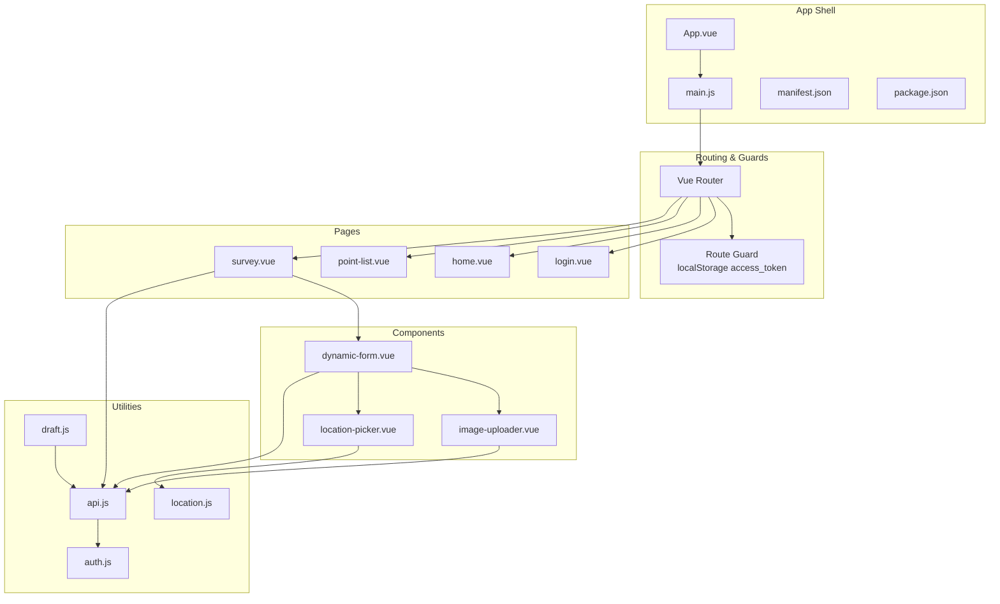
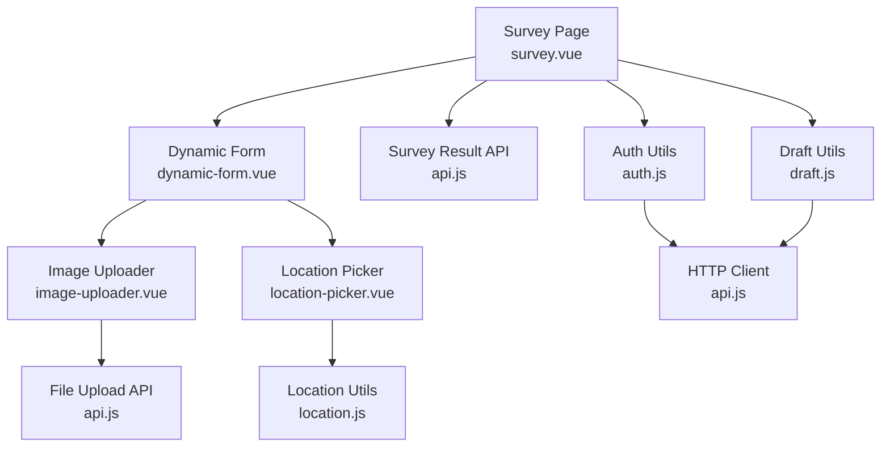
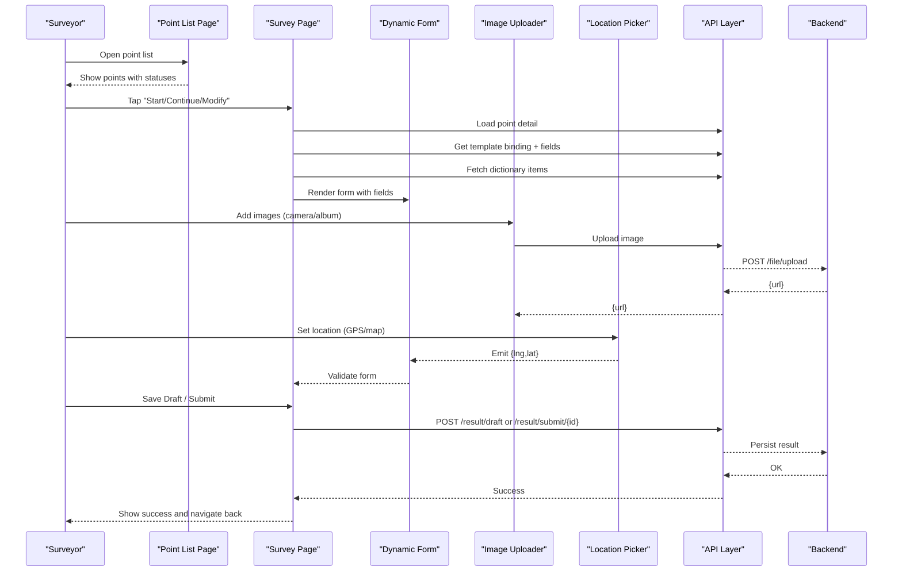
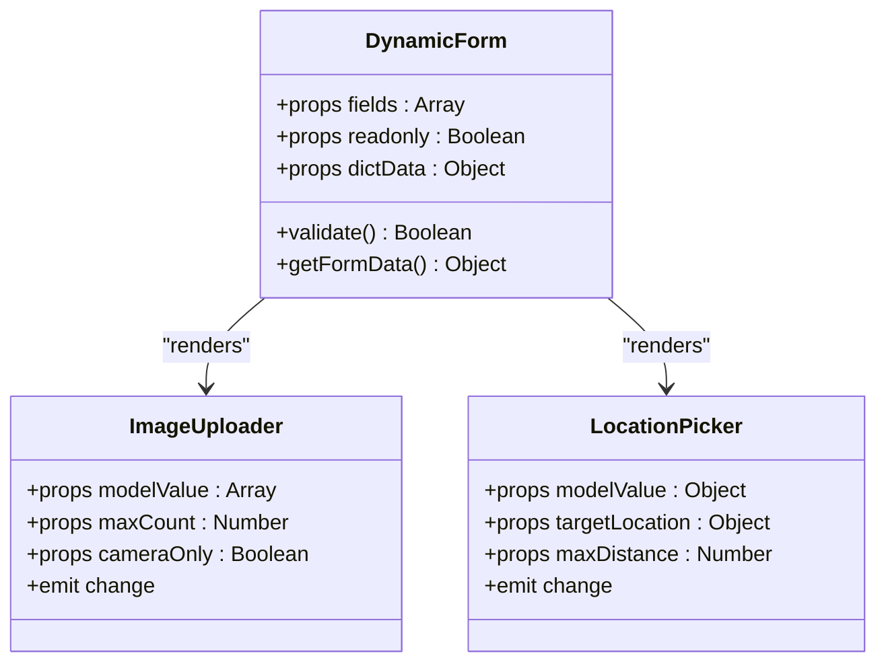
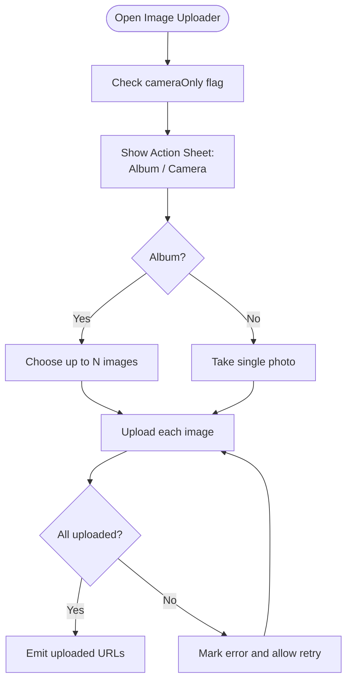
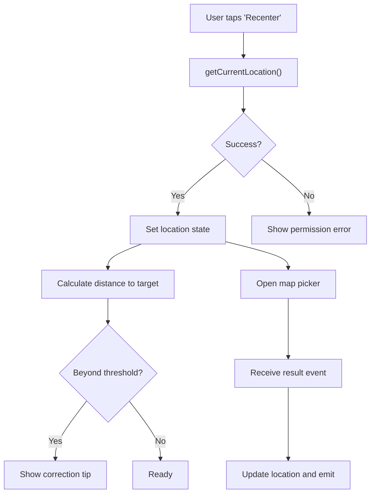
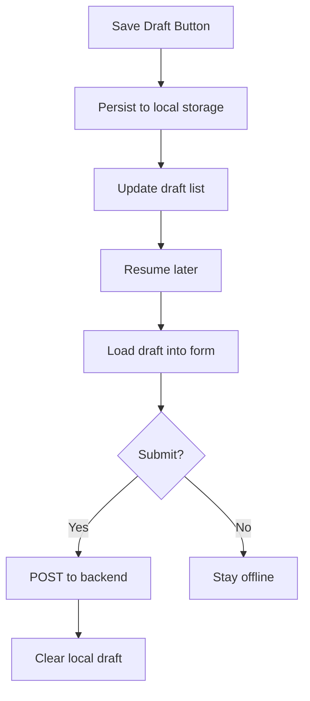
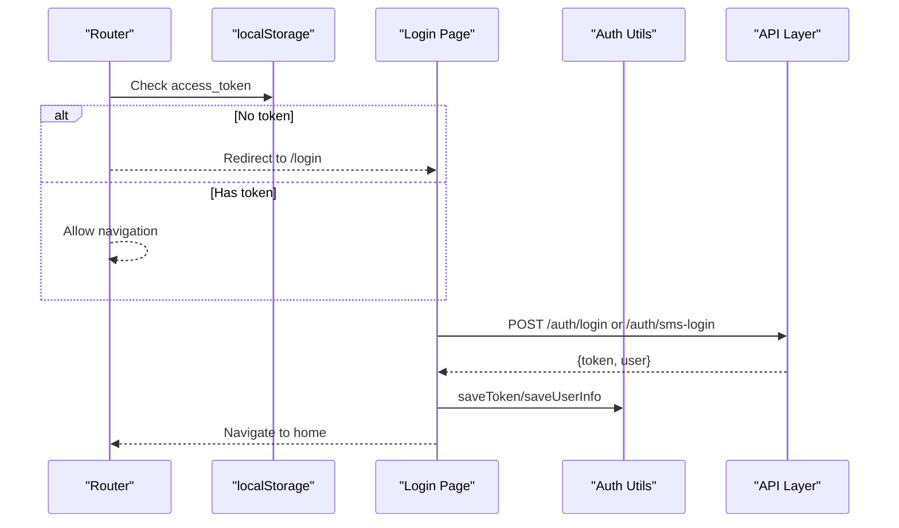
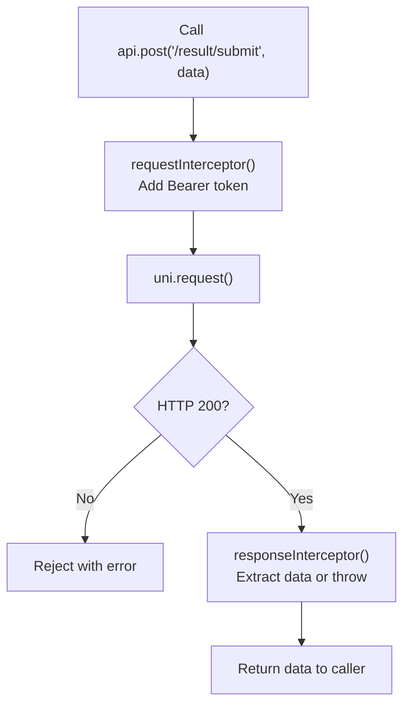
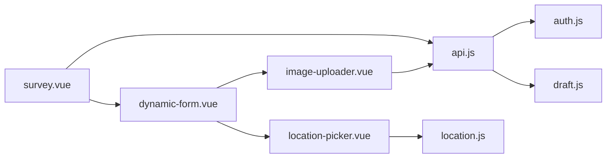

# Mobile Data Collection

<cite>
**Referenced Files in This Document**
- [mobile-app/src/App.vue](file://mobile-app/src/App.vue)
- [mobile-app/src/main.js](file://mobile-app/src/main.js)
- [mobile-app/src/manifest.json](file://mobile-app/src/manifest.json)
- [mobile-app/package.json](file://mobile-app/package.json)
- [mobile-app/src/pages/survey/survey.vue](file://mobile-app/src/pages/survey/survey.vue)
- [mobile-app/src/components/dynamic-form/dynamic-form.vue](file://mobile-app/src/components/dynamic-form/dynamic-form.vue)
- [mobile-app/src/components/image-uploader/image-uploader.vue](file://mobile-app/src/components/image-uploader/image-uploader.vue)
- [mobile-app/src/components/location-picker/location-picker.vue](file://mobile-app/src/components/location-picker/location-picker.vue)
- [mobile-app/src/utils/api.js](file://mobile-app/src/utils/api.js)
- [mobile-app/src/utils/auth.js](file://mobile-app/src/utils/auth.js)
- [mobile-app/src/utils/draft.js](file://mobile-app/src/utils/draft.js)
- [mobile-app/src/utils/location.js](file://mobile-app/src/utils/location.js)
- [mobile-app/src/pages/login/login.vue](file://mobile-app/src/pages/login/login.vue)
- [mobile-app/src/pages/point-list/point-list.vue](file://mobile-app/src/pages/point-list/point-list.vue)
- [mobile-app/src/pages/home/home.vue](file://mobile-app/src/pages/home/home.vue)
</cite>

## Table of Contents
1. [Introduction](#introduction)
2. [Project Structure](#project-structure)
3. [Core Components](#core-components)
4. [Architecture Overview](#architecture-overview)
5. [Detailed Component Analysis](#detailed-component-analysis)
6. [Dependency Analysis](#dependency-analysis)
7. [Performance Considerations](#performance-considerations)
8. [Troubleshooting Guide](#troubleshooting-guide)
9. [Conclusion](#conclusion)
10. [Appendices](#appendices)

## Introduction
This document describes the mobile data collection interface built with uni-app for field surveyors. It covers form rendering, GPS location capture, image collection, offline data storage, and the end-to-end workflow from point assignment to data submission. It also documents integration with the backend API, authentication mechanisms, and offline-first strategies. UI patterns, accessibility considerations, and mobile-specific optimizations are included to guide both developers and product teams.

## Project Structure
The mobile application is organized around pages, components, utilities, and a central router. Pages represent major screens (login, home, point lists, surveys). Components encapsulate reusable UI elements (dynamic forms, image uploader, location picker). Utilities provide API requests, authentication, drafts, and location services. The router guards enforce authentication across protected pages.

**Diagram sources**
- [mobile-app/src/App.vue:1-44](file://mobile-app/src/App.vue#L1-L44)
- [mobile-app/src/main.js:1-49](file://mobile-app/src/main.js#L1-L49)
- [mobile-app/src/manifest.json:1-38](file://mobile-app/src/manifest.json#L1-L38)
- [mobile-app/package.json:1-22](file://mobile-app/package.json#L1-L22)
- [mobile-app/src/pages/survey/survey.vue:1-159](file://mobile-app/src/pages/survey/survey.vue#L1-L159)
- [mobile-app/src/components/dynamic-form/dynamic-form.vue:1-336](file://mobile-app/src/components/dynamic-form/dynamic-form.vue#L1-L336)
- [mobile-app/src/components/image-uploader/image-uploader.vue:1-319](file://mobile-app/src/components/image-uploader/image-uploader.vue#L1-L319)
- [mobile-app/src/components/location-picker/location-picker.vue:1-314](file://mobile-app/src/components/location-picker/location-picker.vue#L1-L314)
- [mobile-app/src/utils/api.js:1-370](file://mobile-app/src/utils/api.js#L1-L370)
- [mobile-app/src/utils/auth.js:1-186](file://mobile-app/src/utils/auth.js#L1-L186)
- [mobile-app/src/utils/draft.js:1-206](file://mobile-app/src/utils/draft.js#L1-L206)
- [mobile-app/src/utils/location.js:1-357](file://mobile-app/src/utils/location.js#L1-L357)

**Section sources**
- [mobile-app/src/main.js:16-31](file://mobile-app/src/main.js#L16-L31)
- [mobile-app/src/App.vue:1-44](file://mobile-app/src/App.vue#L1-L44)
- [mobile-app/src/manifest.json:1-38](file://mobile-app/src/manifest.json#L1-L38)
- [mobile-app/package.json:1-22](file://mobile-app/package.json#L1-L22)

## Core Components
- Dynamic Form Renderer: Renders survey templates with validation, linkage rules, and support for input, number, textarea, select, radio, checkbox, switch, date, image, and location fields.
- Image Uploader: Captures photos via camera or album, compresses, uploads, previews, and handles retries.
- Location Picker: Integrates GPS and map selection, displays accuracy and distance to target, supports manual correction.
- Authentication: Stores tokens and user info, enforces route guards, and exposes role checks.
- Offline Drafts: Persists form data locally with expiry and cleanup.
- API Layer: Centralized request/response handling with interceptors, unified response parsing, and typed endpoints.

**Section sources**
- [mobile-app/src/components/dynamic-form/dynamic-form.vue:1-336](file://mobile-app/src/components/dynamic-form/dynamic-form.vue#L1-L336)
- [mobile-app/src/components/image-uploader/image-uploader.vue:1-319](file://mobile-app/src/components/image-uploader/image-uploader.vue#L1-L319)
- [mobile-app/src/components/location-picker/location-picker.vue:1-314](file://mobile-app/src/components/location-picker/location-picker.vue#L1-L314)
- [mobile-app/src/utils/auth.js:1-186](file://mobile-app/src/utils/auth.js#L1-L186)
- [mobile-app/src/utils/draft.js:1-206](file://mobile-app/src/utils/draft.js#L1-L206)
- [mobile-app/src/utils/api.js:1-370](file://mobile-app/src/utils/api.js#L1-L370)

## Architecture Overview
The mobile app follows a layered architecture:
- Presentation Layer: Pages and Components
- Domain Layer: Survey workflow (templates, results, audits)
- Services Layer: API utilities, auth, drafts, location
- Persistence Layer: Local storage for drafts and tokens

**Diagram sources**
- [mobile-app/src/pages/survey/survey.vue:1-159](file://mobile-app/src/pages/survey/survey.vue#L1-L159)
- [mobile-app/src/components/dynamic-form/dynamic-form.vue:1-336](file://mobile-app/src/components/dynamic-form/dynamic-form.vue#L1-L336)
- [mobile-app/src/components/image-uploader/image-uploader.vue:1-319](file://mobile-app/src/components/image-uploader/image-uploader.vue#L1-L319)
- [mobile-app/src/components/location-picker/location-picker.vue:1-314](file://mobile-app/src/components/location-picker/location-picker.vue#L1-L314)
- [mobile-app/src/utils/api.js:1-370](file://mobile-app/src/utils/api.js#L1-L370)
- [mobile-app/src/utils/auth.js:1-186](file://mobile-app/src/utils/auth.js#L1-L186)
- [mobile-app/src/utils/draft.js:1-206](file://mobile-app/src/utils/draft.js#L1-L206)
- [mobile-app/src/utils/location.js:1-357](file://mobile-app/src/utils/location.js#L1-L357)

## Detailed Component Analysis

### Survey Workflow: From Assignment to Submission
End-to-end flow:
- Point Assignment: Surveyors view assigned points in the point list and navigate to the survey page.
- Template Loading: The survey page loads the point’s template binding and fields, and fetches dictionary data for selects.
- Form Rendering: The dynamic form renders fields and applies linkage rules and validations.
- Data Capture: Surveyors fill in text/numbers, pick dates, select options, capture images, and set locations.
- Validation: The form validates required fields and formats before submission.
- Drafting: Drafts are saved locally and synced to backend when online.
- Submission: On confirmation, the form data is posted to the backend and draft cleared.

**Diagram sources**
- [mobile-app/src/pages/point-list/point-list.vue:181-205](file://mobile-app/src/pages/point-list/point-list.vue#L181-L205)
- [mobile-app/src/pages/survey/survey.vue:65-141](file://mobile-app/src/pages/survey/survey.vue#L65-L141)
- [mobile-app/src/components/dynamic-form/dynamic-form.vue:262-306](file://mobile-app/src/components/dynamic-form/dynamic-form.vue#L262-L306)
- [mobile-app/src/components/image-uploader/image-uploader.vue:162-190](file://mobile-app/src/components/image-uploader/image-uploader.vue#L162-L190)
- [mobile-app/src/components/location-picker/location-picker.vue:134-176](file://mobile-app/src/components/location-picker/location-picker.vue#L134-L176)
- [mobile-app/src/utils/api.js:264-286](file://mobile-app/src/utils/api.js#L264-L286)

**Section sources**
- [mobile-app/src/pages/point-list/point-list.vue:181-205](file://mobile-app/src/pages/point-list/point-list.vue#L181-L205)
- [mobile-app/src/pages/survey/survey.vue:65-141](file://mobile-app/src/pages/survey/survey.vue#L65-L141)

### Dynamic Form Component
Key capabilities:
- Field types: input, number, textarea, select, radio (with sub-fields), checkbox, switch, date, image, location.
- Validation: Required, numeric bounds, pattern, length.
- Linkage rules: Show/hide/clear fields based on other selections.
- Auto-fill: Location picker can auto-fill linked lat/lng fields.
- Dictionary-driven selects: Loads options from backend dictionaries.

**Diagram sources**
- [mobile-app/src/components/dynamic-form/dynamic-form.vue:146-306](file://mobile-app/src/components/dynamic-form/dynamic-form.vue#L146-L306)
- [mobile-app/src/components/image-uploader/image-uploader.vue:50-82](file://mobile-app/src/components/image-uploader/image-uploader.vue#L50-L82)
- [mobile-app/src/components/location-picker/location-picker.vue:65-93](file://mobile-app/src/components/location-picker/location-picker.vue#L65-L93)

**Section sources**
- [mobile-app/src/components/dynamic-form/dynamic-form.vue:180-200](file://mobile-app/src/components/dynamic-form/dynamic-form.vue#L180-L200)
- [mobile-app/src/components/dynamic-form/dynamic-form.vue:262-306](file://mobile-app/src/components/dynamic-form/dynamic-form.vue#L262-L306)

### Image Collection
Capabilities:
- Choose from album or camera.
- Compress and upload immediately.
- Preview and delete.
- Retry failed uploads.
- Enforce max count and optional camera-only mode.

**Diagram sources**
- [mobile-app/src/components/image-uploader/image-uploader.vue:97-160](file://mobile-app/src/components/image-uploader/image-uploader.vue#L97-L160)
- [mobile-app/src/components/image-uploader/image-uploader.vue:162-190](file://mobile-app/src/components/image-uploader/image-uploader.vue#L162-L190)

**Section sources**
- [mobile-app/src/components/image-uploader/image-uploader.vue:117-160](file://mobile-app/src/components/image-uploader/image-uploader.vue#L117-L160)
- [mobile-app/src/components/image-uploader/image-uploader.vue:162-190](file://mobile-app/src/components/image-uploader/image-uploader.vue#L162-L190)

### GPS and Location Services
Capabilities:
- Get current GPS coordinates with accuracy.
- Reverse geocoding to address/province/city/district.
- Open map picker for manual selection.
- Calculate distance to target and status messaging.
- Optional纠偏 logging and status badges.

**Diagram sources**
- [mobile-app/src/components/location-picker/location-picker.vue:134-176](file://mobile-app/src/components/location-picker/location-picker.vue#L134-L176)
- [mobile-app/src/utils/location.js:144-164](file://mobile-app/src/utils/location.js#L144-L164)
- [mobile-app/src/utils/location.js:206-221](file://mobile-app/src/utils/location.js#L206-L221)

**Section sources**
- [mobile-app/src/components/location-picker/location-picker.vue:116-132](file://mobile-app/src/components/location-picker/location-picker.vue#L116-L132)
- [mobile-app/src/utils/location.js:144-164](file://mobile-app/src/utils/location.js#L144-L164)

### Offline Data Storage and Recovery
- Drafts are stored per-point with timestamps and versioning.
- Draft list tracks unsynced entries.
- Expiry policy clears old drafts after configurable days.
- On resume, draft is loaded into the form; submit clears local draft and syncs to backend.

**Diagram sources**
- [mobile-app/src/pages/survey/survey.vue:115-122](file://mobile-app/src/pages/survey/survey.vue#L115-L122)
- [mobile-app/src/utils/draft.js:14-34](file://mobile-app/src/utils/draft.js#L14-L34)
- [mobile-app/src/utils/draft.js:84-125](file://mobile-app/src/utils/draft.js#L84-L125)

**Section sources**
- [mobile-app/src/utils/draft.js:14-34](file://mobile-app/src/utils/draft.js#L14-L34)
- [mobile-app/src/utils/draft.js:179-187](file://mobile-app/src/utils/draft.js#L179-L187)

### Authentication and Authorization
- Route guard checks for access token in storage and redirects unauthenticated users to login.
- Login supports password and SMS code flows; stores token and user info.
- Role checks enable collector/auditor visibility and actions.
- Logout clears tokens and navigates to login.

**Diagram sources**
- [mobile-app/src/main.js:33-43](file://mobile-app/src/main.js#L33-L43)
- [mobile-app/src/pages/login/login.vue:179-241](file://mobile-app/src/pages/login/login.vue#L179-L241)
- [mobile-app/src/utils/auth.js:13-42](file://mobile-app/src/utils/auth.js#L13-L42)

**Section sources**
- [mobile-app/src/main.js:33-43](file://mobile-app/src/main.js#L33-L43)
- [mobile-app/src/pages/login/login.vue:179-241](file://mobile-app/src/pages/login/login.vue#L179-L241)
- [mobile-app/src/utils/auth.js:104-115](file://mobile-app/src/utils/auth.js#L104-L115)

### Backend API Integration
- Unified request/response handling with interceptors:
  - Adds Authorization header automatically.
  - Converts 401 to logout and redirects to login.
  - Extracts data payload from standardized response envelope.
- Typed endpoints for auth, points, results, templates, audits, messages, location corrections, and dictionaries.
- File upload endpoint supports single and multiple uploads.

**Diagram sources**
- [mobile-app/src/utils/api.js:76-101](file://mobile-app/src/utils/api.js#L76-L101)
- [mobile-app/src/utils/api.js:201-370](file://mobile-app/src/utils/api.js#L201-L370)

**Section sources**
- [mobile-app/src/utils/api.js:24-71](file://mobile-app/src/utils/api.js#L24-L71)
- [mobile-app/src/utils/api.js:201-370](file://mobile-app/src/utils/api.js#L201-L370)

### User Interface Patterns and Accessibility
- Consistent spacing and typography via global styles.
- Material Symbols font for icons.
- Read-only modes for viewing vs editing.
- Disabled states for readonly fields.
- Clear error tips adjacent to invalid fields.
- Large touch targets for buttons and action sheets.
- Status badges and color-coded feedback for location accuracy.
- Pull-to-refresh patterns on list pages.

**Section sources**
- [mobile-app/src/App.vue:10-43](file://mobile-app/src/App.vue#L10-L43)
- [mobile-app/src/components/dynamic-form/dynamic-form.vue:309-335](file://mobile-app/src/components/dynamic-form/dynamic-form.vue#L309-L335)
- [mobile-app/src/components/location-picker/location-picker.vue:205-313](file://mobile-app/src/components/location-picker/location-picker.vue#L205-L313)

## Dependency Analysis
- Pages depend on API utilities and components.
- Components depend on API utilities for uploads and on location utilities for GPS/map integration.
- Auth utilities are consumed by router guards and login page.
- Draft utilities are used by survey page for persistence.

**Diagram sources**
- [mobile-app/src/pages/survey/survey.vue:32-36](file://mobile-app/src/pages/survey/survey.vue#L32-L36)
- [mobile-app/src/components/dynamic-form/dynamic-form.vue:147-149](file://mobile-app/src/components/dynamic-form/dynamic-form.vue#L147-L149)
- [mobile-app/src/components/image-uploader/image-uploader.vue:50-52](file://mobile-app/src/components/image-uploader/image-uploader.vue#L50-L52)
- [mobile-app/src/components/location-picker/location-picker.vue:55-63](file://mobile-app/src/components/location-picker/location-picker.vue#L55-L63)
- [mobile-app/src/utils/api.js:1-370](file://mobile-app/src/utils/api.js#L1-L370)
- [mobile-app/src/utils/auth.js:1-186](file://mobile-app/src/utils/auth.js#L1-L186)
- [mobile-app/src/utils/draft.js:1-206](file://mobile-app/src/utils/draft.js#L1-L206)

**Section sources**
- [mobile-app/src/pages/survey/survey.vue:32-36](file://mobile-app/src/pages/survey/survey.vue#L32-L36)
- [mobile-app/src/components/dynamic-form/dynamic-form.vue:147-149](file://mobile-app/src/components/dynamic-form/dynamic-form.vue#L147-L149)

## Performance Considerations
- Prefer lazy-loading heavy components only when needed.
- Debounce or throttle frequent updates (e.g., live validation) to reduce reactivity churn.
- Use computed properties for derived values (e.g., visible fields, distance) to avoid recomputation.
- Batch image uploads and show progress indicators to improve perceived performance.
- Cache dictionary data per session to minimize repeated network calls.
- Avoid unnecessary watchers; leverage v-model with emits for parent-child communication.

## Troubleshooting Guide
Common issues and resolutions:
- Authentication failures:
  - 401 responses trigger automatic logout and redirect to login. Verify token storage and expiration.
  - Check network connectivity and base URL configuration.
- Location services:
  - If GPS fails, prompt users to enable location permissions and try again.
  - Use map picker fallback when device location is unavailable.
- Image uploads:
  - Inspect upload errors and allow retry; ensure network availability.
  - Respect max count and compression settings.
- Draft persistence:
  - Confirm local storage availability; clear expired drafts periodically.
  - After successful submit, ensure draft is cleared locally.

**Section sources**
- [mobile-app/src/utils/api.js:47-71](file://mobile-app/src/utils/api.js#L47-L71)
- [mobile-app/src/utils/location.js:144-164](file://mobile-app/src/utils/location.js#L144-L164)
- [mobile-app/src/components/image-uploader/image-uploader.vue:162-190](file://mobile-app/src/components/image-uploader/image-uploader.vue#L162-L190)
- [mobile-app/src/utils/draft.js:179-205](file://mobile-app/src/utils/draft.js#L179-L205)

## Conclusion
The mobile data collection interface leverages uni-app to deliver a robust, offline-first experience for field surveyors. It integrates GPS, camera, and dynamic forms while ensuring secure authentication and reliable backend synchronization. The modular component architecture and centralized utilities simplify maintenance and extension. Following the patterns and recommendations herein will help maintain performance, reliability, and usability across diverse field environments.

## Appendices
- Example component references:
  - Dynamic form: [mobile-app/src/components/dynamic-form/dynamic-form.vue:1-336](file://mobile-app/src/components/dynamic-form/dynamic-form.vue#L1-L336)
  - Image uploader: [mobile-app/src/components/image-uploader/image-uploader.vue:1-319](file://mobile-app/src/components/image-uploader/image-uploader.vue#L1-L319)
  - Location picker: [mobile-app/src/components/location-picker/location-picker.vue:1-314](file://mobile-app/src/components/location-picker/location-picker.vue#L1-L314)
  - Survey page: [mobile-app/src/pages/survey/survey.vue:1-159](file://mobile-app/src/pages/survey/survey.vue#L1-L159)
  - API utilities: [mobile-app/src/utils/api.js:1-370](file://mobile-app/src/utils/api.js#L1-L370)
  - Auth utilities: [mobile-app/src/utils/auth.js:1-186](file://mobile-app/src/utils/auth.js#L1-L186)
  - Draft utilities: [mobile-app/src/utils/draft.js:1-206](file://mobile-app/src/utils/draft.js#L1-L206)
  - Location utilities: [mobile-app/src/utils/location.js:1-357](file://mobile-app/src/utils/location.js#L1-L357)
  - Login page: [mobile-app/src/pages/login/login.vue:1-403](file://mobile-app/src/pages/login/login.vue#L1-L403)
  - Point list page: [mobile-app/src/pages/point-list/point-list.vue:1-380](file://mobile-app/src/pages/point-list/point-list.vue#L1-L380)
  - Home page: [mobile-app/src/pages/home/home.vue:1-554](file://mobile-app/src/pages/home/home.vue#L1-L554)