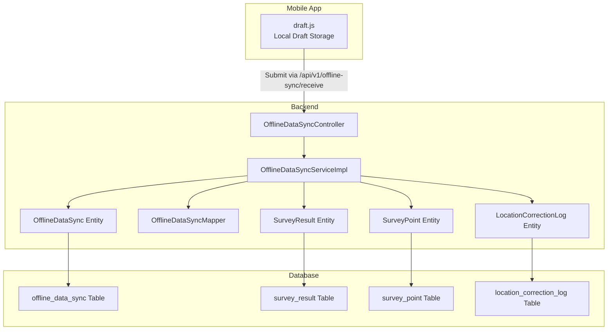
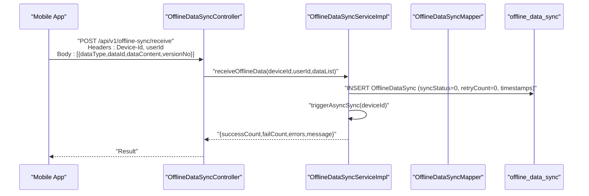
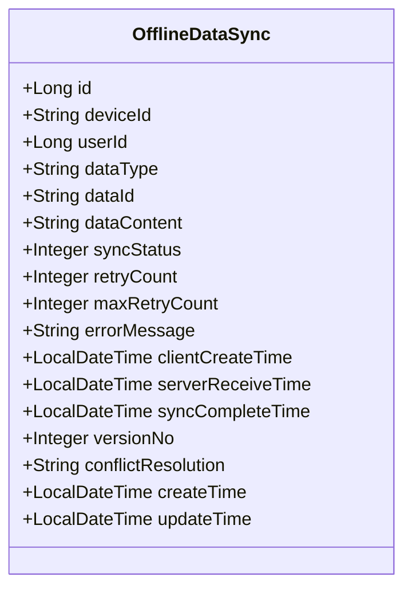
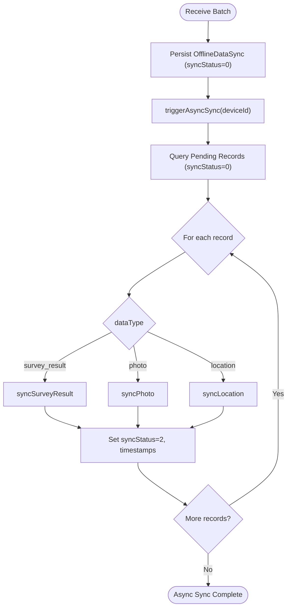
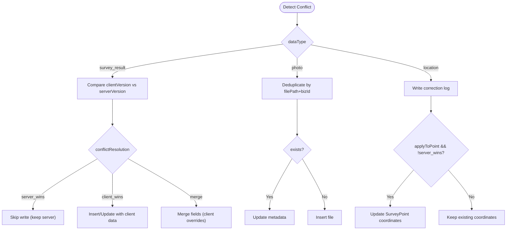
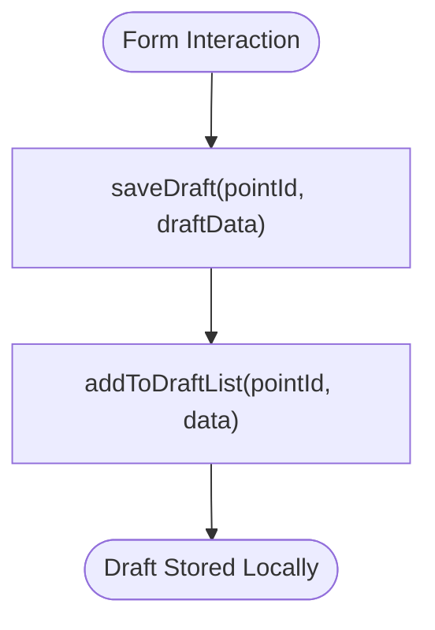
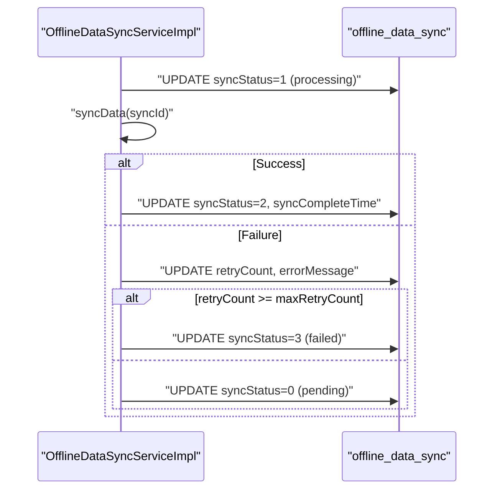
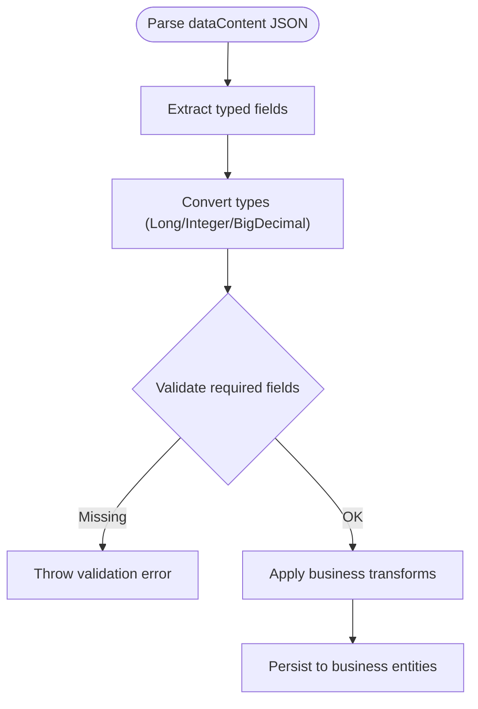
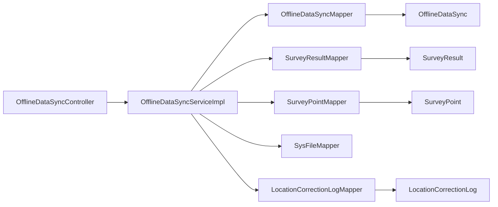

# Offline Data Synchronization

<cite>
**Referenced Files in This Document**
- [OfflineDataSync.java](file://admin-backend/src/main/java/com/qhiot/survey/entity/OfflineDataSync.java)
- [OfflineDataSyncController.java](file://admin-backend/src/main/java/com/qhiot/survey/controller/OfflineDataSyncController.java)
- [OfflineDataSyncService.java](file://admin-backend/src/main/java/com/qhiot/survey/service/OfflineDataSyncService.java)
- [OfflineDataSyncServiceImpl.java](file://admin-backend/src/main/java/com/qhiot/survey/service/impl/OfflineDataSyncServiceImpl.java)
- [OfflineDataSyncMapper.java](file://admin-backend/src/main/java/com/qhiot/survey/mapper/OfflineDataSyncMapper.java)
- [SurveyResult.java](file://admin-backend/src/main/java/com/qhiot/survey/entity/SurveyResult.java)
- [SurveyPoint.java](file://admin-backend/src/main/java/com/qhiot/survey/entity/SurveyPoint.java)
- [LocationCorrectionLog.java](file://admin-backend/src/main/java/com/qhiot/survey/entity/LocationCorrectionLog.java)
- [offline_data_sync.sql](file://init-sql/offline_data_sync.sql)
- [03-offline-data-sync.sql](file://admin-backend/init-data/03-offline-data-sync.sql)
- [draft.js](file://mobile-app/src/utils/draft.js)
- [OfflineDataSyncServiceTest.java](file://admin-backend/src/test/java/com/qhiot/survey/service/OfflineDataSyncServiceTest.java)
</cite>

## Table of Contents
1. [Introduction](#introduction)
2. [Project Structure](#project-structure)
3. [Core Components](#core-components)
4. [Architecture Overview](#architecture-overview)
5. [Detailed Component Analysis](#detailed-component-analysis)
6. [Dependency Analysis](#dependency-analysis)
7. [Performance Considerations](#performance-considerations)
8. [Troubleshooting Guide](#troubleshooting-guide)
9. [Conclusion](#conclusion)
10. [Appendices](#appendices)

## Introduction
This document describes the offline-first data synchronization system designed to support field data collection under intermittent connectivity. It covers the OfflineDataSync entity, the synchronization workflow, draft data management on the mobile app, conflict resolution strategies, and backend processing for data consistency. It also documents synchronization triggers, retry logic, error handling, and the integration between mobile draft storage and backend synchronization processing, including data transformation and validation during sync operations.

## Project Structure
The offline-first system spans three primary areas:
- Mobile app draft storage and submission
- Backend entity, controller, service, and mapper for offline synchronization
- Database schema supporting offline records and related business entities

**Diagram sources**
- [OfflineDataSyncController.java:26-36](file://admin-backend/src/main/java/com/qhiot/survey/controller/OfflineDataSyncController.java#L26-L36)
- [OfflineDataSyncServiceImpl.java:63-106](file://admin-backend/src/main/java/com/qhiot/survey/service/impl/OfflineDataSyncServiceImpl.java#L63-L106)
- [OfflineDataSync.java:17-96](file://admin-backend/src/main/java/com/qhiot/survey/entity/OfflineDataSync.java#L17-L96)
- [OfflineDataSyncMapper.java:10-12](file://admin-backend/src/main/java/com/qhiot/survey/mapper/OfflineDataSyncMapper.java#L10-L12)
- [SurveyResult.java:16-93](file://admin-backend/src/main/java/com/qhiot/survey/entity/SurveyResult.java#L16-L93)
- [SurveyPoint.java:19-84](file://admin-backend/src/main/java/com/qhiot/survey/entity/SurveyPoint.java#L19-L84)
- [LocationCorrectionLog.java:16-37](file://admin-backend/src/main/java/com/qhiot/survey/entity/LocationCorrectionLog.java#L16-L37)
- [offline_data_sync.sql:4-27](file://init-sql/offline_data_sync.sql#L4-L27)
- [03-offline-data-sync.sql:4-27](file://admin-backend/init-data/03-offline-data-sync.sql#L4-L27)

**Section sources**
- [OfflineDataSyncController.java:18-94](file://admin-backend/src/main/java/com/qhiot/survey/controller/OfflineDataSyncController.java#L18-L94)
- [OfflineDataSyncServiceImpl.java:34-38](file://admin-backend/src/main/java/com/qhiot/survey/service/impl/OfflineDataSyncServiceImpl.java#L34-L38)
- [offline_data_sync.sql:1-28](file://init-sql/offline_data_sync.sql#L1-L28)
- [03-offline-data-sync.sql:1-28](file://admin-backend/init-data/03-offline-data-sync.sql#L1-L28)

## Core Components
- OfflineDataSync entity: Stores offline submissions with metadata, status, retries, timestamps, versioning, and conflict resolution hints.
- OfflineDataSyncController: Exposes REST endpoints for receiving offline data, querying pending records, marking synced records, batch syncing, conflict resolution, retrying failed syncs, and cleanup.
- OfflineDataSyncService and OfflineDataSyncServiceImpl: Implement the business logic for receiving, validating, transforming, and persisting offline data, performing conflict resolution, retry handling, and cleanup.
- OfflineDataSyncMapper: MyBatis mapper for OfflineDataSync persistence.
- Supporting entities: SurveyResult, SurveyPoint, and LocationCorrectionLog represent the business domain synchronized by offline records.

Key responsibilities:
- Receive and normalize offline payloads into OfflineDataSync records.
- Asynchronous triggering of synchronization per device.
- Per-type synchronization logic: survey_result, photo, location.
- Conflict detection and resolution: server_wins, client_wins, merge.
- Retry and failure handling with capped attempts.
- Cleanup of expired synced records.

**Section sources**
- [OfflineDataSync.java:17-96](file://admin-backend/src/main/java/com/qhiot/survey/entity/OfflineDataSync.java#L17-L96)
- [OfflineDataSyncController.java:26-93](file://admin-backend/src/main/java/com/qhiot/survey/controller/OfflineDataSyncController.java#L26-L93)
- [OfflineDataSyncService.java:12-83](file://admin-backend/src/main/java/com/qhiot/survey/service/OfflineDataSyncService.java#L12-L83)
- [OfflineDataSyncServiceImpl.java:61-182](file://admin-backend/src/main/java/com/qhiot/survey/service/impl/OfflineDataSyncServiceImpl.java#L61-L182)
- [OfflineDataSyncMapper.java:10-12](file://admin-backend/src/main/java/com/qhiot/survey/mapper/OfflineDataSyncMapper.java#L10-L12)
- [SurveyResult.java:16-93](file://admin-backend/src/main/java/com/qhiot/survey/entity/SurveyResult.java#L16-L93)
- [SurveyPoint.java:19-84](file://admin-backend/src/main/java/com/qhiot/survey/entity/SurveyPoint.java#L19-L84)
- [LocationCorrectionLog.java:16-37](file://admin-backend/src/main/java/com/qhiot/survey/entity/LocationCorrectionLog.java#L16-L37)

## Architecture Overview
The offline-first workflow:
- Mobile captures data offline and stores drafts locally.
- On connectivity restoration, the app submits batches to the backend endpoint.
- Backend persists records as pending and asynchronously begins synchronization.
- Synchronization resolves conflicts and writes to business tables.
- Results are surfaced via status queries and conflict resolution APIs.

**Diagram sources**
- [OfflineDataSyncController.java:26-36](file://admin-backend/src/main/java/com/qhiot/survey/controller/OfflineDataSyncController.java#L26-L36)
- [OfflineDataSyncServiceImpl.java:63-106](file://admin-backend/src/main/java/com/qhiot/survey/service/impl/OfflineDataSyncServiceImpl.java#L63-L106)

## Detailed Component Analysis

### OfflineDataSync Entity
The entity encapsulates offline submission metadata and state:
- Identifiers: device ID, user ID, data type, business data ID.
- Content: JSON payload containing typed data.
- Status and retries: pending, syncing, completed, failed; retry tracking and caps.
- Timestamps: client creation, server receipt, completion.
- Versioning and conflict resolution hints: version number and resolution strategy.
- Indexes: optimized for device, user, status, type, and time filters.

**Diagram sources**
- [OfflineDataSync.java:17-96](file://admin-backend/src/main/java/com/qhiot/survey/entity/OfflineDataSync.java#L17-L96)

**Section sources**
- [OfflineDataSync.java:17-96](file://admin-backend/src/main/java/com/qhiot/survey/entity/OfflineDataSync.java#L17-L96)
- [offline_data_sync.sql:4-27](file://init-sql/offline_data_sync.sql#L4-L27)
- [03-offline-data-sync.sql:4-27](file://admin-backend/init-data/03-offline-data-sync.sql#L4-L27)

### Synchronization Workflow
The backend orchestrates synchronization per device:
- Receive: Persist incoming offline batches as pending records.
- Async trigger: Query pending records for the device and process each.
- Per-type processing:
  - survey_result: Parse JSON, detect version conflicts, apply resolution (server_wins, client_wins, merge), insert/update SurveyResult, and map result status to point status.
  - photo: Deduplicate by filePath+bizId, update metadata if exists, otherwise insert, then append URL to SurveyResult.images if linked.
  - location: Write LocationCorrectionLog, optionally update SurveyPoint coordinates depending on resolution.
- Retry and failure: Increment retry count; mark failed after max attempts; allow manual retry.
- Cleanup: Remove expired synced records after retention period.

**Diagram sources**
- [OfflineDataSyncServiceImpl.java:329-353](file://admin-backend/src/main/java/com/qhiot/survey/service/impl/OfflineDataSyncServiceImpl.java#L329-L353)
- [OfflineDataSyncServiceImpl.java:119-182](file://admin-backend/src/main/java/com/qhiot/survey/service/impl/OfflineDataSyncServiceImpl.java#L119-L182)
- [OfflineDataSyncServiceImpl.java:359-442](file://admin-backend/src/main/java/com/qhiot/survey/service/impl/OfflineDataSyncServiceImpl.java#L359-L442)
- [OfflineDataSyncServiceImpl.java:448-516](file://admin-backend/src/main/java/com/qhiot/survey/service/impl/OfflineDataSyncServiceImpl.java#L448-L516)
- [OfflineDataSyncServiceImpl.java:522-574](file://admin-backend/src/main/java/com/qhiot/survey/service/impl/OfflineDataSyncServiceImpl.java#L522-L574)

**Section sources**
- [OfflineDataSyncServiceImpl.java:61-182](file://admin-backend/src/main/java/com/qhiot/survey/service/impl/OfflineDataSyncServiceImpl.java#L61-L182)
- [OfflineDataSyncServiceImpl.java:329-353](file://admin-backend/src/main/java/com/qhiot/survey/service/impl/OfflineDataSyncServiceImpl.java#L329-L353)

### Conflict Resolution Strategies
Conflict detection and resolution are central to correctness:
- Version-based detection for survey_result: compare client version against server latest version.
- Supported resolutions:
  - server_wins: retain server data; skip insert/update for survey_result; still write logs for location.
  - client_wins: accept client data; adjust version accordingly.
  - merge: field-level merge favoring client values for overlapping keys.
- For photo, deduplication by filePath+bizId determines whether to insert or update metadata.
- For location, applyToPoint flag and resolution determine whether to update SurveyPoint coordinates.

**Diagram sources**
- [OfflineDataSyncServiceImpl.java:378-396](file://admin-backend/src/main/java/com/qhiot/survey/service/impl/OfflineDataSyncServiceImpl.java#L378-L396)
- [OfflineDataSyncServiceImpl.java:474-498](file://admin-backend/src/main/java/com/qhiot/survey/service/impl/OfflineDataSyncServiceImpl.java#L474-L498)
- [OfflineDataSyncServiceImpl.java:561-573](file://admin-backend/src/main/java/com/qhiot/survey/service/impl/OfflineDataSyncServiceImpl.java#L561-L573)

**Section sources**
- [OfflineDataSyncServiceImpl.java:240-283](file://admin-backend/src/main/java/com/qhiot/survey/service/impl/OfflineDataSyncServiceImpl.java#L240-L283)
- [OfflineDataSyncServiceTest.java:100-189](file://admin-backend/src/test/java/com/qhiot/survey/service/OfflineDataSyncServiceTest.java#L100-L189)
- [OfflineDataSyncServiceTest.java:191-240](file://admin-backend/src/test/java/com/qhiot/survey/service/OfflineDataSyncServiceTest.java#L191-L240)
- [OfflineDataSyncServiceTest.java:242-294](file://admin-backend/src/test/java/com/qhiot/survey/service/OfflineDataSyncServiceTest.java#L242-L294)

### Draft Data Management (Mobile App)
The mobile app manages local drafts:
- Save draft with pointId, version, and metadata; updates draft list.
- Retrieve, delete, and clear drafts; maintain draft list ordering.
- Expiration checks and cleanup; human-friendly timestamp formatting.
- Integration pattern: submit drafts to backend endpoint with Device-Id header.

**Diagram sources**
- [draft.js:14-34](file://mobile-app/src/utils/draft.js#L14-L34)
- [draft.js:98-116](file://mobile-app/src/utils/draft.js#L98-L116)

**Section sources**
- [draft.js:14-81](file://mobile-app/src/utils/draft.js#L14-L81)
- [draft.js:83-149](file://mobile-app/src/utils/draft.js#L83-L149)
- [draft.js:177-205](file://mobile-app/src/utils/draft.js#L177-L205)

### Synchronization Triggers, Retry Logic, and Error Handling
- Trigger: After successful receive, async job queries pending records for the device and processes each.
- Retry: On failure, increment retryCount; if threshold reached, mark failed; otherwise remain pending for next cycle.
- Manual retry: Endpoint allows resetting and re-executing a failed sync.
- Cleanup: Remove synced records older than retention days.

**Diagram sources**
- [OfflineDataSyncServiceImpl.java:119-182](file://admin-backend/src/main/java/com/qhiot/survey/service/impl/OfflineDataSyncServiceImpl.java#L119-L182)
- [OfflineDataSyncServiceImpl.java:285-306](file://admin-backend/src/main/java/com/qhiot/survey/service/impl/OfflineDataSyncServiceImpl.java#L285-L306)

**Section sources**
- [OfflineDataSyncServiceImpl.java:329-353](file://admin-backend/src/main/java/com/qhiot/survey/service/impl/OfflineDataSyncServiceImpl.java#L329-L353)
- [OfflineDataSyncServiceImpl.java:162-181](file://admin-backend/src/main/java/com/qhiot/survey/service/impl/OfflineDataSyncServiceImpl.java#L162-L181)
- [OfflineDataSyncController.java:78-93](file://admin-backend/src/main/java/com/qhiot/survey/controller/OfflineDataSyncController.java#L78-L93)

### Data Transformation and Validation During Sync
- JSON parsing and serialization for dataContent and nested fields.
- Type conversions for numeric and decimal fields.
- Validation: missing required fields (e.g., pointId, filePath, corrected coordinates) raise exceptions.
- Business transformations:
  - survey_result: derive versionNo, map resultStatus to point status, set submitTime.
  - photo: ensure unique file entries by deduplication criteria.
  - location: write correction log and conditionally update point coordinates.

**Diagram sources**
- [OfflineDataSyncServiceImpl.java:581-620](file://admin-backend/src/main/java/com/qhiot/survey/service/impl/OfflineDataSyncServiceImpl.java#L581-L620)
- [OfflineDataSyncServiceImpl.java:663-692](file://admin-backend/src/main/java/com/qhiot/survey/service/impl/OfflineDataSyncServiceImpl.java#L663-L692)
- [OfflineDataSyncServiceImpl.java:398-442](file://admin-backend/src/main/java/com/qhiot/survey/service/impl/OfflineDataSyncServiceImpl.java#L398-L442)
- [OfflineDataSyncServiceImpl.java:448-516](file://admin-backend/src/main/java/com/qhiot/survey/service/impl/OfflineDataSyncServiceImpl.java#L448-L516)
- [OfflineDataSyncServiceImpl.java:522-574](file://admin-backend/src/main/java/com/qhiot/survey/service/impl/OfflineDataSyncServiceImpl.java#L522-L574)

**Section sources**
- [OfflineDataSyncServiceImpl.java:581-620](file://admin-backend/src/main/java/com/qhiot/survey/service/impl/OfflineDataSyncServiceImpl.java#L581-L620)
- [OfflineDataSyncServiceImpl.java:398-442](file://admin-backend/src/main/java/com/qhiot/survey/service/impl/OfflineDataSyncServiceImpl.java#L398-L442)
- [OfflineDataSyncServiceImpl.java:448-516](file://admin-backend/src/main/java/com/qhiot/survey/service/impl/OfflineDataSyncServiceImpl.java#L448-L516)
- [OfflineDataSyncServiceImpl.java:522-574](file://admin-backend/src/main/java/com/qhiot/survey/service/impl/OfflineDataSyncServiceImpl.java#L522-L574)

### Examples

- Offline form saving and draft recovery
  - Save draft: [draft.js:14-34](file://mobile-app/src/utils/draft.js#L14-L34)
  - Recover draft: [draft.js:40-49](file://mobile-app/src/utils/draft.js#L40-L49)
  - Clear draft: [draft.js:63-73](file://mobile-app/src/utils/draft.js#L63-L73)

- Batch synchronization
  - Submit batch: [OfflineDataSyncController.java:26-36](file://admin-backend/src/main/java/com/qhiot/survey/controller/OfflineDataSyncController.java#L26-L36)
  - Async trigger: [OfflineDataSyncServiceImpl.java:329-353](file://admin-backend/src/main/java/com/qhiot/survey/service/impl/OfflineDataSyncServiceImpl.java#L329-L353)
  - Batch sync endpoint: [OfflineDataSyncController.java:55-60](file://admin-backend/src/main/java/com/qhiot/survey/controller/OfflineDataSyncController.java#L55-L60)

- Conflict detection and resolution
  - survey_result server_wins: [OfflineDataSyncServiceTest.java:100-123](file://admin-backend/src/test/java/com/qhiot/survey/service/OfflineDataSyncServiceTest.java#L100-L123)
  - survey_result client_wins: [OfflineDataSyncServiceTest.java:125-155](file://admin-backend/src/test/java/com/qhiot/survey/service/OfflineDataSyncServiceTest.java#L125-L155)
  - survey_result merge: [OfflineDataSyncServiceTest.java:157-189](file://admin-backend/src/test/java/com/qhiot/survey/service/OfflineDataSyncServiceTest.java#L157-L189)
  - photo deduplication: [OfflineDataSyncServiceTest.java:191-240](file://admin-backend/src/test/java/com/qhiot/survey/service/OfflineDataSyncServiceTest.java#L191-L240)
  - location correction log and optional coordinate update: [OfflineDataSyncServiceTest.java:242-294](file://admin-backend/src/test/java/com/qhiot/survey/service/OfflineDataSyncServiceTest.java#L242-L294)

**Section sources**
- [draft.js:14-81](file://mobile-app/src/utils/draft.js#L14-L81)
- [OfflineDataSyncController.java:26-60](file://admin-backend/src/main/java/com/qhiot/survey/controller/OfflineDataSyncController.java#L26-L60)
- [OfflineDataSyncServiceTest.java:100-294](file://admin-backend/src/test/java/com/qhiot/survey/service/OfflineDataSyncServiceTest.java#L100-L294)

## Dependency Analysis
- Controller depends on OfflineDataSyncService.
- ServiceImpl depends on OfflineDataSyncMapper and business mappers (SurveyResult, SurveyPoint, SysFile, LocationCorrectionLog).
- Entities reflect relationships with business tables and are persisted via MyBatis.

**Diagram sources**
- [OfflineDataSyncController.java:22-24](file://admin-backend/src/main/java/com/qhiot/survey/controller/OfflineDataSyncController.java#L22-L24)
- [OfflineDataSyncServiceImpl.java:40-43](file://admin-backend/src/main/java/com/qhiot/survey/service/impl/OfflineDataSyncServiceImpl.java#L40-L43)
- [OfflineDataSyncMapper.java:10-12](file://admin-backend/src/main/java/com/qhiot/survey/mapper/OfflineDataSyncMapper.java#L10-L12)
- [SurveyResult.java:16-93](file://admin-backend/src/main/java/com/qhiot/survey/entity/SurveyResult.java#L16-L93)
- [SurveyPoint.java:19-84](file://admin-backend/src/main/java/com/qhiot/survey/entity/SurveyPoint.java#L19-L84)
- [LocationCorrectionLog.java:16-37](file://admin-backend/src/main/java/com/qhiot/survey/entity/LocationCorrectionLog.java#L16-L37)

**Section sources**
- [OfflineDataSyncController.java:22-24](file://admin-backend/src/main/java/com/qhiot/survey/controller/OfflineDataSyncController.java#L22-L24)
- [OfflineDataSyncServiceImpl.java:40-43](file://admin-backend/src/main/java/com/qhiot/survey/service/impl/OfflineDataSyncServiceImpl.java#L40-L43)

## Performance Considerations
- Asynchronous processing: triggerAsyncSync processes pending records without blocking the receive response.
- Pagination: getPendingSyncData supports pagination to avoid large in-memory lists.
- Indexes: offline_data_sync table includes indexes on device_id, user_id, sync_status, data_type, and create_time to optimize queries.
- Retry caps: maxRetryCount prevents infinite loops and reduces load.
- Deduplication: photo synchronization avoids duplicate inserts via filePath+bizId checks.

[No sources needed since this section provides general guidance]

## Troubleshooting Guide
Common issues and remedies:
- Record not found: syncData validates existence and already-synced state.
- Unsupported data type: syncData throws on unknown dataType.
- Validation failures: Missing required fields (e.g., pointId, filePath, corrected coordinates) cause exceptions.
- Conflict without resolution hint: survey_result version conflicts require explicit conflictResolution.
- Retry limits: Once max retries reached, records are marked failed; use retrySync to reset and re-run.
- Cleanup: Use cleanupExpiredRecords to remove old synced records.

**Section sources**
- [OfflineDataSyncServiceImpl.java:120-128](file://admin-backend/src/main/java/com/qhiot/survey/service/impl/OfflineDataSyncServiceImpl.java#L120-L128)
- [OfflineDataSyncServiceImpl.java:146-148](file://admin-backend/src/main/java/com/qhiot/survey/service/impl/OfflineDataSyncServiceImpl.java#L146-L148)
- [OfflineDataSyncServiceImpl.java:378-383](file://admin-backend/src/main/java/com/qhiot/survey/service/impl/OfflineDataSyncServiceImpl.java#L378-L383)
- [OfflineDataSyncServiceImpl.java:285-306](file://admin-backend/src/main/java/com/qhiot/survey/service/impl/OfflineDataSyncServiceImpl.java#L285-L306)
- [OfflineDataSyncController.java:87-93](file://admin-backend/src/main/java/com/qhiot/survey/controller/OfflineDataSyncController.java#L87-L93)

## Conclusion
The offline-first synchronization system provides robust handling of disconnected scenarios through structured offline records, asynchronous processing, and explicit conflict resolution. The mobile app’s draft management integrates seamlessly with backend endpoints, while the backend ensures data consistency across survey results, photos, and locations. Retry logic, manual conflict resolution, and cleanup policies support operational reliability.

[No sources needed since this section summarizes without analyzing specific files]

## Appendices

### API Definitions
- Receive offline data
  - Method: POST
  - Path: /api/v1/offline-sync/receive
  - Headers: Device-Id (required), userId (required)
  - Body: Array of objects with dataType, dataId, dataContent, versionNo
  - Response: {successCount, failCount, errors, message}
- Get pending sync data
  - Method: GET
  - Path: /api/v1/offline-sync/pending
  - Headers: Device-Id (required)
  - Query: pageNum, pageSize
  - Response: Paginated list of OfflineDataSync
- Sync single record
  - Method: POST
  - Path: /api/v1/offline-sync/sync/{syncId}
  - Response: {success, message}
- Batch sync
  - Method: POST
  - Path: /api/v1/offline-sync/sync/batch
  - Body: Array of syncId
  - Response: {totalCount, successCount, failCount, details}
- Get sync status
  - Method: GET
  - Path: /api/v1/offline-sync/status
  - Headers: Device-Id (required)
  - Response: {total, pending, syncing, completed, failed, lastSyncTime}
- Resolve conflict
  - Method: POST
  - Path: /api/v1/offline-sync/conflict/{syncId}?resolution={server|client|merge}
  - Body: {mergedData?} (required for merge)
  - Response: {success, message, resolution}
- Retry failed sync
  - Method: POST
  - Path: /api/v1/offline-sync/retry/{syncId}
  - Response: Delegates to syncData for the given record
- Cleanup expired records
  - Method: POST
  - Path: /api/v1/offline-sync/cleanup?days={default 30}
  - Response: Count of deleted records

**Section sources**
- [OfflineDataSyncController.java:26-93](file://admin-backend/src/main/java/com/qhiot/survey/controller/OfflineDataSyncController.java#L26-L93)

### Database Schema Notes
- offline_data_sync: Supports indexing for efficient queries and JSON dataContent for flexible payloads.
- Related business tables: survey_result, survey_point, location_correction_log.

**Section sources**
- [offline_data_sync.sql:4-27](file://init-sql/offline_data_sync.sql#L4-L27)
- [03-offline-data-sync.sql:4-27](file://admin-backend/init-data/03-offline-data-sync.sql#L4-L27)
- [SurveyResult.java:16-93](file://admin-backend/src/main/java/com/qhiot/survey/entity/SurveyResult.java#L16-L93)
- [SurveyPoint.java:19-84](file://admin-backend/src/main/java/com/qhiot/survey/entity/SurveyPoint.java#L19-L84)
- [LocationCorrectionLog.java:16-37](file://admin-backend/src/main/java/com/qhiot/survey/entity/LocationCorrectionLog.java#L16-L37)