# Offline Data Synchronization

<cite>
**Referenced Files in This Document**
- [OfflineDataSync.java](file://admin-backend/src/main/java/com/qhiot/survey/entity/OfflineDataSync.java)
- [OfflineDataSyncController.java](file://admin-backend/src/main/java/com/qhiot/survey/controller/OfflineDataSyncController.java)
- [OfflineDataSyncService.java](file://admin-backend/src/main/java/com/qhiot/survey/service/OfflineDataSyncService.java)
- [OfflineDataSyncServiceImpl.java](file://admin-backend/src/main/java/com/qhiot/survey/service/impl/OfflineDataSyncServiceImpl.java)
- [OfflineDataSyncMapper.java](file://admin-backend/src/main/java/com/qhiot/survey/mapper/OfflineDataSyncMapper.java)
- [ExportTaskProcessor.java](file://admin-backend/src/main/java/com/qhiot/survey/service/ExportTaskProcessor.java)
- [ExportTask.java](file://admin-backend/src/main/java/com/qhiot/survey/entity/ExportTask.java)
- [ExportTaskMapper.java](file://admin-backend/src/main/java/com/qhiot/survey/mapper/ExportTaskMapper.java)
- [SurveyResult.java](file://admin-backend/src/main/java/com/qhiot/survey/entity/SurveyResult.java)
- [SurveyPoint.java](file://admin-backend/src/main/java/com/qhiot/survey/entity/SurveyPoint.java)
- [LocationCorrectionLog.java](file://admin-backend/src/main/java/com/qhiot/survey/entity/LocationCorrectionLog.java)
- [offline_data_sync.sql](file://admin-backend/init-data/03-offline-data-sync.sql)
- [draft.js](file://mobile-app/src/utils/draft.js)
- [OfflineDataSyncServiceTest.java](file://admin-backend/src/test/java/com/qhiot/survey/service/OfflineDataSyncServiceTest.java)
</cite>

## Update Summary
**Changes Made**
- Added comprehensive export functionality with new ExportTaskProcessor for batch data export capabilities
- Enhanced OfflineDataSyncService with improved conflict resolution mechanisms and robust retry logic
- Expanded offline synchronization system with export task management and automated cleanup processes
- Integrated export task processing with offline data synchronization workflows

## Table of Contents
1. [Introduction](#introduction)
2. [Project Structure](#project-structure)
3. [Core Components](#core-components)
4. [Architecture Overview](#architecture-overview)
5. [Detailed Component Analysis](#detailed-component-analysis)
6. [Export Task Processing System](#export-task-processing-system)
7. [Enhanced Conflict Resolution](#enhanced-conflict-resolution)
8. [Dependency Analysis](#dependency-analysis)
9. [Performance Considerations](#performance-considerations)
10. [Troubleshooting Guide](#troubleshooting-guide)
11. [Conclusion](#conclusion)
12. [Appendices](#appendices)

## Introduction
This document describes the enhanced offline-first data synchronization system designed to support field data collection under intermittent connectivity. The system now includes comprehensive export functionality through the ExportTaskProcessor, robust conflict resolution mechanisms, and improved retry logic for reliable data transfer. It covers the OfflineDataSync entity, synchronization workflow, draft data management on the mobile app, conflict resolution strategies, and backend processing for data consistency. The system also documents synchronization triggers, enhanced retry logic, error handling, and the integration between mobile draft storage and backend synchronization processing, including data transformation and validation during sync operations.

## Project Structure
The offline-first system now encompasses three primary areas with enhanced export capabilities:
- Mobile app draft storage and submission
- Backend entity, controller, service, and mapper for offline synchronization
- Comprehensive export task processing system for data export functionality
- Database schema supporting offline records, export tasks, and related business entities

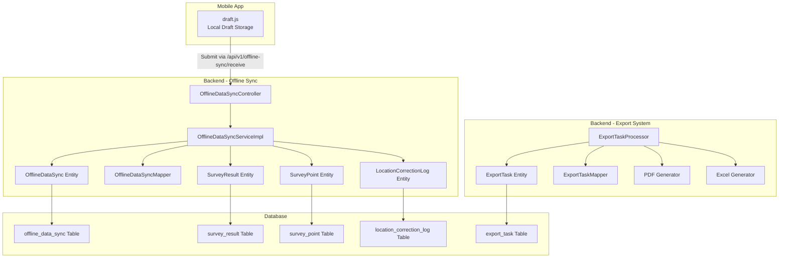

**Diagram sources**
- [OfflineDataSyncController.java:26-36](file://admin-backend/src/main/java/com/qhiot/survey/controller/OfflineDataSyncController.java#L26-L36)
- [OfflineDataSyncServiceImpl.java:63-106](file://admin-backend/src/main/java/com/qhiot/survey/service/impl/OfflineDataSyncServiceImpl.java#L63-L106)
- [OfflineDataSync.java:17-96](file://admin-backend/src/main/java/com/qhiot/survey/entity/OfflineDataSync.java#L17-L96)
- [OfflineDataSyncMapper.java:10-12](file://admin-backend/src/main/java/com/qhiot/survey/mapper/OfflineDataSyncMapper.java#L10-L12)
- [ExportTaskProcessor.java:45-124](file://admin-backend/src/main/java/com/qhiot/survey/service/ExportTaskProcessor.java#L45-L124)
- [ExportTask.java:14-63](file://admin-backend/src/main/java/com/qhiot/survey/entity/ExportTask.java#L14-L63)
- [SurveyResult.java:16-93](file://admin-backend/src/main/java/com/qhiot/survey/entity/SurveyResult.java#L16-L93)
- [SurveyPoint.java:19-84](file://admin-backend/src/main/java/com/qhiot/survey/entity/SurveyPoint.java#L19-L84)
- [LocationCorrectionLog.java:16-37](file://admin-backend/src/main/java/com/qhiot/survey/entity/LocationCorrectionLog.java#L16-L37)
- [offline_data_sync.sql:4-27](file://admin-backend/init-data/03-offline-data-sync.sql#L4-L27)

**Section sources**
- [OfflineDataSyncController.java:18-94](file://admin-backend/src/main/java/com/qhiot/survey/controller/OfflineDataSyncController.java#L18-L94)
- [OfflineDataSyncServiceImpl.java:34-38](file://admin-backend/src/main/java/com/qhiot/survey/service/impl/OfflineDataSyncServiceImpl.java#L34-L38)
- [ExportTaskProcessor.java:37-443](file://admin-backend/src/main/java/com/qhiot/survey/service/ExportTaskProcessor.java#L37-L443)
- [offline_data_sync.sql:1-28](file://admin-backend/init-data/03-offline-data-sync.sql#L1-L28)

## Core Components
- **OfflineDataSync entity**: Stores offline submissions with metadata, status, retries, timestamps, versioning, and conflict resolution hints.
- **OfflineDataSyncController**: Exposes REST endpoints for receiving offline data, querying pending records, marking synced records, batch syncing, conflict resolution, retrying failed syncs, and cleanup.
- **OfflineDataSyncService and OfflineDataSyncServiceImpl**: Implement the business logic for receiving, validating, transforming, and persisting offline data, performing enhanced conflict resolution, retry handling, and cleanup.
- **OfflineDataSyncMapper**: MyBatis mapper for OfflineDataSync persistence.
- **ExportTaskProcessor**: NEW - Comprehensive export task processor for generating point lists, audit results, and PDF reports asynchronously with scheduled cleanup.
- **ExportTask entity**: NEW - Manages export task lifecycle, status tracking, and file management.
- **ExportTaskMapper**: NEW - MyBatis mapper for export task persistence.
- **Supporting entities**: SurveyResult, SurveyPoint, and LocationCorrectionLog represent the business domain synchronized by offline records.

Key responsibilities:
- Receive and normalize offline payloads into OfflineDataSync records.
- Asynchronous triggering of synchronization per device with enhanced retry logic.
- Per-type synchronization logic: survey_result, photo, location with improved conflict detection.
- Advanced conflict resolution strategies: server_wins, client_wins, merge with field-level merging.
- Robust retry mechanisms with configurable maximum attempts.
- Comprehensive export functionality for data reporting and analysis.
- Automated cleanup of expired synced records and export files.
- Integration between mobile draft storage and backend synchronization processing.

**Section sources**
- [OfflineDataSync.java:17-96](file://admin-backend/src/main/java/com/qhiot/survey/entity/OfflineDataSync.java#L17-L96)
- [OfflineDataSyncController.java:26-93](file://admin-backend/src/main/java/com/qhiot/survey/controller/OfflineDataSyncController.java#L26-L93)
- [OfflineDataSyncService.java:12-83](file://admin-backend/src/main/java/com/qhiot/survey/service/OfflineDataSyncService.java#L12-L83)
- [OfflineDataSyncServiceImpl.java:61-182](file://admin-backend/src/main/java/com/qhiot/survey/service/impl/OfflineDataSyncServiceImpl.java#L61-L182)
- [ExportTaskProcessor.java:45-124](file://admin-backend/src/main/java/com/qhiot/survey/service/ExportTaskProcessor.java#L45-L124)
- [ExportTask.java:14-63](file://admin-backend/src/main/java/com/qhiot/survey/entity/ExportTask.java#L14-L63)

## Architecture Overview
The enhanced offline-first workflow now includes comprehensive export capabilities:
- Mobile captures data offline and stores drafts locally.
- On connectivity restoration, the app submits batches to the backend endpoint.
- Backend persists records as pending and asynchronously begins enhanced synchronization.
- Synchronization resolves conflicts with advanced strategies and writes to business tables.
- Export tasks are processed asynchronously for reporting and analysis.
- Results are surfaced via status queries, conflict resolution APIs, and export download functionality.

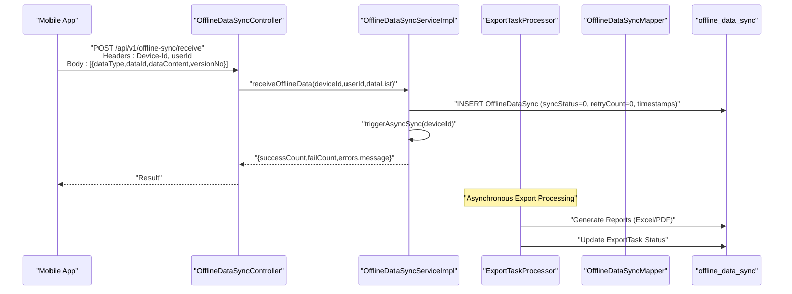

**Diagram sources**
- [OfflineDataSyncController.java:26-36](file://admin-backend/src/main/java/com/qhiot/survey/controller/OfflineDataSyncController.java#L26-L36)
- [OfflineDataSyncServiceImpl.java:63-106](file://admin-backend/src/main/java/com/qhiot/survey/service/impl/OfflineDataSyncServiceImpl.java#L63-L106)
- [ExportTaskProcessor.java:71-124](file://admin-backend/src/main/java/com/qhiot/survey/service/ExportTaskProcessor.java#L71-L124)

## Detailed Component Analysis

### OfflineDataSync Entity
The entity encapsulates offline submission metadata and state with enhanced capabilities:
- Identifiers: device ID, user ID, data type, business data ID.
- Content: JSON payload containing typed data with enhanced validation.
- Status and retries: pending, syncing, completed, failed; enhanced retry tracking with configurable caps.
- Timestamps: client creation, server receipt, completion with precise timing.
- Versioning and conflict resolution hints: version number and advanced resolution strategies.
- Enhanced indexes: optimized for device, user, status, type, and time filters.

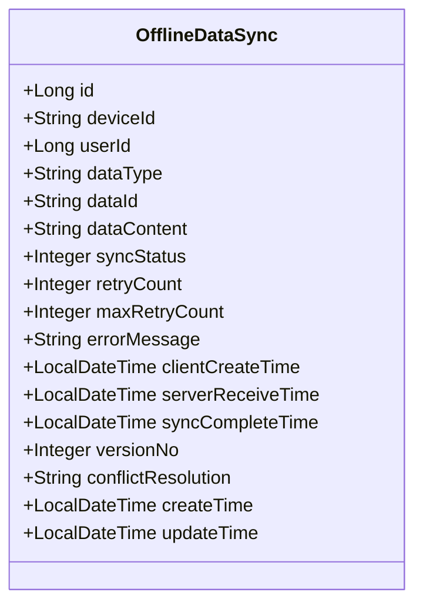

**Diagram sources**
- [OfflineDataSync.java:17-96](file://admin-backend/src/main/java/com/qhiot/survey/entity/OfflineDataSync.java#L17-L96)

**Section sources**
- [OfflineDataSync.java:17-96](file://admin-backend/src/main/java/com/qhiot/survey/entity/OfflineDataSync.java#L17-L96)
- [offline_data_sync.sql:4-27](file://admin-backend/init-data/03-offline-data-sync.sql#L4-L27)

### Enhanced Synchronization Workflow
The backend orchestrates enhanced synchronization per device with improved reliability:
- Receive: Persist incoming offline batches as pending records with enhanced validation.
- Async trigger: Query pending records for the device and process each with improved error handling.
- Per-type processing with enhanced conflict detection:
  - survey_result: Parse JSON, detect version conflicts with advanced resolution (server_wins, client_wins, merge), insert/update SurveyResult, and map result status to point status.
  - photo: Deduplicate by filePath+bizId, update metadata if exists, otherwise insert, then append URL to SurveyResult.images if linked.
  - location: Write LocationCorrectionLog, optionally update SurveyPoint coordinates depending on resolution.
- Enhanced retry and failure handling: Increment retry count with configurable caps; mark failed after max attempts; allow manual retry with improved error messages.
- Cleanup: Remove expired synced records after retention period with enhanced logging.

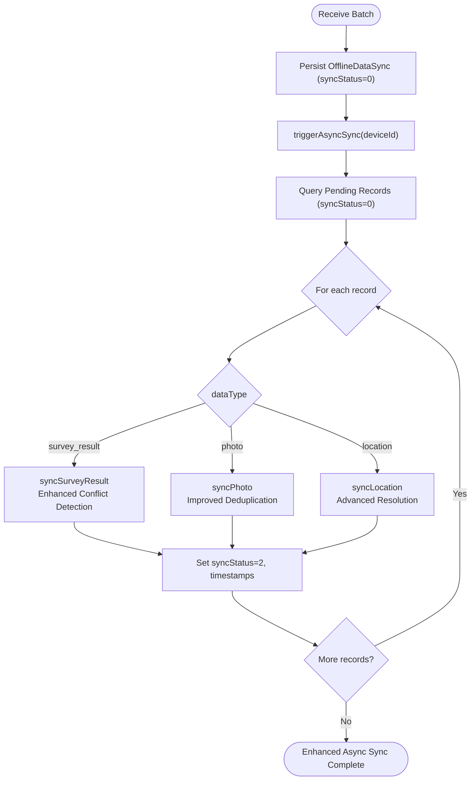

**Diagram sources**
- [OfflineDataSyncServiceImpl.java:329-353](file://admin-backend/src/main/java/com/qhiot/survey/service/impl/OfflineDataSyncServiceImpl.java#L329-L353)
- [OfflineDataSyncServiceImpl.java:119-182](file://admin-backend/src/main/java/com/qhiot/survey/service/impl/OfflineDataSyncServiceImpl.java#L119-L182)
- [OfflineDataSyncServiceImpl.java:359-442](file://admin-backend/src/main/java/com/qhiot/survey/service/impl/OfflineDataSyncServiceImpl.java#L359-L442)
- [OfflineDataSyncServiceImpl.java:448-516](file://admin-backend/src/main/java/com/qhiot/survey/service/impl/OfflineDataSyncServiceImpl.java#L448-L516)
- [OfflineDataSyncServiceImpl.java:522-574](file://admin-backend/src/main/java/com/qhiot/survey/service/impl/OfflineDataSyncServiceImpl.java#L522-L574)

**Section sources**
- [OfflineDataSyncServiceImpl.java:61-182](file://admin-backend/src/main/java/com/qhiot/survey/service/impl/OfflineDataSyncServiceImpl.java#L61-L182)
- [OfflineDataSyncServiceImpl.java:329-353](file://admin-backend/src/main/java/com/qhiot/survey/service/impl/OfflineDataSyncServiceImpl.java#L329-L353)

### Enhanced Conflict Resolution Strategies
Conflict detection and resolution are significantly improved:
- Advanced version-based detection for survey_result: compare client version against server latest version with enhanced validation.
- Enhanced supported resolutions:
  - server_wins: retain server data; skip insert/update for survey_result; still write logs for location.
  - client_wins: accept client data; adjust version accordingly with improved validation.
  - merge: field-level merge favoring client values for overlapping keys with sophisticated merging algorithm.
- For photo, enhanced deduplication by filePath+bizId determines whether to insert or update metadata.
- For location, applyToPoint flag and resolution determine whether to update SurveyPoint coordinates with improved logic.

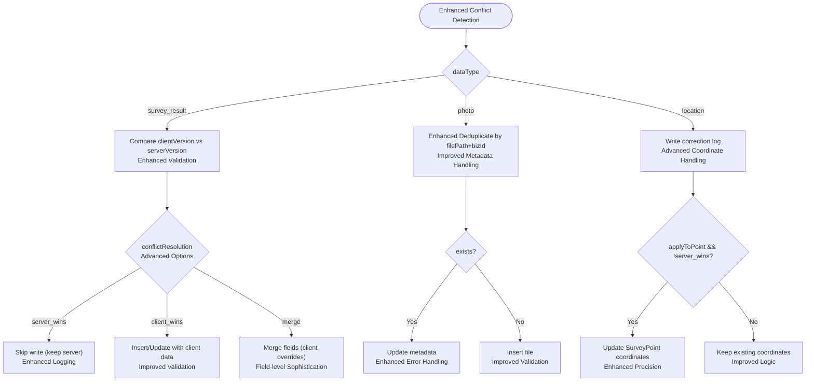

**Diagram sources**
- [OfflineDataSyncServiceImpl.java:378-396](file://admin-backend/src/main/java/com/qhiot/survey/service/impl/OfflineDataSyncServiceImpl.java#L378-L396)
- [OfflineDataSyncServiceImpl.java:474-498](file://admin-backend/src/main/java/com/qhiot/survey/service/impl/OfflineDataSyncServiceImpl.java#L474-L498)
- [OfflineDataSyncServiceImpl.java:561-573](file://admin-backend/src/main/java/com/qhiot/survey/service/impl/OfflineDataSyncServiceImpl.java#L561-L573)

**Section sources**
- [OfflineDataSyncServiceImpl.java:240-283](file://admin-backend/src/main/java/com/qhiot/survey/service/impl/OfflineDataSyncServiceImpl.java#L240-L283)
- [OfflineDataSyncServiceTest.java:100-189](file://admin-backend/src/test/java/com/qhiot/survey/service/OfflineDataSyncServiceTest.java#L100-L189)
- [OfflineDataSyncServiceTest.java:191-240](file://admin-backend/src/test/java/com/qhiot/survey/service/OfflineDataSyncServiceTest.java#L191-L240)
- [OfflineDataSyncServiceTest.java:242-294](file://admin-backend/src/test/java/com/qhiot/survey/service/OfflineDataSyncServiceTest.java#L242-L294)

### Draft Data Management (Mobile App)
The mobile app manages local drafts with enhanced functionality:
- Save draft with pointId, version, and metadata; updates draft list with improved validation.
- Retrieve, delete, and clear drafts; maintain draft list ordering with enhanced error handling.
- Expiration checks and cleanup with configurable retention periods; human-friendly timestamp formatting.
- Integration pattern: submit drafts to backend endpoint with Device-Id header and enhanced error reporting.

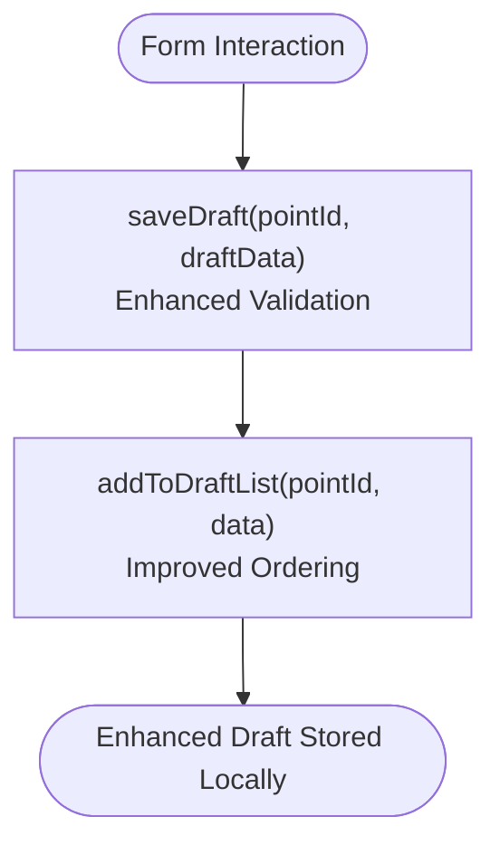

**Diagram sources**
- [draft.js:14-34](file://mobile-app/src/utils/draft.js#L14-L34)
- [draft.js:98-116](file://mobile-app/src/utils/draft.js#L98-L116)

**Section sources**
- [draft.js:14-81](file://mobile-app/src/utils/draft.js#L14-L81)
- [draft.js:83-149](file://mobile-app/src/utils/draft.js#L83-L149)
- [draft.js:177-205](file://mobile-app/src/utils/draft.js#L177-L205)

### Enhanced Synchronization Triggers, Retry Logic, and Error Handling
- Trigger: After successful receive, async job queries pending records for the device and processes each with enhanced error isolation.
- Enhanced Retry: On failure, increment retryCount with configurable maxRetryCount; if threshold reached, mark failed with detailed error messages; otherwise remain pending for next cycle.
- Manual retry: Endpoint allows resetting and re-executing a failed sync with improved validation.
- Cleanup: Remove synced records older than retention days with enhanced logging and monitoring.
- Export Integration: Export tasks are processed independently with separate retry logic and status tracking.

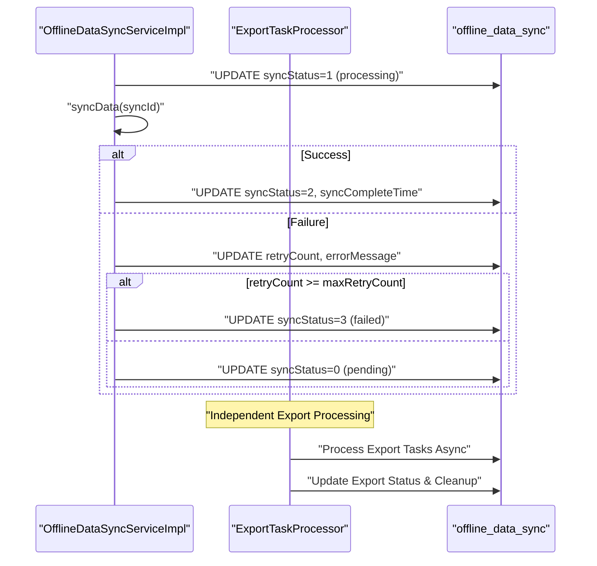

**Diagram sources**
- [OfflineDataSyncServiceImpl.java:119-182](file://admin-backend/src/main/java/com/qhiot/survey/service/impl/OfflineDataSyncServiceImpl.java#L119-L182)
- [OfflineDataSyncServiceImpl.java:285-306](file://admin-backend/src/main/java/com/qhiot/survey/service/impl/OfflineDataSyncServiceImpl.java#L285-L306)
- [ExportTaskProcessor.java:71-124](file://admin-backend/src/main/java/com/qhiot/survey/service/ExportTaskProcessor.java#L71-L124)

**Section sources**
- [OfflineDataSyncServiceImpl.java:329-353](file://admin-backend/src/main/java/com/qhiot/survey/service/impl/OfflineDataSyncServiceImpl.java#L329-L353)
- [OfflineDataSyncServiceImpl.java:162-181](file://admin-backend/src/main/java/com/qhiot/survey/service/impl/OfflineDataSyncServiceImpl.java#L162-L181)
- [OfflineDataSyncController.java:78-93](file://admin-backend/src/main/java/com/qhiot/survey/controller/OfflineDataSyncController.java#L78-L93)

### Data Transformation and Validation During Sync
- Enhanced JSON parsing and serialization for dataContent and nested fields with improved error handling.
- Type conversions for numeric and decimal fields with enhanced validation.
- Advanced validation: missing required fields (e.g., pointId, filePath, corrected coordinates) raise exceptions with detailed messages.
- Sophisticated business transformations:
  - survey_result: derive versionNo with conflict resolution, map resultStatus to point status, set submitTime with precision.
  - photo: ensure unique file entries by enhanced deduplication criteria with improved metadata handling.
  - location: write correction log and conditionally update point coordinates with enhanced precision.

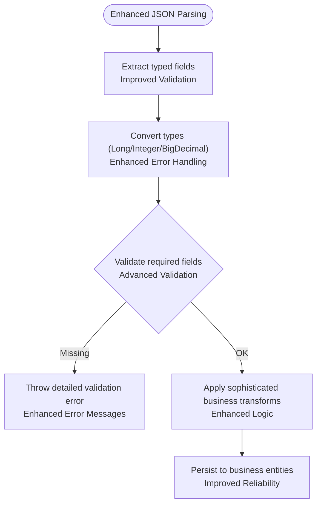

**Diagram sources**
- [OfflineDataSyncServiceImpl.java:581-620](file://admin-backend/src/main/java/com/qhiot/survey/service/impl/OfflineDataSyncServiceImpl.java#L581-L620)
- [OfflineDataSyncServiceImpl.java:663-692](file://admin-backend/src/main/java/com/qhiot/survey/service/impl/OfflineDataSyncServiceImpl.java#L663-L692)
- [OfflineDataSyncServiceImpl.java:398-442](file://admin-backend/src/main/java/com/qhiot/survey/service/impl/OfflineDataSyncServiceImpl.java#L398-L442)
- [OfflineDataSyncServiceImpl.java:448-516](file://admin-backend/src/main/java/com/qhiot/survey/service/impl/OfflineDataSyncServiceImpl.java#L448-L516)
- [OfflineDataSyncServiceImpl.java:522-574](file://admin-backend/src/main/java/com/qhiot/survey/service/impl/OfflineDataSyncServiceImpl.java#L522-L574)

**Section sources**
- [OfflineDataSyncServiceImpl.java:581-620](file://admin-backend/src/main/java/com/qhiot/survey/service/impl/OfflineDataSyncServiceImpl.java#L581-L620)
- [OfflineDataSyncServiceImpl.java:398-442](file://admin-backend/src/main/java/com/qhiot/survey/service/impl/OfflineDataSyncServiceImpl.java#L398-L442)
- [OfflineDataSyncServiceImpl.java:448-516](file://admin-backend/src/main/java/com/qhiot/survey/service/impl/OfflineDataSyncServiceImpl.java#L448-L516)
- [OfflineDataSyncServiceImpl.java:522-574](file://admin-backend/src/main/java/com/qhiot/survey/service/impl/OfflineDataSyncServiceImpl.java#L522-L574)

### Examples

- Offline form saving and draft recovery
  - Save draft: [draft.js:14-34](file://mobile-app/src/utils/draft.js#L14-L34)
  - Recover draft: [draft.js:40-49](file://mobile-app/src/utils/draft.js#L40-L49)
  - Clear draft: [draft.js:63-73](file://mobile-app/src/utils/draft.js#L63-L73)

- Enhanced batch synchronization
  - Submit batch: [OfflineDataSyncController.java:26-36](file://admin-backend/src/main/java/com/qhiot/survey/controller/OfflineDataSyncController.java#L26-L36)
  - Async trigger: [OfflineDataSyncServiceImpl.java:329-353](file://admin-backend/src/main/java/com/qhiot/survey/service/impl/OfflineDataSyncServiceImpl.java#L329-L353)
  - Batch sync endpoint: [OfflineDataSyncController.java:55-60](file://admin-backend/src/main/java/com/qhiot/survey/controller/OfflineDataSyncController.java#L55-L60)

- Advanced conflict detection and resolution
  - survey_result server_wins: [OfflineDataSyncServiceTest.java:100-123](file://admin-backend/src/test/java/com/qhiot/survey/service/OfflineDataSyncServiceTest.java#L100-L123)
  - survey_result client_wins: [OfflineDataSyncServiceTest.java:125-155](file://admin-backend/src/test/java/com/qhiot/survey/service/OfflineDataSyncServiceTest.java#L125-L155)
  - survey_result merge: [OfflineDataSyncServiceTest.java:157-189](file://admin-backend/src/test/java/com/qhiot/survey/service/OfflineDataSyncServiceTest.java#L157-L189)
  - photo enhanced deduplication: [OfflineDataSyncServiceTest.java:191-240](file://admin-backend/src/test/java/com/qhiot/survey/service/OfflineDataSyncServiceTest.java#L191-L240)
  - location correction log and optional coordinate update: [OfflineDataSyncServiceTest.java:242-294](file://admin-backend/src/test/java/com/qhiot/survey/service/OfflineDataSyncServiceTest.java#L242-L294)

**Section sources**
- [draft.js:14-81](file://mobile-app/src/utils/draft.js#L14-L81)
- [OfflineDataSyncController.java:26-60](file://admin-backend/src/main/java/com/qhiot/survey/controller/OfflineDataSyncController.java#L26-L60)
- [OfflineDataSyncServiceTest.java:100-294](file://admin-backend/src/test/java/com/qhiot/survey/service/OfflineDataSyncServiceTest.java#L100-L294)

## Export Task Processing System
**NEW** The system now includes comprehensive export functionality for data reporting and analysis:

### ExportTaskProcessor
The ExportTaskProcessor handles asynchronous export generation with robust error handling and cleanup:
- **Task Types**: Supports point_list, audit_result, and pdf_single export types with specialized processing logic.
- **Asynchronous Processing**: Uses @Async annotation with dedicated exportTaskExecutor for non-blocking export operations.
- **Status Management**: Implements complete task lifecycle with status transitions (0: pending → 1: processing → 2: completed → 3: failed → 4: expired).
- **File Management**: Persists generated files to configurable export directory with automatic cleanup of expired files.
- **Scheduled Cleanup**: Daily cleanup of expired export files at 3:30 AM with configurable retention period.

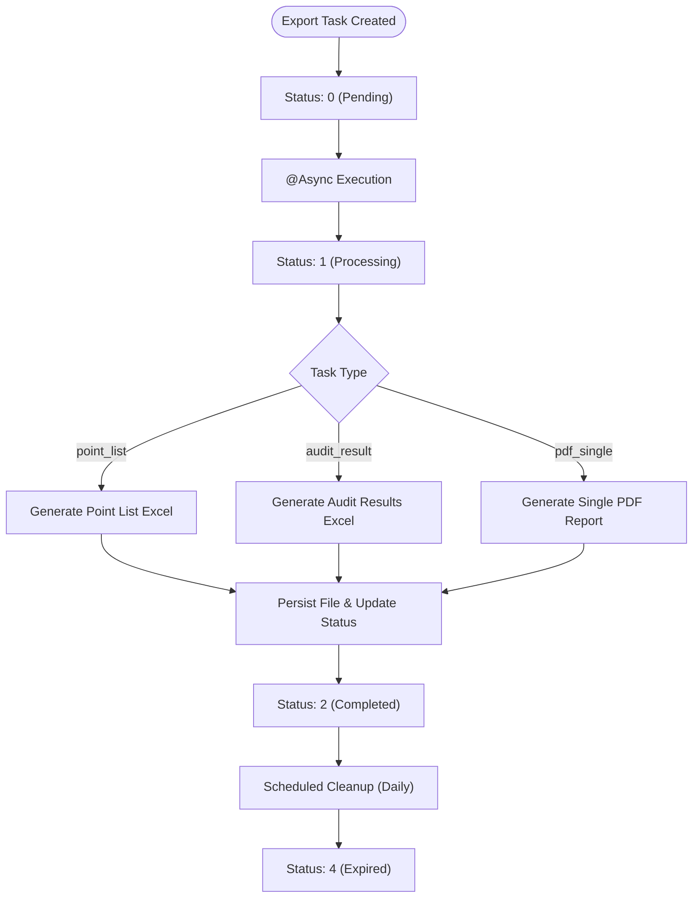

**Diagram sources**
- [ExportTaskProcessor.java:71-124](file://admin-backend/src/main/java/com/qhiot/survey/service/ExportTaskProcessor.java#L71-L124)
- [ExportTaskProcessor.java:187-212](file://admin-backend/src/main/java/com/qhiot/survey/service/ExportTaskProcessor.java#L187-L212)

### ExportTask Entity
Manages export task lifecycle and metadata:
- **Task Types**: point_list, audit_result, pdf_single with specialized processing requirements.
- **Status Tracking**: Complete lifecycle management with detailed status codes.
- **File Management**: Stores file URLs, names, sizes, and expiration times.
- **Error Handling**: Captures and stores detailed error messages for failed tasks.
- **Project Filtering**: Supports project-specific exports for targeted reporting.

**Section sources**
- [ExportTaskProcessor.java:45-443](file://admin-backend/src/main/java/com/qhiot/survey/service/ExportTaskProcessor.java#L45-L443)
- [ExportTask.java:14-63](file://admin-backend/src/main/java/com/qhiot/survey/entity/ExportTask.java#L14-L63)
- [ExportTaskMapper.java:1-9](file://admin-backend/src/main/java/com/qhiot/survey/mapper/ExportTaskMapper.java#L1-L9)

## Enhanced Conflict Resolution
**UPGRADED** The conflict resolution system now provides sophisticated handling for offline data synchronization:

### Advanced Resolution Strategies
- **Server Wins**: Retains server data and skips client modifications, useful for maintaining centralized control.
- **Client Wins**: Accepts client data and updates server records, preserving field-level client modifications.
- **Merge Strategy**: Sophisticated field-level merging with client data taking precedence over server data for overlapping fields.

### Enhanced Implementation Details
- **Field-Level Merging**: The merge strategy performs deep merging of JSON structures, preserving server-side data where client data is absent.
- **Validation Integration**: Enhanced validation ensures merged data maintains structural integrity and required field presence.
- **Logging and Monitoring**: Comprehensive logging tracks resolution decisions with detailed audit trails.
- **Error Handling**: Improved error handling with specific error messages for different conflict scenarios.

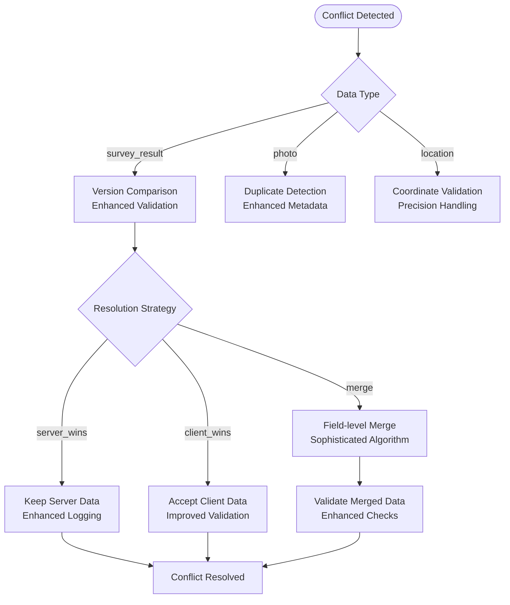

**Diagram sources**
- [OfflineDataSyncServiceImpl.java:240-283](file://admin-backend/src/main/java/com/qhiot/survey/service/impl/OfflineDataSyncServiceImpl.java#L240-L283)
- [OfflineDataSyncServiceImpl.java:625-635](file://admin-backend/src/main/java/com/qhiot/survey/service/impl/OfflineDataSyncServiceImpl.java#L625-L635)

**Section sources**
- [OfflineDataSyncServiceImpl.java:240-283](file://admin-backend/src/main/java/com/qhiot/survey/service/impl/OfflineDataSyncServiceImpl.java#L240-L283)
- [OfflineDataSyncServiceImpl.java:625-635](file://admin-backend/src/main/java/com/qhiot/survey/service/impl/OfflineDataSyncServiceImpl.java#L625-L635)

## Dependency Analysis
- Controller depends on OfflineDataSyncService for offline synchronization.
- ServiceImpl depends on OfflineDataSyncMapper and business mappers (SurveyResult, SurveyPoint, SysFile, LocationCorrectionLog).
- ExportTaskProcessor operates independently with its own mappers and utilities.
- Entities reflect relationships with business tables and are persisted via MyBatis.
- Enhanced dependency graph with export task processing integration.

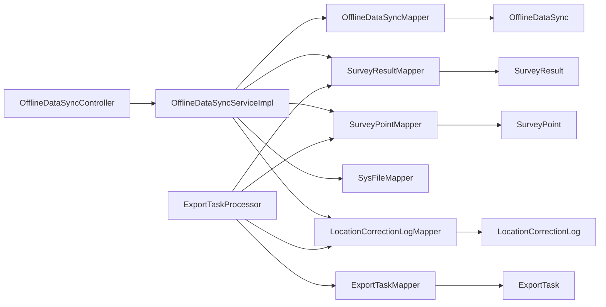

**Diagram sources**
- [OfflineDataSyncController.java:22-24](file://admin-backend/src/main/java/com/qhiot/survey/controller/OfflineDataSyncController.java#L22-L24)
- [OfflineDataSyncServiceImpl.java:40-43](file://admin-backend/src/main/java/com/qhiot/survey/service/impl/OfflineDataSyncServiceImpl.java#L40-L43)
- [ExportTaskProcessor.java:47-57](file://admin-backend/src/main/java/com/qhiot/survey/service/ExportTaskProcessor.java#L47-L57)
- [OfflineDataSyncMapper.java:10-12](file://admin-backend/src/main/java/com/qhiot/survey/mapper/OfflineDataSyncMapper.java#L10-L12)
- [ExportTaskMapper.java:1-9](file://admin-backend/src/main/java/com/qhiot/survey/mapper/ExportTaskMapper.java#L1-L9)

**Section sources**
- [OfflineDataSyncController.java:22-24](file://admin-backend/src/main/java/com/qhiot/survey/controller/OfflineDataSyncController.java#L22-L24)
- [OfflineDataSyncServiceImpl.java:40-43](file://admin-backend/src/main/java/com/qhiot/survey/service/impl/OfflineDataSyncServiceImpl.java#L40-L43)

## Performance Considerations
- **Asynchronous Processing**: Enhanced triggerAsyncSync processes pending records without blocking the receive response.
- **Pagination**: getPendingSyncData supports pagination to avoid large in-memory lists.
- **Enhanced Indexes**: offline_data_sync table includes comprehensive indexes on device_id, user_id, sync_status, data_type, and create_time to optimize queries.
- **Configurable Retry Caps**: maxRetryCount prevents infinite loops and reduces load with enhanced logging.
- **Deduplication**: photo synchronization avoids duplicate inserts via filePath+bizId checks with improved performance.
- **Export Task Isolation**: ExportTaskProcessor operates independently with separate thread pools and resource management.
- **Scheduled Cleanup**: Automated cleanup of expired export files reduces storage overhead.
- **Enhanced Error Handling**: Improved error isolation prevents cascading failures in the system.

## Troubleshooting Guide
Common issues and enhanced remedies:
- **Record not found**: syncData validates existence and already-synced state with detailed error messages.
- **Unsupported data type**: syncData throws on unknown dataType with enhanced validation.
- **Enhanced validation failures**: Missing required fields (e.g., pointId, filePath, corrected coordinates) cause exceptions with detailed error reporting.
- **Conflict without resolution hint**: survey_result version conflicts require explicit conflictResolution with improved guidance.
- **Enhanced retry limits**: Once max retries reached, records are marked failed with detailed error messages; use retrySync to reset and re-run.
- **Export task failures**: ExportTaskProcessor provides detailed error messages and status tracking for failed export operations.
- **Cleanup operations**: Use cleanupExpiredRecords to remove old synced records and cleanupExpiredExports for export files.
- **Conflict resolution debugging**: Enhanced logging provides detailed audit trails for conflict resolution decisions.

**Section sources**
- [OfflineDataSyncServiceImpl.java:120-128](file://admin-backend/src/main/java/com/qhiot/survey/service/impl/OfflineDataSyncServiceImpl.java#L120-L128)
- [OfflineDataSyncServiceImpl.java:146-148](file://admin-backend/src/main/java/com/qhiot/survey/service/impl/OfflineDataSyncServiceImpl.java#L146-L148)
- [OfflineDataSyncServiceImpl.java:378-383](file://admin-backend/src/main/java/com/qhiot/survey/service/impl/OfflineDataSyncServiceImpl.java#L378-L383)
- [OfflineDataSyncServiceImpl.java:285-306](file://admin-backend/src/main/java/com/qhiot/survey/service/impl/OfflineDataSyncServiceImpl.java#L285-L306)
- [ExportTaskProcessor.java:120-123](file://admin-backend/src/main/java/com/qhiot/survey/service/ExportTaskProcessor.java#L120-123)
- [ExportTaskProcessor.java:202-204](file://admin-backend/src/main/java/com/qhiot/survey/service/ExportTaskProcessor.java#L202-204)

## Conclusion
The enhanced offline-first synchronization system provides robust handling of disconnected scenarios through structured offline records, asynchronous processing, and sophisticated conflict resolution. The system now includes comprehensive export functionality for data reporting and analysis, with the mobile app's draft management integrating seamlessly with backend endpoints. The backend ensures data consistency across survey results, photos, and locations through advanced conflict detection and resolution strategies. Enhanced retry logic, manual conflict resolution, automated cleanup policies, and independent export task processing support operational reliability and scalability.

## Appendices

### API Definitions
- **Receive offline data**
  - Method: POST
  - Path: /api/v1/offline-sync/receive
  - Headers: Device-Id (required), userId (required)
  - Body: Array of objects with dataType, dataId, dataContent, versionNo
  - Response: {successCount, failCount, errors, message}

- **Get pending sync data**
  - Method: GET
  - Path: /api/v1/offline-sync/pending
  - Headers: Device-Id (required)
  - Query: pageNum, pageSize
  - Response: Paginated list of OfflineDataSync

- **Sync single record**
  - Method: POST
  - Path: /api/v1/offline-sync/sync/{syncId}
  - Response: {success, message}

- **Batch sync**
  - Method: POST
  - Path: /api/v1/offline-sync/sync/batch
  - Body: Array of syncId
  - Response: {totalCount, successCount, failCount, details}

- **Get sync status**
  - Method: GET
  - Path: /api/v1/offline-sync/status
  - Headers: Device-Id (required)
  - Response: {total, pending, syncing, completed, failed, lastSyncTime}

- **Resolve conflict**
  - Method: POST
  - Path: /api/v1/offline-sync/conflict/{syncId}?resolution={server|client|merge}
  - Body: {mergedData?} (required for merge)
  - Response: {success, message, resolution}

- **Retry failed sync**
  - Method: POST
  - Path: /api/v1/offline-sync/retry/{syncId}
  - Response: Delegates to syncData for the given record

- **Cleanup expired records**
  - Method: POST
  - Path: /api/v1/offline-sync/cleanup?days={default 30}
  - Response: Count of deleted records

**Section sources**
- [OfflineDataSyncController.java:26-93](file://admin-backend/src/main/java/com/qhiot/survey/controller/OfflineDataSyncController.java#L26-L93)

### Enhanced Database Schema Notes
- **offline_data_sync**: Supports comprehensive indexing for efficient queries and JSON dataContent for flexible payloads with enhanced constraints.
- **export_task**: NEW - Manages export task lifecycle with status tracking, file management, and expiration handling.
- **Related business tables**: survey_result, survey_point, location_correction_log with enhanced relationships.
- **Index optimization**: Enhanced indexing strategies for improved query performance across all tables.

**Section sources**
- [offline_data_sync.sql:4-27](file://admin-backend/init-data/03-offline-data-sync.sql#L4-L27)
- [ExportTask.java:14-63](file://admin-backend/src/main/java/com/qhiot/survey/entity/ExportTask.java#L14-L63)
- [SurveyResult.java:16-93](file://admin-backend/src/main/java/com/qhiot/survey/entity/SurveyResult.java#L16-L93)
- [SurveyPoint.java:19-84](file://admin-backend/src/main/java/com/qhiot/survey/entity/SurveyPoint.java#L19-L84)
- [LocationCorrectionLog.java:16-37](file://admin-backend/src/main/java/com/qhiot/survey/entity/LocationCorrectionLog.java#L16-L37)

### Export Task Processing API
**NEW** - Export task management endpoints:
- **Create export task**
  - Method: POST
  - Path: /api/v1/export/tasks
  - Body: {taskType, projectId?, pointId?, resultId?}
  - Response: {taskId, status, message}

- **Get export task status**
  - Method: GET
  - Path: /api/v1/export/tasks/{taskId}
  - Response: {status, fileName, fileSize, fileUrl, errorMsg}

- **Download exported file**
  - Method: GET
  - Path: /api/v1/export/download/{taskId}
  - Response: Binary file content

- **Cleanup expired exports**
  - Method: POST
  - Path: /api/v1/export/cleanup?days={default 7}
  - Response: Count of deleted export files

**Section sources**
- [ExportTaskProcessor.java:71-124](file://admin-backend/src/main/java/com/qhiot/survey/service/ExportTaskProcessor.java#L71-L124)
- [ExportTaskProcessor.java:187-212](file://admin-backend/src/main/java/com/qhiot/survey/service/ExportTaskProcessor.java#L187-L212)