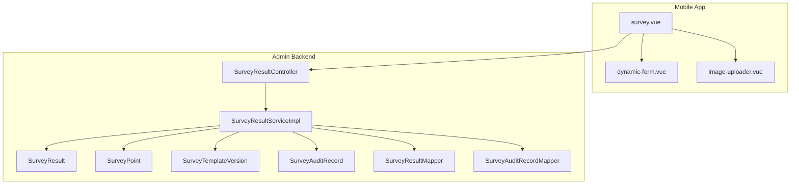
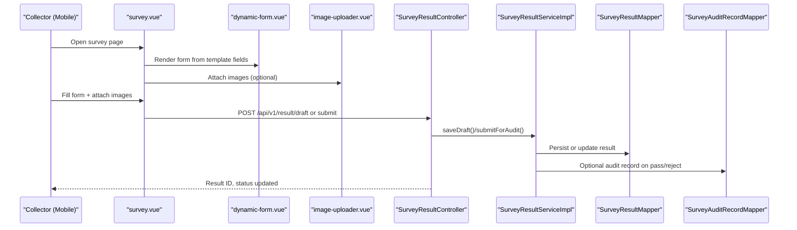
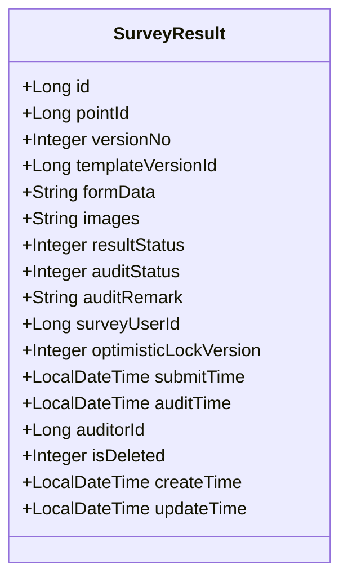
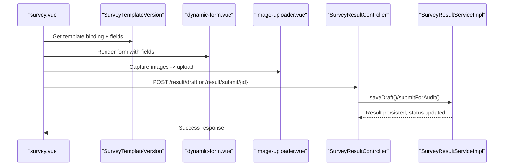
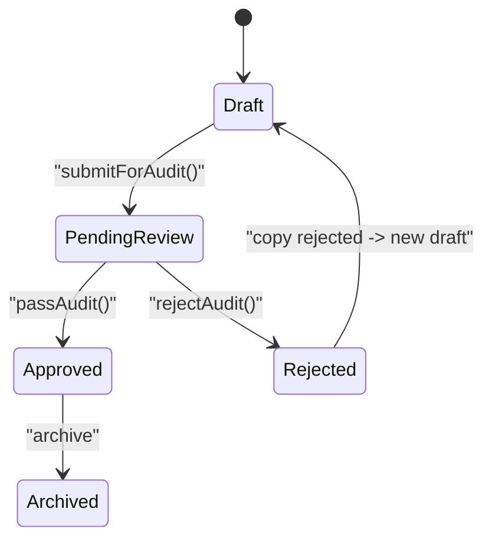
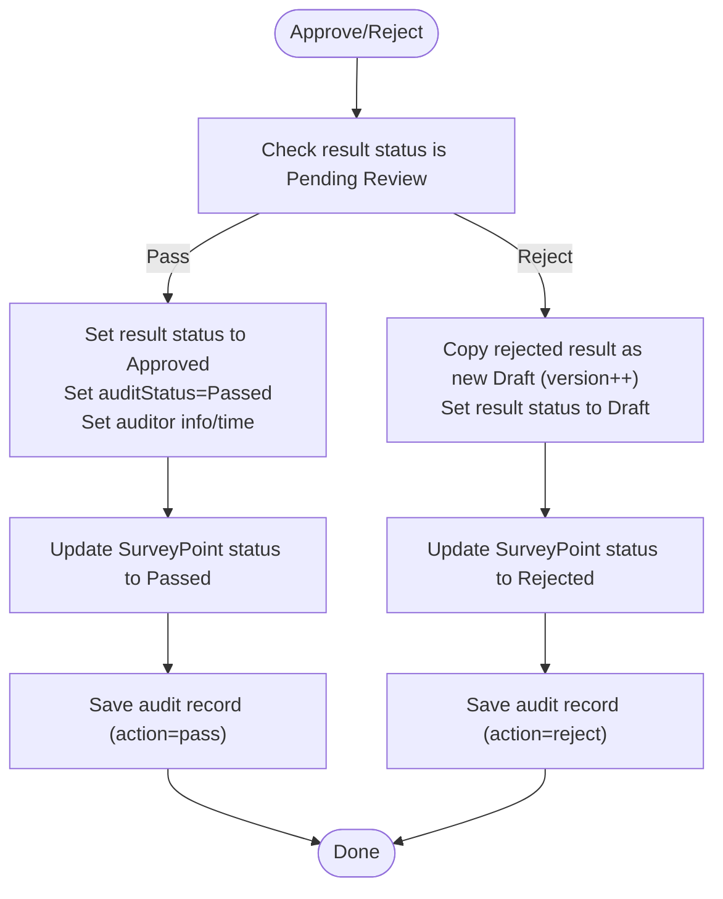
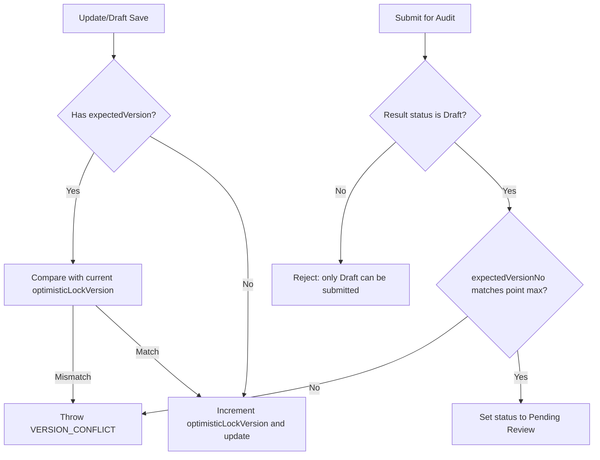
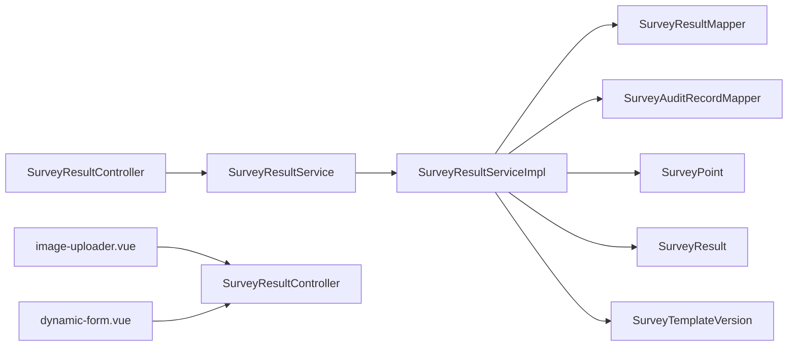

# Survey Result Processing

<cite>
**Referenced Files in This Document**
- [SurveyResult.java](file://admin-backend/src/main/java/com/qhiot/survey/entity/SurveyResult.java)
- [SurveyResultController.java](file://admin-backend/src/main/java/com/qhiot/survey/controller/SurveyResultController.java)
- [SurveyResultService.java](file://admin-backend/src/main/java/com/qhiot/survey/service/SurveyResultService.java)
- [SurveyResultServiceImpl.java](file://admin-backend/src/main/java/com/qhiot/survey/service/impl/SurveyResultServiceImpl.java)
- [SurveyResultMapper.java](file://admin-backend/src/main/java/com/qhiot/survey/mapper/SurveyResultMapper.java)
- [ResultStatus.java](file://admin-backend/src/main/java/com/qhiot/survey/common/enums/ResultStatus.java)
- [AuditStatus.java](file://admin-backend/src/main/java/com/qhiot/survey/common/enums/AuditStatus.java)
- [SurveyAuditRecord.java](file://admin-backend/src/main/java/com/qhiot/survey/entity/SurveyAuditRecord.java)
- [SurveyAuditRecordMapper.java](file://admin-backend/src/main/java/com/qhiot/survey/mapper/SurveyAuditRecordMapper.java)
- [SurveyPoint.java](file://admin-backend/src/main/java/com/qhiot/survey/entity/SurveyPoint.java)
- [SurveyPointStatus.java](file://admin-backend/src/main/java/com/qhiot/survey/common/enums/SurveyPointStatus.java)
- [SurveyTemplateVersion.java](file://admin-backend/src/main/java/com/qhiot/survey/entity/SurveyTemplateVersion.java)
- [SysUser.java](file://admin-backend/src/main/java/com/qhiot/survey/entity/SysUser.java)
- [survey.vue](file://mobile-app/src/pages/survey/survey.vue)
- [dynamic-form.vue](file://mobile-app/src/components/dynamic-form/dynamic-form.vue)
- [image-uploader.vue](file://mobile-app/src/components/image-uploader/image-uploader.vue)
</cite>

## Table of Contents
1. [Introduction](#introduction)
2. [Project Structure](#project-structure)
3. [Core Components](#core-components)
4. [Architecture Overview](#architecture-overview)
5. [Detailed Component Analysis](#detailed-component-analysis)
6. [Dependency Analysis](#dependency-analysis)
7. [Performance Considerations](#performance-considerations)
8. [Troubleshooting Guide](#troubleshooting-guide)
9. [Conclusion](#conclusion)
10. [Appendices](#appendices)

## Introduction
This document describes the survey result processing pipeline end-to-end. It covers the SurveyResult entity structure, form data storage, image handling, status management, audit trails, and the complete workflow from mobile app submission to backend processing. It also documents the result status lifecycle, state transitions, and integrations with survey points, template versions, and user authentication systems.

## Project Structure
The survey result pipeline spans two modules:
- Mobile app (data capture and submission)
- Admin backend (business logic, persistence, audit, and APIs)

Key backend components:
- Entity: SurveyResult, SurveyPoint, SurveyTemplateVersion, SurveyAuditRecord, SysUser
- Service: SurveyResultService and its implementation
- Mapper: SurveyResultMapper and SurveyAuditRecordMapper
- Controller: SurveyResultController exposing REST endpoints
- Enums: ResultStatus, AuditStatus, SurveyPointStatus

**Diagram sources**
- [survey.vue:1-159](file://mobile-app/src/pages/survey/survey.vue#L1-L159)
- [dynamic-form.vue:1-336](file://mobile-app/src/components/dynamic-form/dynamic-form.vue#L1-L336)
- [image-uploader.vue:1-319](file://mobile-app/src/components/image-uploader/image-uploader.vue#L1-L319)
- [SurveyResultController.java:1-181](file://admin-backend/src/main/java/com/qhiot/survey/controller/SurveyResultController.java#L1-L181)
- [SurveyResultServiceImpl.java:1-364](file://admin-backend/src/main/java/com/qhiot/survey/service/impl/SurveyResultServiceImpl.java#L1-L364)
- [SurveyResult.java:1-93](file://admin-backend/src/main/java/com/qhiot/survey/entity/SurveyResult.java#L1-L93)
- [SurveyPoint.java:1-84](file://admin-backend/src/main/java/com/qhiot/survey/entity/SurveyPoint.java#L1-L84)
- [SurveyTemplateVersion.java:1-38](file://admin-backend/src/main/java/com/qhiot/survey/entity/SurveyTemplateVersion.java#L1-L38)
- [SurveyAuditRecord.java:1-37](file://admin-backend/src/main/java/com/qhiot/survey/entity/SurveyAuditRecord.java#L1-L37)
- [SurveyResultMapper.java:1-22](file://admin-backend/src/main/java/com/qhiot/survey/mapper/SurveyResultMapper.java#L1-L22)
- [SurveyAuditRecordMapper.java:1-22](file://admin-backend/src/main/java/com/qhiot/survey/mapper/SurveyAuditRecordMapper.java#L1-L22)

**Section sources**
- [SurveyResultController.java:1-181](file://admin-backend/src/main/java/com/qhiot/survey/controller/SurveyResultController.java#L1-L181)
- [SurveyResultServiceImpl.java:1-364](file://admin-backend/src/main/java/com/qhiot/survey/service/impl/SurveyResultServiceImpl.java#L1-L364)
- [SurveyResult.java:1-93](file://admin-backend/src/main/java/com/qhiot/survey/entity/SurveyResult.java#L1-L93)
- [SurveyPoint.java:1-84](file://admin-backend/src/main/java/com/qhiot/survey/entity/SurveyPoint.java#L1-L84)
- [SurveyTemplateVersion.java:1-38](file://admin-backend/src/main/java/com/qhiot/survey/entity/SurveyTemplateVersion.java#L1-L38)
- [SurveyAuditRecord.java:1-37](file://admin-backend/src/main/java/com/qhiot/survey/entity/SurveyAuditRecord.java#L1-L37)
- [SurveyResultMapper.java:1-22](file://admin-backend/src/main/java/com/qhiot/survey/mapper/SurveyResultMapper.java#L1-L22)
- [SurveyAuditRecordMapper.java:1-22](file://admin-backend/src/main/java/com/qhiot/survey/mapper/SurveyAuditRecordMapper.java#L1-L22)
- [survey.vue:1-159](file://mobile-app/src/pages/survey/survey.vue#L1-L159)
- [dynamic-form.vue:1-336](file://mobile-app/src/components/dynamic-form/dynamic-form.vue#L1-L336)
- [image-uploader.vue:1-319](file://mobile-app/src/components/image-uploader/image-uploader.vue#L1-L319)

## Core Components
- SurveyResult: Stores form data, images, status, audit info, and metadata. Uses logical deletion and optimistic locking.
- SurveyResultService/Impl: Orchestrates creation, updates, submissions, audits, and version diffs.
- SurveyResultController: Exposes REST endpoints for CRUD, submission, audit actions, and paging.
- SurveyPoint: Links results to projects/sections and maintains point-level status.
- SurveyTemplateVersion: Provides field/rule definitions used to render forms in the mobile app.
- SurveyAuditRecord: Captures audit decisions and comments for traceability.
- Enums: ResultStatus, AuditStatus, SurveyPointStatus define lifecycle and statuses.

**Section sources**
- [SurveyResult.java:1-93](file://admin-backend/src/main/java/com/qhiot/survey/entity/SurveyResult.java#L1-L93)
- [SurveyResultService.java:1-81](file://admin-backend/src/main/java/com/qhiot/survey/service/SurveyResultService.java#L1-L81)
- [SurveyResultServiceImpl.java:1-364](file://admin-backend/src/main/java/com/qhiot/survey/service/impl/SurveyResultServiceImpl.java#L1-L364)
- [SurveyResultController.java:1-181](file://admin-backend/src/main/java/com/qhiot/survey/controller/SurveyResultController.java#L1-L181)
- [SurveyPoint.java:1-84](file://admin-backend/src/main/java/com/qhiot/survey/entity/SurveyPoint.java#L1-L84)
- [SurveyTemplateVersion.java:1-38](file://admin-backend/src/main/java/com/qhiot/survey/entity/SurveyTemplateVersion.java#L1-L38)
- [SurveyAuditRecord.java:1-37](file://admin-backend/src/main/java/com/qhiot/survey/entity/SurveyAuditRecord.java#L1-L37)
- [ResultStatus.java:1-33](file://admin-backend/src/main/java/com/qhiot/survey/common/enums/ResultStatus.java#L1-L33)
- [AuditStatus.java:1-30](file://admin-backend/src/main/java/com/qhiot/survey/common/enums/AuditStatus.java#L1-L30)
- [SurveyPointStatus.java:1-34](file://admin-backend/src/main/java/com/qhiot/survey/common/enums/SurveyPointStatus.java#L1-L34)

## Architecture Overview
The pipeline integrates mobile data capture with backend processing and auditing:
- Mobile app renders dynamic forms from template definitions, collects form data and images, and submits to backend.
- Backend validates permissions, enforces concurrency via optimistic locking and version checks, and transitions statuses.
- Audit records persist reviewer actions and comments.

**Diagram sources**
- [survey.vue:1-159](file://mobile-app/src/pages/survey/survey.vue#L1-L159)
- [dynamic-form.vue:1-336](file://mobile-app/src/components/dynamic-form/dynamic-form.vue#L1-L336)
- [image-uploader.vue:1-319](file://mobile-app/src/components/image-uploader/image-uploader.vue#L1-L319)
- [SurveyResultController.java:1-181](file://admin-backend/src/main/java/com/qhiot/survey/controller/SurveyResultController.java#L1-L181)
- [SurveyResultServiceImpl.java:1-364](file://admin-backend/src/main/java/com/qhiot/survey/service/impl/SurveyResultServiceImpl.java#L1-L364)
- [SurveyResultMapper.java:1-22](file://admin-backend/src/main/java/com/qhiot/survey/mapper/SurveyResultMapper.java#L1-L22)
- [SurveyAuditRecordMapper.java:1-22](file://admin-backend/src/main/java/com/qhiot/survey/mapper/SurveyAuditRecordMapper.java#L1-L22)

## Detailed Component Analysis

### SurveyResult Entity and Data Model
- Identifiers and metadata: id, pointId, templateVersionId, surveyUserId, timestamps.
- Versioning: versionNo increments per point; used for ordering and concurrency checks.
- Form data: formData stored as JSON string; images stored as JSON array of URLs.
- Status: resultStatus (draft/submitted/pending/rejected/archived) and auditStatus (pending/pass/rejected).
- Audit trail: auditRemark, auditorId, auditTime; submitTime tracks submission.
- Concurrency: optimisticLockVersion supports optimistic locking.
- Soft delete: isDeleted with MyBatis-Plus logical delete.

**Diagram sources**
- [SurveyResult.java:1-93](file://admin-backend/src/main/java/com/qhiot/survey/entity/SurveyResult.java#L1-L93)

**Section sources**
- [SurveyResult.java:1-93](file://admin-backend/src/main/java/com/qhiot/survey/entity/SurveyResult.java#L1-L93)

### Result Submission Workflow (Mobile to Backend)
- Dynamic form rendering: survey.vue loads template bindings and fields from SurveyTemplateVersion, then renders dynamic-form.vue.
- Image handling: image-uploader.vue manages uploads and emits uploaded URLs to be included in formData.
- Draft/save: mobile calls saveDraft endpoint; backend creates or updates a draft with optimisticLockVersion increment.
- Submit for audit: mobile calls submit endpoint with optional expected version number; backend validates ownership, status, and version consistency.

**Diagram sources**
- [survey.vue:1-159](file://mobile-app/src/pages/survey/survey.vue#L1-L159)
- [dynamic-form.vue:1-336](file://mobile-app/src/components/dynamic-form/dynamic-form.vue#L1-L336)
- [image-uploader.vue:1-319](file://mobile-app/src/components/image-uploader/image-uploader.vue#L1-L319)
- [SurveyResultController.java:1-181](file://admin-backend/src/main/java/com/qhiot/survey/controller/SurveyResultController.java#L1-L181)
- [SurveyResultServiceImpl.java:1-364](file://admin-backend/src/main/java/com/qhiot/survey/service/impl/SurveyResultServiceImpl.java#L1-L364)
- [SurveyTemplateVersion.java:1-38](file://admin-backend/src/main/java/com/qhiot/survey/entity/SurveyTemplateVersion.java#L1-L38)

**Section sources**
- [survey.vue:1-159](file://mobile-app/src/pages/survey/survey.vue#L1-L159)
- [dynamic-form.vue:1-336](file://mobile-app/src/components/dynamic-form/dynamic-form.vue#L1-L336)
- [image-uploader.vue:1-319](file://mobile-app/src/components/image-uploader/image-uploader.vue#L1-L319)
- [SurveyResultController.java:1-181](file://admin-backend/src/main/java/com/qhiot/survey/controller/SurveyResultController.java#L1-L181)
- [SurveyResultServiceImpl.java:1-364](file://admin-backend/src/main/java/com/qhiot/survey/service/impl/SurveyResultServiceImpl.java#L1-L364)
- [SurveyTemplateVersion.java:1-38](file://admin-backend/src/main/java/com/qhiot/survey/entity/SurveyTemplateVersion.java#L1-L38)

### Result Status Lifecycle and Transitions
States:
- Draft, Submitted, Pending Review, Approved, Rejected, Archived

Transitions:
- Draft → Pending Review upon submitForAudit (collector)
- Pending Review → Approved upon passAudit (auditor)
- Pending Review → Rejected → New Draft (copy of rejected version) (auditor)
- Approved → Archived (optional archival step)

**Diagram sources**
- [ResultStatus.java:1-33](file://admin-backend/src/main/java/com/qhiot/survey/common/enums/ResultStatus.java#L1-L33)
- [AuditStatus.java:1-30](file://admin-backend/src/main/java/com/qhiot/survey/common/enums/AuditStatus.java#L1-L30)
- [SurveyResultServiceImpl.java:1-364](file://admin-backend/src/main/java/com/qhiot/survey/service/impl/SurveyResultServiceImpl.java#L1-L364)

**Section sources**
- [ResultStatus.java:1-33](file://admin-backend/src/main/java/com/qhiot/survey/common/enums/ResultStatus.java#L1-L33)
- [AuditStatus.java:1-30](file://admin-backend/src/main/java/com/qhiot/survey/common/enums/AuditStatus.java#L1-L30)
- [SurveyResultServiceImpl.java:1-364](file://admin-backend/src/main/java/com/qhiot/survey/service/impl/SurveyResultServiceImpl.java#L1-L364)

### Audit Trail and Point Status Integration
- Audit decisions are recorded in SurveyAuditRecord with action, comment, and timestamps.
- On approval, the associated SurveyPoint status is updated to passed; on rejection, point status moves to rejected.
- Latest audit record retrieval is supported via SurveyAuditRecordMapper.

**Diagram sources**
- [SurveyResultServiceImpl.java:1-364](file://admin-backend/src/main/java/com/qhiot/survey/service/impl/SurveyResultServiceImpl.java#L1-L364)
- [SurveyAuditRecord.java:1-37](file://admin-backend/src/main/java/com/qhiot/survey/entity/SurveyAuditRecord.java#L1-L37)
- [SurveyAuditRecordMapper.java:1-22](file://admin-backend/src/main/java/com/qhiot/survey/mapper/SurveyAuditRecordMapper.java#L1-L22)
- [SurveyPoint.java:1-84](file://admin-backend/src/main/java/com/qhiot/survey/entity/SurveyPoint.java#L1-L84)
- [SurveyPointStatus.java:1-34](file://admin-backend/src/main/java/com/qhiot/survey/common/enums/SurveyPointStatus.java#L1-L34)

**Section sources**
- [SurveyResultServiceImpl.java:1-364](file://admin-backend/src/main/java/com/qhiot/survey/service/impl/SurveyResultServiceImpl.java#L1-L364)
- [SurveyAuditRecord.java:1-37](file://admin-backend/src/main/java/com/qhiot/survey/entity/SurveyAuditRecord.java#L1-L37)
- [SurveyAuditRecordMapper.java:1-22](file://admin-backend/src/main/java/com/qhiot/survey/mapper/SurveyAuditRecordMapper.java#L1-L22)
- [SurveyPoint.java:1-84](file://admin-backend/src/main/java/com/qhiot/survey/entity/SurveyPoint.java#L1-L84)
- [SurveyPointStatus.java:1-34](file://admin-backend/src/main/java/com/qhiot/survey/common/enums/SurveyPointStatus.java#L1-L34)

### Data Validation, Duplicate Detection, and Conflict Resolution
- Validation:
  - Mobile-side validation in dynamic-form.vue ensures required fields and formats.
  - Backend enforces ownership checks and status constraints.
- Duplicate detection:
  - Not implemented in the reviewed code; latest result by point is retrieved via SQL ORDER BY version_no DESC LIMIT 1.
- Conflict resolution:
  - Optimistic locking via optimisticLockVersion prevents concurrent edits.
  - Submit endpoint accepts expectedVersionNo to detect version conflicts and prevent stale updates.

**Diagram sources**
- [SurveyResultServiceImpl.java:1-364](file://admin-backend/src/main/java/com/qhiot/survey/service/impl/SurveyResultServiceImpl.java#L1-L364)
- [SurveyResultController.java:1-181](file://admin-backend/src/main/java/com/qhiot/survey/controller/SurveyResultController.java#L1-L181)

**Section sources**
- [SurveyResultServiceImpl.java:1-364](file://admin-backend/src/main/java/com/qhiot/survey/service/impl/SurveyResultServiceImpl.java#L1-L364)
- [SurveyResultController.java:1-181](file://admin-backend/src/main/java/com/qhiot/survey/controller/SurveyResultController.java#L1-L181)

### Examples and Operations

- Form data serialization:
  - dynamic-form.vue emits structured formData; image-uploader.vue emits an array of uploaded image objects. Both are serialized to JSON for storage in SurveyResult.formData and SurveyResult.images respectively.
  - Example path: [dynamic-form.vue:262-306](file://mobile-app/src/components/dynamic-form/dynamic-form.vue#L262-L306), [image-uploader.vue:215-223](file://mobile-app/src/components/image-uploader/image-uploader.vue#L215-L223)

- Image upload processing:
  - image-uploader.vue handles selection, compression, upload, and emits uploaded URLs. These URLs are stored in the images JSON array.
  - Example path: [image-uploader.vue:162-190](file://mobile-app/src/components/image-uploader/image-uploader.vue#L162-L190)

- Result aggregation queries:
  - Latest result by point: SurveyResultMapper selects the highest version_no for a given point.
  - Example path: [SurveyResultMapper.java:11-21](file://admin-backend/src/main/java/com/qhiot/survey/mapper/SurveyResultMapper.java#L11-L21)

- Batch operations:
  - Batch pass audit is supported via SurveyResultController and SurveyResultServiceImpl.
  - Example path: [SurveyResultController.java:122-132](file://admin-backend/src/main/java/com/qhiot/survey/controller/SurveyResultController.java#L122-L132), [SurveyResultServiceImpl.java:253-260](file://admin-backend/src/main/java/com/qhiot/survey/service/impl/SurveyResultServiceImpl.java#L253-L260)

- Version difference comparison:
  - getVersionDiff returns current vs compare formData/images/status for review.
  - Example path: [SurveyResultServiceImpl.java:343-363](file://admin-backend/src/main/java/com/qhiot/survey/service/impl/SurveyResultServiceImpl.java#L343-L363)

**Section sources**
- [dynamic-form.vue:262-306](file://mobile-app/src/components/dynamic-form/dynamic-form.vue#L262-L306)
- [image-uploader.vue:162-190](file://mobile-app/src/components/image-uploader/image-uploader.vue#L162-L190)
- [SurveyResultMapper.java:11-21](file://admin-backend/src/main/java/com/qhiot/survey/mapper/SurveyResultMapper.java#L11-L21)
- [SurveyResultController.java:122-132](file://admin-backend/src/main/java/com/qhiot/survey/controller/SurveyResultController.java#L122-L132)
- [SurveyResultServiceImpl.java:253-260](file://admin-backend/src/main/java/com/qhiot/survey/service/impl/SurveyResultServiceImpl.java#L253-L260)
- [SurveyResultServiceImpl.java:343-363](file://admin-backend/src/main/java/com/qhiot/survey/service/impl/SurveyResultServiceImpl.java#L343-L363)

### Integrations
- Survey points:
  - Results are bound to SurveyPoint via pointId; point status is updated on audit outcomes.
  - Example path: [SurveyPoint.java:1-84](file://admin-backend/src/main/java/com/qhiot/survey/entity/SurveyPoint.java#L1-L84), [SurveyResultServiceImpl.java:178-183](file://admin-backend/src/main/java/com/qhiot/survey/service/impl/SurveyResultServiceImpl.java#L178-L183)

- Template versions:
  - Mobile loads template fields from SurveyTemplateVersion to render dynamic forms.
  - Example path: [survey.vue:69-92](file://mobile-app/src/pages/survey/survey.vue#L69-L92), [SurveyTemplateVersion.java:1-38](file://admin-backend/src/main/java/com/qhiot/survey/entity/SurveyTemplateVersion.java#L1-L38)

- User authentication:
  - Controllers extract current user from SecurityContext and enforce role-based access (COLLECTOR, AUDITOR, ADMIN).
  - Example path: [SurveyResultController.java:170-180](file://admin-backend/src/main/java/com/qhiot/survey/controller/SurveyResultController.java#L170-L180), [SysUser.java:1-95](file://admin-backend/src/main/java/com/qhiot/survey/entity/SysUser.java#L1-L95)

**Section sources**
- [SurveyPoint.java:1-84](file://admin-backend/src/main/java/com/qhiot/survey/entity/SurveyPoint.java#L1-L84)
- [SurveyResultServiceImpl.java:178-183](file://admin-backend/src/main/java/com/qhiot/survey/service/impl/SurveyResultServiceImpl.java#L178-L183)
- [survey.vue:69-92](file://mobile-app/src/pages/survey/survey.vue#L69-L92)
- [SurveyTemplateVersion.java:1-38](file://admin-backend/src/main/java/com/qhiot/survey/entity/SurveyTemplateVersion.java#L1-L38)
- [SurveyResultController.java:170-180](file://admin-backend/src/main/java/com/qhiot/survey/controller/SurveyResultController.java#L170-L180)
- [SysUser.java:1-95](file://admin-backend/src/main/java/com/qhiot/survey/entity/SysUser.java#L1-L95)

## Dependency Analysis
- Controllers depend on Services for business logic.
- Services depend on Mappers for persistence and on Entities for domain modeling.
- Mobile app depends on backend APIs and template definitions.

**Diagram sources**
- [SurveyResultController.java:1-181](file://admin-backend/src/main/java/com/qhiot/survey/controller/SurveyResultController.java#L1-L181)
- [SurveyResultService.java:1-81](file://admin-backend/src/main/java/com/qhiot/survey/service/SurveyResultService.java#L1-L81)
- [SurveyResultServiceImpl.java:1-364](file://admin-backend/src/main/java/com/qhiot/survey/service/impl/SurveyResultServiceImpl.java#L1-L364)
- [SurveyResultMapper.java:1-22](file://admin-backend/src/main/java/com/qhiot/survey/mapper/SurveyResultMapper.java#L1-L22)
- [SurveyAuditRecordMapper.java:1-22](file://admin-backend/src/main/java/com/qhiot/survey/mapper/SurveyAuditRecordMapper.java#L1-L22)
- [SurveyResult.java:1-93](file://admin-backend/src/main/java/com/qhiot/survey/entity/SurveyResult.java#L1-L93)
- [SurveyPoint.java:1-84](file://admin-backend/src/main/java/com/qhiot/survey/entity/SurveyPoint.java#L1-L84)
- [SurveyTemplateVersion.java:1-38](file://admin-backend/src/main/java/com/qhiot/survey/entity/SurveyTemplateVersion.java#L1-L38)
- [image-uploader.vue:1-319](file://mobile-app/src/components/image-uploader/image-uploader.vue#L1-L319)
- [dynamic-form.vue:1-336](file://mobile-app/src/components/dynamic-form/dynamic-form.vue#L1-L336)

**Section sources**
- [SurveyResultController.java:1-181](file://admin-backend/src/main/java/com/qhiot/survey/controller/SurveyResultController.java#L1-L181)
- [SurveyResultService.java:1-81](file://admin-backend/src/main/java/com/qhiot/survey/service/SurveyResultService.java#L1-L81)
- [SurveyResultServiceImpl.java:1-364](file://admin-backend/src/main/java/com/qhiot/survey/service/impl/SurveyResultServiceImpl.java#L1-L364)
- [SurveyResultMapper.java:1-22](file://admin-backend/src/main/java/com/qhiot/survey/mapper/SurveyResultMapper.java#L1-L22)
- [SurveyAuditRecordMapper.java:1-22](file://admin-backend/src/main/java/com/qhiot/survey/mapper/SurveyAuditRecordMapper.java#L1-L22)
- [SurveyResult.java:1-93](file://admin-backend/src/main/java/com/qhiot/survey/entity/SurveyResult.java#L1-L93)
- [SurveyPoint.java:1-84](file://admin-backend/src/main/java/com/qhiot/survey/entity/SurveyPoint.java#L1-L84)
- [SurveyTemplateVersion.java:1-38](file://admin-backend/src/main/java/com/qhiot/survey/entity/SurveyTemplateVersion.java#L1-L38)
- [image-uploader.vue:1-319](file://mobile-app/src/components/image-uploader/image-uploader.vue#L1-L319)
- [dynamic-form.vue:1-336](file://mobile-app/src/components/dynamic-form/dynamic-form.vue#L1-L336)

## Performance Considerations
- Use pagination for audit lists to avoid large result sets.
- Indexes on pointId, versionNo, resultStatus, and audit-related fields can improve query performance.
- Minimize JSON payload sizes by compressing images and avoiding unnecessary fields.
- Consider asynchronous processing for heavy operations (e.g., bulk audits) to keep endpoints responsive.

## Troubleshooting Guide
Common issues and resolutions:
- Version conflict during submit or update:
  - Cause: expectedVersionNo mismatch or outdated client version.
  - Action: refresh UI and retry submission/update.
  - Reference: [SurveyResultServiceImpl.java:288-306](file://admin-backend/src/main/java/com/qhiot/survey/service/impl/SurveyResultServiceImpl.java#L288-L306)
- Unauthorized operation:
  - Cause: non-owner editing or missing roles.
  - Action: ensure correct user session and roles.
  - Reference: [SurveyResultController.java:170-180](file://admin-backend/src/main/java/com/qhiot/survey/controller/SurveyResultController.java#L170-L180)
- Missing or invalid template binding:
  - Cause: point’s outfallType not bound to a template version.
  - Action: verify template binding and fields.
  - Reference: [survey.vue:75-81](file://mobile-app/src/pages/survey/survey.vue#L75-L81)
- Audit record not found:
  - Cause: querying latest audit record for a result without any audit history.
  - Action: ensure audit actions occurred before retrieving latest record.
  - Reference: [SurveyAuditRecordMapper.java:11-21](file://admin-backend/src/main/java/com/qhiot/survey/mapper/SurveyAuditRecordMapper.java#L11-L21)

**Section sources**
- [SurveyResultServiceImpl.java:288-306](file://admin-backend/src/main/java/com/qhiot/survey/service/impl/SurveyResultServiceImpl.java#L288-L306)
- [SurveyResultController.java:170-180](file://admin-backend/src/main/java/com/qhiot/survey/controller/SurveyResultController.java#L170-L180)
- [survey.vue:75-81](file://mobile-app/src/pages/survey/survey.vue#L75-L81)
- [SurveyAuditRecordMapper.java:11-21](file://admin-backend/src/main/java/com/qhiot/survey/mapper/SurveyAuditRecordMapper.java#L11-L21)

## Conclusion
The survey result processing pipeline combines a flexible dynamic form system with robust backend orchestration. It supports versioning, concurrency control, auditability, and point-level status alignment. The mobile app provides a seamless authoring experience, while the backend enforces business rules and maintains a complete audit trail.

## Appendices

### API Surface for Survey Results
- Create result: POST /api/v1/result/create
- Update result: PUT /api/v1/result/update/{id}?expectedVersion=...
- Delete result: DELETE /api/v1/result/delete/{id}
- Save draft: POST /api/v1/result/draft
- Submit for audit: POST /api/v1/result/submit/{id}?versionNo=...
- Approve audit: POST /api/v1/result/audit/{id}/pass?auditRemark=...
- Reject audit: POST /api/v1/result/audit/{id}/reject?auditRemark=...
- Batch approve: POST /api/v1/result/audit/batch-pass
- Query audit page: GET /api/v1/result/audit/page?projectId=&sectionId=&status=&pageNum=&pageSize=
- Get latest result by point: GET /api/v1/result/point/{pointId}/latest
- Get version diff: GET /api/v1/result/version/diff?currentId=&compareId=

**Section sources**
- [SurveyResultController.java:33-161](file://admin-backend/src/main/java/com/qhiot/survey/controller/SurveyResultController.java#L33-L161)