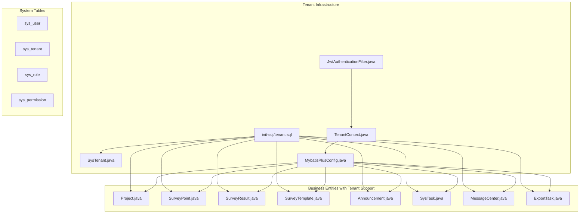
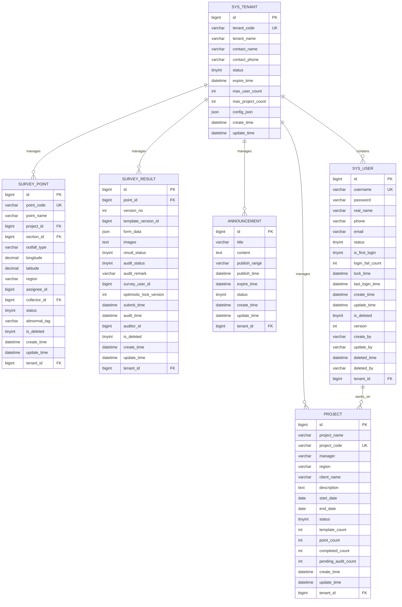
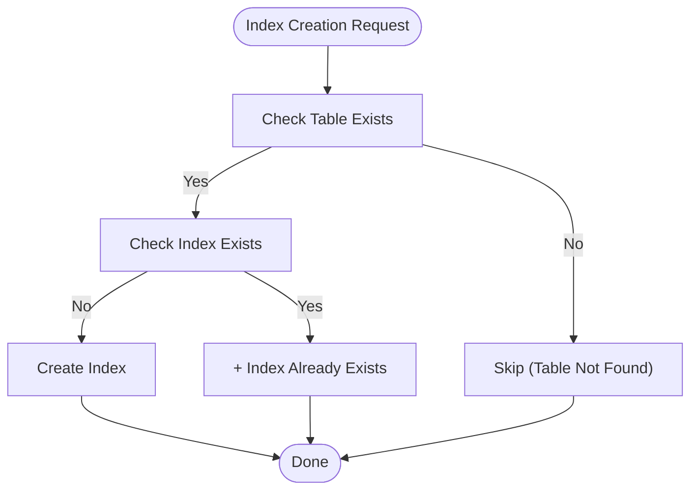
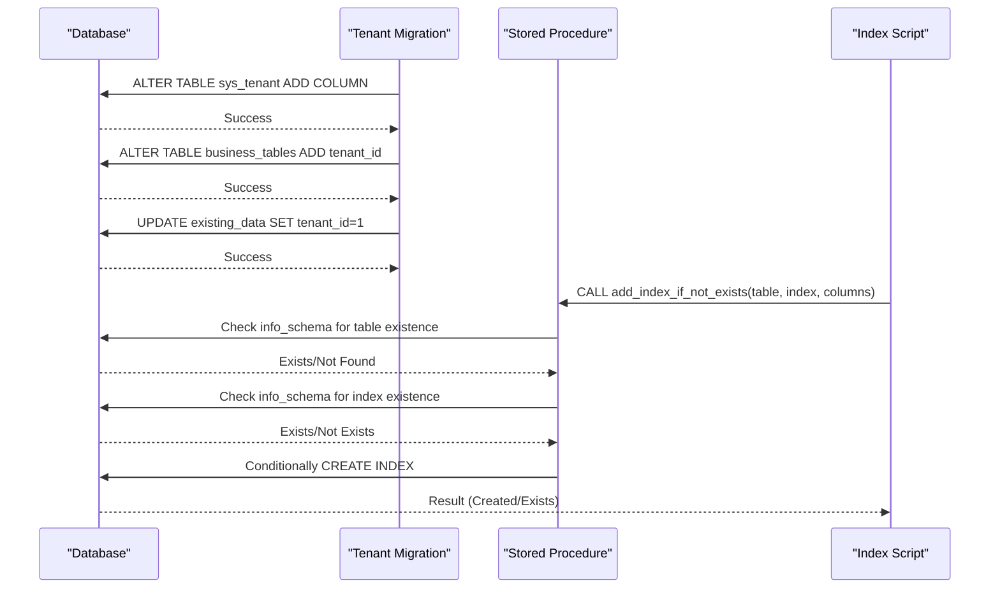
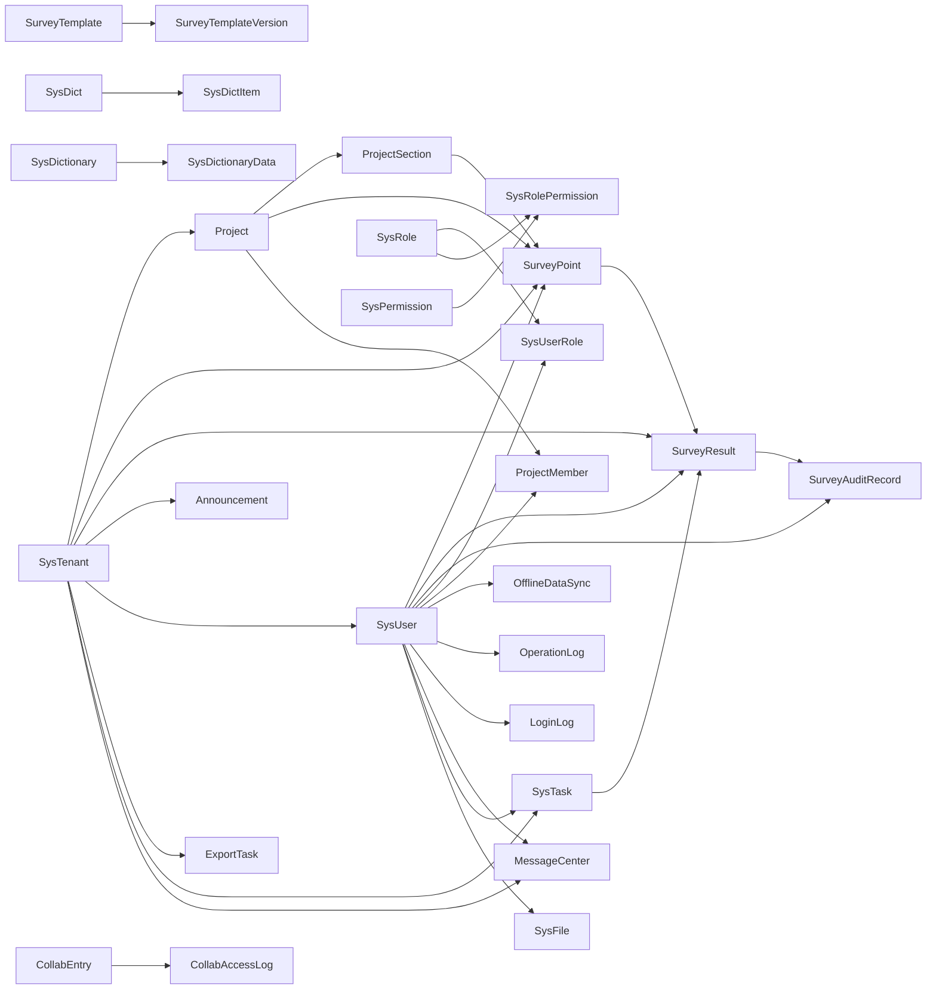

# Database Design

<cite>
**Referenced Files in This Document**
- [init.sql](file://init-sql/init.sql)
- [add_task_table.sql](file://init-sql/add_task_table.sql)
- [tenant.sql](file://init-sql/tenant.sql)
- [01-init.sql](file://admin-backend/init-data/01-init.sql)
- [02-role-tables.sql](file://admin-backend/init-data/02-role-tables.sql)
- [03-offline-data-sync.sql](file://admin-backend/init-data/03-offline-data-sync.sql)
- [04-export-task-columns.sql](file://admin-backend/init-data/04-export-task-columns.sql)
- [05-database-indexes.sql](file://admin-backend/init-data/05-database-indexes.sql)
- [add-database-indexes.sql](file://admin-backend/add-database-indexes.sql)
- [add-architecture-enhancements.sql](file://admin-backend/add-architecture-enhancements.sql)
- [V2__add_owner_user_id.sql](file://admin-backend/src/main/resources/db/migration/V2__add_owner_user_id.sql)
- [V3__add_category_and_data.sql](file://admin-backend/src/main/resources/db/migration/V3__add_category_and_data.sql)
- [dictionary_tables.sql](file://admin-backend/src/main/resources/db/dictionary_tables.sql)
- [project_member.sql](file://admin-backend/src/main/resources/db/project_member.sql)
- [SysTenant.java](file://admin-backend/src/main/java/com/qhiot/survey/entity/SysTenant.java)
- [SysTenantMapper.java](file://admin-backend/src/main/java/com/qhiot/survey/mapper/SysTenantMapper.java)
- [SysTenantServiceImpl.java](file://admin-backend/src/main/java/com/qhiot/survey/service/impl/SysTenantServiceImpl.java)
- [TenantContext.java](file://admin-backend/src/main/java/com/qhiot/survey/common/util/TenantContext.java)
- [JwtAuthenticationFilter.java](file://admin-backend/src/main/java/com/qhiot/survey/security/JwtAuthenticationFilter.java)
- [MybatisPlusConfig.java](file://admin-backend/src/main/java/com/qhiot/survey/config/MybatisPlusConfig.java)
- [SurveyPoint.java](file://admin-backend/src/main/java/com/qhiot/survey/entity/SurveyPoint.java)
- [SurveyResult.java](file://admin-backend/src/main/java/com/qhiot/survey/entity/SurveyResult.java)
- [SurveyAuditRecord.java](file://admin-backend/src/main/java/com/qhiot/survey/entity/SurveyAuditRecord.java)
- [Project.java](file://admin-backend/src/main/java/com/qhiot/survey/entity/Project.java)
- [SysUser.java](file://admin-backend/src/main/java/com/qhiot/survey/entity/SysUser.java)
- [SysTask.java](file://admin-backend/src/main/java/com/qhiot/survey/entity/SysTask.java)
</cite>

## Update Summary
**Changes Made**
- Added comprehensive tenant isolation infrastructure with sys_tenant table and tenant_id columns
- Extended tenant_id to 15 business entities including project, survey_point, survey_template, and announcement tables
- Implemented automatic tenant filtering through MyBatis Plus TenantLineInterceptor
- Added TenantContext utility for request-scoped tenant management
- Updated migration scripts to support tenant-aware database schema evolution
- Enhanced security layer with tenant-aware authentication and authorization

## Table of Contents
1. [Introduction](#introduction)
2. [Project Structure](#project-structure)
3. [Core Components](#core-components)
4. [Architecture Overview](#architecture-overview)
5. [Detailed Component Analysis](#detailed-component-analysis)
6. [Dependency Analysis](#dependency-analysis)
7. [Performance Considerations](#performance-considerations)
8. [Troubleshooting Guide](#troubleshooting-guide)
9. [Conclusion](#conclusion)
10. [Appendices](#appendices)

## Introduction
This document provides comprehensive database design documentation for the Survey-App, now featuring multi-tenant isolation capabilities. The database schema supports tenant-aware operations across 15 business entities while maintaining backward compatibility for single-tenant deployments. Key components include the sys_tenant management table, tenant_id columns across business entities, automatic tenant filtering through MyBatis Plus interceptors, and comprehensive migration scripts for tenant isolation.

## Project Structure
The database schema now includes tenant management infrastructure alongside the existing survey application tables. The tenant isolation system is built on three pillars: database schema modifications, application-level tenant context management, and automatic query filtering.

**Diagram sources**
- [tenant.sql:1-98](file://init-sql/tenant.sql#L1-L98)
- [SysTenant.java](file://admin-backend/src/main/java/com/qhiot/survey/entity/SysTenant.java)
- [TenantContext.java](file://admin-backend/src/main/java/com/qhiot/survey/common/util/TenantContext.java)
- [MybatisPlusConfig.java](file://admin-backend/src/main/java/com/qhiot/survey/config/MybatisPlusConfig.java)
- [JwtAuthenticationFilter.java](file://admin-backend/src/main/java/com/qhiot/survey/security/JwtAuthenticationFilter.java)

**Section sources**
- [tenant.sql:1-98](file://init-sql/tenant.sql#L1-L98)
- [SysTenant.java](file://admin-backend/src/main/java/com/qhiot/survey/entity/SysTenant.java)
- [TenantContext.java](file://admin-backend/src/main/java/com/qhiot/survey/common/util/TenantContext.java)
- [MybatisPlusConfig.java](file://admin-backend/src/main/java/com/qhiot/survey/config/MybatisPlusConfig.java)
- [JwtAuthenticationFilter.java](file://admin-backend/src/main/java/com/qhiot/survey/security/JwtAuthenticationFilter.java)

## Core Components
This section documents the core entities and their relationships, now enhanced with tenant isolation capabilities.

### Tenant Management System
- **SysTenant** *(New)*
  - Purpose: Central tenant management with configuration and limits
  - Primary key: id
  - Unique constraints: tenant_code
  - Business constraints: status enumerated; max_user_count and max_project_count for resource management
  - JSON configuration support for tenant-specific settings

### Enhanced Business Entities with Tenant Isolation
- **Project** *(Updated)*
  - Added tenant_id column with default value 1 for backward compatibility
  - Foreign key: tenant_id → sys_tenant(id)
  - Index: idx_tenant for tenant filtering performance

- **ProjectSection** *(Updated)*
  - Added tenant_id column with default value 1
  - Foreign key: tenant_id → sys_tenant(id)
  - Index: idx_tenant for tenant filtering

- **ProjectMember** *(Updated)*
  - Added tenant_id column with default value 1
  - Foreign key: tenant_id → sys_tenant(id)
  - Index: idx_tenant for tenant filtering

- **SurveyPoint** *(Updated)*
  - Added tenant_id column with default value 1
  - Foreign key: tenant_id → sys_tenant(id)
  - Index: idx_tenant for tenant filtering

- **SurveyPointTemplateBinding** *(Updated)*
  - Added tenant_id column with default value 1
  - Foreign key: tenant_id → sys_tenant(id)
  - Index: idx_tenant for tenant filtering

- **SurveyTemplate** *(Updated)*
  - Added tenant_id column with default value 1
  - Foreign key: tenant_id → sys_tenant(id)
  - Index: idx_tenant for tenant filtering

- **SurveyTemplateVersion** *(Updated)*
  - Added tenant_id column with default value 1
  - Foreign key: tenant_id → sys_tenant(id)
  - Index: idx_tenant for tenant filtering

- **SurveyResult** *(Updated)*
  - Added tenant_id column with default value 1
  - Foreign key: tenant_id → sys_tenant(id)
  - Index: idx_tenant for tenant filtering

- **SurveyAuditRecord** *(Updated)*
  - Added tenant_id column with default value 1
  - Foreign key: tenant_id → sys_tenant(id)
  - Index: idx_tenant for tenant filtering

- **ExportTask** *(Updated)*
  - Added tenant_id column with default value 1
  - Foreign key: tenant_id → sys_tenant(id)
  - Index: idx_tenant for tenant filtering

- **CollabEntry** *(Updated)*
  - Added tenant_id column with default value 1
  - Foreign key: tenant_id → sys_tenant(id)
  - Index: idx_tenant for tenant filtering

- **SysTask** *(Updated)*
  - Added tenant_id column with default value 1
  - Foreign key: tenant_id → sys_tenant(id)
  - Index: idx_tenant for tenant filtering

- **MessageCenter** *(Updated)*
  - Added tenant_id column with default value 1
  - Foreign key: tenant_id → sys_tenant(id)
  - Index: idx_tenant for tenant filtering

- **Announcement** *(Updated)*
  - Added tenant_id column with default value 1
  - Foreign key: tenant_id → sys_tenant(id)
  - Index: idx_tenant for tenant filtering

### System User Enhancement
- **SysUser** *(Updated)*
  - Added tenant_id column with default value 1 for user-tenant association
  - Foreign key: tenant_id → sys_tenant(id)
  - Index: idx_tenant for user tenant filtering

### Application-Level Tenant Management
- **TenantContext** *(New)*
  - ThreadLocal storage for tenant ID during request processing
  - Methods: setTenantId(), getTenantId(), clear() for lifecycle management

- **MybatisPlusConfig** *(Updated)*
  - TenantLineInnerInterceptor for automatic tenant filtering
  - Ignore tables list: sys_ tables, operation_log, login_log, location_correction_log
  - Tenant filtering logic: excludes system tables and ignores tenant conditions for administrators

- **JwtAuthenticationFilter** *(Updated)*
  - Extracts tenant ID from JWT tokens
  - Sets tenant context for request processing
  - Supports both system administrators (null tenantId) and regular users

**Section sources**
- [tenant.sql:10-25](file://init-sql/tenant.sql#L10-L25)
- [tenant.sql:31-98](file://init-sql/tenant.sql#L31-L98)
- [SysTenant.java](file://admin-backend/src/main/java/com/qhiot/survey/entity/SysTenant.java)
- [TenantContext.java](file://admin-backend/src/main/java/com/qhiot/survey/common/util/TenantContext.java)
- [MybatisPlusConfig.java](file://admin-backend/src/main/java/com/qhiot/survey/config/MybatisPlusConfig.java)
- [JwtAuthenticationFilter.java](file://admin-backend/src/main/java/com/qhiot/survey/security/JwtAuthenticationFilter.java)

## Architecture Overview
The database now supports multi-tenant isolation through automatic tenant filtering, centralized tenant management, and tenant-aware user authentication. The architecture maintains backward compatibility while enabling tenant separation across 15 business entities.

**Diagram sources**
- [tenant.sql:10-25](file://init-sql/tenant.sql#L10-L25)
- [tenant.sql:38-98](file://init-sql/tenant.sql#L38-L98)

## Detailed Component Analysis

### Tenant Isolation Implementation
- **Automatic Filtering**
  - MyBatis Plus TenantLineInnerInterceptor automatically appends tenant_id conditions to queries
  - Tenant filtering is bypassed for system tables (sys_), audit logs, and location correction logs
  - System administrators (tenantId = null) receive no tenant filtering

- **Request Lifecycle Management**
  - JwtAuthenticationFilter extracts tenant ID from JWT tokens
  - TenantContext stores tenant ID in ThreadLocal for request duration
  - Tenant filtering applied before query execution, after request processing

- **Backward Compatibility**
  - Default tenant_id values set to 1 for existing data migration
  - Single-tenant deployments continue working without tenant awareness
  - Tenant filtering only active when tenantId is present

### Tenant Management Features
- **Resource Limits**
  - max_user_count and max_project_count for tenant capacity management
  - Status tracking for tenant activation/deactivation
  - Expiration date support for tenant subscription management

- **Configuration Support**
  - JSON config_json field for tenant-specific settings
  - Contact information for tenant administrators
  - Flexible configuration for different tenant requirements

### Tenant-Aware Business Logic
- **Data Segregation**
  - All 15 business entities include tenant_id for automatic isolation
  - Foreign key relationships maintain referential integrity within tenants
  - Indexes on tenant_id enable efficient tenant-based queries

- **Cross-Tenant Considerations**
  - System tables remain globally accessible
  - Audit logs maintain cross-tenant visibility for compliance
  - Location correction data supports spatial queries across tenants

**Section sources**
- [MybatisPlusConfig.java:22-43](file://admin-backend/src/main/java/com/qhiot/survey/config/MybatisPlusConfig.java#L22-L43)
- [JwtAuthenticationFilter.java:49-56](file://admin-backend/src/main/java/com/qhiot/survey/security/JwtAuthenticationFilter.java#L49-L56)
- [tenant.sql:27-28](file://init-sql/tenant.sql#L27-L28)
- [tenant.sql:82-98](file://init-sql/tenant.sql#L82-L98)

### Spatial Data Handling and Geographic Queries
- Coordinate Storage
  - SurveyPoint stores longitude and latitude as DECIMAL(12,8), enabling precise WGS84 coordinate representation suitable for geographic applications.
- Indexing Strategy
  - No dedicated spatial indexes are defined. For high-volume proximity searches or spatial analytics, consider adding a generated column with a spatial type and a SPATIAL index.
- Query Patterns
  - Typical queries involve filtering by project/section, status, and outfall type. Current indexes support these filters efficiently.
- Recommendations
  - For radius searches or nearest-neighbor queries, introduce a generated geometry column and SPATIAL index after assessing performance needs.

**Section sources**
- [init.sql:108-110](file://init-sql/init.sql#L108-L110)
- [01-init.sql:108-110](file://admin-backend/init-data/01-init.sql#L108-L110)

### Indexing Strategy and Query Efficiency
- Idempotent Index Creation
  - The index enhancement script defines a stored procedure to conditionally create indexes only if they do not exist, ensuring safe repeated execution across environments.
- Targeted Indexes
  - Project: idx_project_status, idx_project_manager, idx_project_create_time, **idx_tenant** *(New)*
  - SurveyPoint: idx_sp_project_status, idx_sp_assignee, idx_sp_outfall_type, idx_sp_create_time, **idx_tenant** *(New)*
  - SurveyResult: idx_sr_point_version, idx_sr_survey_user, idx_sr_result_status, idx_sr_audit_status, idx_sr_create_time, **idx_tenant** *(New)*
  - SurveyAuditRecord: idx_sar_result, idx_sar_point, idx_sar_auditor, idx_sar_create_time, **idx_tenant** *(New)*
  - **SysTask**: idx_owner_user, idx_category, idx_status, idx_create_time *(New)*
  - **SysTenant**: idx_status, idx_code *(New)*
  - OperationLog: idx_oplog_user_id, idx_oplog_module, idx_oplog_create_time, idx_oplog_risk_level
  - OfflineDataSync: idx_ods_status_retry, idx_ods_user_id, idx_ods_data_type
  - ExportTask: idx_export_creator, idx_export_status, idx_export_create_time, **idx_tenant** *(New)*
  - MessageCenter: idx_msg_user_read, idx_msg_create_time, **idx_tenant** *(New)*
  - Announcement: **idx_tenant** *(New)*
- Composite Indexes
  - Composite indexes on (project_id, status) for SurveyPoint and SurveyResult improve list pagination and filtering.
- Verification
  - The script includes a verification helper to enumerate resulting indexes for targeted tables.

**Diagram sources**
- [05-database-indexes.sql:21-64](file://admin-backend/init-data/05-database-indexes.sql#L21-L64)

**Section sources**
- [05-database-indexes.sql:1-144](file://admin-backend/init-data/05-database-indexes.sql#L1-L144)
- [add-database-indexes.sql:9-79](file://admin-backend/add-database-indexes.sql#L9-L79)

### Data Validation Rules and Business Constraints
- Enumerations
  - Status fields across Project, ProjectSection, SurveyPoint, SurveyResult, SurveyAuditRecord, SysUser, SysRole, SysPermission, SysDict, SysDictionaryData, SysTenant, and **SysTask** use small integer or string codes with associated dictionary entries for consistent interpretation.
- Uniqueness
  - Unique constraints enforce business uniqueness: project_code, username, template_code, **task_code**, **tenant_code**, and composite keys such as uk_template_version and uk_project_section_type.
- JSON Fields
  - survey_template_version.rules_json and linkage_rules_json, survey_result.form_data, collab_entry.permissions, and **sys_tenant.config_json** store structured data; validation occurs at application level.
- Soft Delete and Optimistic Lock
  - Architecture enhancements add is_deleted, deleted_time, deleted_by, version fields to core entities, enabling soft deletion and optimistic concurrency control.
- Audit Fields
  - create_by and update_by fields added to track who created or modified records.
- **Tenant Isolation** *(New)*
  - tenant_id foreign key relationships ensure data segregation between tenants
  - Default tenant_id values maintain backward compatibility
  - Tenant-aware validation ensures proper tenant assignment

**Section sources**
- [add-architecture-enhancements.sql:14-106](file://admin-backend/add-architecture-enhancements.sql#L14-L106)
- [add_task_table.sql:1-100](file://init-sql/add_task_table.sql#L1-L100)
- [V3__add_category_and_data.sql:1-1](file://admin-backend/src/main/resources/db/migration/V3__add_category_and_data.sql#L1-L1)
- [dictionary_tables.sql:35-88](file://admin-backend/src/main/resources/db/dictionary_tables.sql#L35-L88)
- [tenant.sql:10-25](file://init-sql/tenant.sql#L10-L25)

### Referential Integrity Enforcement
- Foreign Keys
  - Defined in schema: project_id → project, section_id → project_section, collector_id → sys_user, point_id → survey_point, result_id → survey_result, auditor_id → sys_user, template_id → survey_template, template_version_id → survey_template_version, user_id → sys_user, role_id → sys_role, dict_id → sys_dict, dict_id → sys_dictionary, **tenant_id → sys_tenant**.
- Application-Level Enforcement
  - Additional relationships (e.g., project_member) rely on unique and index constraints to maintain integrity at the application boundary.
- **Tenant Isolation** *(New)*
  - tenant_id foreign keys ensure tenant-aware referential integrity
  - Automatic filtering prevents cross-tenant data access

**Section sources**
- [init.sql:37-46](file://init-sql/init.sql#L37-L46)
- [init.sql:69-81](file://init-sql/init.sql#L69-L81)
- [init.sql:105-122](file://init-sql/init.sql#L105-L122)
- [init.sql:129-150](file://init-sql/init.sql#L129-L150)
- [init.sql:158-168](file://init-sql/init.sql#L158-L168)
- [add_task_table.sql:1-100](file://init-sql/add_task_table.sql#L1-L100)
- [project_member.sql:4-11](file://admin-backend/src/main/resources/db/project_member.sql#L4-L11)
- [tenant.sql:38-98](file://init-sql/tenant.sql#L38-L98)

### Schema Evolution and Migration Scripts
- Baseline Initialization
  - The initial schema is defined in both init-sql/init.sql and admin-backend/init-data/01-init.sql, covering all core tables, indexes, and seed data.
- **Tenant Isolation Enhancement** *(New)*
  - init-sql/tenant.sql creates sys_tenant table and adds tenant_id columns to 15 business entities
  - Adds idx_tenant indexes to all tenant-aware tables for performance
  - Migrates existing data to default tenant (tenant_id = 1)
  - Maintains backward compatibility for single-tenant deployments
- Task Management Enhancement
  - init-sql/add_task_table.sql creates the SysTask table with comprehensive task management capabilities including owner assignment and category classification.
  - admin-backend/src/main/resources/db/migration/V2__add_owner_user_id.sql adds owner_user_id column to existing task records.
  - admin-backend/src/main/resources/db/migration/V3__add_category_and_data.sql adds category field for task categorization.
- Index Enhancement
  - admin-backend/init-data/05-database-indexes.sql introduces idempotent index creation procedures and applies targeted indexes for improved query performance.
- Architecture Enhancements
  - admin-backend/add-architecture-enhancements.sql adds soft delete, optimistic lock, and audit fields to core tables, along with supporting indexes and data initialization.
- Additional Indexes
  - admin-backend/add-database-indexes.sql provides an alternative idempotent index creation approach and includes verification steps.

**Diagram sources**
- [tenant.sql:1-98](file://init-sql/tenant.sql#L1-L98)
- [05-database-indexes.sql:21-64](file://admin-backend/init-data/05-database-indexes.sql#L21-L64)

**Section sources**
- [init.sql:1-513](file://init-sql/init.sql#L1-L513)
- [add_task_table.sql:1-100](file://init-sql/add_task_table.sql#L1-L100)
- [tenant.sql:1-98](file://init-sql/tenant.sql#L1-L98)
- [01-init.sql:1-516](file://admin-backend/init-data/01-init.sql#L1-L516)
- [02-role-tables.sql:1-200](file://admin-backend/init-data/02-role-tables.sql#L1-L200)
- [03-offline-data-sync.sql:1-150](file://admin-backend/init-data/03-offline-data-sync.sql#L1-L150)
- [04-export-task-columns.sql:1-80](file://admin-backend/init-data/04-export-task-columns.sql#L1-L80)
- [05-database-indexes.sql:1-144](file://admin-backend/init-data/05-database-indexes.sql#L1-L144)
- [add-database-indexes.sql:1-125](file://admin-backend/add-database-indexes.sql#L1-L125)
- [add-architecture-enhancements.sql:1-132](file://admin-backend/add-architecture-enhancements.sql#L1-L132)
- [V2__add_owner_user_id.sql:1-1](file://admin-backend/src/main/resources/db/migration/V2__add_owner_user_id.sql#L1-L1)
- [V3__add_category_and_data.sql:1-1](file://admin-backend/src/main/resources/db/migration/V3__add_category_and_data.sql#L1-L1)

### Data Lifecycle Management, Archiving, and Backup
- Soft Deletion
  - is_deleted flag and deleted_time/deleted_by fields enable logical deletion without immediate physical removal, supporting audit trails and potential recovery.
- Version Control
  - Optimistic locking via version fields prevents concurrent modification conflicts during updates.
- Archive Strategy
  - Historical data can be archived by moving completed SurveyResult rows to an archive schema while retaining referential integrity via foreign keys.
- **Tenant-Aware Lifecycle Management** *(New)*
  - Tenant isolation enables per-tenant data lifecycle management
  - Archive strategies can be implemented per tenant for compliance requirements
  - Backup strategies should consider tenant data segregation for granular recovery
- **Task Lifecycle Management** *(New)*
  - SysTask supports soft deletion and version control similar to other core entities, enabling audit trails for task modifications and potential recovery.
- Backup Strategy
  - Full logical backups of the survey_db database should be scheduled regularly. Incremental backups can complement full backups for faster recovery windows.
- Retention Policies
  - Define retention periods for operational logs, audit records, temporary export tasks, and **archived task records** to manage storage growth.

**Section sources**
- [add-architecture-enhancements.sql:14-106](file://admin-backend/add-architecture-enhancements.sql#L14-L106)
- [init.sql:142-149](file://init-sql/init.sql#L142-L149)
- [add_task_table.sql:1-100](file://init-sql/add_task_table.sql#L1-L100)
- [tenant.sql:10-25](file://init-sql/tenant.sql#L10-L25)

## Dependency Analysis
This section maps dependencies among core entities and highlights coupling and cohesion, now including tenant management dependencies.

**Diagram sources**
- [tenant.sql:10-25](file://init-sql/tenant.sql#L10-L25)
- [tenant.sql:38-98](file://init-sql/tenant.sql#L38-L98)
- [init.sql:11-168](file://init-sql/init.sql#L11-L168)
- [add_task_table.sql:1-100](file://init-sql/add_task_table.sql#L1-L100)
- [dictionary_tables.sql:2-32](file://admin-backend/src/main/resources/db/dictionary_tables.sql#L2-L32)
- [project_member.sql:2-16](file://admin-backend/src/main/resources/db/project_member.sql#L2-L16)

**Section sources**
- [tenant.sql:10-25](file://init-sql/tenant.sql#L10-L25)
- [tenant.sql:38-98](file://init-sql/tenant.sql#L38-L98)
- [init.sql:11-168](file://init-sql/init.sql#L11-L168)
- [add_task_table.sql:1-100](file://init-sql/add_task_table.sql#L1-L100)
- [dictionary_tables.sql:2-32](file://admin-backend/src/main/resources/db/dictionary_tables.sql#L2-L32)
- [project_member.sql:2-16](file://admin-backend/src/main/resources/db/project_member.sql#L2-L16)

## Performance Considerations
- Index Coverage
  - Ensure frequently filtered/sorted columns are indexed (status, user_id, timestamps, **category**, **tenant_id**).
- Composite Indexes
  - Use composite indexes for common query predicates like (project_id, status) to avoid table scans.
- JSON Columns
  - Avoid indexing JSON fields directly; denormalize or derive computed columns if needed for performance-sensitive queries.
- Partitioning
  - For very large tables (e.g., survey_result), consider partitioning by date or point_id to improve maintenance and query performance.
- **Tenant Query Optimization** *(New)*
  - Tenant-aware indexes on tenant_id enable efficient tenant-based filtering
  - Consider composite indexes combining tenant_id with frequently queried columns
  - Monitor tenant isolation performance impact on query execution plans
- **Task Query Optimization** *(New)*
  - Indexes on owner_user_id, category, and status in SysTask table optimize task assignment and filtering queries.
- Monitoring
  - Use EXPLAIN plans to validate index usage and adjust indexes based on actual query patterns.

## Troubleshooting Guide
- Index Creation Failures
  - Verify table existence and permissions; use the idempotent stored procedure to avoid errors on repeated runs.
- Slow Queries
  - Confirm composite indexes are being used; add missing indexes based on EXPLAIN output.
- Soft Delete Issues
  - Ensure application logic respects is_deleted and applies appropriate filters.
- Concurrency Conflicts
  - Handle optimistic lock failures by retrying with refreshed data.
- **Tenant Isolation Issues** *(New)*
  - Verify tenant_id values are properly set in JWT tokens
  - Check TenantContext thread safety and cleanup in request lifecycle
  - Ensure MyBatis Plus TenantLineInterceptor is properly configured
  - Validate tenant filtering logic for system administrators vs regular users
- **Task Management Issues** *(New)*
  - Verify owner_user_id foreign key constraints; ensure category values conform to expected enumeration.

**Section sources**
- [05-database-indexes.sql:21-64](file://admin-backend/init-data/05-database-indexes.sql#L21-L64)
- [add-database-indexes.sql:104-125](file://admin-backend/add-database-indexes.sql#L104-L125)
- [add_task_table.sql:1-100](file://init-sql/add_task_table.sql#L1-L100)
- [MybatisPlusConfig.java:34-43](file://admin-backend/src/main/java/com/qhiot/survey/config/MybatisPlusConfig.java#L34-L43)
- [TenantContext.java:13-26](file://admin-backend/src/main/java/com/qhiot/survey/common/util/TenantContext.java#L13-L26)

## Conclusion
The Survey-App database schema now provides comprehensive multi-tenant isolation capabilities while maintaining backward compatibility. The tenant management system includes centralized tenant administration, automatic tenant filtering through MyBatis Plus interceptors, and tenant-aware user authentication. The schema leverages ENUM-like dictionaries, JSON fields for flexibility, and robust indexing for query performance. Architecture enhancements introduce soft deletion, optimistic locking, and audit fields to support enterprise-grade operations. Recent additions include comprehensive task management capabilities with owner assignment, category classification, and optimized indexing strategies. The tenant isolation infrastructure supports 15 business entities with automatic tenant filtering, enabling secure multi-tenant deployment while preserving single-tenant compatibility.

## Appendices

### Entity-Table Mapping Reference
- SurveyPoint.java → survey_point
- SurveyResult.java → survey_result
- SurveyAuditRecord.java → survey_audit_record
- Project.java → project
- SysUser.java → sys_user
- **SysTask.java → sys_task** *(New)*
- **SysTenant.java → sys_tenant** *(New)*

### Tenant-Aware Entity List
- **Business Entities with Tenant Support**:
  - project, project_section, project_member, survey_point, survey_point_template_binding
  - survey_template, survey_template_version, survey_result, survey_audit_record
  - export_task, collab_entry, sys_task, message_center, announcement

**Section sources**
- [SurveyPoint.java:17-84](file://admin-backend/src/main/java/com/qhiot/survey/entity/SurveyPoint.java#L17-L84)
- [SurveyResult.java:14-93](file://admin-backend/src/main/java/com/qhiot/survey/entity/SurveyResult.java#L14-L93)
- [SurveyAuditRecord.java:13-37](file://admin-backend/src/main/java/com/qhiot/survey/entity/SurveyAuditRecord.java#L13-L37)
- [Project.java:16-84](file://admin-backend/src/main/java/com/qhiot/survey/entity/Project.java#L16-L84)
- [SysUser.java:19-95](file://admin-backend/src/main/java/com/qhiot/survey/entity/SysUser.java#L19-L95)
- [SysTask.java:1-120](file://admin-backend/src/main/java/com/qhiot/survey/entity/SysTask.java#L1-L120)
- [SysTenant.java](file://admin-backend/src/main/java/com/qhiot/survey/entity/SysTenant.java)