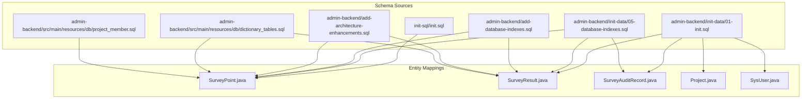
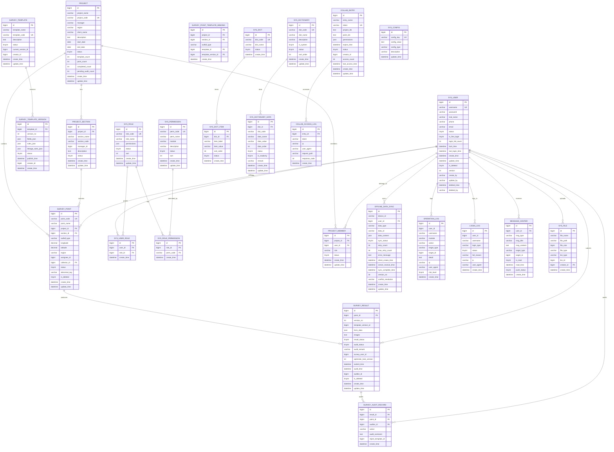
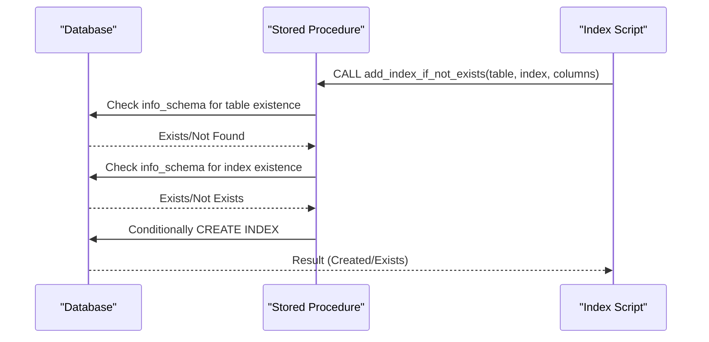
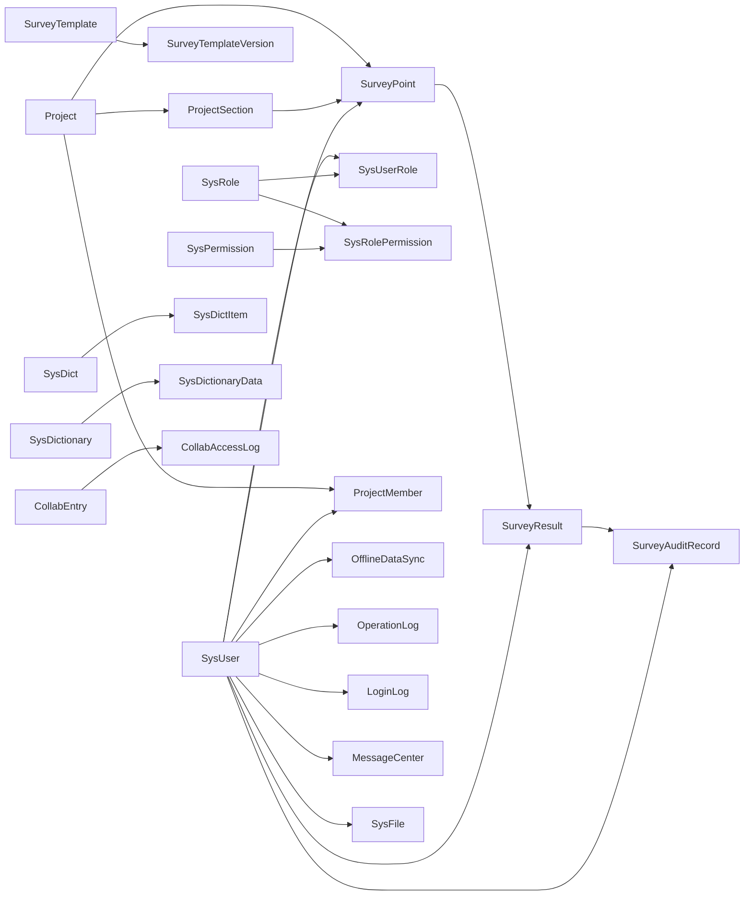

# Database Design

<cite>
**Referenced Files in This Document**
- [init.sql](file://init-sql/init.sql)
- [01-init.sql](file://admin-backend/init-data/01-init.sql)
- [05-database-indexes.sql](file://admin-backend/init-data/05-database-indexes.sql)
- [add-database-indexes.sql](file://admin-backend/add-database-indexes.sql)
- [add-architecture-enhancements.sql](file://admin-backend/add-architecture-enhancements.sql)
- [dictionary_tables.sql](file://admin-backend/src/main/resources/db/dictionary_tables.sql)
- [project_member.sql](file://admin-backend/src/main/resources/db/project_member.sql)
- [SurveyPoint.java](file://admin-backend/src/main/java/com/qhiot/survey/entity/SurveyPoint.java)
- [SurveyResult.java](file://admin-backend/src/main/java/com/qhiot/survey/entity/SurveyResult.java)
- [SurveyAuditRecord.java](file://admin-backend/src/main/java/com/qhiot/survey/entity/SurveyAuditRecord.java)
- [Project.java](file://admin-backend/src/main/java/com/qhiot/survey/entity/Project.java)
- [SysUser.java](file://admin-backend/src/main/java/com/qhiot/survey/entity/SysUser.java)
</cite>

## Table of Contents
1. [Introduction](#introduction)
2. [Project Structure](#project-structure)
3. [Core Components](#core-components)
4. [Architecture Overview](#architecture-overview)
5. [Detailed Component Analysis](#detailed-component-analysis)
6. [Dependency Analysis](#dependency-analysis)
7. [Performance Considerations](#performance-considerations)
8. [Troubleshooting Guide](#troubleshooting-guide)
9. [Conclusion](#conclusion)
10. [Appendices](#appendices)

## Introduction
This document provides comprehensive database design documentation for the Survey-App. It covers the entity relationship model, table schemas with primary keys, foreign keys, indexes, and constraints, spatial data handling for GPS coordinates, indexing strategy for performance, migration scripts for schema evolution, data validation and business constraints, referential integrity enforcement, and data lifecycle management including archiving and backup strategies.

## Project Structure
The database schema is primarily defined in SQL initialization and migration scripts, with supporting entity classes in Java that map to the database tables. The key schema sources are:
- Initial schema creation and baseline data
- Index enhancement scripts
- Architecture enhancement scripts adding soft delete, optimistic locking, and audit fields
- Dictionary and project member tables for governance and access control

**Diagram sources**
- [init.sql:1-513](file://init-sql/init.sql#L1-L513)
- [01-init.sql:1-516](file://admin-backend/init-data/01-init.sql#L1-L516)
- [05-database-indexes.sql:1-144](file://admin-backend/init-data/05-database-indexes.sql#L1-L144)
- [add-database-indexes.sql:1-125](file://admin-backend/add-database-indexes.sql#L1-L125)
- [add-architecture-enhancements.sql:1-132](file://admin-backend/add-architecture-enhancements.sql#L1-L132)
- [dictionary_tables.sql:1-88](file://admin-backend/src/main/resources/db/dictionary_tables.sql#L1-L88)
- [project_member.sql:1-16](file://admin-backend/src/main/resources/db/project_member.sql#L1-L16)
- [SurveyPoint.java:1-84](file://admin-backend/src/main/java/com/qhiot/survey/entity/SurveyPoint.java#L1-L84)
- [SurveyResult.java:1-93](file://admin-backend/src/main/java/com/qhiot/survey/entity/SurveyResult.java#L1-L93)
- [SurveyAuditRecord.java:1-37](file://admin-backend/src/main/java/com/qhiot/survey/entity/SurveyAuditRecord.java#L1-L37)
- [Project.java:1-84](file://admin-backend/src/main/java/com/qhiot/survey/entity/Project.java#L1-L84)
- [SysUser.java:1-95](file://admin-backend/src/main/java/com/qhiot/survey/entity/SysUser.java#L1-L95)

**Section sources**
- [init.sql:1-513](file://init-sql/init.sql#L1-L513)
- [01-init.sql:1-516](file://admin-backend/init-data/01-init.sql#L1-L516)
- [05-database-indexes.sql:1-144](file://admin-backend/init-data/05-database-indexes.sql#L1-L144)
- [add-database-indexes.sql:1-125](file://admin-backend/add-database-indexes.sql#L1-L125)
- [add-architecture-enhancements.sql:1-132](file://admin-backend/add-architecture-enhancements.sql#L1-L132)
- [dictionary_tables.sql:1-88](file://admin-backend/src/main/resources/db/dictionary_tables.sql#L1-L88)
- [project_member.sql:1-16](file://admin-backend/src/main/resources/db/project_member.sql#L1-L16)

## Core Components
This section documents the core entities and their relationships, focusing on primary keys, foreign keys, indexes, constraints, and business rules.

- Project
  - Purpose: Top-level initiative with status, dates, counts, and metadata.
  - Primary key: id
  - Unique constraints: project_code
  - Indexes: idx_status, idx_manager
  - Business constraints: status enumerated; counts maintained by application logic.

- ProjectSection
  - Purpose: Subdivisions of a project with manager assignment.
  - Primary key: id
  - Foreign key: project_id → project(id)
  - Indexes: idx_project, idx_manager
  - Constraints: uk_user_role on (user_id, role_id) via join table.

- SurveyTemplate and SurveyTemplateVersion
  - Purpose: Dynamic survey templates and versions with JSON configurations.
  - Primary key: id
  - Foreign key: template_id → survey_template(id)
  - Unique constraint: uk_template_version on (template_id, version_no)
  - Indexes: idx_status

- SurveyPointTemplateBinding
  - Purpose: Bind outfall types to templates per project/section.
  - Primary key: id
  - Foreign keys: project_id → project(id), section_id → project_section(id), template_id → survey_template(id), template_version_id → survey_template_version(id)
  - Unique constraint: uk_project_section_type on (project_id, section_id, outfall_type)
  - Indexes: idx_template

- SurveyPoint
  - Purpose: Field sampling locations with spatial coordinates and status.
  - Primary key: id
  - Unique constraints: point_code
  - Foreign keys: project_id → project(id), section_id → project_section(id), collector_id → sys_user(id)
  - Spatial fields: longitude, latitude (DECIMAL(12,8))
  - Indexes: idx_project, idx_status, idx_collector, idx_outfall_type
  - Business constraints: status enumerated; soft-delete via is_deleted; audit fields via entity mapping.

- SurveyResult
  - Purpose: Versioned survey outcomes with JSON form data and audit trail.
  - Primary key: id
  - Foreign key: point_id → survey_point(id)
  - Unique constraint: uk_point_version on (point_id, version_no)
  - Indexes: idx_result_status, idx_audit_status, idx_survey_user, idx_auditor
  - Business constraints: result_status and audit_status enumerated; optimistic locking via version field.

- SurveyAuditRecord
  - Purpose: Audit history for results.
  - Primary key: id
  - Foreign keys: result_id → survey_result(id), point_id → survey_point(id), auditor_id → sys_user(id)
  - Indexes: idx_result, idx_point, idx_auditor, idx_action

- SysUser
  - Purpose: Application users with roles and credentials.
  - Primary key: id
  - Unique constraints: username
  - Indexes: idx_username, idx_status
  - Business constraints: status enumerated; soft-delete and optimistic lock via entity mapping.

- SysRole and SysUserRole
  - Purpose: Role-based permissions and user-role assignments.
  - Primary key: id
  - Unique constraints: uk_user_role on (user_id, role_id)
  - Indexes: idx_role, idx_perm

- SysPermission and SysRolePermission
  - Purpose: Permission catalog and role-permission mapping.
  - Primary key: id
  - Unique constraints: uk_role_perm on (role_id, perm_code)
  - Indexes: idx_module, idx_status

- SysDict and SysDictItem
  - Purpose: Legacy dictionary tables for enumerations.
  - Primary key: id
  - Indexes: idx_dict

- SysDictionary and SysDictionaryData
  - Purpose: Enhanced dictionary taxonomy and items.
  - Primary key: id
  - Indexes: idx_dict_code, idx_dict_id

- ProjectMember
  - Purpose: Project membership with roles and status.
  - Primary key: id
  - Unique constraints: uk_project_user on (project_id, user_id)
  - Indexes: idx_project_id, idx_user_id, idx_role, idx_status

- OfflineDataSync
  - Purpose: Mobile offline data synchronization.
  - Primary key: id
  - Indexes: idx_device_id, idx_user_id, idx_sync_status, idx_data_type, idx_create_time

- OperationLog and LoginLog
  - Purpose: Operational and authentication audit trails.
  - Indexes: various composite and single-column indexes

- MessageCenter, CollabEntry, CollabAccessLog, SysFile, SysConfig
  - Purpose: Messaging, collaboration, file storage, and configuration.
  - Indexes: idx_user, idx_msg_type, idx_is_read, idx_token, idx_status, idx_biz, idx_creator

**Section sources**
- [init.sql:11-122](file://init-sql/init.sql#L11-L122)
- [init.sql:127-150](file://init-sql/init.sql#L127-L150)
- [init.sql:155-168](file://init-sql/init.sql#L155-L168)
- [init.sql:326-348](file://init-sql/init.sql#L326-L348)
- [01-init.sql:11-122](file://admin-backend/init-data/01-init.sql#L11-L122)
- [01-init.sql:127-150](file://admin-backend/init-data/01-init.sql#L127-L150)
- [01-init.sql:155-168](file://admin-backend/init-data/01-init.sql#L155-L168)
- [01-init.sql:329-351](file://admin-backend/init-data/01-init.sql#L329-L351)
- [dictionary_tables.sql:2-32](file://admin-backend/src/main/resources/db/dictionary_tables.sql#L2-L32)
- [project_member.sql:2-16](file://admin-backend/src/main/resources/db/project_member.sql#L2-L16)

## Architecture Overview
The database supports a survey lifecycle from project definition to field data capture, versioned results, auditing, and reporting. Entities are organized around Projects and Sections, with SurveyPoints representing geographic locations and SurveyResults capturing versioned data.

**Diagram sources**
- [init.sql:11-122](file://init-sql/init.sql#L11-L122)
- [init.sql:127-150](file://init-sql/init.sql#L127-L150)
- [init.sql:155-168](file://init-sql/init.sql#L155-L168)
- [init.sql:326-348](file://init-sql/init.sql#L326-L348)
- [dictionary_tables.sql:2-32](file://admin-backend/src/main/resources/db/dictionary_tables.sql#L2-L32)
- [project_member.sql:2-16](file://admin-backend/src/main/resources/db/project_member.sql#L2-L16)

## Detailed Component Analysis

### Spatial Data Handling and Geographic Queries
- Coordinate Storage
  - SurveyPoint stores longitude and latitude as DECIMAL(12,8), enabling precise WGS84 coordinate representation suitable for geographic applications.
- Indexing Strategy
  - No dedicated spatial indexes are defined. For high-volume proximity searches or spatial analytics, consider adding a generated column with a spatial type and a SPATIAL index.
- Query Patterns
  - Typical queries involve filtering by project/section, status, and outfall type. Current indexes support these filters efficiently.
- Recommendations
  - For radius searches or nearest-neighbor queries, introduce a generated geometry column and SPATIAL index after assessing performance needs.

**Section sources**
- [init.sql:108-110](file://init-sql/init.sql#L108-L110)
- [01-init.sql:108-110](file://admin-backend/init-data/01-init.sql#L108-L110)

### Indexing Strategy and Query Efficiency
- Idempotent Index Creation
  - The index enhancement script defines a stored procedure to conditionally create indexes only if they do not exist, ensuring safe repeated execution across environments.
- Targeted Indexes
  - Project: idx_project_status, idx_project_manager, idx_project_create_time
  - SurveyPoint: idx_sp_project_status, idx_sp_assignee, idx_sp_outfall_type, idx_sp_create_time
  - SurveyResult: idx_sr_point_version, idx_sr_survey_user, idx_sr_result_status, idx_sr_audit_status, idx_sr_create_time
  - SurveyAuditRecord: idx_sar_result, idx_sar_point, idx_sar_auditor, idx_sar_create_time
  - OperationLog: idx_oplog_user_id, idx_oplog_module, idx_oplog_create_time, idx_oplog_risk_level
  - OfflineDataSync: idx_ods_status_retry, idx_ods_user_id, idx_ods_data_type
  - ExportTask: idx_export_creator, idx_export_status, idx_export_create_time
  - MessageCenter: idx_msg_user_read, idx_msg_create_time
- Composite Indexes
  - Composite indexes on (project_id, status) for SurveyPoint and SurveyResult improve list pagination and filtering.
- Verification
  - The script includes a verification helper to enumerate resulting indexes for targeted tables.

**Diagram sources**
- [05-database-indexes.sql:21-64](file://admin-backend/init-data/05-database-indexes.sql#L21-L64)

**Section sources**
- [05-database-indexes.sql:1-144](file://admin-backend/init-data/05-database-indexes.sql#L1-L144)
- [add-database-indexes.sql:9-79](file://admin-backend/add-database-indexes.sql#L9-L79)

### Data Validation Rules and Business Constraints
- Enumerations
  - Status fields across Project, ProjectSection, SurveyPoint, SurveyResult, SurveyAuditRecord, SysUser, SysRole, SysPermission, SysDict, and SysDictionaryData use small integer or string codes with associated dictionary entries for consistent interpretation.
- Uniqueness
  - Unique constraints enforce business uniqueness: project_code, username, template_code, and composite keys such as uk_template_version and uk_project_section_type.
- JSON Fields
  - survey_template_version.rules_json and linkage_rules_json, survey_result.form_data, and collab_entry.permissions store structured data; validation occurs at application level.
- Soft Delete and Optimistic Lock
  - Architecture enhancements add is_deleted, deleted_time, deleted_by, version fields to core entities, enabling soft deletion and optimistic concurrency control.
- Audit Fields
  - create_by and update_by fields added to track who created or modified records.

**Section sources**
- [add-architecture-enhancements.sql:14-106](file://admin-backend/add-architecture-enhancements.sql#L14-L106)
- [dictionary_tables.sql:35-88](file://admin-backend/src/main/resources/db/dictionary_tables.sql#L35-L88)

### Referential Integrity Enforcement
- Foreign Keys
  - Defined in schema: project_id → project, section_id → project_section, collector_id → sys_user, point_id → survey_point, result_id → survey_result, auditor_id → sys_user, template_id → survey_template, template_version_id → survey_template_version, user_id → sys_user, role_id → sys_role, dict_id → sys_dict, dict_id → sys_dictionary.
- Application-Level Enforcement
  - Additional relationships (e.g., project_member) rely on unique and index constraints to maintain integrity at the application boundary.

**Section sources**
- [init.sql:37-46](file://init-sql/init.sql#L37-L46)
- [init.sql:69-81](file://init-sql/init.sql#L69-L81)
- [init.sql:105-122](file://init-sql/init.sql#L105-L122)
- [init.sql:129-150](file://init-sql/init.sql#L129-L150)
- [init.sql:158-168](file://init-sql/init.sql#L158-L168)
- [project_member.sql:4-11](file://admin-backend/src/main/resources/db/project_member.sql#L4-L11)

### Schema Evolution and Migration Scripts
- Baseline Initialization
  - The initial schema is defined in both init-sql/init.sql and admin-backend/init-data/01-init.sql, covering all core tables, indexes, and seed data.
- Index Enhancement
  - admin-backend/init-data/05-database-indexes.sql introduces idempotent index creation procedures and applies targeted indexes for improved query performance.
- Architecture Enhancements
  - admin-backend/add-architecture-enhancements.sql adds soft delete, optimistic lock, and audit fields to core tables, along with supporting indexes and data initialization.
- Additional Indexes
  - admin-backend/add-database-indexes.sql provides an alternative idempotent index creation approach and includes verification steps.

**Diagram sources**
- [05-database-indexes.sql:21-64](file://admin-backend/init-data/05-database-indexes.sql#L21-L64)

**Section sources**
- [init.sql:1-513](file://init-sql/init.sql#L1-L513)
- [01-init.sql:1-516](file://admin-backend/init-data/01-init.sql#L1-L516)
- [05-database-indexes.sql:1-144](file://admin-backend/init-data/05-database-indexes.sql#L1-L144)
- [add-database-indexes.sql:1-125](file://admin-backend/add-database-indexes.sql#L1-L125)
- [add-architecture-enhancements.sql:1-132](file://admin-backend/add-architecture-enhancements.sql#L1-L132)

### Data Lifecycle Management, Archiving, and Backup
- Soft Deletion
  - is_deleted flag and deleted_time/deleted_by fields enable logical deletion without immediate physical removal, supporting audit trails and potential recovery.
- Version Control
  - Optimistic locking via version fields prevents concurrent modification conflicts during updates.
- Archive Strategy
  - Historical data can be archived by moving completed SurveyResult rows to an archive schema while retaining referential integrity via foreign keys.
- Backup Strategy
  - Full logical backups of the survey_db database should be scheduled regularly. Incremental backups can complement full backups for faster recovery windows.
- Retention Policies
  - Define retention periods for operational logs, audit records, and temporary export tasks to manage storage growth.

**Section sources**
- [add-architecture-enhancements.sql:14-106](file://admin-backend/add-architecture-enhancements.sql#L14-L106)
- [init.sql:142-149](file://init-sql/init.sql#L142-L149)

## Dependency Analysis
This section maps dependencies among core entities and highlights coupling and cohesion.

**Diagram sources**
- [init.sql:11-122](file://init-sql/init.sql#L11-L122)
- [init.sql:127-150](file://init-sql/init.sql#L127-L150)
- [init.sql:155-168](file://init-sql/init.sql#L155-L168)
- [init.sql:326-348](file://init-sql/init.sql#L326-L348)
- [dictionary_tables.sql:2-32](file://admin-backend/src/main/resources/db/dictionary_tables.sql#L2-L32)
- [project_member.sql:2-16](file://admin-backend/src/main/resources/db/project_member.sql#L2-L16)

**Section sources**
- [init.sql:11-168](file://init-sql/init.sql#L11-L168)
- [dictionary_tables.sql:2-32](file://admin-backend/src/main/resources/db/dictionary_tables.sql#L2-L32)
- [project_member.sql:2-16](file://admin-backend/src/main/resources/db/project_member.sql#L2-L16)

## Performance Considerations
- Index Coverage
  - Ensure frequently filtered/sorted columns are indexed (status, user_id, timestamps).
- Composite Indexes
  - Use composite indexes for common query predicates like (project_id, status) to avoid table scans.
- JSON Columns
  - Avoid indexing JSON fields directly; denormalize or derive computed columns if needed for performance-sensitive queries.
- Partitioning
  - For very large tables (e.g., survey_result), consider partitioning by date or point_id to improve maintenance and query performance.
- Monitoring
  - Use EXPLAIN plans to validate index usage and adjust indexes based on actual query patterns.

[No sources needed since this section provides general guidance]

## Troubleshooting Guide
- Index Creation Failures
  - Verify table existence and permissions; use the idempotent stored procedure to avoid errors on repeated runs.
- Slow Queries
  - Confirm composite indexes are being used; add missing indexes based on EXPLAIN output.
- Soft Delete Issues
  - Ensure application logic respects is_deleted and applies appropriate filters.
- Concurrency Conflicts
  - Handle optimistic lock failures by retrying with refreshed data.

**Section sources**
- [05-database-indexes.sql:21-64](file://admin-backend/init-data/05-database-indexes.sql#L21-L64)
- [add-database-indexes.sql:104-125](file://admin-backend/add-database-indexes.sql#L104-L125)

## Conclusion
The Survey-App database schema is designed around a clear lifecycle from project and section management to field data capture, versioned results, and auditability. The schema leverages ENUM-like dictionaries, JSON fields for flexibility, and robust indexing for query performance. Architecture enhancements introduce soft deletion, optimistic locking, and audit fields to support enterprise-grade operations. Migration scripts provide idempotent mechanisms for evolving the schema safely across environments.

[No sources needed since this section summarizes without analyzing specific files]

## Appendices

### Entity-Table Mapping Reference
- SurveyPoint.java → survey_point
- SurveyResult.java → survey_result
- SurveyAuditRecord.java → survey_audit_record
- Project.java → project
- SysUser.java → sys_user

**Section sources**
- [SurveyPoint.java:17-84](file://admin-backend/src/main/java/com/qhiot/survey/entity/SurveyPoint.java#L17-L84)
- [SurveyResult.java:14-93](file://admin-backend/src/main/java/com/qhiot/survey/entity/SurveyResult.java#L14-L93)
- [SurveyAuditRecord.java:13-37](file://admin-backend/src/main/java/com/qhiot/survey/entity/SurveyAuditRecord.java#L13-L37)
- [Project.java:16-84](file://admin-backend/src/main/java/com/qhiot/survey/entity/Project.java#L16-L84)
- [SysUser.java:19-95](file://admin-backend/src/main/java/com/qhiot/survey/entity/SysUser.java#L19-L95)