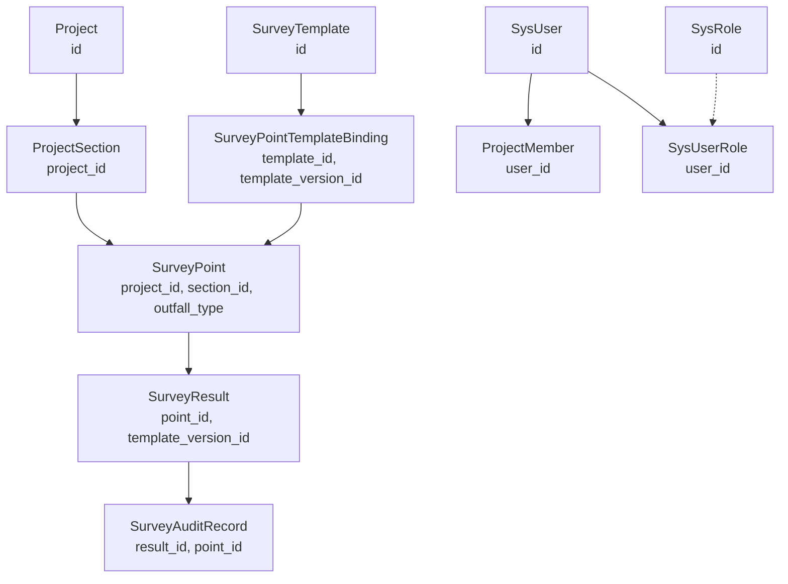
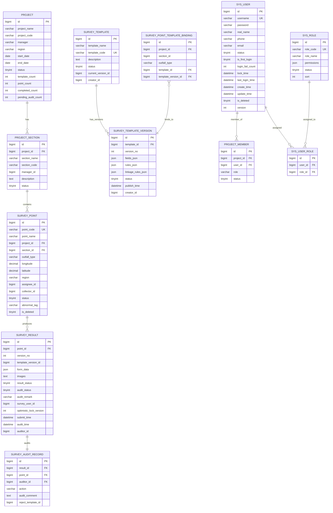
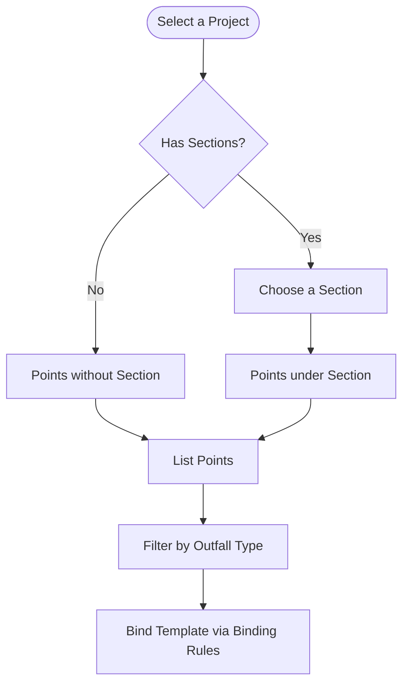
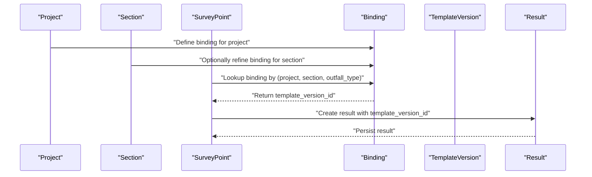
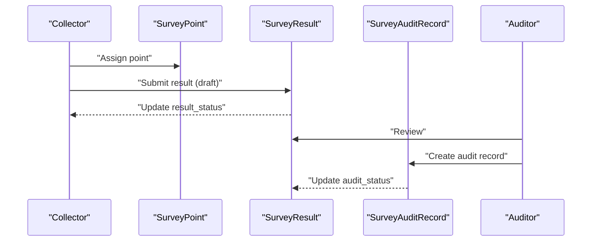
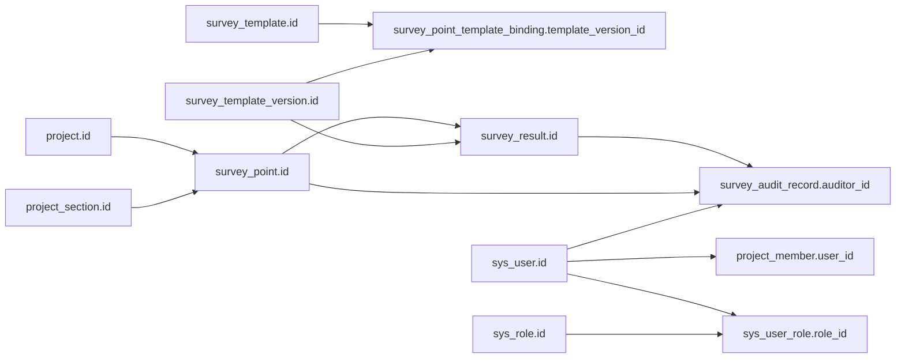

# Entity Relationships

<cite>
**Referenced Files in This Document**
- [SurveyPoint.java](file://admin-backend/src/main/java/com/qhiot/survey/entity/SurveyPoint.java)
- [Project.java](file://admin-backend/src/main/java/com/qhiot/survey/entity/Project.java)
- [SurveyResult.java](file://admin-backend/src/main/java/com/qhiot/survey/entity/SurveyResult.java)
- [SurveyTemplate.java](file://admin-backend/src/main/java/com/qhiot/survey/entity/SurveyTemplate.java)
- [ProjectSection.java](file://admin-backend/src/main/java/com/qhiot/survey/entity/ProjectSection.java)
- [SurveyPointTemplateBinding.java](file://admin-backend/src/main/java/com/qhiot/survey/entity/SurveyPointTemplateBinding.java)
- [SurveyAuditRecord.java](file://admin-backend/src/main/java/com/qhiot/survey/entity/SurveyAuditRecord.java)
- [ProjectMember.java](file://admin-backend/src/main/java/com/qhiot/survey/entity/ProjectMember.java)
- [SysUserRole.java](file://admin-backend/src/main/java/com/qhiot/survey/entity/SysUserRole.java)
- [SysUser.java](file://admin-backend/src/main/java/com/qhiot/survey/entity/SysUser.java)
- [01-init.sql](file://admin-backend/init-data/01-init.sql)
- [02-role-tables.sql](file://admin-backend/init-data/02-role-tables.sql)
- [project_member.sql](file://admin-backend/src/main/resources/db/project_member.sql)
- [dictionary_tables.sql](file://admin-backend/src/main/resources/db/dictionary_tables.sql)
</cite>

## Table of Contents
1. [Introduction](#introduction)
2. [Project Structure](#project-structure)
3. [Core Components](#core-components)
4. [Architecture Overview](#architecture-overview)
5. [Detailed Component Analysis](#detailed-component-analysis)
6. [Dependency Analysis](#dependency-analysis)
7. [Performance Considerations](#performance-considerations)
8. [Troubleshooting Guide](#troubleshooting-guide)
9. [Conclusion](#conclusion)

## Introduction
This document describes the entity relationship model for the Survey-App database schema with emphasis on the core entities: Project, ProjectSection, SurveyPoint, SurveyTemplate, SurveyPointTemplateBinding, SurveyResult, and SurveyAuditRecord. It also documents the audit trail relationships and how entities interact through join tables such as project_member and sys_user_role. The goal is to clarify foreign key constraints, cascade behaviors, referential integrity rules, and the hierarchical structure from projects to sections to survey points, as well as how survey results relate to both points and templates.

## Project Structure
The database schema is defined in initialization scripts and reflected by Java entity classes. The most relevant tables and their relationships are:
- project: Projects own multiple project_section entries.
- project_section: Sections belong to a single project.
- survey_point: Points belong to a project and optionally to a section; they carry outfall_type and geographic coordinates.
- survey_template: Templates define forms; each template has a current_version_id and multiple versions in survey_template_version.
- survey_point_template_binding: Binds a project/section/outfall_type to a specific template and template version.
- survey_result: Records submitted results per point with a version_no and links to a template version.
- survey_audit_record: Captures audit actions against a survey_result and point.
- project_member: Associates users to projects with roles.
- sys_user_role: Associates users to system roles.



**Diagram sources**
- [01-init.sql:11-47](file://admin-backend/init-data/01-init.sql#L11-L47)
- [01-init.sql:86-96](file://admin-backend/init-data/01-init.sql#L86-L96)
- [01-init.sql:101-150](file://admin-backend/init-data/01-init.sql#L101-L150)
- [01-init.sql:155-168](file://admin-backend/init-data/01-init.sql#L155-L168)
- [project_member.sql:2-16](file://admin-backend/src/main/resources/db/project_member.sql#L2-L16)
- [02-role-tables.sql:14-20](file://admin-backend/init-data/02-role-tables.sql#L14-L20)

**Section sources**
- [01-init.sql:11-168](file://admin-backend/init-data/01-init.sql#L11-L168)
- [project_member.sql:2-16](file://admin-backend/src/main/resources/db/project_member.sql#L2-L16)
- [02-role-tables.sql:14-32](file://admin-backend/init-data/02-role-tables.sql#L14-L32)

## Core Components
This section outlines the core entities and their primary attributes relevant to relationships.

- Project
  - Primary key: id
  - Attributes include project metadata, counts, and status.
  - Cardinality: One project to many sections and points.

- ProjectSection
  - Primary key: id
  - Foreign key: project_id → Project(id)
  - Attributes include section metadata and status.

- SurveyPoint
  - Primary key: id
  - Foreign keys: project_id → Project(id), section_id → ProjectSection(id)
  - Additional key: point_code (unique)
  - Attributes include outfall_type, coordinates, region, assignee/collector, and status.

- SurveyTemplate
  - Primary key: id
  - Attributes include template metadata, current_version_id, and status.
  - Related via survey_template_version and survey_point_template_binding.

- SurveyPointTemplateBinding
  - Primary key: id
  - Unique constraint: (project_id, section_id, outfall_type)
  - Foreign keys: template_id → SurveyTemplate(id), template_version_id → survey_template_version(id)
  - Links a project/section/outfall_type to a specific template version.

- SurveyResult
  - Primary key: id
  - Foreign key: point_id → SurveyPoint(id)
  - Unique constraint: (point_id, version_no)
  - Attributes include result_status, audit_status, template_version_id, and audit trail timestamps.

- SurveyAuditRecord
  - Primary key: id
  - Foreign keys: result_id → SurveyResult(id), point_id → SurveyPoint(id), auditor_id → SysUser(id)
  - Captures audit actions and comments.

- ProjectMember
  - Primary key: id
  - Unique constraint: (project_id, user_id)
  - Foreign key: user_id → SysUser(id)
  - Role-based membership per project.

- SysUserRole
  - Primary key: id
  - Unique constraint: (user_id, role_id)
  - Foreign key: role_id → SysRole(id)

**Section sources**
- [Project.java:21-84](file://admin-backend/src/main/java/com/qhiot/survey/entity/Project.java#L21-L84)
- [ProjectSection.java:18-39](file://admin-backend/src/main/java/com/qhiot/survey/entity/ProjectSection.java#L18-L39)
- [SurveyPoint.java:22-84](file://admin-backend/src/main/java/com/qhiot/survey/entity/SurveyPoint.java#L22-L84)
- [SurveyTemplate.java:18-61](file://admin-backend/src/main/java/com/qhiot/survey/entity/SurveyTemplate.java#L18-L61)
- [SurveyPointTemplateBinding.java:18-32](file://admin-backend/src/main/java/com/qhiot/survey/entity/SurveyPointTemplateBinding.java#L18-L32)
- [SurveyResult.java:19-93](file://admin-backend/src/main/java/com/qhiot/survey/entity/SurveyResult.java#L19-L93)
- [SurveyAuditRecord.java:18-37](file://admin-backend/src/main/java/com/qhiot/survey/entity/SurveyAuditRecord.java#L18-L37)
- [ProjectMember.java:18-44](file://admin-backend/src/main/java/com/qhiot/survey/entity/ProjectMember.java#L18-L44)
- [SysUserRole.java:18-26](file://admin-backend/src/main/java/com/qhiot/survey/entity/SysUserRole.java#L18-L26)

## Architecture Overview
The system follows a hierarchical structure:
- Projects group work areas.
- Sections subdivide projects (optional).
- Points are the operational units with outfall_type and geographic context.
- Templates define standardized forms; bindings connect project/section/outfall_type combinations to specific template versions.
- Results capture submissions per point with versioning and audit trails.



**Diagram sources**
- [01-init.sql:11-168](file://admin-backend/init-data/01-init.sql#L11-L168)
- [project_member.sql:2-16](file://admin-backend/src/main/resources/db/project_member.sql#L2-L16)
- [02-role-tables.sql:14-20](file://admin-backend/init-data/02-role-tables.sql#L14-L20)

## Detailed Component Analysis

### Hierarchical Structure: Project → Section → SurveyPoint
- Project to ProjectSection: One-to-many via project_id.
- ProjectSection to SurveyPoint: One-to-many via section_id.
- SurveyPoint carries optional section_id and mandatory project_id, plus outfall_type to support template binding.



**Diagram sources**
- [01-init.sql:35-47](file://admin-backend/init-data/01-init.sql#L35-L47)
- [01-init.sql:101-122](file://admin-backend/init-data/01-init.sql#L101-L122)
- [01-init.sql:86-96](file://admin-backend/init-data/01-init.sql#L86-L96)

**Section sources**
- [01-init.sql:35-47](file://admin-backend/init-data/01-init.sql#L35-L47)
- [01-init.sql:101-122](file://admin-backend/init-data/01-init.sql#L101-L122)
- [01-init.sql:86-96](file://admin-backend/init-data/01-init.sql#L86-L96)

### Template Binding Mechanism
- Binding table ensures a unique mapping of (project_id, section_id, outfall_type) to a template and template version.
- SurveyPoint.outfall_type drives selection of the appropriate template version for a given point.



**Diagram sources**
- [01-init.sql:86-96](file://admin-backend/init-data/01-init.sql#L86-L96)
- [01-init.sql:101-122](file://admin-backend/init-data/01-init.sql#L101-L122)
- [01-init.sql:127-150](file://admin-backend/init-data/01-init.sql#L127-L150)

**Section sources**
- [SurveyPointTemplateBinding.java:18-32](file://admin-backend/src/main/java/com/qhiot/survey/entity/SurveyPointTemplateBinding.java#L18-L32)
- [SurveyPoint.java:33-48](file://admin-backend/src/main/java/com/qhiot/survey/entity/SurveyPoint.java#L33-L48)
- [SurveyResult.java:22-37](file://admin-backend/src/main/java/com/qhiot/survey/entity/SurveyResult.java#L22-L37)

### Audit Trail and Result Lifecycle
- SurveyResult captures result_status and audit_status, along with submit_time and audit_time.
- SurveyAuditRecord records actions (pass/reject/transfer), comments, and links to result and point.
- SysUser participates as auditor and survey_user_id.



**Diagram sources**
- [01-init.sql:127-150](file://admin-backend/init-data/01-init.sql#L127-L150)
- [01-init.sql:155-168](file://admin-backend/init-data/01-init.sql#L155-L168)
- [SurveyResult.java:22-93](file://admin-backend/src/main/java/com/qhiot/survey/entity/SurveyResult.java#L22-L93)
- [SurveyAuditRecord.java:21-37](file://admin-backend/src/main/java/com/qhiot/survey/entity/SurveyAuditRecord.java#L21-L37)

**Section sources**
- [SurveyResult.java:22-93](file://admin-backend/src/main/java/com/qhiot/survey/entity/SurveyResult.java#L22-L93)
- [SurveyAuditRecord.java:21-37](file://admin-backend/src/main/java/com/qhiot/survey/entity/SurveyAuditRecord.java#L21-L37)

### Users, Roles, and Project Membership
- ProjectMember ties users to projects with a role and status; unique constraint prevents duplicate memberships.
- SysUserRole ties users to system roles; unique constraint ensures one-time assignment.
- SysUser stores user credentials and metadata.

```mermaid
classDiagram
class SysUser {
+Long id
+String username
+String password
+Integer status
+Integer isDeleted
+Integer version
}
class ProjectMember {
+Long id
+Long project_id
+Long user_id
+String role
+Integer status
}
class SysUserRole {
+Long id
+Long user_id
+Long role_id
}
class SysRole {
+Long id
+String role_code
+String role_name
+Integer status
}
SysUser ||--o{ ProjectMember : "member_of"
SysUser ||--o{ SysUserRole : "assigned"
SysRole ||--o{ SysUserRole : "assigned_to"
```

**Diagram sources**
- [project_member.sql:2-16](file://admin-backend/src/main/resources/db/project_member.sql#L2-L16)
- [02-role-tables.sql:14-20](file://admin-backend/init-data/02-role-tables.sql#L14-L20)
- [SysUser.java:24-95](file://admin-backend/src/main/java/com/qhiot/survey/entity/SysUser.java#L24-L95)

**Section sources**
- [ProjectMember.java:18-44](file://admin-backend/src/main/java/com/qhiot/survey/entity/ProjectMember.java#L18-L44)
- [SysUserRole.java:18-26](file://admin-backend/src/main/java/com/qhiot/survey/entity/SysUserRole.java#L18-L26)
- [02-role-tables.sql:14-32](file://admin-backend/init-data/02-role-tables.sql#L14-L32)

## Dependency Analysis
- Foreign Keys and Uniqueness
  - survey_point.project_id → project.id
  - survey_point.section_id → project_section.id
  - survey_point_template_binding.template_id → survey_template.id
  - survey_point_template_binding.template_version_id → survey_template_version.id
  - survey_result.point_id → survey_point.id
  - survey_result.template_version_id → survey_template_version.id
  - survey_audit_record.result_id → survey_result.id
  - survey_audit_record.point_id → survey_point.id
  - survey_audit_record.auditor_id → sys_user.id
  - project_member.user_id → sys_user.id
  - sys_user_role.user_id → sys_user.id
  - sys_user_role.role_id → sys_role.id
- Unique Constraints
  - survey_point.point_code (unique)
  - survey_template.template_code (unique)
  - survey_point_template_binding.(project_id, section_id, outfall_type) (unique)
  - project_member.(project_id, user_id) (unique)
  - sys_user_role.(user_id, role_id) (unique)
  - survey_result.(point_id, version_no) (unique)



**Diagram sources**
- [01-init.sql:11-168](file://admin-backend/init-data/01-init.sql#L11-L168)
- [project_member.sql:2-16](file://admin-backend/src/main/resources/db/project_member.sql#L2-L16)
- [02-role-tables.sql:14-20](file://admin-backend/init-data/02-role-tables.sql#L14-L20)

**Section sources**
- [01-init.sql:11-168](file://admin-backend/init-data/01-init.sql#L11-L168)
- [project_member.sql:2-16](file://admin-backend/src/main/resources/db/project_member.sql#L2-L16)
- [02-role-tables.sql:14-20](file://admin-backend/init-data/02-role-tables.sql#L14-L20)

## Performance Considerations
- Indexes for efficient filtering and pagination:
  - project: idx_project_status, idx_project_manager, idx_project_create_time
  - survey_point: idx_sp_project_status, idx_sp_assignee, idx_sp_outfall_type, idx_sp_create_time
  - survey_result: idx_sr_point_version, idx_sr_survey_user, idx_sr_result_status, idx_sr_audit_status, idx_sr_create_time
  - survey_audit_record: idx_sar_result, idx_sar_point, idx_sar_auditor, idx_sar_create_time
  - project_member: idx_project_id, idx_user_id, idx_role, idx_status
  - sys_user_role: uk_user_role (unique)
- Recommendations:
  - Maintain these indexes after schema changes.
  - Use composite indexes for frequent filter pairs (e.g., project_id + status).
  - Monitor slow queries and add targeted indexes as needed.

**Section sources**
- [05-database-indexes.sql:70-99](file://admin-backend/init-data/05-database-indexes.sql#L70-L99)
- [project_member.sql:11-15](file://admin-backend/src/main/resources/db/project_member.sql#L11-L15)
- [02-role-tables.sql:19](file://admin-backend/init-data/02-role-tables.sql#L19)

## Troubleshooting Guide
- Referential Integrity Violations
  - Ensure foreign keys exist before inserting child records:
    - Insert project before project_section.
    - Insert project_section before survey_point.
    - Insert survey_template_version before survey_result.
    - Insert sys_user before project_member and sys_user_role.
- Unique Constraint Conflicts
  - Duplicate point_code, template_code, binding triplets, project/user pair, or user/role pair will cause errors.
  - Verify uniqueness before inserts or handle conflicts gracefully.
- Audit Trail Gaps
  - Confirm survey_audit_record links align with survey_result and survey_point ids.
  - Validate that auditor_id references an existing sys_user record.
- Dictionary and Status Values
  - Use dictionary tables for consistent status values and labels.
  - Ensure outfall_type values match supported dictionary items.

**Section sources**
- [01-init.sql:11-168](file://admin-backend/init-data/01-init.sql#L11-L168)
- [dictionary_tables.sql:34-88](file://admin-backend/src/main/resources/db/dictionary_tables.sql#L34-L88)

## Conclusion
The Survey-App database schema establishes a clear hierarchy from Project to Section to SurveyPoint, with robust template binding via SurveyPointTemplateBinding. SurveyResult and SurveyAuditRecord provide lifecycle and audit capabilities, while project_member and sys_user_role manage user participation and permissions. Proper indexing and adherence to unique and foreign key constraints ensure referential integrity and query performance.