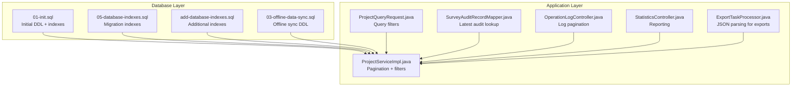
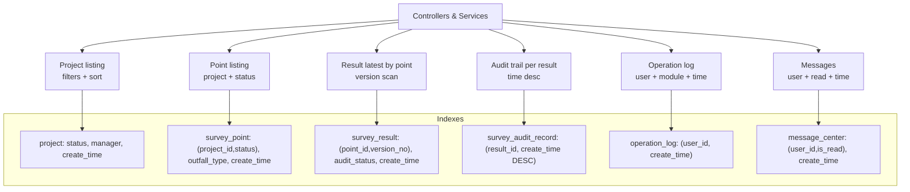
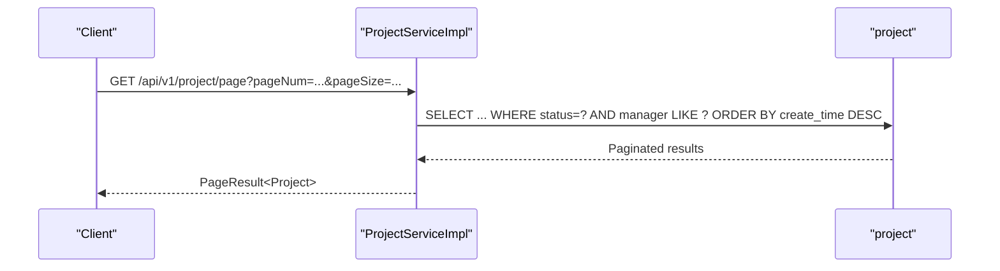
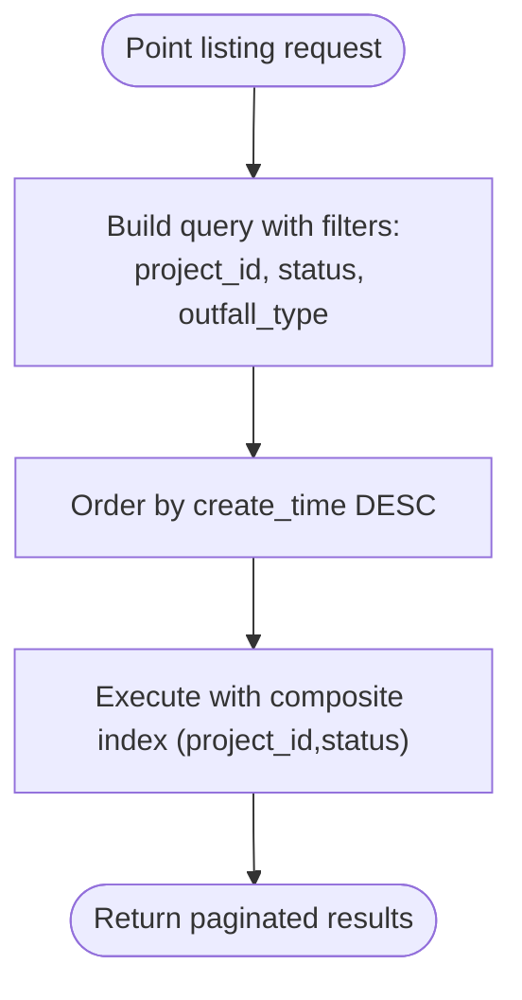
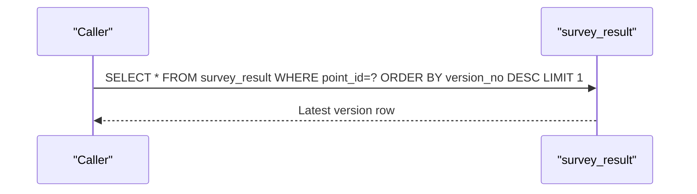
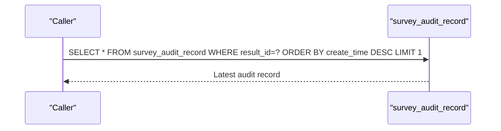
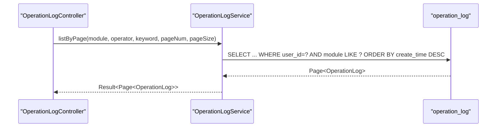
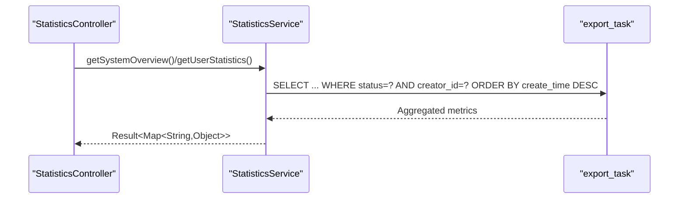
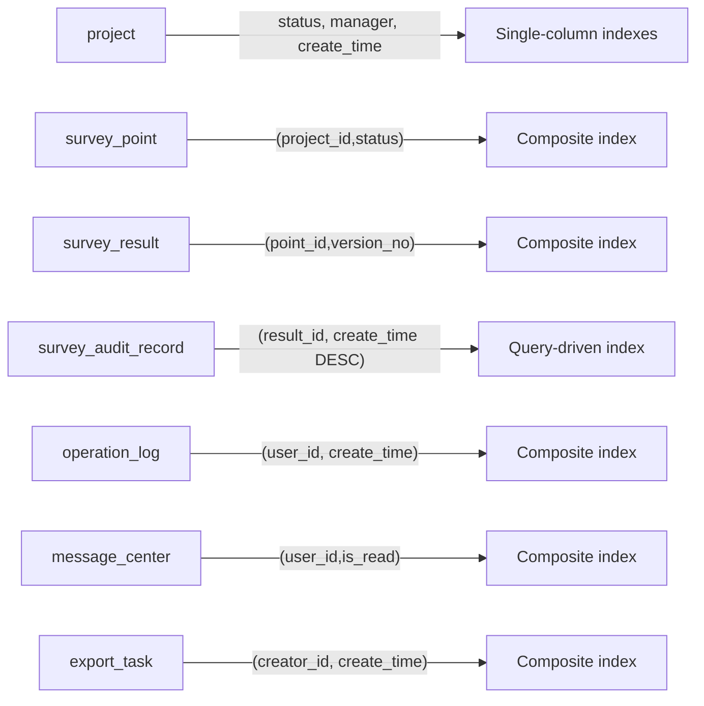

# Indexing Strategies

<cite>
**Referenced Files in This Document**
- [add-database-indexes.sql](file://admin-backend/add-database-indexes.sql)
- [05-database-indexes.sql](file://admin-backend/init-data/05-database-indexes.sql)
- [01-init.sql](file://admin-backend/init-data/01-init.sql)
- [03-offline-data-sync.sql](file://admin-backend/init-data/03-offline-data-sync.sql)
- [SurveyPoint.java](file://admin-backend/src/main/java/com/qhiot/survey/entity/SurveyPoint.java)
- [SurveyResult.java](file://admin-backend/src/main/java/com/qhiot/survey/entity/SurveyResult.java)
- [SurveyTemplate.java](file://admin-backend/src/main/java/com/qhiot/survey/entity/SurveyTemplate.java)
- [ProjectServiceImpl.java](file://admin-backend/src/main/java/com/qhiot/survey/service/ProjectService.java)
- [ProjectQueryRequest.java](file://admin-backend/src/main/java/com/qhiot/survey/dto/ProjectQueryRequest.java)
- [SurveyAuditRecordMapper.java](file://admin-backend/src/main/java/com/qhiot/survey/mapper/SurveyAuditRecordMapper.java)
- [OperationLogController.java](file://admin-backend/src/main/java/com/qhiot/survey/controller/OperationLogController.java)
- [StatisticsController.java](file://admin-backend/src/main/java/com/qhiot/survey/controller/StatisticsController.java)
- [ExportTaskProcessor.java](file://admin-backend/src/main/java/com/qhiot/survey/service/ExportTaskProcessor.java)
</cite>

## Table of Contents
1. [Introduction](#introduction)
2. [Project Structure](#project-structure)
3. [Core Components](#core-components)
4. [Architecture Overview](#architecture-overview)
5. [Detailed Component Analysis](#detailed-component-analysis)
6. [Dependency Analysis](#dependency-analysis)
7. [Performance Considerations](#performance-considerations)
8. [Troubleshooting Guide](#troubleshooting-guide)
9. [Conclusion](#conclusion)
10. [Appendices](#appendices)

## Introduction
This document presents a comprehensive indexing strategy for optimal query performance in Survey-App. It consolidates the current index coverage from database initialization and migration scripts, explains the rationale for unique indexes on business keys, and details strategies for semi-structured data via JSON columns. It also covers usage patterns for audit trails, search, and reporting, along with maintenance, fragmentation, and monitoring recommendations. Finally, it provides actionable guidance for adding new indexes based on observed query patterns and outlines the trade-offs between write performance and read optimization.

## Project Structure
The indexing strategy spans three primary areas:
- Database initialization and migrations that define baseline indexes and unique constraints
- Application service and controller layers that drive typical query patterns
- Mapper-level queries that rely on indexes for performance

**Diagram sources**
- [01-init.sql:11-516](file://admin-backend/init-data/01-init.sql#L11-L516)
- [05-database-indexes.sql:1-144](file://admin-backend/init-data/05-database-indexes.sql#L1-L144)
- [add-database-indexes.sql:1-125](file://admin-backend/add-database-indexes.sql#L1-L125)
- [03-offline-data-sync.sql:1-28](file://admin-backend/init-data/03-offline-data-sync.sql#L1-L28)
- [ProjectServiceImpl.java:37-75](file://admin-backend/src/main/java/com/qhiot/survey/service/ProjectServiceImpl.java#L37-L75)
- [ProjectQueryRequest.java:11-33](file://admin-backend/src/main/java/com/qhiot/survey/dto/ProjectQueryRequest.java#L11-L33)
- [SurveyAuditRecordMapper.java:12-21](file://admin-backend/src/main/java/com/qhiot/survey/mapper/SurveyAuditRecordMapper.java#L12-L21)
- [OperationLogController.java:30-40](file://admin-backend/src/main/java/com/qhiot/survey/controller/OperationLogController.java#L30-L40)
- [StatisticsController.java:25-37](file://admin-backend/src/main/java/com/qhiot/survey/controller/StatisticsController.java#L25-L37)
- [ExportTaskProcessor.java:376-404](file://admin-backend/src/main/java/com/qhiot/survey/service/ExportTaskProcessor.java#L376-L404)

**Section sources**
- [01-init.sql:11-516](file://admin-backend/init-data/01-init.sql#L11-L516)
- [05-database-indexes.sql:1-144](file://admin-backend/init-data/05-database-indexes.sql#L1-L144)
- [add-database-indexes.sql:1-125](file://admin-backend/add-database-indexes.sql#L1-L125)
- [03-offline-data-sync.sql:1-28](file://admin-backend/init-data/03-offline-data-sync.sql#L1-L28)
- [ProjectServiceImpl.java:37-75](file://admin-backend/src/main/java/com/qhiot/survey/service/ProjectServiceImpl.java#L37-L75)
- [ProjectQueryRequest.java:11-33](file://admin-backend/src/main/java/com/qhiot/survey/dto/ProjectQueryRequest.java#L11-L33)
- [SurveyAuditRecordMapper.java:12-21](file://admin-backend/src/main/java/com/qhiot/survey/mapper/SurveyAuditRecordMapper.java#L12-L21)
- [OperationLogController.java:30-40](file://admin-backend/src/main/java/com/qhiot/survey/controller/OperationLogController.java#L30-L40)
- [StatisticsController.java:25-37](file://admin-backend/src/main/java/com/qhiot/survey/controller/StatisticsController.java#L25-L37)
- [ExportTaskProcessor.java:376-404](file://admin-backend/src/main/java/com/qhiot/survey/service/ExportTaskProcessor.java#L376-L404)

## Core Components
This section catalogs the indexes currently deployed and their intended use cases.

- Unique business key indexes
  - project.project_code (unique)
  - survey_template.template_code (unique)
  - survey_point.point_code (unique)
  - survey_template_version(template_id, version_no) (unique)
  - survey_point_template_binding(project_id, section_id, outfall_type) (unique)
  - sys_user.username (unique)
  - sys_dict.dict_code (unique)

- Single-column indexes for frequent filters and sorts
  - project: status, manager, create_time
  - survey_point: project_id, status, collector_id, outfall_type, create_time
  - survey_result: result_status, audit_status, survey_user_id, auditor_id, create_time
  - survey_audit_record: result_id, point_id, auditor_id, action, create_time
  - operation_log: user_id, module, risk_level, create_time
  - offline_data_sync: device_id, user_id, sync_status, data_type, create_time
  - export_task: status, creator_id, create_time
  - message_center: user_id, msg_type, is_read, create_time
  - sys_permission: module, status
  - sys_role_permission: role_id, perm_code
  - sys_user: username, status
  - sys_dict_item: dict_id

- Composite indexes for common query patterns
  - survey_point: (project_id, status)
  - survey_result: (point_id, version_no), (point_id, audit_status), (point_id, result_status)
  - offline_data_sync: (device_id, sync_status), (device_id, create_time)
  - survey_audit_record: (result_id, create_time DESC) via query ordering
  - message_center: (user_id, is_read)
  - operation_log: (user_id, create_time)
  - export_task: (creator_id, create_time)

- Additional indexes from supplemental scripts
  - project: idx_project_status, idx_project_manager, idx_project_create_time
  - survey_point: idx_sp_project_status, idx_sp_assignee, idx_sp_outfall_type, idx_sp_create_time
  - survey_result: idx_sr_point_version, idx_sr_survey_user, idx_sr_result_status, idx_sr_audit_status, idx_sr_create_time
  - survey_audit_record: idx_sar_result, idx_sar_point, idx_sar_auditor, idx_sar_create_time
  - operation_log: idx_oplog_user_id, idx_oplog_module, idx_oplog_create_time, idx_oplog_risk_level
  - offline_data_sync: idx_ods_status_retry, idx_ods_user_id, idx_ods_data_type
  - export_task: idx_export_creator, idx_export_status, idx_export_create_time
  - message_center: idx_msg_user_read, idx_msg_create_time

Rationale summary:
- Unique indexes prevent duplicates on business-critical identifiers and support fast equality lookups.
- Single-column indexes accelerate filters/sorts frequently used in paginated lists and dashboards.
- Composite indexes optimize multi-column filters and enforce efficient range scans or index-only plans.

**Section sources**
- [01-init.sql:11-516](file://admin-backend/init-data/01-init.sql#L11-L516)
- [05-database-indexes.sql:67-127](file://admin-backend/init-data/05-database-indexes.sql#L67-L127)
- [add-database-indexes.sql:43-75](file://admin-backend/add-database-indexes.sql#L43-L75)
- [03-offline-data-sync.sql:4-27](file://admin-backend/init-data/03-offline-data-sync.sql#L4-L27)

## Architecture Overview
The indexing strategy aligns with typical Survey-App query patterns:
- Project listing with filters and sorting by creation time
- Point listing filtered by project and status
- Result retrieval by point with version selection
- Audit trail retrieval per result ordered by time
- Operation log and message center queries by user/read-state/time
- Reporting and export tasks filtered by status and creator/time

**Diagram sources**
- [ProjectServiceImpl.java:37-75](file://admin-backend/src/main/java/com/qhiot/survey/service/ProjectServiceImpl.java#L37-L75)
- [SurveyAuditRecordMapper.java:12-21](file://admin-backend/src/main/java/com/qhiot/survey/mapper/SurveyAuditRecordMapper.java#L12-L21)
- [01-init.sql:11-516](file://admin-backend/init-data/01-init.sql#L11-L516)
- [05-database-indexes.sql:67-127](file://admin-backend/init-data/05-database-indexes.sql#L67-L127)

## Detailed Component Analysis

### Project Listing Queries
- Filters: project name/code/manager/region/status
- Sort: create_time DESC
- Pagination: Page<T>

Index coverage:
- Single-column: project.status, project.manager, project.create_time
- Composite: survey_point(project_id,status) supports point-level filters that often accompany project-level queries

Usage pattern:
- The service constructs a query wrapper with optional LIKE/EQ conditions and orders by create_time DESC.

**Diagram sources**
- [ProjectServiceImpl.java:37-75](file://admin-backend/src/main/java/com/qhiot/survey/service/ProjectServiceImpl.java#L37-L75)
- [ProjectQueryRequest.java:11-33](file://admin-backend/src/main/java/com/qhiot/survey/dto/ProjectQueryRequest.java#L11-L33)
- [01-init.sql:11-516](file://admin-backend/init-data/01-init.sql#L11-L516)

**Section sources**
- [ProjectServiceImpl.java:37-75](file://admin-backend/src/main/java/com/qhiot/survey/service/ProjectServiceImpl.java#L37-L75)
- [ProjectQueryRequest.java:11-33](file://admin-backend/src/main/java/com/qhiot/survey/dto/ProjectQueryRequest.java#L11-L33)
- [01-init.sql:11-516](file://admin-backend/init-data/01-init.sql#L11-L516)

### Point-Based Search and Status Filtering
- Entity fields include project_id, status, assignee_id, collector_id, outfall_type, and timestamps
- Composite index (project_id, status) optimizes point listing filtered by project and status

Index coverage:
- survey_point: (project_id, status), status, outfall_type, create_time

**Diagram sources**
- [SurveyPoint.java:22-84](file://admin-backend/src/main/java/com/qhiot/survey/entity/SurveyPoint.java#L22-L84)
- [01-init.sql:101-122](file://admin-backend/init-data/01-init.sql#L101-L122)

**Section sources**
- [SurveyPoint.java:22-84](file://admin-backend/src/main/java/com/qhiot/survey/entity/SurveyPoint.java#L22-L84)
- [01-init.sql:101-122](file://admin-backend/init-data/01-init.sql#L101-L122)

### Result Retrieval and Version Selection
- Results are stored with point_id and version_no; latest version is commonly needed
- Composite index (point_id, version_no) supports efficient range scans and LIMIT 1 for latest

Index coverage:
- survey_result: (point_id, version_no), audit_status, result_status, create_time

**Diagram sources**
- [01-init.sql:127-150](file://admin-backend/init-data/01-init.sql#L127-L150)
- [SurveyResult.java:19-93](file://admin-backend/src/main/java/com/qhiot/survey/entity/SurveyResult.java#L19-L93)

**Section sources**
- [01-init.sql:127-150](file://admin-backend/init-data/01-init.sql#L127-L150)
- [SurveyResult.java:19-93](file://admin-backend/src/main/java/com/qhiot/survey/entity/SurveyResult.java#L19-L93)

### Audit Trail Queries
- Retrieve latest audit record per result ordered by create_time DESC
- Index usage: (result_id, create_time DESC) via query ordering

Index coverage:
- survey_audit_record: (result_id, create_time DESC) enforced by query order

**Diagram sources**
- [SurveyAuditRecordMapper.java:12-21](file://admin-backend/src/main/java/com/qhiot/survey/mapper/SurveyAuditRecordMapper.java#L12-L21)
- [01-init.sql:155-168](file://admin-backend/init-data/01-init.sql#L155-L168)

**Section sources**
- [SurveyAuditRecordMapper.java:12-21](file://admin-backend/src/main/java/com/qhiot/survey/mapper/SurveyAuditRecordMapper.java#L12-L21)
- [01-init.sql:155-168](file://admin-backend/init-data/01-init.sql#L155-L168)

### Operation Logs and Reporting
- Operation log pagination by user/module/risk level and time
- Reporting endpoints aggregate counts and metrics

Index coverage:
- operation_log: (user_id, create_time), module, risk_level, create_time
- message_center: (user_id, is_read), create_time

**Diagram sources**
- [OperationLogController.java:30-40](file://admin-backend/src/main/java/com/qhiot/survey/controller/OperationLogController.java#L30-L40)
- [01-init.sql:234-251](file://admin-backend/init-data/01-init.sql#L234-L251)

**Section sources**
- [OperationLogController.java:30-40](file://admin-backend/src/main/java/com/qhiot/survey/controller/OperationLogController.java#L30-L40)
- [01-init.sql:234-251](file://admin-backend/init-data/01-init.sql#L234-L251)

### Export Tasks and Reporting
- Export tasks filtered by status and creator/time
- Reporting endpoints for system overview and user statistics

Index coverage:
- export_task: (creator_id, create_time), status

**Diagram sources**
- [StatisticsController.java:25-37](file://admin-backend/src/main/java/com/qhiot/survey/controller/StatisticsController.java#L25-L37)
- [01-init.sql:190-208](file://admin-backend/init-data/01-init.sql#L190-L208)

**Section sources**
- [StatisticsController.java:25-37](file://admin-backend/src/main/java/com/qhiot/survey/controller/StatisticsController.java#L25-L37)
- [01-init.sql:190-208](file://admin-backend/init-data/01-init.sql#L190-L208)

### Semi-Structured Data (JSON) Queries
- survey_result.form_data stores JSON; ExportTaskProcessor parses JSON for export
- Current index coverage focuses on relational columns; JSON filtering is typically handled via application-side parsing or ad-hoc queries

Recommendations:
- Prefer relational denormalization or materialized JSON paths for frequent JSON filters
- Use generated columns (if supported) to index extracted JSON values
- Keep JSON parsing minimal in hot paths; cache parsed values when feasible

**Section sources**
- [SurveyResult.java:34-42](file://admin-backend/src/main/java/com/qhiot/survey/entity/SurveyResult.java#L34-L42)
- [ExportTaskProcessor.java:376-404](file://admin-backend/src/main/java/com/qhiot/survey/service/ExportTaskProcessor.java#L376-L404)

## Dependency Analysis
Index dependencies across tables and query patterns:

**Diagram sources**
- [01-init.sql:11-516](file://admin-backend/init-data/01-init.sql#L11-L516)
- [05-database-indexes.sql:67-127](file://admin-backend/init-data/05-database-indexes.sql#L67-L127)
- [SurveyAuditRecordMapper.java:12-21](file://admin-backend/src/main/java/com/qhiot/survey/mapper/SurveyAuditRecordMapper.java#L12-L21)

**Section sources**
- [01-init.sql:11-516](file://admin-backend/init-data/01-init.sql#L11-L516)
- [05-database-indexes.sql:67-127](file://admin-backend/init-data/05-database-indexes.sql#L67-L127)
- [SurveyAuditRecordMapper.java:12-21](file://admin-backend/src/main/java/com/qhiot/survey/mapper/SurveyAuditRecordMapper.java#L12-L21)

## Performance Considerations
- Write vs read trade-offs
  - Indexes improve read performance but add overhead to INSERT/UPDATE/DELETE
  - Prioritize indexes aligned with hot query patterns (pagination, filtering, sorting)
- Monitoring and verification
  - Use EXPLAIN to validate index usage for representative queries
  - Track slow query logs and query execution times
- Maintenance and fragmentation
  - Rebuild or optimize indexes periodically on large tables
  - Consider online DDL capabilities and maintenance windows for large reindexes
- JSON and semi-structured data
  - Avoid heavy JSON filtering in hot paths; prefer normalized or generated columns
  - Batch JSON parsing and cache results when possible

[No sources needed since this section provides general guidance]

## Troubleshooting Guide
Common symptoms and resolutions:
- Slow paginated lists
  - Verify single-column indexes on filter/sort columns (e.g., project.status, survey_point.status)
  - Confirm composite indexes match query predicates (e.g., (project_id,status))
- Missing indexes warnings
  - Use the idempotent stored procedures to conditionally create indexes
  - Validate with information_schema queries after deployment
- JSON parsing bottlenecks
  - Offload JSON parsing to batch jobs or cache parsed values
  - Limit JSON scanning in frequently executed queries

**Section sources**
- [add-database-indexes.sql:104-124](file://admin-backend/add-database-indexes.sql#L104-L124)
- [05-database-indexes.sql:135-143](file://admin-backend/init-data/05-database-indexes.sql#L135-L143)

## Conclusion
The current indexing strategy in Survey-App targets the most frequent query patterns: project and point listings, result versioning, audit trail retrieval, operation logging, messaging, and export/reporting. Unique indexes on business keys ensure data integrity and efficient equality lookups. Composite indexes align with multi-column filters and sorts. For JSON-heavy queries, adopt denormalization or generated columns to minimize runtime parsing overhead. Regular monitoring, maintenance, and targeted index additions will sustain performance as the system evolves.

[No sources needed since this section summarizes without analyzing specific files]

## Appendices

### Appendix A: Index Coverage Matrix
- project: status, manager, create_time; unique project_code
- survey_point: project_id, status, collector_id, outfall_type, create_time; unique point_code; composite (project_id, status)
- survey_result: result_status, audit_status, survey_user_id, auditor_id, create_time; unique (point_id, version_no); composite (point_id, version_no), (point_id, audit_status), (point_id, result_status)
- survey_audit_record: result_id, point_id, auditor_id, action, create_time; composite (result_id, create_time DESC)
- operation_log: user_id, module, risk_level, create_time; composite (user_id, create_time)
- offline_data_sync: device_id, user_id, sync_status, data_type, create_time; composite (device_id, sync_status), (device_id, create_time)
- export_task: status, creator_id, create_time; composite (creator_id, create_time)
- message_center: user_id, msg_type, is_read, create_time; composite (user_id, is_read), (user_id, is_read, create_time)
- survey_template: status; unique template_code
- survey_template_version: status; unique (template_id, version_no)
- survey_point_template_binding: template_id; unique (project_id, section_id, outfall_type)
- sys_user: username, status; unique username
- sys_dict: dict_code; unique dict_code
- sys_dict_item: dict_id
- sys_permission: module, status
- sys_role_permission: role_id, perm_code; unique (role_id, perm_code)

**Section sources**
- [01-init.sql:11-516](file://admin-backend/init-data/01-init.sql#L11-L516)
- [05-database-indexes.sql:67-127](file://admin-backend/init-data/05-database-indexes.sql#L67-L127)
- [add-database-indexes.sql:43-75](file://admin-backend/add-database-indexes.sql#L43-L75)
- [03-offline-data-sync.sql:4-27](file://admin-backend/init-data/03-offline-data-sync.sql#L4-L27)