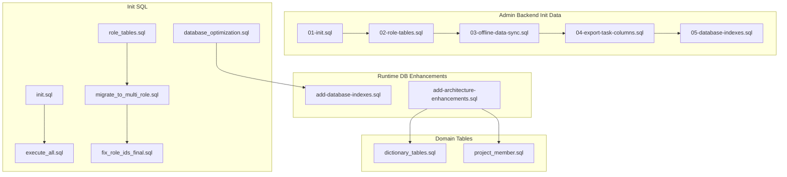
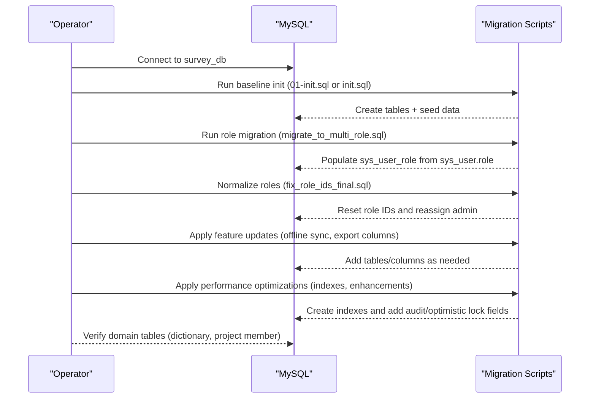
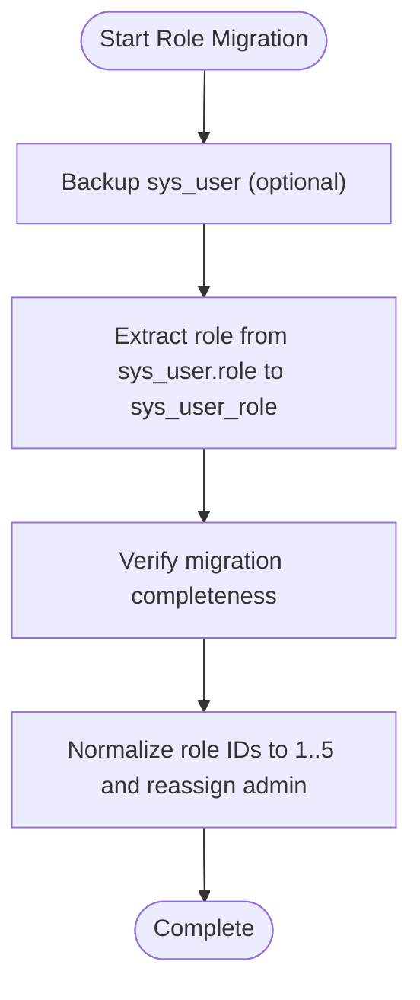
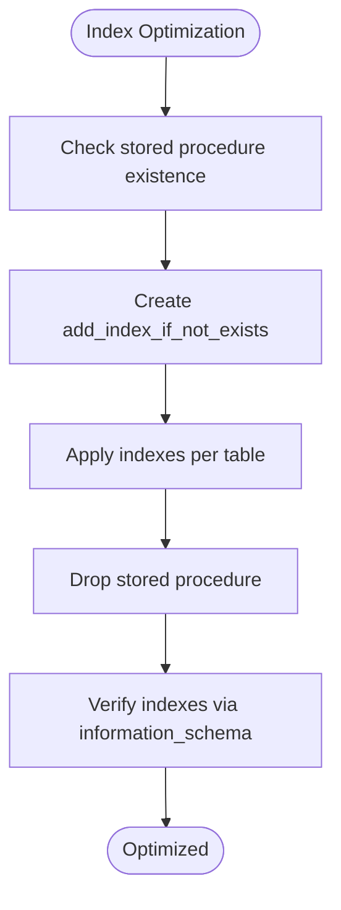
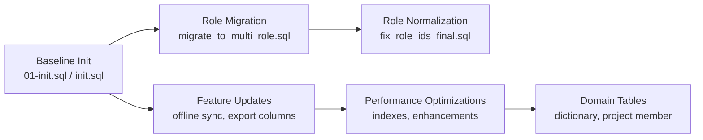

# Migration Management

<cite>
**Referenced Files in This Document**
- [01-init.sql](file://admin-backend/init-data/01-init.sql)
- [02-role-tables.sql](file://admin-backend/init-data/02-role-tables.sql)
- [03-offline-data-sync.sql](file://admin-backend/init-data/03-offline-data-sync.sql)
- [04-export-task-columns.sql](file://admin-backend/init-data/04-export-task-columns.sql)
- [05-database-indexes.sql](file://admin-backend/init-data/05-database-indexes.sql)
- [add-database-indexes.sql](file://admin-backend/add-database-indexes.sql)
- [add-architecture-enhancements.sql](file://admin-backend/add-architecture-enhancements.sql)
- [dictionary_tables.sql](file://admin-backend/src/main/resources/db/dictionary_tables.sql)
- [project_member.sql](file://admin-backend/src/main/resources/db/project_member.sql)
- [init.sql](file://init-sql/init.sql)
- [execute_all.sql](file://init-sql/execute_all.sql)
- [role_tables.sql](file://init-sql/role_tables.sql)
- [migrate_to_multi_role.sql](file://init-sql/migrate_to_multi_role.sql)
- [fix_role_ids_final.sql](file://init-sql/fix_role_ids_final.sql)
- [database_optimization.sql](file://init-sql/database_optimization.sql)
- [deploy.sh](file://deploy.sh)
- [DEPLOY.md](file://admin-backend/DEPLOY.md)
</cite>

## Table of Contents
1. [Introduction](#introduction)
2. [Project Structure](#project-structure)
3. [Core Components](#core-components)
4. [Architecture Overview](#architecture-overview)
5. [Detailed Component Analysis](#detailed-component-analysis)
6. [Dependency Analysis](#dependency-analysis)
7. [Performance Considerations](#performance-considerations)
8. [Troubleshooting Guide](#troubleshooting-guide)
9. [Conclusion](#conclusion)
10. [Appendices](#appendices)

## Introduction
This document describes the database migration management strategy for Survey-App, focusing on schema evolution, initialization, role model transitions, feature-specific updates, performance optimizations, and operational integration. It explains how migration scripts are organized, their execution order and dependencies, schema versioning approaches, backward compatibility, data migration patterns, rollback strategies, and production deployment considerations.

## Project Structure
Survey-App organizes database migrations across two primary locations:
- admin-backend/init-data: Feature-first incremental migrations and indexes
- init-sql: Initialization and foundational migrations, including multi-role migration and system-wide enhancements

Key characteristics:
- Idempotent design: Many scripts check for existence before creating tables/indexes/procedures to allow safe re-execution
- Feature-based grouping: Scripts grouped by feature (initialization, roles, offline sync, export task columns, indexes)
- System-wide enhancements: Soft delete, optimistic locking, audit fields, and index optimization

**Diagram sources**
- [01-init.sql:1-516](file://admin-backend/init-data/01-init.sql#L1-L516)
- [02-role-tables.sql:1-32](file://admin-backend/init-data/02-role-tables.sql#L1-L32)
- [03-offline-data-sync.sql:1-28](file://admin-backend/init-data/03-offline-data-sync.sql#L1-L28)
- [04-export-task-columns.sql:1-7](file://admin-backend/init-data/04-export-task-columns.sql#L1-L7)
- [05-database-indexes.sql:1-144](file://admin-backend/init-data/05-database-indexes.sql#L1-L144)
- [init.sql:1-513](file://init-sql/init.sql#L1-L513)
- [execute_all.sql:1-640](file://init-sql/execute_all.sql#L1-L640)
- [role_tables.sql:1-32](file://init-sql/role_tables.sql#L1-L32)
- [migrate_to_multi_role.sql:1-81](file://init-sql/migrate_to_multi_role.sql#L1-L81)
- [fix_role_ids_final.sql:1-54](file://init-sql/fix_role_ids_final.sql#L1-L54)
- [database_optimization.sql:1-65](file://init-sql/database_optimization.sql#L1-L65)
- [add-database-indexes.sql:1-125](file://admin-backend/add-database-indexes.sql#L1-L125)
- [add-architecture-enhancements.sql:1-132](file://admin-backend/add-architecture-enhancements.sql#L1-L132)
- [dictionary_tables.sql:1-88](file://admin-backend/src/main/resources/db/dictionary_tables.sql#L1-L88)
- [project_member.sql:1-16](file://admin-backend/src/main/resources/db/project_member.sql#L1-L16)

**Section sources**
- [01-init.sql:1-516](file://admin-backend/init-data/01-init.sql#L1-L516)
- [02-role-tables.sql:1-32](file://admin-backend/init-data/02-role-tables.sql#L1-L32)
- [03-offline-data-sync.sql:1-28](file://admin-backend/init-data/03-offline-data-sync.sql#L1-L28)
- [04-export-task-columns.sql:1-7](file://admin-backend/init-data/04-export-task-columns.sql#L1-L7)
- [05-database-indexes.sql:1-144](file://admin-backend/init-data/05-database-indexes.sql#L1-L144)
- [init.sql:1-513](file://init-sql/init.sql#L1-L513)
- [execute_all.sql:1-640](file://init-sql/execute_all.sql#L1-L640)
- [role_tables.sql:1-32](file://init-sql/role_tables.sql#L1-L32)
- [migrate_to_multi_role.sql:1-81](file://init-sql/migrate_to_multi_role.sql#L1-L81)
- [fix_role_ids_final.sql:1-54](file://init-sql/fix_role_ids_final.sql#L1-L54)
- [database_optimization.sql:1-65](file://init-sql/database_optimization.sql#L1-L65)
- [add-database-indexes.sql:1-125](file://admin-backend/add-database-indexes.sql#L1-L125)
- [add-architecture-enhancements.sql:1-132](file://admin-backend/add-architecture-enhancements.sql#L1-L132)
- [dictionary_tables.sql:1-88](file://admin-backend/src/main/resources/db/dictionary_tables.sql#L1-L88)
- [project_member.sql:1-16](file://admin-backend/src/main/resources/db/project_member.sql#L1-L16)

## Core Components
- Initialization scripts
  - admin-backend/init-data/01-init.sql: Full baseline schema creation and initial data seeding
  - init-sql/init.sql: Alternative baseline with similar coverage
  - init-sql/execute_all.sql: Aggregated initialization script combining multiple components
- Role model evolution
  - admin-backend/init-data/02-role-tables.sql: Role tables and initial role data
  - init-sql/role_tables.sql: Role tables (duplicate structure)
  - init-sql/migrate_to_multi_role.sql: Migrates single-field role to multi-role via sys_user_role
  - init-sql/fix_role_ids_final.sql: Resets role IDs to sequential 1–5 and reassigns admin
- Feature-specific updates
  - admin-backend/init-data/03-offline-data-sync.sql: Offline data sync table
  - admin-backend/init-data/04-export-task-columns.sql: Adds PDF export support columns to export_task
- Performance optimizations
  - admin-backend/init-data/05-database-indexes.sql: Idempotent index creation via stored procedure
  - admin-backend/add-database-indexes.sql: Additional index optimization script
  - admin-backend/add-architecture-enhancements.sql: Soft delete, optimistic locking, audit fields, and supporting indexes
  - init-sql/database_optimization.sql: General optimization and index addition
- Domain tables
  - admin-backend/src/main/resources/db/dictionary_tables.sql: Enhanced dictionary classification and items
  - admin-backend/src/main/resources/db/project_member.sql: Project membership table

**Section sources**
- [01-init.sql:1-516](file://admin-backend/init-data/01-init.sql#L1-L516)
- [init.sql:1-513](file://init-sql/init.sql#L1-L513)
- [execute_all.sql:1-640](file://init-sql/execute_all.sql#L1-L640)
- [02-role-tables.sql:1-32](file://admin-backend/init-data/02-role-tables.sql#L1-L32)
- [role_tables.sql:1-32](file://init-sql/role_tables.sql#L1-L32)
- [migrate_to_multi_role.sql:1-81](file://init-sql/migrate_to_multi_role.sql#L1-L81)
- [fix_role_ids_final.sql:1-54](file://init-sql/fix_role_ids_final.sql#L1-L54)
- [03-offline-data-sync.sql:1-28](file://admin-backend/init-data/03-offline-data-sync.sql#L1-L28)
- [04-export-task-columns.sql:1-7](file://admin-backend/init-data/04-export-task-columns.sql#L1-L7)
- [05-database-indexes.sql:1-144](file://admin-backend/init-data/05-database-indexes.sql#L1-L144)
- [add-database-indexes.sql:1-125](file://admin-backend/add-database-indexes.sql#L1-L125)
- [add-architecture-enhancements.sql:1-132](file://admin-backend/add-architecture-enhancements.sql#L1-L132)
- [database_optimization.sql:1-65](file://init-sql/database_optimization.sql#L1-L65)
- [dictionary_tables.sql:1-88](file://admin-backend/src/main/resources/db/dictionary_tables.sql#L1-L88)
- [project_member.sql:1-16](file://admin-backend/src/main/resources/db/project_member.sql#L1-L16)

## Architecture Overview
The migration architecture follows a layered approach:
- Baseline initialization establishes core entities and initial data
- Role model migration evolves from single-field to multi-role with controlled ID normalization
- Feature-specific migrations add capabilities incrementally
- Performance optimizations apply idempotent index creation and architectural enhancements
- Domain tables support richer metadata and project membership

**Diagram sources**
- [01-init.sql:1-516](file://admin-backend/init-data/01-init.sql#L1-L516)
- [init.sql:1-513](file://init-sql/init.sql#L1-L513)
- [migrate_to_multi_role.sql:1-81](file://init-sql/migrate_to_multi_role.sql#L1-L81)
- [fix_role_ids_final.sql:1-54](file://init-sql/fix_role_ids_final.sql#L1-L54)
- [03-offline-data-sync.sql:1-28](file://admin-backend/init-data/03-offline-data-sync.sql#L1-L28)
- [04-export-task-columns.sql:1-7](file://admin-backend/init-data/04-export-task-columns.sql#L1-L7)
- [05-database-indexes.sql:1-144](file://admin-backend/init-data/05-database-indexes.sql#L1-L144)
- [add-database-indexes.sql:1-125](file://admin-backend/add-database-indexes.sql#L1-L125)
- [add-architecture-enhancements.sql:1-132](file://admin-backend/add-architecture-enhancements.sql#L1-L132)
- [dictionary_tables.sql:1-88](file://admin-backend/src/main/resources/db/dictionary_tables.sql#L1-L88)
- [project_member.sql:1-16](file://admin-backend/src/main/resources/db/project_member.sql#L1-L16)

## Detailed Component Analysis

### Initialization Scripts
- Purpose: Establish baseline schema and initial dataset
- Key behaviors:
  - Idempotent table creation and index definitions
  - Initial data seeding for users, roles, dictionaries, projects, sections, points, and results
  - Versioned comments indicating schema version and date

Best practices:
- Always run baseline scripts in order before any feature migrations
- Use execute_all.sql for consolidated initialization in CI/CD pipelines

**Section sources**
- [01-init.sql:1-516](file://admin-backend/init-data/01-init.sql#L1-L516)
- [init.sql:1-513](file://init-sql/init.sql#L1-L513)
- [execute_all.sql:1-640](file://init-sql/execute_all.sql#L1-L640)

### Role Model Evolution
- Single-field to multi-role migration:
  - Extract existing role assignments from sys_user.role into sys_user_role
  - Preserve referential integrity and avoid duplicates
- Role ID normalization:
  - Clear and reset sys_user_role and sys_role
  - Reinsert standardized roles with sequential IDs 1–5
  - Reassign admin user to the admin role

Rollback strategy:
- Restore sys_user_backup if created during migration
- Recreate sys_user.role from sys_user_role entries
- Revert sys_user_role to previous state if needed

**Diagram sources**
- [migrate_to_multi_role.sql:1-81](file://init-sql/migrate_to_multi_role.sql#L1-L81)
- [fix_role_ids_final.sql:1-54](file://init-sql/fix_role_ids_final.sql#L1-L54)

**Section sources**
- [migrate_to_multi_role.sql:1-81](file://init-sql/migrate_to_multi_role.sql#L1-L81)
- [fix_role_ids_final.sql:1-54](file://init-sql/fix_role_ids_final.sql#L1-L54)

### Feature-Specific Updates
- Offline data sync:
  - Adds offline_data_sync table with device/user/data-type correlation and sync status
  - Includes conflict resolution and retry mechanisms
- Export task enhancements:
  - Adds point_id and result_id for PDF export support
  - Adds file_name for local file naming

Backward compatibility:
- Uses IF NOT EXISTS and ALTER TABLE to avoid breaking existing deployments
- Maintains backward-compatible column additions

**Section sources**
- [03-offline-data-sync.sql:1-28](file://admin-backend/init-data/03-offline-data-sync.sql#L1-L28)
- [04-export-task-columns.sql:1-7](file://admin-backend/init-data/04-export-task-columns.sql#L1-L7)

### Performance Optimizations
- Idempotent index creation:
  - Stored procedures check information_schema before creating indexes
  - Supports repeated execution without errors
- Architectural enhancements:
  - Soft delete fields (is_deleted, deleted_time, deleted_by)
  - Optimistic lock version fields
  - Audit fields (create_by, update_by) with supporting indexes
- General optimization:
  - Adds indexes on frequently queried columns
  - Provides diagnostics and monitoring queries

**Diagram sources**
- [05-database-indexes.sql:1-144](file://admin-backend/init-data/05-database-indexes.sql#L1-L144)
- [add-database-indexes.sql:1-125](file://admin-backend/add-database-indexes.sql#L1-L125)
- [add-architecture-enhancements.sql:1-132](file://admin-backend/add-architecture-enhancements.sql#L1-L132)
- [database_optimization.sql:1-65](file://init-sql/database_optimization.sql#L1-L65)

**Section sources**
- [05-database-indexes.sql:1-144](file://admin-backend/init-data/05-database-indexes.sql#L1-L144)
- [add-database-indexes.sql:1-125](file://admin-backend/add-database-indexes.sql#L1-L125)
- [add-architecture-enhancements.sql:1-132](file://admin-backend/add-architecture-enhancements.sql#L1-L132)
- [database_optimization.sql:1-65](file://init-sql/database_optimization.sql#L1-L65)

### Domain Tables
- Enhanced dictionary system:
  - sys_dictionary: Classification table with system flags and ordering
  - sys_dictionary_data: Items linked to classifications with readonly flags and remarks
- Project member association:
  - project_member: Links users to projects with roles and statuses

Integration:
- These tables complement the core schema and are applied after baseline initialization

**Section sources**
- [dictionary_tables.sql:1-88](file://admin-backend/src/main/resources/db/dictionary_tables.sql#L1-L88)
- [project_member.sql:1-16](file://admin-backend/src/main/resources/db/project_member.sql#L1-L16)

## Dependency Analysis
Migration dependencies are explicit and ordered:
- Baseline initialization must precede feature migrations
- Role migration depends on baseline tables
- Feature migrations are additive and idempotent
- Performance optimizations depend on feature tables being present
- Domain tables depend on architectural enhancements for audit fields

**Diagram sources**
- [01-init.sql:1-516](file://admin-backend/init-data/01-init.sql#L1-L516)
- [init.sql:1-513](file://init-sql/init.sql#L1-L513)
- [migrate_to_multi_role.sql:1-81](file://init-sql/migrate_to_multi_role.sql#L1-L81)
- [fix_role_ids_final.sql:1-54](file://init-sql/fix_role_ids_final.sql#L1-L54)
- [03-offline-data-sync.sql:1-28](file://admin-backend/init-data/03-offline-data-sync.sql#L1-L28)
- [04-export-task-columns.sql:1-7](file://admin-backend/init-data/04-export-task-columns.sql#L1-L7)
- [05-database-indexes.sql:1-144](file://admin-backend/init-data/05-database-indexes.sql#L1-L144)
- [add-database-indexes.sql:1-125](file://admin-backend/add-database-indexes.sql#L1-L125)
- [add-architecture-enhancements.sql:1-132](file://admin-backend/add-architecture-enhancements.sql#L1-L132)
- [dictionary_tables.sql:1-88](file://admin-backend/src/main/resources/db/dictionary_tables.sql#L1-L88)
- [project_member.sql:1-16](file://admin-backend/src/main/resources/db/project_member.sql#L1-L16)

**Section sources**
- [01-init.sql:1-516](file://admin-backend/init-data/01-init.sql#L1-L516)
- [init.sql:1-513](file://init-sql/init.sql#L1-L513)
- [migrate_to_multi_role.sql:1-81](file://init-sql/migrate_to_multi_role.sql#L1-L81)
- [fix_role_ids_final.sql:1-54](file://init-sql/fix_role_ids_final.sql#L1-L54)
- [03-offline-data-sync.sql:1-28](file://admin-backend/init-data/03-offline-data-sync.sql#L1-L28)
- [04-export-task-columns.sql:1-7](file://admin-backend/init-data/04-export-task-columns.sql#L1-L7)
- [05-database-indexes.sql:1-144](file://admin-backend/init-data/05-database-indexes.sql#L1-L144)
- [add-database-indexes.sql:1-125](file://admin-backend/add-database-indexes.sql#L1-L125)
- [add-architecture-enhancements.sql:1-132](file://admin-backend/add-architecture-enhancements.sql#L1-L132)
- [dictionary_tables.sql:1-88](file://admin-backend/src/main/resources/db/dictionary_tables.sql#L1-L88)
- [project_member.sql:1-16](file://admin-backend/src/main/resources/db/project_member.sql#L1-L16)

## Performance Considerations
- Idempotent index creation prevents redundant work and supports safe re-execution
- Soft delete and optimistic lock fields enable auditability and concurrency control
- Dedicated indexes improve query performance for common filters and joins
- Monitoring queries included in scripts help assess impact post-migration

[No sources needed since this section provides general guidance]

## Troubleshooting Guide
Common issues and resolutions:
- Index creation failures
  - Use idempotent scripts to avoid duplicate index errors
  - Verify stored procedure existence and drop/create as needed
- Role migration inconsistencies
  - Confirm sys_user.role values align with sys_user_role entries
  - Re-run normalization if role IDs are inconsistent
- Deployment health checks
  - Use deploy.sh health checks for MySQL, Redis, and backend service readiness
  - Review container logs for startup errors

Operational tips:
- Always backup before applying major migrations
- Test migrations in staging with identical data volumes
- Monitor slow query logs and adjust indexing strategy accordingly

**Section sources**
- [05-database-indexes.sql:1-144](file://admin-backend/init-data/05-database-indexes.sql#L1-L144)
- [add-database-indexes.sql:1-125](file://admin-backend/add-database-indexes.sql#L1-L125)
- [migrate_to_multi_role.sql:1-81](file://init-sql/migrate_to_multi_role.sql#L1-L81)
- [fix_role_ids_final.sql:1-54](file://init-sql/fix_role_ids_final.sql#L1-L54)
- [deploy.sh:1-153](file://deploy.sh#L1-L153)

## Conclusion
Survey-App’s migration management emphasizes idempotency, explicit ordering, and operational safety. Baseline initialization establishes the core schema and data, followed by role model normalization, feature-specific updates, and performance optimizations. Architectural enhancements introduce soft delete, optimistic locking, and audit fields. The provided scripts and deployment automation facilitate repeatable, low-risk deployments across environments.

[No sources needed since this section summarizes without analyzing specific files]

## Appendices

### Schema Versioning Approach
- Scripts include version and date comments to track evolution
- Baseline scripts define the canonical schema; subsequent scripts evolve it incrementally
- Use execute_all.sql for consolidated initialization in automated environments

**Section sources**
- [01-init.sql:1-516](file://admin-backend/init-data/01-init.sql#L1-L516)
- [init.sql:1-513](file://init-sql/init.sql#L1-L513)
- [execute_all.sql:1-640](file://init-sql/execute_all.sql#L1-L640)

### Backward Compatibility
- Idempotent table/index creation avoids destructive changes
- Column additions preserve existing data and functionality
- Role migration preserves historical assignments while modernizing structure

**Section sources**
- [02-role-tables.sql:1-32](file://admin-backend/init-data/02-role-tables.sql#L1-L32)
- [role_tables.sql:1-32](file://init-sql/role_tables.sql#L1-L32)
- [migrate_to_multi_role.sql:1-81](file://init-sql/migrate_to_multi_role.sql#L1-L81)
- [04-export-task-columns.sql:1-7](file://admin-backend/init-data/04-export-task-columns.sql#L1-L7)

### Rollback Strategies
- Role migration rollback:
  - Restore sys_user_backup if created
  - Recreate sys_user.role from sys_user_role
  - Revert sys_user_role to previous state
- General rollback:
  - Drop newly added indexes and revert column changes
  - Restore from backups prior to migration execution

**Section sources**
- [migrate_to_multi_role.sql:1-81](file://init-sql/migrate_to_multi_role.sql#L1-L81)

### Integration with Deployment Processes
- Automated deployment uses deploy.sh for environment checks, service orchestration, and health verification
- Environment-specific configuration via .env and docker-compose
- Health checks for MySQL, Redis, and backend service endpoints

**Section sources**
- [deploy.sh:1-153](file://deploy.sh#L1-L153)
- [DEPLOY.md:1-90](file://admin-backend/DEPLOY.md#L1-L90)

### Best Practices for New Migration Scripts
- Name scripts with sequential prefixes to enforce execution order
- Make scripts idempotent using IF NOT EXISTS and stored procedures
- Include validation queries to confirm successful application
- Test in staging with representative data volumes
- Document dependencies and expected downtime (if any)

[No sources needed since this section provides general guidance]