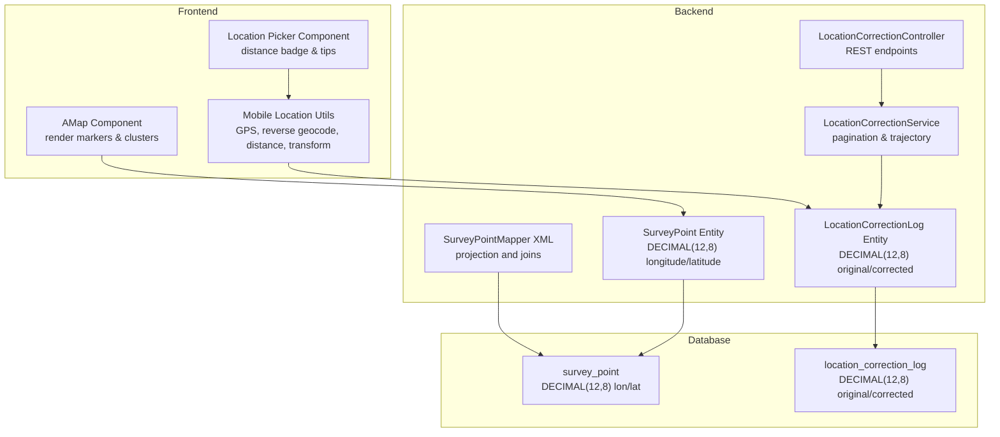
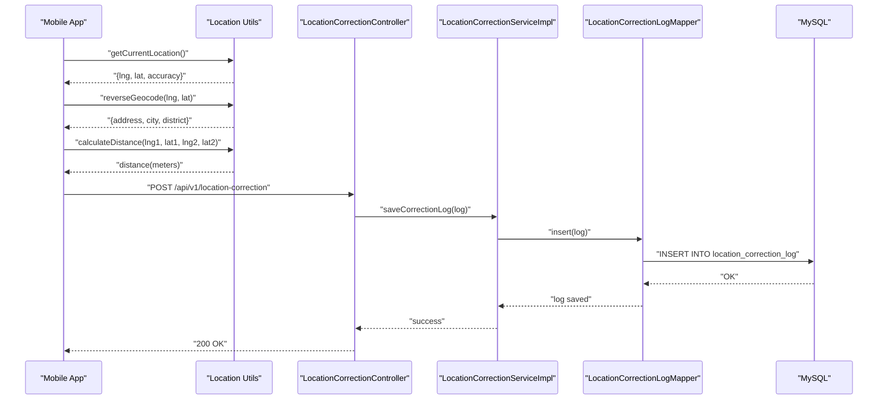
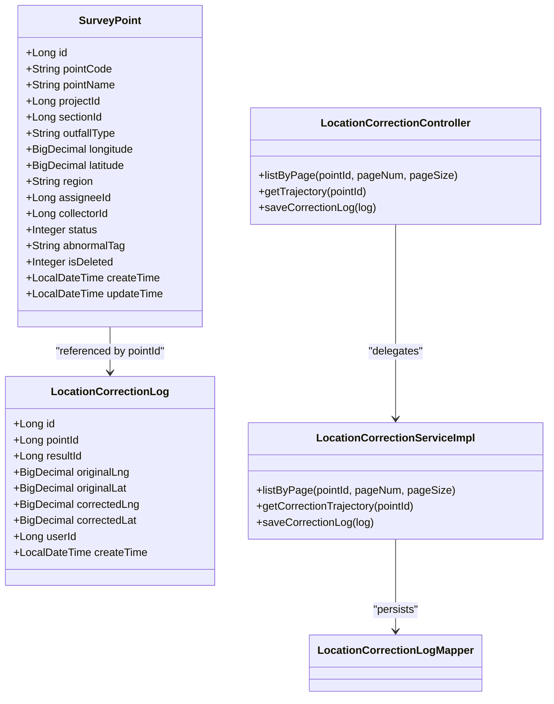
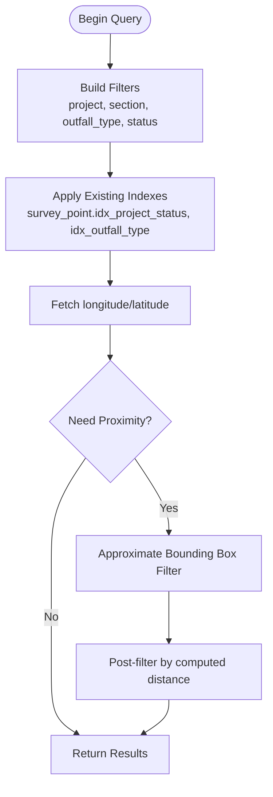
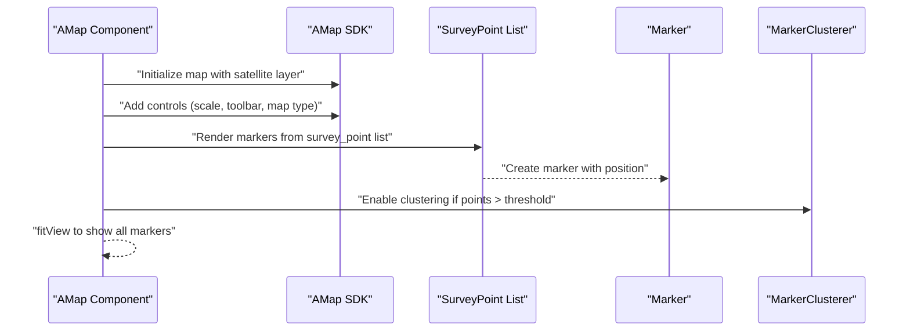
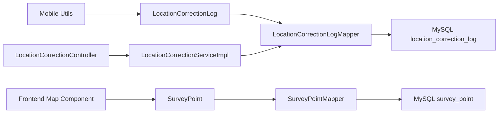

# Spatial Data Handling

<cite>
**Referenced Files in This Document**
- [SurveyPoint.java](file://admin-backend/src/main/java/com/qhiot/survey/entity/SurveyPoint.java)
- [LocationCorrectionLog.java](file://admin-backend/src/main/java/com/qhiot/survey/entity/LocationCorrectionLog.java)
- [SurveyPointMapper.java](file://admin-backend/src/main/java/com/qhiot/survey/mapper/SurveyPointMapper.java)
- [SurveyPointMapper.xml](file://admin-backend/src/main/resources/mapper/SurveyPointMapper.xml)
- [LocationCorrectionService.java](file://admin-backend/src/main/java/com/qhiot/survey/service/LocationCorrectionService.java)
- [LocationCorrectionServiceImpl.java](file://admin-backend/src/main/java/com/qhiot/survey/service/impl/LocationCorrectionServiceImpl.java)
- [LocationCorrectionController.java](file://admin-backend/src/main/java/com/qhiot/survey/controller/LocationCorrectionController.java)
- [LocationCorrectionLogMapper.java](file://admin-backend/src/main/java/com/qhiot/survey/mapper/LocationCorrectionLogMapper.java)
- [init.sql](file://init-sql/init.sql)
- [05-database-indexes.sql](file://admin-backend/init-data/05-database-indexes.sql)
- [add-database-indexes.sql](file://admin-backend/add-database-indexes.sql)
- [amap-component.vue](file://admin-web-soybean/src/components/custom/amap-component.vue)
- [location.js](file://mobile-app/src/utils/location.js)
- [location-picker.vue](file://mobile-app/src/components/location-picker/location-picker.vue)
</cite>

## Table of Contents
1. [Introduction](#introduction)
2. [Project Structure](#project-structure)
3. [Core Components](#core-components)
4. [Architecture Overview](#architecture-overview)
5. [Detailed Component Analysis](#detailed-component-analysis)
6. [Dependency Analysis](#dependency-analysis)
7. [Performance Considerations](#performance-considerations)
8. [Troubleshooting Guide](#troubleshooting-guide)
9. [Conclusion](#conclusion)
10. [Appendices](#appendices)

## Introduction
This document explains how Survey-App manages spatial data for GPS coordinates, including storage precision, location correction tracking, spatial query patterns, mapping integrations, and accuracy validation. It consolidates backend persistence and mapping frontends to provide a complete picture of coordinate handling across the system.

## Project Structure
Spatial data spans three layers:
- Backend persistence and APIs: Entities, mappers, services, and controllers for survey points and location correction logs.
- Database schema: Tables for survey points and correction logs with DECIMAL(12,8) precision for longitude and latitude.
- Frontend mapping and mobile utilities: Vue components for map rendering and location utilities for GPS, reverse geocoding, distance calculation, and coordinate transformations.

**Diagram sources**
- [SurveyPoint.java:46-48](file://admin-backend/src/main/java/com/qhiot/survey/entity/SurveyPoint.java#L46-L48)
- [LocationCorrectionLog.java:26-32](file://admin-backend/src/main/java/com/qhiot/survey/entity/LocationCorrectionLog.java#L26-L32)
- [SurveyPointMapper.xml:14-15](file://admin-backend/src/main/resources/mapper/SurveyPointMapper.xml#L14-L15)
- [init.sql:108-109](file://init-sql/init.sql#L108-L109)
- [init.sql:177-180](file://init-sql/init.sql#L177-L180)
- [amap-component.vue:169-218](file://admin-web-soybean/src/components/custom/amap-component.vue#L169-L218)
- [location.js:144-164](file://mobile-app/src/utils/location.js#L144-L164)
- [location.js:206-221](file://mobile-app/src/utils/location.js#L206-L221)
- [location.js:272-294](file://mobile-app/src/utils/location.js#L272-L294)
- [location-picker.vue:104-114](file://mobile-app/src/components/location-picker/location-picker.vue#L104-L114)

**Section sources**
- [SurveyPoint.java:17-84](file://admin-backend/src/main/java/com/qhiot/survey/entity/SurveyPoint.java#L17-L84)
- [LocationCorrectionLog.java:14-37](file://admin-backend/src/main/java/com/qhiot/survey/entity/LocationCorrectionLog.java#L14-L37)
- [SurveyPointMapper.xml:6-48](file://admin-backend/src/main/resources/mapper/SurveyPointMapper.xml#L6-L48)
- [init.sql:101-185](file://init-sql/init.sql#L101-L185)
- [amap-component.vue:169-218](file://admin-web-soybean/src/components/custom/amap-component.vue#L169-L218)
- [location.js:144-164](file://mobile-app/src/utils/location.js#L144-L164)
- [location.js:206-221](file://mobile-app/src/utils/location.js#L206-L221)
- [location.js:272-294](file://mobile-app/src/utils/location.js#L272-L294)
- [location-picker.vue:104-114](file://mobile-app/src/components/location-picker/location-picker.vue#L104-L114)

## Core Components
- SurveyPoint entity stores longitude and latitude as DECIMAL(12,8), enabling precise geographic coordinates suitable for regional-scale mapping and local positioning needs.
- LocationCorrectionLog tracks original and corrected coordinates along with timestamps and operator identity, supporting audit trails for GPS adjustments.
- Backend mapping and pagination services expose REST endpoints to list correction logs and trajectories by point ID.
- Frontend map component renders markers and supports clustering for dense datasets.
- Mobile utilities provide GPS acquisition, reverse geocoding, distance computation, and coordinate transformation between WGS84 and GCJ02.

**Section sources**
- [SurveyPoint.java:46-48](file://admin-backend/src/main/java/com/qhiot/survey/entity/SurveyPoint.java#L46-L48)
- [LocationCorrectionLog.java:26-32](file://admin-backend/src/main/java/com/qhiot/survey/entity/LocationCorrectionLog.java#L26-L32)
- [LocationCorrectionController.java:27-48](file://admin-backend/src/main/java/com/qhiot/survey/controller/LocationCorrectionController.java#L27-L48)
- [LocationCorrectionServiceImpl.java:24-47](file://admin-backend/src/main/java/com/qhiot/survey/service/impl/LocationCorrectionServiceImpl.java#L24-L47)
- [amap-component.vue:169-218](file://admin-web-soybean/src/components/custom/amap-component.vue#L169-L218)
- [location.js:144-164](file://mobile-app/src/utils/location.js#L144-L164)
- [location.js:206-221](file://mobile-app/src/utils/location.js#L206-L221)
- [location.js:272-294](file://mobile-app/src/utils/location.js#L272-L294)

## Architecture Overview
End-to-end flow for spatial data handling:
- Mobile app acquires GPS coordinates (GCJ02) and optionally transforms to WGS84 for display.
- Reverse geocoding enriches coordinates with address metadata.
- Distance calculations compare current position against target point.
- On significant deviation, the system records a correction log with original and corrected coordinates.
- Backend exposes endpoints to list correction logs and trajectories.
- Frontend map displays markers and clusters for efficient visualization.

**Diagram sources**
- [location.js:144-164](file://mobile-app/src/utils/location.js#L144-L164)
- [location.js:86-138](file://mobile-app/src/utils/location.js#L86-L138)
- [location.js:206-221](file://mobile-app/src/utils/location.js#L206-L221)
- [LocationCorrectionController.java:42-48](file://admin-backend/src/main/java/com/qhiot/survey/controller/LocationCorrectionController.java#L42-L48)
- [LocationCorrectionServiceImpl.java:44-47](file://admin-backend/src/main/java/com/qhiot/survey/service/impl/LocationCorrectionServiceImpl.java#L44-L47)
- [LocationCorrectionLogMapper.java:1-9](file://admin-backend/src/main/java/com/qhiot/survey/mapper/LocationCorrectionLogMapper.java#L1-L9)
- [init.sql:173-185](file://init-sql/init.sql#L173-L185)

## Detailed Component Analysis

### Coordinate Storage Precision: DECIMAL(12,8)
- Both survey_point.longitude/latitude and location_correction_log.original_lng/original_lat/corrected_lng/corrected_lat are defined as DECIMAL(12,8).
- This precision allows up to 12 digits with 8 decimal places, sufficient for sub-meter accuracy at typical mid-latitude regions. For example, around latitude 30°, each degree of longitude corresponds to approximately 85 km; with 8 decimals, the resolution is finer than 1 cm near the equator and scales appropriately with cosine(latitude).
- Rationale:
  - Sub-meter precision meets most field survey needs.
  - Ensures consistent rounding behavior across systems and avoids floating-point drift.
  - Supports reliable sorting and grouping without loss of fidelity.

**Section sources**
- [init.sql:108-109](file://init-sql/init.sql#L108-L109)
- [init.sql:177-180](file://init-sql/init.sql#L177-L180)
- [SurveyPoint.java:46-48](file://admin-backend/src/main/java/com/qhiot/survey/entity/SurveyPoint.java#L46-L48)
- [LocationCorrectionLog.java:26-32](file://admin-backend/src/main/java/com/qhiot/survey/entity/LocationCorrectionLog.java#L26-L32)

### Location Correction Tracking
- Entities:
  - SurveyPoint: stores longitude and latitude for each survey point.
  - LocationCorrectionLog: stores original and corrected coordinates, associated point/result/operator, and creation time.
- Backend:
  - Controller exposes endpoints to list correction logs (with pagination) and fetch trajectory by point ID.
  - Service implements pagination, ordering by creation time, and trajectory retrieval ordered chronologically.
  - Mapper extends MyBatis-Plus base mapper for persistence operations.
- Frontend:
  - Map component renders markers and enables clustering for dense point sets.
  - Mobile picker computes distance to target and triggers correction logging when deviation exceeds thresholds.

**Diagram sources**
- [SurveyPoint.java:17-84](file://admin-backend/src/main/java/com/qhiot/survey/entity/SurveyPoint.java#L17-L84)
- [LocationCorrectionLog.java:14-37](file://admin-backend/src/main/java/com/qhiot/survey/entity/LocationCorrectionLog.java#L14-L37)
- [LocationCorrectionController.java:27-48](file://admin-backend/src/main/java/com/qhiot/survey/controller/LocationCorrectionController.java#L27-L48)
- [LocationCorrectionServiceImpl.java:24-47](file://admin-backend/src/main/java/com/qhiot/survey/service/impl/LocationCorrectionServiceImpl.java#L24-L47)
- [LocationCorrectionLogMapper.java:1-9](file://admin-backend/src/main/java/com/qhiot/survey/mapper/LocationCorrectionLogMapper.java#L1-L9)

**Section sources**
- [SurveyPoint.java:46-48](file://admin-backend/src/main/java/com/qhiot/survey/entity/SurveyPoint.java#L46-L48)
- [LocationCorrectionLog.java:26-32](file://admin-backend/src/main/java/com/qhiot/survey/entity/LocationCorrectionLog.java#L26-L32)
- [LocationCorrectionController.java:27-48](file://admin-backend/src/main/java/com/qhiot/survey/controller/LocationCorrectionController.java#L27-L48)
- [LocationCorrectionServiceImpl.java:24-47](file://admin-backend/src/main/java/com/qhiot/survey/service/impl/LocationCorrectionServiceImpl.java#L24-L47)
- [LocationCorrectionLogMapper.java:1-9](file://admin-backend/src/main/java/com/qhiot/survey/mapper/LocationCorrectionLogMapper.java#L1-L9)

### Spatial Query Patterns and Filtering
- Proximity searches and area filtering:
  - Current schema does not define spatial indexes or dedicated spatial functions. Proximity queries would require:
    - Adding spatial indexes or computed distance filters in SQL.
    - Using spatial functions (e.g., distance calculation via trigonometric formulas) or spatial extensions.
  - Until then, approximate filtering can be achieved by:
    - Bounding boxes using longitude/latitude comparisons.
    - Post-filtering results by computed distance in the application layer.
- Coordinate-based filtering:
  - Filter by project, section, outfall type, and status using existing indexes.
  - Projection of longitude/latitude is supported by the mapper XML for list views.

**Diagram sources**
- [SurveyPointMapper.xml:34-46](file://admin-backend/src/main/resources/mapper/SurveyPointMapper.xml#L34-L46)
- [init.sql:118-121](file://init-sql/init.sql#L118-L121)

**Section sources**
- [SurveyPointMapper.xml:6-48](file://admin-backend/src/main/resources/mapper/SurveyPointMapper.xml#L6-L48)
- [SurveyPointMapper.java:14-25](file://admin-backend/src/main/java/com/qhiot/survey/mapper/SurveyPointMapper.java#L14-L25)
- [init.sql:118-121](file://init-sql/init.sql#L118-L121)

### Integration with Mapping Services and Coordinate Systems
- Frontend map integration:
  - AMap component initializes a satellite-style map, adds controls, listens for clicks, and renders markers with clustering for dense datasets.
  - Markers display formatted coordinates and status indicators.
- Mobile coordinate handling:
  - GPS acquisition uses GCJ02 (common in China).
  - Reverse geocoding retrieves address components via AMap JS API (H5) or REST endpoint.
  - Distance calculation uses spherical law of cosines with Earth radius.
  - Optional WGS84 to GCJ02 conversion is provided for interoperability.

**Diagram sources**
- [amap-component.vue:109-141](file://admin-web-soybean/src/components/custom/amap-component.vue#L109-L141)
- [amap-component.vue:169-218](file://admin-web-soybean/src/components/custom/amap-component.vue#L169-L218)
- [SurveyPointMapper.xml:14-15](file://admin-backend/src/main/resources/mapper/SurveyPointMapper.xml#L14-L15)

**Section sources**
- [amap-component.vue:109-141](file://admin-web-soybean/src/components/custom/amap-component.vue#L109-L141)
- [amap-component.vue:169-218](file://admin-web-soybean/src/components/custom/amap-component.vue#L169-L218)
- [location.js:86-138](file://mobile-app/src/utils/location.js#L86-L138)
- [location.js:144-164](file://mobile-app/src/utils/location.js#L144-L164)
- [location.js:206-221](file://mobile-app/src/utils/location.js#L206-L221)
- [location.js:272-294](file://mobile-app/src/utils/location.js#L272-L294)

### Accuracy Validation and Transformation
- Accuracy validation:
  - Mobile picker computes distance to target and displays status badges ("accurate", "close", "far").
  - Thresholds guide whether manual correction is recommended.
- Coordinate transformation:
  - WGS84 to GCJ02 conversion is implemented for Chinese coordinate systems.
  - Reverse geocoding enriches coordinates with administrative and address details.

**Section sources**
- [location-picker.vue:117-132](file://mobile-app/src/components/location-picker/location-picker.vue#L117-L132)
- [location.js:206-221](file://mobile-app/src/utils/location.js#L206-L221)
- [location.js:272-294](file://mobile-app/src/utils/location.js#L272-L294)
- [location.js:86-138](file://mobile-app/src/utils/location.js#L86-L138)

### Spatial Indexing Strategies
- Current indexes:
  - survey_point: idx_project, idx_status, idx_collector, idx_outfall_type, plus composite idx_project_status in the optimized script.
  - location_correction_log: idx_point, idx_result.
- Recommendations:
  - For proximity searches, consider:
    - Spatial indexes (if supported by storage engine).
    - Computed distance filters or bounding-box prefiltering.
  - Maintain existing indexes to support list and filter operations.

**Section sources**
- [init.sql:118-121](file://init-sql/init.sql#L118-L121)
- [init.sql:183-184](file://init-sql/init.sql#L183-L184)
- [05-database-indexes.sql:77-80](file://admin-backend/init-data/05-database-indexes.sql#L77-L80)
- [add-database-indexes.sql:54-66](file://admin-backend/add-database-indexes.sql#L54-L66)

## Dependency Analysis
- Entities depend on BigDecimal for precise coordinates.
- Mappers depend on MyBatis-Plus for CRUD and pagination.
- Controllers depend on services for business logic.
- Frontend depends on AMap SDK for rendering and clustering.

**Diagram sources**
- [SurveyPoint.java:17-84](file://admin-backend/src/main/java/com/qhiot/survey/entity/SurveyPoint.java#L17-L84)
- [SurveyPointMapper.java:12-26](file://admin-backend/src/main/java/com/qhiot/survey/mapper/SurveyPointMapper.java#L12-L26)
- [LocationCorrectionLog.java:14-37](file://admin-backend/src/main/java/com/qhiot/survey/entity/LocationCorrectionLog.java#L14-L37)
- [LocationCorrectionLogMapper.java:1-9](file://admin-backend/src/main/java/com/qhiot/survey/mapper/LocationCorrectionLogMapper.java#L1-L9)
- [LocationCorrectionController.java:27-48](file://admin-backend/src/main/java/com/qhiot/survey/controller/LocationCorrectionController.java#L27-L48)
- [LocationCorrectionServiceImpl.java:24-47](file://admin-backend/src/main/java/com/qhiot/survey/service/impl/LocationCorrectionServiceImpl.java#L24-L47)

**Section sources**
- [SurveyPointMapper.java:12-26](file://admin-backend/src/main/java/com/qhiot/survey/mapper/SurveyPointMapper.java#L12-L26)
- [LocationCorrectionController.java:27-48](file://admin-backend/src/main/java/com/qhiot/survey/controller/LocationCorrectionController.java#L27-L48)
- [LocationCorrectionServiceImpl.java:24-47](file://admin-backend/src/main/java/com/qhiot/survey/service/impl/LocationCorrectionServiceImpl.java#L24-L47)

## Performance Considerations
- Precision vs. storage: DECIMAL(12,8) balances accuracy and storage overhead; ensure consistent rounding in application code.
- Indexing: Leverage existing indexes for list/filter operations; consider bounding-box prefiltering for proximity queries.
- Frontend rendering: Enable marker clustering for dense datasets to reduce DOM overhead.
- Distance computation: Prefer bounding-box filtering before computing spherical distances to minimize CPU work.

## Troubleshooting Guide
- Map fails to load:
  - Verify AMap SDK availability and API key configuration.
  - Check container element presence and lifecycle hooks.
- Incorrect coordinates in UI:
  - Confirm coordinate system (GCJ02) and transformation functions.
  - Ensure consistent decimal formatting and rounding.
- Correction log not persisted:
  - Validate controller endpoint invocation and service method calls.
  - Confirm database connectivity and table schema match entity definitions.
- Distance appears inaccurate:
  - Confirm units (meters) and formula correctness.
  - Validate input coordinates and coordinate system conversions.

**Section sources**
- [amap-component.vue:94-164](file://admin-web-soybean/src/components/custom/amap-component.vue#L94-L164)
- [location.js:206-221](file://mobile-app/src/utils/location.js#L206-L221)
- [LocationCorrectionController.java:42-48](file://admin-backend/src/main/java/com/qhiot/survey/controller/LocationCorrectionController.java#L42-L48)
- [LocationCorrectionServiceImpl.java:44-47](file://admin-backend/src/main/java/com/qhiot/survey/service/impl/LocationCorrectionServiceImpl.java#L44-L47)
- [init.sql:173-185](file://init-sql/init.sql#L173-L185)

## Conclusion
Survey-App employs DECIMAL(12,8) for longitude and latitude to achieve sub-meter precision suitable for field surveys. Location correction is tracked via a dedicated log table with REST endpoints for auditing and trajectory analysis. Frontend components integrate mapping services and mobile utilities to support GPS acquisition, reverse geocoding, distance computation, and coordinate transformations. While current schema lacks explicit spatial indexes, existing indexes and bounding-box filtering provide a practical foundation for scalable list and filter operations.

## Appendices

### Example Spatial Queries (Conceptual)
- Find nearby points within a radius:
  - Pre-filter by longitude/latitude bounds, then compute spherical distance in application or SQL.
- Area filtering:
  - Filter by administrative region or project/section associations using existing indexes.
- Coordinate-based filtering:
  - Combine filters for outfall type, status, and keyword search as implemented in the mapper.

[No sources needed since this section provides conceptual guidance]