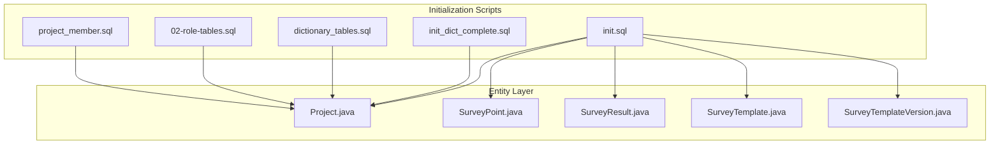
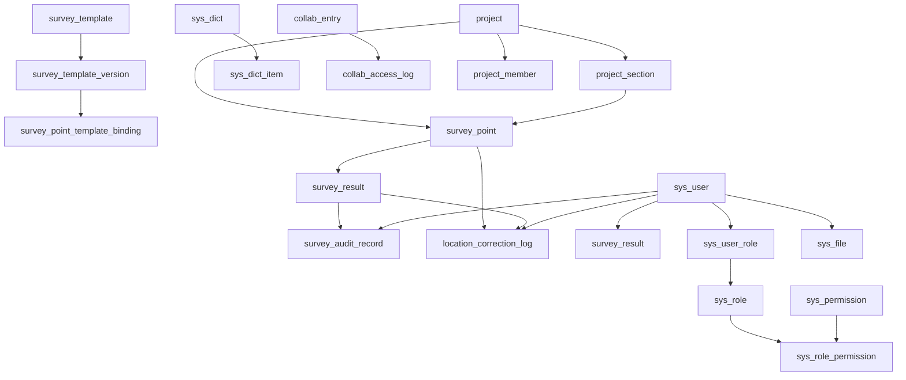

# Table Schemas

<cite>
**Referenced Files in This Document**
- [init.sql](file://init-sql/init.sql)
- [01-init.sql](file://admin-backend/init-data/01-init.sql)
- [02-role-tables.sql](file://admin-backend/init-data/02-role-tables.sql)
- [dictionary_tables.sql](file://admin-backend/src/main/resources/db/dictionary_tables.sql)
- [project_member.sql](file://admin-backend/src/main/resources/db/project_member.sql)
- [init_dict_complete.sql](file://init-sql/init_dict_complete.sql)
- [Project.java](file://admin-backend/src/main/java/com/qhiot/survey/entity/Project.java)
- [SurveyPoint.java](file://admin-backend/src/main/java/com/qhiot/survey/entity/SurveyPoint.java)
- [SurveyResult.java](file://admin-backend/src/main/java/com/qhiot/survey/entity/SurveyResult.java)
- [SurveyTemplate.java](file://admin-backend/src/main/java/com/qhiot/survey/entity/SurveyTemplate.java)
- [SurveyTemplateVersion.java](file://admin-backend/src/main/java/com/qhiot/survey/entity/SurveyTemplateVersion.java)
</cite>

## Table of Contents
1. [Introduction](#introduction)
2. [Project Structure](#project-structure)
3. [Core Components](#core-components)
4. [Architecture Overview](#architecture-overview)
5. [Detailed Component Analysis](#detailed-component-analysis)
6. [Dependency Analysis](#dependency-analysis)
7. [Performance Considerations](#performance-considerations)
8. [Troubleshooting Guide](#troubleshooting-guide)
9. [Conclusion](#conclusion)
10. [Appendices](#appendices)

## Introduction
This document provides comprehensive table schema documentation for the Survey-App database. It covers all core relational tables, including primary keys, unique constraints, foreign keys, indexes, JSON column usage for dynamic form data and configuration, timestamp columns with automatic update behavior, soft delete patterns, and ENUM-like status fields implemented via TINYINT. It also documents schema evolution through initialization and migration scripts and outlines backward compatibility considerations.

## Project Structure
The database schema is primarily defined by initialization scripts and maintained through migration-style scripts. Entity classes in the backend align with the database structure and are used by the persistence layer.



**Diagram sources**
- [init.sql:11-516](file://init-sql/init.sql#L11-L516)
- [init_dict_complete.sql:12-394](file://init-sql/init_dict_complete.sql#L12-L394)
- [dictionary_tables.sql:2-32](file://admin-backend/src/main/resources/db/dictionary_tables.sql#L2-L32)
- [02-role-tables.sql:2-32](file://admin-backend/init-data/02-role-tables.sql#L2-L32)
- [project_member.sql:2-16](file://admin-backend/src/main/resources/db/project_member.sql#L2-L16)
- [Project.java:16-84](file://admin-backend/src/main/java/com/qhiot/survey/entity/Project.java#L16-L84)
- [SurveyPoint.java:17-84](file://admin-backend/src/main/java/com/qhiot/survey/entity/SurveyPoint.java#L17-L84)
- [SurveyResult.java:15-93](file://admin-backend/src/main/java/com/qhiot/survey/entity/SurveyResult.java#L15-L93)
- [SurveyTemplate.java:14-61](file://admin-backend/src/main/java/com/qhiot/survey/entity/SurveyTemplate.java#L14-L61)
- [SurveyTemplateVersion.java:14-38](file://admin-backend/src/main/java/com/qhiot/survey/entity/SurveyTemplateVersion.java#L14-L38)

**Section sources**
- [init.sql:11-516](file://init-sql/init.sql#L11-L516)
- [01-init.sql:11-516](file://admin-backend/init-data/01-init.sql#L11-L516)
- [02-role-tables.sql:1-32](file://admin-backend/init-data/02-role-tables.sql#L1-L32)
- [dictionary_tables.sql:1-88](file://admin-backend/src/main/resources/db/dictionary_tables.sql#L1-L88)
- [project_member.sql:1-16](file://admin-backend/src/main/resources/db/project_member.sql#L1-L16)
- [init_dict_complete.sql:1-251](file://init-sql/init_dict_complete.sql#L1-L251)

## Core Components
Below are the core relational tables with their schemas, constraints, and business meanings. JSON columns are documented with typical structures and validation expectations.

- project
  - Purpose: Project lifecycle and metadata.
  - Primary key: id (BIGINT, auto-increment).
  - Unique constraints: project_code (VARCHAR).
  - Indexes: idx_status, idx_manager.
  - Timestamps: create_time, update_time with automatic updates.
  - Status ENUM-like: TINYINT (0 draft, 1 active, 2 paused, 3 completed, 4 archived).
  - Business fields: project_name, manager, region, client_name, description, start_date, end_date, counts for template_count, point_count, completed_count, pending_audit_count.

- project_section
  - Purpose: Subdivide projects into sections/regions.
  - Primary key: id (BIGINT, auto-increment).
  - Foreign keys: project_id -> project(id).
  - Indexes: idx_project, idx_manager.
  - Timestamps: create_time, update_time with automatic updates.
  - Status ENUM-like: TINYINT (1 enabled, 0 disabled).

- survey_template
  - Purpose: Dynamic survey template master.
  - Primary key: id (BIGINT, auto-increment).
  - Unique constraints: template_code (VARCHAR).
  - Indexes: idx_status.
  - Timestamps: create_time, update_time with automatic updates.
  - Status ENUM-like: TINYINT (0 draft, 1 published, 2 suspended).
  - Fields: current_version_id, creator_id.

- survey_template_version
  - Purpose: Versioned template configurations.
  - Primary key: id (BIGINT, auto-increment).
  - Foreign keys: template_id -> survey_template(id).
  - Unique constraints: (template_id, version_no).
  - Indexes: idx_status.
  - Timestamps: create_time; publish_time optional.
  - JSON columns: fields_json (required), rules_json (optional), linkage_rules_json (optional).
  - Status ENUM-like: TINYINT (0 draft, 1 published).

- survey_point_template_binding
  - Purpose: Bind outfall types to templates per project/section.
  - Primary key: id (BIGINT, auto-increment).
  - Foreign keys: project_id -> project(id), section_id -> project_section(id), template_id -> survey_template(id), template_version_id -> survey_template_version(id).
  - Unique constraints: (project_id, section_id, outfall_type).
  - Indexes: idx_template.
  - Timestamps: create_time.

- survey_point
  - Purpose: Survey point records with geolocation and assignment.
  - Primary key: id (BIGINT, auto-increment).
  - Unique constraints: point_code (VARCHAR).
  - Indexes: idx_project, idx_status, idx_collector, idx_outfall_type.
  - Timestamps: create_time, update_time with automatic updates.
  - Status ENUM-like: TINYINT (0 unassigned, 1 drafting, 2 pending audit, 3 approved, 4 rejected, 5 archived, 6 void).
  - Soft delete: is_deleted (TINYINT, 1 deleted, 0 active).
  - Business fields: point_name, project_id, section_id, outfall_type, longitude, latitude, region, assignee_id, collector_id, abnormal_tag.

- survey_result
  - Purpose: Versioned survey results with form data and audit trail.
  - Primary key: id (BIGINT, auto-increment).
  - Foreign keys: point_id -> survey_point(id).
  - Unique constraints: (point_id, version_no).
  - Indexes: idx_result_status, idx_audit_status, idx_survey_user, idx_auditor.
  - Timestamps: create_time, update_time with automatic updates.
  - JSON columns: form_data (required JSON object), images (JSON array of URLs).
  - Status ENUM-like: TINYINT (0 draft, 1 submitted, 2 pending audit, 3 approved, 4 rejected, 5 archived).
  - Audit redundancy: audit_status (TINYINT), audit_remark (VARCHAR).
  - Audit timestamps: submit_time, audit_time.
  - Audit references: survey_user_id, auditor_id.
  - Optimistic locking: optimistic_lock_version (INT).
  - Soft delete: is_deleted (TINYINT).

- survey_audit_record
  - Purpose: Audit actions and comments.
  - Primary key: id (BIGINT, auto-increment).
  - Foreign keys: result_id -> survey_result(id), point_id -> survey_point(id), auditor_id -> sys_user(id).
  - Indexes: idx_result, idx_point, idx_auditor, idx_action.
  - Timestamps: create_time.
  - Action ENUM-like: VARCHAR (values include pass, reject, transfer).

- location_correction_log
  - Purpose: Log position corrections.
  - Primary key: id (BIGINT, auto-increment).
  - Foreign keys: point_id -> survey_point(id), result_id -> survey_result(id).
  - Indexes: idx_point, idx_result.
  - Timestamps: create_time.
  - Coordinates: original_lng/original_lat, corrected_lng/ corrected_lat (DECIMAL).

- export_task
  - Purpose: Manage export tasks (lists, audit results, PDFs).
  - Primary key: id (BIGINT, auto-increment).
  - Indexes: idx_status, idx_creator.
  - Timestamps: create_time, update_time with automatic updates.
  - Status ENUM-like: TINYINT (0 pending, 1 generating, 2 completed, 3 failed, 4 expired).
  - Targets: project_id, point_id, result_id (optional).
  - Metadata: task_name, task_type, file_url, file_name, file_size, expire_time, error_msg, creator_id.

- collab_entry
  - Purpose: Third-party collaboration access tokens.
  - Primary key: id (BIGINT, auto-increment).
  - Unique constraints: token (VARCHAR).
  - Indexes: idx_token, idx_status.
  - Timestamps: create_time, update_time with automatic updates.
  - Status ENUM-like: TINYINT (0 inactive, 1 active, 2 expired, 3 revoked).
  - Scope: project_ids (JSON array), point_ids (JSON array), permissions (JSON), expire_time, access_count, last_access_time, creator_id.

- operation_log
  - Purpose: System operation audit.
  - Primary key: id (BIGINT, auto-increment).
  - Indexes: idx_user, idx_module_action, idx_risk_level, idx_create_time.
  - Timestamps: create_time.
  - Risk level ENUM-like: TINYINT (0 low, 1 medium, 2 high).

- login_log
  - Purpose: Login attempts and outcomes.
  - Primary key: id (BIGINT, auto-increment).
  - Indexes: idx_user, idx_status, idx_create_time.
  - Timestamps: create_time.
  - Login type ENUM-like: VARCHAR (internal, collab).
  - Outcome: status (TINYINT, 0 success, 1 failure), fail_reason.

- sys_role
  - Purpose: Roles with permissions.
  - Primary key: id (BIGINT, auto-increment).
  - Unique constraints: role_code (VARCHAR).
  - Timestamps: create_time, update_time with automatic updates.
  - Status ENUM-like: TINYINT (1 enabled, 0 disabled).
  - Permissions: JSON (supports wildcard or comma-separated codes).

- sys_user_role
  - Purpose: User-role assignments.
  - Primary key: id (BIGINT, auto-increment).
  - Unique constraints: (user_id, role_id).
  - Timestamps: create_time.

- sys_permission
  - Purpose: Permission catalog.
  - Primary key: id (BIGINT, auto-increment).
  - Unique constraints: perm_code (VARCHAR).
  - Indexes: idx_module, idx_status.
  - Timestamps: create_time, update_time with automatic updates.
  - Status ENUM-like: TINYINT (1 enabled, 0 disabled).
  - Fields: perm_name, module, description, sort.

- sys_role_permission
  - Purpose: Role-permission mapping.
  - Primary key: id (BIGINT, auto-increment).
  - Unique constraints: (role_id, perm_code).
  - Indexes: idx_role, idx_perm.
  - Timestamps: create_time.

- sys_user
  - Purpose: Application users.
  - Primary key: id (BIGINT, auto-increment).
  - Unique constraints: username (VARCHAR).
  - Indexes: idx_username, idx_status.
  - Timestamps: create_time, update_time with automatic updates.
  - Status ENUM-like: TINYINT (1 enabled, 0 disabled).
  - Security: password (hashed), login_fail_count, lock_time, last_login_time.
  - Lifecycle: is_first_login, is_deleted, version (optimistic lock), create_by, update_by, deleted_time, deleted_by.

- message_center
  - Purpose: In-system notifications.
  - Primary key: id (BIGINT, auto-increment).
  - Indexes: idx_user, idx_msg_type, idx_is_read.
  - Timestamps: create_time.
  - Read state: is_read (TINYINT), read_time.
  - Push state: push_status (TINYINT, 0 pending, 1 sent, 2 failed).
  - Target: target_type, target_id.

- sys_dict
  - Purpose: Simplified dictionary categories.
  - Primary key: id (BIGINT, auto-increment).
  - Unique constraints: dict_code (VARCHAR).
  - Timestamps: create_time, update_time with automatic updates.
  - Status ENUM-like: TINYINT (1 enabled, 0 disabled).

- sys_dict_item
  - Purpose: Dictionary items.
  - Primary key: id (BIGINT, auto-increment).
  - Foreign keys: dict_id -> sys_dict(id).
  - Indexes: idx_dict.
  - Timestamps: create_time, update_time with automatic updates.
  - Status ENUM-like: TINYINT (1 enabled, 0 disabled).
  - Ordering: sort_order.

- collab_access_log
  - Purpose: Collaboration access tracking.
  - Primary key: id (BIGINT, auto-increment).
  - Foreign keys: entry_id -> collab_entry(id).
  - Indexes: idx_entry, idx_create_time.
  - Timestamps: create_time.
  - Network: ip, user_agent, request_path, response_code.

- sys_file
  - Purpose: File metadata storage.
  - Primary key: id (BIGINT, auto-increment).
  - Indexes: idx_biz, idx_creator.
  - Timestamps: create_time.
  - Business: file_name, file_path, file_size, file_type, biz_type, biz_id, creator_id.

- sys_config
  - Purpose: System configuration.
  - Primary key: id (BIGINT, auto-increment).
  - Unique constraints: config_key (VARCHAR).
  - Timestamps: update_time with automatic updates.
  - Types: config_type (ENUM-like string: string, json, number).
  - Values: config_value (TEXT).

- project_member
  - Purpose: Project membership with roles.
  - Primary key: id (BIGINT, auto-increment).
  - Unique constraints: (project_id, user_id).
  - Indexes: idx_project_id, idx_user_id, idx_role, idx_status.
  - Timestamps: create_time, update_time with automatic updates.
  - Role ENUM-like: VARCHAR (admin, collector, auditor, viewer).
  - Status ENUM-like: TINYINT (0 disabled, 1 enabled).

**Section sources**
- [init.sql:11-516](file://init-sql/init.sql#L11-L516)
- [01-init.sql:11-516](file://admin-backend/init-data/01-init.sql#L11-L516)
- [dictionary_tables.sql:2-32](file://admin-backend/src/main/resources/db/dictionary_tables.sql#L2-L32)
- [project_member.sql:2-16](file://admin-backend/src/main/resources/db/project_member.sql#L2-L16)
- [init_dict_complete.sql:12-394](file://init-sql/init_dict_complete.sql#L12-L394)

## Architecture Overview
The database follows a normalized relational design with JSON columns supporting dynamic forms and configurations. Timestamps are managed via automatic defaults and updates. Soft deletes are implemented via TINYINT flags. Roles and permissions are modeled separately for RBAC. Data dictionaries support ENUM-like semantics with flexible maintenance.

```mermaid
erDiagram
PROJECT {
bigint id PK
varchar project_name
varchar project_code UK
varchar manager
varchar region
date start_date
date end_date
tinyint status
int template_count
int point_count
int completed_count
int pending_audit_count
datetime create_time
datetime update_time
}
PROJECT_SECTION {
bigint id PK
bigint project_id FK
varchar section_name
varchar section_code
bigint manager_id
tinyint status
datetime create_time
datetime update_time
}
SURVEY_TEMPLATE {
bigint id PK
varchar template_name
varchar template_code UK
tinyint status
bigint current_version_id
bigint creator_id
datetime create_time
datetime update_time
}
SURVEY_TEMPLATE_VERSION {
bigint id PK
bigint template_id FK
int version_no
json fields_json
json rules_json
json linkage_rules_json
tinyint status
datetime publish_time
bigint creator_id
datetime create_time
uk_template_version UK
}
SURVEY_POINT_TEMPLATE_BINDING {
bigint id PK
bigint project_id FK
bigint section_id FK
varchar outfall_type
bigint template_id FK
bigint template_version_id FK
datetime create_time
}
SURVEY_POINT {
bigint id PK
varchar point_code UK
varchar point_name
bigint project_id FK
bigint section_id FK
varchar outfall_type
decimal longitude
decimal latitude
varchar region
bigint assignee_id
bigint collector_id
tinyint status
varchar abnormal_tag
tinyint is_deleted
datetime create_time
datetime update_time
}
SURVEY_RESULT {
bigint id PK
bigint point_id FK
int version_no
bigint template_version_id
json form_data
text images
tinyint result_status
tinyint audit_status
varchar audit_remark
bigint survey_user_id
int optimistic_lock_version
datetime submit_time
datetime audit_time
bigint auditor_id
tinyint is_deleted
datetime create_time
datetime update_time
uk_point_version UK
}
SURVEY_AUDIT_RECORD {
bigint id PK
bigint result_id FK
bigint point_id FK
bigint auditor_id FK
varchar action
text audit_comment
bigint reject_template_id
datetime create_time
}
LOCATION_CORRECTION_LOG {
bigint id PK
bigint point_id FK
bigint result_id FK
decimal original_lng
decimal original_lat
decimal corrected_lng
decimal corrected_lat
bigint user_id
datetime create_time
}
EXPORT_TASK {
bigint id PK
varchar task_name
varchar task_type
bigint project_id
bigint point_id
bigint result_id
tinyint status
varchar file_url
varchar file_name
bigint file_size
datetime expire_time
text error_msg
bigint creator_id
datetime create_time
datetime update_time
}
COLLAB_ENTRY {
bigint id PK
varchar entry_name
varchar token UK
text project_ids
text point_ids
json permissions
datetime expire_time
tinyint status
bigint creator_id
int access_count
datetime last_access_time
datetime create_time
datetime update_time
}
OPERATION_LOG {
bigint id PK
bigint user_id
varchar username
varchar module
varchar action
varchar target_type
bigint target_id
text detail
varchar ip
varchar user_agent
tinyint risk_level
datetime create_time
}
LOGIN_LOG {
bigint id PK
bigint user_id
varchar username
varchar login_type
tinyint status
varchar fail_reason
varchar ip
varchar user_agent
datetime create_time
}
SYS_ROLE {
bigint id PK
varchar role_code UK
varchar role_name
json permissions
tinyint status
int sort
datetime create_time
datetime update_time
}
SYS_USER_ROLE {
bigint id PK
bigint user_id
bigint role_id
datetime create_time
uk_user_role UK
}
SYS_PERMISSION {
bigint id PK
varchar perm_code UK
varchar perm_name
varchar module
varchar description
tinyint status
int sort
datetime create_time
datetime update_time
}
SYS_ROLE_PERMISSION {
bigint id PK
bigint role_id
varchar perm_code
datetime create_time
uk_role_perm UK
}
SYS_USER {
bigint id PK
varchar username UK
varchar password
varchar real_name
varchar phone
varchar email
tinyint status
tinyint is_first_login
int login_fail_count
datetime lock_time
datetime last_login_time
datetime create_time
datetime update_time
tinyint is_deleted
int version
varchar create_by
varchar update_by
datetime deleted_time
varchar deleted_by
}
MESSAGE_CENTER {
bigint id PK
bigint user_id
varchar msg_type
varchar msg_title
text msg_content
varchar target_type
bigint target_id
tinyint is_read
datetime read_time
tinyint push_status
datetime create_time
}
SYS_DICT {
bigint id PK
varchar dict_code UK
varchar dict_name
tinyint status
datetime create_time
}
SYS_DICT_ITEM {
bigint id PK
bigint dict_id FK
varchar item_label
varchar item_value
int sort_order
tinyint status
datetime create_time
}
COLLAB_ACCESS_LOG {
bigint id PK
bigint entry_id FK
varchar token
varchar ip
varchar user_agent
varchar request_path
int response_code
datetime create_time
}
SYS_FILE {
bigint id PK
varchar file_name
varchar file_path
bigint file_size
varchar file_type
varchar biz_type
bigint biz_id
bigint creator_id
datetime create_time
}
SYS_CONFIG {
bigint id PK
varchar config_key UK
text config_value
varchar config_type
varchar description
datetime update_time
}
PROJECT_MEMBER {
bigint id PK
bigint project_id
bigint user_id
varchar role
tinyint status
datetime create_time
datetime update_time
uk_project_user UK
}
PROJECT ||--o{ PROJECT_SECTION : "has"
PROJECT ||--o{ SURVEY_POINT : "contains"
PROJECT_SECTION ||--o{ SURVEY_POINT : "contains"
SURVEY_TEMPLATE ||--o{ SURVEY_TEMPLATE_VERSION : "versions"
SURVEY_TEMPLATE ||--o{ SURVEY_POINT_TEMPLATE_BINDING : "binds"
SURVEY_TEMPLATE_VERSION ||--o{ SURVEY_POINT_TEMPLATE_BINDING : "binds"
SURVEY_POINT ||--o{ SURVEY_RESULT : "produces"
SURVEY_RESULT ||--o{ SURVEY_AUDIT_RECORD : "audited_by"
SURVEY_POINT ||--o{ LOCATION_CORRECTION_LOG : "corrected_by"
SURVEY_RESULT ||--o{ LOCATION_CORRECTION_LOG : "logs"
SYS_USER ||--o{ SYS_USER_ROLE : "has"
SYS_ROLE ||--o{ SYS_ROLE_PERMISSION : "grants"
SYS_PERMISSION ||--o{ SYS_ROLE_PERMISSION : "mapped_by"
SYS_USER ||--o{ OPERATION_LOG : "performed"
SYS_USER ||--o{ LOGIN_LOG : "logged"
SYS_USER ||--o{ SURVEY_RESULT : "submitted"
SYS_USER ||--o{ SURVEY_RESULT : "audited"
SYS_USER ||--o{ LOCATION_CORRECTION_LOG : "corrected"
SYS_DICT ||--o{ SYS_DICT_ITEM : "contains"
COLLAB_ENTRY ||--o{ COLLAB_ACCESS_LOG : "accessed_by"
SYS_USER ||--o{ SYS_FILE : "uploads"
PROJECT ||--o{ PROJECT_MEMBER : "members"
```

**Diagram sources**
- [init.sql:11-516](file://init-sql/init.sql#L11-L516)
- [01-init.sql:11-516](file://admin-backend/init-data/01-init.sql#L11-L516)
- [dictionary_tables.sql:2-32](file://admin-backend/src/main/resources/db/dictionary_tables.sql#L2-L32)
- [project_member.sql:2-16](file://admin-backend/src/main/resources/db/project_member.sql#L2-L16)
- [init_dict_complete.sql:12-394](file://init-sql/init_dict_complete.sql#L12-L394)

## Detailed Component Analysis

### JSON Columns: Dynamic Form Data and Configuration
- survey_template_version.fields_json
  - Type: JSON (required).
  - Purpose: Defines dynamic form fields and their metadata.
  - Validation: Must be a valid JSON object; backend logic expects structured arrays/objects for field definitions.
  - Backward compatibility: Legacy fields_json stored as JSON; new schema uses dedicated fields_json.

- survey_template_version.rules_json
  - Type: JSON (optional).
  - Purpose: Stores validation rules for fields.
  - Validation: Must be a valid JSON object/array; structure depends on rule engine.

- survey_template_version.linkage_rules_json
  - Type: JSON (optional).
  - Purpose: Stores conditional visibility/linkage rules.
  - Validation: Must be a valid JSON object/array; structure depends on linkage engine.

- survey_result.form_data
  - Type: JSON (required).
  - Purpose: Stores collected survey data conforming to the template’s fields_json.
  - Validation: Must be a valid JSON object; keys correspond to field identifiers defined in the template.

- survey_result.images
  - Type: TEXT (JSON array of URLs).
  - Purpose: Stores photo URLs associated with the result.
  - Validation: Must be a JSON array of strings representing URLs.

- collab_entry.permissions
  - Type: JSON.
  - Purpose: Defines granular permissions for third-party access.
  - Validation: Must be a valid JSON object/array; structure depends on permission system.

- collab_entry.project_ids, collab_entry.point_ids
  - Type: TEXT (JSON arrays).
  - Purpose: Scope of access for projects and points.
  - Validation: Must be JSON arrays of numeric IDs.

- sys_role.permissions
  - Type: JSON.
  - Purpose: Stores role permissions (supports wildcard or comma-separated codes).
  - Validation: Must be a valid JSON object/array or scalar depending on implementation.

- sys_dict_item (legacy dictionary tables)
  - sys_dictionary_data.dict_code (redundant field for queries).
  - Validation: Must match parent category dict_code.

- sys_file.biz_type, biz_id
  - Purpose: Associates uploaded files with business entities.
  - Validation: biz_type must be a supported category; biz_id must reference the target entity.

**Section sources**
- [init.sql:68-81](file://init-sql/init.sql#L68-L81)
- [init.sql:127-150](file://init-sql/init.sql#L127-L150)
- [init.sql:210-226](file://init-sql/init.sql#L210-L226)
- [01-init.sql:68-81](file://admin-backend/init-data/01-init.sql#L68-L81)
- [01-init.sql:127-150](file://admin-backend/init-data/01-init.sql#L127-L150)
- [01-init.sql:210-229](file://admin-backend/init-data/01-init.sql#L210-L229)
- [dictionary_tables.sql:17-32](file://admin-backend/src/main/resources/db/dictionary_tables.sql#L17-L32)
- [init_dict_complete.sql:12-37](file://init-sql/init_dict_complete.sql#L12-L37)

### ENUM-like Status Fields (TINYINT)
- project.status
  - Values: 0 draft, 1 active, 2 paused, 3 completed, 4 archived.

- project_section.status
  - Values: 1 enabled, 0 disabled.

- survey_template.status
  - Values: 0 draft, 1 published, 2 suspended.

- survey_template_version.status
  - Values: 0 draft, 1 published.

- survey_point.status
  - Values: 0 unassigned, 1 drafting, 2 pending audit, 3 approved, 4 rejected, 5 archived, 6 void.

- survey_result.result_status
  - Values: 0 draft, 1 submitted, 2 pending audit, 3 approved, 4 rejected, 5 archived.

- survey_result.audit_status
  - Values: 0 pending, 1 passed, 2 rejected.

- export_task.status
  - Values: 0 pending, 1 generating, 2 completed, 3 failed, 4 expired.

- collab_entry.status
  - Values: 0 inactive, 1 active, 2 expired, 3 revoked.

- sys_user.status
  - Values: 1 enabled, 0 disabled.

- sys_role.status
  - Values: 1 enabled, 0 disabled.

- sys_permission.status
  - Values: 1 enabled, 0 disabled.

- sys_dict.status
  - Values: 1 enabled, 0 disabled.

- sys_dict_item.status
  - Values: 1 enabled, 0 disabled.

- operation_log.risk_level
  - Values: 0 low, 1 medium, 2 high.

- login_log.status
  - Values: 0 success, 1 failure.

- project_member.status
  - Values: 0 disabled, 1 enabled.

**Section sources**
- [init.sql:21-21](file://init-sql/init.sql#L21-L21)
- [init.sql:42-42](file://init-sql/init.sql#L42-L42)
- [init.sql:57-57](file://init-sql/init.sql#L57-L57)
- [init.sql:75-75](file://init-sql/init.sql#L75-L75)
- [init.sql:113-113](file://init-sql/init.sql#L113-L113)
- [init.sql:134-134](file://init-sql/init.sql#L134-L134)
- [init.sql:135-135](file://init-sql/init.sql#L135-L135)
- [init.sql:197-197](file://init-sql/init.sql#L197-L197)
- [init.sql:218-218](file://init-sql/init.sql#L218-L218)
- [init.sql:333-333](file://init-sql/init.sql#L333-L333)
- [init.sql:336-336](file://init-sql/init.sql#L336-L336)
- [init.sql:377-377](file://init-sql/init.sql#L377-L377)
- [init.sql:388-388](file://init-sql/init.sql#L388-L388)
- [init.sql:242-242](file://init-sql/init.sql#L242-L242)
- [init.sql:258-258](file://init-sql/init.sql#L258-L258)
- [init.sql:276-276](file://init-sql/init.sql#L276-L276)
- [init.sql:302-302](file://init-sql/init.sql#L302-L302)
- [init.sql:377-377](file://init-sql/init.sql#L377-L377)
- [init.sql:388-388](file://init-sql/init.sql#L388-L388)
- [project_member.sql:6-6](file://admin-backend/src/main/resources/db/project_member.sql#L6-L6)

### Soft Delete Patterns
- survey_point.is_deleted
  - Values: 1 deleted, 0 active.
  - Behavior: Managed via ORM logic (logical deletion).

- survey_result.is_deleted
  - Values: 1 deleted, 0 active.
  - Behavior: Managed via ORM logic (logical deletion).

- sys_user.is_deleted
  - Values: 1 deleted, 0 active.
  - Behavior: Managed via ORM logic (logical deletion).

- Additional fields for audit trail:
  - sys_user.deleted_time, deleted_by.
  - survey_point.abnormal_tag for contextual notes.

**Section sources**
- [init.sql:115-115](file://init-sql/init.sql#L115-L115)
- [init.sql:142-142](file://init-sql/init.sql#L142-L142)
- [init.sql:344-344](file://init-sql/init.sql#L344-L344)

### Timestamp Columns and Automatic Updates
- Automatic creation and updates:
  - create_time DATETIME DEFAULT CURRENT_TIMESTAMP.
  - update_time DATETIME DEFAULT CURRENT_TIMESTAMP ON UPDATE CURRENT_TIMESTAMP.
- Examples:
  - project, project_section, survey_template, survey_template_version, survey_point, survey_result, export_task, collab_entry, operation_log, login_log, sys_role, sys_user, message_center, sys_dict, sys_dict_item, collab_access_log, sys_file, sys_config, project_member.

- Specialized timestamps:
  - survey_result.submit_time, audit_time.
  - collab_entry.last_access_time.
  - sys_user.lock_time, last_login_time, deleted_time.

**Section sources**
- [init.sql:26-27](file://init-sql/init.sql#L26-L27)
- [init.sql:43-44](file://init-sql/init.sql#L43-L44)
- [init.sql:60-61](file://init-sql/init.sql#L60-L61)
- [init.sql:78-78](file://init-sql/init.sql#L78-L78)
- [init.sql:116-117](file://init-sql/init.sql#L116-L117)
- [init.sql:143-144](file://init-sql/init.sql#L143-L144)
- [init.sql:201-202](file://init-sql/init.sql#L201-L202)
- [init.sql:222-223](file://init-sql/init.sql#L222-L223)
- [init.sql:242-243](file://init-sql/init.sql#L242-L243)
- [init.sql:262-263](file://init-sql/init.sql#L262-L263)
- [init.sql:278-279](file://init-sql/init.sql#L278-L279)
- [init.sql:338-339](file://init-sql/init.sql#L338-L339)
- [init.sql:364-364](file://init-sql/init.sql#L364-L364)
- [init.sql:378-378](file://init-sql/init.sql#L378-L378)
- [init.sql:390-390](file://init-sql/init.sql#L390-L390)
- [init.sql:404-404](file://init-sql/init.sql#L404-L404)
- [init.sql:421-421](file://init-sql/init.sql#L421-L421)
- [init.sql:435-435](file://init-sql/init.sql#L435-L435)
- [init.sql:344-344](file://init-sql/init.sql#L344-L344)

### Field Descriptions and Business Context
- project
  - Counts: template_count, point_count, completed_count, pending_audit_count support reporting and dashboard metrics.
- survey_point
  - Geolocation: longitude, latitude for mapping and spatial queries.
  - Assignment: assignee_id, collector_id for workflow tracking.
- survey_result
  - Versioning: version_no ensures historical traceability.
  - Audit redundancy: audit_status mirrors result_status for efficient filtering.
- collab_entry
  - Tokenization: token enables secure third-party access.
  - Scoping: project_ids, point_ids limit access scope.
- sys_user
  - Security: password hashing, login_fail_count, lock_time for account protection.
  - Lifecycle: is_first_login, version for audit and concurrency control.

**Section sources**
- [init.sql:13-25](file://init-sql/init.sql#L13-L25)
- [init.sql:103-113](file://init-sql/init.sql#L103-L113)
- [init.sql:129-142](file://init-sql/init.sql#L129-L142)
- [init.sql:213-221](file://init-sql/init.sql#L213-L221)
- [init.sql:329-344](file://init-sql/init.sql#L329-L344)

### Schema Evolution Through Migration Scripts
- Initialization scripts:
  - init.sql and admin-backend/init-data/01-init.sql define the baseline schema and initial data.
- Dictionary systems:
  - dictionary_tables.sql defines legacy sys_dictionary/sys_dictionary_data.
  - init_dict_complete.sql defines simplified sys_dict/sys_dict_item.
- Role and permission tables:
  - 02-role-tables.sql creates sys_role, sys_user_role and inserts default roles.
- Project member table:
  - project_member.sql adds project membership with roles and status.
- Backward compatibility:
  - survey_template retains fields_json for legacy templates while new schema uses dedicated JSON columns in survey_template_version.
  - sys_role.permissions supports both JSON and string formats depending on version.

**Section sources**
- [init.sql:1-516](file://init-sql/init.sql#L1-L516)
- [01-init.sql:1-516](file://admin-backend/init-data/01-init.sql#L1-L516)
- [dictionary_tables.sql:1-88](file://admin-backend/src/main/resources/db/dictionary_tables.sql#L1-L88)
- [init_dict_complete.sql:1-251](file://init-sql/init_dict_complete.sql#L1-L251)
- [02-role-tables.sql:1-32](file://admin-backend/init-data/02-role-tables.sql#L1-L32)
- [project_member.sql:1-16](file://admin-backend/src/main/resources/db/project_member.sql#L1-L16)

### Entity Model Alignment
- Backend entities reflect database schema:
  - Project.java, SurveyPoint.java, SurveyResult.java, SurveyTemplate.java, SurveyTemplateVersion.java map directly to their respective tables.
- Notable mappings:
  - survey_result.form_data mapped as String in Java; backend handles JSON serialization/deserialization.
  - survey_point.isDeleted mapped via @TableLogic for soft delete behavior.

**Section sources**
- [Project.java:16-84](file://admin-backend/src/main/java/com/qhiot/survey/entity/Project.java#L16-L84)
- [SurveyPoint.java:17-84](file://admin-backend/src/main/java/com/qhiot/survey/entity/SurveyPoint.java#L17-L84)
- [SurveyResult.java:15-93](file://admin-backend/src/main/java/com/qhiot/survey/entity/SurveyResult.java#L15-L93)
- [SurveyTemplate.java:14-61](file://admin-backend/src/main/java/com/qhiot/survey/entity/SurveyTemplate.java#L14-L61)
- [SurveyTemplateVersion.java:14-38](file://admin-backend/src/main/java/com/qhiot/survey/entity/SurveyTemplateVersion.java#L14-L38)

## Dependency Analysis
Foreign key relationships and dependencies among core tables:



**Diagram sources**
- [init.sql:52-96](file://init-sql/init.sql#L52-L96)
- [init.sql:101-168](file://init-sql/init.sql#L101-L168)
- [init.sql:210-229](file://init-sql/init.sql#L210-L229)
- [init.sql:396-407](file://init-sql/init.sql#L396-L407)
- [init.sql:326-348](file://init-sql/init.sql#L326-L348)
- [init.sql:271-321](file://init-sql/init.sql#L271-L321)
- [init.sql:373-391](file://init-sql/init.sql#L373-L391)
- [project_member.sql:2-16](file://admin-backend/src/main/resources/db/project_member.sql#L2-L16)

**Section sources**
- [init.sql:52-96](file://init-sql/init.sql#L52-L96)
- [init.sql:101-168](file://init-sql/init.sql#L101-L168)
- [init.sql:210-229](file://init-sql/init.sql#L210-L229)
- [init.sql:396-407](file://init-sql/init.sql#L396-L407)
- [init.sql:326-348](file://init-sql/init.sql#L326-L348)
- [init.sql:271-321](file://init-sql/init.sql#L271-L321)
- [init.sql:373-391](file://init-sql/init.sql#L373-L391)
- [project_member.sql:2-16](file://admin-backend/src/main/resources/db/project_member.sql#L2-L16)

## Performance Considerations
- Indexes
  - High-selectivity filters: status, audit_status, result_status, collector_id, auditor_id, user_id, role, token, username, dict_id.
  - Composite indexes: (project_id, section_id, outfall_type) for binding lookups; (point_id, version_no) for result versioning.
- JSON columns
  - Prefer selective retrieval and avoid unnecessary JSON parsing in joins.
  - Use generated columns or materialized JSON paths if frequently filtered.
- Timestamps
  - Use indexed create_time for time-range queries; consider partitioning for large tables.
- Soft deletes
  - Add filters for is_deleted = 0 in queries; ensure indexes cover this condition.
- ENUM-like TINYINT
  - Keep small integer comparisons; maintain consistent value sets across versions.

[No sources needed since this section provides general guidance]

## Troubleshooting Guide
- JSON validation failures
  - Symptoms: Insert/update errors for JSON columns.
  - Checks: Ensure fields_json, rules_json, linkage_rules_json, form_data, images, permissions, project_ids, point_ids are valid JSON.
  - References: [init.sql:72-74](file://init-sql/init.sql#L72-L74), [init.sql:132-133](file://init-sql/init.sql#L132-L133), [init.sql:216-216](file://init-sql/init.sql#L216-L216), [init.sql:217-218](file://init-sql/init.sql#L217-L218), [init.sql:218-218](file://init-sql/init.sql#L218-L218).

- Duplicate unique keys
  - Symptoms: Duplicate entry for project_code, template_code, point_code, token, role_code, perm_code, dict_code.
  - Checks: Verify uniqueness constraints and input values.
  - References: [init.sql:14-14](file://init-sql/init.sql#L14-L14), [init.sql:55-55](file://init-sql/init.sql#L55-L55), [init.sql:103-103](file://init-sql/init.sql#L103-L103), [init.sql:213-213](file://init-sql/init.sql#L213-L213), [init.sql:273-273](file://init-sql/init.sql#L273-L273), [init.sql:298-298](file://init-sql/init.sql#L298-L298), [init.sql:375-375](file://init-sql/init.sql#L375-L375).

- Soft delete visibility
  - Symptoms: Deleted records still returned.
  - Checks: Apply is_deleted filters in queries; ensure ORM logic is configured for logical deletion.
  - References: [SurveyPoint.java:78-78](file://admin-backend/src/main/java/com/qhiot/survey/entity/SurveyPoint.java#L78-L78), [SurveyResult.java:87-87](file://admin-backend/src/main/java/com/qhiot/survey/entity/SurveyResult.java#L87-L87), [init.sql:115-115](file://init-sql/init.sql#L115-L115), [init.sql:142-142](file://init-sql/init.sql#L142-L142), [init.sql:344-344](file://init-sql/init.sql#L344-L344).

- Timestamp anomalies
  - Symptoms: Incorrect create_time/update_time values.
  - Checks: Confirm automatic defaults and ON UPDATE CURRENT_TIMESTAMP are applied; avoid manual timestamp overrides.
  - References: [init.sql:26-27](file://init-sql/init.sql#L26-L27), [init.sql:116-117](file://init-sql/init.sql#L116-L117), [init.sql:201-202](file://init-sql/init.sql#L201-L202), [init.sql:338-339](file://init-sql/init.sql#L338-L339).

- Role and permission mismatches
  - Symptoms: Access denied despite assigned roles.
  - Checks: Verify sys_user_role and sys_role_permission mappings; ensure permissions JSON is valid.
  - References: [init.sql:285-291](file://init-sql/init.sql#L285-L291), [init.sql:313-321](file://init-sql/init.sql#L313-L321), [init.sql:275-275](file://init-sql/init.sql#L275-L275), [02-role-tables.sql:22-28](file://admin-backend/init-data/02-role-tables.sql#L22-L28).

**Section sources**
- [init.sql:14-14](file://init-sql/init.sql#L14-L14)
- [init.sql:55-55](file://init-sql/init.sql#L55-L55)
- [init.sql:103-103](file://init-sql/init.sql#L103-L103)
- [init.sql:213-213](file://init-sql/init.sql#L213-L213)
- [init.sql:273-273](file://init-sql/init.sql#L273-L273)
- [init.sql:298-298](file://init-sql/init.sql#L298-L298)
- [init.sql:375-375](file://init-sql/init.sql#L375-L375)
- [SurveyPoint.java:78-78](file://admin-backend/src/main/java/com/qhiot/survey/entity/SurveyPoint.java#L78-L78)
- [SurveyResult.java:87-87](file://admin-backend/src/main/java/com/qhiot/survey/entity/SurveyResult.java#L87-L87)
- [02-role-tables.sql:22-28](file://admin-backend/init-data/02-role-tables.sql#L22-L28)

## Conclusion
The Survey-App database employs a robust relational design with JSON columns enabling dynamic form configurations and flexible data capture. ENUM-like status fields and TINYINT flags provide compact, efficient state management. Automatic timestamp handling and soft delete patterns ensure data integrity and auditability. The schema is maintained through explicit initialization and migration scripts, with backward compatibility preserved for legacy templates and permissions. Proper indexing and JSON validation practices are essential for performance and reliability.

[No sources needed since this section summarizes without analyzing specific files]

## Appendices

### Appendix A: JSON Column Usage Reference
- survey_template_version.fields_json
  - Expected structure: JSON object defining form fields.
  - Example references: [init.sql:72-72](file://init-sql/init.sql#L72-L72), [01-init.sql:72-72](file://admin-backend/init-data/01-init.sql#L72-L72).

- survey_template_version.rules_json
  - Expected structure: JSON object/array of validation rules.
  - Example references: [init.sql:73-73](file://init-sql/init.sql#L73-L73), [01-init.sql:73-73](file://admin-backend/init-data/01-init.sql#L73-L73).

- survey_template_version.linkage_rules_json
  - Expected structure: JSON object/array of linkage/visibility rules.
  - Example references: [init.sql:74-74](file://init-sql/init.sql#L74-L74), [01-init.sql:74-74](file://admin-backend/init-data/01-init.sql#L74-L74).

- survey_result.form_data
  - Expected structure: JSON object matching template fields.
  - Example references: [init.sql:132-132](file://init-sql/init.sql#L132-L132), [01-init.sql:132-132](file://admin-backend/init-data/01-init.sql#L132-L132).

- survey_result.images
  - Expected structure: JSON array of image URLs.
  - Example references: [init.sql:133-133](file://init-sql/init.sql#L133-L133), [01-init.sql:133-133](file://admin-backend/init-data/01-init.sql#L133-L133).

- collab_entry.permissions
  - Expected structure: JSON object/array of permission scopes.
  - Example references: [init.sql:216-216](file://init-sql/init.sql#L216-L216), [01-init.sql:219-219](file://admin-backend/init-data/01-init.sql#L219-L219).

- collab_entry.project_ids, collab_entry.point_ids
  - Expected structure: JSON arrays of numeric IDs.
  - Example references: [init.sql:217-217](file://init-sql/init.sql#L217-L217), [01-init.sql:218-218](file://admin-backend/init-data/01-init.sql#L218-L218).

**Section sources**
- [init.sql:72-74](file://init-sql/init.sql#L72-L74)
- [init.sql:132-133](file://init-sql/init.sql#L132-L133)
- [init.sql:216-217](file://init-sql/init.sql#L216-L217)
- [01-init.sql:72-74](file://admin-backend/init-data/01-init.sql#L72-L74)
- [01-init.sql:132-133](file://admin-backend/init-data/01-init.sql#L132-L133)
- [01-init.sql:217-218](file://admin-backend/init-data/01-init.sql#L217-L218)