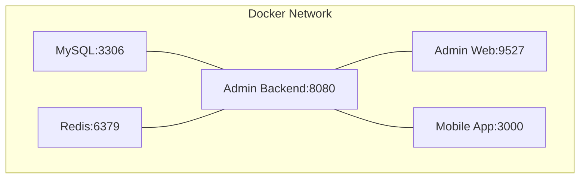
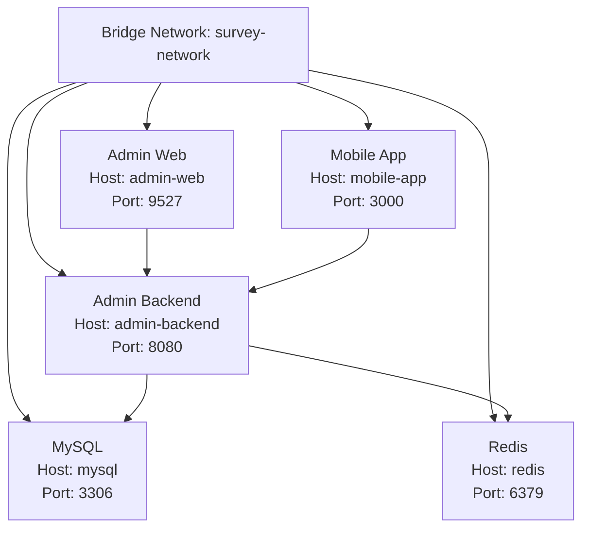
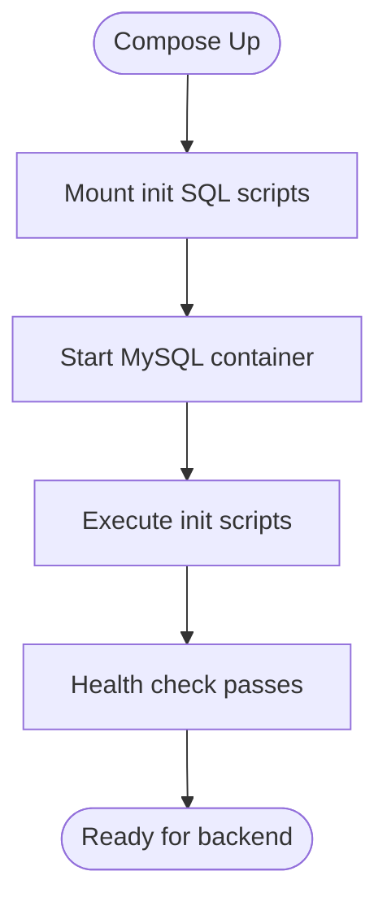
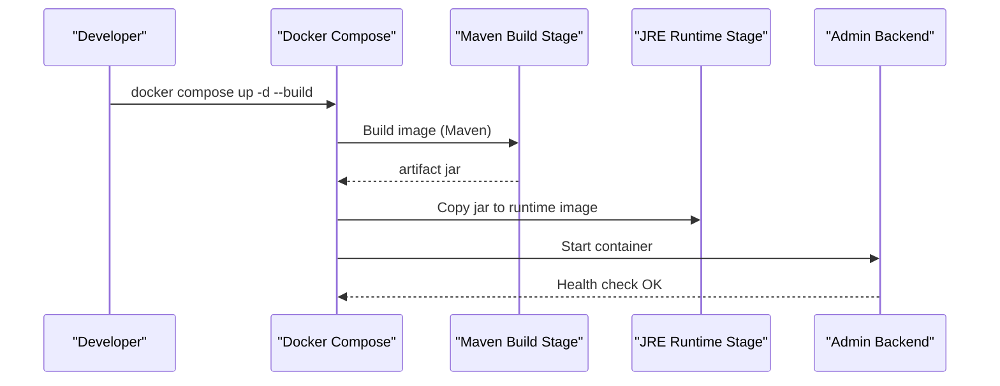
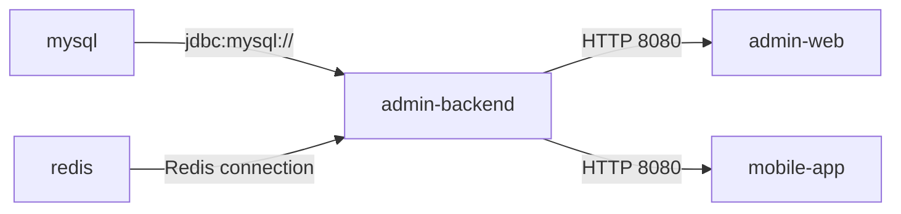

# Containerization & Orchestration

<cite>
**Referenced Files in This Document**
- [docker-compose.yml](file://docker-compose.yml)
- [Dockerfile](file://admin-backend/Dockerfile)
- [Dockerfile.fast](file://admin-backend/Dockerfile.fast)
- [.dockerignore](file://admin-backend/.dockerignore)
- [application.yml](file://admin-backend/src/main/resources/application.yml)
- [application-prod.yml](file://admin-backend/src/main/resources/application-prod.yml)
- [Dockerfile.dev (Admin Web)](file://admin-web-soybean/Dockerfile.dev)
- [Dockerfile.dev (Mobile App)](file://mobile-app/Dockerfile.dev)
- [package.json (Admin Web)](file://admin-web-soybean/package.json)
- [package.json (Mobile App)](file://mobile-app/package.json)
- [init-data/01-init.sql](file://admin-backend/init-data/01-init.sql)
- [init-mysql-docker.sh](file://admin-backend/init-mysql-docker.sh)
- [DOCKER_DEPLOYMENT_GUIDE.md](file://DOCKER_DEPLOYMENT_GUIDE.md)
</cite>

## Table of Contents
1. [Introduction](#introduction)
2. [Project Structure](#project-structure)
3. [Core Components](#core-components)
4. [Architecture Overview](#architecture-overview)
5. [Detailed Component Analysis](#detailed-component-analysis)
6. [Dependency Analysis](#dependency-analysis)
7. [Performance Considerations](#performance-considerations)
8. [Troubleshooting Guide](#troubleshooting-guide)
9. [Conclusion](#conclusion)
10. [Appendices](#appendices)

## Introduction
This document provides comprehensive containerization and orchestration guidance for Survey-App. It explains the multi-service Docker architecture including MySQL database, Redis cache, admin backend, and frontend services. It documents the docker-compose.yml configuration with service dependencies, health checks, resource limits, and networking. It also covers multi-stage Dockerfile builds for backend and frontend applications, environment variable configuration, volume mounting strategies, cross-platform compatibility, service discovery, port mappings, inter-service communication, security configurations, resource allocation, and scaling strategies.

## Project Structure
Survey-App’s containerization spans four primary services orchestrated via Docker Compose:
- MySQL relational database with initialization scripts
- Redis cache with persistence
- Admin backend service (Spring Boot Java application)
- Admin Web (Vue/Vite development server)
- Mobile App (Vite H5 development server)

**Diagram sources**
- [docker-compose.yml:5-42](file://docker-compose.yml#L5-L42)
- [docker-compose.yml:47-75](file://docker-compose.yml#L47-L75)
- [docker-compose.yml:79-147](file://docker-compose.yml#L79-L147)
- [docker-compose.yml:151-171](file://docker-compose.yml#L151-L171)
- [docker-compose.yml:176-196](file://docker-compose.yml#L176-L196)

**Section sources**
- [docker-compose.yml:1-213](file://docker-compose.yml#L1-L213)

## Core Components
- MySQL service
  - Image: official MySQL 8.0
  - Environment variables for credentials and charset
  - Initialization via mounted SQL scripts
  - Health check using mysqladmin
  - Resource-safe defaults for connections and buffer pool
- Redis service
  - Image: Redis 7 Alpine
  - Password protection, persistence, and eviction policy
  - Health check using redis-cli
- Admin Backend
  - Multi-stage Dockerfile: Maven build stage, JRE runtime stage
  - Non-root user, timezone, health check, JVM tuning
  - Exposed port 8080; mapped to host port 8081
  - Environment variables for DB, Redis, JWT, CORS, and optional cloud integrations
- Admin Web (Development)
  - Node.js 22 slim image
  - Uses pnpm; development server bound to 0.0.0.0
- Mobile App (Development)
  - Node.js 22 slim image
  - Vite H5 dev server

**Section sources**
- [docker-compose.yml:5-42](file://docker-compose.yml#L5-L42)
- [docker-compose.yml:47-75](file://docker-compose.yml#L47-L75)
- [docker-compose.yml:79-147](file://docker-compose.yml#L79-L147)
- [docker-compose.yml:151-171](file://docker-compose.yml#L151-L171)
- [docker-compose.yml:176-196](file://docker-compose.yml#L176-L196)
- [Dockerfile:1-69](file://admin-backend/Dockerfile#L1-L69)
- [Dockerfile.fast:1-51](file://admin-backend/Dockerfile.fast#L1-L51)
- [Dockerfile.dev (Admin Web):1-20](file://admin-web-soybean/Dockerfile.dev#L1-L20)
- [Dockerfile.dev (Mobile App):1-13](file://mobile-app/Dockerfile.dev#L1-L13)

## Architecture Overview
The system uses a single bridge network for internal service discovery. Services communicate using container DNS names (e.g., mysql, redis). The backend exposes a health endpoint for readiness. Frontend services depend on the backend being healthy before starting.

**Diagram sources**
- [docker-compose.yml:34-35](file://docker-compose.yml#L34-L35)
- [docker-compose.yml:67-68](file://docker-compose.yml#L67-L68)
- [docker-compose.yml:131-132](file://docker-compose.yml#L131-L132)
- [docker-compose.yml:170-171](file://docker-compose.yml#L170-L171)
- [docker-compose.yml:195-196](file://docker-compose.yml#L195-L196)

## Detailed Component Analysis

### MySQL Service
- Purpose: Persistent relational data store for Survey-App
- Initialization: SQL scripts mounted under /docker-entrypoint-initdb.d
- Health check: mysqladmin ping using root password expansion
- Tunables: max connections, buffer pool size, binlog, and character set
- Persistence: named volume for /var/lib/mysql

**Diagram sources**
- [docker-compose.yml:20-31](file://docker-compose.yml#L20-L31)
- [docker-compose.yml:36-42](file://docker-compose.yml#L36-L42)
- [init-data/01-init.sql:1-516](file://admin-backend/init-data/01-init.sql#L1-L516)

**Section sources**
- [docker-compose.yml:5-42](file://docker-compose.yml#L5-L42)
- [init-data/01-init.sql:1-516](file://admin-backend/init-data/01-init.sql#L1-L516)

### Redis Service
- Purpose: Caching and session-like state
- Security: Require password, append-only logging
- Persistence: Named volume at /data
- Health check: redis-cli ping with password expansion

**Section sources**
- [docker-compose.yml:47-75](file://docker-compose.yml#L47-L75)

### Admin Backend (Multi-Stage Build)
- Build stage: Maven 3.9.6 + Eclipse Temurin 17
  - Mirrors configured for offline dependency resolution
  - Builds jar without tests
- Runtime stage: Eclipse Temurin 17 JRE
  - Non-root user, timezone, health check, JVM tuning
  - Exposes 8080; health endpoint via wget
- Environment variables:
  - DB_* for MySQL connectivity
  - REDIS_* for Redis connectivity
  - JWT_* for authentication
  - CORS_ALLOWED_ORIGINS for browser clients
  - APP_ENV and SPRING_PROFILES_ACTIVE for production
  - Optional cloud integrations (OSS, SMS)

**Diagram sources**
- [Dockerfile:5-18](file://admin-backend/Dockerfile#L5-L18)
- [Dockerfile:24-68](file://admin-backend/Dockerfile#L24-L68)
- [docker-compose.yml:79-147](file://docker-compose.yml#L79-L147)

**Section sources**
- [Dockerfile:1-69](file://admin-backend/Dockerfile#L1-L69)
- [Dockerfile.fast:1-51](file://admin-backend/Dockerfile.fast#L1-L51)
- [.dockerignore:1-37](file://admin-backend/.dockerignore#L1-L37)
- [application.yml:24-78](file://admin-backend/src/main/resources/application.yml#L24-L78)
- [application-prod.yml:21-62](file://admin-backend/src/main/resources/application-prod.yml#L21-L62)
- [docker-compose.yml:91-123](file://docker-compose.yml#L91-L123)

### Admin Web (Development)
- Base: Node.js 22 slim
- Package manager: pnpm (enabled and pinned)
- Development server: Vite dev server bound to 0.0.0.0 for container access
- Volume mount: source code and node_modules cache

**Section sources**
- [Dockerfile.dev (Admin Web):1-20](file://admin-web-soybean/Dockerfile.dev#L1-L20)
- [package.json (Admin Web):34-41](file://admin-web-soybean/package.json#L34-L41)
- [docker-compose.yml:151-171](file://docker-compose.yml#L151-L171)

### Mobile App (Development)
- Base: Node.js 22 slim
- Development server: Vite H5 dev server bound to 0.0.0.0
- Volume mount: source code and node_modules cache

**Section sources**
- [Dockerfile.dev (Mobile App):1-13](file://mobile-app/Dockerfile.dev#L1-L13)
- [package.json (Mobile App):7-10](file://mobile-app/package.json#L7-L10)
- [docker-compose.yml:176-196](file://docker-compose.yml#L176-L196)

## Dependency Analysis
- Service dependencies
  - admin-backend depends on mysql and redis being healthy
  - admin-web and mobile-app depend on admin-backend being healthy
- Networking
  - All services join the survey-network bridge
  - Internal DNS resolves service names to container IPs
- Inter-service communication
  - Backend connects to mysql via hostname mysql
  - Backend connects to redis via hostname redis
  - Frontends proxy requests to backend on port 8080

**Diagram sources**
- [docker-compose.yml:94-103](file://docker-compose.yml#L94-L103)
- [docker-compose.yml:124-128](file://docker-compose.yml#L124-L128)
- [docker-compose.yml:167-169](file://docker-compose.yml#L167-L169)

**Section sources**
- [docker-compose.yml:124-128](file://docker-compose.yml#L124-L128)
- [docker-compose.yml:167-169](file://docker-compose.yml#L167-L169)

## Performance Considerations
- JVM tuning
  - G1GC, heap dump on OOM, explicit timezone and encoding
  - Configurable Xms/Xmx via JVM arguments
- Database tuning
  - Buffer pool and max connections configurable via environment
- Cache tuning
  - Max memory and eviction policy configurable via environment
- Resource limits and reservations
  - CPU and memory limits/reservations defined per service
- Health checks
  - MySQL and Redis use shell-based health checks
  - Backend uses HTTP health endpoint

**Section sources**
- [Dockerfile:57-68](file://admin-backend/Dockerfile#L57-L68)
- [docker-compose.yml:139-146](file://docker-compose.yml#L139-L146)
- [application-prod.yml:28-47](file://admin-backend/src/main/resources/application-prod.yml#L28-L47)
- [docker-compose.yml:29-31](file://docker-compose.yml#L29-L31)
- [docker-compose.yml:57-64](file://docker-compose.yml#L57-L64)

## Troubleshooting Guide
- Service startup failures
  - Verify health checks pass for mysql and redis
  - Check port conflicts for host ports 3306, 6379, 8081, 9527, 3000
- Connectivity issues
  - Confirm internal DNS resolution from backend to mysql and redis
  - Validate DB_* and REDIS_* environment variables
- Memory and CPU constraints
  - Adjust BACKEND_CPU_LIMIT, BACKEND_MEM_LIMIT, and related reservation keys
- Apple Silicon compatibility
  - Add platform: linux/amd64 for mysql and redis if needed
- Logs and diagnostics
  - Use docker compose logs for live tailing
  - Use docker compose exec to enter containers for inspection

**Section sources**
- [docker-compose.yml:36-42](file://docker-compose.yml#L36-L42)
- [docker-compose.yml:69-75](file://docker-compose.yml#L69-L75)
- [docker-compose.yml:133-138](file://docker-compose.yml#L133-L138)
- [DOCKER_DEPLOYMENT_GUIDE.md:285-347](file://DOCKER_DEPLOYMENT_GUIDE.md#L285-L347)

## Conclusion
Survey-App’s containerization provides a robust, reproducible, and scalable foundation for development and production. The multi-stage backend build ensures minimal runtime images, while Compose orchestrates dependencies, health checks, and resource limits. Environment-driven configuration supports secure production deployments, and development containers streamline local iteration.

## Appendices

### Environment Variables Reference
- Database
  - DB_ROOT_PASSWORD, DB_NAME, DB_USERNAME, DB_PASSWORD, DB_USE_SSL, DB_MAX_CONNECTIONS, DB_BUFFER_POOL
- Redis
  - REDIS_PASSWORD, REDIS_MAX_MEMORY
- Backend
  - DB_HOST, DB_PORT, DB_NAME, DB_USERNAME, DB_PASSWORD, DB_USE_SSL
  - REDIS_HOST, REDIS_PORT, REDIS_PASSWORD
  - JWT_SECRET, JWT_EXPIRATION, JWT_REFRESH_EXPIRATION
  - CORS_ALLOWED_ORIGINS, APP_ENV, SPRING_PROFILES_ACTIVE
  - OSS_ENDPOINT, OSS_ACCESS_KEY_ID, OSS_ACCESS_KEY_SECRET, OSS_BUCKET_NAME
  - ALIYUN_SMS_ENABLED, ALIYUN_SMS_ACCESS_KEY_ID, ALIYUN_SMS_ACCESS_KEY_SECRET, ALIYUN_SMS_SIGN_NAME, ALIYUN_SMS_TEMPLATE_CODE
- Ports
  - MYSQL_PORT, REDIS_PORT, BACKEND_PORT, ADMIN_WEB_PORT, MOBILE_WEB_PORT

**Section sources**
- [docker-compose.yml:13-19](file://docker-compose.yml#L13-L19)
- [docker-compose.yml:55-64](file://docker-compose.yml#L55-L64)
- [docker-compose.yml:93-123](file://docker-compose.yml#L93-L123)
- [docker-compose.yml:158-163](file://docker-compose.yml#L158-L163)
- [docker-compose.yml:183-188](file://docker-compose.yml#L183-L188)

### Cross-Platform Compatibility
- Platform hints for Apple Silicon:
  - Uncomment platform: linux/amd64 for mysql and redis if native images fail
- Node.js images are multi-arch compatible; ensure Docker Desktop uses appropriate emulation if needed

**Section sources**
- [docker-compose.yml:7-8](file://docker-compose.yml#L7-L8)
- [docker-compose.yml:49-50](file://docker-compose.yml#L49-L50)

### Deployment Scripts and Utilities
- One-click deployment and redeployment scripts automate environment setup, image building, and service orchestration
- Initialization script for standalone MySQL container demonstrates automated setup and verification

**Section sources**
- [DOCKER_DEPLOYMENT_GUIDE.md:24-70](file://DOCKER_DEPLOYMENT_GUIDE.md#L24-L70)
- [init-mysql-docker.sh:1-105](file://admin-backend/init-mysql-docker.sh#L1-L105)