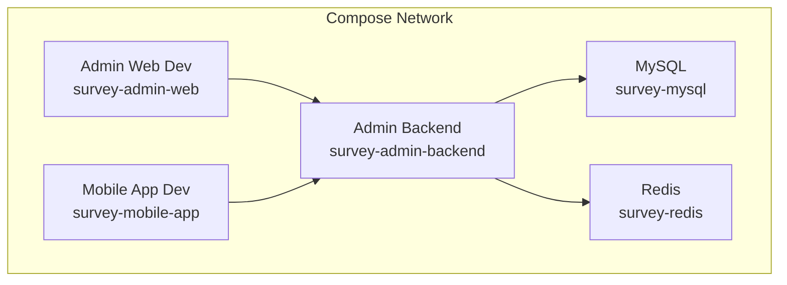
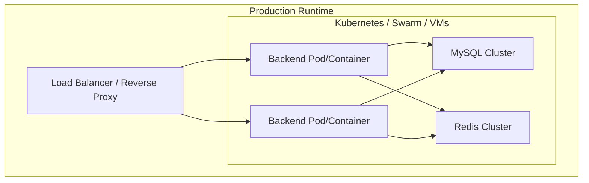
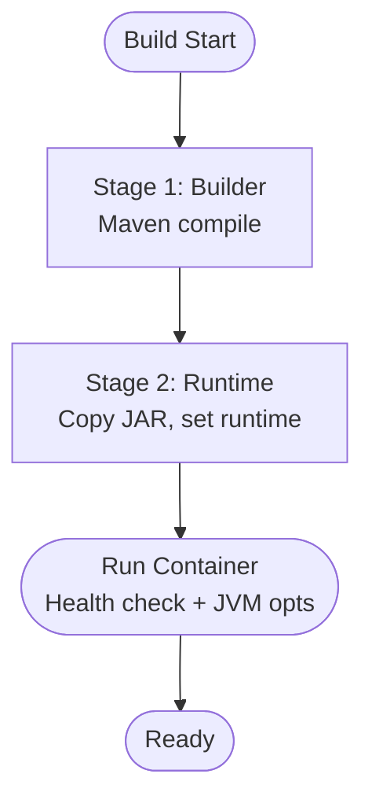
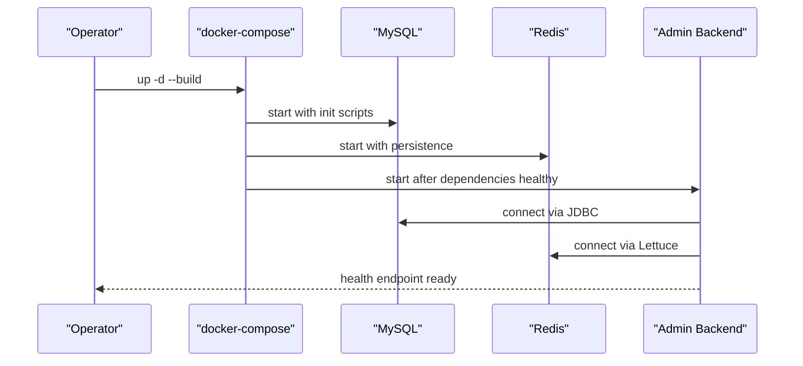
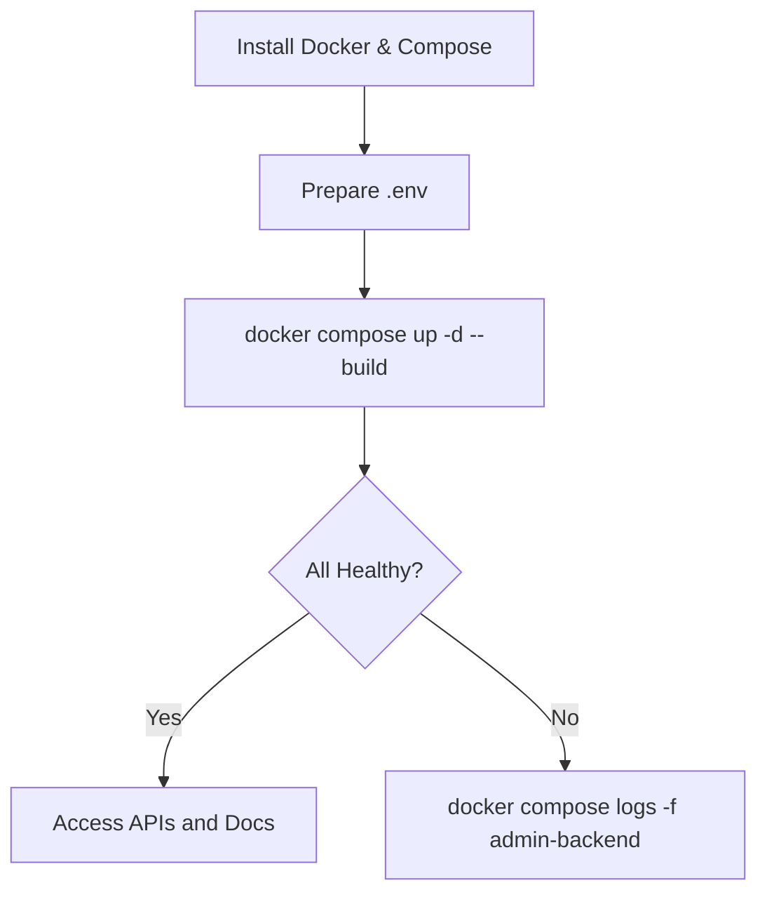
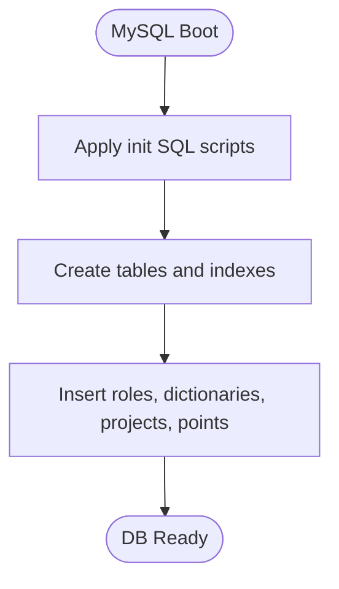
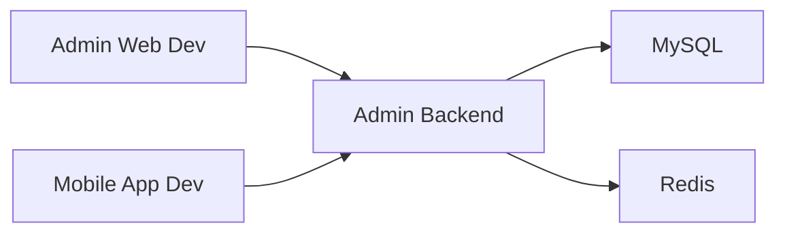
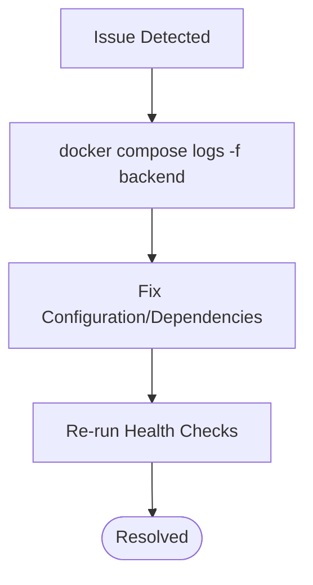

# Deployment & Operations

<cite>
**Referenced Files in This Document**
- [docker-compose.yml](file://docker-compose.yml)
- [Dockerfile](file://admin-backend/Dockerfile)
- [Dockerfile.fast](file://admin-backend/Dockerfile.fast)
- [.dockerignore](file://admin-backend/.dockerignore)
- [DEPLOY.md](file://admin-backend/DEPLOY.md)
- [application-prod.yml](file://admin-backend/src/main/resources/application-prod.yml)
- [application.yml](file://admin-backend/src/main/resources/application.yml)
- [logback-spring.xml](file://admin-backend/src/main/resources/logback-spring.xml)
- [deploy.sh](file://deploy.sh)
- [deploy-fast.sh](file://deploy-fast.sh)
- [redeploy.sh](file://redeploy.sh)
- [pre-deploy-check.sh](file://scripts/pre-deploy-check.sh)
- [01-init.sql](file://admin-backend/init-data/01-init.sql)
- [02-role-tables.sql](file://admin-backend/init-data/02-role-tables.sql)
- [03-offline-data-sync.sql](file://admin-backend/init-data/03-offline-data-sync.sql)
</cite>

## Table of Contents
1. [Introduction](#introduction)
2. [Project Structure](#project-structure)
3. [Core Components](#core-components)
4. [Architecture Overview](#architecture-overview)
5. [Detailed Component Analysis](#detailed-component-analysis)
6. [Dependency Analysis](#dependency-analysis)
7. [Performance Considerations](#performance-considerations)
8. [Troubleshooting Guide](#troubleshooting-guide)
9. [Conclusion](#conclusion)
10. [Appendices](#appendices)

## Introduction
This document provides comprehensive deployment and operations guidance for Survey-App. It covers containerization strategy with multi-stage builds, service orchestration via Docker Compose, production deployment steps, environment configuration, database initialization, CI/CD integration points, monitoring and logging, scaling and high availability, backup and disaster recovery, security hardening, and troubleshooting.

## Project Structure
Survey-App consists of:
- A Java/Spring Boot backend service packaged with multi-stage Docker builds
- A MySQL database initialized with schema and seed data
- A Redis cache for session and temporary data
- Optional cloud integrations (OSS, SMS) configured via environment variables
- Frontend development servers for admin-web and mobile-app
- Orchestration via docker-compose with health checks and resource limits

**Diagram sources**
- [docker-compose.yml:1-213](file://docker-compose.yml#L1-L213)

**Section sources**
- [docker-compose.yml:1-213](file://docker-compose.yml#L1-L213)

## Core Components
- Containerization
  - Multi-stage Dockerfile builds a minimal runtime image with a non-root user, health checks, and JVM tuning.
  - Fast Dockerfile supports pre-built artifacts for rapid iteration.
  - .dockerignore reduces build context size.
- Orchestration
  - docker-compose defines services, environment variables, health checks, volumes, and resource limits.
- Configuration
  - application-prod.yml centralizes production settings (datasource, Redis, JWT, logging, CORS, Actuator).
  - application.yml provides defaults and development overrides.
- Logging
  - logback-spring.xml configures rolling file appenders, async operation logs, and third-party log levels.
- Scripts
  - deploy.sh, deploy-fast.sh, redeploy.sh automate lifecycle operations and health verification.
  - pre-deploy-check.sh validates environment readiness and interface compatibility.

**Section sources**
- [Dockerfile:1-69](file://admin-backend/Dockerfile#L1-L69)
- [Dockerfile.fast:1-51](file://admin-backend/Dockerfile.fast#L1-L51)
- [.dockerignore:1-37](file://admin-backend/.dockerignore#L1-L37)
- [docker-compose.yml:1-213](file://docker-compose.yml#L1-L213)
- [application-prod.yml:1-140](file://admin-backend/src/main/resources/application-prod.yml#L1-L140)
- [application.yml:1-149](file://admin-backend/src/main/resources/application.yml#L1-L149)
- [logback-spring.xml:1-125](file://admin-backend/src/main/resources/logback-spring.xml#L1-L125)
- [deploy.sh:1-153](file://deploy.sh#L1-L153)
- [deploy-fast.sh:1-115](file://deploy-fast.sh#L1-L115)
- [redeploy.sh:1-105](file://redeploy.sh#L1-L105)
- [pre-deploy-check.sh:1-204](file://scripts/pre-deploy-check.sh#L1-L204)

## Architecture Overview
The production stack comprises:
- Backend service with embedded health endpoint and Actuator metrics
- MySQL with initialization scripts and binary logging
- Redis with persistence and eviction policy
- Optional cloud integrations (OSS, SMS) controlled by environment variables
- Frontend development servers for admin-web and mobile-app

[No sources needed since this diagram shows conceptual architecture]

## Detailed Component Analysis

### Containerization Strategy
- Multi-stage build
  - Builder stage compiles with Maven mirror configuration and caches dependencies.
  - Runtime stage uses Eclipse Temurin JRE, installs wget/curl, exposes port 8080, sets timezone, runs as non-root, and configures JVM GC and heap dump path.
- Fast build
  - Copies prebuilt artifact and skips compilation for quick rebuilds.
- Health checks
  - Backend uses HTTP GET to health endpoint; MySQL and Redis use native clients.

**Diagram sources**
- [Dockerfile:1-69](file://admin-backend/Dockerfile#L1-L69)
- [Dockerfile.fast:1-51](file://admin-backend/Dockerfile.fast#L1-L51)

**Section sources**
- [Dockerfile:1-69](file://admin-backend/Dockerfile#L1-L69)
- [Dockerfile.fast:1-51](file://admin-backend/Dockerfile.fast#L1-L51)
- [.dockerignore:1-37](file://admin-backend/.dockerignore#L1-L37)

### Service Orchestration with Docker Compose
- Services
  - MySQL: initializes schema and seeds data, exposes health check, configurable max connections and buffer pool.
  - Redis: persistence via AOF, memory policy, password protection.
  - Admin Backend: depends on MySQL and Redis healthy, exposes health endpoint, applies CPU/memory limits.
  - Admin Web and Mobile App: development servers with hot-reload and volume mounts.
- Networks and volumes
  - Bridge network isolates services; named volumes persist DB and Redis data.
- Environment configuration
  - Centralized via docker-compose environment variables mapped to application-prod.yml.

**Diagram sources**
- [docker-compose.yml:1-213](file://docker-compose.yml#L1-L213)

**Section sources**
- [docker-compose.yml:1-213](file://docker-compose.yml#L1-L213)

### Production Deployment Process
- Prerequisites
  - Install Docker and Docker Compose.
  - Prepare .env from .env.example and customize secrets.
- Steps
  - Build and start services with docker-compose.
  - Verify health checks for MySQL, Redis, and Backend.
  - Confirm API documentation and health endpoint accessibility.
- Rollback and redeploy
  - Use redeploy script to rebuild and relaunch services.

**Diagram sources**
- [deploy.sh:1-153](file://deploy.sh#L1-L153)
- [redeploy.sh:1-105](file://redeploy.sh#L1-L105)

**Section sources**
- [deploy.sh:1-153](file://deploy.sh#L1-L153)
- [redeploy.sh:1-105](file://redeploy.sh#L1-L105)
- [DEPLOY.md:1-90](file://admin-backend/DEPLOY.md#L1-L90)

### Environment Configuration
- Backend
  - Application profile is prod; sensitive settings injected via environment variables (DB credentials, Redis password, JWT secret, CORS origins, OSS/SMS).
- Database
  - MySQL environment variables define root password, database name, charset, and connection limits.
- Redis
  - Password, max memory, eviction policy, persistence, and snapshot intervals are configurable.
- Logging
  - Logback rolling policies and async appenders configured for performance and retention.

**Section sources**
- [application-prod.yml:1-140](file://admin-backend/src/main/resources/application-prod.yml#L1-L140)
- [application.yml:1-149](file://admin-backend/src/main/resources/application.yml#L1-L149)
- [logback-spring.xml:1-125](file://admin-backend/src/main/resources/logback-spring.xml#L1-L125)
- [docker-compose.yml:1-213](file://docker-compose.yml#L1-L213)

### Database Initialization and Migration
- Initialization
  - MySQL initializes with schema and seed data via mounted SQL scripts.
- Migration strategy
  - Use Liquibase or Flyway for incremental migrations in production environments.
  - Keep init scripts idempotent and versioned; apply during first boot or via CI/CD.

**Diagram sources**
- [01-init.sql:1-516](file://admin-backend/init-data/01-init.sql#L1-L516)
- [02-role-tables.sql:1-32](file://admin-backend/init-data/02-role-tables.sql#L1-L32)
- [03-offline-data-sync.sql:1-28](file://admin-backend/init-data/03-offline-data-sync.sql#L1-L28)

**Section sources**
- [01-init.sql:1-516](file://admin-backend/init-data/01-init.sql#L1-L516)
- [02-role-tables.sql:1-32](file://admin-backend/init-data/02-role-tables.sql#L1-L32)
- [03-offline-data-sync.sql:1-28](file://admin-backend/init-data/03-offline-data-sync.sql#L1-L28)

### CI/CD Pipeline Setup
- Build stages
  - Lint and unit tests in CI; build Docker images for backend.
- Release management
  - Tag releases; push images to registry; deploy via docker-compose or Helm/Kubernetes.
- Automated testing integration
  - Run backend tests in CI; optional frontend E2E tests.
- Canary and rollback
  - Gradual rollout and health-based rollback using Compose or cluster-native mechanisms.

[No sources needed since this section provides general guidance]

### Monitoring and Logging
- Health checks
  - Backend exposes a health endpoint; MySQL and Redis health checks configured in Compose.
- Metrics
  - Enable Actuator endpoints in production to expose health, info, and metrics.
- Logging
  - Structured logs via Logback rolling appenders; separate async operation logs for audit trails.
- Observability
  - Integrate with Prometheus and Grafana; configure alerting on health failures and latency spikes.

**Section sources**
- [docker-compose.yml:133-138](file://docker-compose.yml#L133-L138)
- [application-prod.yml:131-140](file://admin-backend/src/main/resources/application-prod.yml#L131-L140)
- [logback-spring.xml:62-101](file://admin-backend/src/main/resources/logback-spring.xml#L62-L101)

### Scaling and High Availability
- Horizontal scaling
  - Run multiple backend replicas behind a load balancer; ensure stateless design and shared Redis/MySQL.
- Load balancing
  - Use Nginx or cloud LB; configure health probes to route traffic only to healthy instances.
- High availability
  - MySQL primary/replica or managed RDS; Redis Sentinel or managed service; persistent volumes for logs.

[No sources needed since this section provides general guidance]

### Backup and Disaster Recovery
- Database
  - Regular logical backups (mysqldump) and binary logs for point-in-time recovery.
- Cache
  - Snapshot AOF and periodic RDB snapshots.
- Artifacts
  - Store Docker image digests and configuration backups; version control infrastructure-as-code.
- DR plan
  - Test restoration procedures; replicate across regions with automated failover.

[No sources needed since this section provides general guidance]

### Security Hardening and Compliance
- Secrets management
  - Store secrets in environment variables or secret managers; never commit to repo.
- Network
  - Restrict inbound ports; whitelist CORS origins; enforce TLS for external endpoints.
- Access control
  - Enforce RBAC via JWT; audit critical operations; rate-limit sensitive endpoints.
- Compliance
  - Data retention and deletion policies; encryption at rest and in transit; audit logs retained per policy.

[No sources needed since this section provides general guidance]

## Dependency Analysis
- Internal dependencies
  - Backend depends on MySQL and Redis; health checks enforce startup order.
- External dependencies
  - Optional cloud services (OSS, SMS) configured via environment variables.
- Coupling and cohesion
  - Clear separation of concerns: containerization, orchestration, configuration, logging, and scripts.

**Diagram sources**
- [docker-compose.yml:1-213](file://docker-compose.yml#L1-L213)

**Section sources**
- [docker-compose.yml:1-213](file://docker-compose.yml#L1-L213)

## Performance Considerations
- JVM tuning
  - G1GC, MaxGCPauseMillis, heap dump on OOM, and randomized entropy for containerized environments.
- Database
  - Optimize buffer pool, max connections, and slow query logging; add indexes based on workload.
- Cache
  - Tune maxmemory and eviction policy; enable AOF with periodic snapshots.
- Logging
  - Asynchronous appenders reduce I/O contention; rolling policies prevent disk exhaustion.

**Section sources**
- [Dockerfile:56-68](file://admin-backend/Dockerfile#L56-L68)
- [application-prod.yml:21-47](file://admin-backend/src/main/resources/application-prod.yml#L21-L47)
- [logback-spring.xml:77-83](file://admin-backend/src/main/resources/logback-spring.xml#L77-L83)

## Troubleshooting Guide
- Common deployment issues
  - Docker not found: ensure Docker CLI is on PATH.
  - Port conflicts: adjust port mappings in docker-compose.yml.
  - Initialization failures: verify SQL scripts exist and are readable.
- Health check failures
  - Use docker compose logs to inspect backend startup errors; confirm DB and Redis readiness.
- Connectivity problems
  - Validate DB_HOST/DB_PORT and credentials; ensure network isolation allows inter-service communication.
- Script-based checks
  - Run pre-deploy-check.sh to validate backend reachability, key endpoints, frontend types, and Docker configuration.

**Diagram sources**
- [deploy.sh:113-123](file://deploy.sh#L113-L123)
- [pre-deploy-check.sh:39-67](file://scripts/pre-deploy-check.sh#L39-L67)

**Section sources**
- [deploy.sh:72-123](file://deploy.sh#L72-L123)
- [redeploy.sh:55-92](file://redeploy.sh#L55-L92)
- [pre-deploy-check.sh:39-109](file://scripts/pre-deploy-check.sh#L39-L109)

## Conclusion
Survey-App’s deployment model leverages multi-stage Docker builds, robust orchestration with health checks, and production-ready configuration. By following the outlined practices—secure environment management, CI/CD integration, observability, scaling, and disaster recovery—you can operate a reliable, high-performance system.

## Appendices
- Quick commands
  - Start services: docker compose up -d --build
  - View logs: docker compose logs -f
  - Stop services: docker compose down
  - Redeploy: ./redeploy.sh
  - Fast deploy: ./deploy-fast.sh
  - Pre-deploy check: ./scripts/pre-deploy-check.sh

[No sources needed since this section summarizes operational commands]