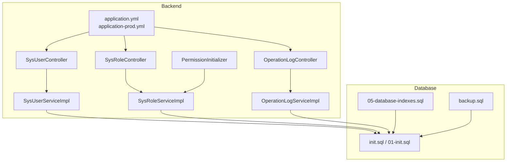
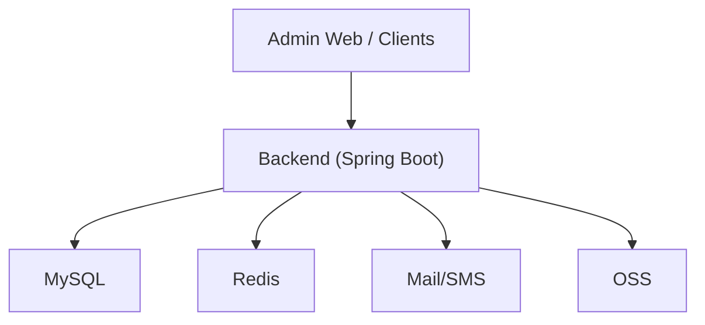
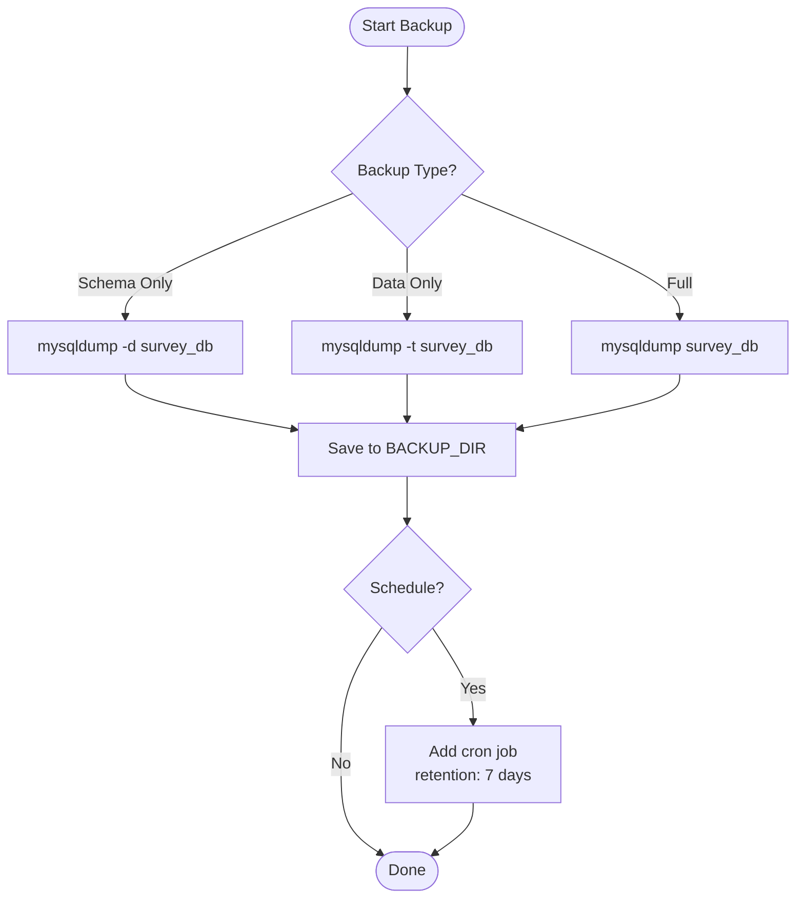
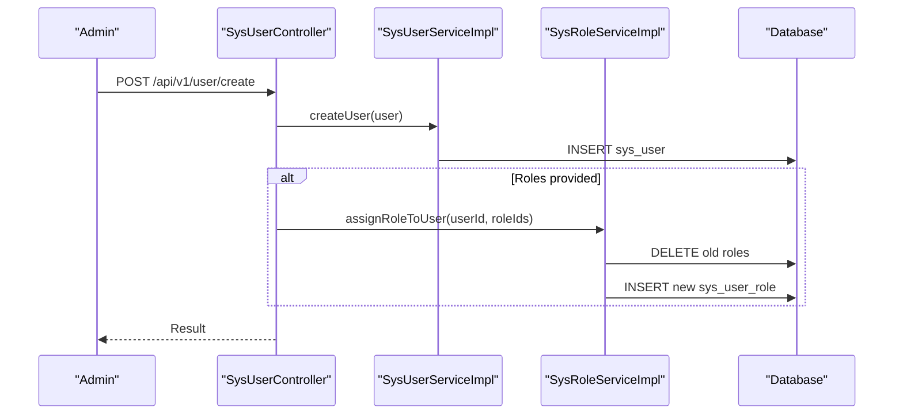
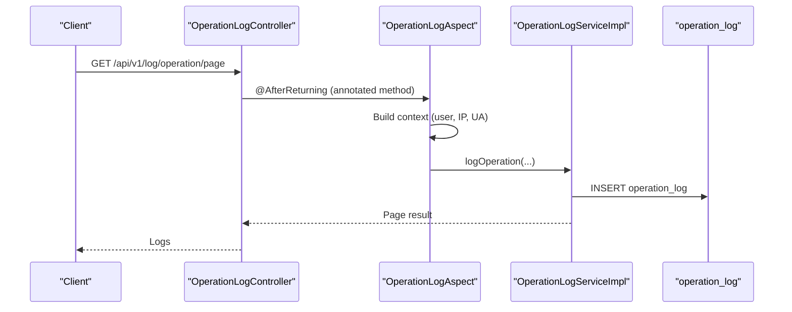
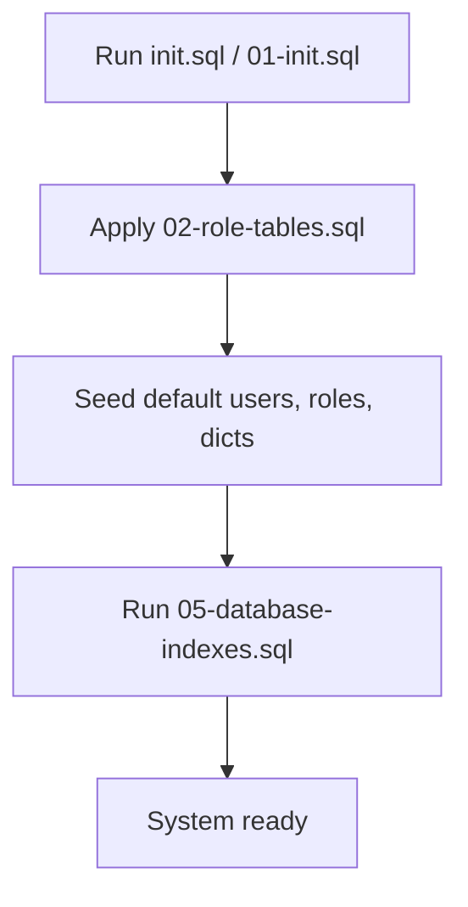
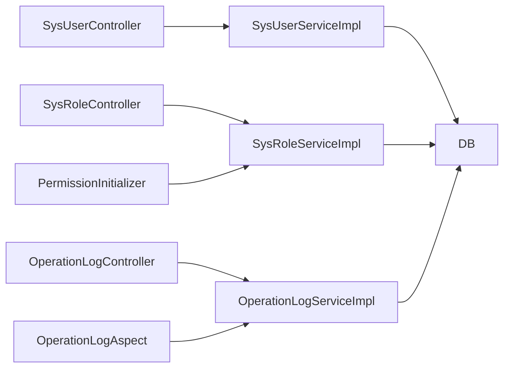

# Maintenance & Operations

<cite>
**Referenced Files in This Document**
- [application.yml](file://admin-backend/src/main/resources/application.yml)
- [application-prod.yml](file://admin-backend/src/main/resources/application-prod.yml)
- [init.sql](file://init-sql/init.sql)
- [backup.sql](file://init-sql/backup.sql)
- [01-init.sql](file://admin-backend/init-data/01-init.sql)
- [02-role-tables.sql](file://admin-backend/init-data/02-role-tables.sql)
- [05-database-indexes.sql](file://admin-backend/init-data/05-database-indexes.sql)
- [Permissions.java](file://admin-backend/src/main/java/com/qhiot/survey/common/constant/Permissions.java)
- [SysUserController.java](file://admin-backend/src/main/java/com/qhiot/survey/controller/SysUserController.java)
- [SysRoleController.java](file://admin-backend/src/main/java/com/qhiot/survey/controller/SysRoleController.java)
- [SysUserServiceImpl.java](file://admin-backend/src/main/java/com/qhiot/survey/service/impl/SysUserServiceImpl.java)
- [SysRoleServiceImpl.java](file://admin-backend/src/main/java/com/qhiot/survey/service/impl/SysRoleServiceImpl.java)
- [OperationLogAspect.java](file://admin-backend/src/main/java/com/qhiot/survey/common/aspect/OperationLogAspect.java)
- [OperationLogController.java](file://admin-backend/src/main/java/com/qhiot/survey/controller/OperationLogController.java)
- [OperationLogServiceImpl.java](file://admin-backend/src/main/java/com/qhiot/survey/service/impl/OperationLogServiceImpl.java)
- [PermissionInitializer.java](file://admin-backend/src/main/java/com/qhiot/survey/common/init/PermissionInitializer.java)
</cite>

## Table of Contents
1. [Introduction](#introduction)
2. [Project Structure](#project-structure)
3. [Core Components](#core-components)
4. [Architecture Overview](#architecture-overview)
5. [Detailed Component Analysis](#detailed-component-analysis)
6. [Dependency Analysis](#dependency-analysis)
7. [Performance Considerations](#performance-considerations)
8. [Troubleshooting Guide](#troubleshooting-guide)
9. [Conclusion](#conclusion)
10. [Appendices](#appendices)

## Introduction
This document provides comprehensive maintenance and operations guidance for Survey-App. It covers database maintenance (backup, restore, schema updates), system administration (user and role management, permissions), routine maintenance (logs, caches, optimization), emergency procedures (failures, data corruption, security incidents), capacity planning, performance tuning, upgrade procedures, and operational checklists and change management processes.

## Project Structure
Survey-App consists of:
- Backend service (Spring Boot) with configuration, controllers, services, mappers, and initialization scripts.
- Initialization and maintenance SQL scripts for database bootstrap, backups, and performance indexes.
- Operational logging and permission management integrated via controllers and services.

**Diagram sources**
- [application.yml:15-149](file://admin-backend/src/main/resources/application.yml#L15-L149)
- [application-prod.yml:12-140](file://admin-backend/src/main/resources/application-prod.yml#L12-L140)
- [init.sql:1-513](file://init-sql/init.sql#L1-L513)
- [05-database-indexes.sql:1-144](file://admin-backend/init-data/05-database-indexes.sql#L1-L144)
- [backup.sql:1-39](file://init-sql/backup.sql#L1-L39)

**Section sources**
- [application.yml:1-149](file://admin-backend/src/main/resources/application.yml#L1-L149)
- [application-prod.yml:1-140](file://admin-backend/src/main/resources/application-prod.yml#L1-L140)
- [init.sql:1-513](file://init-sql/init.sql#L1-L513)
- [05-database-indexes.sql:1-144](file://admin-backend/init-data/05-database-indexes.sql#L1-L144)
- [backup.sql:1-39](file://init-sql/backup.sql#L1-L39)

## Core Components
- Configuration: Datasource, Redis, logging, JWT, mail/SMS, and production hardening.
- Controllers: User, Role, and Operation Log management APIs.
- Services: User, Role, Operation Log, and Permission initialization.
- Initialization Scripts: Database bootstrap, role tables, indexes, and backup/restore procedures.

Key responsibilities:
- User lifecycle: creation, updates, status toggling, password reset, import/export.
- Role and permission model: role CRUD, assignment, and permission synchronization.
- Operational visibility: automatic operation logging with risk levels and statistics.

**Section sources**
- [application.yml:24-149](file://admin-backend/src/main/resources/application.yml#L24-L149)
- [application-prod.yml:21-140](file://admin-backend/src/main/resources/application-prod.yml#L21-L140)
- [SysUserController.java:1-263](file://admin-backend/src/main/java/com/qhiot/survey/controller/SysUserController.java#L1-L263)
- [SysRoleController.java:1-138](file://admin-backend/src/main/java/com/qhiot/survey/controller/SysRoleController.java#L1-L138)
- [OperationLogController.java:1-88](file://admin-backend/src/main/java/com/qhiot/survey/controller/OperationLogController.java#L1-L88)
- [Permissions.java:1-81](file://admin-backend/src/main/java/com/qhiot/survey/common/constant/Permissions.java#L1-L81)
- [PermissionInitializer.java:1-38](file://admin-backend/src/main/java/com/qhiot/survey/common/init/PermissionInitializer.java#L1-L38)

## Architecture Overview
Operational architecture integrates configuration-driven backend services with database and external systems (mail/SMS/OSS). Operation logs are captured asynchronously and persisted for auditing.

**Diagram sources**
- [application.yml:24-114](file://admin-backend/src/main/resources/application.yml#L24-L114)
- [application-prod.yml:21-99](file://admin-backend/src/main/resources/application-prod.yml#L21-L99)

## Detailed Component Analysis

### Database Maintenance Procedures
- Backup strategies
  - Schema-only backup: dump table definitions.
  - Data-only backup: dump table data excluding schema.
  - Full backup: dump entire database.
  - Scheduled backup: shell script with retention policy.
- Restore processes
  - Restore database from full backup.
  - Restore single table from backup.
- Schema updates
  - Use idempotent index creation procedure to add missing indexes.
  - Apply incremental migrations after verifying environment.

**Diagram sources**
- [backup.sql:10-39](file://init-sql/backup.sql#L10-L39)

**Section sources**
- [backup.sql:1-39](file://init-sql/backup.sql#L1-L39)
- [05-database-indexes.sql:1-144](file://admin-backend/init-data/05-database-indexes.sql#L1-L144)

### System Administration Tasks
- User management
  - Create, update, delete, enable/disable users.
  - Reset user passwords with rate limiting and notifications.
  - Import/export users via Excel.
- Role assignments
  - Create/update/delete roles.
  - Assign multiple roles to users atomically.
  - Toggle role status.
- Permission updates
  - Synchronize permission codes to database at startup.
  - Update role permissions and maintain association table.

**Diagram sources**
- [SysUserController.java:124-159](file://admin-backend/src/main/java/com/qhiot/survey/controller/SysUserController.java#L124-L159)
- [SysUserServiceImpl.java:82-98](file://admin-backend/src/main/java/com/qhiot/survey/service/impl/SysUserServiceImpl.java#L82-L98)
- [SysRoleServiceImpl.java:113-165](file://admin-backend/src/main/java/com/qhiot/survey/service/impl/SysRoleServiceImpl.java#L113-L165)

**Section sources**
- [SysUserController.java:47-261](file://admin-backend/src/main/java/com/qhiot/survey/controller/SysUserController.java#L47-L261)
- [SysUserServiceImpl.java:82-236](file://admin-backend/src/main/java/com/qhiot/survey/service/impl/SysUserServiceImpl.java#L82-L236)
- [SysRoleController.java:30-137](file://admin-backend/src/main/java/com/qhiot/survey/controller/SysRoleController.java#L30-L137)
- [SysRoleServiceImpl.java:59-225](file://admin-backend/src/main/java/com/qhiot/survey/service/impl/SysRoleServiceImpl.java#L59-L225)
- [Permissions.java:1-81](file://admin-backend/src/main/java/com/qhiot/survey/common/constant/Permissions.java#L1-L81)
- [PermissionInitializer.java:22-36](file://admin-backend/src/main/java/com/qhiot/survey/common/init/PermissionInitializer.java#L22-L36)

### Operational Logging and Auditing
- Automatic operation logging via AOP around annotated methods.
- Risk levels per operation; asynchronous persistence.
- Query, export, and statistics endpoints for operation logs.

**Diagram sources**
- [OperationLogController.java:30-86](file://admin-backend/src/main/java/com/qhiot/survey/controller/OperationLogController.java#L30-L86)
- [OperationLogAspect.java:56-182](file://admin-backend/src/main/java/com/qhiot/survey/common/aspect/OperationLogAspect.java#L56-L182)
- [OperationLogServiceImpl.java:44-72](file://admin-backend/src/main/java/com/qhiot/survey/service/impl/OperationLogServiceImpl.java#L44-L72)

**Section sources**
- [OperationLogController.java:30-86](file://admin-backend/src/main/java/com/qhiot/survey/controller/OperationLogController.java#L30-L86)
- [OperationLogAspect.java:74-182](file://admin-backend/src/main/java/com/qhiot/survey/common/aspect/OperationLogAspect.java#L74-L182)
- [OperationLogServiceImpl.java:27-191](file://admin-backend/src/main/java/com/qhiot/survey/service/impl/OperationLogServiceImpl.java#L27-L191)

### Initialization and Bootstrap
- Database bootstrap initializes core tables and default data.
- Role tables and permissions are initialized during setup.
- Idempotent index creation ensures performance indexes are applied consistently.

**Diagram sources**
- [init.sql:1-513](file://init-sql/init.sql#L1-L513)
- [01-init.sql:1-516](file://admin-backend/init-data/01-init.sql#L1-L516)
- [02-role-tables.sql:1-32](file://admin-backend/init-data/02-role-tables.sql#L1-L32)
- [05-database-indexes.sql:1-144](file://admin-backend/init-data/05-database-indexes.sql#L1-L144)

**Section sources**
- [init.sql:1-513](file://init-sql/init.sql#L1-L513)
- [01-init.sql:1-516](file://admin-backend/init-data/01-init.sql#L1-L516)
- [02-role-tables.sql:1-32](file://admin-backend/init-data/02-role-tables.sql#L1-L32)
- [05-database-indexes.sql:1-144](file://admin-backend/init-data/05-database-indexes.sql#L1-L144)

## Dependency Analysis
- Controllers depend on services for business logic.
- Services depend on mappers and external systems (Redis, mail/SMS).
- Operation logging is decoupled via AOP and asynchronous executor.
- Permission initialization synchronizes runtime permission registry to database.

**Diagram sources**
- [SysUserController.java:43-45](file://admin-backend/src/main/java/com/qhiot/survey/controller/SysUserController.java#L43-L45)
- [SysRoleController.java:27-28](file://admin-backend/src/main/java/com/qhiot/survey/controller/SysRoleController.java#L27-L28)
- [OperationLogController.java:27-28](file://admin-backend/src/main/java/com/qhiot/survey/controller/OperationLogController.java#L27-L28)
- [OperationLogAspect.java:41-42](file://admin-backend/src/main/java/com/qhiot/survey/common/aspect/OperationLogAspect.java#L41-L42)
- [PermissionInitializer.java:20-21](file://admin-backend/src/main/java/com/qhiot/survey/common/init/PermissionInitializer.java#L20-L21)

**Section sources**
- [SysUserController.java:1-263](file://admin-backend/src/main/java/com/qhiot/survey/controller/SysUserController.java#L1-L263)
- [SysRoleController.java:1-138](file://admin-backend/src/main/java/com/qhiot/survey/controller/SysRoleController.java#L1-L138)
- [OperationLogController.java:1-88](file://admin-backend/src/main/java/com/qhiot/survey/controller/OperationLogController.java#L1-L88)
- [OperationLogAspect.java:1-266](file://admin-backend/src/main/java/com/qhiot/survey/common/aspect/OperationLogAspect.java#L1-L266)
- [PermissionInitializer.java:1-38](file://admin-backend/src/main/java/com/qhiot/survey/common/init/PermissionInitializer.java#L1-L38)

## Performance Considerations
- Database
  - Use idempotent index creation to add missing indexes for list endpoints and filters.
  - Monitor slow SQL via Druid configuration and adjust queries accordingly.
- Application
  - Production disables MyBatis logging and enables caching; tune cache sizes and TTLs as needed.
  - Adjust datasource pool sizes and Redis pool limits based on load.
- Observability
  - Enable Actuator metrics and health endpoints in production for monitoring.

**Section sources**
- [05-database-indexes.sql:21-132](file://admin-backend/init-data/05-database-indexes.sql#L21-L132)
- [application.yml:30-47](file://admin-backend/src/main/resources/application.yml#L30-L47)
- [application-prod.yml:70-83](file://admin-backend/src/main/resources/application-prod.yml#L70-L83)
- [application-prod.yml:131-140](file://admin-backend/src/main/resources/application-prod.yml#L131-L140)

## Troubleshooting Guide
- Database connectivity
  - Verify datasource URL, credentials, and SSL settings.
  - Confirm Druid pool settings and slow SQL logging.
- Redis connectivity
  - Validate host/port/password and pool configuration.
- Password reset anomalies
  - Check rate limiter thresholds and notification delivery channels.
- Operation logs not appearing
  - Ensure AOP is enabled and asynchronous executor configured.
  - Verify permissions for accessing operation log endpoints.
- User locked out
  - Examine login failure counters and lock duration logic.

**Section sources**
- [application.yml:24-78](file://admin-backend/src/main/resources/application.yml#L24-L78)
- [application-prod.yml:21-62](file://admin-backend/src/main/resources/application-prod.yml#L21-L62)
- [SysUserServiceImpl.java:253-334](file://admin-backend/src/main/java/com/qhiot/survey/service/impl/SysUserServiceImpl.java#L253-L334)
- [OperationLogAspect.java:56-182](file://admin-backend/src/main/java/com/qhiot/survey/common/aspect/OperationLogAspect.java#L56-L182)
- [OperationLogController.java:30-86](file://admin-backend/src/main/java/com/qhiot/survey/controller/OperationLogController.java#L30-L86)

## Conclusion
Survey-App’s maintenance and operations rely on robust configuration, idempotent database initialization, explicit user/role/permission management, and comprehensive operational logging. Following the procedures outlined here ensures reliable backups, secure administration, efficient operations, and resilient incident response.

## Appendices

### Database Backup and Restore Procedures
- Backup
  - Schema-only: dump definitions.
  - Data-only: dump data.
  - Full: dump entire database.
  - Schedule: add cron job with retention.
- Restore
  - Restore full backup.
  - Restore single table from backup.

**Section sources**
- [backup.sql:10-39](file://init-sql/backup.sql#L10-L39)

### User and Role Management Procedures
- Create user
  - Provide username, real name, contact info, optional initial password.
  - Assign roles via role IDs.
- Update user
  - Modify profile and optionally reset password.
  - Reassign roles as needed.
- Delete user
  - Remove user account.
- Manage roles
  - Create/update/delete roles.
  - Toggle role status.
  - Assign roles to users.
- Permissions
  - Initialize permissions at startup.
  - Update role permissions and synchronize associations.

**Section sources**
- [SysUserController.java:124-236](file://admin-backend/src/main/java/com/qhiot/survey/controller/SysUserController.java#L124-L236)
- [SysRoleController.java:51-130](file://admin-backend/src/main/java/com/qhiot/survey/controller/SysRoleController.java#L51-L130)
- [SysUserServiceImpl.java:82-236](file://admin-backend/src/main/java/com/qhiot/survey/service/impl/SysUserServiceImpl.java#L82-L236)
- [SysRoleServiceImpl.java:59-225](file://admin-backend/src/main/java/com/qhiot/survey/service/impl/SysRoleServiceImpl.java#L59-L225)
- [Permissions.java:1-81](file://admin-backend/src/main/java/com/qhiot/survey/common/constant/Permissions.java#L1-L81)
- [PermissionInitializer.java:22-36](file://admin-backend/src/main/java/com/qhiot/survey/common/init/PermissionInitializer.java#L22-L36)

### Operational Logging and Auditing
- Query operation logs by module/operator/keyword.
- Export logs to Excel.
- View statistics: by module, user, risk level, and daily trend.

**Section sources**
- [OperationLogController.java:30-86](file://admin-backend/src/main/java/com/qhiot/survey/controller/OperationLogController.java#L30-L86)
- [OperationLogServiceImpl.java:27-191](file://admin-backend/src/main/java/com/qhiot/survey/service/impl/OperationLogServiceImpl.java#L27-L191)
- [OperationLogAspect.java:56-182](file://admin-backend/src/main/java/com/qhiot/survey/common/aspect/OperationLogAspect.java#L56-L182)

### Routine Maintenance Activities
- Log cleanup
  - Configure log file size and retention in production.
- Cache management
  - Clear user cache entries upon user changes.
- System optimization
  - Apply performance indexes idempotently.
  - Tune datasource and Redis pools.

**Section sources**
- [application-prod.yml:111-121](file://admin-backend/src/main/resources/application-prod.yml#L111-L121)
- [SysUserServiceImpl.java:77-84](file://admin-backend/src/main/java/com/qhiot/survey/service/impl/SysUserServiceImpl.java#L77-L84)
- [05-database-indexes.sql:21-132](file://admin-backend/init-data/05-database-indexes.sql#L21-L132)
- [application.yml:30-47](file://admin-backend/src/main/resources/application.yml#L30-L47)

### Emergency Procedures
- System failures
  - Check Actuator health/metrics endpoints.
  - Review application logs and slow SQL.
- Data corruption
  - Restore from most recent backup.
  - Recreate missing indexes post-restore.
- Security incidents
  - Lock affected accounts.
  - Reset passwords and notify users.
  - Audit operation logs for suspicious activity.

**Section sources**
- [application-prod.yml:131-140](file://admin-backend/src/main/resources/application-prod.yml#L131-L140)
- [backup.sql:28-39](file://init-sql/backup.sql#L28-L39)
- [05-database-indexes.sql:21-132](file://admin-backend/init-data/05-database-indexes.sql#L21-L132)
- [SysUserServiceImpl.java:253-334](file://admin-backend/src/main/java/com/qhiot/survey/service/impl/SysUserServiceImpl.java#L253-L334)
- [OperationLogController.java:30-86](file://admin-backend/src/main/java/com/qhiot/survey/controller/OperationLogController.java#L30-L86)

### Capacity Planning Guidelines
- Estimate peak concurrent users and requests.
- Size MySQL pool and Redis pool accordingly.
- Monitor slow SQL and add indexes for hot queries.
- Plan disk space for logs and backups.

**Section sources**
- [application.yml:30-47](file://admin-backend/src/main/resources/application.yml#L30-L47)
- [application.yml:65-78](file://admin-backend/src/main/resources/application.yml#L65-L78)
- [05-database-indexes.sql:21-132](file://admin-backend/init-data/05-database-indexes.sql#L21-L132)

### Performance Tuning Recommendations
- Production defaults disable SQL logging and enable caching.
- Use Druid slow SQL logging to identify bottlenecks.
- Scale datasource and Redis pools based on metrics.

**Section sources**
- [application-prod.yml:70-83](file://admin-backend/src/main/resources/application-prod.yml#L70-L83)
- [application.yml:39-47](file://admin-backend/src/main/resources/application.yml#L39-L47)

### Upgrade Procedures
- Prepare environment variables and secrets.
- Run database migrations (idempotent indexes).
- Restart backend service.
- Validate health and metrics.

**Section sources**
- [05-database-indexes.sql:21-132](file://admin-backend/init-data/05-database-indexes.sql#L21-L132)
- [application-prod.yml:131-140](file://admin-backend/src/main/resources/application-prod.yml#L131-L140)

### Operational Checklists and Change Management
- Pre-deployment
  - Verify environment variables and secrets.
  - Confirm database connectivity and schema.
  - Validate backup and restore procedures.
- Post-deployment
  - Check health and metrics endpoints.
  - Confirm operation logs and user/role permissions.
  - Monitor slow SQL and logs.
- Change management
  - Use idempotent migrations.
  - Notify stakeholders before permission changes.
  - Rollback plan: restore from backup.

**Section sources**
- [backup.sql:28-39](file://init-sql/backup.sql#L28-L39)
- [PermissionInitializer.java:22-36](file://admin-backend/src/main/java/com/qhiot/survey/common/init/PermissionInitializer.java#L22-L36)
- [OperationLogController.java:30-86](file://admin-backend/src/main/java/com/qhiot/survey/controller/OperationLogController.java#L30-L86)