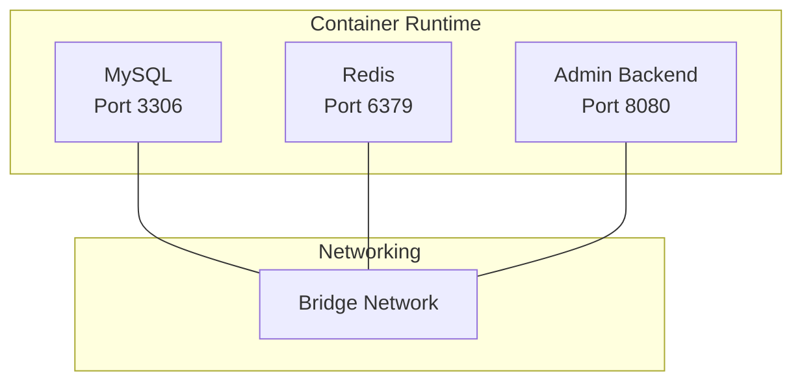
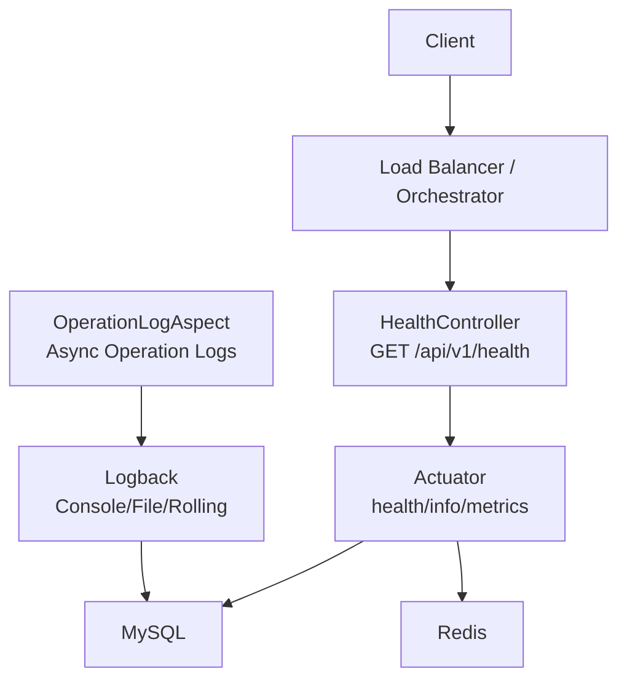
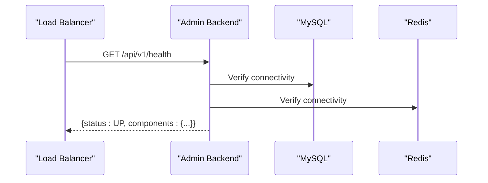
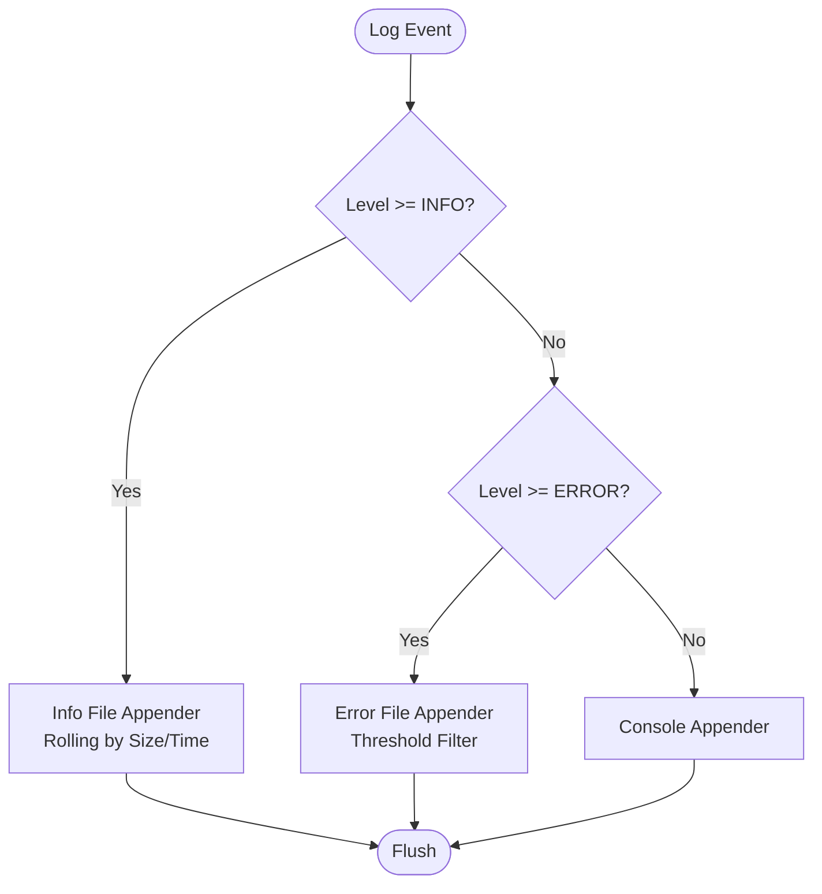
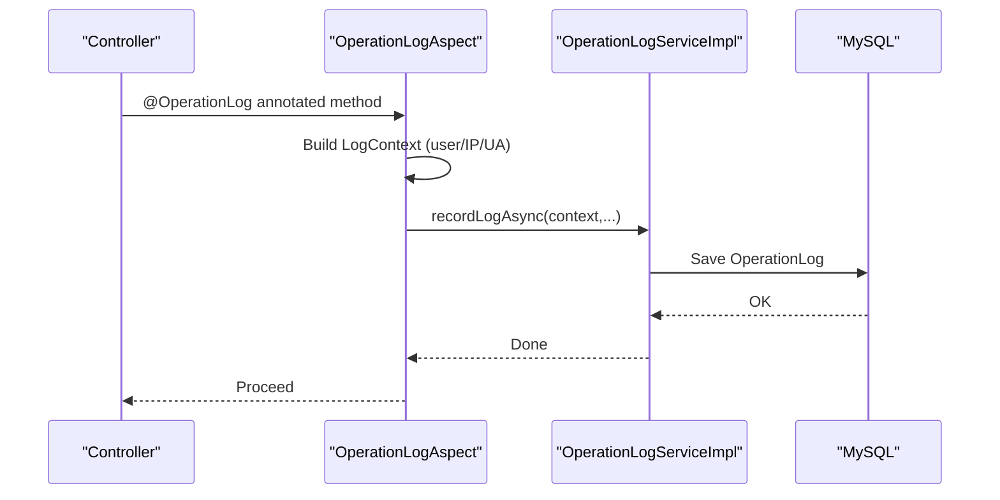
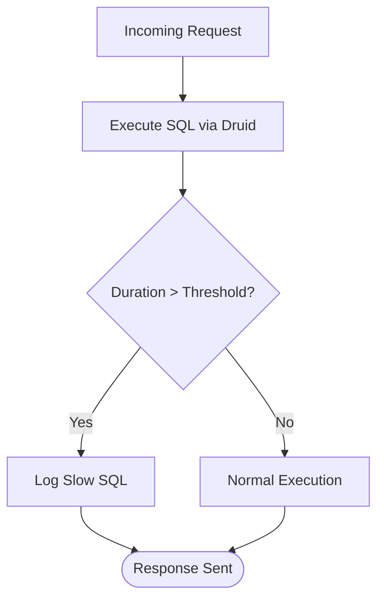
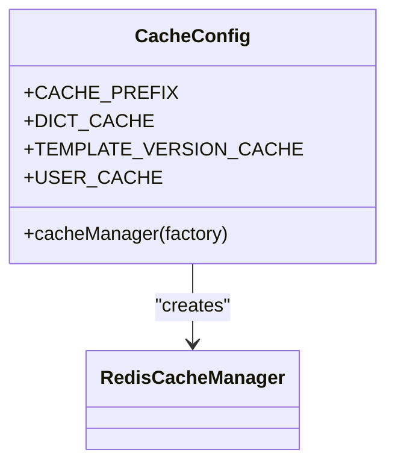
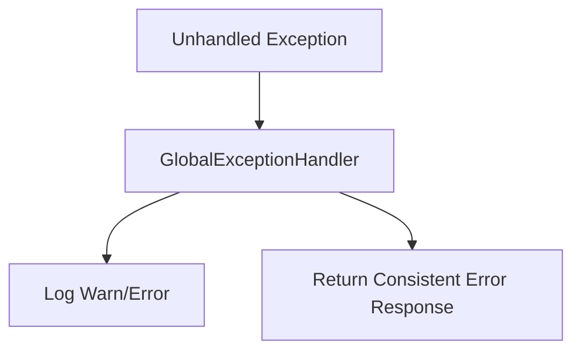
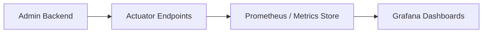
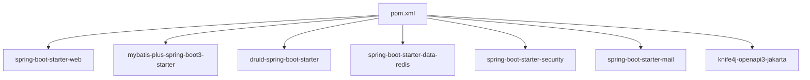

# Monitoring & Logging

<cite>
**Referenced Files in This Document**
- [logback-spring.xml](file://admin-backend/src/main/resources/logback-spring.xml)
- [application.yml](file://admin-backend/src/main/resources/application.yml)
- [application-prod.yml](file://admin-backend/src/main/resources/application-prod.yml)
- [HealthController.java](file://admin-backend/src/main/java/com/qhiot/survey/controller/HealthController.java)
- [OperationLogAspect.java](file://admin-backend/src/main/java/com/qhiot/survey/common/aspect/OperationLogAspect.java)
- [OperationLogServiceImpl.java](file://admin-backend/src/main/java/com/qhiot/survey/service/impl/OperationLogServiceImpl.java)
- [CacheConfig.java](file://admin-backend/src/main/java/com/qhiot/survey/config/CacheConfig.java)
- [DataSourceConfig.java](file://admin-backend/src/main/java/com/qhiot/survey/config/DataSourceConfig.java)
- [GlobalExceptionHandler.java](file://admin-backend/src/main/java/com/qhiot/survey/common/GlobalExceptionHandler.java)
- [Dockerfile](file://admin-backend/Dockerfile)
- [docker-compose.yml](file://docker-compose.yml)
- [pom.xml](file://admin-backend/pom.xml)
</cite>

## Table of Contents
1. [Introduction](#introduction)
2. [Project Structure](#project-structure)
3. [Core Components](#core-components)
4. [Architecture Overview](#architecture-overview)
5. [Detailed Component Analysis](#detailed-component-analysis)
6. [Dependency Analysis](#dependency-analysis)
7. [Performance Considerations](#performance-considerations)
8. [Troubleshooting Guide](#troubleshooting-guide)
9. [Conclusion](#conclusion)
10. [Appendices](#appendices)

## Introduction
This document provides comprehensive monitoring and logging guidance for the Survey-App backend service. It covers health check endpoints, centralized logging configuration with Logback, log rotation and aggregation strategies, performance monitoring for database queries and Redis, alerting and error tracking, incident response procedures, distributed tracing and metrics collection, and practical log analysis and troubleshooting workflows.

## Project Structure
The backend service is a Spring Boot application packaged as a Docker container. It exposes health endpoints, writes structured logs via Logback, integrates Redis for caching, and uses a MySQL database. Docker Compose orchestrates the stack with health checks for all services.

**Diagram sources**
- [docker-compose.yml:1-213](file://docker-compose.yml#L1-L213)

**Section sources**
- [docker-compose.yml:1-213](file://docker-compose.yml#L1-L213)
- [Dockerfile:1-69](file://admin-backend/Dockerfile#L1-L69)

## Core Components
- Health endpoints: Exposed by the backend service for liveness/readiness and detailed component status.
- Logging: Configured via Logback with rolling policies, separate appenders for info/error/operation logs, and asynchronous operation logging.
- Caching: Redis-backed cache manager with TTL policies for dictionaries, templates, and user profiles.
- Database: MySQL configured via Druid with slow SQL detection and leak tracking.
- Error handling: Centralized exception handling to avoid leaking internal errors to clients.
- Containerization: Multi-stage Docker build with health checks and JVM tuning.

**Section sources**
- [HealthController.java:1-61](file://admin-backend/src/main/java/com/qhiot/survey/controller/HealthController.java#L1-L61)
- [logback-spring.xml:1-125](file://admin-backend/src/main/resources/logback-spring.xml#L1-L125)
- [CacheConfig.java:1-94](file://admin-backend/src/main/java/com/qhiot/survey/config/CacheConfig.java#L1-L94)
- [DataSourceConfig.java:1-19](file://admin-backend/src/main/java/com/qhiot/survey/config/DataSourceConfig.java#L1-L19)
- [GlobalExceptionHandler.java:1-103](file://admin-backend/src/main/java/com/qhiot/survey/common/GlobalExceptionHandler.java#L1-L103)
- [Dockerfile:1-69](file://admin-backend/Dockerfile#L1-L69)

## Architecture Overview
The monitoring and logging architecture centers on:
- Health checks for service readiness and liveness.
- Structured logs written to files with rotation and asynchronous operation logs.
- Metrics exposure via Spring Boot Actuator endpoints.
- Redis and MySQL health checks orchestrated by Docker Compose.
- Centralized log aggregation and alerting outside this repository scope.

**Diagram sources**
- [HealthController.java:1-61](file://admin-backend/src/main/java/com/qhiot/survey/controller/HealthController.java#L1-L61)
- [application-prod.yml:131-140](file://admin-backend/src/main/resources/application-prod.yml#L131-L140)
- [logback-spring.xml:1-125](file://admin-backend/src/main/resources/logback-spring.xml#L1-L125)
- [OperationLogAspect.java:1-266](file://admin-backend/src/main/java/com/qhiot/survey/common/aspect/OperationLogAspect.java#L1-L266)

## Detailed Component Analysis

### Health Checks
- Endpoint: GET /api/v1/health returns basic status and version.
- Endpoint: GET /api/v1/health/details returns overall status and component statuses (database, redis, diskSpace).
- Endpoint: GET /api/v1/health/ready indicates service readiness.
- Docker Compose health checks probe the backend health endpoint and also perform native container health checks for MySQL and Redis.

**Diagram sources**
- [HealthController.java:1-61](file://admin-backend/src/main/java/com/qhiot/survey/controller/HealthController.java#L1-L61)
- [docker-compose.yml:133-138](file://docker-compose.yml#L133-L138)

**Section sources**
- [HealthController.java:1-61](file://admin-backend/src/main/java/com/qhiot/survey/controller/HealthController.java#L1-L61)
- [docker-compose.yml:36-43](file://docker-compose.yml#L36-L43)
- [docker-compose.yml:69-75](file://docker-compose.yml#L69-L75)
- [docker-compose.yml:133-138](file://docker-compose.yml#L133-L138)

### Centralized Logging with Logback
- Console appender with timestamped pattern.
- Rolling file appenders:
  - Info logs with size-and-time-based rotation.
  - Error logs with threshold filter and extended retention.
  - Dedicated operation log file with smaller max file size and history.
- Asynchronous operation logging to reduce contention on hot paths.
- Third-party library log level tuning (Spring, MyBatis, SQL tracing).
- Root logger configured for production with file output and controlled verbosity.

**Diagram sources**
- [logback-spring.xml:17-83](file://admin-backend/src/main/resources/logback-spring.xml#L17-L83)

**Section sources**
- [logback-spring.xml:1-125](file://admin-backend/src/main/resources/logback-spring.xml#L1-L125)
- [application-prod.yml:111-122](file://admin-backend/src/main/resources/application-prod.yml#L111-L122)

### Operation Log Tracking
- AOP aspect captures successful operations annotated with @OperationLog and asynchronously persists them.
- Extracts user identity, IP, and User-Agent from the request context.
- Uses SpEL expressions to enrich descriptions from method parameters and results.
- Dedicated async appender ensures low-latency write path for operation logs.

**Diagram sources**
- [OperationLogAspect.java:47-125](file://admin-backend/src/main/java/com/qhiot/survey/common/aspect/OperationLogAspect.java#L47-L125)
- [OperationLogServiceImpl.java:44-72](file://admin-backend/src/main/java/com/qhiot/survey/service/impl/OperationLogServiceImpl.java#L44-L72)

**Section sources**
- [OperationLogAspect.java:1-266](file://admin-backend/src/main/java/com/qhiot/survey/common/aspect/OperationLogAspect.java#L1-L266)
- [OperationLogServiceImpl.java:1-193](file://admin-backend/src/main/java/com/qhiot/survey/service/impl/OperationLogServiceImpl.java#L1-L193)
- [logback-spring.xml:77-83](file://admin-backend/src/main/resources/logback-spring.xml#L77-L83)

### Database Query Tracking
- Druid datasource configured with slow SQL threshold and logging.
- Production disables MyBatis SQL logging to reduce overhead; development enables verbose SQL logging.
- Slow SQL detection aids in identifying performance bottlenecks.

**Diagram sources**
- [application.yml:30-47](file://admin-backend/src/main/resources/application.yml#L30-L47)
- [application-prod.yml:70-78](file://admin-backend/src/main/resources/application-prod.yml#L70-L78)

**Section sources**
- [DataSourceConfig.java:1-19](file://admin-backend/src/main/java/com/qhiot/survey/config/DataSourceConfig.java#L1-L19)
- [application.yml:30-47](file://admin-backend/src/main/resources/application.yml#L30-L47)
- [application-prod.yml:70-78](file://admin-backend/src/main/resources/application-prod.yml#L70-L78)

### Redis Metrics and Caching
- Redis cache manager with TTL policies per cache namespace.
- Transaction-aware cache manager to prevent dirty reads.
- Serialization optimized for JSON payloads with type safety.

**Diagram sources**
- [CacheConfig.java:35-94](file://admin-backend/src/main/java/com/qhiot/survey/config/CacheConfig.java#L35-L94)

**Section sources**
- [CacheConfig.java:1-94](file://admin-backend/src/main/java/com/qhiot/survey/config/CacheConfig.java#L1-L94)

### Error Tracking and Alerting
- Centralized exception handler returns consistent error responses and logs warnings/errors.
- Production hides internal stack traces; development logs include more detail.
- Recommended alerting rules:
  - HTTP 5xx rate threshold.
  - Health endpoint DOWN for sustained periods.
  - Database connection failures or slow SQL spikes.
  - Redis availability drops or eviction events.

**Diagram sources**
- [GlobalExceptionHandler.java:23-103](file://admin-backend/src/main/java/com/qhiot/survey/common/GlobalExceptionHandler.java#L23-L103)

**Section sources**
- [GlobalExceptionHandler.java:1-103](file://admin-backend/src/main/java/com/qhiot/survey/common/GlobalExceptionHandler.java#L1-L103)
- [application-prod.yml:7-11](file://admin-backend/src/main/resources/application-prod.yml#L7-L11)

### Metrics Exposure and Dashboards
- Actuator endpoints exposed for health, info, and metrics.
- Configure dashboards to monitor:
  - JVM heap and GC metrics.
  - HTTP request rates and latency.
  - Database pool utilization and slow SQL counts.
  - Redis hit ratio and memory usage.

**Diagram sources**
- [application-prod.yml:131-140](file://admin-backend/src/main/resources/application-prod.yml#L131-L140)

**Section sources**
- [application-prod.yml:131-140](file://admin-backend/src/main/resources/application-prod.yml#L131-L140)

### Distributed Tracing
- Add OpenTelemetry or Micrometer Tracing to propagate trace IDs across requests.
- Instrument controllers, services, and external calls (Redis/MySQL/OSS).
- Correlate logs with trace IDs for end-to-end visibility.

[No sources needed since this section provides general guidance]

### Log Aggregation Approaches
- Mount persistent volumes for logs and ship via log collectors (e.g., Fluent Bit/Fluentd).
- Forward logs to SIEM or log analytics platforms (e.g., ELK, Splunk).
- Use structured JSON logs for easier parsing and filtering.

[No sources needed since this section provides general guidance]

## Dependency Analysis
The backend depends on Spring Boot starters, Druid for database pooling, Redis for caching, and optional integrations for mail, OSS, and SMS. Health checks and metrics rely on Actuator.

**Diagram sources**
- [pom.xml:31-196](file://admin-backend/pom.xml#L31-L196)

**Section sources**
- [pom.xml:1-242](file://admin-backend/pom.xml#L1-L242)

## Performance Considerations
- Database:
  - Keep slow SQL logging enabled in staging; disable in production to reduce overhead.
  - Monitor Druid pool metrics (active/idle/waiting/max).
  - Use appropriate indexes and limit N+1 queries.
- Redis:
  - Tune maxmemory and eviction policy; monitor keyspace hits/misses.
  - Use transaction-aware cache manager to avoid stale data.
- Application:
  - Asynchronous operation logs reduce synchronous IO on hot paths.
  - Control third-party log levels to minimize noise.
  - JVM tuning in Dockerfile (G1GC, heap dump on OOM).

[No sources needed since this section provides general guidance]

## Troubleshooting Guide
- Service not ready:
  - Verify health endpoints return UP/READY.
  - Check Docker Compose health checks for MySQL and Redis.
- High error rates:
  - Inspect centralized logs for repeated error patterns.
  - Use GlobalExceptionHandler logs to correlate client-facing errors.
- Slow performance:
  - Review slow SQL logs and database pool metrics.
  - Check Redis hit ratio and memory pressure.
- Operation logs missing:
  - Confirm @OperationLog annotations and AOP configuration.
  - Verify asynchronous appender queue size and discarding thresholds.

**Section sources**
- [HealthController.java:1-61](file://admin-backend/src/main/java/com/qhiot/survey/controller/HealthController.java#L1-L61)
- [docker-compose.yml:133-138](file://docker-compose.yml#L133-L138)
- [GlobalExceptionHandler.java:1-103](file://admin-backend/src/main/java/com/qhiot/survey/common/GlobalExceptionHandler.java#L1-L103)
- [logback-spring.xml:77-83](file://admin-backend/src/main/resources/logback-spring.xml#L77-L83)

## Conclusion
The backend provides robust health checks, structured logging with rotation, asynchronous operation logs, and production-ready cache and database configurations. Combine these with Actuator metrics, log aggregation, and alerting to achieve comprehensive observability. Use the troubleshooting workflows to quickly diagnose and resolve incidents.

[No sources needed since this section summarizes without analyzing specific files]

## Appendices

### Health Endpoints Reference
- GET /api/v1/health: Basic service status.
- GET /api/v1/health/details: Includes component status (database, redis, diskSpace).
- GET /api/v1/health/ready: Readiness probe.

**Section sources**
- [HealthController.java:1-61](file://admin-backend/src/main/java/com/qhiot/survey/controller/HealthController.java#L1-L61)

### Logback Configuration Highlights
- Console and rolling file appenders with size/time-based rotation.
- Separate operation log file with dedicated async appender.
- Third-party log level tuning for Spring/MyBatis/SQL.

**Section sources**
- [logback-spring.xml:1-125](file://admin-backend/src/main/resources/logback-spring.xml#L1-L125)

### Actuator Exposure
- health, info, metrics endpoints exposed; details controlled by configuration.

**Section sources**
- [application-prod.yml:131-140](file://admin-backend/src/main/resources/application-prod.yml#L131-L140)