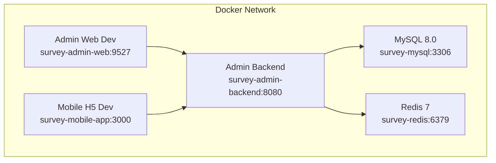
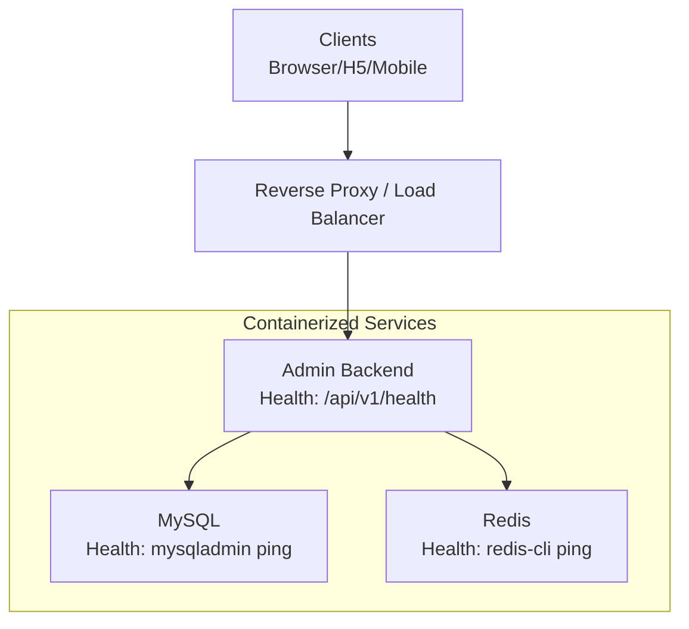
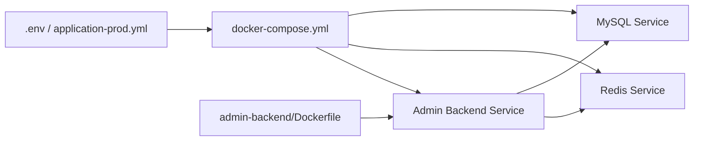

# Production Deployment

<cite>
**Referenced Files in This Document**
- [deploy.sh](file://deploy.sh)
- [redeploy.sh](file://redeploy.sh)
- [deploy-fast.sh](file://deploy-fast.sh)
- [docker-compose.yml](file://docker-compose.yml)
- [.env.example](file://.env.example)
- [admin-backend/Dockerfile](file://admin-backend/Dockerfile)
- [admin-backend/src/main/resources/application-prod.yml](file://admin-backend/src/main/resources/application-prod.yml)
- [admin-backend/DEPLOY.md](file://admin-backend/DEPLOY.md)
- [DOCKER_DEPLOYMENT_GUIDE.md](file://DOCKER_DEPLOYMENT_GUIDE.md)
- [scripts/pre-deploy-check.sh](file://scripts/pre-deploy-check.sh)
- [stop.sh](file://stop.sh)
- [init-sql/init.sql](file://init-sql/init.sql)
- [admin-backend/init-data/01-init.sql](file://admin-backend/init-data/01-init.sql)
- [admin-backend/init-data/02-role-tables.sql](file://admin-backend/init-data/02-role-tables.sql)
- [admin-web-soybean/package.json](file://admin-web-soybean/package.json)
- [mobile-app/package.json](file://mobile-app/package.json)
</cite>

## Table of Contents
1. [Introduction](#introduction)
2. [Project Structure](#project-structure)
3. [Core Components](#core-components)
4. [Architecture Overview](#architecture-overview)
5. [Detailed Component Analysis](#detailed-component-analysis)
6. [Dependency Analysis](#dependency-analysis)
7. [Performance Considerations](#performance-considerations)
8. [Troubleshooting Guide](#troubleshooting-guide)
9. [Conclusion](#conclusion)
10. [Appendices](#appendices)

## Introduction
This document provides production-grade deployment guidance for Survey-App. It covers environment preparation, database initialization, service startup sequences, deployment script functionality and parameters, environment configuration management, secrets handling, configuration file templating, rollback procedures, zero-downtime and blue-green strategies, production optimizations, security hardening, compliance considerations, monitoring setup, and post-deployment validation.

## Project Structure
Survey-App uses Docker Compose to orchestrate a multi-service stack:
- MySQL 8.0 for persistence
- Redis 7 for caching and session storage
- Spring Boot admin backend containerized with a multi-stage Dockerfile
- Optional development frontends (PC admin web and mobile H5) for local iteration

**Diagram sources**
- [docker-compose.yml:1-213](file://docker-compose.yml#L1-L213)

**Section sources**
- [docker-compose.yml:1-213](file://docker-compose.yml#L1-L213)
- [admin-backend/Dockerfile:1-69](file://admin-backend/Dockerfile#L1-L69)

## Core Components
- Orchestration: docker-compose.yml defines services, health checks, resource limits, and environment variables.
- Backend: Multi-stage Dockerfile builds a minimal JRE image, sets non-root user, installs health check helpers, and runs with JVM tuning for production.
- Config: .env.example provides environment variable templates; application-prod.yml loads runtime configuration from environment variables.
- Scripts: deploy.sh, redeploy.sh, deploy-fast.sh automate deployment, redeploys, and fast rebuilds; pre-deploy-check.sh validates readiness; stop.sh halts services.

**Section sources**
- [docker-compose.yml:1-213](file://docker-compose.yml#L1-L213)
- [admin-backend/Dockerfile:1-69](file://admin-backend/Dockerfile#L1-L69)
- [.env.example:1-45](file://.env.example#L1-L45)
- [admin-backend/src/main/resources/application-prod.yml:1-140](file://admin-backend/src/main/resources/application-prod.yml#L1-L140)
- [deploy.sh:1-153](file://deploy.sh#L1-L153)
- [redeploy.sh:1-105](file://redeploy.sh#L1-L105)
- [deploy-fast.sh:1-115](file://deploy-fast.sh#L1-L115)
- [scripts/pre-deploy-check.sh:1-204](file://scripts/pre-deploy-check.sh#L1-L204)
- [stop.sh:1-38](file://stop.sh#L1-L38)

## Architecture Overview
The production deployment relies on Docker Compose with explicit health checks and resource controls. The backend consumes MySQL and Redis, exposes health endpoints, and integrates optional external systems via environment variables.

**Diagram sources**
- [docker-compose.yml:133-138](file://docker-compose.yml#L133-L138)
- [docker-compose.yml:36-42](file://docker-compose.yml#L36-L42)
- [docker-compose.yml:69-75](file://docker-compose.yml#L69-L75)

## Detailed Component Analysis

### Environment Preparation and Configuration Management
- Copy and edit .env from .env.example to set database credentials, Redis password, JWT secret, CORS origins, and port mappings.
- Application-prod.yml reads all sensitive values from environment variables, ensuring no hardcoded secrets in the repository.
- Frontend projects define dev server modes and build commands; production builds are handled outside this repo’s scope.

Key configuration touchpoints:
- Environment variables: DB_* (MySQL), REDIS_*, JWT_*, CORS_ALLOWED_ORIGINS, APP_ENV, OSS_* and SMS_* integrations.
- Backend profile activation: SPRING_PROFILES_ACTIVE=prod and --spring.profiles.active=prod in Dockerfile.
- Port mappings: BACKEND_PORT, ADMIN_WEB_PORT, MOBILE_WEB_PORT.

**Section sources**
- [.env.example:1-45](file://.env.example#L1-L45)
- [admin-backend/src/main/resources/application-prod.yml:12-140](file://admin-backend/src/main/resources/application-prod.yml#L12-L140)
- [admin-backend/Dockerfile:67-69](file://admin-backend/Dockerfile#L67-L69)
- [admin-web-soybean/package.json:34-48](file://admin-web-soybean/package.json#L34-L48)
- [mobile-app/package.json:7-10](file://mobile-app/package.json#L7-L10)

### Database Initialization
- On first container startup, MySQL executes mounted SQL files under /docker-entrypoint-initdb.d. These include:
  - init-sql/init.sql and related schema files
  - admin-backend/init-data/01-init.sql and admin-backend/init-data/02-role-tables.sql
- This ensures baseline schema and seed roles are present.

Operational notes:
- Subsequent startups reuse existing volumes; schema changes require explicit migrations or volume cleanup.
- Use mysqldump for backups and restore via stdin redirection.

**Section sources**
- [docker-compose.yml:20-25](file://docker-compose.yml#L20-L25)
- [init-sql/init.sql:1-200](file://init-sql/init.sql#L1-L200)
- [admin-backend/init-data/01-init.sql:1-200](file://admin-backend/init-data/01-init.sql#L1-L200)
- [admin-backend/init-data/02-role-tables.sql:1-32](file://admin-backend/init-data/02-role-tables.sql#L1-L32)

### Service Startup Sequences
- docker-compose.yml defines depends_on conditions on healthy MySQL and Redis before starting the backend.
- Health checks:
  - MySQL: mysqladmin ping using root password from environment.
  - Redis: redis-cli ping using configured password.
  - Backend: wget-based health check against /api/v1/health.

Post-startup validation:
- Scripts wait and probe health endpoints; curl-based checks confirm backend availability.

**Section sources**
- [docker-compose.yml:124-138](file://docker-compose.yml#L124-L138)
- [deploy.sh:94-123](file://deploy.sh#L94-L123)
- [redeploy.sh:83-92](file://redeploy.sh#L83-L92)

### Deployment Scripts Functionality and Parameters
- deploy.sh
  - Validates Docker and Compose presence
  - Copies .env.example to .env if missing
  - Prompts to clean volumes (data loss risk)
  - Stops old containers, builds and starts services
  - Performs health checks for MySQL, Redis, and backend
  - Prints access URLs and useful commands
- redeploy.sh
  - Checks Docker availability
  - Ensures .env exists
  - Stops services, rebuilds admin-backend image, restarts all services
  - Waits and tests health endpoint
- deploy-fast.sh
  - Offers two build modes:
    - Local Maven compile + Docker packaging (fastest)
    - Full Docker build (slower)
  - Uses optimized Dockerfile.fast when applicable
  - Prints service status and access URLs

Parameters:
- Interactive prompts for volume cleanup and build mode selection
- Environment variables sourced from .env for ports, passwords, and feature toggles

**Section sources**
- [deploy.sh:1-153](file://deploy.sh#L1-L153)
- [redeploy.sh:1-105](file://redeploy.sh#L1-L105)
- [deploy-fast.sh:1-115](file://deploy-fast.sh#L1-L115)

### Configuration File Templating
- .env.example acts as the authoritative template for environment variables.
- docker-compose.yml injects variables into services and the backend container.
- application-prod.yml centralizes production configuration and reads values from environment variables.

Best practices:
- Keep .env out of version control; maintain a secure copy separately.
- Use CI/CD to inject environment variables at build/deploy time.

**Section sources**
- [.env.example:1-45](file://.env.example#L1-L45)
- [docker-compose.yml:91-123](file://docker-compose.yml#L91-L123)
- [admin-backend/src/main/resources/application-prod.yml:12-140](file://admin-backend/src/main/resources/application-prod.yml#L12-L140)

### Secrets Handling
- Current implementation passes secrets via environment variables and .env.
- Production recommendation:
  - Migrate to Docker secrets or external secret managers (e.g., HashiCorp Vault, AWS Secrets Manager).
  - Mount secrets via compose secrets or CI/CD secret injection.
  - Ensure .env is excluded from images and logs.

**Section sources**
- [docker-compose.yml:418-426](file://docker-compose.yml#L418-L426)
- [DOCKER_DEPLOYMENT_GUIDE.md:418-426](file://DOCKER_DEPLOYMENT_GUIDE.md#L418-L426)

### Rollback Procedures
- Stop services: docker compose down or ./stop.sh.
- Restore database from last known good backup.
- Re-run deploy.sh or redeploy.sh to re-provision services.
- Validate rollback via health checks and manual smoke tests.

**Section sources**
- [stop.sh:1-38](file://stop.sh#L1-L38)
- [DOCKER_DEPLOYMENT_GUIDE.md:214-241](file://DOCKER_DEPLOYMENT_GUIDE.md#L214-L241)

### Zero-Downtime and Blue-Green Strategies
- Zero-downtime:
  - Use reverse proxy with rolling restarts and health-based routing.
  - Ensure backend readiness probes and graceful shutdowns.
- Blue-Green:
  - Run two identical environments behind a load balancer.
  - Switch traffic after validating the new green environment.
  - Keep the previous blue environment for quick rollback.

Note: The provided scripts orchestrate single instances. Implement blue-green at the platform level (e.g., Kubernetes, Nginx plus external load balancers).

[No sources needed since this section provides general guidance]

### Production-Specific Optimizations
- JVM tuning:
  - Adjust heap sizes and GC settings in Dockerfile ENTRYPOINT as needed.
- Database:
  - Tune DB_BUFFER_POOL and DB_MAX_CONNECTIONS in .env.
- Cache:
  - Increase REDIS_MAX_MEMORY and tune eviction policy.
- Resources:
  - Set BACKEND_CPU_LIMIT and BACKEND_MEM_LIMIT in .env to constrain and reserve resources.

**Section sources**
- [admin-backend/Dockerfile:56-68](file://admin-backend/Dockerfile#L56-L68)
- [docker-compose.yml:139-147](file://docker-compose.yml#L139-L147)
- [DOCKER_DEPLOYMENT_GUIDE.md:366-393](file://DOCKER_DEPLOYMENT_GUIDE.md#L366-L393)

### Security Hardening Measures
- Change all default passwords in .env (DB_ROOT_PASSWORD, DB_PASSWORD, REDIS_PASSWORD, JWT_SECRET).
- Remove public port exposure by commenting out ports in docker-compose.yml for internal-only deployments.
- Enable HTTPS via reverse proxy and certificate management.
- Restrict CORS origins to trusted domains.
- Use non-root user in Dockerfile and minimal base images.

**Section sources**
- [.env.example:9-29](file://.env.example#L9-L29)
- [docker-compose.yml:409-417](file://docker-compose.yml#L409-L417)
- [admin-backend/src/main/resources/application-prod.yml:123-125](file://admin-backend/src/main/resources/application-prod.yml#L123-L125)
- [admin-backend/Dockerfile:26-27](file://admin-backend/Dockerfile#L26-L27)

### Compliance Requirements
- Data residency and encryption at rest/in transit.
- Audit logging and retention aligned with policies.
- Access control and least privilege for database and cache.
- Regular vulnerability scans and patch management.

[No sources needed since this section provides general guidance]

### Monitoring Setup During Deployment and Post-Deployment Validation
- Health endpoints:
  - Backend: GET /api/v1/health
  - MySQL and Redis: compose exec health checks
- Metrics:
  - Enable Actuator endpoints in application-prod.yml and expose metrics via reverse proxy.
- Logs:
  - Inspect container logs via docker compose logs and review backend log file path.
- Smoke tests:
  - Use scripts/pre-deploy-check.sh to validate key endpoints and configurations.

**Section sources**
- [admin-backend/src/main/resources/application-prod.yml:131-140](file://admin-backend/src/main/resources/application-prod.yml#L131-L140)
- [deploy.sh:113-123](file://deploy.sh#L113-L123)
- [scripts/pre-deploy-check.sh:39-67](file://scripts/pre-deploy-check.sh#L39-L67)
- [DOCKER_DEPLOYMENT_GUIDE.md:166-197](file://DOCKER_DEPLOYMENT_GUIDE.md#L166-L197)

## Dependency Analysis
The backend depends on MySQL and Redis, both of which are provisioned by docker-compose. Health checks enforce startup order and readiness.

**Diagram sources**
- [docker-compose.yml:91-123](file://docker-compose.yml#L91-L123)
- [admin-backend/Dockerfile:1-69](file://admin-backend/Dockerfile#L1-L69)
- [.env.example:1-45](file://.env.example#L1-L45)
- [admin-backend/src/main/resources/application-prod.yml:12-140](file://admin-backend/src/main/resources/application-prod.yml#L12-L140)

**Section sources**
- [docker-compose.yml:124-138](file://docker-compose.yml#L124-L138)
- [admin-backend/Dockerfile:1-69](file://admin-backend/Dockerfile#L1-L69)

## Performance Considerations
- JVM sizing and GC tuning in Dockerfile ENTRYPOINT.
- MySQL buffer pool and connection limits in .env.
- Redis memory and persistence settings in docker-compose.yml.
- Resource reservations and limits in docker-compose.yml for predictable scheduling.

[No sources needed since this section provides general guidance]

## Troubleshooting Guide
Common issues and resolutions:
- Docker commands not found: ensure Docker CLI path is exported or installed per guide.
- Port conflicts: adjust BACKEND_PORT, MYSQL_PORT, REDIS_PORT in .env.
- Services failing to start: inspect health checks and logs; verify DB initialization and network connectivity.
- Memory pressure: increase BACKEND_MEM_LIMIT and BACKEND_CPU_LIMIT; review JVM heap settings.

Validation steps:
- Use docker compose ps to check service states.
- Curl health endpoints to confirm backend readiness.
- Run scripts/pre-deploy-check.sh for automated verification.

**Section sources**
- [DOCKER_DEPLOYMENT_GUIDE.md:285-347](file://DOCKER_DEPLOYMENT_GUIDE.md#L285-L347)
- [deploy.sh:87-123](file://deploy.sh#L87-L123)
- [scripts/pre-deploy-check.sh:112-186](file://scripts/pre-deploy-check.sh#L112-L186)

## Conclusion
Survey-App provides a robust, script-driven Docker-based deployment path suitable for production with proper environment management, health checks, and operational scripts. For production, complement the provided stack with blue-green/blue deployment at the platform level, hardened secrets management, HTTPS termination, and comprehensive monitoring.

[No sources needed since this section summarizes without analyzing specific files]

## Appendices

### Appendix A: Step-by-Step Production Deployment Checklist
- Prepare environment:
  - Install Docker and Docker Compose
  - Copy .env.example to .env and set strong secrets and ports
- Initialize database:
  - Confirm init SQL files are mounted and executed on first startup
- Deploy:
  - Run ./deploy.sh or ./deploy-fast.sh
  - Validate health checks and logs
- Monitor:
  - Configure reverse proxy and HTTPS
  - Enable Actuator metrics and centralized logging
- Validate:
  - Smoke-test critical endpoints and user flows

**Section sources**
- [deploy.sh:22-34](file://deploy.sh#L22-L34)
- [deploy-fast.sh:22-38](file://deploy-fast.sh#L22-L38)
- [docker-compose.yml:20-25](file://docker-compose.yml#L20-L25)
- [admin-backend/src/main/resources/application-prod.yml:131-140](file://admin-backend/src/main/resources/application-prod.yml#L131-L140)

### Appendix B: Quick Reference
- Access URLs after deployment:
  - Backend API: http://localhost:BACKEND_PORT
  - Health: http://localhost:BACKEND_PORT/api/v1/health
  - API docs: http://localhost:BACKEND_PORT/doc.html
- Useful commands:
  - docker compose logs -f admin-backend
  - docker compose down
  - ./stop.sh

**Section sources**
- [deploy.sh:134-152](file://deploy.sh#L134-L152)
- [DOCKER_DEPLOYMENT_GUIDE.md:148-162](file://DOCKER_DEPLOYMENT_GUIDE.md#L148-L162)