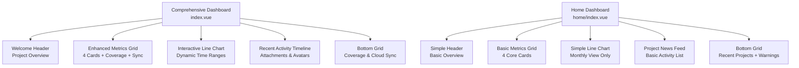
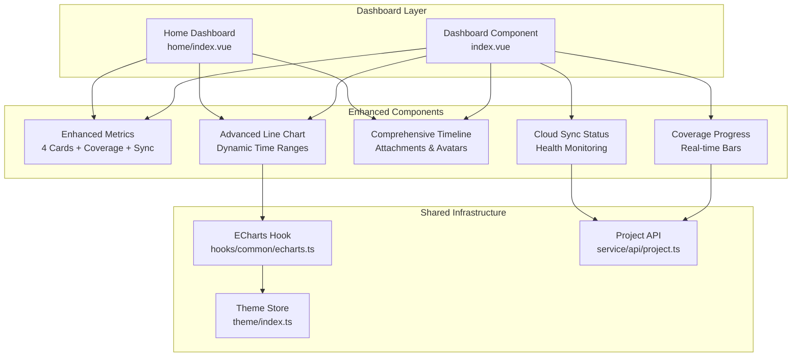
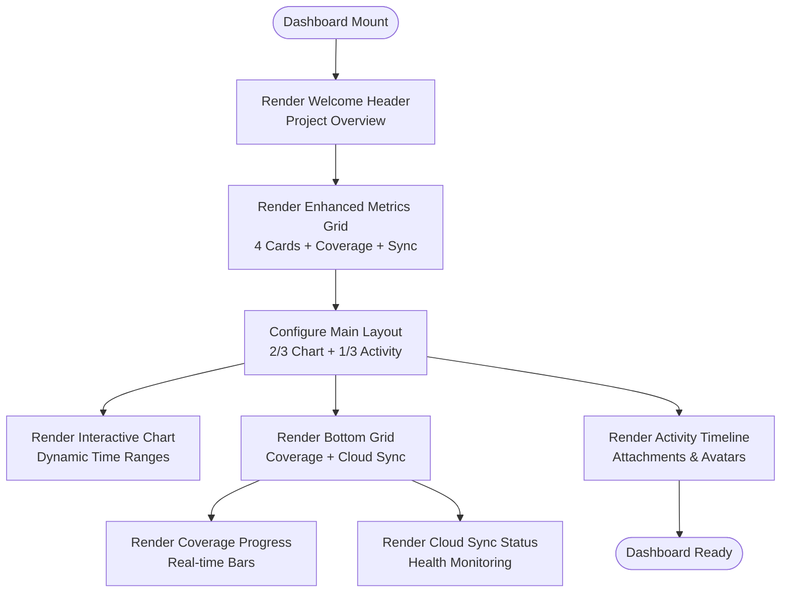
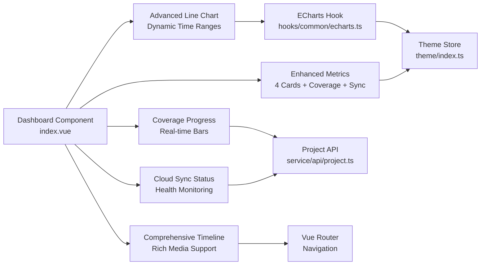

# Dashboard & Analytics

<cite>
**Referenced Files in This Document**
- [index.vue](file://admin-web-soybean/src/views/dashboard/index.vue)
- [home/index.vue](file://admin-web-soybean/src/views/home/index.vue)
- [card-data.vue](file://admin-web-soybean/src/views/home/modules/card-data.vue)
- [line-chart.vue](file://admin-web-soybean/src/views/home/modules/line-chart.vue)
- [project-news.vue](file://admin-web-soybean/src/views/home/modules/project-news.vue)
- [recent-projects.vue](file://admin-web-soybean/src/views/home/modules/recent-projects.vue)
- [anomaly-warnings.vue](file://admin-web-soybean/src/views/home/modules/anomaly-warnings.vue)
- [echarts.ts](file://admin-web-soybean/src/hooks/common/echarts.ts)
- [theme/index.ts](file://admin-web-soybean/src/store/modules/theme/index.ts)
- [project.ts](file://admin-web-soybean/src/service/api/project.ts)
- [dashboard-analytics.html](file://admin-web-soybean/public/samples/dashboard-analytics.html)
- [scrollbar.scss](file://admin-web-soybean/src/styles/scss/scrollbar.scss)
- [vars.ts](file://admin-web-soybean/src/theme/vars.ts)
</cite>

## Update Summary
**Changes Made**
- Added comprehensive dashboard component with enhanced analytics capabilities
- Introduced new metrics cards with coverage distribution and cloud sync status
- Enhanced line chart with dynamic time range switching and real-time data updates
- Added recent activity timeline with attachment support and user avatars
- Implemented new coverage progress bars and cloud synchronization indicators
- Updated responsive design patterns with expanded grid system

## Table of Contents
1. [Introduction](#introduction)
2. [Project Structure](#project-structure)
3. [Core Components](#core-components)
4. [Architecture Overview](#architecture-overview)
5. [Detailed Component Analysis](#detailed-component-analysis)
6. [Dependency Analysis](#dependency-analysis)
7. [Performance Considerations](#performance-considerations)
8. [Troubleshooting Guide](#troubleshooting-guide)
9. [Conclusion](#conclusion)
10. [Appendices](#appendices)

## Introduction
This document describes the comprehensive dashboard and analytics components of the Survey-App admin web application. The new dashboard provides system monitoring capabilities for administrators with real-time analytics and performance metrics. It features a modern glass-morphism design with responsive grid layouts, interactive data visualizations, and comprehensive system monitoring tools.

## Project Structure
The dashboard ecosystem now consists of two main implementations: a comprehensive dashboard with advanced analytics and a simplified home page version. The comprehensive dashboard includes:

- **Comprehensive Dashboard** (`src/views/dashboard/index.vue`): Advanced system monitoring with real-time analytics
- **Home Page Dashboard** (`src/views/home/index.vue`): Simplified version with core metrics and basic analytics
- **Enhanced Components**: Metrics cards, interactive charts, activity feeds, and monitoring widgets

**Diagram sources**
- [index.vue:190-403](file://admin-web-soybean/src/views/dashboard/index.vue#L190-L403)
- [home/index.vue:12-49](file://admin-web-soybean/src/views/home/index.vue#L12-L49)

**Section sources**
- [index.vue:190-403](file://admin-web-soybean/src/views/dashboard/index.vue#L190-L403)
- [home/index.vue:12-49](file://admin-web-soybean/src/views/home/index.vue#L12-L49)

## Core Components
The comprehensive dashboard introduces several enhanced components:

### Enhanced Metrics System
- **Annual Project Statistics**: Total projects, active projects, completed results, and warning items
- **Coverage Distribution**: Real-time progress bars for geological stability, pipeline detection, and terrain mapping
- **Cloud Synchronization**: Status indicators with last sync timestamps and log access

### Advanced Analytics
- **Interactive Line Chart**: Dynamic time range switching (monthly, quarterly, yearly)
- **Real-time Data Updates**: Automatic chart refresh with theme-aware rendering
- **Performance Monitoring**: Dual-series visualization comparing current performance vs historical averages

### Comprehensive Activity Tracking
- **Timeline Interface**: Detailed activity stream with timestamps and user interactions
- **Attachment Support**: PDF previews and download capabilities
- **Team Integration**: Avatar stacking for team member additions
- **System Notifications**: Automated system update announcements

### Monitoring & Alerts
- **Coverage Progress Bars**: Visual indicators for different survey categories
- **Cloud Sync Status**: Real-time synchronization health monitoring
- **Activity Log Access**: Direct navigation to detailed system logs

**Section sources**
- [index.vue:99-128](file://admin-web-soybean/src/views/dashboard/index.vue#L99-L128)
- [index.vue:131-135](file://admin-web-soybean/src/views/dashboard/index.vue#L131-L135)
- [index.vue:14-96](file://admin-web-soybean/src/views/dashboard/index.vue#L14-L96)
- [index.vue:302-390](file://admin-web-soybean/src/views/dashboard/index.vue#L302-L390)

## Architecture Overview
The dashboard architecture supports both comprehensive and simplified implementations with shared components and enhanced data binding:

**Diagram sources**
- [index.vue:190-403](file://admin-web-soybean/src/views/dashboard/index.vue#L190-L403)
- [home/index.vue:12-49](file://admin-web-soybean/src/views/home/index.vue#L12-L49)
- [theme/index.ts:18-221](file://admin-web-soybean/src/store/modules/theme/index.ts#L18-L221)
- [echarts.ts:83-235](file://admin-web-soybean/src/hooks/common/echarts.ts#L83-L235)

## Detailed Component Analysis

### Comprehensive Dashboard Layout
The new dashboard implements a sophisticated three-column layout optimized for system monitoring:

**Diagram sources**
- [index.vue:190-403](file://admin-web-soybean/src/views/dashboard/index.vue#L190-L403)

**Section sources**
- [index.vue:190-403](file://admin-web-soybean/src/views/dashboard/index.vue#L190-L403)

### Enhanced Metrics Cards
The dashboard introduces four comprehensive metrics cards with semantic badges and iconography:

#### Annual Project Statistics
- **Total Projects**: Shows cumulative project count with growth percentage
- **Active Projects**: Real-time indicator for currently running projects
- **Completed Results**: Achievement tracking with completion rate percentages
- **Warning Items**: Alert system for pending issues requiring attention

#### Coverage Distribution System
- **Geological Stability Monitoring**: Progress bar for ground stability surveys
- **Underground Pipeline Detection**: Pipeline infrastructure mapping coverage
- **Topographic Mapping**: Terrain and elevation survey completion rates

#### Cloud Synchronization Status
- **Sync Health Indicator**: Visual status for cloud data synchronization
- **Last Sync Timestamp**: Real-time synchronization timing
- **Log Access**: Direct navigation to detailed synchronization logs

**Section sources**
- [index.vue:99-128](file://admin-web-soybean/src/views/dashboard/index.vue#L99-L128)
- [index.vue:131-135](file://admin-web-soybean/src/views/dashboard/index.vue#L131-L135)
- [index.vue:258-289](file://admin-web-soybean/src/views/dashboard/index.vue#L258-L289)

### Advanced Interactive Line Chart
The enhanced chart provides dynamic time range switching with real-time data updates:

#### Dynamic Time Range System
- **Monthly View**: Daily granularity with 30-day rolling window
- **Quarterly View**: Seasonal analysis with Q1-Q4 breakdown
- **Yearly View**: Long-term trend analysis across multiple years

#### Real-time Data Management
- **Watch-based Updates**: Automatic chart refresh when time range changes
- **Theme-aware Rendering**: Dynamic tooltip and background color adaptation
- **Smooth Transitions**: Animated data point updates with ECharts optimization

#### Enhanced Visualization Features
- **Dual Series Comparison**: Current performance vs historical averages
- **Area Fill Effects**: Gradient overlays for visual depth
- **Responsive Design**: Adaptive sizing for different screen dimensions

**Section sources**
- [index.vue:14-96](file://admin-web-soybean/src/views/dashboard/index.vue#L14-L96)
- [index.vue:137-172](file://admin-web-soybean/src/views/dashboard/index.vue#L137-L172)

### Comprehensive Activity Timeline
The activity stream provides detailed system monitoring with rich interaction capabilities:

#### Activity Stream Architecture
- **Upload Completion**: Document submission notifications with PDF previews
- **Audit Approvals**: Review process completions with team member tagging
- **Team Additions**: New member integrations with avatar stacking
- **System Updates**: Platform maintenance and feature rollouts

#### Rich Media Integration
- **PDF Attachments**: Preview and download capabilities for survey documents
- **Avatar Stacking**: Visual representation of team member additions
- **Timestamp Precision**: Real-time and relative time displays
- **User Tagging**: Contextual highlighting of team members in activities

#### Navigation and Interaction
- **Quick Action Buttons**: Direct navigation to relevant system sections
- **View All History**: Access to complete activity archive
- **Status Indicators**: Color-coded activity types and priorities

**Section sources**
- [index.vue:302-390](file://admin-web-soybean/src/views/dashboard/index.vue#L302-L390)

### Coverage Progress System
The coverage monitoring provides real-time visualization of survey area completion:

#### Progress Bar Implementation
- **Custom Styling**: Tailored progress bar appearance with brand colors
- **Real-time Updates**: Live percentage calculations and visual feedback
- **Category-based Colors**: Distinct visual indicators for different survey types

#### Coverage Categories
- **Geological Stability**: Ground condition monitoring and assessment
- **Pipeline Detection**: Underground infrastructure mapping and verification
- **Topographic Surveys**: Elevation and terrain mapping completion

**Section sources**
- [index.vue:131-135](file://admin-web-soybean/src/views/dashboard/index.vue#L131-L135)
- [index.vue:265-273](file://admin-web-soybean/src/views/dashboard/index.vue#L265-L273)

### Cloud Synchronization Monitoring
The cloud sync component provides comprehensive system health monitoring:

#### Synchronization Status
- **Health Indicators**: Visual status for cloud data synchronization
- **Timing Information**: Last successful sync timestamp and frequency
- **Alert Mechanisms**: Notification system for sync failures or delays

#### Integration Features
- **Log Access**: Direct navigation to detailed synchronization logs
- **Status Reporting**: Comprehensive sync history and error reporting
- **Performance Metrics**: Synchronization speed and data volume tracking

**Section sources**
- [index.vue:276-289](file://admin-web-soybean/src/views/dashboard/index.vue#L276-L289)

### Responsive Design and Accessibility
The dashboard maintains comprehensive responsive design with enhanced accessibility features:

#### Responsive Grid System
- **Mobile-first Approach**: Optimized for mobile device viewing
- **Adaptive Layouts**: Flexible grid system adapting to screen size
- **Touch-friendly Controls**: Large interactive elements for mobile users

#### Accessibility Enhancements
- **Semantic HTML Structure**: Proper heading hierarchy and content organization
- **Keyboard Navigation**: Full keyboard accessibility for all interactive elements
- **Screen Reader Support**: Comprehensive ARIA labels and semantic markup
- **Color Contrast**: High contrast ratios meeting WCAG guidelines
- **Focus Management**: Clear focus indicators and logical tab order

**Section sources**
- [index.vue:200-227](file://admin-web-soybean/src/views/dashboard/index.vue#L200-L227)
- [index.vue:405-436](file://admin-web-soybean/src/views/dashboard/index.vue#L405-L436)

## Dependency Analysis
The comprehensive dashboard introduces enhanced dependencies and component relationships:

**Diagram sources**
- [index.vue:190-403](file://admin-web-soybean/src/views/dashboard/index.vue#L190-L403)
- [echarts.ts:83-235](file://admin-web-soybean/src/hooks/common/echarts.ts#L83-L235)
- [theme/index.ts:18-221](file://admin-web-soybean/src/store/modules/theme/index.ts#L18-L221)

**Section sources**
- [index.vue:190-403](file://admin-web-soybean/src/views/dashboard/index.vue#L190-L403)
- [echarts.ts:83-235](file://admin-web-soybean/src/hooks/common/echarts.ts#L83-L235)
- [theme/index.ts:18-221](file://admin-web-soybean/src/store/modules/theme/index.ts#L18-L221)

## Performance Considerations
The comprehensive dashboard implements several performance optimizations:

### Enhanced ECharts Integration
- **Automatic Optimization**: ECharts lifecycle management with resize handling
- **Theme-aware Rendering**: Efficient theme switching without full chart recreation
- **Memory Management**: Proper cleanup of chart instances and event listeners

### Data Management Strategies
- **Lazy Loading**: Conditional loading of heavy components until needed
- **Virtual Scrolling**: Efficient rendering of long activity timelines
- **Component Caching**: Preserved state for frequently accessed dashboards

### Responsive Performance
- **CSS Grid Optimization**: Efficient layout calculations across breakpoints
- **Image Lazy Loading**: Optimized avatar and attachment loading
- **Animation Performance**: Hardware-accelerated CSS transitions and transforms

## Troubleshooting Guide
Common issues and solutions for the comprehensive dashboard:

### Chart Rendering Issues
- **Chart Not Displaying**: Verify DOM element dimensions and ECharts initialization timing
- **Theme Inconsistencies**: Ensure theme store dark mode is properly synchronized
- **Data Update Failures**: Check watch-based update mechanisms for time range changes

### Component Interaction Problems
- **Time Range Switching**: Verify watch-based reactive updates are properly configured
- **Activity Stream Loading**: Check API connectivity and data transformation logic
- **Navigation Issues**: Validate router configuration and route resolution

### Performance Optimization
- **Slow Initial Load**: Implement lazy loading for non-critical components
- **Memory Leaks**: Ensure proper cleanup of ECharts instances and event listeners
- **Mobile Performance**: Optimize touch interactions and reduce unnecessary re-renders

**Section sources**
- [index.vue:137-172](file://admin-web-soybean/src/views/dashboard/index.vue#L137-L172)
- [index.vue:183-187](file://admin-web-soybean/src/views/dashboard/index.vue#L183-L187)

## Conclusion
The comprehensive dashboard represents a significant enhancement to the Survey-App admin interface, providing administrators with powerful system monitoring capabilities. The new implementation combines advanced analytics, real-time data visualization, and comprehensive system oversight in a cohesive, accessible interface. The modular architecture ensures maintainability while the responsive design guarantees optimal user experience across all device types.

## Appendices

### Responsive Design Patterns
The dashboard implements sophisticated responsive design patterns:

#### Breakpoint Strategy
- **Mobile**: Single column layout with stacked components
- **Tablet**: Two-column adaptive layout with flexible component sizing
- **Desktop**: Three-column optimized layout with enhanced analytics display
- **Large Screens**: Expanded grid system supporting multiple concurrent monitors

#### Component Adaptation
- **Grid System**: CSS Grid with automatic column adjustment based on available space
- **Typography Scaling**: Responsive font sizing with optimal readability at all breakpoints
- **Interactive Elements**: Touch-friendly sizing and spacing for mobile devices

**Section sources**
- [index.vue:200-227](file://admin-web-soybean/src/views/dashboard/index.vue#L200-L227)
- [index.vue:230-290](file://admin-web-soybean/src/views/dashboard/index.vue#L230-L290)

### Accessibility Features
Comprehensive accessibility implementation across all dashboard components:

#### Semantic Structure
- **Proper Headings**: Logical heading hierarchy from H1 to H6
- **ARIA Labels**: Descriptive labels for interactive elements and charts
- **Landmark Regions**: Semantic sectioning for screen reader navigation

#### Keyboard Navigation
- **Full Keyboard Access**: All interactive elements accessible via keyboard
- **Focus Management**: Logical tab order and visible focus indicators
- **Shortcuts**: Keyboard shortcuts for common dashboard actions

#### Visual Accessibility
- **High Contrast Mode**: Full support for high contrast and reduced color schemes
- **Text Scaling**: Responsive typography supporting text scaling preferences
- **Color Independence**: Information conveyed through multiple modalities beyond color

**Section sources**
- [index.vue:405-436](file://admin-web-soybean/src/views/dashboard/index.vue#L405-L436)
- [index.vue:190-403](file://admin-web-soybean/src/views/dashboard/index.vue#L190-L403)