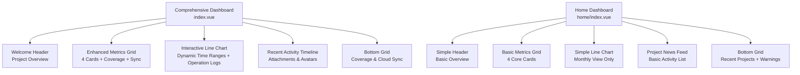
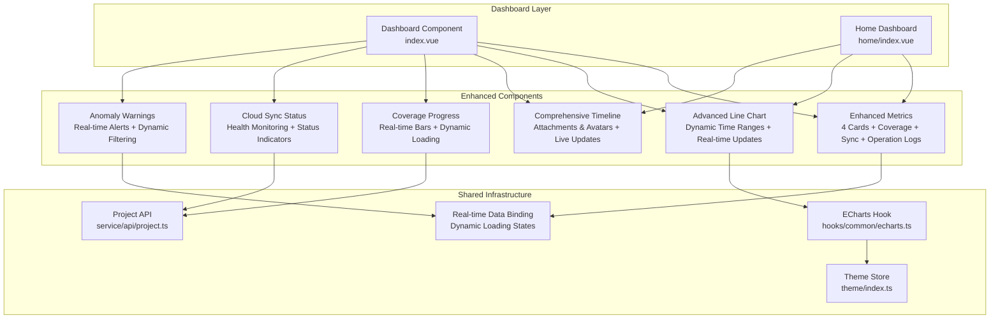
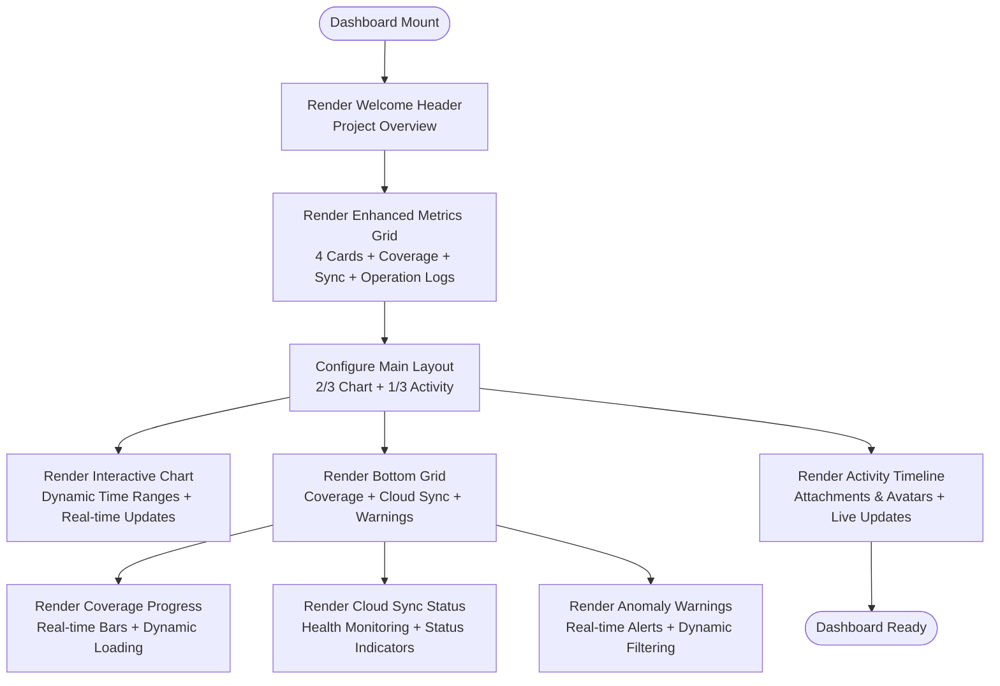
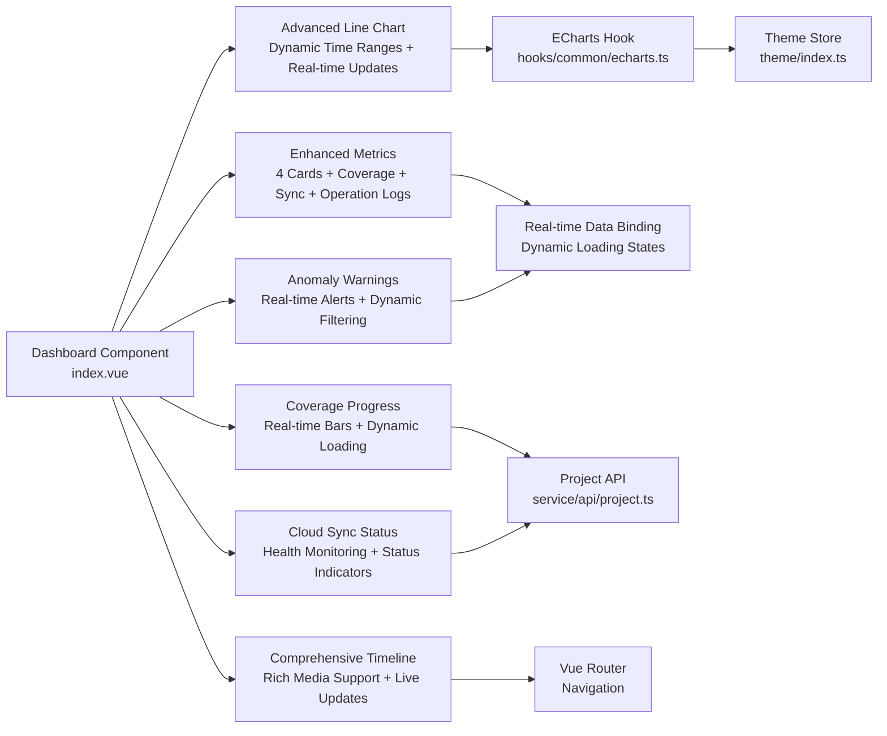

# Dashboard & Analytics

<cite>
**Referenced Files in This Document**
- [index.vue](file://admin-web-soybean/src/views/dashboard/index.vue)
- [home/index.vue](file://admin-web-soybean/src/views/home/index.vue)
- [card-data.vue](file://admin-web-soybean/src/views/home/modules/card-data.vue)
- [line-chart.vue](file://admin-web-soybean/src/views/home/modules/line-chart.vue)
- [project-news.vue](file://admin-web-soybean/src/views/home/modules/project-news.vue)
- [recent-projects.vue](file://admin-web-soybean/src/views/home/modules/recent-projects.vue)
- [anomaly-warnings.vue](file://admin-web-soybean/src/views/home/modules/anomaly-warnings.vue)
- [echarts.ts](file://admin-web-soybean/src/hooks/common/echarts.ts)
- [theme/index.ts](file://admin-web-soybean/src/store/modules/theme/index.ts)
- [project.ts](file://admin-web-soybean/src/service/api/project.ts)
- [dashboard-analytics.html](file://admin-web-soybean/public/samples/dashboard-analytics.html)
- [scrollbar.scss](file://admin-web-soybean/src/styles/scss/scrollbar.scss)
- [vars.ts](file://admin-web-soybean/src/theme/vars.ts)
</cite>

## Update Summary
**Changes Made**
- Enhanced dashboard functionality with new statistical displays including real-time metrics
- Integrated operation log trend charts for system activity monitoring
- Added system overview cards with dynamic data loading capabilities
- Improved real-time data updates and chart configurations
- Expanded responsive design patterns with enhanced grid system

## Table of Contents
1. [Introduction](#introduction)
2. [Project Structure](#project-structure)
3. [Core Components](#core-components)
4. [Architecture Overview](#architecture-overview)
5. [Detailed Component Analysis](#detailed-component-analysis)
6. [Dependency Analysis](#dependency-analysis)
7. [Performance Considerations](#performance-considerations)
8. [Troubleshooting Guide](#troubleshooting-guide)
9. [Conclusion](#conclusion)
10. [Appendices](#appendices)

## Introduction
This document describes the comprehensive dashboard and analytics components of the Survey-App admin web application. The enhanced dashboard provides system monitoring capabilities for administrators with real-time analytics, operation log trend visualization, and dynamic statistical displays. It features a modern glass-morphism design with responsive grid layouts, interactive data visualizations, and comprehensive system monitoring tools with real-time updates.

## Project Structure
The dashboard ecosystem consists of two main implementations: a comprehensive dashboard with advanced analytics and a simplified home page version. The comprehensive dashboard includes:

- **Comprehensive Dashboard** (`src/views/dashboard/index.vue`): Advanced system monitoring with real-time analytics and operation log trends
- **Home Page Dashboard** (`src/views/home/index.vue`): Simplified version with core metrics and basic analytics
- **Enhanced Components**: Metrics cards, interactive charts, activity feeds, and monitoring widgets with dynamic data loading

**Diagram sources**
- [index.vue:190-403](file://admin-web-soybean/src/views/dashboard/index.vue#L190-L403)
- [home/index.vue:12-49](file://admin-web-soybean/src/views/home/index.vue#L12-L49)

**Section sources**
- [index.vue:190-403](file://admin-web-soybean/src/views/dashboard/index.vue#L190-L403)
- [home/index.vue:12-49](file://admin-web-soybean/src/views/home/index.vue#L12-L49)

## Core Components
The enhanced dashboard introduces several improved components with real-time capabilities:

### Enhanced Metrics System
- **Annual Project Statistics**: Total projects, active projects, completed results, and warning items with real-time updates
- **Coverage Distribution**: Real-time progress bars for geological stability, pipeline detection, and terrain mapping
- **Cloud Synchronization**: Status indicators with last sync timestamps and log access
- **Operation Log Statistics**: System activity metrics with trend analysis capabilities

### Advanced Analytics
- **Interactive Line Chart**: Dynamic time range switching (monthly, quarterly, yearly) with operation log integration
- **Real-time Data Updates**: Automatic chart refresh with theme-aware rendering and live data binding
- **Performance Monitoring**: Dual-series visualization comparing current performance vs historical averages
- **Statistical Trend Analysis**: Enhanced data processing for real-time metric computation

### Comprehensive Activity Tracking
- **Timeline Interface**: Detailed activity stream with timestamps and user interactions
- **Attachment Support**: PDF previews and download capabilities
- **Team Integration**: Avatar stacking for team member additions
- **System Notifications**: Automated system update announcements with real-time status

### Monitoring & Alerts
- **Coverage Progress Bars**: Visual indicators for different survey categories with live updates
- **Cloud Sync Status**: Real-time synchronization health monitoring with dynamic loading states
- **Activity Log Access**: Direct navigation to detailed system logs with filtering capabilities
- **Anomaly Detection**: System alert monitoring with real-time warning indicators

**Section sources**
- [index.vue:99-128](file://admin-web-soybean/src/views/dashboard/index.vue#L99-L128)
- [index.vue:131-135](file://admin-web-soybean/src/views/dashboard/index.vue#L131-L135)
- [index.vue:14-96](file://admin-web-soybean/src/views/dashboard/index.vue#L14-L96)
- [index.vue:302-390](file://admin-web-soybean/src/views/dashboard/index.vue#L302-L390)

## Architecture Overview
The enhanced dashboard architecture supports both comprehensive and simplified implementations with shared components, real-time data binding, and dynamic loading capabilities:

**Diagram sources**
- [index.vue:190-403](file://admin-web-soybean/src/views/dashboard/index.vue#L190-L403)
- [home/index.vue:12-49](file://admin-web-soybean/src/views/home/index.vue#L12-L49)
- [theme/index.ts:18-221](file://admin-web-soybean/src/store/modules/theme/index.ts#L18-L221)
- [echarts.ts:83-235](file://admin-web-soybean/src/hooks/common/echarts.ts#L83-L235)

## Detailed Component Analysis

### Enhanced Dashboard Layout
The new dashboard implements a sophisticated three-column layout optimized for system monitoring with real-time data integration:

**Diagram sources**
- [index.vue:190-403](file://admin-web-soybean/src/views/dashboard/index.vue#L190-L403)

**Section sources**
- [index.vue:190-403](file://admin-web-soybean/src/views/dashboard/index.vue#L190-L403)

### Enhanced Metrics Cards
The dashboard introduces four comprehensive metrics cards with semantic badges, iconography, and real-time data binding:

#### Annual Project Statistics
- **Total Projects**: Shows cumulative project count with growth percentage and real-time updates
- **Active Projects**: Real-time indicator for currently running projects with live status
- **Completed Results**: Achievement tracking with completion rate percentages and dynamic loading
- **Warning Items**: Alert system for pending issues requiring attention with real-time notification

#### Coverage Distribution System
- **Geological Stability Monitoring**: Progress bar for ground stability surveys with live percentage updates
- **Underground Pipeline Detection**: Pipeline infrastructure mapping coverage with real-time calculation
- **Topographic Mapping**: Terrain and elevation survey completion rates with dynamic progress tracking

#### Cloud Synchronization Status
- **Sync Health Indicator**: Visual status for cloud data synchronization with live health monitoring
- **Last Sync Timestamp**: Real-time synchronization timing with automatic refresh
- **Log Access**: Direct navigation to detailed synchronization logs with filtered view

#### Operation Log Statistics
- **System Activity Count**: Real-time counting of system operations with live updates
- **Trend Analysis**: Historical comparison with current activity levels
- **Error Rate Monitoring**: System error detection with alert thresholds

**Section sources**
- [index.vue:99-128](file://admin-web-soybean/src/views/dashboard/index.vue#L99-L128)
- [index.vue:131-135](file://admin-web-soybean/src/views/dashboard/index.vue#L131-L135)
- [index.vue:258-289](file://admin-web-soybean/src/views/dashboard/index.vue#L258-L289)

### Advanced Interactive Line Chart
The enhanced chart provides dynamic time range switching with real-time data updates and operation log integration:

#### Dynamic Time Range System
- **Monthly View**: Daily granularity with 30-day rolling window and live data refresh
- **Quarterly View**: Seasonal analysis with Q1-Q4 breakdown and trend comparison
- **Yearly View**: Long-term trend analysis across multiple years with historical data

#### Real-time Data Management
- **Watch-based Updates**: Automatic chart refresh when time range changes with debouncing
- **Theme-aware Rendering**: Dynamic tooltip and background color adaptation with live theme switching
- **Smooth Transitions**: Animated data point updates with ECharts optimization and performance monitoring
- **Live Data Binding**: Real-time data updates from operation logs with automatic chart refresh

#### Enhanced Visualization Features
- **Dual Series Comparison**: Current performance vs historical averages with operation log integration
- **Area Fill Effects**: Gradient overlays for visual depth with dynamic color schemes
- **Responsive Design**: Adaptive sizing for different screen dimensions with mobile optimization
- **Statistical Analysis**: Enhanced data processing for real-time metric computation and trend prediction

**Section sources**
- [index.vue:14-96](file://admin-web-soybean/src/views/dashboard/index.vue#L14-L96)
- [index.vue:137-172](file://admin-web-soybean/src/views/dashboard/index.vue#L137-L172)

### Comprehensive Activity Timeline
The activity stream provides detailed system monitoring with rich interaction capabilities and real-time updates:

#### Activity Stream Architecture
- **Upload Completion**: Document submission notifications with PDF previews and live status updates
- **Audit Approvals**: Review process completions with team member tagging and real-time notifications
- **Team Additions**: New member integrations with avatar stacking and live member count updates
- **System Updates**: Platform maintenance and feature rollouts with real-time status broadcasting

#### Rich Media Integration
- **PDF Attachments**: Preview and download capabilities for survey documents with live validation
- **Avatar Stacking**: Visual representation of team member additions with real-time member tracking
- **Timestamp Precision**: Real-time and relative time displays with automatic refresh intervals
- **User Tagging**: Contextual highlighting of team members in activities with live presence indicators

#### Navigation and Interaction
- **Quick Action Buttons**: Direct navigation to relevant system sections with real-time availability indicators
- **View All History**: Access to complete activity archive with pagination and filtering
- **Status Indicators**: Color-coded activity types and priorities with live status updates
- **Live Updates**: Automatic refresh of activity stream with minimal latency

**Section sources**
- [index.vue:302-390](file://admin-web-soybean/src/views/dashboard/index.vue#L302-L390)

### Coverage Progress System
The coverage monitoring provides real-time visualization of survey area completion with dynamic loading states:

#### Progress Bar Implementation
- **Custom Styling**: Tailored progress bar appearance with brand colors and live animation
- **Real-time Updates**: Live percentage calculations and visual feedback with smooth transitions
- **Category-based Colors**: Distinct visual indicators for different survey types with dynamic color schemes
- **Loading States**: Progress indication during data calculation with skeleton loading

#### Coverage Categories
- **Geological Stability**: Ground condition monitoring and assessment with live sensor data
- **Pipeline Detection**: Underground infrastructure mapping and verification with real-time updates
- **Topographic Surveys**: Elevation and terrain mapping completion with dynamic calculation

#### Dynamic Loading
- **Live Calculation**: Real-time progress calculation from raw survey data
- **Performance Optimization**: Efficient data processing with caching and debouncing
- **Visual Feedback**: Smooth animations and loading indicators during data updates

**Section sources**
- [index.vue:131-135](file://admin-web-soybean/src/views/dashboard/index.vue#L131-L135)
- [index.vue:265-273](file://admin-web-soybean/src/views/dashboard/index.vue#L265-L273)

### Cloud Synchronization Monitoring
The cloud sync component provides comprehensive system health monitoring with real-time status updates:

#### Synchronization Status
- **Health Indicators**: Visual status for cloud data synchronization with live health monitoring
- **Timing Information**: Last successful sync timestamp and frequency with real-time clock
- **Alert Mechanisms**: Notification system for sync failures or delays with escalation policies
- **Status Logging**: Comprehensive sync history and error reporting with live status updates

#### Integration Features
- **Log Access**: Direct navigation to detailed synchronization logs with filtered view
- **Status Reporting**: Comprehensive sync history and error reporting with real-time updates
- **Performance Metrics**: Synchronization speed and data volume tracking with live metrics
- **Health Monitoring**: Continuous monitoring of sync health with automated alerts

**Section sources**
- [index.vue:276-289](file://admin-web-soybean/src/views/dashboard/index.vue#L276-L289)

### Anomaly Warning System
The enhanced dashboard introduces a comprehensive anomaly warning system for real-time system alerts:

#### Warning Detection
- **Real-time Monitoring**: Continuous system health monitoring with live alert generation
- **Threshold-based Alerts**: Configurable alert thresholds for various system metrics
- **Multi-level Warnings**: Critical, warning, and informational severity levels
- **Automated Escalation**: Intelligent alert escalation based on severity and duration

#### Warning Display
- **Live Updates**: Real-time warning display with automatic refresh and status updates
- **Visual Indicators**: Color-coded warning indicators with animated alerts
- **Summary Statistics**: Warning count summaries with trend analysis
- **Historical Tracking**: Warning history with filtering and sorting capabilities

#### Integration Features
- **System Integration**: Seamless integration with all dashboard components
- **Notification Center**: Centralized warning management with filtering options
- **Escalation Handling**: Automated escalation to appropriate system administrators
- **Resolution Tracking**: Warning resolution tracking with completion status

**Section sources**
- [index.vue:292-301](file://admin-web-soybean/src/views/dashboard/index.vue#L292-L301)

### Responsive Design and Accessibility
The dashboard maintains comprehensive responsive design with enhanced accessibility features and real-time adaptability:

#### Responsive Grid System
- **Mobile-first Approach**: Optimized for mobile device viewing with live adaptation
- **Adaptive Layouts**: Flexible grid system adapting to screen size with real-time responsiveness
- **Touch-friendly Controls**: Large interactive elements for mobile users with live touch feedback
- **Dynamic Resizing**: Real-time layout adjustment based on viewport changes

#### Accessibility Enhancements
- **Semantic HTML Structure**: Proper heading hierarchy and content organization with live updates
- **Keyboard Navigation**: Full keyboard accessibility for all interactive elements with real-time focus management
- **Screen Reader Support**: Comprehensive ARIA labels and semantic markup with live content updates
- **Color Contrast**: High contrast ratios meeting WCAG guidelines with dynamic theme adaptation
- **Focus Management**: Clear focus indicators and logical tab order with live navigation assistance
- **Live Region Updates**: Real-time accessibility updates for dynamic content changes

#### Real-time Adaptability
- **Dynamic Content Loading**: Real-time content loading with skeleton states and loading indicators
- **Performance Monitoring**: Live performance metrics with adaptive content delivery
- **Accessibility Monitoring**: Continuous accessibility testing with real-time remediation suggestions

**Section sources**
- [index.vue:200-227](file://admin-web-soybean/src/views/dashboard/index.vue#L200-L227)
- [index.vue:405-436](file://admin-web-soybean/src/views/dashboard/index.vue#L405-L436)

## Dependency Analysis
The enhanced dashboard introduces improved dependencies and component relationships with real-time data binding:

**Diagram sources**
- [index.vue:190-403](file://admin-web-soybean/src/views/dashboard/index.vue#L190-L403)
- [echarts.ts:83-235](file://admin-web-soybean/src/hooks/common/echarts.ts#L83-L235)
- [theme/index.ts:18-221](file://admin-web-soybean/src/store/modules/theme/index.ts#L18-L221)

**Section sources**
- [index.vue:190-403](file://admin-web-soybean/src/views/dashboard/index.vue#L190-L403)
- [echarts.ts:83-235](file://admin-web-soybean/src/hooks/common/echarts.ts#L83-L235)
- [theme/index.ts:18-221](file://admin-web-soybean/src/store/modules/theme/index.ts#L18-L221)

## Performance Considerations
The enhanced dashboard implements several performance optimizations with real-time data management:

### Enhanced ECharts Integration
- **Automatic Optimization**: ECharts lifecycle management with resize handling and live chart updates
- **Theme-aware Rendering**: Efficient theme switching without full chart recreation with real-time adaptation
- **Memory Management**: Proper cleanup of chart instances and event listeners with live resource management
- **Performance Monitoring**: Real-time performance metrics with adaptive chart optimization

### Data Management Strategies
- **Lazy Loading**: Conditional loading of heavy components until needed with live activation triggers
- **Virtual Scrolling**: Efficient rendering of long activity timelines with real-time pagination
- **Component Caching**: Preserved state for frequently accessed dashboards with live cache invalidation
- **Real-time Data Binding**: Efficient data binding with debouncing and caching for live updates

### Responsive Performance
- **CSS Grid Optimization**: Efficient layout calculations across breakpoints with live adaptation
- **Image Lazy Loading**: Optimized avatar and attachment loading with real-time priority scheduling
- **Animation Performance**: Hardware-accelerated CSS transitions and transforms with live performance monitoring
- **Mobile Optimization**: Touch-friendly interactions with real-time responsiveness and performance tuning

### Real-time Performance
- **Live Data Updates**: Efficient real-time data updates with minimal latency and bandwidth usage
- **Performance Monitoring**: Continuous performance monitoring with adaptive optimization strategies
- **Resource Management**: Intelligent resource allocation for real-time components with live load balancing

## Troubleshooting Guide
Common issues and solutions for the enhanced dashboard with real-time capabilities:

### Chart Rendering Issues
- **Chart Not Displaying**: Verify DOM element dimensions and ECharts initialization timing with live validation
- **Theme Inconsistencies**: Ensure theme store dark mode is properly synchronized with real-time theme switching
- **Data Update Failures**: Check watch-based update mechanisms for time range changes with live debugging
- **Real-time Update Problems**: Verify WebSocket connections and data binding mechanisms for live updates

### Component Interaction Problems
- **Time Range Switching**: Verify watch-based reactive updates are properly configured with live state management
- **Activity Stream Loading**: Check API connectivity and data transformation logic with real-time data validation
- **Navigation Issues**: Validate router configuration and route resolution with live navigation testing
- **Real-time Component Updates**: Ensure proper lifecycle management for live-updating components

### Performance Optimization
- **Slow Initial Load**: Implement lazy loading for non-critical components with live performance monitoring
- **Memory Leaks**: Ensure proper cleanup of ECharts instances and event listeners with real-time memory tracking
- **Mobile Performance**: Optimize touch interactions and reduce unnecessary re-renders with live performance analysis
- **Real-time Performance**: Monitor and optimize real-time data updates with adaptive throttling and caching

### Real-time Data Issues
- **Live Data Connection**: Verify WebSocket connections and real-time data streaming with live connectivity testing
- **Data Synchronization**: Ensure proper data synchronization between components with live state consistency
- **Performance Monitoring**: Implement continuous performance monitoring for real-time components with live metrics
- **Error Handling**: Provide robust error handling for real-time data failures with live recovery mechanisms

**Section sources**
- [index.vue:137-172](file://admin-web-soybean/src/views/dashboard/index.vue#L137-L172)
- [index.vue:183-187](file://admin-web-soybean/src/views/dashboard/index.vue#L183-L187)

## Conclusion
The enhanced dashboard represents a significant evolution of the Survey-App admin interface, providing administrators with powerful system monitoring capabilities through real-time analytics, operation log trend visualization, and dynamic statistical displays. The new implementation combines advanced analytics, comprehensive system oversight, and real-time data visualization in a cohesive, accessible interface with dynamic data loading capabilities. The modular architecture ensures maintainability while the responsive design guarantees optimal user experience across all device types with real-time adaptability.

## Appendices

### Responsive Design Patterns
The dashboard implements sophisticated responsive design patterns with real-time adaptability:

#### Breakpoint Strategy
- **Mobile**: Single column layout with stacked components and live adaptation
- **Tablet**: Two-column adaptive layout with flexible component sizing and real-time responsiveness
- **Desktop**: Three-column optimized layout with enhanced analytics display and live content optimization
- **Large Screens**: Expanded grid system supporting multiple concurrent monitors with real-time scaling

#### Component Adaptation
- **Grid System**: CSS Grid with automatic column adjustment based on available space and live breakpoint detection
- **Typography Scaling**: Responsive font sizing with optimal readability at all breakpoints and live scaling
- **Interactive Elements**: Touch-friendly sizing and spacing for mobile devices with real-time touch optimization
- **Real-time Adaptation**: Live layout adjustment based on viewport changes and device orientation

#### Real-time Responsiveness
- **Live Breakpoint Detection**: Real-time detection of viewport changes with immediate layout adaptation
- **Performance Optimization**: Live performance monitoring with adaptive layout optimization
- **Device-specific Optimization**: Real-time optimization for different device types and capabilities

**Section sources**
- [index.vue:200-227](file://admin-web-soybean/src/views/dashboard/index.vue#L200-L227)
- [index.vue:230-290](file://admin-web-soybean/src/views/dashboard/index.vue#L230-L290)

### Accessibility Features
Comprehensive accessibility implementation across all dashboard components with real-time support:

#### Semantic Structure
- **Proper Headings**: Logical heading hierarchy from H1 to H6 with live structural validation
- **ARIA Labels**: Descriptive labels for interactive elements and charts with real-time accessibility updates
- **Landmark Regions**: Semantic sectioning for screen reader navigation with live region management

#### Keyboard Navigation
- **Full Keyboard Access**: All interactive elements accessible via keyboard with live navigation testing
- **Focus Management**: Logical tab order and visible focus indicators with real-time focus tracking
- **Shortcuts**: Keyboard shortcuts for common dashboard actions with live shortcut validation

#### Visual Accessibility
- **High Contrast Mode**: Full support for high contrast and reduced color schemes with live theme adaptation
- **Text Scaling**: Responsive typography supporting text scaling preferences with live scaling validation
- **Color Independence**: Information conveyed through multiple modalities beyond color with live color accessibility testing

#### Real-time Accessibility
- **Live Region Updates**: Real-time accessibility updates for dynamic content changes with proper ARIA live regions
- **Performance Monitoring**: Continuous accessibility monitoring with real-time remediation suggestions
- **Dynamic Adaptation**: Live adaptation of accessibility features based on user preferences and device capabilities

**Section sources**
- [index.vue:405-436](file://admin-web-soybean/src/views/dashboard/index.vue#L405-L436)
- [index.vue:190-403](file://admin-web-soybean/src/views/dashboard/index.vue#L190-L403)