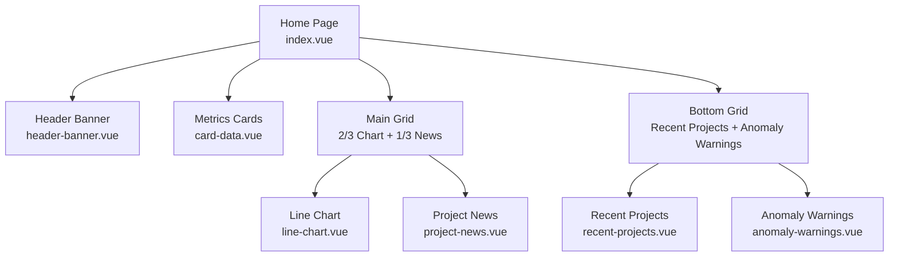
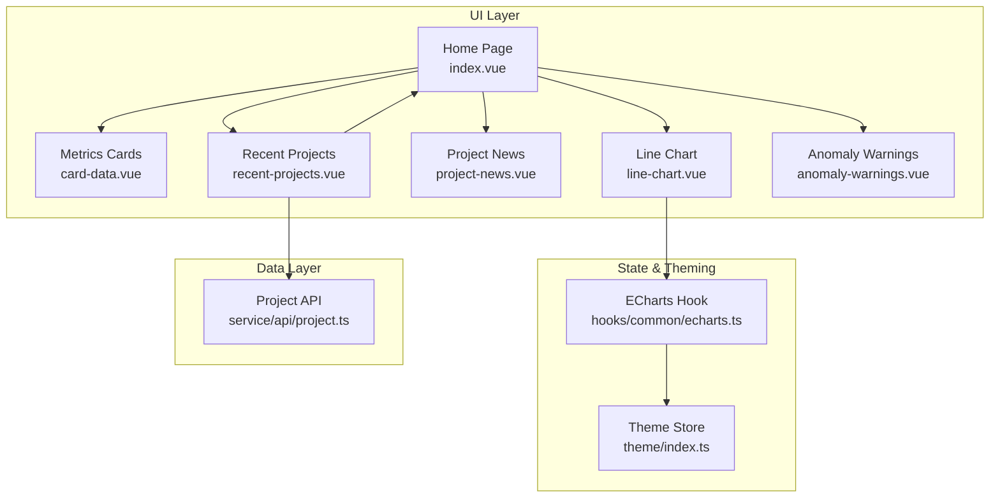
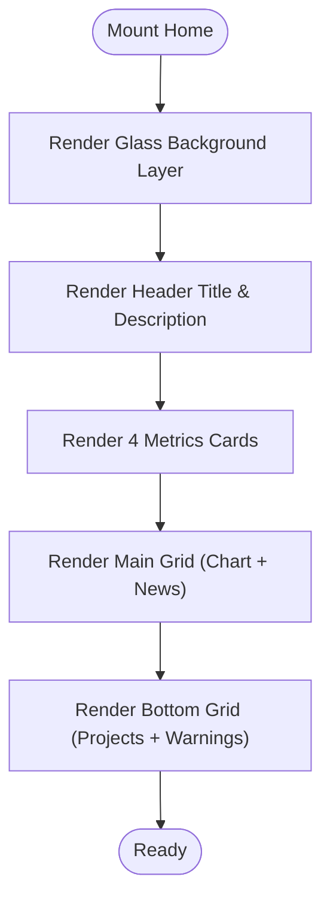
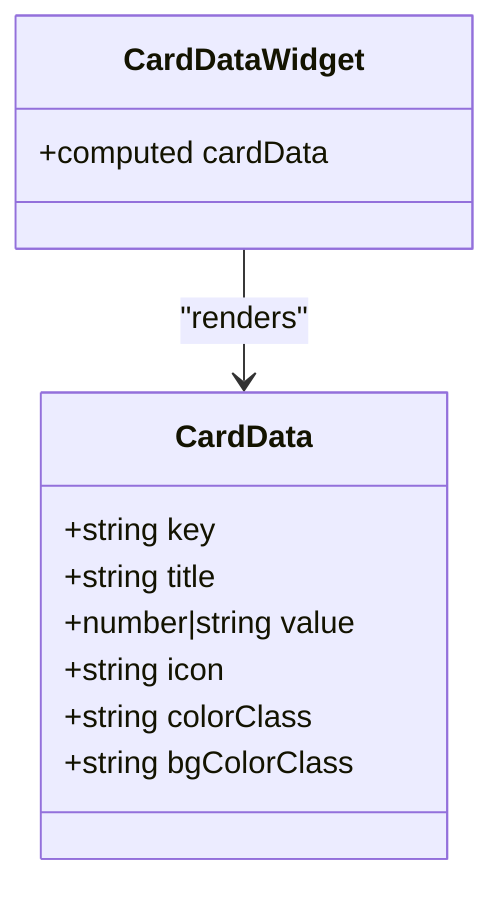
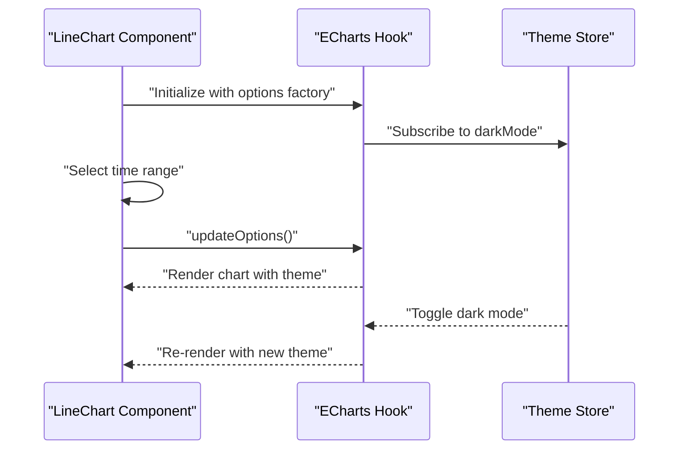
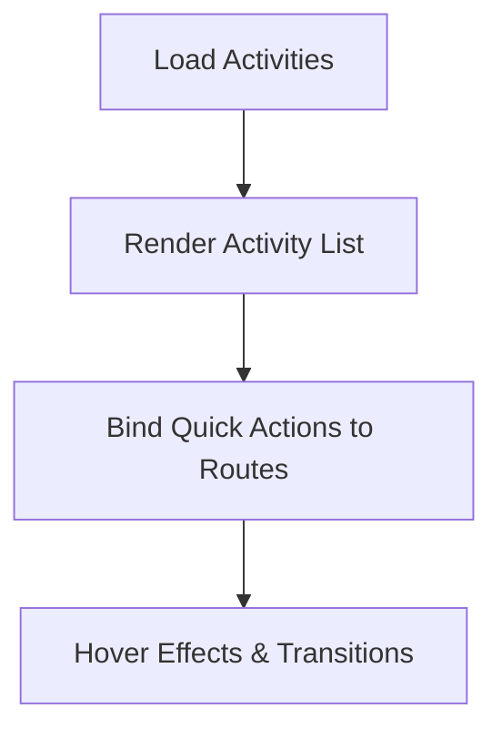
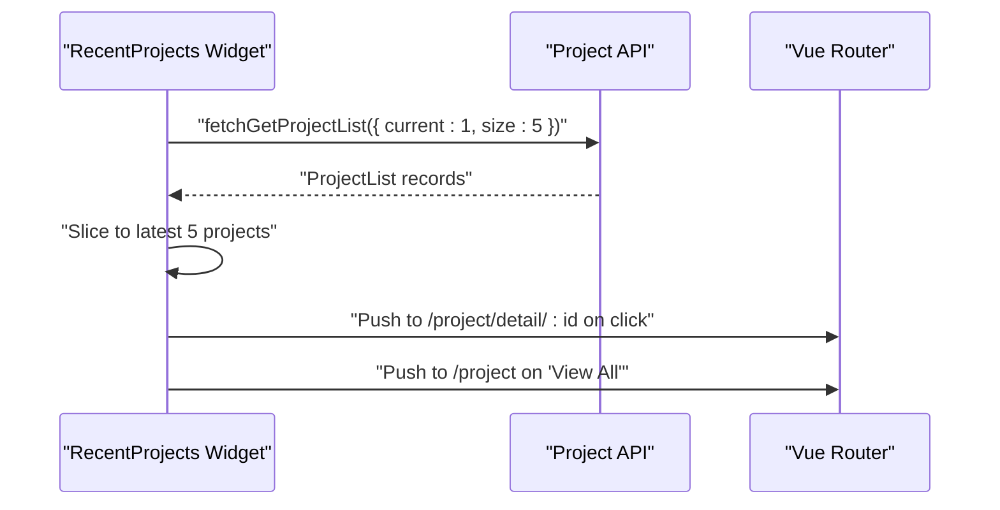
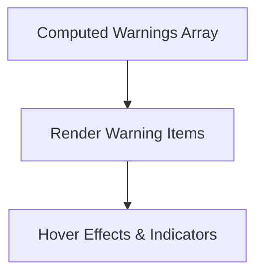
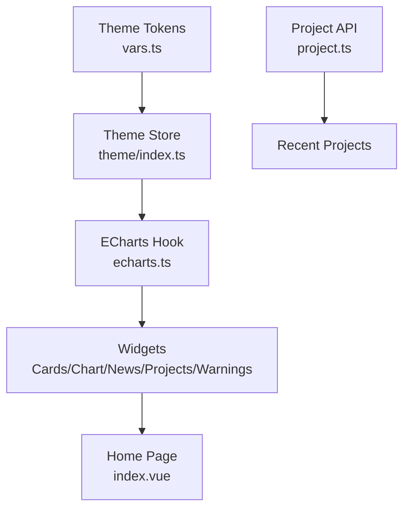
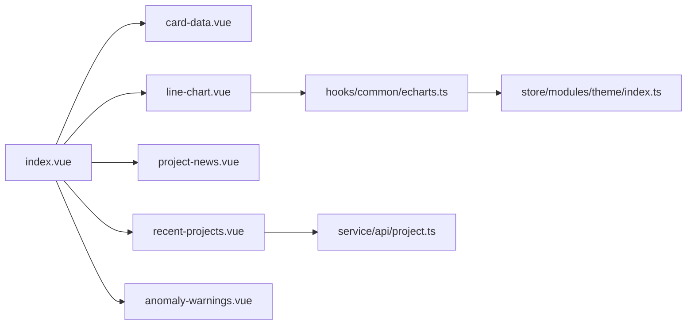

# Dashboard & Analytics

<cite>
**Referenced Files in This Document**
- [index.vue](file://admin-web-soybean/src/views/home/index.vue)
- [card-data.vue](file://admin-web-soybean/src/views/home/modules/card-data.vue)
- [line-chart.vue](file://admin-web-soybean/src/views/home/modules/line-chart.vue)
- [project-news.vue](file://admin-web-soybean/src/views/home/modules/project-news.vue)
- [recent-projects.vue](file://admin-web-soybean/src/views/home/modules/recent-projects.vue)
- [anomaly-warnings.vue](file://admin-web-soybean/src/views/home/modules/anomaly-warnings.vue)
- [echarts.ts](file://admin-web-soybean/src/hooks/common/echarts.ts)
- [theme/index.ts](file://admin-web-soybean/src/store/modules/theme/index.ts)
- [project.ts](file://admin-web-soybean/src/service/api/project.ts)
- [dashboard-analytics.html](file://admin-web-soybean/public/samples/dashboard-analytics.html)
- [scrollbar.scss](file://admin-web-soybean/src/styles/scss/scrollbar.scss)
- [vars.ts](file://admin-web-soybean/src/theme/vars.ts)
</cite>

## Table of Contents
1. [Introduction](#introduction)
2. [Project Structure](#project-structure)
3. [Core Components](#core-components)
4. [Architecture Overview](#architecture-overview)
5. [Detailed Component Analysis](#detailed-component-analysis)
6. [Dependency Analysis](#dependency-analysis)
7. [Performance Considerations](#performance-considerations)
8. [Troubleshooting Guide](#troubleshooting-guide)
9. [Conclusion](#conclusion)
10. [Appendices](#appendices)

## Introduction
This document describes the dashboard and analytics components of the Survey-App admin web application. It focuses on the home page layout with glass-morphism effects and a responsive grid system, core metrics cards, an interactive line chart for trend visualization, the project news feed, the recent projects widget with timeline visualization, and the anomaly warnings component. It also covers data binding, chart configurations, real-time update patterns, responsive design, and accessibility considerations.

## Project Structure
The dashboard is composed of a single-page layout that orchestrates multiple modular components. The home page coordinates:
- A welcome header and glass background layer
- A grid of four core metrics cards
- A two-column main content area: a line chart on the left and a project news feed on the right
- A two-column bottom area: recent projects and anomaly warnings

**Diagram sources**
- [index.vue:12-49](file://admin-web-soybean/src/views/home/index.vue#L12-L49)
- [card-data.vue:58-103](file://admin-web-soybean/src/views/home/modules/card-data.vue#L58-L103)
- [line-chart.vue:109-131](file://admin-web-soybean/src/views/home/modules/line-chart.vue#L109-L131)
- [project-news.vue:87-139](file://admin-web-soybean/src/views/home/modules/project-news.vue#L87-L139)
- [recent-projects.vue:54-136](file://admin-web-soybean/src/views/home/modules/recent-projects.vue#L54-L136)
- [anomaly-warnings.vue:25-74](file://admin-web-soybean/src/views/home/modules/anomaly-warnings.vue#L25-L74)

**Section sources**
- [index.vue:12-49](file://admin-web-soybean/src/views/home/index.vue#L12-L49)

## Core Components
- Home page layout with glass background and animated floating gradients
- Four core metrics cards for project statistics, survey point counts, and completion rates
- Interactive ECharts line chart with configurable time ranges and theme-aware rendering
- Project news feed with activity timeline and quick actions
- Recent projects widget with paginated data loading and status indicators
- Anomaly warnings component for system alerts and overdue items

**Section sources**
- [index.vue:12-49](file://admin-web-soybean/src/views/home/index.vue#L12-L49)
- [card-data.vue:18-55](file://admin-web-soybean/src/views/home/modules/card-data.vue#L18-L55)
- [line-chart.vue:15-106](file://admin-web-soybean/src/views/home/modules/line-chart.vue#L15-L106)
- [project-news.vue:20-84](file://admin-web-soybean/src/views/home/modules/project-news.vue#L20-L84)
- [recent-projects.vue:14-51](file://admin-web-soybean/src/views/home/modules/recent-projects.vue#L14-L51)
- [anomaly-warnings.vue:16-22](file://admin-web-soybean/src/views/home/modules/anomaly-warnings.vue#L16-L22)

## Architecture Overview
The dashboard integrates Vue composition APIs, a theme store for dark/light mode, and a reusable ECharts hook. Data flows from service APIs to widgets, while theme changes propagate to charts and UI components.

**Diagram sources**
- [index.vue:12-49](file://admin-web-soybean/src/views/home/index.vue#L12-L49)
- [card-data.vue:58-103](file://admin-web-soybean/src/views/home/modules/card-data.vue#L58-L103)
- [line-chart.vue:109-131](file://admin-web-soybean/src/views/home/modules/line-chart.vue#L109-L131)
- [project-news.vue:87-139](file://admin-web-soybean/src/views/home/modules/project-news.vue#L87-L139)
- [recent-projects.vue:54-136](file://admin-web-soybean/src/views/home/modules/recent-projects.vue#L54-L136)
- [anomaly-warnings.vue:25-74](file://admin-web-soybean/src/views/home/modules/anomaly-warnings.vue#L25-L74)
- [theme/index.ts:18-221](file://admin-web-soybean/src/store/modules/theme/index.ts#L18-L221)
- [echarts.ts:83-235](file://admin-web-soybean/src/hooks/common/echarts.ts#L83-L235)
- [project.ts:4-18](file://admin-web-soybean/src/service/api/project.ts#L4-L18)

## Detailed Component Analysis

### Home Page Layout and Glass Morphism
- Glass background layer with animated floating gradients
- Scrollbar customization via scoped styles
- Hover effects on header and grid items
- Responsive grid: 1 column on small screens, 2 columns on large screens for bottom widgets

**Diagram sources**
- [index.vue:12-49](file://admin-web-soybean/src/views/home/index.vue#L12-L49)
- [index.vue:52-151](file://admin-web-soybean/src/views/home/index.vue#L52-L151)

**Section sources**
- [index.vue:52-151](file://admin-web-soybean/src/views/home/index.vue#L52-L151)
- [scrollbar.scss:1-22](file://admin-web-soybean/src/styles/scss/scrollbar.scss#L1-L22)

### Core Metrics Cards
- Data model defines key, title, value, optional badge, icon, and color classes
- Responsive grid layout adapts from 1 to 4 columns based on viewport
- Hover animations and badge coloring based on status semantics

**Diagram sources**
- [card-data.vue:8-16](file://admin-web-soybean/src/views/home/modules/card-data.vue#L8-L16)
- [card-data.vue:18-55](file://admin-web-soybean/src/views/home/modules/card-data.vue#L18-L55)

**Section sources**
- [card-data.vue:18-103](file://admin-web-soybean/src/views/home/modules/card-data.vue#L18-L103)

### Interactive Line Chart
- ECharts integration via a composable hook that manages lifecycle, resizing, and theme switching
- Configurable time range tabs (monthly, quarterly, yearly)
- Smooth line with area fill and emphasis styling
- Dark/light mode support via theme store

**Diagram sources**
- [line-chart.vue:15-106](file://admin-web-soybean/src/views/home/modules/line-chart.vue#L15-L106)
- [echarts.ts:83-235](file://admin-web-soybean/src/hooks/common/echarts.ts#L83-L235)
- [theme/index.ts:44-49](file://admin-web-soybean/src/store/modules/theme/index.ts#L44-L49)

**Section sources**
- [line-chart.vue:15-106](file://admin-web-soybean/src/views/home/modules/line-chart.vue#L15-L106)
- [echarts.ts:83-235](file://admin-web-soybean/src/hooks/common/echarts.ts#L83-L235)
- [theme/index.ts:44-49](file://admin-web-soybean/src/store/modules/theme/index.ts#L44-L49)

### Project News Feed
- Static activity items with type-specific icons and colors
- Quick action buttons mapped to routes
- Hover states and transitions for interactive feedback

**Diagram sources**
- [project-news.vue:20-84](file://admin-web-soybean/src/views/home/modules/project-news.vue#L20-L84)
- [project-news.vue:82-84](file://admin-web-soybean/src/views/home/modules/project-news.vue#L82-L84)

**Section sources**
- [project-news.vue:20-139](file://admin-web-soybean/src/views/home/modules/project-news.vue#L20-L139)

### Recent Projects Widget
- Fetches paginated project list from the backend API
- Computes a subset of latest active projects
- Renders status badges and handles navigation to detail or list views
- Skeleton loaders during initial fetch

**Diagram sources**
- [recent-projects.vue:27-51](file://admin-web-soybean/src/views/home/modules/recent-projects.vue#L27-L51)
- [project.ts:4-18](file://admin-web-soybean/src/service/api/project.ts#L4-L18)

**Section sources**
- [recent-projects.vue:14-136](file://admin-web-soybean/src/views/home/modules/recent-projects.vue#L14-L136)
- [project.ts:4-18](file://admin-web-soybean/src/service/api/project.ts#L4-L18)

### Anomaly Warnings Component
- Displays a list of warning items with project name, project, status, and delay days
- Hover states and subtle animations for improved interactivity
- Consistent color tokens and spacing for readability

**Diagram sources**
- [anomaly-warnings.vue:16-22](file://admin-web-soybean/src/views/home/modules/anomaly-warnings.vue#L16-L22)
- [anomaly-warnings.vue:41-73](file://admin-web-soybean/src/views/home/modules/anomaly-warnings.vue#L41-L73)

**Section sources**
- [anomaly-warnings.vue:16-74](file://admin-web-soybean/src/views/home/modules/anomaly-warnings.vue#L16-L74)

### Conceptual Overview
The dashboard follows a modular, theme-aware architecture with responsive grids and interactive widgets. Data is bound from service APIs to components, while ECharts provides a robust visualization layer with automatic theme adaptation.

**Diagram sources**
- [vars.ts:21-35](file://admin-web-soybean/src/theme/vars.ts#L21-L35)
- [theme/index.ts:18-221](file://admin-web-soybean/src/store/modules/theme/index.ts#L18-L221)
- [echarts.ts:83-235](file://admin-web-soybean/src/hooks/common/echarts.ts#L83-L235)
- [project.ts:4-18](file://admin-web-soybean/src/service/api/project.ts#L4-L18)
- [index.vue:12-49](file://admin-web-soybean/src/views/home/index.vue#L12-L49)

## Dependency Analysis
- Home page depends on child components for metrics, charts, news, projects, and warnings
- Line chart depends on the ECharts hook and theme store for rendering and theming
- Recent projects depend on the project API for data fetching
- Theme store exposes dark mode and theme colors consumed by ECharts and components

**Diagram sources**
- [index.vue:12-49](file://admin-web-soybean/src/views/home/index.vue#L12-L49)
- [line-chart.vue:15-106](file://admin-web-soybean/src/views/home/modules/line-chart.vue#L15-L106)
- [recent-projects.vue:27-51](file://admin-web-soybean/src/views/home/modules/recent-projects.vue#L27-L51)
- [project.ts:4-18](file://admin-web-soybean/src/service/api/project.ts#L4-L18)
- [echarts.ts:83-235](file://admin-web-soybean/src/hooks/common/echarts.ts#L83-L235)
- [theme/index.ts:44-49](file://admin-web-soybean/src/store/modules/theme/index.ts#L44-L49)

**Section sources**
- [index.vue:12-49](file://admin-web-soybean/src/views/home/index.vue#L12-L49)
- [line-chart.vue:15-106](file://admin-web-soybean/src/views/home/modules/line-chart.vue#L15-L106)
- [recent-projects.vue:27-51](file://admin-web-soybean/src/views/home/modules/recent-projects.vue#L27-L51)
- [project.ts:4-18](file://admin-web-soybean/src/service/api/project.ts#L4-L18)
- [echarts.ts:83-235](file://admin-web-soybean/src/hooks/common/echarts.ts#L83-L235)
- [theme/index.ts:44-49](file://admin-web-soybean/src/store/modules/theme/index.ts#L44-L49)

## Performance Considerations
- ECharts hook automatically handles resize and theme changes, minimizing redundant renders
- Components use computed properties for derived data to reduce unnecessary updates
- Skeleton loaders prevent layout shifts during initial data fetch
- CSS animations and transitions are scoped to avoid global performance impact

[No sources needed since this section provides general guidance]

## Troubleshooting Guide
- Chart not rendering: Verify DOM element size and ECharts initialization conditions
- Theme mismatch: Ensure theme store dark mode is properly toggled and ECharts theme is re-initialized
- API errors: Check network requests and error logging in the project list loader
- Scrollbar visibility: Confirm custom scrollbar mixins are applied to scrollable containers

**Section sources**
- [echarts.ts:154-187](file://admin-web-soybean/src/hooks/common/echarts.ts#L154-L187)
- [theme/index.ts:172-199](file://admin-web-soybean/src/store/modules/theme/index.ts#L172-L199)
- [recent-projects.vue:27-51](file://admin-web-soybean/src/views/home/modules/recent-projects.vue#L27-L51)
- [scrollbar.scss:1-22](file://admin-web-soybean/src/styles/scss/scrollbar.scss#L1-L22)

## Conclusion
The dashboard leverages a modular Vue architecture with theme-aware visuals, responsive design, and interactive data displays. The ECharts integration provides flexible, accessible trend visualization, while the project news and recent projects widgets offer contextual insights. The anomaly warnings component ensures timely awareness of system alerts.

[No sources needed since this section summarizes without analyzing specific files]

## Appendices

### Responsive Design Patterns
- Breakpoints and grid behavior are defined in the home page layout and sample HTML
- Components adapt to screen sizes with appropriate column spans and spacing

**Section sources**
- [index.vue:28-47](file://admin-web-soybean/src/views/home/index.vue#L28-L47)
- [dashboard-analytics.html:547-582](file://admin-web-soybean/public/samples/dashboard-analytics.html#L547-L582)

### Accessibility Features
- Semantic focus states and hover effects improve keyboard navigation
- Color contrast maintained via theme tokens and CSS variables
- Clear visual hierarchy and readable typography scales

**Section sources**
- [vars.ts:21-35](file://admin-web-soybean/src/theme/vars.ts#L21-L35)
- [index.vue:106-145](file://admin-web-soybean/src/views/home/index.vue#L106-L145)